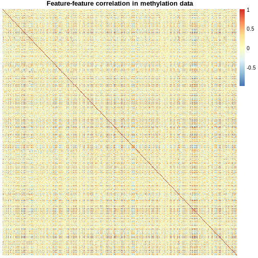
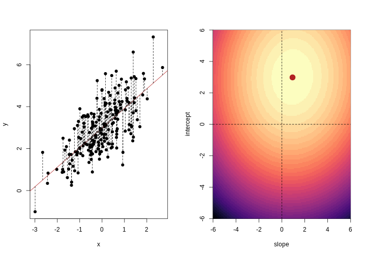
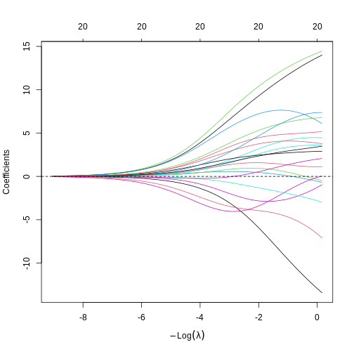
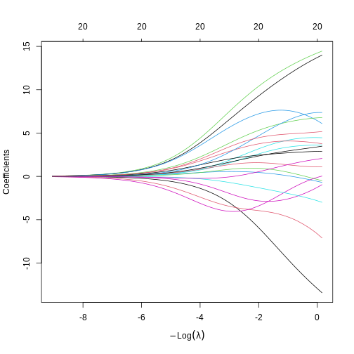
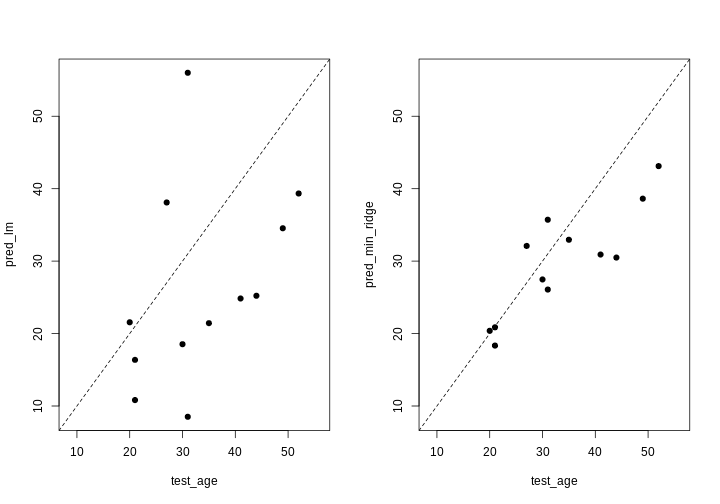
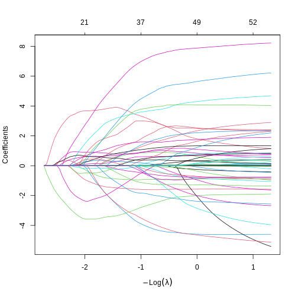
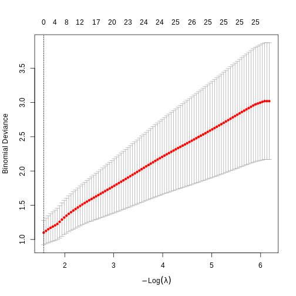

::::::::::::::::::::::::::::::::::::::: objectives

- Understand the benefits of regularised models.
- Understand how different types of regularisation work.
- Apply and critically analyse regularised regression models.

::::::::::::::::::::::::::::::::::::::::::::::::::

:::::::::::::::::::::::::::::::::::::::: questions

- What is regularisation?
- How does regularisation work?
- How can we select the level of regularisation for a model?

::::::::::::::::::::::::::::::::::::::::::::::::::


## Introduction

This episode is about **regularisation**, also called **regularised regression**
or **penalised regression**. This approach can be used for prediction and for
feature selection and it is particularly useful when dealing with high-dimensional data.

One reason that we need special statistical tools for high-dimensional data is
that standard linear models cannot handle high-dimensional data sets -- one cannot fit
a linear model where there are more features (predictor variables) than there are observations
(data points). In the previous lesson, we dealt with this problem by fitting individual
models for each feature and sharing information among these models. Now we will
take a look at an alternative approach that can be used to fit models with more
features than observations by stabilising coefficient estimates. This approach is called
regularisation. Compared to many other methods, regularisation is also often very fast
and can therefore be extremely useful in practice.

First, let us check out what happens if we try to fit a linear model to high-dimensional
data! We start by reading in the [`methylation`](https://carpentries-incubator.github.io/high-dimensional-stats-r/data/index.html)
data from the last lesson:


``` r
library("SummarizedExperiment")
```

``` output
Loading required package: MatrixGenerics
```

``` output
Loading required package: matrixStats
```

``` output

Attaching package: 'MatrixGenerics'
```

``` output
The following objects are masked from 'package:matrixStats':

    colAlls, colAnyNAs, colAnys, colAvgsPerRowSet, colCollapse,
    colCounts, colCummaxs, colCummins, colCumprods, colCumsums,
    colDiffs, colIQRDiffs, colIQRs, colLogSumExps, colMadDiffs,
    colMads, colMaxs, colMeans2, colMedians, colMins, colOrderStats,
    colProds, colQuantiles, colRanges, colRanks, colSdDiffs, colSds,
    colSums2, colTabulates, colVarDiffs, colVars, colWeightedMads,
    colWeightedMeans, colWeightedMedians, colWeightedSds,
    colWeightedVars, rowAlls, rowAnyNAs, rowAnys, rowAvgsPerColSet,
    rowCollapse, rowCounts, rowCummaxs, rowCummins, rowCumprods,
    rowCumsums, rowDiffs, rowIQRDiffs, rowIQRs, rowLogSumExps,
    rowMadDiffs, rowMads, rowMaxs, rowMeans2, rowMedians, rowMins,
    rowOrderStats, rowProds, rowQuantiles, rowRanges, rowRanks,
    rowSdDiffs, rowSds, rowSums2, rowTabulates, rowVarDiffs, rowVars,
    rowWeightedMads, rowWeightedMeans, rowWeightedMedians,
    rowWeightedSds, rowWeightedVars
```

``` output
Loading required package: GenomicRanges
```

``` output
Loading required package: stats4
```

``` output
Loading required package: BiocGenerics
```

``` output

Attaching package: 'BiocGenerics'
```

``` output
The following objects are masked from 'package:stats':

    IQR, mad, sd, var, xtabs
```

``` output
The following objects are masked from 'package:base':

    anyDuplicated, aperm, append, as.data.frame, basename, cbind,
    colnames, dirname, do.call, duplicated, eval, evalq, Filter, Find,
    get, grep, grepl, intersect, is.unsorted, lapply, Map, mapply,
    match, mget, order, paste, pmax, pmax.int, pmin, pmin.int,
    Position, rank, rbind, Reduce, rownames, sapply, saveRDS, setdiff,
    table, tapply, union, unique, unsplit, which.max, which.min
```

``` output
Loading required package: S4Vectors
```

``` output

Attaching package: 'S4Vectors'
```

``` output
The following object is masked from 'package:utils':

    findMatches
```

``` output
The following objects are masked from 'package:base':

    expand.grid, I, unname
```

``` output
Loading required package: IRanges
```

``` output
Loading required package: GenomeInfoDb
```

``` output
Loading required package: Biobase
```

``` output
Welcome to Bioconductor

    Vignettes contain introductory material; view with
    'browseVignettes()'. To cite Bioconductor, see
    'citation("Biobase")', and for packages 'citation("pkgname")'.
```

``` output

Attaching package: 'Biobase'
```

``` output
The following object is masked from 'package:MatrixGenerics':

    rowMedians
```

``` output
The following objects are masked from 'package:matrixStats':

    anyMissing, rowMedians
```

``` warning
Warning: replacing previous import 'S4Arrays::makeNindexFromArrayViewport' by
'DelayedArray::makeNindexFromArrayViewport' when loading 'SummarizedExperiment'
```

``` r
methylation <- readRDS("data/methylation.rds")

## here, we transpose the matrix to have features as rows and samples as columns
methyl_mat <- t(assay(methylation))
age <- methylation$Age
```

Then, we try to fit a model with outcome age and all 5,000 features in this
dataset as predictors (average methylation levels, M-values, across different
sites in the genome).


``` r
# by using methyl_mat in the formula below, R will run a multivariate regression
# model in which each of the columns in methyl_mat is used as a predictor. 
fit <- lm(age ~ methyl_mat)
summary(fit)
```

``` output

Call:
lm(formula = age ~ methyl_mat)

Residuals:
ALL 37 residuals are 0: no residual degrees of freedom!

Coefficients: (4964 not defined because of singularities)
                          Estimate Std. Error t value Pr(>|t|)
(Intercept)               2640.474        NaN     NaN      NaN
methyl_matcg00075967      -108.216        NaN     NaN      NaN
methyl_matcg00374717      -139.637        NaN     NaN      NaN
methyl_matcg00864867        33.102        NaN     NaN      NaN
methyl_matcg00945507        72.250        NaN     NaN      NaN
 [ reached 'max' / getOption("max.print") -- omitted 4996 rows ]

Residual standard error: NaN on 0 degrees of freedom
Multiple R-squared:      1,	Adjusted R-squared:    NaN 
F-statistic:   NaN on 36 and 0 DF,  p-value: NA
```

You can see that we're able to get some effect size estimates, but they seem very
high! The summary also says that we were unable to estimate
effect sizes for 4,964 features
because of "singularities". We clarify what singularities are in the note below
but this means that R couldn't find a way to
perform the calculations necessary to fit the model. Large effect sizes and singularities are common
when naively fitting linear regression models with a large number of features (i.e., to high-dimensional data),
often since the model cannot distinguish between the effects of many, correlated features or
when we have more features than observations.

:::::::::::::::::::::::::::::::::::::::::  callout

### Singularities

The message that `lm()` produced is not necessarily the most intuitive. What
are "singularities" and why are they an issue? A singular matrix
is one that cannot be
[inverted](https://en.wikipedia.org/wiki/Invertible_matrix). R uses
inverse operations to fit linear models (find the coefficients) using:

$$
(X^TX)^{-1}X^Ty,
$$

where $X$ is a matrix of predictor features and $y$ is the outcome vector.
Thus, if the matrix $X^TX$ cannot be inverted to give $(X^TX)^{-1}$, R
cannot fit the model and returns the error that there are singularities.

Why might R be unable to calculate $(X^TX)^{-1}$ and return the error that there are singularities?
Well, when the [determinant](https://en.wikipedia.org/wiki/Determinant)
of the matrix is zero, we are unable to find its inverse. The determinant
of the matrix is zero when there are more features than observations or often when
the features are highly correlated.


``` r
xtx <- t(methyl_mat) %*% methyl_mat
det(xtx)
```

``` output
[1] 0
```

::::::::::::::::::::::::::::::::::::::::::::::::::

:::::::::::::::::::::::::::::::::::::::::  callout

### Correlated features -- common in high-dimensional data

In high-dimensional datasets, there
are often multiple features that contain redundant information (correlated features).
If we visualise the level of
correlation between sites in the `methylation` dataset, we can see that many
of the features represent the same information - there are many
off-diagonal cells, which are deep red or blue. For example, the following
heatmap visualises the correlations for the first 500 features in the
`methylation` dataset (we selected 500 features only as it can be hard to
visualise patterns when there are too many features!).


``` r
library("pheatmap")
small <- methyl_mat[, 1:500]
cor_mat <- cor(small)
pheatmap(cor_mat,
         main = "Feature-feature correlation in methylation data",
         legend_title = "Pearson correlation",
         cluster_rows = FALSE, 
         cluster_cols = FALSE,
         show_rownames = FALSE, 
         show_colnames = FALSE)
```

<div class="figure" style="text-align: center">

<p class="caption">Heatmap of pairwise feature-feature correlations between CpG sites in DNA methylation data</p>
</div>

::::::::::::::::::::::::::::::::::::::::::::::::::

:::::::::::::::::::::::::::::::::::::::  challenge

### Challenge 1

Consider or discuss in groups:

1. Why would we observe correlated features in high-dimensional biological
  data?
2. Why might correlated features be a problem when fitting linear models?
3. What issue might correlated features present when selecting features to include in a model one at a time?

:::::::::::::::  solution

### Solution

1. Many of the features in biological data represent very similar
  information biologically. For example, sets of genes that form complexes
  are often expressed in very similar quantities. Similarly, methylation
  levels at nearby sites are often very highly correlated.
2. Correlated features can make inference unstable or even impossible
  mathematically.
3. When we are selecting features one at a time we want to pick the most predictive feature each time.
  When a lot of features are very similar but encode
  slightly different information, which of the correlated features we
  select to include can have a huge impact on the later stages of model selection!

:::::::::::::::::::::::::

::::::::::::::::::::::::::::::::::::::::::::::::::

Regularisation can help us to deal with correlated features, as well as effectively reduce
the number of features in our model. Before we describe regularisation, let's recap what's
going on when we fit a linear model.

## Coefficient estimates of a linear model

When we fit a linear model, we're finding the line through our data that
minimises the sum of the squared residuals. We can think of that as finding
the slope and intercept that minimises the square of the length of the dashed
lines. In this case, the red line in the left panel is the line that
accomplishes this objective, and the red dot in the right panel is the point
that represents this line in terms of its slope and intercept among many
different possible models, where the background colour represents how well
different combinations of slope and intercept accomplish this objective.


``` output
Loading required package: viridisLite
```

<div class="figure" style="text-align: center">

<p class="caption">Illustrative example demonstrated how regression coefficients are inferred under a linear model framework.</p>
</div>

Mathematically, we can write the sum of squared residuals as

$$
\sum_{i=1}^N ( y_i-x'_i\beta)^2
$$

where $\beta$ is a vector of (unknown) covariate effects which we want to learn
by fitting a regression model: the $j$\-th element of $\beta$, which we denote as
$\beta_j$ quantifies the effect of the $j$\-th covariate. For each individual
$i$, $x_i$ is a vector of $j$ covariate values and $y_i$ is the true observed value for
the outcome. The notation $x'_i\beta$ indicates matrix multiplication. In this case, the
result is equivalent to multiplying each element of $x_i$ by its corresponding element in
$\beta$ and then calculating the sum across all of those values. The result of this
product (often denoted by $\hat{y}_i$) is the predicted value of the outcome generated
by the model. As such, $y_i-x'_i\beta$ can be interpreted as the prediction error, also
referred to as model residual. To quantify the total error across all individuals, we sum
the square residuals $( y_i-x'_i\beta)^2$ across all the individuals in our data.

Finding the value of $\beta$ that minimises
the sum above is the line of best fit through our data when considering
this goal of minimising the sum of squared error. However, it is not the only
possible line we could use! For example, we might want to err on the side of
caution when estimating effect sizes (coefficients). That is, we might want to
avoid estimating very large effect sizes.

:::::::::::::::::::::::::::::::::::::::  challenge

### Challenge 2

Discuss in groups:

1. What are we minimising when we fit a linear model?
2. Why are we minimising this objective? What assumptions are we making
  about our data when we do so?

:::::::::::::::  solution

### Solution

1. When we fit a linear model we are minimising the squared error.
  In fact, the standard linear model estimator is often known as
  "ordinary least squares". The "ordinary" really means "original" here,
  to distinguish between this method, which dates back to ~1800, and some
  more "recent" (think 1940s...) methods.
2. Squared error is useful because it ignores the *sign* of the residuals
  (whether they are positive or negative).
  It also penalises large errors much more than small errors.
  On top of all this, it also makes the solution very easy to compute mathematically.
  Least squares assumes that, when we account for the change in the mean of
  the outcome based on changes in the income, the data are normally
  distributed. That is, the *residuals* of the model, or the error
  left over after we account for any linear relationships in the data,
  are normally distributed, and have a fixed variance.

:::::::::::::::::::::::::

::::::::::::::::::::::::::::::::::::::::::::::::::

## Model selection using training and test sets

Sets of models are often compared using statistics such as adjusted $R^2$, AIC or BIC.
These show us how well the model is learning the data used in fitting that same model [^1].
However, these statistics do not really tell us how well the model will generalise to new data.
This is an important thing to  consider -- if our model doesn't generalise to new data,
then there's a chance that it's just picking up on a technical or batch effect
in our data, or simply some noise that happens to fit the outcome we're modelling.
This is especially important when our goal is prediction -- it's not much good
if we can only predict well for samples where the outcome is already known,
after all!

To get an idea of how well our model generalises, we can split the data into
two - a "training" and a "test" set. We use the "training" data to fit the model,
and then see its performance on the "test" data.

<div class="figure" style="text-align: center">

<p class="caption">Schematic representation of how a dataset can be divided into a training and a test set.</p>
</div>

One thing that often happens in this context is that large
coefficient values minimise the training error, but they don't minimise the
test error on unseen data. First, we'll go through an example of what exactly
this means.

To compare the training and test errors for a model of methylation features and age, we'll split the
data into training and test sets, fit a linear model and calculate the errors. First, let's
calculate the training error. Let's start by splitting the data into training and test sets:


``` r
methylation <- readRDS("/data/methylation.rds")
```

``` warning
Warning in gzfile(file, "rb"): cannot open compressed file
'/data/methylation.rds', probable reason 'No such file or directory'
```

``` error
Error in `gzfile()`:
! cannot open the connection
```

``` r
library("SummarizedExperiment")
age <- methylation$Age
methyl_mat <- t(assay(methylation))
```

We will then subset the data to a set of CpG markers that are known to be associated with
age from a previous study by Horvath et al.[^2], described in [data](https://carpentries-incubator.github.io/high-dimensional-stats-r/data/index.html).


``` r
cpg_markers <- c("cg16241714", "cg14424579", "cg22736354", "cg02479575", "cg00864867", 
    "cg25505610", "cg06493994", "cg04528819", "cg26297688", "cg20692569", 
    "cg04084157", "cg22920873", "cg10281002", "cg21378206", "cg26005082", 
    "cg12946225", "cg25771195", "cg26845300", "cg06144905", "cg27377450"
)

horvath_mat <- methyl_mat[, cpg_markers]

## Generate an index to split the data
set.seed(42)
train_ind <- sample(nrow(methyl_mat), 25)

## Split the data 
train_mat <- horvath_mat[train_ind, ]
train_age <- age[train_ind]
test_mat <- horvath_mat[-train_ind, ]
test_age <- age[-train_ind]
```

Now let's fit a linear model to our training data and calculate the training error. Here we use the mean of the squared difference between our predictions and the observed data, or "mean squared error" (MSE).


``` r
## Fit a linear model
# as.data.frame() converts train_mat into a data.frame
# Using the `.` syntax above together with a `data` argument will lead to
# the same result as using `train_age ~ train_mat`: R will fit a multivariate 
# regression model in which each of the columns in `train_mat` is used as 
# a predictor. We opted to use the `.` syntax because it will help us to 
# obtain model predictions using the `predict()` function. 

fit_horvath <- lm(train_age ~ ., data = as.data.frame(train_mat))

## Function to calculate the (mean squared) error
mse <- function(true, prediction) { 
    mean((true - prediction)^2) 
} 

## Calculate the training error 
err_lm_train <- mse(train_age, fitted(fit_horvath)) 
err_lm_train
```

``` output
[1] 1.319628
```

The training error appears very low here -- on average we're only off by
about a year!

:::::::::::::::::::::::::::::::::::::::  challenge

### Challenge 3

For the fitted model above, calculate the mean squared error for the test set.

:::::::::::::::  solution

### Solution

First, let's find the predicted values for the 'unseen' test data:


``` r
pred_lm <- predict(fit_horvath, newdata = as.data.frame(test_mat)) 
```

The mean squared error for the test set is the mean of the squared
error between the predicted values and true test data.


``` r
err_lm <- mse(test_age, pred_lm)
err_lm
```

``` output
[1] 223.3571
```

:::::::::::::::::::::::::

::::::::::::::::::::::::::::::::::::::::::::::::::

Unfortunately, the test error is a lot higher than the training error.
If we plot true age against predicted age for the samples in the test
set, we can gain more insight into the performance of the model on the test set.
Ideally, the predicted values should be close to the test data.


``` r
par(mfrow = c(1, 1))
plot(test_age, pred_lm, pch = 19)
abline(coef = 0:1, lty = "dashed")
```

<div class="figure" style="text-align: center">

<p class="caption">A scatter plot of observed age versus predicted age for individuals in the test set. Each dot represents one individual. Dashed line is used as a reference to indicate how perfect predictions would look (observed = predicted).</p>
</div>

This figure shows the predicted ages obtained from a linear model fit plotted
against the true ages, which we kept in the test dataset. If the prediction were
good, the dots should follow a line. Regularisation can help us to make the
model more generalisable, improving predictions for the test dataset (or any
other dataset that is not used when fitting our model).

## Regularisation

Regularisation can be used to reduce correlation between predictors, the number of features,
and improve generalisability by restricting model parameter estimates. Essentially, we
add another condition to the problem we're solving with linear regression that controls the
total size of the coefficients that come out and shrinks many coefficients to zero (or near zero).

For example, we might say that the point representing the slope and intercept
must fall within a certain distance of the origin, $(0, 0)$.
For the 2-parameter model (slope and intercept), we could
visualise this constraint as a circle with a given radius. We
want to find the "best" solution (in terms of minimising the
residuals) that also falls within a circle of a given radius
(in this case, 2).

<div class="figure" style="text-align: center">

<p class="caption">Illustrative example demonstrated how regression coefficients are inferred under a linear model framework, with (blue line) and without (red line) regularisation. A ridge penalty is used in this example</p>
</div>

## Ridge regression

There are multiple ways to define the distance that our solution must fall in.
The one we've plotted above controls the squared sum of the
coefficients, $\beta$.
This is also sometimes called the $L^2$ norm. This is defined as

$$
\left\lVert \beta\right\lVert_2 = \sqrt{\sum_{j=1}^p \beta_j^2}
$$

To control this, we specify that the solution for the equation above
also has to have an $L^2$ norm smaller than a certain amount. Or, equivalently,
we try to minimise a function that includes our $L^2$ norm scaled by a
factor that is usually written $\lambda$.

$$
\sum_{i=1}^N \biggl( y_i - x'_i\beta\biggr)^2  + \lambda \left\lVert \beta \right\lVert_2 ^2
$$

This type of regularisation is called *ridge regression*.
Another way of thinking about this is that when finding the best model, we're
weighing up a balance of the ordinary least squares objective and a "penalty"
term that punishes models with large coefficients. The balance between the
penalty and the ordinary least squares objective is controlled by $\lambda$ -
when $\lambda$ is large, we want to penalise large coefficients. In other words, we care a lot about the size of the coefficients
and we want to reduce the complexity of our model.
When $\lambda$ is small, we don't really care a lot about shrinking our coefficients and we opt for a more complex model. When it's zero, we're back to
just using ordinary least squares. We see how a penalty term, $\lambda$, might be chosen later in this episode.

For now, to see how regularisation might improve a model, let's fit a model using the same set
of 20 features (stored as `cpg_markers`) selected earlier in this episode (these
are a subset of the features identified by Horvarth et al), using both
regularised and ordinary least squares. To fit regularised regression models, we will use the **`glmnet`** package.


``` r
library("glmnet")
```

``` output
Loading required package: Matrix
```

``` output

Attaching package: 'Matrix'
```

``` output
The following object is masked from 'package:S4Vectors':

    expand
```

``` output
Loaded glmnet 4.1-10
```

``` r
## glmnet() performs scaling by default, supply un-scaled data:
horvath_mat <- methyl_mat[, cpg_markers] # select the same 20 sites as before
train_mat <- horvath_mat[train_ind, ] # use the same individuals as selected before
test_mat <- horvath_mat[-train_ind, ]

ridge_fit <- glmnet(x = train_mat, y = train_age, alpha = 0)
plot(ridge_fit, xvar = "lambda")
abline(h = 0, lty = "dashed")
```

<div class="figure" style="text-align: center">

<p class="caption">A line plot of coefficient estimates against log lambda for a ridge regression model.</p>
</div>

This plot shows how the estimated coefficients for each CpG site change
as we increase the penalty, $\lambda$. That is,
as we decrease the size of the region that solutions can fall into, the values
of the coefficients that we get back tend to decrease. In this case,
coefficients tend towards zero but generally don't reach it until the penalty
gets very large. We can see that initially, some parameter estimates are really,
really large, and these tend to shrink fairly rapidly.

We can also notice that some parameters "flip signs"; that is, they start off
positive and become negative as lambda grows. This is a sign of collinearity,
or correlated predictors. As we reduce the importance of one feature, we can
"make up for" the loss in accuracy from that one feature by adding a bit of
weight to another feature that represents similar information.

Since we split the data into test and training data, we can prove that ridge
regression predicts the test data better than the model with no regularisation.
Let's generate our predictions under the ridge regression model and calculate
the mean squared error in the test set:


``` r
# Obtain a matrix of predictions from the ridge model,
# where each column corresponds to a different lambda value
pred_ridge <- predict(ridge_fit, newx = test_mat)

# Calculate MSE for every column of the prediction matrix against the vector of true ages
err_ridge <- apply(pred_ridge, 2, function(col) mse(test_age, col)) 
min_err_ridge <- min(err_ridge)

# Identify the lambda value that results in the lowest MSE (ie, the "best" lambda value)
which_min_err <- which.min(err_ridge)
pred_min_ridge <- pred_ridge[, which_min_err]

## Return errors
min_err_ridge
```

``` output
[1] 46.76802
```

This is much lower than the test error for the model without regularisation:


``` r
err_lm  
```

``` output
[1] 223.3571
```

We can see where on the continuum of lambdas we've picked a model by plotting
the coefficient paths again. In this case, we've picked a model with fairly
modest coefficient shrinking.


``` r
chosen_lambda <- ridge_fit$lambda[which.min(err_ridge)]
plot(ridge_fit, xvar = "lambda")
abline(v = log(chosen_lambda), lty = "dashed")
```

<div class="figure" style="text-align: center">

<p class="caption">A line plot of coefficient estimates against log lambda for a ridge regression model, showing the optimal value based on the minimal test error.</p>
</div>

:::::::::::::::::::::::::::::::::::::::  challenge

### Challenge 4

1. Which performs better, ridge or OLS?
2. Plot predicted ages for each method against the true ages.
  How do the predictions look for both methods? Why might ridge be
  performing better?

:::::::::::::::  solution

### Solution

1. Ridge regression performs significantly better on unseen data, despite
  being "worse" on the training data.
  
  ``` r
  min_err_ridge
  ```
  
  ``` output
  [1] 46.76802
  ```
  
  ``` r
  err_lm
  ```
  
  ``` output
  [1] 223.3571
  ```
2. The ridge ones are much less spread out with far fewer extreme predictions.
  
  ``` r
  all <- c(pred_lm, test_age, pred_min_ridge)
  lims <- range(all)
  par(mfrow = 1:2)
  plot(test_age, pred_lm,
      xlim = lims, ylim = lims,
      pch = 19
  )
  abline(coef = 0:1, lty = "dashed")
  plot(test_age, pred_min_ridge,
      xlim = lims, ylim = lims,
      pch = 19
  )
  abline(coef = 0:1, lty = "dashed")
  ```
  
  <div class="figure" style="text-align: center">
  
  <p class="caption">Two plots showing OLS predictions (left) and ridge regression predictions (right) of age (y) against true age (x).</p>
  </div>

:::::::::::::::::::::::::

::::::::::::::::::::::::::::::::::::::::::::::::::

## LASSO regression

*LASSO* is another type of regularisation. In this case we use the $L^1$ norm,
or the sum of the absolute values of the coefficients.

$$
\left\lVert \beta \right\lVert_1 = \sum_{j=1}^p |\beta_j|
$$

This tends to produce sparse models; that is to say, it tends to remove features
from the model that aren't necessary to produce accurate predictions. This
is because the region we're restricting the coefficients to has sharp edges.
So, when we increase the penalty (reduce the norm), it's more likely that
the best solution that falls in this region will be at the corner of this
diagonal (i.e., one or more coefficient is exactly zero).

<div class="figure" style="text-align: center">

<p class="caption">Illustrative example demonstrated how regression coefficients are inferred under a linear model framework, with (blue line) and without (red line) regularisation. A LASSO penalty is used in this example.</p>
</div>

:::::::::::::::::::::::::::::::::::::::  challenge

### Challenge 5

1. Use `glmnet()` to fit a LASSO model (hint: set `alpha = 1`).
2. Plot the model object. Remember that for ridge regression,
  we set `xvar = "lambda"`. What if you don't set this? What's the
  relationship between the two plots?
3. How do the coefficient paths differ to the ridge case?

:::::::::::::::  solution

### Solution

1. Fitting a LASSO model is very similar to a ridge model, we just need
  to change the `alpha` setting.
  
  
  ``` r
  fit_lasso <- glmnet(x = methyl_mat, y = age, alpha = 1)
  ```

2. When `xvar = "lambda"`, the x-axis represents increasing model sparsity
  from left to right, because increasing lambda increases the penalty added
  to the coefficients. When we instead plot the L1 norm on the x-axis,
  increasing L1 norm means that we are allowing our
  coefficients to take on increasingly large values.
  
  
  ``` r
  par(mfrow = c(1, 2))
  plot(fit_lasso, xvar = "lambda")
  plot(fit_lasso)
  ```
  
  <div class="figure" style="text-align: center">
  
  <p class="caption">Line plots showing coefficient values from a LASSO model against log lambda (left) and L1 norm (right).</p>
  </div>

3. When using LASSO, the paths tend to go to exactly zero much more as the
  penalty ($ \\lambda $) increases.
  In the ridge case, the paths tend towards zero but less commonly reach exactly zero.

:::::::::::::::::::::::::

::::::::::::::::::::::::::::::::::::::::::::::::::

## Cross-validation to find the best value of $\lambda$

Ideally, we want $\lambda$ to be large enough to reduce the complexity of
our model, thus reducing the number of and correlations between the features, and improving generalisability. However,
we don't want the value of $\lambda$ to be so large that we lose a lot of the valuable information in the features.

Various methods can be used to balance this trade-off and thus select the "best"
value for $\lambda$. One method splits
the data into $K$ chunks. We then use $K-1$ of
these as the training set, and the remaining $1$ chunk
as the test set. We can repeat this until we've rotated through all $K$ chunks,
giving us a good estimate of how well each of the lambda values work in our
data. This is called cross-validation, and doing this repeated test/train split
gives us a better estimate of how generalisable our model is.

<div class="figure" style="text-align: center">

<p class="caption">Schematic representiation of a $K$-fold cross-validation procedure.</p>
</div>

We can use this new idea to choose a lambda value by finding the lambda
that minimises the error across each of the test and training splits. In R:


``` r
# fit lasso model with cross-validation across a range of lambda values
lasso <- cv.glmnet(methyl_mat, age, alpha = 1)
plot(lasso)
```

<div class="figure" style="text-align: center">

<p class="caption">Cross-validated mean squared error for different values of lambda under a LASSO penalty.</p>
</div>

``` r
# Extract the coefficients from the model with the lowest mean squared error from cross-validation
coefl <- coef(lasso, lasso$lambda.min)
# select only non-zero coefficients
selection <- which(coefl != 0)
# and convert to a normal matrix
selected_coefs <- as.matrix(coefl)[selection, 1]
selected_coefs
```

``` output
  (Intercept)    cg02388150    cg06493994    cg22449114    cg22736354 
-8.4133296328  0.6966503392  0.1615535465  6.4255580409 12.0507794749 
   cg03330058    cg09809672    cg11299964    cg19761273    cg26162695 
-0.0002362055 -0.7487594618 -2.0399663416 -5.2538055304 -0.4486970332 
   cg09502015    cg24771684    cg08446924    cg13215762    cg24549277 
 1.0787003366  4.5743800395 -0.5960137381  0.1481402638  0.6290915767 
   cg12304482    cg13131095    cg17962089    cg13842639    cg04080666 
-1.0167896196  2.8860222552  6.3065284096  0.1590465147  2.4889065761 
   cg06147194    cg03669936    cg14230040    cg19848924    cg23964682 
-0.6838637838 -0.0352696698  0.1280760909 -0.0006938337  1.3378854603 
   cg13578928    cg02745847    cg17410295    cg17459023    cg06223736 
-0.8601170264  2.2346315955 -2.3008028295  0.0370389967  1.6158734083 
   cg06717750    cg20138604    cg12851161    cg20972027    cg23878422 
 2.3401693309  0.0084327521 -3.3033355652  0.2442751682  1.1059030593 
   cg16612298    cg03762081    cg14428146    cg16908369    cg16271524 
 0.0050053190 -6.5228858163  0.3167227488  0.2302773154 -1.3787104336 
   cg22071651    cg04262805    cg24969251    cg11233105    cg03156032 
 0.3480551279  1.1841804186  8.3024629942  0.6130598151 -1.1121959544 
```

We can see that cross-validation has selected a value of $\lambda$ resulting in 44 features and the intercept.

## Elastic nets: blending ridge regression and the LASSO

So far, we've used ridge regression (where `alpha = 0`) and LASSO regression,
(where `alpha = 1`). What if `alpha` is set to a value between zero and one?
Well, this actually lets us blend the properties of ridge and LASSO
regression. This allows us to have the nice properties of the LASSO, where
uninformative variables are dropped automatically, and the nice properties
of ridge regression, where our coefficient estimates are a bit more
conservative, and as a result our predictions are a bit better.

Formally, the objective function of elastic net regression is to optimise the
following function:

$$
\left(\sum_{i=1}^N y_i - x'_i\beta\right)
+ \lambda \left(
\alpha \left\lVert \beta \right\lVert_1 +
(1-\alpha)  \left\lVert \beta \right\lVert_2
\right)
$$

You can see that if `alpha = 1`, then the L1 norm term is multiplied by one,
and the L2 norm is multiplied by zero. This means we have pure LASSO regression.
Conversely, if `alpha = 0`, the L2 norm term is multiplied by one, and the L1
norm is multiplied by zero, meaning we have pure ridge regression. Anything
in between gives us something in between.

The contour plots we looked at previously to visualise what this penalty looks
like for different values of `alpha`.

<div class="figure" style="text-align: center">

<p class="caption">For an elastic net, the panels show the effect of the regularisation across different values of alpha</p>
</div>

:::::::::::::::::::::::::::::::::::::::  challenge

### Challenge 6

1. Fit an elastic net model (hint: alpha = 0.5) without cross-validation and plot the model
  object.
2. Fit an elastic net model with cross-validation and plot the error. Compare
  with LASSO.
3. Select the lambda within one standard error of
  the minimum cross-validation error (hint: `lambda.1se`). Compare the
  coefficients with the LASSO model.
4. Discuss: how could we pick an `alpha` in the range (0, 1)? Could we justify
  choosing one *a priori*?

:::::::::::::::  solution

### Solution

1. Fitting an elastic net model is just like fitting a LASSO model.
  You can see that coefficients tend to go exactly to zero,
  but the paths are a bit less
  extreme than with pure LASSO; similar to ridge.
  
  ``` r
  elastic <- glmnet(methyl_mat[, -1], age, alpha = 0.5)
  plot(elastic)
  ```
  
  <div class="figure" style="text-align: center">
  
  <p class="caption">Line plot showing coefficient values from an elastic net model against L1 norm.</p>
  </div>
2. The process of model selection is similar for elastic net models as for
  LASSO models.
  
  ``` r
  elastic_cv <- cv.glmnet(methyl_mat[, -1], age, alpha = 0.5)
  plot(elastic_cv)
  ```
  
  <div class="figure" style="text-align: center">
  
  <p class="caption">A plot of the cross-validation mean squared error of an elastic net model against log lambda.</p>
  </div>
3. You can see that the coefficients from these two methods are broadly
  similar, but the elastic net coefficients are a bit more conservative.
  Further, more coefficients are exactly zero in the LASSO model.
  
  ``` r
  coefe <- coef(elastic_cv, elastic_cv$lambda.1se)
  sum(coefe[, 1] == 0)
  ```
  
  ``` output
  [1] 4973
  ```
  
  ``` r
  sum(coefl[, 1] == 0)
  ```
  
  ``` output
  [1] 4956
  ```
  
  ``` r
  plot(
      coefl[, 1], coefe[, 1],
      pch = 16,
      xlab = "LASSO coefficients",
      ylab = "Elastic net coefficients"
  )
  ```
  
  ``` error
  Error in `xy.coords()`:
  ! 'x' and 'y' lengths differ
  ```
  
  ``` r
  abline(0:1, lty = "dashed")
  ```
  
  ``` error
  Error in `int_abline()`:
  ! plot.new has not been called yet
  ```
4. You could pick an arbitrary value of `alpha`, because arguably pure ridge
  regression or pure LASSO regression are also arbitrary model choices.
  To be rigorous and to get the best-performing model and the best
  inference about predictors, it's usually best to find the best
  combination of `alpha` and `lambda` using a grid search approach
  in cross-validation. However, this can be very computationally demanding.
  
  

:::::::::::::::::::::::::

::::::::::::::::::::::::::::::::::::::::::::::::::

:::::::::::::::::::::::::::::::::::::::::  callout

### The bias-variance tradeoff

When we make predictions in statistics, there are two sources of error
that primarily influence the (in)accuracy of our predictions. these are *bias*
and *variance*.

The total expected error in our predictions is given by the following
equation:

$$
E(y - \hat{y}) = \text{Bias}^2 + \text{Variance} + \sigma^2
$$

Here, $\sigma^2$ represents the irreducible error, that we can never overcome.
Bias results from erroneous assumptions in the model used for predictions.
Fundamentally, bias means that our model is mis-specified in some way,
and fails to capture some components of the data-generating process
(which is true of all models). If we have failed to account for a confounding
factor that leads to very inaccurate predictions in a subgroup of our
population, then our model has high bias.

Variance results from sensitivity to particular properties of the input data.
For example, if a tiny change to the input data would result in a huge change
to our predictions, then our model has high variance.

Linear regression is an unbiased model under certain conditions.
In fact, the [Gauss-Markov theorem](https://en.wikipedia.org/wiki/Gauss%E2%80%93Markov_theorem)
shows that under the right conditions, OLS is the best possible type of
unbiased linear model.

Introducing penalties to means that our model is no longer unbiased, meaning
that the coefficients estimated from our data will systematically deviate
from the ground truth. Why would we do this? As we saw, the total error is
a function of bias and variance. By accepting a small amount of bias, it's
possible to achieve huge reductions in the total expected error.

This bias-variance tradeoff is also why people often favour elastic net
regression over pure LASSO regression.

::::::::::::::::::::::::::::::::::::::::::::::::::

:::::::::::::::::::::::::::::::::::::::::  callout

### Other types of outcomes

You may have noticed that `glmnet` is written as `glm`, not `lm`.
This means we can actually model a variety of different outcomes
using this regularisation approach. For example, we can model binary
variables using logistic regression, as shown below. The type of outcome
can be specified using the `family` argument, which specifies the family
of the outcome variable.

In fact, `glmnet` is somewhat cheeky as it also allows you to model
survival using Cox proportional hazards models, which aren't GLMs, strictly
speaking.

For example, in the current dataset we can model smoking status as a binary
variable in logistic regression by setting `family = "binomial"`.

The [package documentation](https://glmnet.stanford.edu/articles/glmnet.html)
explains this in more detail.


``` r
smoking <- as.numeric(factor(methylation$smoker)) - 1
# binary outcome
table(smoking)
```

``` output
smoking
 0  1 
30  7 
```

``` r
fit <- cv.glmnet(x = methyl_mat, nfolds = 5, y = smoking, family = "binomial")
```

``` warning
Warning in lognet(x, is.sparse, y, weights, offset, alpha, nobs, nvars, : one
multinomial or binomial class has fewer than 8 observations; dangerous ground
Warning in lognet(x, is.sparse, y, weights, offset, alpha, nobs, nvars, : one
multinomial or binomial class has fewer than 8 observations; dangerous ground
Warning in lognet(x, is.sparse, y, weights, offset, alpha, nobs, nvars, : one
multinomial or binomial class has fewer than 8 observations; dangerous ground
Warning in lognet(x, is.sparse, y, weights, offset, alpha, nobs, nvars, : one
multinomial or binomial class has fewer than 8 observations; dangerous ground
Warning in lognet(x, is.sparse, y, weights, offset, alpha, nobs, nvars, : one
multinomial or binomial class has fewer than 8 observations; dangerous ground
Warning in lognet(x, is.sparse, y, weights, offset, alpha, nobs, nvars, : one
multinomial or binomial class has fewer than 8 observations; dangerous ground
```

``` r
coef <- coef(fit, s = fit$lambda.min)
coef <- as.matrix(coef)
coef[which(coef != 0), 1]
```

``` output
[1] -1.455287
```

``` r
plot(fit)
```

<div class="figure" style="text-align: center">

<p class="caption">A plot of the cross-validation binomial deviance of a logistic regression elastic net model against log lambda.</p>
</div>

In this case, the results aren't very interesting! We select an intercept-only
model. However, as highlighted by the warnings above, we should not trust this
result too much as the data was too small to obtain reliable results! We only
included it here to provide the code that *could* be used to perform penalised
regression for binary outcomes (i.e. penalised logistic regression).


::::::::::::::::::::::::::::::::::::::::::::::::::

:::::::::::::::::::::::::::::::::::::::::  callout

### tidymodels

A lot of the packages for fitting predictive models like regularised
regression have different user interfaces. To do predictive modelling, it's
important to consider things like choosing a good performance metric and
how to run normalisation. It's also useful to compare different
model "engines".

To this end, the **`tidymodels`** R framework exists. We're not doing a course on
advanced topics in predictive modelling so we are not covering this framework
in detail. However, the code below would be useful to perform repeated
cross-validation. More information about **`tidymodels`**, including installation
instructions, can be found [on the tidymodels website](https://www.tidymodels.org/).


``` r
library("tidymodels")
all_data <- as.data.frame(cbind(age = age, methyl_mat))
split_data <- initial_split(all_data)

norm_recipe <- recipe(training(split_data)) %>%
    ## everything other than age is a predictor
    update_role(everything(), new_role = "predictor") %>%
    update_role(age, new_role = "outcome") %>%
    ## center and scale all the predictors
    step_center(all_predictors()) %>%
    step_scale(all_predictors()) 

## set the "engine" to be a linear model with tunable alpha and lambda
glmnet_model <- linear_reg(penalty = tune(), mixture = tune()) %>% 
    set_engine("glmnet")

## define a workflow, with normalisation recipe into glmnet engine
workflow <- workflow() %>%
    add_recipe(norm_recipe) %>%
    add_model(glmnet_model)

## 5-fold cross-validation repeated 5 times
folds <- vfold_cv(training(split_data), v = 5, repeats = 5)

## define a grid of lambda and alpha parameters to search
glmn_set <- parameters(
    penalty(range = c(-5, 1), trans = log10_trans()),
    mixture()
)
glmn_grid <- grid_regular(glmn_set)
ctrl <- control_grid(save_pred = TRUE, verbose = TRUE)

## use the metric "rmse" (root mean squared error) to grid search for the
## best model
results <- workflow %>%
    tune_grid(
        resamples = folds,
        metrics = metric_set(rmse),
        control = ctrl
    )
## select the best model based on RMSE
best_mod <- results %>% select_best("rmse")
best_mod
## finalise the workflow and fit it with all of the training data
final_workflow <- finalize_workflow(workflow, best_mod)
final_workflow
final_model <- final_workflow %>%
    fit(data = training(split_data))

## plot predicted age against true age for test data
plot(
    testing(split_data)$age,
    predict(final_model, new_data = testing(split_data))$.pred,
    xlab = "True age",
    ylab = "Predicted age",
    pch = 16,
    log = "xy"
)
abline(0:1, lty = "dashed")
```

::::::::::::::::::::::::::::::::::::::::::::::::::

## Further reading

- [An introduction to statistical learning](https://www.statlearning.com/).
- [Elements of statistical learning](https://web.stanford.edu/~hastie/ElemStatLearn/).
- [glmnet vignette](https://glmnet.stanford.edu/articles/glmnet.html).
- [tidymodels](https://www.tidymodels.org/).

## Footnotes

[^1]: Model selection including $R^2$, AIC and BIC are covered in the additional feature selection for regression episode of this course.
[^2]: [Epigenetic Predictor of Age, Bocklandt et al. (2011)](https://journals.plos.org/plosone/article?id=10.1371/journal.pone.0014821)


:::::::::::::::::::::::::::::::::::::::: keypoints

- Regularisation is a way to fit a model, get better estimates of effect sizes, and perform variable selection simultaneously.
- Test and training splits, or cross-validation, are a useful way to select models or hyperparameters.
- Regularisation can give us a more predictive set of variables, and by restricting the magnitude of coefficients, can give us a better (and more stable) estimate of our outcome.
- Regularisation is often *very* fast! Compared to other methods for variable selection, it is very efficient. This makes it easier to practice rigorous variable selection.

::::::::::::::::::::::::::::::::::::::::::::::::::


