---
# Please do not edit this file directly; it is auto generated.
# Instead, please edit 02-high-dimensional-regression.md in _episodes_rmd/
title: "Regression with many features"
teaching: 60
exercises: 30
questions:
- "How can we apply regression methods in a high-dimensional setting?"
- "How can we control for the fact that we do many tests?"
- "How can we benefit from the fact that we have many variables?"
objectives:
- "Perform and critically analyse high dimensional regression."
- "Perform multiple testing adjustment."
- "Understand methods for shrinkage of noise parameters in
  high-dimensional regression."
keypoints:
- "Running many tests with high-dimensional data requires us to pay attention to 
   ..."
- "Multiple testing correction can enable us to account for many null hypothesis
    significance tests while retaining power."
- "Sharing information between features can increase power and reduce false 
    positives."
math: yes
---

# Problem statement

In high-throughput studies, it's common to have one or more 
phenotypes or groupings that we want to relate to features of 
interest (eg, gene expression, DNA methylation levels).
In general, we want to identify differences in the 
features of interest
that are related to a phenotype or grouping of our samples.
Identifying features of interest that vary along with
phenotypes or groupings can allow us to understand how
phenotypes arise or manifest.

For example, we might want to identify genes that are
expressed at a higher level in mutant mice relative
to wild-type mice to understand the effect
of a mutation on cellular phenotypes.
Alternatively, we might have
samples from a set of patients, and wish to identify
epigenetic features that are different in young patients
relative to old patients, to help us understand how aging
manifests.

Using linear regression, it's possible to identify differences
like these . However, high-dimensional data like the ones we're
working with require some special considerations.

Ideally, we want to identify cases like this, where there is a
clear difference, and we probably "don't need" statistics:
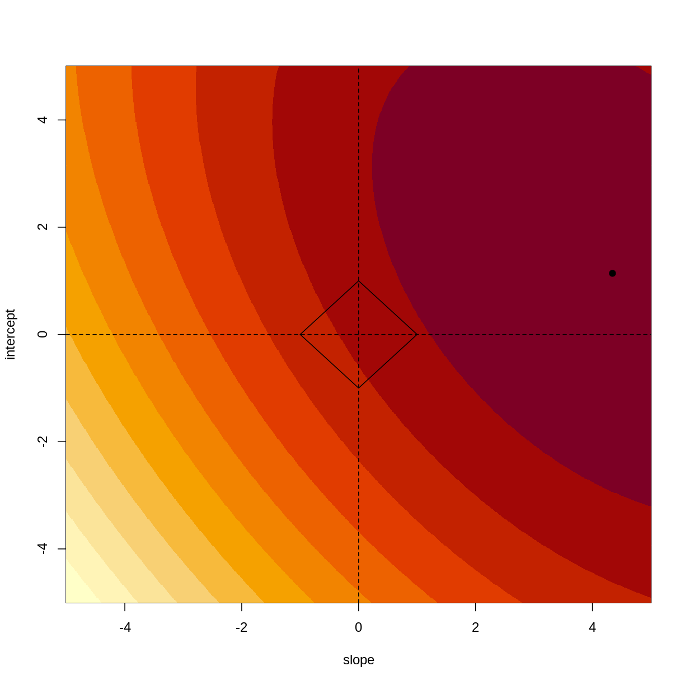

or equivalently for a discrete covariate:

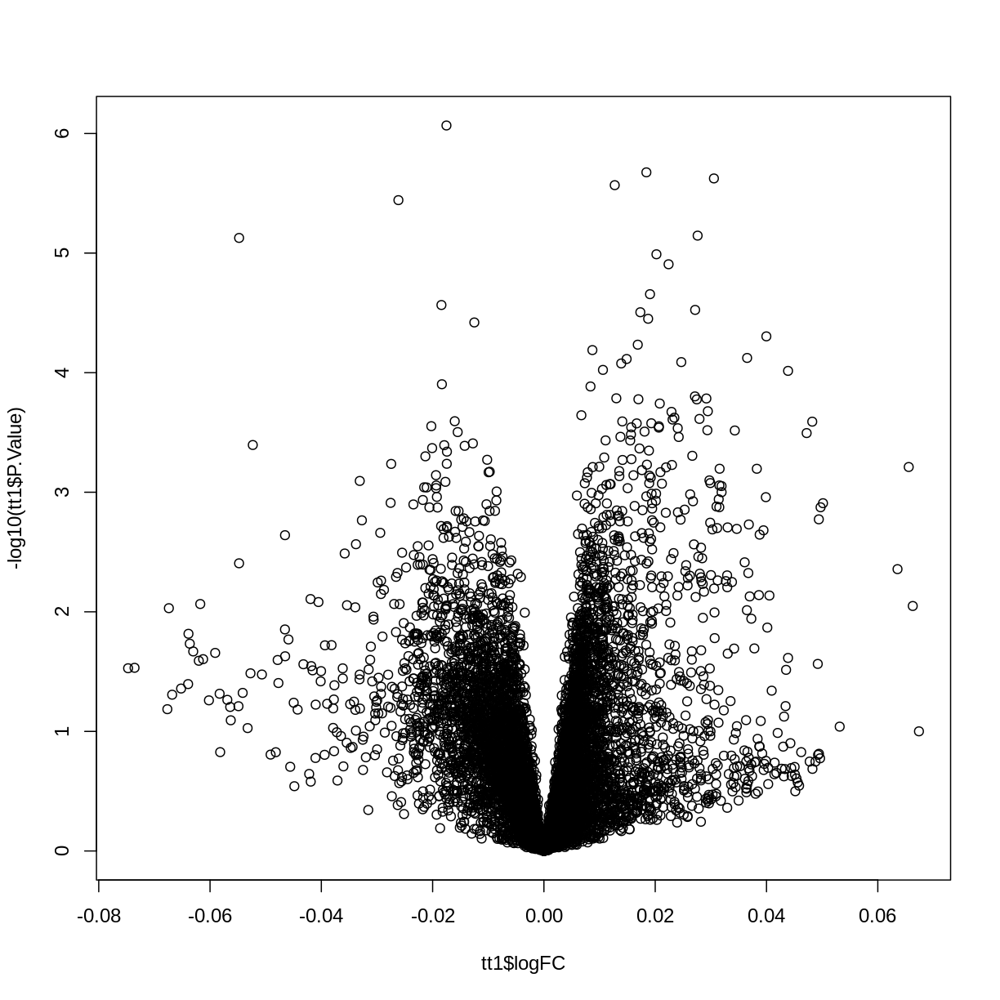

However, often due to small differences and small sample sizes,
the problem is a bit more difficult:
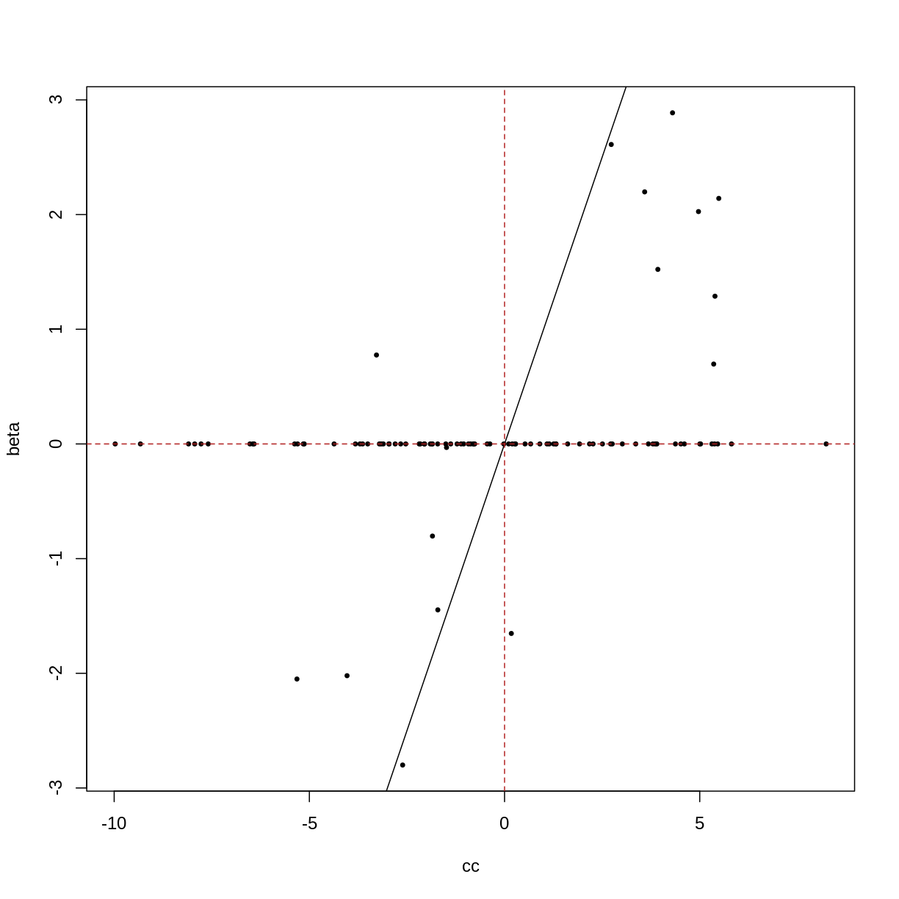

And, of course, we often have an awful lot of features and need
to prioritise a subset of them! We need a rigorous way to
prioritise genes for further analysis.

# Linear regression (recap)

Linear regression is a tool we can use to quantify the relationship
between two variables. With one predictor variable $x$,
it amounts to the following equation:

$$
    y_i = \beta_0 + \beta_1 x_i + \epsilon_i
$$

where $\epsilon_i$ is the *noise*, or the variation in $y$ that isn't explained
by the relationship we're modelling. We assume this noise follows a normal
distribution[^1], that is:

$$
    \epsilon_i \sim N(0, \sigma^2)
$$

We can also write this using linear algebra (matrices and vectors) as follows: 

$$
    y = X\beta + \epsilon
$$

Another way of saying this is that y follows a normal distribution with

$$
    y \sim N(X\beta, \sigma^2)
$$

Or, visually, that (for example) this is the distribution 
of new points conditional on their $x$ values:

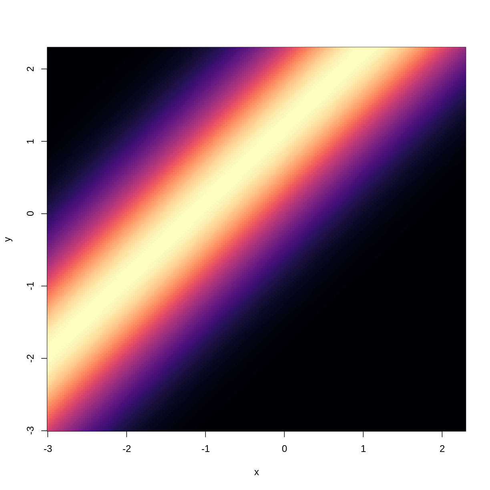

In order to decide whether a result would be unlikely
under the null hypothesis, we can calculate a test statistic.
For coefficient $j$ in a linear model, the test statistic is
a t-statistic given by:

$$
    t_{j} = \frac{\hat{\beta}_{j}}{SE\left(\hat{\beta}_{j}\right)}
$$

$SE\left(\hat{\beta}_{j}\right)$ measures the uncertainty we have in our effect
size estimate.

Knowing what distribution these t-values follow under the null
hypothesis allows us to determine how unlikely it would be for
us to observe what we have under those circumstances (the basis
of null hypothesis significance testing).

> ## Exercise
>
>
> Launch `shinystats::regressionApp` and adjust the parameters.
> 
> 1. If the noise parameter is small (eg, 0.5), how small an effect is significant?
>    If the noise parameter is large (eg, 5), how big must an effect be?
> 2. With a small number of observations (eg, 10), how strong does the relationship 
>    need to be (or how small the noise) before it is significant?
> 3. With a large number of observations (eg, 1000), how weak of an effect can you 
>    detect? Is a really small effect (0.1 slope) really "significant" in the way 
>    you'd use that word conversationally?
>
> > ## Solution
> > 1. 
> >    
> >    ~~~
> >    n <- 100
> >    noise_sd <- 0.5
> >    x <- rnorm(n)
> >    beta <- c(0.2, 0.2)
> >    X <- cbind(1, x)
> >    y <- rnorm(n, X %*% beta, sd = noise_sd)
> >    plot(x, y, pch = 19)
> >    ~~~
> >    {: .language-r}
> >    
> >    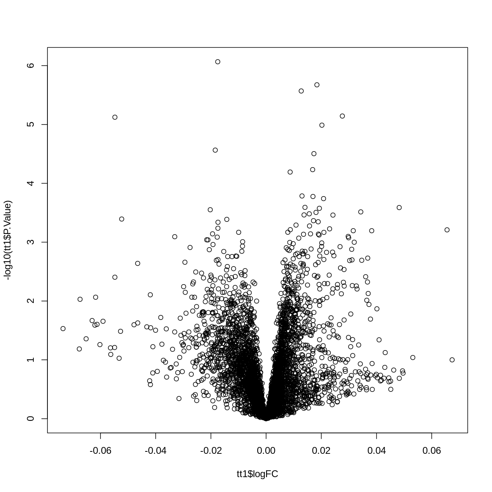
> >    
> >    ~~~
> >    anova(lm(y ~ x))$Pr[[1]]
> >    ~~~
> >    {: .language-r}
> >    
> >    
> >    
> >    ~~~
> >    [1] 1.159195e-05
> >    ~~~
> >    {: .output}
> >    
> >    
> >    ~~~
> >    n <- 100
> >    noise_sd <- 5
> >    x <- rnorm(n)
> >    beta <- c(1, 1)
> >    X <- cbind(1, x)
> >    y <- rnorm(n, X %*% beta, sd = noise_sd)
> >    plot(x, y, pch = 19)
> >    ~~~
> >    {: .language-r}
> >    
> >    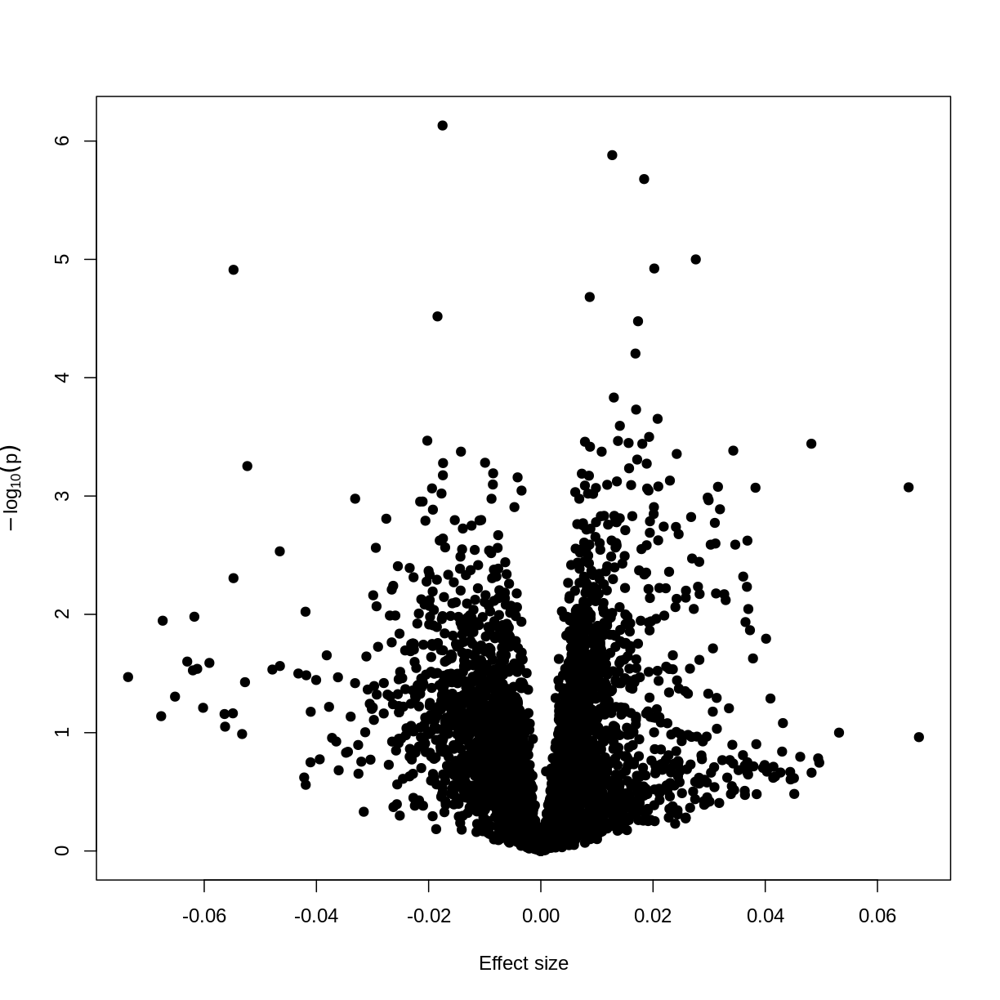
> >    
> >    ~~~
> >    anova(lm(y ~ x))$Pr[[1]]
> >    ~~~
> >    {: .language-r}
> >    
> >    
> >    
> >    ~~~
> >    [1] 0.0003121515
> >    ~~~
> >    {: .output}
> > 2. 
> >    
> >    ~~~
> >    n <- 10
> >    noise_sd <- 2
> >    x <- rnorm(n)
> >    beta <- c(1, 1)
> >    X <- cbind(1, x)
> >    y <- rnorm(n, X %*% beta, sd = noise_sd)
> >    plot(x, y, pch = 19)
> >    ~~~
> >    {: .language-r}
> >    
> >    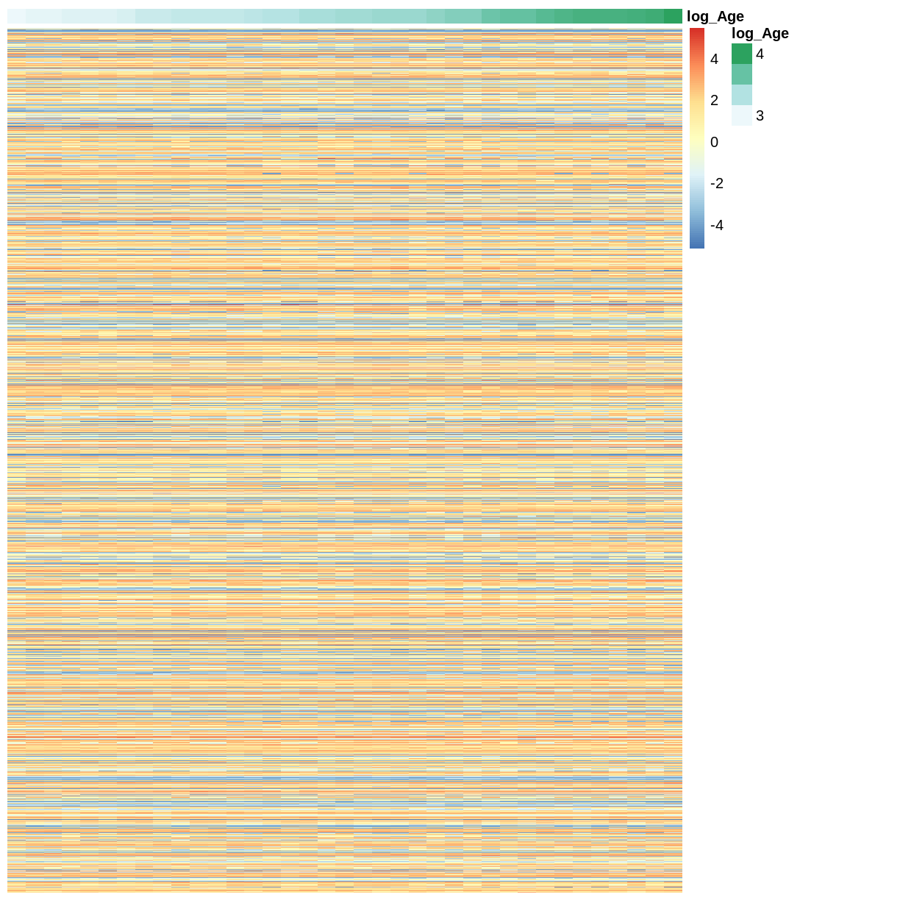
> >    
> >    ~~~
> >    anova(lm(y ~ x))$Pr[[1]]
> >    ~~~
> >    {: .language-r}
> >    
> >    
> >    
> >    ~~~
> >    [1] 0.3000536
> >    ~~~
> >    {: .output}
> >    
> >    
> >    ~~~
> >    n <- 10
> >    noise_sd <- 0.4
> >    x <- rnorm(n)
> >    beta <- c(0.2, 0.2)
> >    X <- cbind(1, x)
> >    y <- rnorm(n, X %*% beta, sd = noise_sd)
> >    plot(x, y, pch = 19)
> >    ~~~
> >    {: .language-r}
> >    
> >    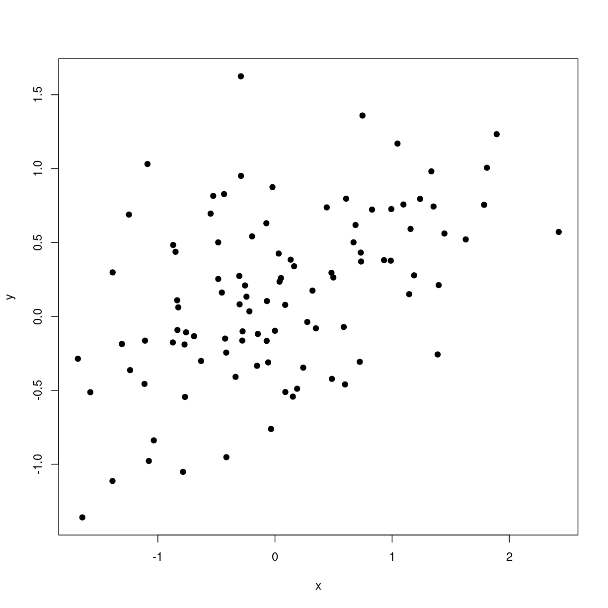
> >    
> >    ~~~
> >    anova(lm(y ~ x))$Pr[[1]]
> >    ~~~
> >    {: .language-r}
> >    
> >    
> >    
> >    ~~~
> >    [1] 0.005212146
> >    ~~~
> >    {: .output}
> > 3. 
> >    
> >    ~~~
> >    n <- 1000
> >    noise_sd <- 5
> >    x <- rnorm(n)
> >    beta <- c(1, 1)
> >    X <- cbind(1, x)
> >    y <- rnorm(n, X %*% beta, sd = noise_sd)
> >    plot(x, y, pch = 19)
> >    ~~~
> >    {: .language-r}
> >    
> >    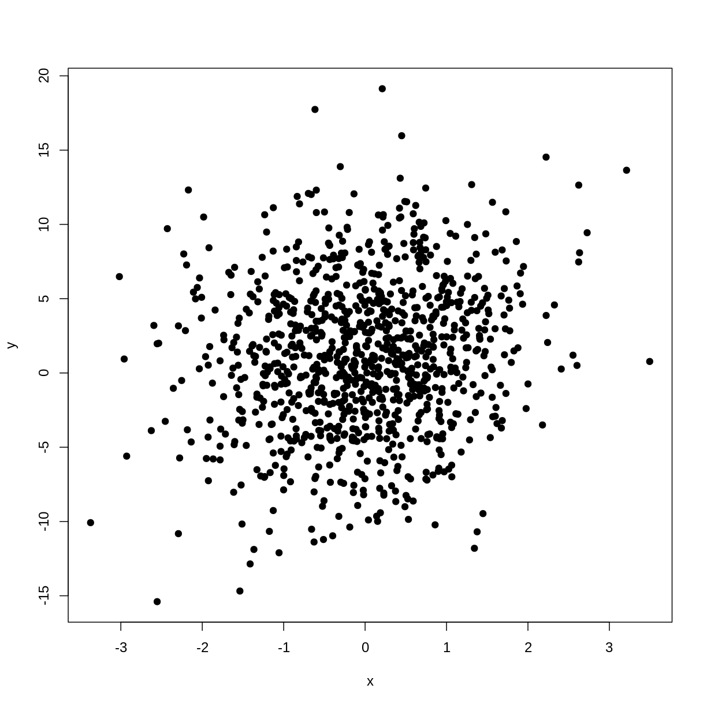
> >    
> >    ~~~
> >    anova(lm(y ~ x))$Pr[[1]]
> >    ~~~
> >    {: .language-r}
> >    
> >    
> >    
> >    ~~~
> >    [1] 3.436623e-06
> >    ~~~
> >    {: .output}
> >    
> >    
> >    ~~~
> >    n <- 1000
> >    noise_sd <- 1
> >    x <- rnorm(n)
> >    beta <- c(0.1, 0.1)
> >    X <- cbind(1, x)
> >    y <- rnorm(n, X %*% beta, sd = noise_sd)
> >    plot(x, y, pch = 19)
> >    ~~~
> >    {: .language-r}
> >    
> >    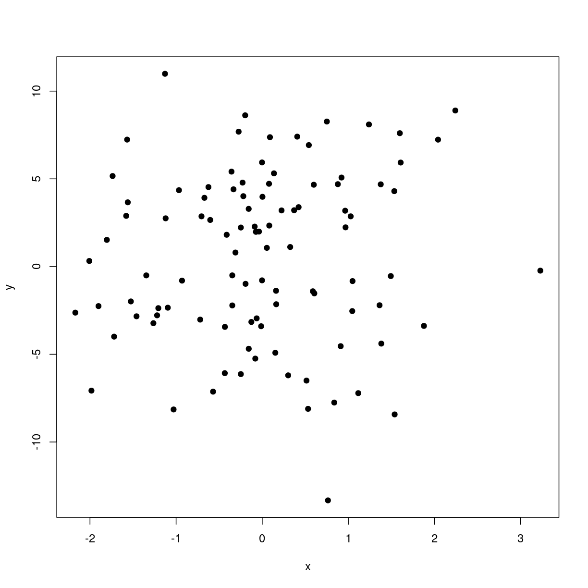
> >    
> >    ~~~
> >    anova(lm(y ~ x))$Pr[[1]]
> >    ~~~
> >    {: .language-r}
> >    
> >    
> >    
> >    ~~~
> >    [1] 0.000126255
> >    ~~~
> >    {: .output}
> {: .solution}
{: .challenge}

# Data

For the following few episodes, we'll be working with human
DNA methylation data from flow-sorted blood samples.
DNA methylation assays measure, for many sites in the genome,
the proportion of DNA that carries a methyl mark.

In this case, the methylation data come in the form of a matrix
of normalised methylation levels (M-values, for the technical among
you). Along with this, we have a number of sample phenotypes
(eg, age in years, BMI).

The following code will read in the data for this episode.

~~~
suppressPackageStartupMessages({
    library("minfi")
    library("limma")
    library("here")
    library("broom")
})

if (!file.exists(here("data/methylation.rds"))) {
    source(here("data/methylation.R"))
}
methylation <- readRDS(here("data/methylation.rds"))

xmat <- getM(methylation)
~~~
{: .language-r}

The distribution of these M-values looks like this:

~~~
hist(xmat, breaks = "FD", xlab = "M-value")
~~~
{: .language-r}

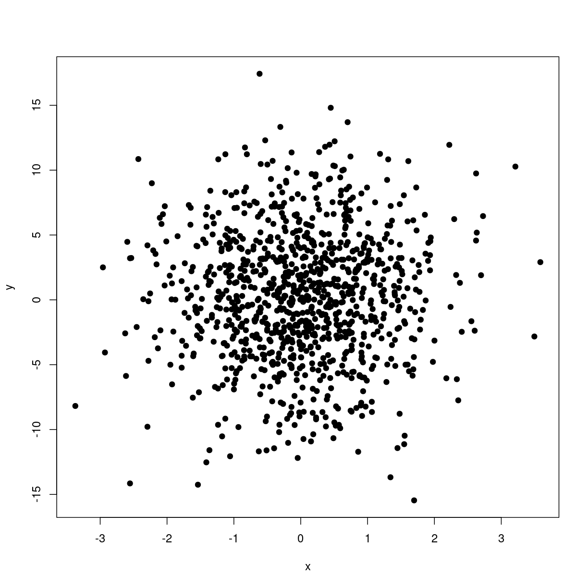

In this case, the phenotypes and groupings look like this (for the first 6 samples):

|Sample_Well |Sample_Name | purity|Sex | Age| weight_kg| height_m|      bmi|bmi_clas   |Ethnicity_wide |Ethnic_self    |smoker |Array  |        Slide|
|:-----------|:-----------|------:|:---|---:|---------:|--------:|--------:|:----------|:--------------|:--------------|:------|:------|------------:|
|A07         |PCA0612     |     94|M   |  39|  88.45051|   1.8542| 25.72688|Overweight |Mixed          |Hispanic       |No     |R01C01 | 201868500150|
|C07         |NKpan2510   |     95|M   |  49|  81.19303|   1.6764| 28.89106|Overweight |Indo-European  |Caucasian      |No     |R03C01 | 201868500150|
|E07         |WB1148      |     95|M   |  20|  80.28585|   1.7526| 26.13806|Overweight |Indo-European  |Persian        |No     |R05C01 | 201868500150|
|G07         |B0044       |     97|M   |  49|  82.55381|   1.7272| 27.67272|Overweight |Indo-European  |Caucasian      |No     |R07C01 | 201868500150|
|H07         |NKpan1869   |     95|F   |  33|  87.54333|   1.7272| 29.34525|Overweight |Indo-European  |Caucasian      |No     |R08C01 | 201868500150|
|B03         |NKpan1850   |     93|F   |  21|  87.54333|   1.6764| 31.15070|Obese      |Mixed          |Finnish/Creole |No     |R02C01 | 201868590193|

In this case, we will focus on age. The association between
age and methylation status in blood samples has been studied extensively,
and is actually a good case-study in how to perform some of the techniques
we will cover in this lesson.

~~~
age <- methylation$Age

library("ComplexHeatmap")
order <- order(age)
age_ord <- age[order]
xmat_ord <- xmat[, order]
Heatmap(xmat_ord,
    cluster_columns = FALSE,
    # cluster_rows = FALSE,
    name = "M-value",
    col = RColorBrewer::brewer.pal(10, "RdYlBu"),
    top_annotation = columnAnnotation(
        age = age_ord
    ),
    show_row_names = FALSE,
    show_column_names = FALSE,
    row_title = "Feature",
    column_title =  "Sample",
    use_raster = FALSE
)
~~~
{: .language-r}

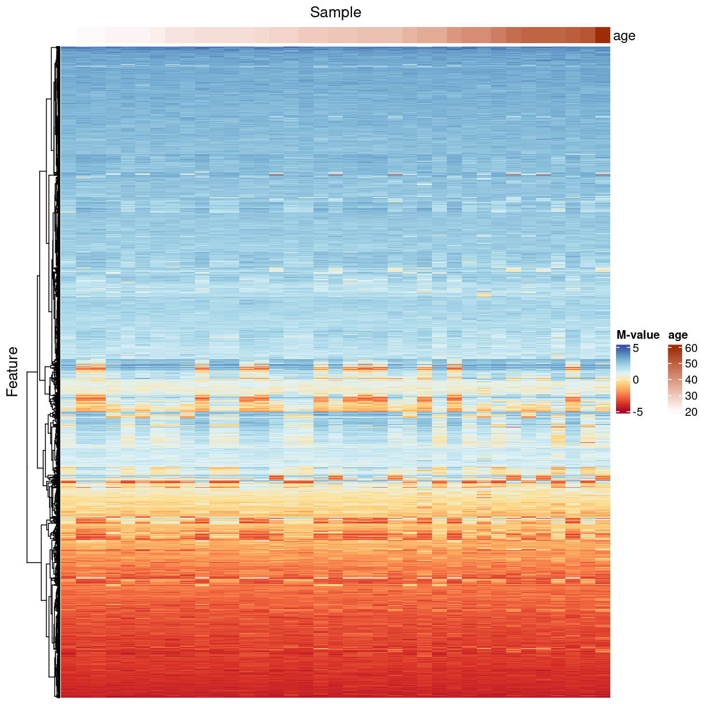

> ## Measuring DNA Methylation
> 
> DNA methylation is an epigenetic modification of DNA.
> Generally, we are interested in the proportion of 
> methylation at many sites or regions in the genome.
> DNA methylation microarrays, as we are using here,
> measure DNA methylation using two-channel microarrays,
> where one channel captures signal from methylated
> DNA and the other captures unmethylated signal.
> These data can be summarised
> as "Beta values" ($\beta$ values), which is the ratio
> of the methylated signal to the total signal 
> (methylated plus unmethylated).
> The $\beta$ value for site $i$ is calculated as
> 
> $$
>     \beta_i = \frac{
>         m_i
>     } {
>         u_{i} + m_{i}
>     }
> $$
> 
> where $m_i$ is the methylated signal for site $i$ and
> $u_i$ is the unmethylated signal for site $i$.
> $\beta$ values take on a value in the range 
> $[0, 1]$, with 0 representing a completely unmethylated 
> site and 1 representing a completely methylated site.
> 
> The M-values we use here are the $\log_2$ ratio of 
> methylated versus unmethylated signal:
>
> $$
>     M_i = \log_2\left(\frac{m_i}{u_i}\right)
> $$
> 
> M-values are not bounded to an interval as Beta-values
> are, and therefore may be less problematic for 
> statistical treatment.
{: .callout}

# Running linear regression

We have a matrix of methylation values $X$ and a vector of ages, $y$.
One way to model this is to see if we can "predict" methylation using age.
Formally we'd describe that as:

$$
    X_{i,j} = \beta_0 + \beta_1 y_j + \epsilon_i
$$
where $y_j$ is the age of sample $j$.

You may remember how to fit this model from a previous lesson, and how to
get more information from the model object:

~~~
fit <- lm(xmat[1, ] ~ age)
summary(fit)
~~~
{: .language-r}

~~~

Call:
lm(formula = xmat[1, ] ~ age)

Residuals:
     Min       1Q   Median       3Q      Max 
-1.25406 -0.05719  0.18118  0.28574  0.40238 

Coefficients:
            Estimate Std. Error t value Pr(>|t|)    
(Intercept)  2.03577    0.24947   8.160  1.3e-09 ***
age          0.00572    0.00727   0.787    0.437    
---
Signif. codes:  0 '***' 0.001 '**' 0.01 '*' 0.05 '.' 0.1 ' ' 1

Residual standard error: 0.4748 on 35 degrees of freedom
Multiple R-squared:  0.01738,	Adjusted R-squared:  -0.01069 
F-statistic: 0.6192 on 1 and 35 DF,  p-value: 0.4367
~~~
{: .output}

We can also use `broom` to extract information about
the coefficients in this model:

~~~
library("broom")
tidy(fit)
~~~
{: .language-r}

~~~
# A tibble: 2 x 5
  term        estimate std.error statistic       p.value
  <chr>          <dbl>     <dbl>     <dbl>         <dbl>
1 (Intercept)  2.04      0.249       8.16  0.00000000130
2 age          0.00572   0.00727     0.787 0.437        
~~~
{: .output}

We have a lot of features, though! This is what it looks like if we do that
for every feature.

~~~
dfs <- lapply(seq_len(nrow(xmat)),
    function(i) {
        df <- tidy(lm(xmat[i, ] ~ age))[2, ]
        df$term <- rownames(xmat)[[i]]
        df
    }
)
df_all <- do.call(rbind, dfs)
plot(df_all$estimate, -log10(df_all$p.value),
    xlab = "Effect size", ylab = bquote(-log[10](p)),
    pch = 19
)
~~~
{: .language-r}

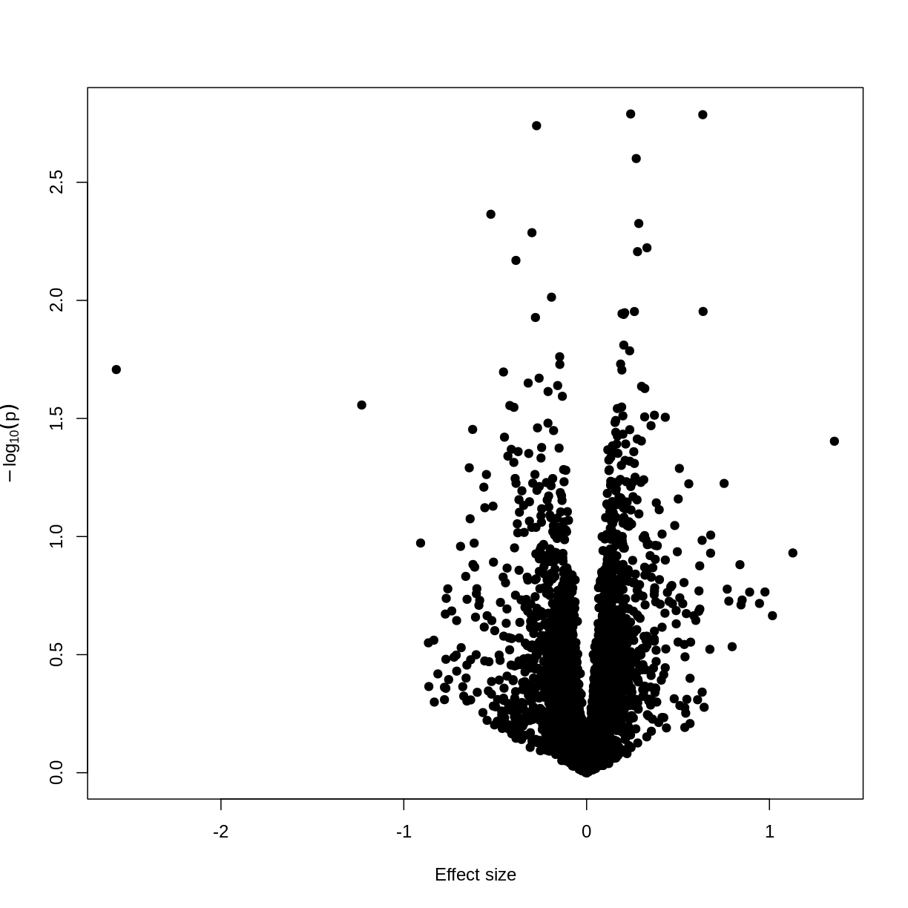

In this figure, every point represents a feature of interest. The x-axis
represents the effect size observed for that feature in a linear model,
while the y-axis is the $-log10(\text{p-value})$, where larger values
indicate increasing statistical evidence of a non-zero effect size. 

Given that we often use procedures like this to identify differentially
methylated features or differentially expressed genes, we can imagine that
in an ideal case there would be clear separation between "null" and "non-null"
features. However, usually we observe results as we did here: there is a continuum
of effect sizes and p-values, with no clear. While statistical methods exist to
derive insights from continuous measure like these, it is often convenient to obtain
a list of features which we are confident have non-zero effect sizes.
This is made more difficult by the number of tests we perform.

# The problem of multiple tests

With such a large number of features, we often want some way
to decide which features are "interesting" or "significant"
for further study.

To demonstrate this, it's useful to consider what happens if
we scramble age and run the same test again:

~~~
age_perm <- age[sample(ncol(xmat), ncol(xmat))]
dfs <- lapply(seq_len(nrow(xmat)),
    function(i) {
        df <- tidy(lm(xmat[i, ] ~ age_perm))[2, ]
        df$term <- rownames(xmat)[[i]]
        df
    }
)
df_all_perm <- do.call(rbind, dfs)
plot(df_all_perm$estimate, -log10(df_all_perm$p.value),
    xlab = "Effect size", ylab = bquote(-log[10](p)),
    pch = 19
)
~~~
{: .language-r}

> ## Exercise
>
> 
> 1. If we run 10,000 tests under the null hypothesis,
>    how many of them (on average) will be statistically
>    significant at a threshold of $p < 0.05$?
> 2. Why would we want to be conservative in labelling features
>    as significantly different?
>    By conservative, we mean to err towards labelling true
>    differences as "not significant" rather than vice versa.
> 3. How could we account for a varying number of tests to
>    ensure "significant" changes are truly different? 
> 
> > ## Solution
> > 1. By default we expect $5000 \times 0.05 = 250$
> >    features to be statistically significant under the null hypothesis,
> >    because p-values should always be uniformly distributed under
> >    the null hypothesis.
> > 2. Features that we label as "significantly different" will often
> >    be reported in manuscripts. We may also spend time and money
> >    investigating them further, computationally or in the lab.
> >    Therefore, spurious results have a real cost for ourselves and
> >    for others.
> > 3. One approach to controlling for the number of tests is to
> >    divide our significance threshold by the number of tests
> >    performed. This is termed "Bonferroni correction" and
> >    we'll discuss this further now.
> {: .solution}
{: .challenge}

# Adjusting for multiple comparisons

When performing many statistical tests to
categorise features, we're effectively classifying
features.

We can think of these features as being 
"truly different" or "not truly different"[^2].
Using this idea, we can see that each 
categorisation we make falls into four categories:

|              |Predicted true|Predicted false|
|-------------:|-------------:|--------------:|
|Actually true |True positive |False negative |
|Actually false|False positive|True negative  |

Under the null hypothesis, as we perform more and more
tests we'll tend to correctly categorise most
results as negative. However, since p-values
are uniformly distributed under the null,
at a significance level of 5%, 5% of all
results will be "significant" even though
these are results we expect under the null.
These can be considered "false discoveries."

There are two common ways of controlling these
false discoveries.

The first is to say that
we want to have the same certainty of making
one false discovery with $n$ tests as we had with
one. This is "Bonferroni" correction,[^3] which
divides the significance level by the number of
tests performed. Equivalently, we can use the
non-transformed p-value threshold but multiply
our p-values by the number of tests.
This is often very conservative, especially
with a lot of features!

~~~
p_raw <- df_all$p.value
p_fwer <- p.adjust(p_raw, method = "bonferroni")
library("ggplot2")
ggplot() +
    aes(p_raw, p_fwer) +
    geom_point() +
    scale_x_log10() + scale_y_log10() +
    geom_abline(slope = 1, linetype = "dashed") +
    geom_hline(yintercept = 0.05, lty = "dashed", col = "red") +
    geom_vline(xintercept = 0.05, lty = "dashed", col = "red") +
    labs(x = "Raw p-value", y = "Bonferroni p-value")
~~~
{: .language-r}

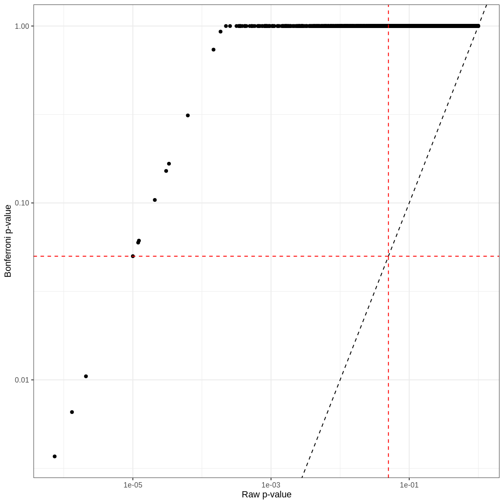

The second main way of controlling for multiple tests
is to control the *false discovery rate*.[^4]
This is the proportion of false discoveries
we'd expect to get each time if we repeated
the experiment over and over.

1. Rank the p-values
2. Assign each a rank (1 is smallest)
3. Calculate the critical value 
    $$
        q = \left(\frac{i}{m}\right)Q
    $$,
    where $i$ is rank, $m$ is the number of tests, and $Q$ is the
    false discovery rate we want to target.[^5]
4. Find the largest p-value less than the critical value.
    All smaller than this are significant.

|FWER|FDR|
|-------------:|--------------:|
|+ Controls probability of identifying a false positive|+ Controls rate of false discoveries|
|+ Strict error rate control |+ Allows error control with less stringency|
|- Often results in no significant results |- Does not control probability of making errors|
|- Requires larger statistical power|- May result in false discoveries|

> ## Exercise
>
> 1. At a significance level of 0.05, with 100 tests
>    performed, what is the Bonferroni significance
>    threshold?
> 2. In a gene expression experiment, after FDR 
>    correction we observe 500 significant genes.
>    What proportion of these genes are truly
>    different?
> 3. Try running FDR correction on the `p_raw` vector.
>    *Hint: check `help("p.adjust")` to see what the method
>    is called*.  
>    Compare these values to the raw p-values
>    and the Bonferroni p-values.
>  
> > ## Solution
> > 
> > 1. The Bonferroni threshold for this significance
> >    threshold is
> >    $$
> >         \frac{0.05}{100} = 0.0005
> >    $$
> > 2. Trick question! We can't say what proportion
> >    of these genes are truly different. However, if
> >    we repeated this experiment and statistical test
> >    over and over, on average 5% of the results from
> >    each run would be false discoveries.
> > 3. The following code runs FDR correction and compares it to
> >    non-corrected values and to Bonferroni:
> >    
> >    ~~~
> >    p_fdr <- p.adjust(p_raw, method = "BH")
> >    ggplot() +
> >        aes(p_raw, p_fdr) +
> >        geom_point() +
> >        scale_x_log10() + scale_y_log10() +
> >        geom_abline(slope = 1, linetype = "dashed") +
> >        geom_hline(yintercept = 0.05, lty = "dashed", col = "red") +
> >        geom_vline(xintercept = 0.05, lty = "dashed", col = "red") +
> >        labs(x = "Raw p-value", y = "Benjamini-Hochberg p-value")
> >    ~~~
> >    {: .language-r}
> >    
> >    
> >    
> >    ~~~
> >    ggplot() +
> >        aes(p_fdr, p_fwer) +
> >        geom_point() +
> >        scale_x_log10() + scale_y_log10() +
> >        geom_abline(slope = 1, linetype = "dashed") +
> >        geom_hline(yintercept = 0.05, lty = "dashed", col = "red") +
> >        geom_vline(xintercept = 0.05, lty = "dashed", col = "red") +
> >        labs(x = "Benjamini-Hochberg p-value", y = "Bonferroni p-value")
> >    ~~~
> >    {: .language-r}
> >    
> >    
> {: .solution}
{: .challenge}

# Sharing information

One idea is to take advantage of the fact that we're doing all these tests 
at once. We can leverage this fact to *share information* between model
parameters. 

The insight that we use to perform *information pooling* like this is that variance parameters
like these are probably similar between genes within the same experiment. This
enables us to share information between genes to get more robust
estimators.

Specifically, recall that the t-statistic for feature $i$, coefficient $j$ $\beta$ 
in a linear model is as follows:

$$
    t_{ij} = \frac{\hat{\beta}_{ij}}{SE\left(\hat{\beta}_{ij}\right)}
$$

It's clear that large effect sizes will likely lead to small p-values,
as long as the standard error for the coefficent is not large.
However, the standard error is affected by the strength of noise, 
as we saw earlier.
With small numbers of replicates, it's common for the noise for some features to
be extremely small simply by chance, leading to an inflated level of significance.
The authors of `limma` made some assumptions about the distributions that these
follow, and pool information across genes to get a better estimate of the uncertainty
in effect size estimates.

~~~
design <- model.matrix(~age)
fit <- lmFit(xmat, design = design)
fit <- eBayes(fit)
tt1 <- topTable(fit, coef = 2, number = nrow(fit))
plot(tt1$logFC, -log10(tt1$P.Value),
    xlab = "Effect size", ylab = bquote(-log[10](p)),
    pch = 19
)
~~~
{: .language-r}

> ## Exercise
> 
> 1. Try to run the same kind of linear model with smoking 
>    status as covariate instead of age, and making a volcano
>    plot.
> 2. Notice that `limma` creates an `adj.P.Val` column in the output you just 
>    created. What
>    kind of p-value adjustment is it doing? Bonferroni,
>    Benjamini-Hochberg, or something else?
> 
> Note: smoking status is stored as `methylation$smoker`.
>
> > ## Solution
> > 
> > 1. The following code runs the same type of model with smoking status:
> >    
> >    ~~~
> >    design <- model.matrix(~methylation$smoker)
> >    fit <- lmFit(xmat, design = design)
> >    fit <- eBayes(fit)
> >    tt1 <- topTable(fit, coef = 2, number = nrow(fit))
> >    plot(tt1$logFC, -log10(tt1$P.Value),
> >        xlab = "Effect size", ylab = bquote(-log[10](p)),
> >        pch = 19
> >    )
> >    ~~~
> >    {: .language-r}
> >    
> >    
> > 2. We can use `all.equal` to compare vectors:
> >    
> >    ~~~
> >    all.equal(p.adjust(tt1$P.Value, method = "BH"), tt1$adj.P.Val)
> >    ~~~
> >    {: .language-r}
> >    
> >    
> >    
> >    ~~~
> >    [1] TRUE
> >    ~~~
> >    {: .output}
> {: .solution}
{: .challenge}

You can see that the effect of pooling is to shrink large 
estimates downwards and small estimates upwards, all towards
a common value. The degree of shrinkage generally depends on 
the amount of pooled information and the strength of the 
evidence independent of pooling.

Similarly, DESeq2 shares information between genes
to *shrink* estimates of a noise parameter, in that case to model counts.

Shrinkage methods can be complex to implement and understand,
but it's good to understand why these approaches may be more precise 
and sensitive than the naive approach of fitting a model to each feature
separately.

> ## Exercise
> 
> Launch `shinystats::limmaApp` and adjust the parameters. 
> 
> Discuss the output in groups. Consider the following questions:
> 
> 1. How does the number of features affect the relationship between these two 
>    similar methods?
> 2. What about the number of samples?
> 3. When ranking genes, why would we want to downrank the most significant and
>    uprank some with more moderate changes?
> 
> > ## Solution
> > 
> > 1. With more features, the amount of shrinkage increases.
> > 2. With more samples, the shrinkage is weaker and the difference between the
> >    methods is smaller.
> > 3. Because the p-value relies on the effect size estimate *and* its standard
> >    error, a very small standard error by chance (with few replicates) can
> >    lead to a very small p-value. "Moderating" or shrinking the standard errors
> >    brings these more in line with features that have a similar effect size 
> >    but larger standard error.
> {: .solution}
{: .challenge}

> ## Shrinkage
> 
> Shrinkage is an intuitive term for an effect
> of information sharing, and is something observed
> in a broad range of statistical models.
> Often, shrinkage is induced by a *multilevel*
> modelling approach or by *Bayesian* methods.
> 
> The general idea is that these models incorporate 
> information about the structure of the
> data into account when fitting the parameters.
> We can share information between features
> because of our knowledge about the data structure;
> this generally requires careful consideration about
> how the data were generated and the relationships within.
>
> An example people often use is estimating the effect
> of attendance on grades in several schools. We can
> assume that this effect is similar in different schools
> (but maybe not identical), so we can *share information*
> about the effect size between schools and shink our
> estimates towards a common value.
> 
> For example in `DESeq2`, the authors used the observation
> that genes with similar expression counts in RNAseq data
> have similar *dispersion*, and a better estimate of
> these dispersion parameters makes estimates of
> fold changes much more stable.
> Similarly, in `limma` the authors made the assumption that
> in the absence of biological effects, we can often expect the
> technical variation of each genes to be broadly similar.
> Again, better estimates of variability allow us to
> prioritise genes in a more reliable way.
> 
> There are many good resources to learn about this type of approach,
> including:
> 
> - [a blog post by TJ Mahr](https://www.tjmahr.com/plotting-partial-pooling-in-mixed-effects-models/)
> - [a book by David Robinson](https://gumroad.com/l/empirical-bayes)
> - [a (relatively technical) book by Gelman and Hill](http://www.stat.columbia.edu/~gelman/arm/)
{: .callout}

[^1]: It's not hugely problematic if the assumption of normal residuals is violated. It mainly affects our ability to accurately predict responses for new, unseen observations.

[^2]: "True difference" is a hard category to rigidly define. As we've seen, with a lot of data, we can detect tiny differences, and with little data, we can't detect large differences. However, both can be argued to be "true".

[^3]: Bonferroni correction is also termed "family-wise" error rate control.

[^4]: This is often called "Benjamini-Hochberg" adjustment.

[^5]: People often perform extra controls on FDR-adjusted p-values, ensuring that ranks don't change and the critical value is never smaller than the original p-value.


