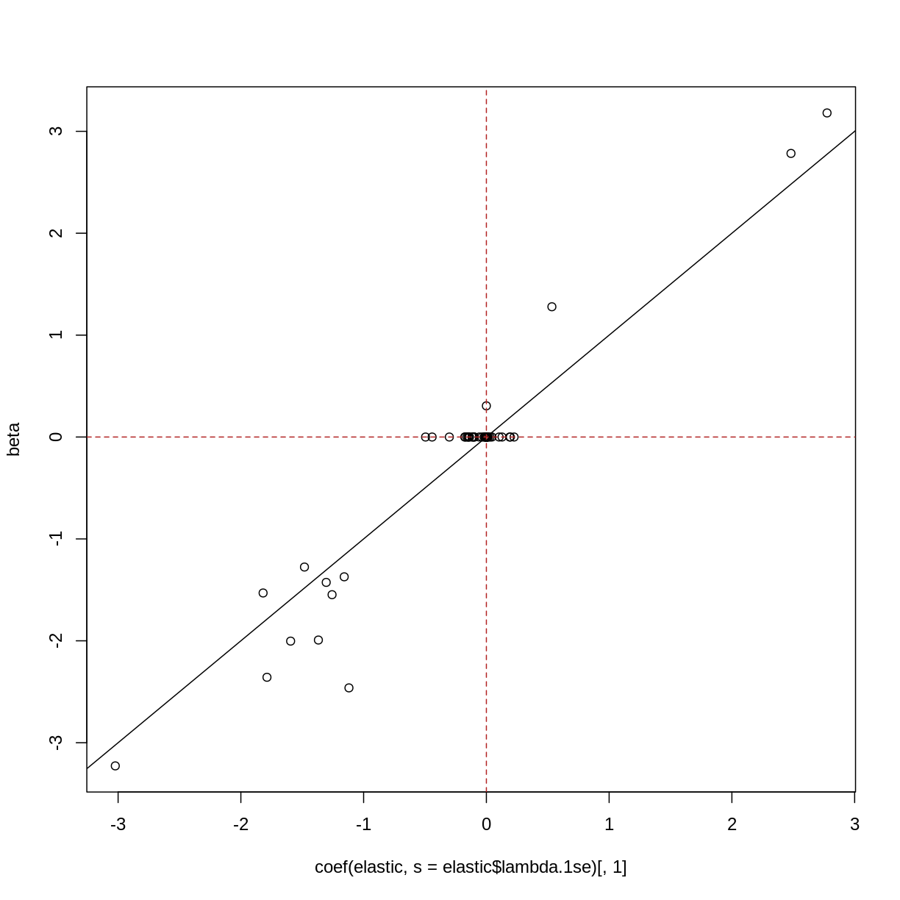
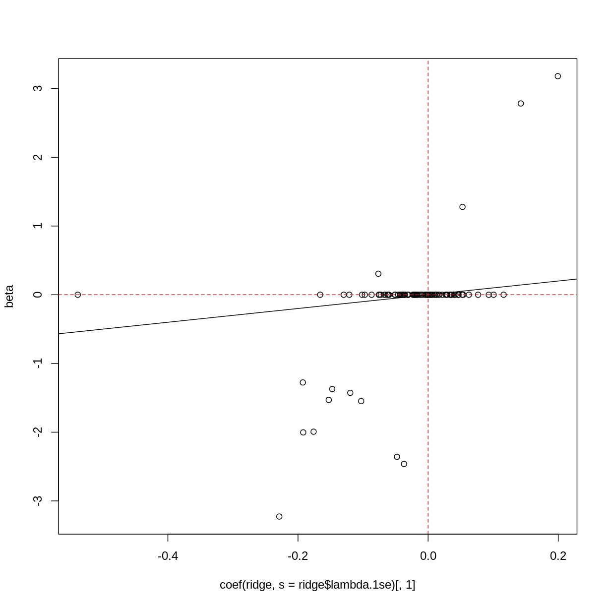

---
# Please do not edit this file directly; it is auto generated.
# Instead, please edit 02-high-dimensional-regression.md in _episodes_rmd/
title: "High dimensional regression"
teaching: 0
exercises: 0
questions:
- "How can we apply regression methods in a high-dimensional setting?"
- "How can we control for the fact that we do many tests?"
- "How can we benefit from the fact that we have many variables?"
- "How can we find a good subset of variables to use for regression?"
objectives:
- "Perform and critically analyse high dimensional regression."
- "Perform multiple testing adjustment."
- "Perform and critically analyse penalised regression."
keypoints:
- "Multiple testing correction can enable us to account for many null hypothesis
    significance tests while retaining power."
- "Sharing information between features can increase power and reduce false 
    positives."
- "Modelling features together can help to identify a subset of features
    that contribute to the outcome."
math: yes
---

Linear regression with one predictor variable $x$ comprises the following 
equation

$$
    y_i = \beta_0 + \beta_1 x_i + \epsilon_i
$$

where $\epsilon_i$ is the *noise*, or the variation in $y$ that isn't explained
by the relationship we're modelling. We assume this noise follows a normal
distribution, that is:

$$
    \epsilon_i \sim N(0, \sigma^2)
$$

We can also write this using linear algebra (matrices and vectors) as follows: 

$$
    y = X\beta + \epsilon
$$

Another way of saying this is that y follows a normal distribution with

$$
    y \sim N(X\beta, \sigma^2)
$$

> ## Exercise
> Launch `shinystats::regressionApp` and adjust the parameters.
> 
> How does the "significance" of the model vary when you vary the parameters?
> 
> How does the degree of noise affect the level of certainty in the fitted
> trend?
> 
> With a large number of observations, how weak of an effect can you detect?
> Is a really small effect (0.1 slope) really "significant" in the way you'd
> use that word conversationally?
> 
> With a small number of observations, how strong does the relationship need
> to be (or how small the noise) before you can detect it?
> 
{: .challenge}

<--
> > ## Solution
> > ??? What do I put here...
> {: .solution}
-->

The following code will read in the data for this episode.

~~~
suppressPackageStartupMessages({
    library("glmnet")
    library("limma")
    library("minfi")
    library("here")
    library("broom")
})

if (!file.exists(here("data/FlowSorted_Blood_EPIC.rds"))) {
    source(here("data/methylation.R"))
}
norm <- readRDS(here("data/FlowSorted_Blood_EPIC.rds"))

lim <- norm
y <- lim$Age
X <- getM(lim)
~~~
{: .language-r}

We have a matrix of methylation values $X$ and a vector of ages in years $y$.
One way to model this is to see if we can "predict" methylation using age.
Formally we'd describe that as:

$$
    \text{feature}_{i,j} = \beta_0 + \beta_1 \text{Age}_j + \epsilon_i
$$

~~~
fit <- lm(X[1, ] ~ y)
summary(fit)
~~~
{: .language-r}

~~~

Call:
lm(formula = X[1, ] ~ y)

Residuals:
     Min       1Q   Median       3Q      Max 
-1.25406 -0.05719  0.18118  0.28574  0.40238 

Coefficients:
            Estimate Std. Error t value Pr(>|t|)    
(Intercept)  2.03577    0.24947   8.160  1.3e-09 ***
y            0.00572    0.00727   0.787    0.437    
---
Signif. codes:  0 '***' 0.001 '**' 0.01 '*' 0.05 '.' 0.1 ' ' 1

Residual standard error: 0.4748 on 35 degrees of freedom
Multiple R-squared:  0.01738,	Adjusted R-squared:  -0.01069 
F-statistic: 0.6192 on 1 and 35 DF,  p-value: 0.4367
~~~
{: .output}

We have a lot of features, though! This is what it looks like if we do that
for every feature.

~~~
dfs <- lapply(1:nrow(lim),
    function(i) {
        # cat(i, "/", nrow(X), "\n")
        df <- tidy(lm(X[i, ] ~ y))[2, ]
        df$term <- rownames(X)[[i]]
        df
    }
)
df_all <- do.call(rbind, dfs)
plot(df_all$estimate, -log10(df_all$p.value))
~~~
{: .language-r}

One idea is to take advantage of the fact that we're doing all these tests 
at once. That's where ideas like empirical Bayes analysis come in.
A few really popular analysis packages use these. They're a bit complex to 
implement, but it's good to understand why these approaches may be more precise 
and sensitive than the naive approach of fitting a model to each feature
separately.

$$
    t_{ij} = \frac{\hat{\beta}_{ij}}{SE(\hat{\beta}_{ij})}
$$

Knowing what distribution these t-values allows us to determine how unlikely
they would

not $j$ but rather $k$? for predictor.
$$
    t_{ij} = \frac{\hat{\beta}_{ij}}{s_i \sqrt{v_{ij}}}
$$

$s_i^2$ is the variance of residuals.

The insight of empirical Bayes methods is to realise that variance parameters
like these are probably similar between genes within the same experiment. This
enables us to share information between genes to get more robust
estimators.

Similarly, DESeq2 shares information between genes
to *shrink* estimates of a noise parameter, in that case to model counts.

~~~
## age - strong comparison
design <- model.matrix(~lim$Age)
colnames(design) <- c("intercept", "age")
fit <- lmFit(getM(lim), design = design)
fit <- eBayes(fit)
tt1 <- topTable(fit, coef = 2, number = nrow(fit))
plot(tt1$logFC, -log10(tt1$P.Value))
~~~
{: .language-r}

> ## Exercise
> Launch `shinystats::limmaApp` and adjust the parameters.
> 
> How does the number of features affect the relationship between these two 
> similar methods?
> 
> What about the number of samples?
> 
> When ranking genes, why would we want to downrank the most significant and
> uprank some with more moderate changes?
{: .challenge}

Another way of modelling these data is to model age as 

$$
    \text{Age}_j = \beta_0 + \beta_1 \text{feature}_1 + \dots \beta_p \text{feature}_p + \epsilon_j
$$

~~~
noise_sd <- 2
npred <- 99
frac <- 0.2
nobs <- 100
X <- replicate(npred - 1, rnorm(nobs, mean = 0, sd = 1))
colnames(X) <- paste0("predictor_", 1:(npred-1))
noise <- rnorm(nobs, mean = 0, sd = noise_sd)
X <- cbind(intercept = rep(1, nobs), X)
beta <- rep(0, npred)
names(beta) <- colnames(X)
ind <- as.logical(rbinom(npred, 1, frac))
beta[ind] <- rnorm(sum(ind)) + sample(c(-2, 2), sum(ind), replace=TRUE)
y <- ((X %*% beta) + noise)[, 1]
~~~
{: .language-r}

> ## Exercise
> Perform forward subset selection on the methylation data.
> 
> 
> > ## Solution
> > 
> > 
> {: .solution}
{: .challenge}

~~~
## challenge 3: fit y on x univariate
## compare with true betas
cc <- sapply(1:ncol(X), function(i) {
    coef(lm(y ~ X[, i]))[[2]]
})
plot(cc, beta, pch = 19, cex = 0.5)
abline(0, 1)
abline(v = 0, lty="dashed", col = "firebrick")
abline(h = 0, lty="dashed", col = "firebrick")
~~~
{: .language-r}

~~~
## challenge 4: forward selection
## compare with true betas
xy <- as.data.frame(cbind(X, y = y))
int <- lm(y ~ 1, data=xy)
all <- lm(y ~ . + 0, data=xy)
forward <- step(
    int,
    scope = list(upper = formula(all), lower = formula(int)),
    direction = "forward",
    trace = 0
)
forward$anova
~~~
{: .language-r}

~~~
             Step Df     Deviance Resid. Df  Resid. Dev         AIC
1                 NA           NA        99 6297.788344 416.2783608
2  + predictor_92 -1 1431.2776742        98 4866.510670 392.4962278
3  + predictor_74 -1  649.2085238        97 4217.302146 380.1780715
4  + predictor_83 -1  591.4788137        96 3625.823332 367.0666482
5  + predictor_35 -1  699.2285220        95 2926.594810 347.6424659
6  + predictor_77 -1  655.8244480        94 2270.770362 324.2704233
7  + predictor_58 -1  394.6396286        93 1876.130733 307.1796628
8  + predictor_96 -1  346.8562676        92 1529.274466 288.7378511
9  + predictor_45 -1  291.5822089        91 1237.692257 269.5833656
10 + predictor_97 -1  198.1070002        90 1039.585257 254.1406935
11  + predictor_6 -1  151.2668525        89  888.318404 240.4160056
12  + predictor_3 -1  150.4312330        88  737.887171 223.8620742
13 + predictor_91 -1  128.9808225        87  608.906349 206.6494291
14 + predictor_59 -1  129.8495834        86  479.056765 184.6648912
15  + predictor_8 -1   97.9764349        85  381.080330 163.7840008
16 + predictor_68 -1   33.4124977        84  347.667833 156.6077334
17 + predictor_12 -1   28.5473031        83  319.120530 150.0398681
18 + predictor_90 -1   22.1691153        82  296.951414 144.8398351
19 + predictor_30 -1   28.2932287        81  268.658186 136.8269700
20 + predictor_24 -1   16.1383771        80  252.519809 132.6319509
21 + predictor_89 -1   19.9934055        79  232.526403 126.3833594
22 + predictor_19 -1   15.9516852        78  216.574718 121.2765419
23 + predictor_67 -1   12.6898267        77  203.884891 117.2385389
24 + predictor_85 -1   12.6837093        76  191.201182 112.8155996
25 + predictor_10 -1   11.8589763        75  179.342205 108.4125557
26 + predictor_31 -1    7.9108304        74  171.431375 105.9012855
27 + predictor_37 -1    6.6623225        73  164.769053 103.9374626
28 + predictor_69 -1    6.8701548        72  157.898898 101.6784755
29 + predictor_15 -1    5.8291606        71  152.069737  99.9169028
30 + predictor_81 -1    6.2641995        70  145.805538  97.7103615
31 + predictor_23 -1    7.1443956        69  138.661142  94.6862944
32 + predictor_62 -1    7.7522248        68  130.908917  90.9331608
33 + predictor_36 -1    6.6257880        67  124.283129  87.7392078
34 + predictor_14 -1    6.1641462        66  118.118983  84.6522262
35 + predictor_65 -1    6.1350079        65  111.983975  81.3185597
36 + predictor_34 -1    5.9831451        64  106.000830  77.8276739
37 + predictor_44 -1    6.1693878        63   99.831442  73.8313001
38 + predictor_86 -1    4.6512972        62   95.180145  71.0601175
39 + predictor_73 -1    4.5792693        61   90.600876  68.1293694
40 + predictor_51 -1    4.6222690        60   85.978607  64.8928321
41 + predictor_22 -1    3.3293329        59   82.649274  62.9435854
42  + predictor_2 -1    2.6165252        58   80.032749  61.7265724
43 + predictor_71 -1    2.6024748        57   77.430274  60.4207654
44 + predictor_13 -1    2.4009096        56   75.029364  59.2709376
45 + predictor_60 -1    2.4891647        55   72.540200  57.8970700
46 + predictor_29 -1    2.5590541        54   69.981146  56.3055671
47 + predictor_21 -1    2.9401008        53   67.041045  54.0134855
48 + predictor_40 -1    2.2911407        52   64.749904  52.5362034
49 + predictor_70 -1    2.1518222        51   62.598082  51.1564452
50  + predictor_1 -1    1.8161503        50   60.781932  50.2122382
51 + predictor_61 -1    2.3379528        49   58.443979  48.2898482
52 + predictor_88 -1    2.3528523        48   56.091127  46.1807441
53 + predictor_64 -1    2.4290909        47   53.662036  43.7535594
54  + predictor_5 -1    2.5255795        46   51.136456  40.9327485
55 + predictor_20 -1    2.3403111        45   48.796145  38.2481129
56 + predictor_48 -1    1.8128900        44   46.983255  36.4621077
57 + predictor_72 -1    2.0024154        43   44.980840  34.1066427
58 + predictor_43 -1    2.1083611        42   42.872479  31.3059908
59 + predictor_28 -1    1.9526449        41   40.919834  28.6444690
60 + predictor_27 -1    1.2761777        40   39.643656  27.4760749
61 + predictor_80 -1    1.6038335        39   38.039822  25.3463384
62 + predictor_18 -1    1.4969264        38   36.542896  23.3316617
63 + predictor_98 -1    1.2882069        37   35.254689  21.7428358
64 + predictor_49 -1    1.3671795        36   33.887510  19.7876310
65  + predictor_7 -1    2.1308130        35   31.756697  15.2933432
66 + predictor_26 -1    1.1589226        34   30.597774  13.5757074
67  + predictor_9 -1    1.3455249        33   29.252249  11.0786274
68 + predictor_46 -1    0.7934167        32   28.458832  10.3288377
69 + predictor_82 -1    0.6612132        31   27.797619   9.9780190
70 + predictor_76 -1    0.9219317        30   26.875688   8.6051882
71 + predictor_47 -1    1.0702172        29   25.805470   6.5416311
72 + predictor_66 -1    1.3493137        28   24.456157   3.1711801
73 + predictor_16 -1    0.8767186        27   23.579438   1.5204875
74 + predictor_39 -1    0.6759208        26   22.903517   0.6120303
75 + predictor_79 -1    0.6293073        25   22.274210  -0.1740683
76 + predictor_94 -1    0.5434422        24   21.730768  -0.6441064
77 + predictor_75 -1    0.5144608        23   21.216307  -1.0400108
78 + predictor_11 -1    1.4525407        22   19.763766  -6.1319919
79 + predictor_55 -1    1.7967935        21   17.966973 -13.6634970
80 + predictor_57 -1    1.6697045        20   16.297268 -21.4172693
81  + predictor_4 -1    2.1743883        19   14.122880 -33.7374022
82 + predictor_78 -1    0.8149483        18   13.307932 -37.6809975
83 + predictor_54 -1    0.8844206        17   12.423511 -42.5579472
84 + predictor_93 -1    0.6749249        16   11.748586 -46.1437293
85 + predictor_17 -1    0.4561671        15   11.292419 -48.1038576
86 + predictor_52 -1    0.5556751        14   10.736744 -51.1498321
87 + predictor_63 -1    0.3474070        13   10.389337 -52.4390208
88 + predictor_87 -1    0.2490624        12   10.140274 -52.8655123
89 + predictor_95 -1    0.3632367        11    9.777038 -54.5133637
~~~
{: .output}

~~~
plot(coef(forward), beta[names(coef(forward))])
abline(0, 1)
abline(v = 0, lty="dashed", col = "firebrick")
abline(h = 0, lty="dashed", col = "firebrick")
~~~
{: .language-r}

~~~
## note about backward/both, not a challenge
all <- lm(y ~ . + 0, data=xy)
backward <- step(
    all,
    scope = formula(all),
    direction = "backward",
    trace = 0
)
backward$anova
~~~
{: .language-r}

~~~
             Step Df     Deviance Resid. Df Resid. Dev       AIC
1                 NA           NA         1   7.976047 -54.87272
2  - predictor_71  1 0.0002837234         2   7.976331 -56.86917
3  - predictor_21  1 0.0017377802         3   7.978069 -58.84738
4  - predictor_94  1 0.0077506697         4   7.985819 -60.75028
5   - predictor_5  1 0.0076576271         5   7.993477 -62.65444
6  - predictor_32  1 0.0141737738         6   8.007651 -64.47728
7  - predictor_89  1 0.0139269104         7   8.021578 -66.30351
8  - predictor_12  1 0.0467315734         8   8.068309 -67.72262
9  - predictor_68  1 0.0464632319         9   8.114772 -69.14840
10 - predictor_14  1 0.1147590396        10   8.229531 -69.74411
11 - predictor_67  1 0.0445326927        11   8.274064 -71.20444
12 - predictor_62  1 0.0600753175        12   8.334139 -72.48099
13 - predictor_84  1 0.0626087011        13   8.396748 -73.73257
14 - predictor_25  1 0.1368352038        14   8.533583 -74.11608
15 - predictor_51  1 0.1590672944        15   8.692651 -74.26923
~~~
{: .output}

~~~
plot(coef(backward), beta[names(coef(backward))])
abline(0, 1)
abline(v = 0, lty="dashed", col = "firebrick")
abline(h = 0, lty="dashed", col = "firebrick")
~~~
{: .language-r}

~~~
## Challenge 5:
## one of these...? probably lasso
library("glmnet")
ridge <- cv.glmnet(X[, -1], y, alpha = 0)
lasso <- cv.glmnet(X[, -1], y, alpha = 1)
elastic <- cv.glmnet(X[, -1], y, alpha = 0.5, intercept = FALSE)
plot(coef(lasso, s = lasso$lambda.1se)[, 1], beta)
abline(0, 1)
abline(v = 0, lty="dashed", col = "firebrick")
abline(h = 0, lty="dashed", col = "firebrick")
~~~
{: .language-r}

~~~
plot(coef(elastic, s = elastic$lambda.1se)[, 1], beta)
abline(0, 1)
abline(v = 0, lty="dashed", col = "firebrick")
abline(h = 0, lty="dashed", col = "firebrick")
~~~
{: .language-r}

~~~
plot(coef(ridge, s = ridge$lambda.1se)[, 1], beta)
abline(0, 1)
abline(v = 0, lty="dashed", col = "firebrick")
abline(h = 0, lty="dashed", col = "firebrick")
~~~
{: .language-r}

~~~
x <- t(getM(norm))
y <- as.numeric(factor(norm$smoker)) - 1

fit <- cv.glmnet(x = x, y = y, family="binomial")
~~~
{: .language-r}

~~~
Warning in lognet(xd, is.sparse, ix, jx, y, weights, offset, alpha, nobs, : one
multinomial or binomial class has fewer than 8 observations; dangerous ground
Warning in lognet(xd, is.sparse, ix, jx, y, weights, offset, alpha, nobs, : one
multinomial or binomial class has fewer than 8 observations; dangerous ground
Warning in lognet(xd, is.sparse, ix, jx, y, weights, offset, alpha, nobs, : one
multinomial or binomial class has fewer than 8 observations; dangerous ground
Warning in lognet(xd, is.sparse, ix, jx, y, weights, offset, alpha, nobs, : one
multinomial or binomial class has fewer than 8 observations; dangerous ground
Warning in lognet(xd, is.sparse, ix, jx, y, weights, offset, alpha, nobs, : one
multinomial or binomial class has fewer than 8 observations; dangerous ground
Warning in lognet(xd, is.sparse, ix, jx, y, weights, offset, alpha, nobs, : one
multinomial or binomial class has fewer than 8 observations; dangerous ground
Warning in lognet(xd, is.sparse, ix, jx, y, weights, offset, alpha, nobs, : one
multinomial or binomial class has fewer than 8 observations; dangerous ground
Warning in lognet(xd, is.sparse, ix, jx, y, weights, offset, alpha, nobs, : one
multinomial or binomial class has fewer than 8 observations; dangerous ground
Warning in lognet(xd, is.sparse, ix, jx, y, weights, offset, alpha, nobs, : one
multinomial or binomial class has fewer than 8 observations; dangerous ground
Warning in lognet(xd, is.sparse, ix, jx, y, weights, offset, alpha, nobs, : one
multinomial or binomial class has fewer than 8 observations; dangerous ground
Warning in lognet(xd, is.sparse, ix, jx, y, weights, offset, alpha, nobs, : one
multinomial or binomial class has fewer than 8 observations; dangerous ground
~~~
{: .warning}

~~~
c <- coef(fit, s = fit$lambda.1se)
c[c[, 1] != 0, 1]
~~~
{: .language-r}

~~~
[1] -1.455287
~~~
{: .output}

~~~
y <- norm$Age
fit <- cv.glmnet(x = x, y = y)

c <- coef(fit, s = fit$lambda.1se)
coef <- c[c[, 1] != 0, 1]

plot(y, x[, names(which.max(coef[-1]))])
~~~
{: .language-r}


