---
# Please do not edit this file directly; it is auto generated.
# Instead, please edit 02-high-dimensional-regression.md in _episodes_rmd/
title: "Regression with many outcomes"
source: Rmd
teaching: 60
exercises: 30
questions:
- "How can we apply linear regression in a high-dimensional setting?"
- "How can we benefit from the fact that we have many outcomes?"
- "How can we control for the fact that we do many tests?"
objectives:
- "Perform and critically analyse high dimensional regression."
- "Understand methods for shrinkage of noise parameters in
  high-dimensional regression."
- "Perform multiple testing adjustment."
keypoints:
- "Performing linear regression in a high-dimensional setting requires us
  to perform hypothesis testing in a way that low-dimensional regression may
  not."
- "Sharing information between features can increase power and reduce false 
  positives."
- "When running a lot of null hypothesis tests for high-dimensional data,
  multiple testing correction allows retain power and avoid making costly false
  discoveries."
- "Multiple testing methods can be more conservative or more liberal, depending
  on our goals."
math: yes
editor_options: 
  markdown: 
    wrap: 72
---

# DNA methylation data

For the following few episodes, we will be working with human DNA
methylation data from flow-sorted blood samples. DNA methylation assays
measure, for each of many sites in the genome, the proportion of DNA
that carries a methyl mark (a chemical modification that does not alter the 
DNA sequence). In this case, the methylation data come in
the form of a matrix of normalised methylation levels (M-values), where negative
values correspond to unmethylated DNA and positive values correspond to
methylated DNA. Along with this, we have a number of sample phenotypes
(eg, age in years, BMI).

Let's read in the data for this episode:

~~~
library("here")
library("minfi")
methylation <- readRDS(here("data/methylation.rds"))
~~~
{: .language-r}

Note: the code that we used to download these data from its source is available
[here](https://github.com/carpentries-incubator/high-dimensional-stats-r/blob/main/data/methylation.R)

This `methylation` object is a `GenomicRatioSet`, a Bioconductor data
object derived from the `SummarizedExperiment` class. These
`SummarizedExperiment` objects contain `assay`s, in this case
normalised methylation levels, and optional sample-level `colData` and
feature-level `metadata`. These objects are very convenient to contain
all of the information about a dataset in a high-throughput context. If
you would like more detail on these objects it may be useful to consult
the [vignettes on
Bioconductor](https://www.bioconductor.org/packages/release/bioc/vignettes/SummarizedExperiment/inst/doc/SummarizedExperiment.html).

~~~
methylation
~~~
{: .language-r}

~~~
class: GenomicRatioSet 
dim: 5000 37 
metadata(0):
assays(2): M CN
rownames(5000): cg00075967 cg00374717 ... cg08482167 cg13174700
rowData names(0):
colnames(37): 201868500150_R01C01 201868500150_R03C01 ...
  201870610111_R06C01 201870610111_R07C01
colData names(14): Sample_Well Sample_Name ... Array Slide
Annotation
  array: IlluminaHumanMethylationEPIC
  annotation: ilm10b4.hg19
Preprocessing
  Method: Raw (no normalization or bg correction)
  minfi version: 1.38.0
  Manifest version: 0.3.0
~~~
{: .output}

You can see in this output that this object has a `dim()` of
$5000 \times 37$, meaning it has
5000 features and 37 columns. To
extract the matrix of methylation M-values, we can use the
`assay()` function. One thing to bear in mind with these objects (and
data structures for computational biology in R generally) is that in the
matrix of methylation data, samples or observations are stored as
columns, while features (in this case, sites in the genome) are stored as rows.
This is in contrast to usual tabular data, where features or variables
are stored as columns and observations are stored as rows.

~~~
methyl_mat <- assay(methylation)
~~~
{: .language-r}

The distribution of these M-values looks like this:

~~~
hist(methyl_mat, breaks = "FD", xlab = "M-value")
~~~
{: .language-r}

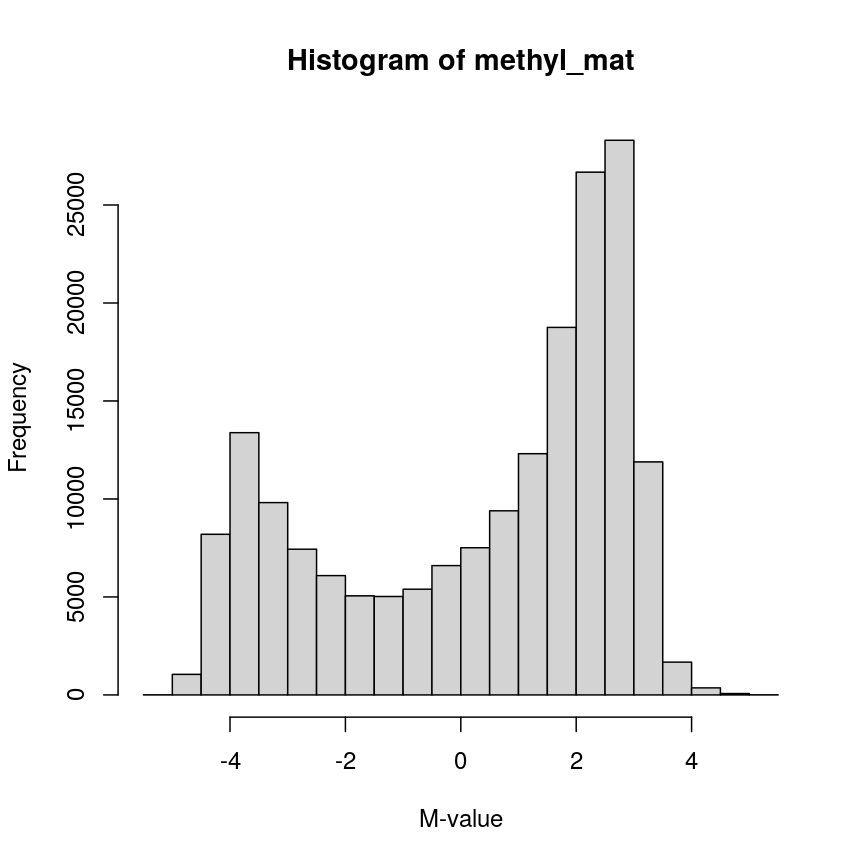

Methylation levels are generally bimodally distributed.

You can see that there are two peaks in this distribution, corresponding
to features which are largely unmethylated and methylated, respectively.

Similarly, we can examine the `colData()`, which represents the
sample-level metadata we have relating to these data. In this case, the
metadata, phenotypes, and groupings in the `colData` look like this for
the first 6 samples:

~~~
knitr::kable(head(colData(methylation)), row.names = FALSE)
~~~
{: .language-r}

|Sample_Well |Sample_Name | purity|Sex | Age| weight_kg| height_m|      bmi|bmi_clas   |Ethnicity_wide |Ethnic_self    |smoker |Array  |        Slide|
|:-----------|:-----------|------:|:---|---:|---------:|--------:|--------:|:----------|:--------------|:--------------|:------|:------|------------:|
|A07         |PCA0612     |     94|M   |  39|  88.45051|   1.8542| 25.72688|Overweight |Mixed          |Hispanic       |No     |R01C01 | 201868500150|
|C07         |NKpan2510   |     95|M   |  49|  81.19303|   1.6764| 28.89106|Overweight |Indo-European  |Caucasian      |No     |R03C01 | 201868500150|
|E07         |WB1148      |     95|M   |  20|  80.28585|   1.7526| 26.13806|Overweight |Indo-European  |Persian        |No     |R05C01 | 201868500150|
|G07         |B0044       |     97|M   |  49|  82.55381|   1.7272| 27.67272|Overweight |Indo-European  |Caucasian      |No     |R07C01 | 201868500150|
|H07         |NKpan1869   |     95|F   |  33|  87.54333|   1.7272| 29.34525|Overweight |Indo-European  |Caucasian      |No     |R08C01 | 201868500150|
|B03         |NKpan1850   |     93|F   |  21|  87.54333|   1.6764| 31.15070|Obese      |Mixed          |Finnish/Creole |No     |R02C01 | 201868590193|

In this episode, we will focus on the association between age and
methylation. The following heatmap summarises age and methylation levels 
available in the Prostate dataset:

~~~
age <- methylation$Age

library("ComplexHeatmap")
order <- order(age)
age_ord <- age[order]
methyl_mat_ord <- methyl_mat[, order]

Heatmap(methyl_mat_ord,
        name = "M-value",
        cluster_columns = FALSE,
        show_row_names = FALSE,
        show_column_names = FALSE,
        row_title = "Feature",
        column_title =  "Sample",
        top_annotation = columnAnnotation(age = age_ord))
~~~
{: .language-r}

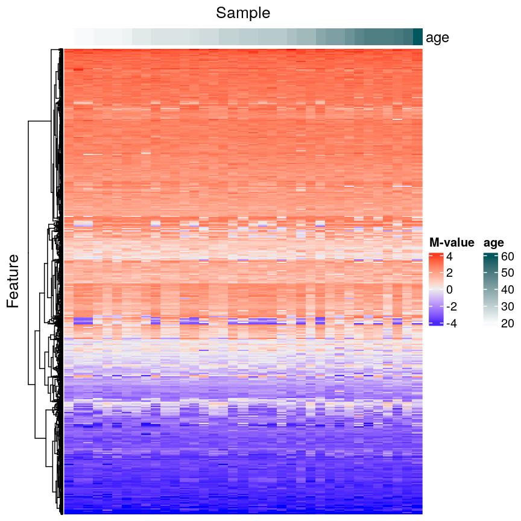

Visualising the data as a heatmap, it's clear that there's too many models to fit 'by hand'.

Depending on the scientific question of interest, two types of high-dimensional 
problems could be explored in this context:

1. To predict age using methylation leves as predictors. In this case, we would 
have a single outcome (age) which will be predicted using 5000 covariates 
(methylation levels across the genome). 

2. To predict methylation levels using age as a predictor. In this case, we 
would have 5000 outcomes (methylation levels across the genome) and a single 
covariate (age). 

The examples in this episode will focus on the second type of problem, whilst 
the next episode will focus on the first.

> ## Challenge 1
>
> Why can we not just fit many linear regression models, one for each of the columns
> in the `colData` above against each of the features in the matrix of
> assays, and choose all of the significant results at a p-value of
> 0.05?
>
> > ## Solution
> >
> > There are a number of problems that this kind of approach presents.
> > For example: 1. Without a research question in mind when creating a
> > model, it's not clear how we can interpret each model, and
> > rationalising the results after the fact can be dangerous; it's easy
> > to make up a "story" that isn't grounded in anything but the fact
> > that we have signif findings. 2. We may not have a representative
> > sample for each of these covariates. For example, we may have very
> > small sample sizes for some ethnicities, leading to spurious
> > findings. 3. If we perform 5000 tests for each of
> > 14 variables, even if there were no true
> > associations in the data, we'd be likely to observe some strong
> > spurious associations that arise just from random noise.
> >
> {: .solution}
{: .challenge}

> ## Measuring DNA Methylation
>
> DNA methylation is an epigenetic modification of DNA. Generally, we
> are interested in the proportion of methylation at many sites or
> regions in the genome. DNA methylation microarrays, as we are using
> here, measure DNA methylation using two-channel microarrays, where one
> channel captures signal from methylated DNA and the other captures
> unmethylated signal. These data can be summarised as "Beta values"
> ($\beta$ values), which is the ratio of the methylated signal to the
> total signal (methylated plus unmethylated). The $\beta$ value for
> site $i$ is calculated as
>
> $$
>     \beta_i = \frac{
>         m_i
>     } {
>         u_{i} + m_{i}
>     }
> $$
>
> where $m_i$ is the methylated signal for site $i$ and $u_i$ is the
> unmethylated signal for site $i$. $\beta$ values take on a value in
> the range $[0, 1]$, with 0 representing a completely unmethylated site
> and 1 representing a completely methylated site.
>
> The M-values we use here are the $\log_2$ ratio of methylated versus
> unmethylated signal:
>
> $$
>     M_i = \log_2\left(\frac{m_i}{u_i}\right)
> $$
>
> M-values are not bounded to an interval as Beta values are, and
> therefore can be easier to work with in statistical models.
{: .callout}

# Regression with many outcomes

In high-throughput studies, it is common to have one or more phenotypes
or groupings that we want to relate to features of interest (eg, gene
expression, DNA methylation levels). In general, we want to identify
differences in the features of interest that are related to a phenotype
or grouping of our samples. Identifying features of interest that vary
along with phenotypes or groupings can allow us to understand how
phenotypes arise or manifest. Analysis of this type are sometimes referred 
to using the term *differential analysis*. 

For example, we might want to identify genes that are expressed at a
higher level in mutant mice relative to wild-type mice to understand the
effect of a mutation on cellular phenotypes. Alternatively, we might
have samples from a set of patients, and wish to identify epigenetic
features that are different in young patients relative to old patients,
to help us understand how ageing manifests.

Using linear regression, it is possible to identify differences like
these. However, high-dimensional data like the ones we're working with
require some special considerations. A primary consideration, as we saw
above, is that there are far too many features to fit each one-by-one as
we might do when analysing low-dimensional datasets (for example using
`lm` on each feature and checking the linear model assumptions). A
secondary consideration is that statistical approaches may behave
slightly differently in very high-dimensional data, compared to
low-dimensional data. A third consideration is the speed at which we can
actually compute statistics for data this large -- methods optimised for
low-dimensional data may be very slow when applied to high-dimensional
data.

Ideally when performing regression, we want to identify cases like this,
where there is a clear association, and we probably "don't need"
statistics:

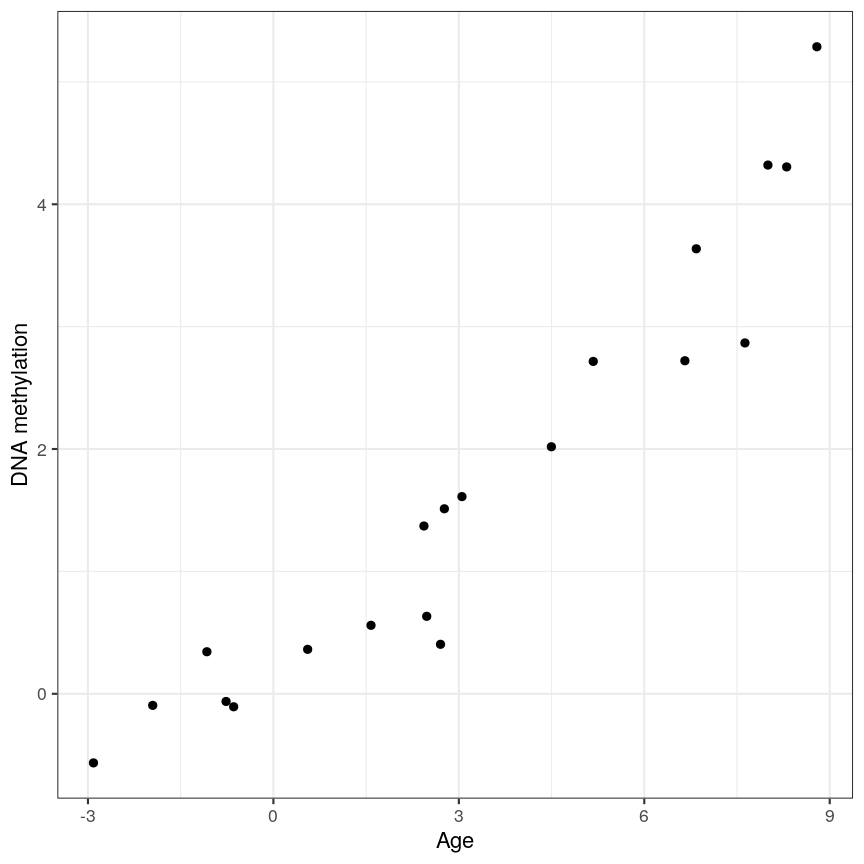

A scatter plot of age and a feature of interest.

or equivalently for a discrete covariate:

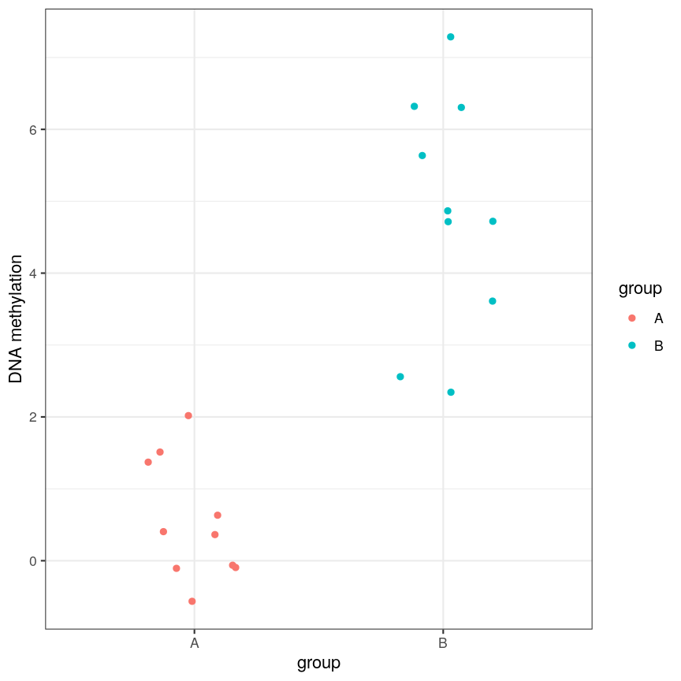

A scatter plot of a grouping and a feature of interest.

However, often due to small differences and small sample sizes, the
problem is more difficult:

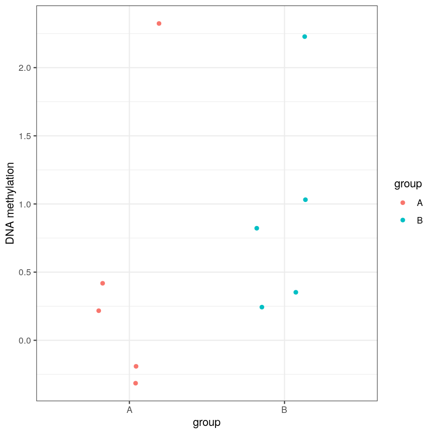

A scatter plot of a grouping and a feature of interest.

And, of course, we often have an awful lot of features and need to
prioritise a subset of them! We need a rigorous way to prioritise genes
for further analysis.

# Fitting a linear model

So, in the data we have read in, we have a matrix of methylation values
$X$ and a vector of ages, $y$. One way to model this is to see if we can
use age to predict the expected (average) methylation value for sample
$j$ at a given locus $i$, which we can write as $X_{ij}$. We can write
that model as:

$$
    \mathbf{E}(X_{ij}) = \beta_0 + \beta_1 \text{Age}_j
$$

where $\text{Age}_j$ is the age of sample $j$. In this model, $\beta_1$
represents the unit change in mean methylation level for each unit
(year) change in age. For a specific CpG, we can fit this model and get more 
information from the model object. For illustration purposes, here we 
arbitrarily select the first CpG in the `methyl_mat` matrix (the one on its first row).

~~~
age <- methylation$Age
# methyl_mat[1, ] indicates that the 1st CpG will be used as outcome variable
lm_age_methyl1 <- lm(methyl_mat[1, ] ~ age)
lm_age_methyl1
~~~
{: .language-r}

~~~

Call:
lm(formula = methyl_mat[1, ] ~ age)

Coefficients:
(Intercept)          age  
   0.902334     0.008911  
~~~
{: .output}

We now have estimates for the expected methylation level when age equals
0 (the intercept) and the change in methylation level for a unit change
in age (the slope). We could plot this linear model:

~~~
plot(age, methyl_mat[1, ], xlab = "Age", ylab = "Methylation level", pch = 16)
abline(lm_age_methyl1)
~~~
{: .language-r}

A scatter plot of age versus the methylation level for an arbitrarily selected CpG side (the one stored as the first column of methyl_mat). Each dot represents an individual. The black line represents the estimated linear model.

For this feature, we can see that there is no strong relationship
between methylation and age. We could try to repeat this for every
feature in our dataset; however, we have a lot of features! We need an
approach that allows us to assess associations between all of these
features and our outcome while addressing the three considerations we
outlined previously. Before we introduce this approach, let's go into
detail about how we generally check whether the results of a linear
model are statistically significant.

# Hypothesis testing in linear regression

Using the linear model we defined above, we can ask questions based on the 
estimated value for the regression coefficients. For example, do individuals
with different age have different methylation values for a given CpG? We usually 
do this via *hypothesis testing*. This framework compares the results that we 
observed (here, estimated linear model coefficients) to the results you would 
expect under a *null hypothesis* associated to our question. In the example above, 
a suitable null hypothesis would test whether the regression coefficient associated
to age ($\beta_1$) is equal to zero or not. If $\beta_1$ is equal to zero,
the linear model indicates that there is no linear relationship between age
and the methylation level for the CpG  (remember: as its name suggests, linear 
regression can only be used to model linear relationships between predictors and 
outcomes!). In other words, there answer to our question would be: no!

The output of a linear model typically returns the results associated 
to the null hypothesis described above (this may not always be the most realistic 
or useful null hypothesis, but it is the one we have by default!). To be 
more specific, the test compares our observed results with a set of 
hypothetical counter-examples of what we would expect to observe if we repeated 
the same experiment and analysis over and over again under the null hypothesis. 

For this linear model, we can use `tidy()` from the **`broom`** package to 
extract detailed information about the coefficients and the associated 
hypothesis tests in this model:

~~~
library("broom")
tidy(lm_age_methyl1)
~~~
{: .language-r}

~~~
# A tibble: 2 × 5
  term        estimate std.error statistic p.value
  <chr>          <dbl>     <dbl>     <dbl>   <dbl>
1 (Intercept)  0.902      0.344      2.62   0.0129
2 age          0.00891    0.0100     0.888  0.381 
~~~
{: .output}

The standard errors (`std.error`) represent the statistical uncertainty in our
regression coefficient estimates (often referred to as *effect size*). The test 
statistics and p-values represent measures of how (un)likely it would be to observe 
results like this under the "null hypothesis".

> ## Challenge 2
>
> In the model we fitted, the estimate for the intercept is 0.902 and its associated 
> p-value is 0.0129. What does this mean?
>
> > ## Solution
> >
> > The first coefficient in a linear model like this is the intercept, which measures 
> > the mean of the outcome (in this case, the methylation value for the first CpG)
> > when age is zero. In this case, the intercept estimate is 0.902. However, this is 
> > not a particularly noteworthy finding as we do not have any observations with age
> > zero (nor even any with age \< 20!).  
> >
> > The reported p-value is associated to the following null hypothesis:
> > the intercept ($\beta_0$ above) is equal to zero. Using the usual
> > significant threshold of 0.05, we reject the null hypothesis as
> > the p-value is smaller than 0.05. However, it is not really interesting
> > if this intercept is zero or not, since we probably do not care what the
> > methylation level is when age is zero. In fact, this question does not
> > even make much sense! In this example, we are more interested
> > in the regression coefficient associated to age, as that can tell us 
> > whether there is a linear relationship between age and methylation for the CpG. 
> >
> {: .solution}
{: .challenge}

# Fitting a lot of linear models

In the linear model above, we are generally interested in the second regression
coefficient (often referred to as *slope*) which measures the linear relationship
between age and methylation levels. For the first CpG, here is its estimate:

~~~
coef_age_methyl1 <- tidy(lm_age_methyl1)[2, ]
coef_age_methyl1
~~~
{: .language-r}

~~~
# A tibble: 1 × 5
  term  estimate std.error statistic p.value
  <chr>    <dbl>     <dbl>     <dbl>   <dbl>
1 age    0.00891    0.0100     0.888   0.381
~~~
{: .output}

In this case, the p-value is equal to 0.381 and therefore we cannot reject the null
hypothesis: there is no statistical evidence to suggest that the regression 
coefficient associated to age is not equal to zero. 

Now, we could do this for every feature (CpG) in the dataset and rank the
results based on their test statistic or associated p-value. However, fitting
models in this way to 5000 features is not very computationally 
efficient, and it would also be laborious to do programmatically. There are ways 
to get around this, but first let us talk about what exactly we are doing when 
we look at significance tests in this context.

# How does hypothesis testing for a linear model work?

In order to decide whether a result would be unlikely under the null
hypothesis, we must calculate a test statistic. For coefficient $k$ in a
linear model (in our case, it would be the slope), the test statistic is
a t-statistic given by:

$$
    t_{k} = \frac{\hat{\beta}_{k}}{SE\left(\hat{\beta}_{k}\right)}
$$

$SE\left(\hat{\beta}_{k}\right)$ measures the uncertainty we have in our
effect size estimate. Knowing what distribution these t-statistics
follow under the null hypothesis allows us to determine how unlikely it
would be for us to observe what we have under those circumstances, if we
repeated the experiment and analysis over and over again. To
demonstrate, we can compute the t-statistics "by hand" (advanced content).

~~~
table_age_methyl1 <- tidy(lm_age_methyl1)
~~~
{: .language-r}

We can see that the t-statistic is just the ratio between the coefficient estimate
and the standard error:

~~~
tvals <- table_age_methyl1$estimate / table_age_methyl1$std.error
all.equal(tvals, table_age_methyl1$statistic)
~~~
{: .language-r}

~~~
[1] TRUE
~~~
{: .output}

Calculating the p-values is a bit more tricky. Specifically, it is the
proportion of the distribution of the test statistic under the null
hypothesis that is *as extreme or more extreme* than the observed value
of the test statistic. This is easy to observe visually, by plotting the
theoretical distribution of the test statistic under the null hypothesis 
(see next call-out box for more details about it):

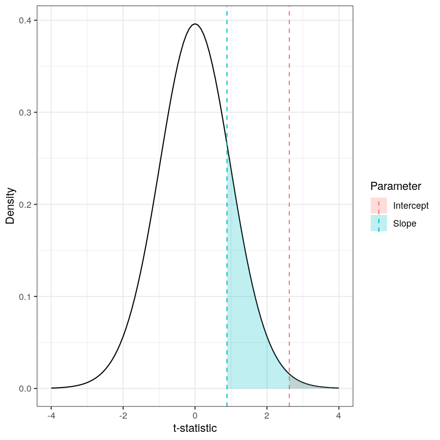

The p-value for a regression coefficient represents how often it'd be observed under the null.

The red-ish shaded region represents the portion of the distribution of
the test statistic under the null hypothesis that is equal or greater to
the value we observe for the intercept term. As our null hypothesis 
relates to a 2-tail test (as the null hypothesis states that the regression
coefficient is equal to zero, we would reject it if the regression
coefficient is substantially larger **or** smaller than zero), the p-value for
the test is twice the value of the shaded region. In this case, the shaded region 
is small relative to the total area of the null distribution; therefore, the
p-value is small ($p=0.013$). The blue-ish shaded region represents the same measure for the slope term; 
this is larger, relative to the total area of the distribution, therefore the 
p-value is larger than the one for the intercept term 
($p=0.381$). The
the p-value is a function of the test statistic: the ratio between the effect size 
we're estimating and the uncertainty we have in that effect. A large effect with large
uncertainty may not lead to a small p-value, and a small effect with
small uncertainty may lead to a small p-value.

> ## Calculating p-values from a linear model
>
> Manually calculating the p-value for a linear model is a little bit
> more complex than calculating the t-statistic. The intuition posted
> above is definitely sufficient for most cases, but for completeness,
> here is how we do it:
>
> Since the statistic in a linear model is a t-statistic, it follows a
> student t distribution under the null hypothesis, with degrees of
> freedom (a parameter of the student t-distribution) given by the
> number of observations minus the number of coefficients fitted, in
> this case
> $37 - 2 = 35$.
> We want to know what portion of the distribution function of the test
> statistic is as extreme as, or more  extreme than, the value we observed.
> The function`pt()`(similar to`pnorm()`, etc) can give us this information.
>
> Since we're not sure if the coefficient will be larger or smaller than
> zero, we want to do a 2-tail test. Therefore we take the absolute
> value of the t-statistic, and look at the upper rather than lower
> tailed. In the figure above the shaded areas are only looking at "half" of the
> t-distribution (which is symmetric around zero), therefore we multiply the 
> shaded area by 2 in order to calculate the p-value. 
>
> Combining all of this gives us:
>
> 
> ~~~
> pvals <- 2 * pt(abs(tvals), df = lm_age_methyl1$df, lower.tail = FALSE)
> all.equal(table_age_methyl1$p.value, pvals)
> ~~~
> {: .language-r}
> 
> 
> 
> ~~~
> [1] TRUE
> ~~~
> {: .output}
{: .callout}

# Sharing information across outcome variables

Now that we understand how hypothesis tests work in the 
linear model framework, we are going to introduce an idea that allows us to
take advantage of the fact that we carry out many tests at once on
structured data. We can leverage this fact to *share information*
between model parameters. The insight that we use to perform
*information pooling* or sharing is derived from our knowledge about the
structure of the data. For example, in a high-throughput experiment like
a DNA methylation assay, we know that all of the features were measured
simultaneously, using the same technique. This means that generally, we
expect the base-level variability for each feature to be broadly
similar.

This can enable us to get a better estimate of the uncertainty of model
parameters than we could get if we consider each feature in isolation.
So, to share information between features allows us to get more robust
estimators. Remember that the t-statistic for coefficient $\beta_k$ in a
linear model is the ratio between the coefficient estimate and its standard
error:

$$
    t_{k} = \frac{\hat{\beta}_{k}}{SE\left(\hat{\beta}_{k}\right)}
$$

It is clear that large effect sizes will likely lead to small p-values,
as long as the standard error for the coefficent is not large. However,
the standard error is affected by the amount of noise, as we saw
earlier. If we have a small number of observations, it is common for the
noise for some features to be extremely small simply by chance. This, in turn,
causes small p-values for these features, which may give us unwarranted
confidence in the level of certainty we have in the results (false positives).

There are many statistical methods in genomics that use this type of
approach to get better estimates by pooling information between features
that were measured simultaneously using the same techniques. Here we
will focus on the package **`limma`**, which is an established software
package used to fit linear models, originally for the gene expression
micro-arrays that were common in the 2000s, but which is still in use in
RNAseq experiments, among others. The authors of **`limma`** made some
assumptions about the distributions that these follow, and pool
information across genes to get a better estimate of the uncertainty in
effect size estimates. It uses the idea that noise levels should be
similar between features to *moderate* the estimates of the test
statistic by shrinking the estimates of standard errors towards a common
value. This results in a *moderated t-statistic*.

The process of running a model in **`limma`** is somewhat different to what you
may have seen when running linear models. Here, we define a *model matrix* or 
*design matrix*, which is a way of representing the
coefficients that should be fit in each linear model. These are used in
similar ways in many different modelling libraries.

~~~
library("limma")
design_age <- model.matrix(~age)
dim(design_age)
~~~
{: .language-r}

~~~
[1] 37  2
~~~
{: .output}

~~~
head(design_age)
~~~
{: .language-r}

~~~
  (Intercept) age
1           1  39
2           1  49
3           1  20
4           1  49
5           1  33
6           1  21
~~~
{: .output}

> ## What is a model matrix?
> When R fits a regression model, it chooses a vector of regression coefficients 
> that minimises the differences between outcome values and those values 
> predicted by using the covariates (or predictor variables). But how do we get 
> from a set of predictors and regression coefficients to predicted values? This 
> is done via matrix multipliciation. The matrix of predictors is (matrix) 
> multiplied by the vector of coefficients. That matrix is called the 
> **model matrix** (or design matrix). It has one row for each observation and 
> one column for each predictor plus (by default) one aditional column of ones 
> (the intercept column). Many R libraries (but not **`limma`** ) contruct the 
> model matrix behind the scenes. Usually, it can be extracted from a model fit 
> using the function `model.matrix()`. Here is an example:
> 
> 
> ~~~
> data(cars)
> head(cars)
> ~~~
> {: .language-r}
> 
> 
> 
> ~~~
>   speed dist
> 1     4    2
> 2     4   10
> 3     7    4
> 4     7   22
> 5     8   16
> 6     9   10
> ~~~
> {: .output}
> 
> 
> 
> ~~~
> mod1 <- lm(dist ~ speed, data=cars) # fit regression model using speed as a predictor
> head(model.matrix(mod1)) # the model matrix contains two columns: intercept and speed
> ~~~
> {: .language-r}
> 
> 
> 
> ~~~
>   (Intercept) speed
> 1           1     4
> 2           1     4
> 3           1     7
> 4           1     7
> 5           1     8
> 6           1     9
> ~~~
> {: .output}
{: .callout}

As you can see, the design matrix has the same number of rows as our
methylation data has samples. It also has two columns - one for the
intercept (similar to the linear model we fit above) and one for age.
This happens "under the hood" when fitting a linear model with `lm()`, but
here we have to specify it directly. The [limma user
manual](https://www.bioconductor.org/packages/release/bioc/vignettes/limma/inst/doc/usersguide.pdf)
has more detail on how to make design matrices for different types of
experimental design, but here we are going to stick with this simple two-variable case.

We then pass our matrix of methylation values into `lmFit()`, specifying
the design matrix. Internally, this function runs `lm()` on each row of
the data in an efficient way. The function `eBayes()`, when applied to the
output of `lmFit()`, performs the pooled estimation of standard errors
that results in the moderated t-statistics and resulting p-values.

~~~
fit_age <- lmFit(methyl_mat, design = design_age)
fit_age <- eBayes(fit_age)
~~~
{: .language-r}

To obtain the results of the linear models, we can use the `topTable()`
function. By default, this returns results for the first coefficient in
the model. As we saw above when using `lm()`, and when we defined
`design_age` above, the first coefficient relates to the intercept term,
which we are not particularly interested in here; therefore we specify
`coef = 2`. Further, `topTable()` by default only returns the top 10
results. To see all of the results in the data, we specify
`number = nrow(fit_age)` to ensure that it returns a row for every row
of the input matrix.

~~~
toptab_age <- topTable(fit_age, coef = 2, number = nrow(fit_age))
orderEffSize <- rev(order(abs(toptab_age$logFC))) # order by effect size (absolute log-fold change)
head(toptab_age[orderEffSize, ])
~~~
{: .language-r}

~~~
                 logFC    AveExpr         t    P.Value adj.P.Val         B
cg22160073 -0.07615967  0.2261869 -2.200534 0.03410063 0.2563957 -5.536033
cg02371766 -0.07480442  1.6744282 -2.032526 0.04933710 0.3004092 -5.861179
cg18633711 -0.07221177 -0.1668962 -2.254569 0.03017881 0.2459313 -5.427228
cg01267675 -0.06393861  1.2496114 -2.127641 0.04010694 0.2758387 -5.679584
cg07334644 -0.05880317  0.9591176 -2.297448 0.02735916 0.2339981 -5.339467
cg01387455 -0.05873510  0.5872700 -2.051339 0.04737637 0.2964936 -5.825782
~~~
{: .output}

The output of `topTable` includes the coefficient, here termed a log
fold change `logFC`, the average level (`aveExpr`), the t-statistic `t`,
the p-value (`P.Value`), and the *adjusted* p-value (`adj.P.Val`). We'll
cover what an adjusted p-value is very shortly. The table also includes
`B`, which represents the log-odds that a feature is signficantly
different, which we won't cover here, but which will generally be a 1-1
transformation of the p-value. The coefficient estimates here are termed
`logFC` for legacy reasons relating to how microarray experiments were
traditionally performed. There are more details on this topic in many
places, for example [this tutorial by Kasper D.
Hansen](https://kasperdanielhansen.github.io/genbioconductor/html/limma.html)

Now we have estimates of effect sizes and p-values for the association
between methylation level at each locus and age for our 37 samples. It's
useful to create a plot of effect size estimates (model coefficients)
against p-values for each of these linear models, to visualise the
magnitude of effects and the statistical significance of each. These
plots are often called "volcano plots", because they resemble an
eruption.

~~~
plot(toptab_age$logFC, -log10(toptab_age$P.Value),
    xlab = "Effect size", ylab = bquote(-log[10](p-value)),
    pch = 19
)
~~~
{: .language-r}

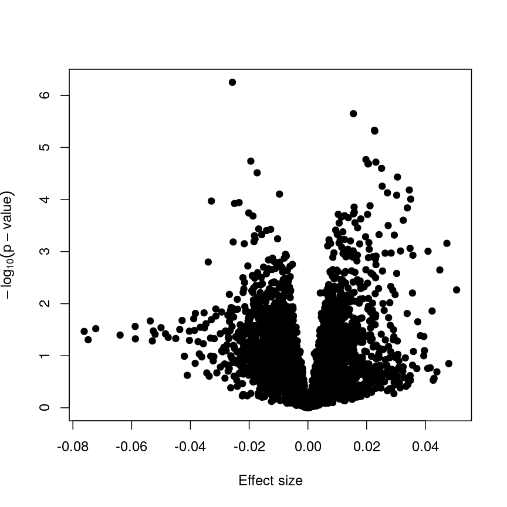

Plotting p-values against effect sizes using limma; the results are similar to a standard linear model.

In this figure, every point represents a feature of interest. The x-axis
represents the effect size observed for that feature in a linear model,
while the y-axis is the $-\log_{10}(\text{p-value})$, where larger
values indicate increasing statistical evidence of a non-zero effect
size. A positive effect size represents increasing methylation with
increasing age, and a negative effect size represents decreasing
methylation with increasing age. Points higher on the x-axis represent
features for which we think the results we observed would be very
unlikely under the null hypothesis.

Since we want to identify features that have different methylation levels
in different age groups, in an ideal case there would be clear
separation between "null" and "non-null" features. However, usually we
observe results as we do here: there is a continuum of effect sizes and
p-values, with no clear separation between these two classes of
features. While statistical methods exist to derive insights from
continuous measures like these, it is often convenient to obtain a list
of features which we are confident have non-zero effect sizes. This is
made more difficult by the number of tests we perform.

> ## Challenge 3
>
> The effect size estimates are very small, and yet many of the p-values
> are well below a usual significance level of p \< 0.05. Why is this?
>
> > ## Solution
> >
> > Because age has a much larger range than methylation levels, the
> > unit change in methylation level even for a strong relationship is
> > very small!
> >
> > As we mentioned, the p-value is a function of both the effect size
> > estimate and the uncertainty (standard error) of that estimate.
> > Because the uncertainty in our estimates is much smaller than the
> > estimates themselves, the p-values are also small.
> >
> > If we predicted age using methylation level, it is likely we would see
> > much larger coefficients, though broadly similar p-values!
> >
> {: .solution}
{: .challenge}

It is worthwhile considering what exactly the effect of the *moderation*
or information sharing that **`limma`** performs has on our results. To do
this, let us compare the effect sizes estimates and p-values from the two
approaches.

plot of chunk plot-limma-lm-effect

These are exactly identical! This is because **`limma`** does not perform
any sharing of information when estimating effect sizes. This is in
contrast to similar packages that apply shrinkage to the effect size
estimates, like **`DESeq2`**. These often use information sharing to shrink
or moderate the effect size estimates, in the case of **`DESeq2`** by again
sharing information between features about sample-to-sample variability.
In contrast, let us look at the p-values from **`limma`** and R's built-in `lm()` function:

plot of chunk plot-limma-lm-pval

we can see that for the vast majority of features, the results are
broadly similar. There seems to be a minor general tendency for **`limma`**
to produce smaller p-values, but for several features, the p-values from
limma are considerably larger than the p-values from `lm()`. This is
because the information sharing tends to shrink large standard error
estimates downwards and small estimates upwards. When the degree of
statistical significance is due to an abnormally small standard error
rather than a large effect, this effect results in this prominent
reduction in statistical significance, which has been shown to perform
well in case studies. The degree of shrinkage generally depends on the
amount of pooled information and the strength of the evidence
independent of pooling. For example, with very few samples and many
features, information sharing has a larger effect, because there are a
lot of genes that can be used to provide pooled estimates, and the
evidence from the data that this is weighed against is relatively
sparse. In contrast, when there are many samples and few features, there
is not much opportunity to generate pooled estimates, and the evidence
of the data can easily outweigh the pooling.

Shrinkage methods like these ones can be complex to implement and
understand, but it is useful to develp an intuition why these approaches may be more
precise and sensitive than the naive approach of fitting a model to each
feature separately.

> ## Challenge 4
>
> 1.  Try to run the same kind of linear model with smoking status as
>     covariate instead of age, and making a volcano plot. *Note:
>     smoking status is stored as* `methylation$smoker`.
> 2.  We saw in the example in the lesson that this information sharing
>     can lead to larger p-values. Why might this be preferable?
>
> > ## Solution
> >
> > 1.  The following code runs the same type of model with smoking
> >     status:
> >
> >     
> >     ~~~
> >     design_smoke <- model.matrix(~methylation$smoker)
> >     fit_smoke <- lmFit(methyl_mat, design = design_smoke)
> >     fit_smoke <- eBayes(fit_smoke)
> >     toptab_smoke <- topTable(fit_smoke, coef = 2, number = nrow(fit_smoke))
> >     plot(toptab_smoke$logFC, -log10(toptab_smoke$P.Value),
> >         xlab = "Effect size", ylab = bquote(-log[10](p)),
> >         pch = 19
> >     )
> >     ~~~
> >     {: .language-r}
> >     
> >     

> >     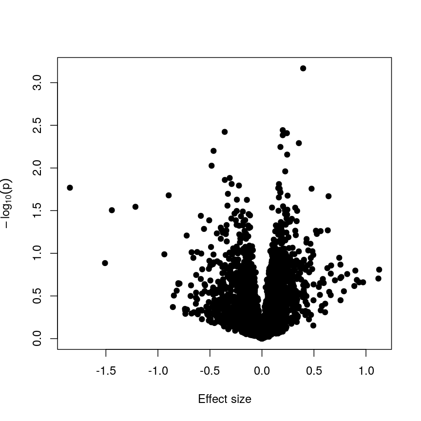
> >     
A plot of significance against effect size for a regression of smoking against methylation.

> >     

> >
> > 2.  Being a bit more conservative when identifying features can help
> >     to avoid false discoveries. Furthermore, when rejecting the null
> >     hypothesis is based more on a small standard error resulting
> >     from abnormally low levels of variability for a given feature,
> >     we might want to be a bit more conservative in our expectations.
> {: .solution}
{: .challenge}

> ## Shrinkage
>
> Shrinkage is an intuitive term for an effect of information sharing,
> and is something observed in a broad range of statistical models.
> Often, shrinkage is induced by a *multilevel* modelling approach or by
> *Bayesian* methods.
>
> The general idea is that these models incorporate information about
> the structure of the data into account when fitting the parameters. We
> can share information between features because of our knowledge about
> the data structure; this generally requires careful consideration
> about how the data were generated and the relationships within.
>
> An example people often use is estimating the effect of attendance on
> grades in several schools. We can assume that this effect is similar
> in different schools (but maybe not identical), so we can *share
> information* about the effect size between schools and shink our
> estimates towards a common value.
>
> For example in **`DESeq2`**, the authors used the observation that genes
> with similar expression counts in RNAseq data have similar
> *dispersion*, and a better estimate of these dispersion parameters
> makes estimates of fold changes much more stable. Similarly, in
> **`limma`** the authors made the assumption that in the absence of
> biological effects, we can often expect the technical variation in the
> measurement of the expression of each of the genes to be broadly
> similar. Again, better estimates of variability allow us to prioritise
> genes in a more reliable way.
>
> There are many good resources to learn about this type of approach,
> including:
>
> -   [a blog post by TJ
>     Mahr](https://www.tjmahr.com/plotting-partial-pooling-in-mixed-effects-models/)
> -   [a book by David Robinson](https://gumroad.com/l/empirical-bayes)
> -   [a (relatively technical) book by Gelman and
>     Hill](http://www.stat.columbia.edu/~gelman/arm/)
{: .callout}

# The problem of multiple tests

With such a large number of features, it would be useful to decide which
features are "interesting" or "significant" for further study. However,
if we were to apply a normal significance threshold of 0.05, it would be likely
we end up with a lot of false positives. This is because a p-value
threshold like this represents a $\frac{1}{20}$ chance that we observe
results as extreme or more extreme under the null hypothesis (that there
is no assocation between age and methylation level). If we carry out many more
than 20 such tests, we can expect to see situations where, despite the null
hypothesis being true, we observe observe signifiant p-values due to random chance. To
demonstrate this, it is useful to see what happens if we permute (scramble) the age values and
run the same test again:

~~~
age_perm <- age[sample(ncol(methyl_mat), ncol(methyl_mat))]
design_age_perm <- model.matrix(~age_perm)

fit_age_perm <- lmFit(methyl_mat, design = design_age_perm)
fit_age_perm <- eBayes(fit_age_perm)
toptab_age_perm <- topTable(fit_age_perm, coef = 2, number = nrow(fit_age_perm))

plot(toptab_age_perm$logFC, -log10(toptab_age_perm$P.Value),
    xlab = "Effect size", ylab = bquote(-log[10](p)),
    pch = 19
)
abline(h = -log10(0.05), lty = "dashed", col = "red")
~~~
{: .language-r}

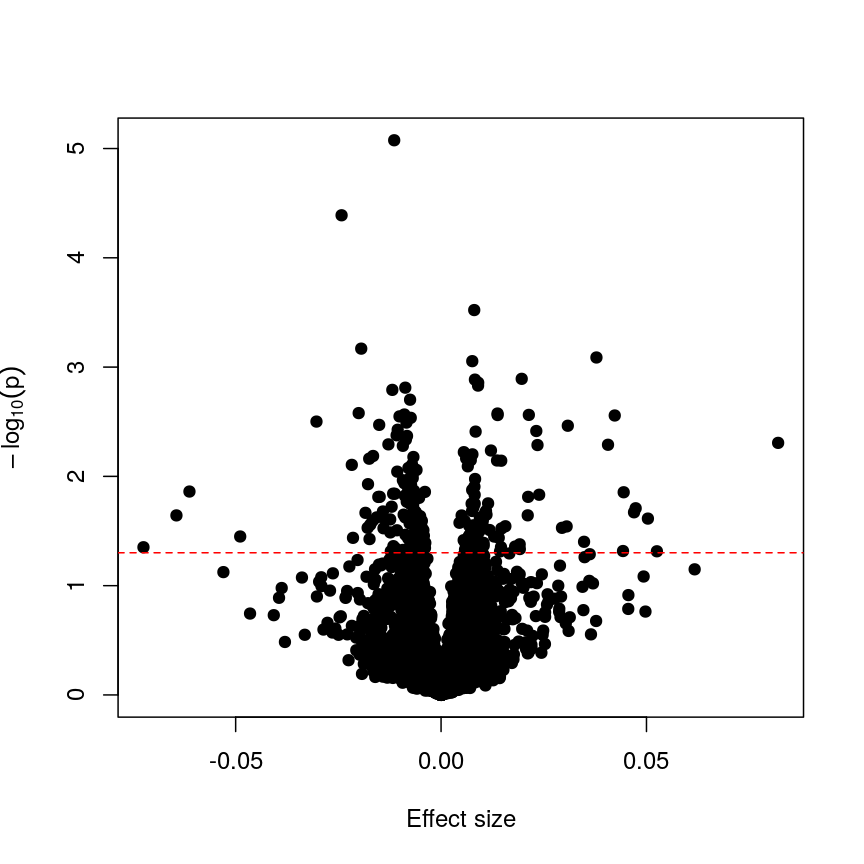

Plotting p-values against effect sizes for a randomised outcome shows we still observe 'significant' results.

Since we have generated a random sequence of ages, we have no reason to
suspect that there is a true association between methylation levels and
this sequence of random numbers. However, you can see that the p-value
for many features is still lower than a traditional significance level
of $p=0.05$. In fact, here 235
features are significant at p \< 0.05. If we were to use this fixed
threshold in a real experiment, it is likely that we would identify many
features as associated with age, when the results we are observing are
simply due to chance.

> ## Challenge 5
>
> 1.  If we run 5000 tests under the null hypothesis,
>     how many of them (on average) will be statistically significant at
>     a threshold of $p < 0.05$?
> 2.  Why would we want to be conservative in labelling features as
>     significantly different? By conservative, we mean to err towards
>     labelling true differences as "not significant" rather than vice
>     versa.
> 3.  How could we account for a varying number of tests to ensure
>     "significant" changes are truly different?
>
> > ## Solution
> >
> > 1.  By default we expect
> >     $5000 \times 0.05 = 250$
> >     features to be statistically significant under the null
> >     hypothesis, because p-values should always be uniformly
> >     distributed under the null hypothesis.
> > 2.  Features that we label as "significantly different" will often
> >     be reported in manuscripts. We may also spend time and money
> >     investigating them further, computationally or in the lab.
> >     Therefore, spurious results have a real cost for ourselves and
> >     for others.
> > 3.  One approach to controlling for the number of tests is to divide
> >     our significance threshold by the number of tests performed.
> >     This is termed "Bonferroni correction" and we'll discuss this
> >     further now.
> {: .solution}
{: .challenge}

# Adjusting for multiple tests

When performing many statistical tests to categorise features, we are
effectively classifying features as "non-significant" or "significant", that latter meaning those for
which we reject the null hypothesis. We also
generally hope that there is a subset of features for which the null
hypothesis is truly false, as well as many for which the null truly does
hold. We hope that for all features for which the null hypothesis is
true, we accept it, and for all features for which the null hypothesis
is not true, we reject it. As we showed in the example with permuted
age, with a large number of tests it is inevitable that we will get some of
these wrong.

We can think of these features as being "truly different" or "not truly
different"[^1]. Using this idea, we can see that each categorisation we
make falls into four categories:

[^1]: "True difference" is a hard category to rigidly define. As we've
    seen, with a lot of data, we can detect tiny differences, and with
    little data, we can't detect large differences. However, both can be
    argued to be "true".

|                     | Label as different | Label as not different |
|--------------------:|-------------------:|-----------------------:|
|     Truly different |      True positive |         False negative |
| Truly not different |     False positive |          True negative |

If the null hypothesis was true for every feature, then as we perform
more and more tests we'd tend to correctly categorise most results as
negative. However, since p-values are uniformly distributed under the
null, at a significance level of 5%, 5% of all results will be
"significant" even though we would expect to see these results, given
the null hypothesis is true, simply by chance. These would fall under
the label "false positives" in the table above, and are also termed
"false discoveries."

There are two common ways of controlling these false discoveries. The
first is to say, when we're doing $n$ tests, that we want to have the
same certainty of making one false discovery with $n$ tests as we have
if we're only doing one test. This is "Bonferroni" correction,[^2] which
divides the significance level by the number of tests performed, $n$.
Equivalently, we can use the non-transformed p-value threshold but
multiply our p-values by the number of tests. This is often very
conservative, especially with a lot of features!

[^2]: Bonferroni correction is also termed "family-wise" error rate
    control.

~~~
p_raw <- toptab_age$P.Value
p_fwer <- p.adjust(p_raw, method = "bonferroni")
library("ggplot2")
ggplot() +
    aes(p_raw, p_fwer) +
    geom_point() +
    scale_x_log10() + scale_y_log10() +
    geom_abline(slope = 1, linetype = "dashed") +
    geom_hline(yintercept = 0.05, linetype = "dashed", col = "red") +
    geom_vline(xintercept = 0.05, linetype = "dashed", col = "red") +
    labs(x = "Raw p-value", y = "Bonferroni p-value")
~~~
{: .language-r}

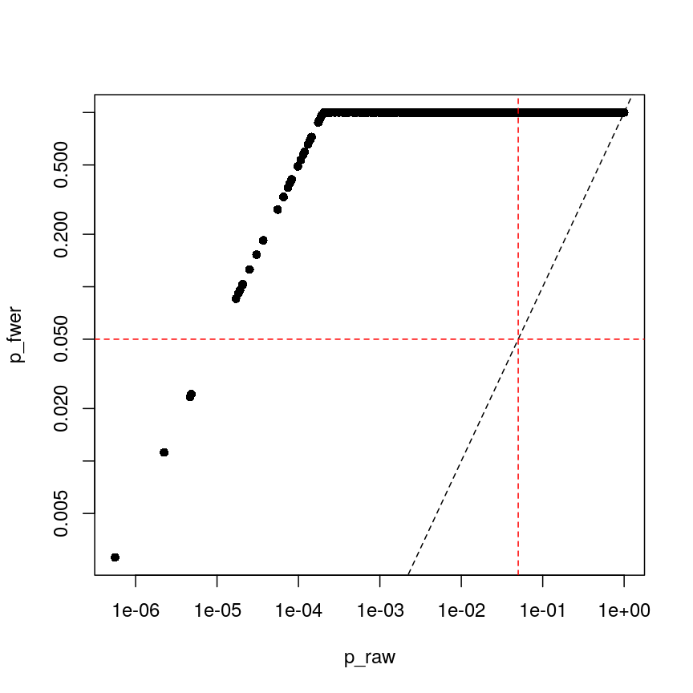

Bonferroni correction often produces very large p-values, especially with low sample sizes.

You can see that the p-values are exactly one for the vast majority of
tests we performed! This is not ideal sometimes, because unfortunately
we usually don't have very large sample sizes in health sciences.

The second main way of controlling for multiple tests is to control the
*false discovery rate*.[^3] This is the proportion of false positives,
or false discoveries, we'd expect to get each time if we repeated the
experiment over and over.

[^3]: This is often called "Benjamini-Hochberg" adjustment.

1.  Rank the p-values
2.  Assign each a rank (1 is smallest)
3.  Calculate the critical value $$
         q = \left(\frac{i}{m}\right)Q
     $$, where $i$ is rank, $m$ is the number of tests, and $Q$ is the
    false discovery rate we want to target.[^4]
4.  Find the largest p-value less than the critical value. All smaller
    than this are significant.

[^4]: People often perform extra controls on FDR-adjusted p-values,
    ensuring that ranks don't change and the critical value is never
    smaller than the original p-value.

| FWER                                                    | FDR                                              |
|:----------------------------------|:------------------------------------|
| \+ Controls probability of identifying a false positive | \+ Controls rate of false discoveries            |
| \+ Strict error rate control                            | \+ Allows error control with less stringency     |
| \- Very conservative                                    | \- Does not control probability of making errors |
| \- Requires larger statistical power                    | \- May result in false discoveries               |

> ## Challenge 6
>
> 1.  At a significance level of 0.05, with 100 tests performed, what is
>     the Bonferroni significance threshold?
> 2.  In a gene expression experiment, after FDR correction we observe
>     500 significant genes. What proportion of these genes are truly
>     different?
> 3.  Try running FDR correction on the `p_raw` vector. *Hint: check
>     `help("p.adjust")` to see what the method is called*.\
>     Compare these values to the raw p-values and the Bonferroni
>     p-values.
>
> > ## Solution
> >
> > 1.  The Bonferroni threshold for this significance threshold is $$
> >          \frac{0.05}{100} = 0.0005
> >     $$
> >
> > 2.  Trick question! We can't say what proportion of these genes are
> >     truly different. However, if we repeated this experiment and
> >     statistical test over and over, on average 5% of the results
> >     from each run would be false discoveries.
> >
> > 3.  The following code runs FDR correction and compares it to
> >     non-corrected values and to Bonferroni:
> >
> >     
> >     ~~~
> >     p_fdr <- p.adjust(p_raw, method = "BH")
> >     ggplot() +
> >         aes(p_raw, p_fdr) +
> >         geom_point() +
> >         scale_x_log10() + scale_y_log10() +
> >         geom_abline(slope = 1, linetype = "dashed") +
> >         geom_hline(yintercept = 0.05, linetype = "dashed", color = "red") +
> >         geom_vline(xintercept = 0.05, linetype = "dashed", color = "red") +
> >         labs(x = "Raw p-value", y = "Benjamini-Hochberg p-value")
> >     ~~~
> >     {: .language-r}
> >     
> >     

> >     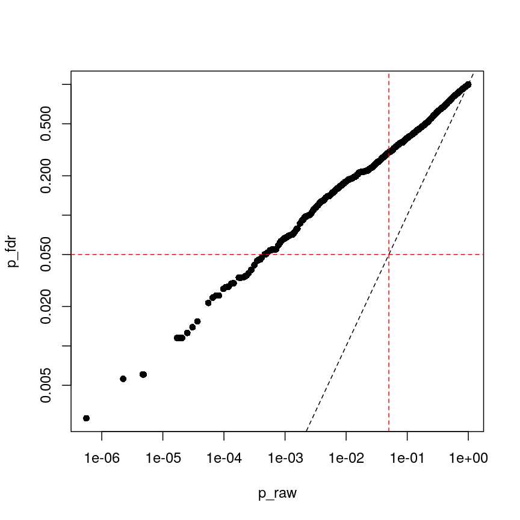
> >     
Benjamini-Hochberg correction is less conservative than Bonferroni

> >     

> >
> >     
> >     ~~~
> >     ggplot() +
> >         aes(p_fdr, p_fwer) +
> >         geom_point() +
> >         scale_x_log10() + scale_y_log10() +
> >         geom_abline(slope = 1, linetype = "dashed") +
> >         geom_hline(yintercept = 0.05, linetype = "dashed", color = "red") +
> >         geom_vline(xintercept = 0.05, linetype = "dashed", color = "red") +
> >         labs(x = "Benjamini-Hochberg p-value", y = "Bonferroni p-value")
> >     ~~~
> >     {: .language-r}
> >     
> >     

> >     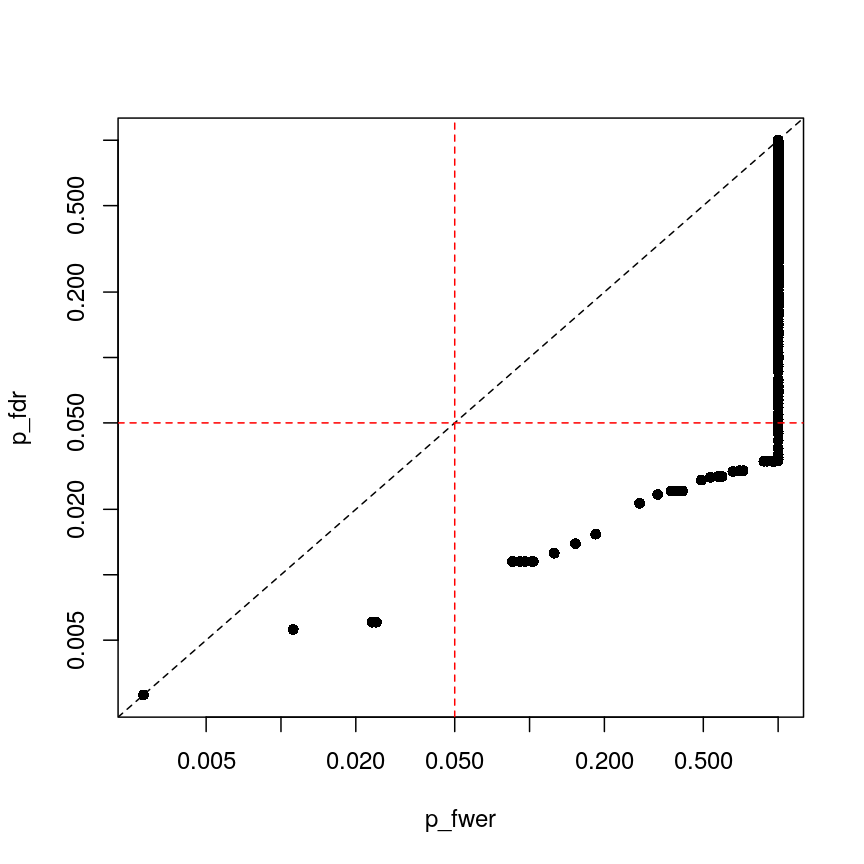
> >     
plot of chunk plot-fdr-fwer

> >     

> >
> {: .solution}
{: .challenge}

> ## Feature selection
> 
> In this episode, we have focussed on regression in a setting where there are more
> features than observations. This approach is relevant if we are interested in the
> association of each feature with some outcome or if we want to screen for features
> that have a strong association with an outcome. If, however, we are interested in
> predicting an outcome or if we want to know which features explain the variation
> in the outcome, we may want to restrict ourselves to a subset of relevant features.
> One way of doing this is called *regularisation*, and this is the topic of the next episode.
> An alternative is called *feature selection*. This is covered in the subsequent (optional) episode.  
{: .callout}

## Further reading

-   [**`limma`** tutorial by Kasper D.
    Hansen](https://kasperdanielhansen.github.io/genbioconductor/html/limma.html)
-   [**`limma`** user
    manual](https://www.bioconductor.org/packages/release/bioc/vignettes/limma/inst/doc/usersguide.pdf).
-   [The **`VariancePartition`** package](https://bioconductor.org/packages/release/bioc/vignettes/variancePartition/inst/doc/dream.html) has similar functionality as **`limma`** but allows the inclusion of random effects. 

## Footnotes


