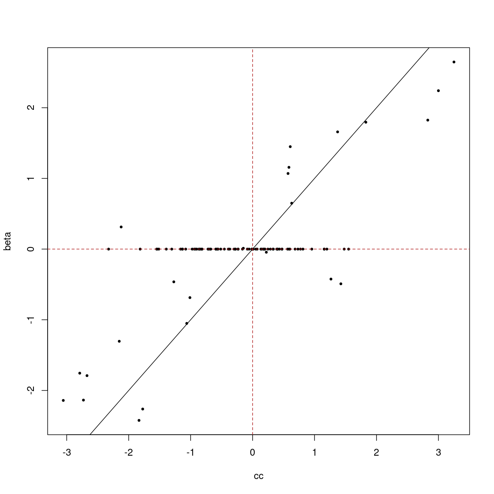
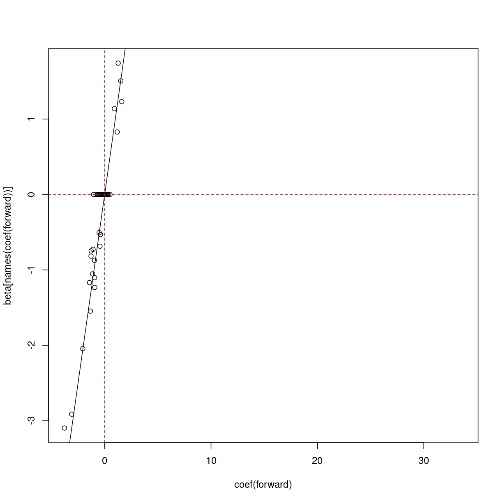
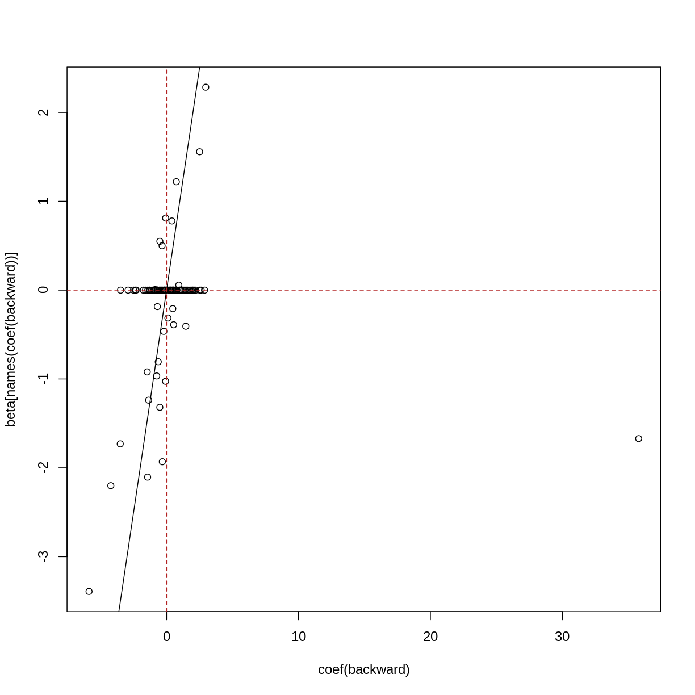

---
# Please do not edit this file directly; it is auto generated.
# Instead, please edit 02-high-dimensional-regression_b.md in _episodes_rmd/
title: "Stepwise feature selection for regression"
teaching: 0
exercises: 0
questions:
- "Why would we want to find a subset of features
  that are associated with an outcome?"
- "How can we iteratively find a good subset of our features
  variables to use for regression?"
- "What are some risks and downsides of iterative feature
  selection?"
objectives:
- "Understand multiple regression in a biomedical context."
- "Understand how to fit a stepwise regression model."
keypoints:
- "Sets of features can be more predictive and provide
  a better explanation than a single feature alone."
- "Stepwise regression allows us to find a set of features that
  are associated with an outcome (eg, age)."
- "Stepwise regression will tend to retain only one
  feature out of many that are correlated."
- "Stepwise regression is not very efficient."
math: yes
---

In the previous 

Another way of modelling these data is to model age as 

$$
    y_j = \beta_0 + \beta_1 X_1 + \dots \beta_p X_p + \epsilon_j
$$

~~~
suppressPackageStartupMessages({
    library("glmnet")
    library("limma")
    library("minfi")
    library("here")
    library("broom")
})

if (!file.exists(here("data/methylation.rds"))) {
    source(here("data/methylation.R"))
}
norm <- readRDS(here("data/methylation.rds"))

lim <- norm
y <- lim$Age
X <- getM(lim)
~~~
{: .language-r}

However when the number of predictors is greater than the number of samples
(basically always true in genetics) it isn't possible to include everything!

There are some techniques that you can use to find a set of predictors!

- screening (correlation etc): bad, don't do
- screening (variance): not necessarily bad if the screening variable is sensible
- forward/reverse/best subset selection

~~~
if (!file.exists(here("data/synthetic.rds"))) {
    source(here("data/synthetic.R"))
}
synthetic <- readRDS(here("data/synthetic.rds"))
~~~
{: .language-r}

~~~
X <- assay(synthetic)
y <- synthetic$age
beta <- rowData(synthetic)$true_beta
names(beta) <- rownames(synthetic)
## challenge 3: fit y on x univariate
## compare with true betas
cc <- sapply(seq_len(nrow(X)), function(i) {
    coef(lm(y ~ X[i, ]))[[2]]
})
plot(cc, beta, pch = 19, cex = 0.5)
abline(0, 1)
abline(v = 0, lty = "dashed", col = "firebrick")
abline(h = 0, lty = "dashed", col = "firebrick")
~~~
{: .language-r}

> ## Exercise
> Perform forward subset selection on the methylation data.
> 
> 
> > ## Solution
> > 
> > 
> {: .solution}
{: .challenge}

~~~
## challenge 4: forward selection
## compare with true betas
xy <- as.data.frame(cbind(t(X), y = y))
int <- lm(y ~ 1, data = xy)
all <- lm(y ~ . + 0, data = xy)
forward <- step(
    int,
    scope = list(upper = formula(all), lower = formula(int)),
    direction = "forward",
    trace = 0
)
forward$anova
~~~
{: .language-r}

~~~
           Step Df    Deviance Resid. Df  Resid. Dev         AIC
1               NA          NA        99 1986.190000  300.880332
2  + feature_55 -1 585.0217626        98 1401.168237  267.989144
3  + feature_74 -1 401.2637868        97  999.904451  236.248954
4   + feature_7 -1 226.6216824        96  773.282768  212.547460
5  + feature_78 -1 134.8793442        95  638.403424  195.380022
6  + feature_67 -1 142.9747370        94  495.428687  172.025324
7  + feature_87 -1 115.1931176        93  380.235569  147.562079
8  + feature_41 -1  99.9183742        92  280.317195  119.075162
9  + feature_15 -1  66.7107174        91  213.606478   93.896525
10 + feature_61 -1  64.1218256        90  149.484652   60.202354
11  + feature_8 -1  14.1392172        89  135.345435   52.266010
12 + feature_83 -1  22.5246332        88  112.820802   36.063055
13 + feature_91 -1  12.0661532        87  100.754648   26.751815
14 + feature_27 -1   9.5670877        86   91.187561   18.774831
15 + feature_43 -1   8.3543407        85   82.833220   11.165900
16 + feature_40 -1   8.1545217        84   74.678698    2.802470
17 + feature_94 -1   6.4949386        83   68.183760   -4.296378
18 + feature_88 -1   3.9168769        82   64.266883   -8.212573
19 + feature_85 -1   5.8417034        81   58.425179  -15.742324
20 + feature_80 -1   4.4855303        80   53.939649  -21.730437
21 + feature_26 -1   2.6496367        79   51.290012  -24.767414
22 + feature_38 -1   2.3977814        78   48.892231  -27.555168
23 + feature_20 -1   2.5132386        77   46.378992  -30.832358
24  + feature_6 -1   2.3150201        76   44.063972  -33.952769
25 + feature_31 -1   1.9421238        75   42.121849  -36.460361
26 + feature_48 -1   1.6448065        74   40.477042  -38.443524
27 + feature_96 -1   1.4884537        73   38.988588  -40.190119
28 + feature_46 -1   1.3736540        72   37.614934  -41.776903
29 + feature_77 -1   1.2873742        71   36.327560  -43.259350
30 + feature_45 -1   1.3029199        70   35.024640  -44.911837
31 + feature_82 -1   1.6350283        69   33.389612  -47.692536
32 + feature_42 -1   1.1401629        68   32.249449  -49.166923
33 + feature_44 -1   0.9636442        67   31.285805  -50.200571
34 + feature_52 -1   1.2180083        66   30.067796  -52.171547
35 + feature_47 -1   1.1428859        65   28.924911  -54.046701
36 + feature_93 -1   1.3742983        64   27.550612  -56.914543
37  + feature_2 -1   1.8894435        63   25.661169  -62.019128
38 + feature_23 -1   1.6011485        62   24.060020  -66.461864
39 + feature_37 -1   1.7142252        61   22.345795  -71.853203
40 + feature_13 -1   1.0864021        60   21.259393  -74.837138
41 + feature_49 -1   1.1315576        59   20.127835  -78.306650
42 + feature_68 -1   0.8268281        58   19.301007  -80.501291
43 + feature_95 -1   0.7328279        57   18.568179  -82.372087
44 + feature_60 -1   0.6088140        56   17.959365  -83.705847
45 + feature_12 -1   0.5773649        55   17.382000  -84.973498
46  + feature_4 -1   0.5403355        54   16.841665  -86.131432
47 + feature_10 -1   0.4121991        53   16.429466  -86.609377
48 + feature_69 -1   0.4930245        52   15.936441  -87.656180
49 + feature_51 -1   0.4291050        51   15.507336  -88.385696
50 + feature_28 -1   0.6903731        50   14.816963  -90.939750
51 + feature_35 -1   0.7499950        49   14.066968  -94.134082
52 + feature_66 -1   0.4841971        48   13.582771  -95.636803
53 + feature_79 -1   0.7283156        47   12.854455  -99.147971
54 + feature_70 -1   0.4751642        46   12.379291 -100.914517
55 + feature_54 -1   0.3600882        45   12.019203 -101.866456
56 + feature_97 -1   0.3763048        44   11.642898 -103.047378
57  + feature_1 -1   0.5264198        43   11.116479 -105.674162
58 + feature_59 -1   0.2905937        42   10.825885 -106.323017
59 + feature_33 -1   0.3804100        41   10.445475 -107.900133
60  + feature_3 -1   0.4481164        40    9.997358 -110.284928
61 + feature_16 -1   0.2863905        39    9.710968 -111.191422
62 + feature_62 -1   0.3186496        38    9.392318 -112.527803
63 + feature_32 -1   0.3321994        37    9.060119 -114.128794
64 + feature_14 -1   0.2942957        36    8.765823 -115.430975
65 + feature_81 -1   0.1862262        35    8.579597 -115.578324
66  + feature_5 -1   0.2612890        34    8.318308 -116.671131
67 + feature_56 -1   0.3475903        33    7.970718 -118.939564
68 + feature_75 -1   0.1795723        32    7.791145 -119.218229
69 + feature_39 -1   0.2013500        31    7.589796 -119.836554
70 + feature_18 -1   0.3114487        30    7.278347 -122.026644
71 + feature_65 -1   0.1748354        29    7.103511 -122.458096
72 + feature_86 -1   0.2267240        28    6.876787 -123.701859
73 + feature_98 -1   0.1689469        27    6.707840 -124.189313
74 + feature_25 -1   0.1734571        26    6.534383 -124.809221
75 + feature_17 -1   0.2377195        25    6.296664 -126.515024
76 + feature_50 -1   0.2179665        24    6.078697 -128.037977
77 + feature_22 -1   0.1363631        23    5.942334 -128.306816
78 + feature_11 -1   0.1725286        22    5.769806 -129.253179
79 + feature_71 -1   0.1592293        21    5.610576 -130.051673
80 + feature_30 -1   0.1211820        20    5.489394 -130.235225
81 + feature_21 -1   0.1224170        19    5.366977 -130.490531
82 + feature_84 -1   0.1992421        18    5.167735 -132.273565
83 + feature_64 -1   0.2034782        17    4.964257 -134.290653
84 + feature_92 -1   0.2604583        16    4.703799 -137.679975
85 + feature_58 -1   0.2490971        15    4.454702 -141.121009
86 + feature_34 -1   0.2175780        14    4.237124 -144.128552
87 + feature_89 -1   0.5341147        13    3.703009 -155.602446
88 + feature_63 -1   0.2530415        12    3.449968 -160.680537
89 + feature_76 -1   0.2782537        11    3.171714 -167.089810
90  + feature_9 -1   0.1237425        10    3.047971 -169.069396
91 + feature_73 -1   0.2755206         9    2.772451 -176.543853
92 + feature_57 -1   0.1076629         8    2.664788 -178.504575
93 + feature_24 -1   0.1081743         7    2.556614 -180.648664
94 + feature_53 -1   0.1353202         6    2.421293 -184.086836
~~~
{: .output}

~~~
plot(coef(forward), beta[names(coef(forward))])
abline(0, 1)
abline(v = 0, lty = "dashed", col = "firebrick")
abline(h = 0, lty = "dashed", col = "firebrick")
~~~
{: .language-r}

~~~
## note about backward/both, not a challenge
all <- lm(y ~ . + 0, data = xy)
backward <- step(
    all,
    scope = formula(all),
    direction = "backward",
    trace = 0
)
backward$anova
~~~
{: .language-r}

~~~
           Step Df     Deviance Resid. Df Resid. Dev       AIC
1               NA           NA         1   1.924920 -197.0286
2  - feature_14  1 0.0005511459         2   1.925471 -198.9999
3  - feature_16  1 0.0010186315         3   1.926490 -200.9471
4   - feature_5  1 0.0020687567         4   1.928559 -202.8397
5  - feature_62  1 0.0049465264         5   1.933505 -204.5836
6  - feature_21  1 0.0115612138         6   1.945066 -205.9874
7  - feature_29  1 0.0096651659         7   1.954732 -207.4917
8  - feature_53  1 0.0175545034         8   1.972286 -208.5977
9  - feature_75  1 0.0251520251         9   1.997438 -209.3305
10 - feature_57  1 0.0121592076        10   2.009597 -210.7236
11 - feature_79  1 0.0138737506        11   2.023471 -212.0356
~~~
{: .output}

~~~
plot(coef(backward), beta[names(coef(backward))])
abline(0, 1)
abline(v = 0, lty = "dashed", col = "firebrick")
abline(h = 0, lty = "dashed", col = "firebrick")
~~~
{: .language-r}


