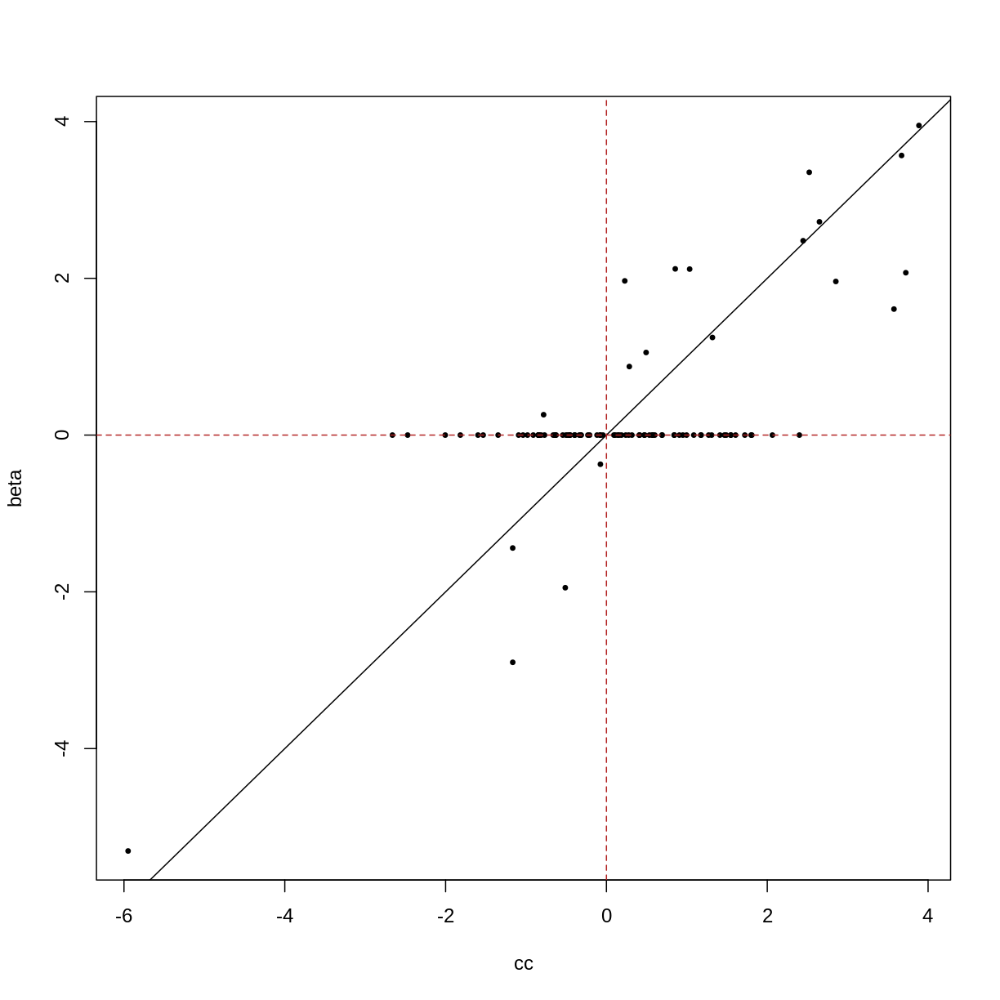
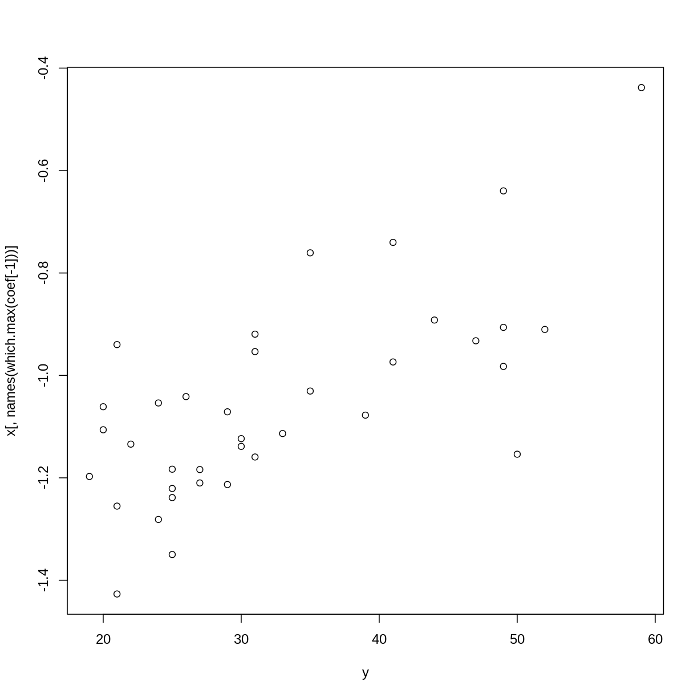
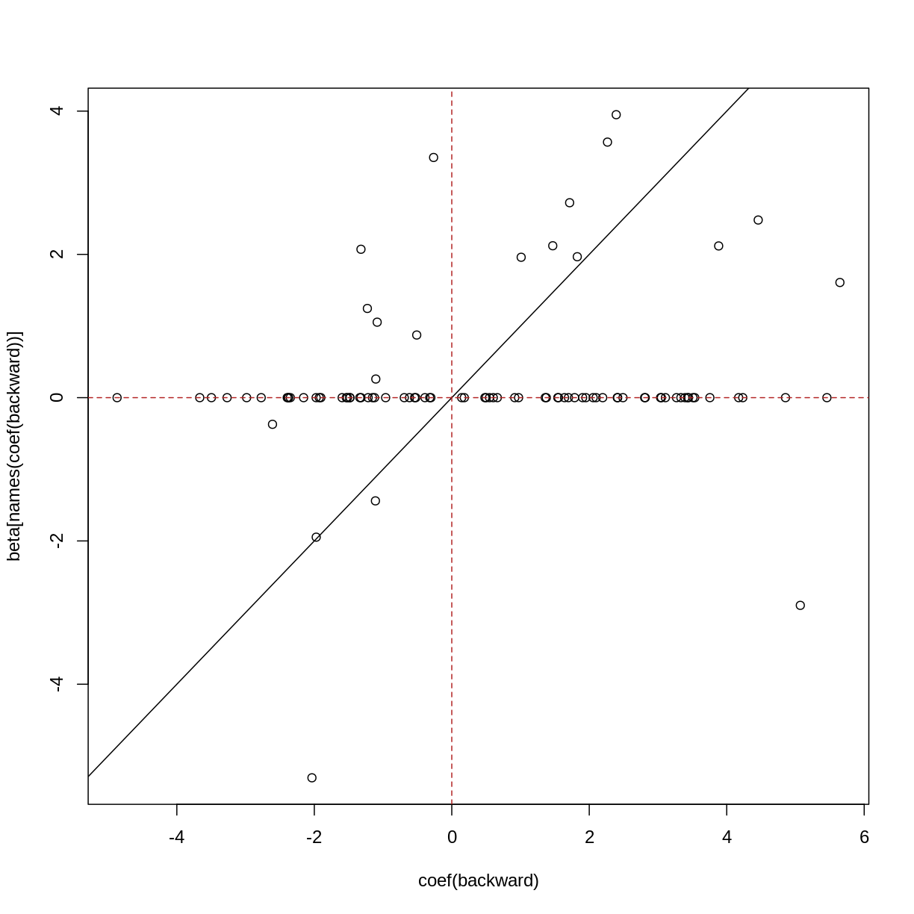
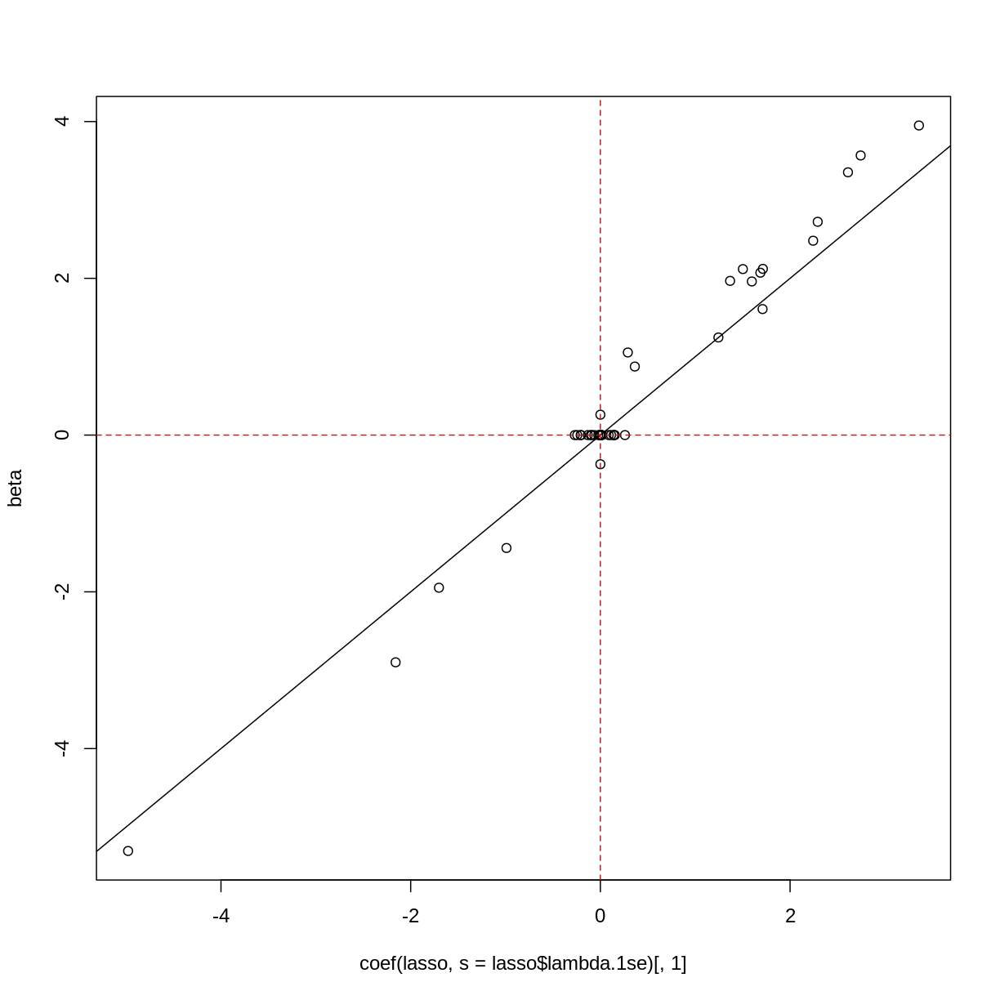
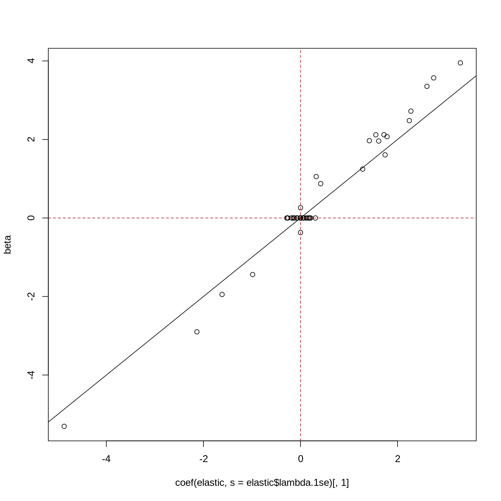
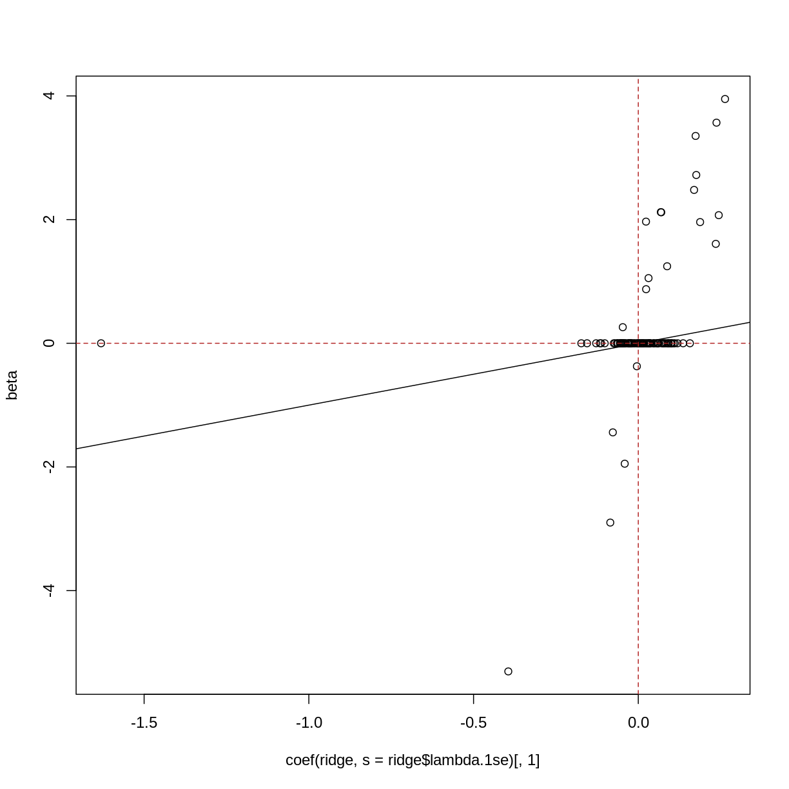

---
# Please do not edit this file directly; it is auto generated.
# Instead, please edit 02-high-dimensional-regression_c.md in _episodes_rmd/
title: "Regularised regression with many features"
teaching: 0
exercises: 0
questions:
- "Can we fit a model that accounts for and selects many features?"
- "How does regularisation work?"
- "What are some considerations for a regularised model?"
objectives:
- "Understand the benefits of regularised models."
- "Understand how different types of regularisation work."
- "Perform and critically analyse penalised regression."
keypoints:
- "Regularisation is a way to avoid the problems of stepwise
  or iterative model building processes."
- "Modelling features together can help to identify a subset of features
    that contribute to the outcome."
math: yes
---

~~~
suppressPackageStartupMessages({
    library("glmnet")
    library("limma")
    library("minfi")
    library("here")
    library("broom")
})

if (!file.exists(here("data/methylation.rds"))) {
    source(here("data/methylation.R"))
}
norm <- readRDS(here("data/methylation.rds"))

lim <- norm
y <- lim$Age
X <- getM(lim)
~~~
{: .language-r}

In the previous 

Another way of modelling these data is to model age as 

$$
    y_j = \beta_0 + \beta_1 X_1 + \dots \beta_p X_p + \epsilon_j
$$

However when the number of predictors is greater than the number of samples
(basically always true in genetics) it isn't possible to include everything!

There are some techniques that you can use to find a set of predictors!

- screening (correlation etc): bad, don't do
- screening (variance): not necessarily bad if the screening variable is sensible
- forward/reverse/best subset selection

~~~
noise_sd <- 2
npred <- 99
frac <- 0.2
nobs <- 100
X <- replicate(npred - 1, rnorm(nobs, mean = 0, sd = 1))
colnames(X) <- paste0("predictor_", 1:(npred-1))
noise <- rnorm(nobs, mean = 0, sd = noise_sd)
X <- cbind(intercept = rep(1, nobs), X)
beta <- rep(0, npred)
names(beta) <- colnames(X)
ind <- as.logical(rbinom(npred, 1, frac))
beta[ind] <- rnorm(sum(ind)) + sample(c(-2, 2), sum(ind), replace=TRUE)
y <- ((X %*% beta) + noise)[, 1]
~~~
{: .language-r}

> ## Exercise
> Perform forward subset selection on the methylation data.
> 
> 
> > ## Solution
> > 
> > 
> {: .solution}
{: .challenge}

~~~
## challenge 3: fit y on x univariate
## compare with true betas
cc <- sapply(1:ncol(X), function(i) {
    coef(lm(y ~ X[, i]))[[2]]
})
plot(cc, beta, pch = 19, cex = 0.5)
abline(0, 1)
abline(v = 0, lty="dashed", col = "firebrick")
abline(h = 0, lty="dashed", col = "firebrick")
~~~
{: .language-r}

~~~
## challenge 4: forward selection
## compare with true betas
xy <- as.data.frame(cbind(X, y = y))
int <- lm(y ~ 1, data=xy)
all <- lm(y ~ . + 0, data=xy)
forward <- step(
    int,
    scope = list(upper = formula(all), lower = formula(int)),
    direction = "forward",
    trace = 0
)
forward$anova
~~~
{: .language-r}

~~~
             Step Df     Deviance Resid. Df   Resid. Dev        AIC
1                 NA           NA        99 10430.936003 466.736110
2  + predictor_66 -1 2956.9343191        98  7474.001684 435.401565
3  + predictor_56 -1 1376.8595881        97  6097.142095 417.040525
4  + predictor_25 -1 1080.3901318        96  5016.751964 399.536780
5  + predictor_78 -1  516.7659140        95  4499.986050 390.665939
6  + predictor_21 -1  490.8685633        94  4009.117486 381.115623
7  + predictor_53 -1  456.4275889        93  3552.689897 371.029013
8  + predictor_30 -1  528.3966536        92  3024.293244 356.926252
9  + predictor_88 -1  470.4087087        91  2553.884535 342.020064
10 + predictor_29 -1  366.3987257        90  2187.485809 328.533795
11 + predictor_73 -1  299.1164073        89  1888.369402 315.829880
12 + predictor_96 -1  278.1847410        88  1610.184661 301.893396
13 + predictor_86 -1  315.5221577        87  1294.662503 282.083514
14 + predictor_93 -1  216.5936190        86  1078.068885 265.775646
15 + predictor_65 -1  245.6487503        85   832.420134 241.916710
16 + predictor_19 -1  222.2344286        84   610.185706 212.859316
17 + predictor_43 -1  158.3245355        83   451.861170 184.820480
18 + predictor_68 -1   57.2290160        82   394.632154 173.278389
19 + predictor_89 -1   65.0808925        81   329.551262 157.256173
20 + predictor_42 -1   22.0695523        80   307.481709 152.324542
21 + predictor_98 -1   19.2462942        79   288.235415 147.860737
22 + predictor_59 -1   20.3044818        78   267.930933 142.555905
23 + predictor_47 -1   19.9317935        77   247.999140 136.825509
24 + predictor_90 -1   13.1817109        76   234.817429 133.363813
25 + predictor_75 -1   11.2327738        75   223.584655 130.461993
26 + predictor_71 -1   10.1663208        74   213.418334 127.808406
27 + predictor_39 -1   11.8140093        73   201.604325 124.113680
28 + predictor_32 -1    9.9058597        72   191.698465 121.075346
29 + predictor_33 -1    9.1438706        71   182.554595 118.187909
30 + predictor_46 -1    8.8080978        70   173.746497 115.242714
31 + predictor_22 -1    7.6329370        69   166.113560 112.750146
32 + predictor_35 -1    8.6885863        68   157.424974 109.377880
33 + predictor_76 -1    7.4273397        67   149.997634 106.544933
34 + predictor_87 -1    9.2520718        66   140.745562 102.178355
35 + predictor_26 -1    8.0095196        65   132.736042  98.319233
36 + predictor_70 -1    5.6364821        64   127.099560  95.980053
37 + predictor_67 -1    6.5312395        63   120.568321  92.704638
38 + predictor_54 -1    4.3266712        62   116.241650  91.050102
39 + predictor_64 -1    4.8989503        61   111.342699  88.744264
40  + predictor_3 -1    4.4098769        60   106.932822  86.703062
41  + predictor_9 -1    3.5562355        59   103.376587  85.320832
42 + predictor_72 -1    4.6383912        58    98.738196  82.730167
43 + predictor_41 -1    2.6871301        57    96.051066  81.970980
44 + predictor_48 -1    3.8867949        56    92.164271  79.840235
45 + predictor_49 -1    2.9239733        55    89.240297  78.616252
46 + predictor_91 -1    3.4037744        54    85.836523  76.727441
47 + predictor_28 -1    3.0933325        53    82.743190  75.057153
48 + predictor_95 -1    2.5305019        52    80.212689  73.951153
49 + predictor_74 -1    2.1219311        51    78.090757  73.270152
50 + predictor_15 -1    2.0394225        50    76.051335  72.623839
51  + predictor_8 -1    2.3115648        49    73.739770  71.537209
52 + predictor_12 -1    2.1178628        48    71.621907  70.623081
53  + predictor_6 -1    3.4780048        47    68.143903  67.645150
54 + predictor_10 -1    2.3154216        46    65.828481  66.188240
55 + predictor_60 -1    1.8364177        45    63.992063  65.358888
56 + predictor_52 -1    1.3842213        44    62.607842  65.172035
57 + predictor_77 -1    2.3306547        43    60.277187  63.378352
58 + predictor_81 -1    1.7678737        42    58.509313  62.401576
59 + predictor_44 -1    2.4772133        41    56.032100  60.075456
60 + predictor_82 -1    3.0473252        40    52.984775  56.483442
61 + predictor_38 -1    1.1782518        39    51.806523  56.234588
62 + predictor_97 -1    1.1649285        38    50.641595  55.960308
63 + predictor_45 -1    1.3831211        37    49.258474  55.191122
64  + predictor_1 -1    1.3948492        36    47.863624  54.318562
65 + predictor_55 -1    1.6954291        35    46.168195  52.712096
66 + predictor_51 -1    1.3343994        34    44.833796  51.779204
67 + predictor_61 -1    2.2536190        33    42.580177  48.621863
68 + predictor_17 -1    2.2991805        32    40.280996  45.070962
69 + predictor_24 -1    1.7138404        31    38.567156  42.723085
70 + predictor_37 -1    1.8985741        30    36.668582  39.675012
71 + predictor_18 -1    3.0040302        29    33.664552  33.127522
72 + predictor_63 -1    1.9214641        28    31.743088  29.250480
73 + predictor_84 -1    1.5871955        27    30.155892  26.121014
74 + predictor_20 -1    1.5494258        26    28.606466  22.846260
75 + predictor_94 -1    0.5945936        25    28.011873  22.745826
76 + predictor_50 -1    0.7559289        24    27.255944  22.010143
77 + predictor_16 -1    1.6128507        23    25.643093  17.910408
78 + predictor_36 -1    1.1117811        22    24.531312  15.478016
79 + predictor_31 -1    1.8622446        21    22.669067   9.583114
80  + predictor_5 -1    1.6083463        20    21.060721   4.223956
81 + predictor_57 -1    0.9138553        19    20.146866   1.787855
82 + predictor_23 -1    1.4669235        18    18.679942  -3.771984
83  + predictor_4 -1    0.9330483        17    17.746894  -6.895967
84 + predictor_11 -1    0.6486991        16    17.098195  -8.619729
85 + predictor_92 -1    0.6815011        15    16.416694 -10.687146
86  + predictor_2 -1    0.8159578        14    15.600736 -13.785210
87  + predictor_7 -1    1.1136026        13    14.487133 -19.190928
88 + predictor_13 -1    1.5540457        12    12.933088 -28.538122
89 + predictor_80 -1    0.7108502        11    12.222238 -32.191315
90 + predictor_69 -1    1.0395960        10    11.182642 -39.080747
91 + predictor_85 -1    1.1193957         9    10.063246 -47.628043
92 + predictor_58 -1    0.7099988         8     9.353247 -52.944662
93 + predictor_62 -1    1.0923023         7     8.260945 -63.363123
94 + predictor_27 -1    0.5039305         6     7.757014 -67.657269
95 + predictor_40 -1    0.3973050         5     7.359709 -70.914976
96 + predictor_14 -1    0.2325665         4     7.127143 -72.125977
97 + predictor_79 -1    0.3814963         3     6.745646 -75.627286
~~~
{: .output}

~~~
plot(coef(forward), beta[names(coef(forward))])
abline(0, 1)
abline(v = 0, lty="dashed", col = "firebrick")
abline(h = 0, lty="dashed", col = "firebrick")
~~~
{: .language-r}

~~~
## note about backward/both, not a challenge
all <- lm(y ~ . + 0, data=xy)
backward <- step(
    all,
    scope = formula(all),
    direction = "backward",
    trace = 0
)
backward$anova
~~~
{: .language-r}

~~~
            Step Df    Deviance Resid. Df Resid. Dev        AIC
1                NA          NA         1   5.175144  -98.13031
2 - predictor_15  1 0.001094774         2   5.176239 -100.10915
3    - intercept  1 0.006731199         3   5.182970 -101.97920
4  - predictor_3  1 0.001941276         4   5.184911 -103.94175
5 - predictor_69  1 0.010299537         5   5.195211 -105.74330
6 - predictor_12  1 0.032302673         6   5.227513 -107.12345
7 - predictor_52  1 0.048368546         7   5.275882 -108.20244
~~~
{: .output}

~~~
plot(coef(backward), beta[names(coef(backward))])
abline(0, 1)
abline(v = 0, lty="dashed", col = "firebrick")
abline(h = 0, lty="dashed", col = "firebrick")
~~~
{: .language-r}

~~~
## Challenge 5:
## one of these...? probably lasso
library("glmnet")
ridge <- cv.glmnet(X[, -1], y, alpha = 0)
lasso <- cv.glmnet(X[, -1], y, alpha = 1)
elastic <- cv.glmnet(X[, -1], y, alpha = 0.5, intercept = FALSE)
plot(coef(lasso, s = lasso$lambda.1se)[, 1], beta)
abline(0, 1)
abline(v = 0, lty="dashed", col = "firebrick")
abline(h = 0, lty="dashed", col = "firebrick")
~~~
{: .language-r}

~~~
plot(coef(elastic, s = elastic$lambda.1se)[, 1], beta)
abline(0, 1)
abline(v = 0, lty="dashed", col = "firebrick")
abline(h = 0, lty="dashed", col = "firebrick")
~~~
{: .language-r}

~~~
plot(coef(ridge, s = ridge$lambda.1se)[, 1], beta)
abline(0, 1)
abline(v = 0, lty="dashed", col = "firebrick")
abline(h = 0, lty="dashed", col = "firebrick")
~~~
{: .language-r}

~~~
x <- t(getM(norm))
y <- as.numeric(factor(norm$smoker)) - 1

fit <- cv.glmnet(x = x, y = y, family="binomial")
~~~
{: .language-r}

~~~
Warning in lognet(xd, is.sparse, ix, jx, y, weights, offset, alpha, nobs, : one
multinomial or binomial class has fewer than 8 observations; dangerous ground
Warning in lognet(xd, is.sparse, ix, jx, y, weights, offset, alpha, nobs, : one
multinomial or binomial class has fewer than 8 observations; dangerous ground
Warning in lognet(xd, is.sparse, ix, jx, y, weights, offset, alpha, nobs, : one
multinomial or binomial class has fewer than 8 observations; dangerous ground
Warning in lognet(xd, is.sparse, ix, jx, y, weights, offset, alpha, nobs, : one
multinomial or binomial class has fewer than 8 observations; dangerous ground
Warning in lognet(xd, is.sparse, ix, jx, y, weights, offset, alpha, nobs, : one
multinomial or binomial class has fewer than 8 observations; dangerous ground
Warning in lognet(xd, is.sparse, ix, jx, y, weights, offset, alpha, nobs, : one
multinomial or binomial class has fewer than 8 observations; dangerous ground
Warning in lognet(xd, is.sparse, ix, jx, y, weights, offset, alpha, nobs, : one
multinomial or binomial class has fewer than 8 observations; dangerous ground
Warning in lognet(xd, is.sparse, ix, jx, y, weights, offset, alpha, nobs, : one
multinomial or binomial class has fewer than 8 observations; dangerous ground
Warning in lognet(xd, is.sparse, ix, jx, y, weights, offset, alpha, nobs, : one
multinomial or binomial class has fewer than 8 observations; dangerous ground
Warning in lognet(xd, is.sparse, ix, jx, y, weights, offset, alpha, nobs, : one
multinomial or binomial class has fewer than 8 observations; dangerous ground
Warning in lognet(xd, is.sparse, ix, jx, y, weights, offset, alpha, nobs, : one
multinomial or binomial class has fewer than 8 observations; dangerous ground
~~~
{: .warning}

~~~
c <- coef(fit, s = fit$lambda.1se)
c[c[, 1] != 0, 1]
~~~
{: .language-r}

~~~
[1] -1.455287
~~~
{: .output}

~~~
y <- norm$Age
fit <- cv.glmnet(x = x, y = y)

c <- coef(fit, s = fit$lambda.1se)
coef <- c[c[, 1] != 0, 1]

plot(y, x[, names(which.max(coef[-1]))])
~~~
{: .language-r}

> ## Selecting hyperparameters
> 
> There are various methods to select the "best"
> value for $\lambda$. One idea is to split
> the data into $K$ chunks. We then use $K-1$ of
> these as the training set, and $the remaining $1$ chunk
> as the test set. Repeating this process for each of the
> $K$ chunks produces more variability.
> 
> 
> ~~~
> knitr::include_graphics(here("fig/cross_validaiton.svg"))
> ~~~
> {: .language-r}
> 
> 
> 
> ~~~
> Error in knitr::include_graphics(here("fig/cross_validaiton.svg")): Cannot find the file(s): "/home/runner/work/high-dimensional-stats-r/high-dimensional-stats-r/fig/cross_validaiton.svg"
> ~~~
> {: .error}
>
> To be really rigorous, we could even repeat this *cross-validation*
> process a number of times! This is termed "repeated cross-validation".
{: .callout}


