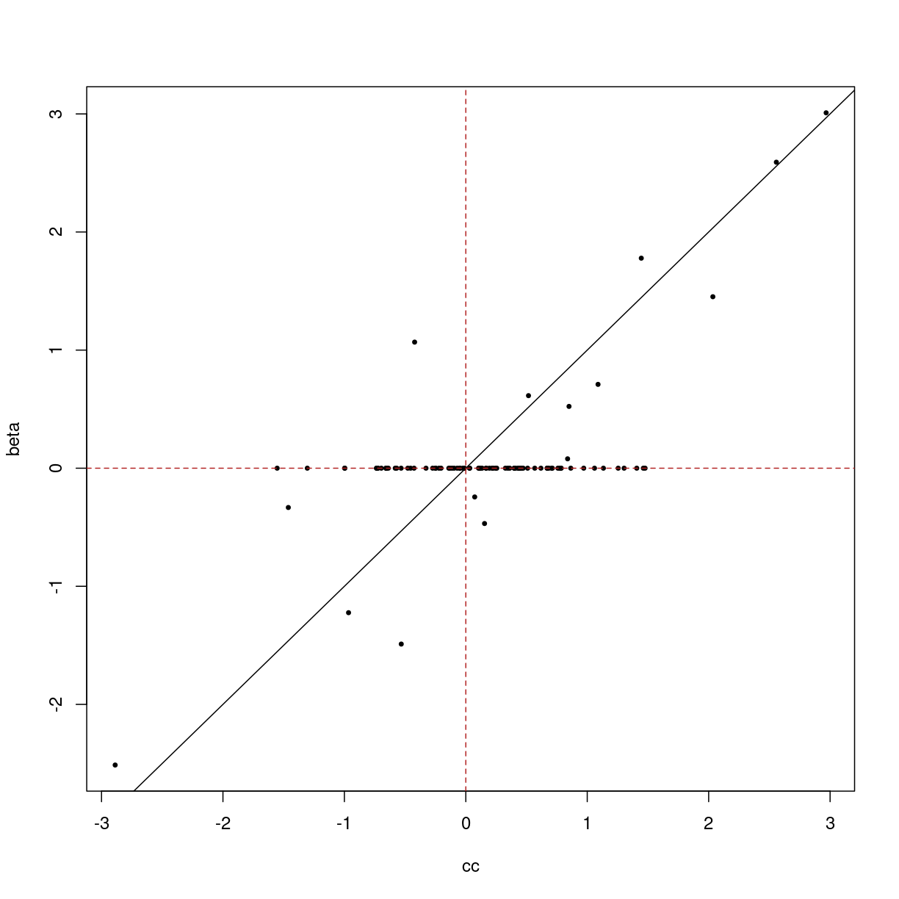
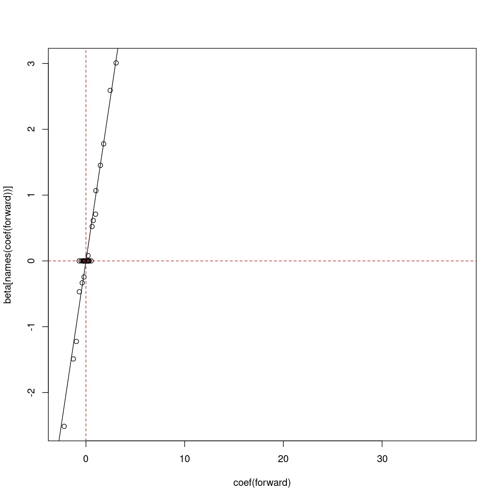
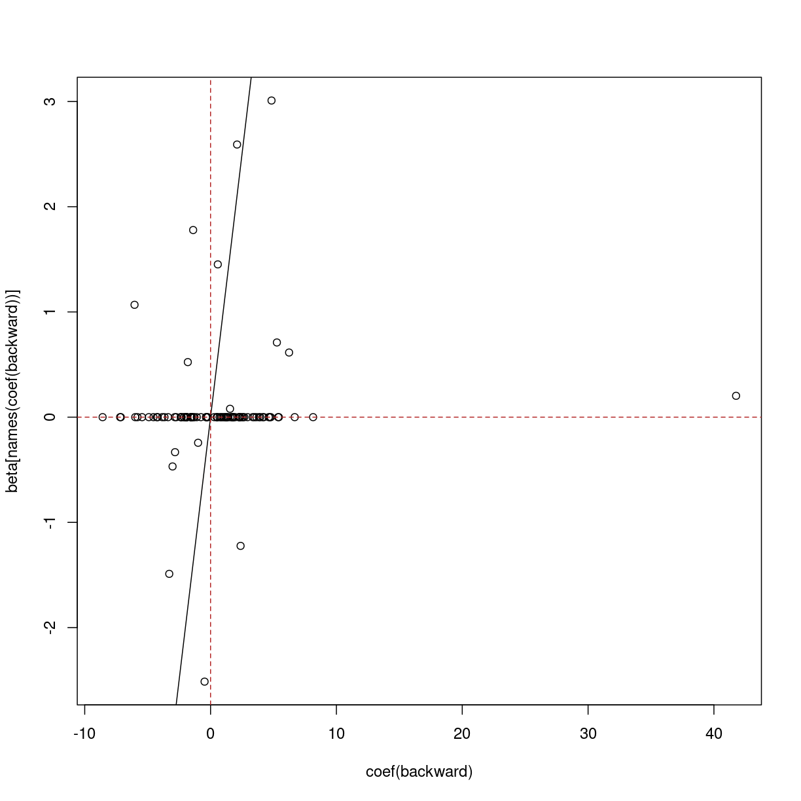

---
# Please do not edit this file directly; it is auto generated.
# Instead, please edit 03-regression-variable-selection.md in _episodes_rmd/
title: "Feature selection for regression"
teaching: 0
exercises: 0
questions:
- "Why would we want to find a subset of features
  that are associated with an outcome?"
- "How should we *not* select features?"
- "How can we iteratively find a good subset of our features
  variables to use for regression?"
- "What are some risks and downsides of iterative feature
  selection?"
objectives:
- "Understand multiple regression in a biomedical context."
- "Understand how to fit a stepwise regression model."
keypoints:
- "Sets of features can be more predictive and provide
  a better explanation than a single feature alone."
- "Stepwise regression allows us to find a set of features that
  are associated with an outcome (eg, age)."
- "Stepwise regression will tend to retain only one
  feature out of many that are correlated."
- "Stepwise regression is not very efficient."
math: yes
---

In the previous 

Another way of modelling these data is to model age as 

$$
    y_j = \beta_0 + \beta_1 X_1 + \dots \beta_p X_p + \epsilon_j
$$

~~~
suppressPackageStartupMessages({
    library("glmnet")
    library("limma")
    library("minfi")
    library("here")
    library("broom")
})

if (!file.exists(here("data/methylation.rds"))) {
    source(here("data/methylation.R"))
}
norm <- readRDS(here("data/methylation.rds"))

lim <- norm
y <- lim$Age
X <- getM(lim)
~~~
{: .language-r}

However when the number of predictors is greater than the number of samples
(basically always true in genetics) it isn't possible to include everything!

There are some techniques that you can use to find a set of predictors!

- screening (correlation etc): bad, don't do
- screening (variance): not necessarily bad if the screening variable is sensible
- forward/reverse/best subset selection

~~~
if (!file.exists(here("data/synthetic.rds"))) {
    source(here("data/synthetic.R"))
}
synthetic <- readRDS(here("data/synthetic.rds"))
~~~
{: .language-r}

~~~
X <- assay(synthetic)
y <- synthetic$age
beta <- rowData(synthetic)$true_beta
names(beta) <- rownames(synthetic)
## challenge 3: fit y on x univariate
## compare with true betas
cc <- sapply(seq_len(nrow(X)), function(i) {
    coef(lm(y ~ X[i, ]))[[2]]
})
plot(cc, beta, pch = 19, cex = 0.5)
abline(0, 1)
abline(v = 0, lty = "dashed", col = "firebrick")
abline(h = 0, lty = "dashed", col = "firebrick")
~~~
{: .language-r}

> ## Exercise
> Perform forward subset selection on the methylation data.
> 
> 
> > ## Solution
> > 
> > 
> {: .solution}
{: .challenge}

~~~
## challenge 4: forward selection
## compare with true betas
xy <- as.data.frame(cbind(t(X), y = y))
int <- lm(y ~ 1, data = xy)
all <- lm(y ~ . + 0, data = xy)
forward <- step(
    int,
    scope = list(upper = formula(all), lower = formula(int)),
    direction = "forward",
    trace = 0
)
forward$anova
~~~
{: .language-r}

~~~
           Step Df    Deviance Resid. Df Resid. Dev          AIC
1               NA          NA        99 3436.51000 355.70415145
2  + feature_27 -1 844.3220066        98 2592.18799 329.50873972
3  + feature_86 -1 940.6784376        97 1651.50956 286.42748450
4  + feature_35 -1 623.3281406        96 1028.18142 241.03767184
5  + feature_76 -1 209.4777319        95  818.70368 220.25520293
6  + feature_29 -1 157.6708141        94  661.03287 200.86333790
7  + feature_78 -1 157.1542136        93  503.87866 175.71652902
8   + feature_6 -1 129.3551670        92  374.52349 148.04843346
9  + feature_21 -1  79.3227086        91  295.20078 126.24855488
10 + feature_64 -1  57.2148165        90  237.98596 106.70415088
11 + feature_65 -1  41.4236768        89  196.56229  89.58091757
12 + feature_49 -1  25.6626810        88  170.89961  77.59060969
13 + feature_63 -1  29.8306159        87  141.06899  60.40788738
14 + feature_45 -1  15.3711415        86  125.69785  50.87108117
15 + feature_44 -1  10.2884396        85  115.40941  44.33156956
16 + feature_41 -1   7.9604108        84  107.44900  39.18461100
17 + feature_19 -1   9.0562946        83   98.39270  32.37964614
18 + feature_81 -1   6.2282632        82   92.16444  27.84041876
19 + feature_47 -1   6.9467644        81   85.21768  22.00386867
20 + feature_17 -1   4.0018758        80   81.21580  19.19396213
21 + feature_68 -1   4.3072435        79   76.90856  15.74469494
22  + feature_5 -1   3.2708240        78   73.63773  13.39873755
23 + feature_23 -1   3.5602826        77   70.07745  10.44308694
24 + feature_94 -1   2.6162852        76   67.46116   8.63819068
25 + feature_96 -1   2.5078413        75   64.95332   6.84987224
26 + feature_60 -1   2.4219935        74   62.53133   5.04975211
27 + feature_25 -1   2.6300644        73   59.90127   2.75274431
28 + feature_26 -1   2.8108207        72   57.09044  -0.05334285
29 + feature_52 -1   3.5806177        71   53.50983  -4.53048682
30 + feature_10 -1   2.1626097        70   51.34722  -6.65594431
31 + feature_66 -1   1.7849770        69   49.56224  -8.19409273
32 + feature_59 -1   2.1990252        68   47.36322 -10.73243119
33 + feature_70 -1   1.5779431        67   45.78527 -12.12077194
34 + feature_30 -1   1.8274316        66   43.95784 -14.19391851
35 + feature_95 -1   1.6443379        65   42.31350 -16.00639446
36  + feature_8 -1   1.3746757        64   40.93883 -17.30912643
37 + feature_15 -1   1.5403966        63   39.39843 -19.14442139
38 + feature_62 -1   1.9834887        62   37.41494 -22.31000572
39 + feature_87 -1   1.8236299        61   35.59131 -25.30686347
40 + feature_75 -1   0.9961546        60   34.59516 -26.14564863
41 + feature_89 -1   1.2056007        59   33.38956 -27.69270218
42 + feature_13 -1   1.2071277        58   32.18243 -29.37495796
43 + feature_18 -1   1.1051128        57   31.07732 -30.86920300
44 + feature_77 -1   1.4505827        56   29.62673 -33.64930872
45 + feature_28 -1   1.4549510        55   28.17178 -36.68493449
46 + feature_33 -1   0.7788849        54   27.39290 -37.48864325
47 + feature_88 -1   0.8331261        53   26.55977 -38.57724782
48 + feature_38 -1   0.6792933        52   25.88048 -39.16812527
49 + feature_31 -1   0.7555109        51   25.12497 -40.13081360
50 + feature_22 -1   0.6531551        50   24.47181 -40.76482668
51 + feature_71 -1   0.5549750        49   23.91684 -41.05875016
52 + feature_34 -1   0.5610590        48   23.35578 -41.43257823
53 + feature_51 -1   0.5006420        47   22.85514 -41.59943245
~~~
{: .output}

~~~
plot(coef(forward), beta[names(coef(forward))])
abline(0, 1)
abline(v = 0, lty = "dashed", col = "firebrick")
abline(h = 0, lty = "dashed", col = "firebrick")
~~~
{: .language-r}

~~~
## note about backward/both, not a challenge
all <- lm(y ~ . + 0, data = xy)
backward <- step(
    all,
    scope = formula(all),
    direction = "backward",
    trace = 0
)
backward$anova
~~~
{: .language-r}

~~~
          Step Df    Deviance Resid. Df Resid. Dev       AIC
1              NA          NA         1  0.9233452 -270.4922
2 - feature_36  1 0.004215344         2  0.9275605 -272.0367
~~~
{: .output}

~~~
plot(coef(backward), beta[names(coef(backward))])
abline(0, 1)
abline(v = 0, lty = "dashed", col = "firebrick")
abline(h = 0, lty = "dashed", col = "firebrick")
~~~
{: .language-r}


