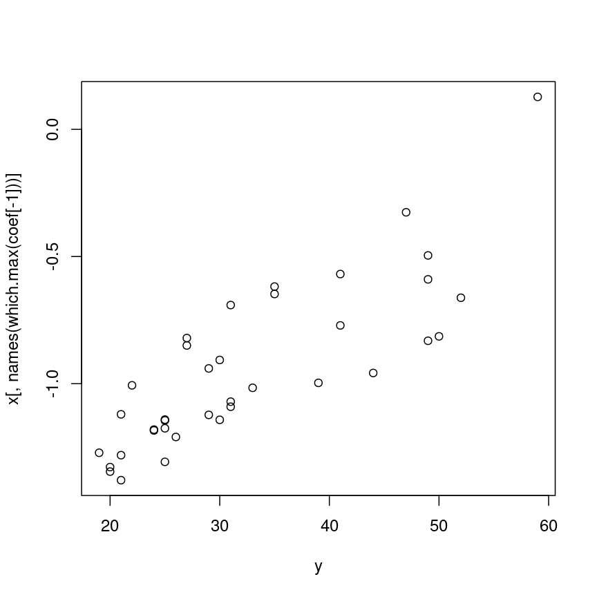

---
# Please do not edit this file directly; it is auto generated.
# Instead, please edit 04-regression-regularisation.md in _episodes_rmd/
title: "Regularised regression with many features"
teaching: 0
exercises: 0
questions:
- "Can we fit a model that accounts for and selects many features?"
- "How does regularisation work?"
- "What are some considerations for a regularised model?"
objectives:
- "Understand the benefits of regularised models."
- "Understand how different types of regularisation work."
- "Perform and critically analyse penalised regression."
keypoints:
- "Regularisation is a way to avoid the problems of stepwise
  or iterative model building processes."
- "Modelling features together can help to identify a subset of features
    that contribute to the outcome."
math: yes
---

~~~
library("minfi")
library("here")
if (!file.exists(here("data/methylation.rds"))) {
    source(here("data/methylation.R"))
}
norm <- readRDS(here("data/methylation.rds"))

lim <- norm
y <- lim$Age
X <- getM(lim)
~~~
{: .language-r}

In the previous 

Another way of modelling these data is to model age as 

$$
    y_j = \beta_0 + \beta_1 X_1 + \dots \beta_p X_p + \epsilon_j
$$

However when the number of predictors is greater than the number of samples
(basically always true in genetics) it isn't possible to include everything!

There are some techniques that you can use to find a set of predictors!

- screening (correlation etc): bad, don't do
- screening (variance): not necessarily bad if the screening variable is sensible
- forward/reverse/best subset selection

~~~
if (!file.exists(here("data/synthetic.rds"))) {
    source("data/synthetic.R")
}
synthetic <- readRDS("data/synthetic.rds")
~~~
{: .language-r}

~~~
Warning in gzfile(file, "rb"): cannot open compressed file 'data/synthetic.rds',
probable reason 'No such file or directory'
~~~
{: .warning}

~~~
Error in gzfile(file, "rb"): cannot open the connection
~~~
{: .error}

~~~
## Challenge 5:
## one of these...? probably lasso
library("glmnet")
ridge <- cv.glmnet(X[, -1], y, alpha = 0)
~~~
{: .language-r}

~~~
Error in glmnet(x, y, weights = weights, offset = offset, lambda = lambda, : number of observations in y (37) not equal to the number of rows of x (5000)
~~~
{: .error}

~~~
lasso <- cv.glmnet(X[, -1], y, alpha = 1)
~~~
{: .language-r}

~~~
Error in glmnet(x, y, weights = weights, offset = offset, lambda = lambda, : number of observations in y (37) not equal to the number of rows of x (5000)
~~~
{: .error}

~~~
elastic <- cv.glmnet(X[, -1], y, alpha = 0.5, intercept = FALSE)
~~~
{: .language-r}

~~~
Error in glmnet(x, y, weights = weights, offset = offset, lambda = lambda, : number of observations in y (37) not equal to the number of rows of x (5000)
~~~
{: .error}

~~~
plot(coef(lasso, s = lasso$lambda.1se)[, 1], beta)
~~~
{: .language-r}

~~~
Error in h(simpleError(msg, call)): error in evaluating the argument 'x' in selecting a method for function 'plot': error in evaluating the argument 'object' in selecting a method for function 'coef': object 'lasso' not found
~~~
{: .error}

~~~
abline(0, 1)
~~~
{: .language-r}

~~~
Error in int_abline(a = a, b = b, h = h, v = v, untf = untf, ...): plot.new has not been called yet
~~~
{: .error}

~~~
abline(v = 0, lty = "dashed", col = "firebrick")
~~~
{: .language-r}

~~~
Error in int_abline(a = a, b = b, h = h, v = v, untf = untf, ...): plot.new has not been called yet
~~~
{: .error}

~~~
abline(h = 0, lty = "dashed", col = "firebrick")
~~~
{: .language-r}

~~~
Error in int_abline(a = a, b = b, h = h, v = v, untf = untf, ...): plot.new has not been called yet
~~~
{: .error}

~~~
plot(coef(elastic, s = elastic$lambda.1se)[, 1], beta)
~~~
{: .language-r}

~~~
Error in h(simpleError(msg, call)): error in evaluating the argument 'x' in selecting a method for function 'plot': error in evaluating the argument 'object' in selecting a method for function 'coef': object 'elastic' not found
~~~
{: .error}

~~~
abline(0, 1)
~~~
{: .language-r}

~~~
Error in int_abline(a = a, b = b, h = h, v = v, untf = untf, ...): plot.new has not been called yet
~~~
{: .error}

~~~
abline(v = 0, lty = "dashed", col = "firebrick")
~~~
{: .language-r}

~~~
Error in int_abline(a = a, b = b, h = h, v = v, untf = untf, ...): plot.new has not been called yet
~~~
{: .error}

~~~
abline(h = 0, lty = "dashed", col = "firebrick")
~~~
{: .language-r}

~~~
Error in int_abline(a = a, b = b, h = h, v = v, untf = untf, ...): plot.new has not been called yet
~~~
{: .error}

~~~
plot(coef(ridge, s = ridge$lambda.1se)[, 1], beta)
~~~
{: .language-r}

~~~
Error in h(simpleError(msg, call)): error in evaluating the argument 'x' in selecting a method for function 'plot': error in evaluating the argument 'object' in selecting a method for function 'coef': object 'ridge' not found
~~~
{: .error}

~~~
abline(0, 1)
~~~
{: .language-r}

~~~
Error in int_abline(a = a, b = b, h = h, v = v, untf = untf, ...): plot.new has not been called yet
~~~
{: .error}

~~~
abline(v = 0, lty = "dashed", col = "firebrick")
~~~
{: .language-r}

~~~
Error in int_abline(a = a, b = b, h = h, v = v, untf = untf, ...): plot.new has not been called yet
~~~
{: .error}

~~~
abline(h = 0, lty = "dashed", col = "firebrick")
~~~
{: .language-r}

~~~
Error in int_abline(a = a, b = b, h = h, v = v, untf = untf, ...): plot.new has not been called yet
~~~
{: .error}

~~~
x <- t(getM(norm))
y <- as.numeric(factor(norm$smoker)) - 1

fit <- cv.glmnet(x = x, y = y, family = "binomial")
~~~
{: .language-r}

~~~
Warning in lognet(xd, is.sparse, ix, jx, y, weights, offset, alpha, nobs, : one
multinomial or binomial class has fewer than 8 observations; dangerous ground
Warning in lognet(xd, is.sparse, ix, jx, y, weights, offset, alpha, nobs, : one
multinomial or binomial class has fewer than 8 observations; dangerous ground
Warning in lognet(xd, is.sparse, ix, jx, y, weights, offset, alpha, nobs, : one
multinomial or binomial class has fewer than 8 observations; dangerous ground
Warning in lognet(xd, is.sparse, ix, jx, y, weights, offset, alpha, nobs, : one
multinomial or binomial class has fewer than 8 observations; dangerous ground
Warning in lognet(xd, is.sparse, ix, jx, y, weights, offset, alpha, nobs, : one
multinomial or binomial class has fewer than 8 observations; dangerous ground
Warning in lognet(xd, is.sparse, ix, jx, y, weights, offset, alpha, nobs, : one
multinomial or binomial class has fewer than 8 observations; dangerous ground
Warning in lognet(xd, is.sparse, ix, jx, y, weights, offset, alpha, nobs, : one
multinomial or binomial class has fewer than 8 observations; dangerous ground
Warning in lognet(xd, is.sparse, ix, jx, y, weights, offset, alpha, nobs, : one
multinomial or binomial class has fewer than 8 observations; dangerous ground
Warning in lognet(xd, is.sparse, ix, jx, y, weights, offset, alpha, nobs, : one
multinomial or binomial class has fewer than 8 observations; dangerous ground
Warning in lognet(xd, is.sparse, ix, jx, y, weights, offset, alpha, nobs, : one
multinomial or binomial class has fewer than 8 observations; dangerous ground
Warning in lognet(xd, is.sparse, ix, jx, y, weights, offset, alpha, nobs, : one
multinomial or binomial class has fewer than 8 observations; dangerous ground
~~~
{: .warning}

~~~
c <- coef(fit, s = fit$lambda.1se)
c[c[, 1] != 0, 1]
~~~
{: .language-r}

~~~
[1] -1.455287
~~~
{: .output}

~~~
y <- norm$Age
fit <- cv.glmnet(x = x, y = y)

c <- coef(fit, s = fit$lambda.1se)
coef <- c[c[, 1] != 0, 1]

plot(y, x[, names(which.max(coef[-1]))])
~~~
{: .language-r}

Figure taken from [Hastie et al. (2020)](https://doi.org/10.1214/19-STS733).

~~~
knitr::include_graphics("../fig/bs_fs_lasso.png")
~~~
{: .language-r}

> ## Selecting hyperparameters
> 
> There are various methods to select the "best"
> value for $\lambda$. One idea is to split
> the data into $K$ chunks. We then use $K-1$ of
> these as the training set, and the remaining $1$ chunk
> as the test set. Repeating this process for each of the
> $K$ chunks produces more variability.
> 
> 
>
> To be really rigorous, we could even repeat this *cross-validation*
> process a number of times! This is termed "repeated cross-validation".
{: .callout}


