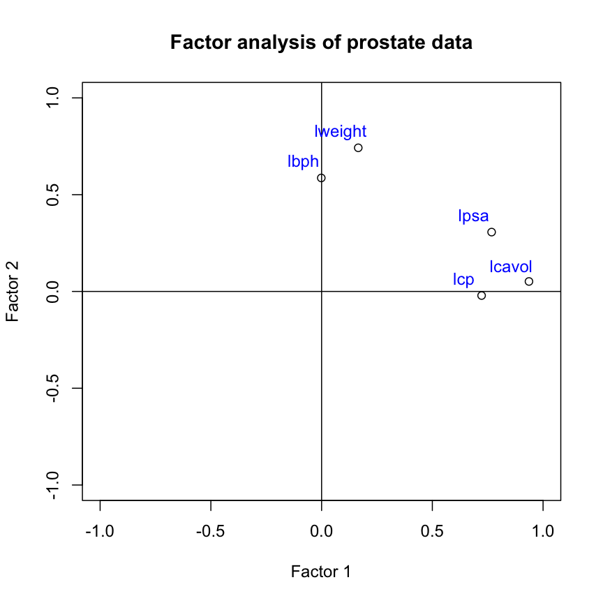

---
# Please do not edit this file directly; it is auto generated.
# Instead, please edit 05-factor-analysis.md in _episodes_rmd/
title: "Factor analysis"
author: "GS Robertson"
source: Rmd
teaching: 25
exercises: 10
questions:
- What is factor analysis and when can it be used?
- What are communality and uniqueness in factor analysis?
- How to decide on the number of factors to use?
- How to interpret the output of factor analysis?
objectives:
- Perform a factor analysis on high-dimensional data.
- Select an appropriate number of factors.
- Interpret the output of factor analysis.
keypoints:
- Factor analysis is a method used for reducing dimensionality in a dataset by reducing variation contained in multiple variables into a smaller number of uncorrelated factors.
- PCA can be used to identify the number of factors to initially use in factor analysis.
- The `factanal()` function in R can be used to fit a factor analysis, where the number of factors is specified by the user.
- Factor analysis can take into account expert knowledge when deciding on the number of factors to use, but a disadvantage is that the output requires careful interpretation.
math: yes
---

# Introduction

Biologists often encounter high-dimensional datasets from which they wish
to extract underlying features – they need to carry out dimensionality
reduction. The last episode dealt with one method to achieve this this,
called principal component analysis (PCA). Here, we introduce more general
set of methods called factor analysis (FA).
 
There are two types of FA, called exploratory and confirmatory factor analysis
(EFA and CFA). Both EFA and CFA aim to reproduce the observed relationships
among a group of features with a smaller set of latent variables. EFA
is used in a descriptive, data-driven manner to uncover which
measured variables are reasonable indicators of the various latent dimensions.
In contrast, CFA is conducted in an a-priori,
hypothesis-testing manner that requires strong empirical or theoretical foundations.
We will mainly focus on EFA here, which is used to group features into a specified
number of latent factors.

Unlike with PCA, researchers using FA have to specify the number of latent
variables (factors) at the point of running the analysis. Researchers may use
exploratory data analysis methods (including PCA) to provide an initial estimate
of how many factors adequately explain the variation observed in a dataset.
In practice, a range of different values is usually tested.

## An example

One scenario for using FA would be whether student scores in different subjects
can be summarised by certain subject categories. Take a look at the hypothetical
dataset below. If we were to run and EFA on this, we might find that the scores
can be summarised well by two factors, which we can then interpret. We have
labelled these hypothetical factors “mathematical ability” and “writing ability”.

plot of chunk table

So, EFA is designed to identify a specified number of unobservable factors from
observable features contained in the original dataset. This is slightly
different from PCA, which does not do this directly. Just to recap, PCA creates
as many principal components as there are features in the dataset, each
component representing a different linear combination of features. The principal
components are ordered by the amount of variance they account for.

# Advantages and disadvantages of Factor Analysis

There are several advantages and disadvantages of using FA as a
dimensionality reduction method.

Advantages:

* FA is a useful way of combining different groups of data into known
  representative factors, thus reducing dimensionality in a dataset.
* FA can take into account researchers' expert knowledge when choosing
  the number of factors to use, and can be used to identify latent or hidden
  variables which may not be apparent from using other analysis methods.
* It is easy to implement with many software tools available to carry out FA.
* Confirmatory FA can be used to test hypotheses.

Disadvantages:

* Justifying the choice of
  number of factors to use may be difficult if little is known about the
  structure of the data before analysis is carried out.
* Sometimes, it can be difficult to interpret what factors mean after
  analysis has been completed. 
* Like PCA, standard methods of carrying out FA assume that input variables
  are continuous, although extensions to FA allow ordinal and binary
  variables to be included (after transforming the input matrix).

# Prostate cancer patient data

The prostate dataset represents data from 97 men who have prostate cancer.
The data come from a study which examined the correlation between the level
of prostate specific antigen and a number of clinical measures in men who were
about to receive a radical prostatectomy. The data have 97 rows and 9 columns.

Columns are:

- `lcavol`: log (cancer volume)
- `lweight`: log (prostate weight)
- `age`: age (years)
- `lbph`: log (benign prostatic hyperplasia amount)
- `svi`: seminal vesicle invasion
- `lcp`: log (capsular penetration); amount of spread of cancer in outer walls
  of prostate
- `gleason`: [Gleason score](https://en.wikipedia.org/wiki/Gleason_grading_system)
- `pgg45`: percentage Gleason scores 4 or 5
- `lpsa`: log (prostate specific antigen)

In this example, we use the clinical variables to identify factors representing
various clinical variables from prostate cancer patients. Two principal
components have already been identified as explaining a large proportion
of variance in the data when these data were analysed in the PCA episode.
We may expect a similar number of factors to exist in the data.

Let's subset the data to just include the log-transformed clinical variables
for the purposes of this episode:

~~~
prostate <- readRDS(here("data/prostate.rds"))
~~~
{: .language-r}

~~~
View(prostate)
~~~
{: .language-r}

~~~
nrow(prostate)
~~~
{: .language-r}

~~~
[1] 97
~~~
{: .output}

~~~
head(prostate)
~~~
{: .language-r}

~~~
  X     lcavol  lweight age      lbph svi       lcp gleason pgg45       lpsa
1 1 -0.5798185 2.769459  50 -1.386294   0 -1.386294       6     0 -0.4307829
2 2 -0.9942523 3.319626  58 -1.386294   0 -1.386294       6     0 -0.1625189
3 3 -0.5108256 2.691243  74 -1.386294   0 -1.386294       7    20 -0.1625189
4 4 -1.2039728 3.282789  58 -1.386294   0 -1.386294       6     0 -0.1625189
5 5  0.7514161 3.432373  62 -1.386294   0 -1.386294       6     0  0.3715636
6 6 -1.0498221 3.228826  50 -1.386294   0 -1.386294       6     0  0.7654678
~~~
{: .output}

~~~
#select five log-transformed clinical variables for further analysis
pros2 <- prostate[, c("lcavol", "lweight", "lbph", "lcp", "lpsa")]
head(pros2)
~~~
{: .language-r}

~~~
      lcavol  lweight      lbph       lcp       lpsa
1 -0.5798185 2.769459 -1.386294 -1.386294 -0.4307829
2 -0.9942523 3.319626 -1.386294 -1.386294 -0.1625189
3 -0.5108256 2.691243 -1.386294 -1.386294 -0.1625189
4 -1.2039728 3.282789 -1.386294 -1.386294 -0.1625189
5  0.7514161 3.432373 -1.386294 -1.386294  0.3715636
6 -1.0498221 3.228826 -1.386294 -1.386294  0.7654678
~~~
{: .output}

# Performing exploratory factor analysis

EFA may be implemented in R using the `factanal()` function
from the **`stats`** package (which is a built-in package in base R). This
function fits a factor analysis by maximising the log-likelihood using a
data matrix as input. The number of factors to be fitted in the analysis
is specified by the user using the `factors` argument.

> ## Challenge 1 (3 mins)
> 
> Use the `factanal()` function to identify the minimum number of factors
> necessary to explain most of the variation in the data
> 
> > ## Solution
> > 
> > 
> > ~~~
> > # Include one factor only
> > pros_fa <- factanal(pros2, factors = 1)
> > pros_fa
> > ~~~
> > {: .language-r}
> > 
> > 
> > 
> > ~~~
> > 
> > Call:
> > factanal(x = pros2, factors = 1)
> > 
> > Uniquenesses:
> >  lcavol lweight    lbph     lcp    lpsa 
> >   0.149   0.936   0.994   0.485   0.362 
> > 
> > Loadings:
> >         Factor1
> > lcavol  0.923  
> > lweight 0.253  
> > lbph           
> > lcp     0.718  
> > lpsa    0.799  
> > 
> >                Factor1
> > SS loadings      2.074
> > Proportion Var   0.415
> > 
> > Test of the hypothesis that 1 factor is sufficient.
> > The chi square statistic is 29.81 on 5 degrees of freedom.
> > The p-value is 1.61e-05 
> > ~~~
> > {: .output}
> > 
> > 
> > 
> > ~~~
> > # p-value <0.05 suggests that one factor is not sufficient 
> > # we reject the null hypothesis that one factor captures full
> > # dimensionality in the dataset
> > 
> > # Include two factors
> > pros_fa <- factanal(pros2, factors = 2)
> > pros_fa
> > ~~~
> > {: .language-r}
> > 
> > 
> > 
> > ~~~
> > 
> > Call:
> > factanal(x = pros2, factors = 2)
> > 
> > Uniquenesses:
> >  lcavol lweight    lbph     lcp    lpsa 
> >   0.121   0.422   0.656   0.478   0.317 
> > 
> > Loadings:
> >         Factor1 Factor2
> > lcavol   0.936         
> > lweight  0.165   0.742 
> > lbph             0.586 
> > lcp      0.722         
> > lpsa     0.768   0.307 
> > 
> >                Factor1 Factor2
> > SS loadings      2.015   0.992
> > Proportion Var   0.403   0.198
> > Cumulative Var   0.403   0.601
> > 
> > Test of the hypothesis that 2 factors are sufficient.
> > The chi square statistic is 0.02 on 1 degree of freedom.
> > The p-value is 0.878 
> > ~~~
> > {: .output}
> > 
> > 
> > 
> > ~~~
> > # p-value >0.05 suggests that two factors is sufficient 
> > # we cannot reject the null hypothesis that two factors captures
> > # full dimensionality in the dataset
> > 
> > #Include three factors
> > pros_fa <- factanal(pros2, factors = 3)
> > ~~~
> > {: .language-r}
> > 
> > 
> > 
> > ~~~
> > Error in factanal(pros2, factors = 3): 3 factors are too many for 5 variables
> > ~~~
> > {: .error}
> > 
> > 
> > 
> > ~~~
> > # Error shows that fitting three factors are not appropriate
> > # for only 5 variables (number of factors too high)
> > ~~~
> > {: .language-r}
> {: .solution}
{: .challenge}

The output of `factanal()` shows the loadings for each of the input variables
associated with each factor. The loadings are values between -1 and 1 which
represent the relative contribution each input variable makes to the factors.
Positive values show that these variables are positively related to the
factors, while negative values show a negative relationship between variables
and factors. Loading values are missing for some variables because R does not
print loadings less than 0.1. 

There are numerous ways to select the “best” number of factors. One is to use
the minimum number of features that does not leave a significant amount of
variance unaccounted for. In practise, we repeat the factor
analysis using different values in the `factors` argument. If we have an
idea of how many factors there will be before analysis, we can start with
that number. The final section of the analysis output shows the results of
a hypothesis test in which the null hypothesis is that the number of factors
used in the model is sufficient to capture most of the variation in the
dataset. If the p-value is less than 0.05, we reject the null hypothesis
and accept that the number of factors included is too small. If the p-value
is greater than 0.05, we accept the null hypothesis that the number of
factors used captures variation in the data.

Like PCA, the fewer factors that can explain most of the variation in the
dataset, the better. It is easier to explore and interpret results using a
smaller number of factors which represent underlying features in the data. 

# Variance accounted for by factors - communality and uniqueness

The *communality* of a variable is the sum of its squared loadings. It
represents the proportion of the variance in a variable that is accounted
for by the FA model.

*Uniqueness* is the opposite of communality and represents the amount of
variation in a variable that is not accounted for by the FA model. Uniqueness is
calculated by subtracting the communality value from 1. If uniqueness is high for
a given variable, that means this variable is not well explaind/accounted for
by the factors identified.

~~~
apply(pros_fa$loadings^2, 1, sum)  #communality
~~~
{: .language-r}

~~~
   lcavol   lweight      lbph       lcp      lpsa 
0.8793780 0.5782317 0.3438669 0.5223639 0.6832788 
~~~
{: .output}

~~~
1 - apply(pros_fa$loadings^2, 1, sum)  #uniqueness
~~~
{: .language-r}

~~~
   lcavol   lweight      lbph       lcp      lpsa 
0.1206220 0.4217683 0.6561331 0.4776361 0.3167212 
~~~
{: .output}

# Visualising the contribution of each variable to the factors
Similar to a biplot as we produced in the PCA episode, we can “plot the
loadings”. This shows how each original variable contributes to each of
the factors we chose to visualise.

~~~
#First, carry out factor analysis using two factors
pros_fa <- factanal(pros2, factors = 2)

#plot loadings for each factor
plot(
  pros_fa$loadings[, 1], 
  pros_fa$loadings[, 2],
  xlab = "Factor 1", 
  ylab = "Factor 2", 
  ylim = c(-1, 1),
  xlim = c(-1, 1),
  main = "Factor analysis of prostate data"
)
abline(h = 0, v = 0)

#add column names to each point
text(
  pros_fa$loadings[, 1] - 0.08, 
  pros_fa$loadings[, 2] + 0.08,
  colnames(pros2),
  col = "blue"
)
~~~
{: .language-r}

plot of chunk biplot

> ## Challenge 2 (3 mins)
> 
> Use the output from your factor analysis and the plots above to interpret
> the results of your analysis.
> 
> What variables are most important in explaining each factor? Do you think
> this makes sense biologically? Discuss in groups.
> 
> > ## Solution
> > 
> > This plot suggests that the variables lweight and lbph are associated with
> > high values on factor 2 (but lower values on factor 1) and the variables
> > lcavol, lcp and lpsa are associated with high values on factor 1
> > (but lower values on factor 2). There appear to be two 'clusters' of
> > variables which can be represented by the two factors.
> > 
> > The grouping of weight and enlargement (lweight and lbph) makes sense
> > biologically, as we would expect prostate enlargement to be associated
> > with greater weight. The groupings of lcavol, lcp, and lpsa also make
> > sense biologically, as larger cancer volume may be expected to be
> > associated with greater cancer spead and therefore higher PSA in the blood.
> {: .solution}
{: .challenge}

# Further reading 

- Gundogdu et al. (2019) Comparison of performances of Principal Component Analysis (PCA) and Factor Analysis (FA) methods on the identification of cancerous and healthy colon tissues. International Journal of Mass Spectrometry 445:116204.
- Kustra et al. (2006) A factor analysis model for functional genomics. BMC Bioinformatics 7: doi:10.1186/1471-2105-7-21.
- Yong, A.G. & Pearce, S. (2013) A beginner's guide to factor analysis: focusing on exploratory factor analysis. Tutorials in Quantitative Methods for Psychology 9(2):79-94.
- Confirmatory factor analysis can be carried out with the package [Lavaan](https://www.lavaan.ugent.be/index.html).
- A more sophisticated implementation of EFA is available in the packages [EFA.dimensions](https://cran.r-project.org/web/packages/EFA.dimensions/index.html) and [psych](https://personality-project.org/r/psych/).


