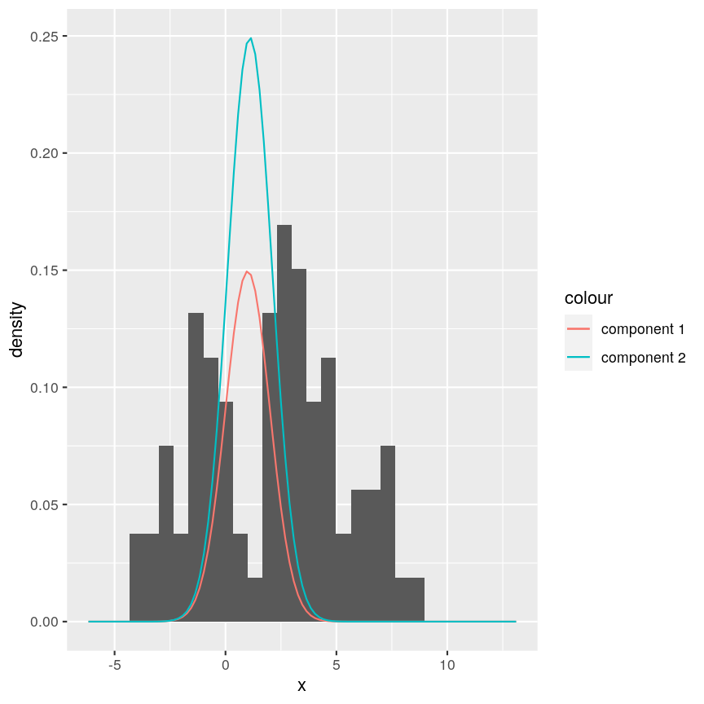
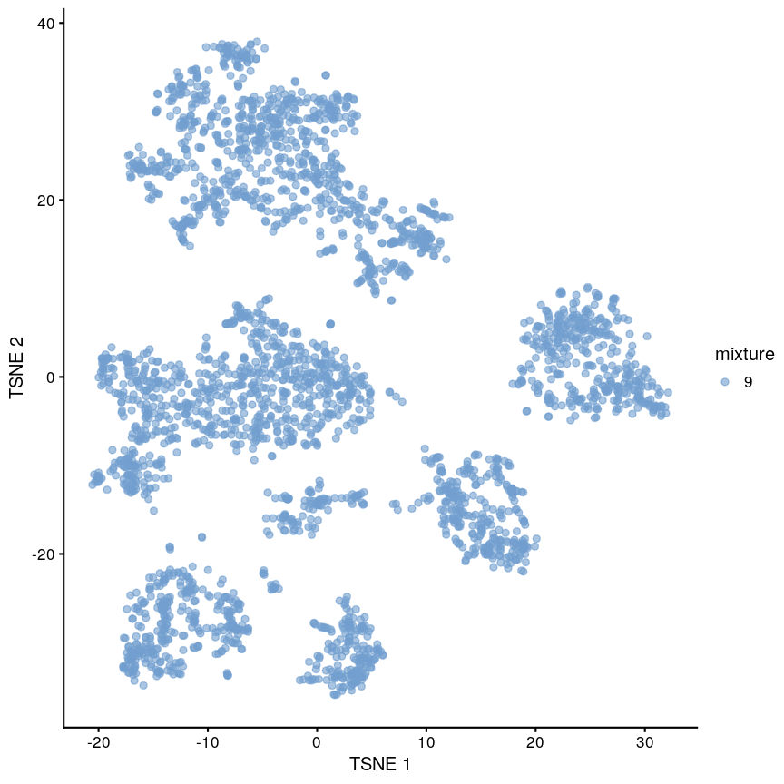
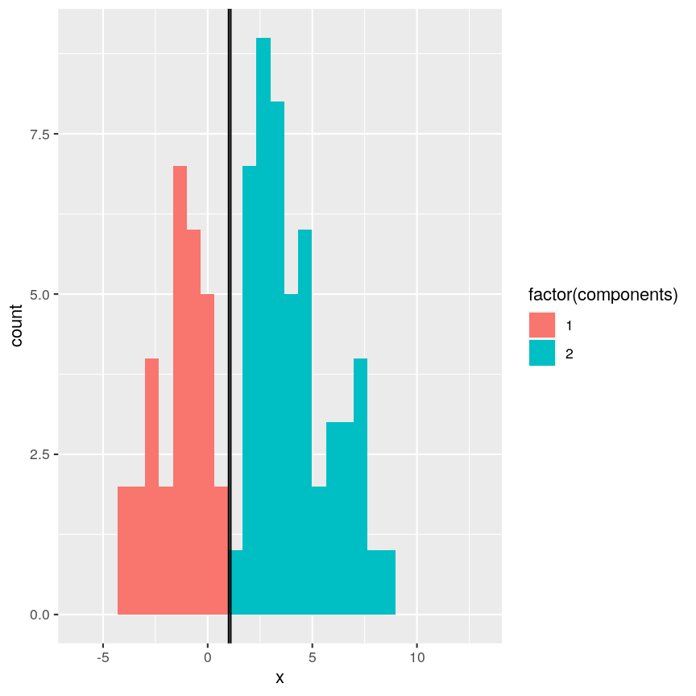
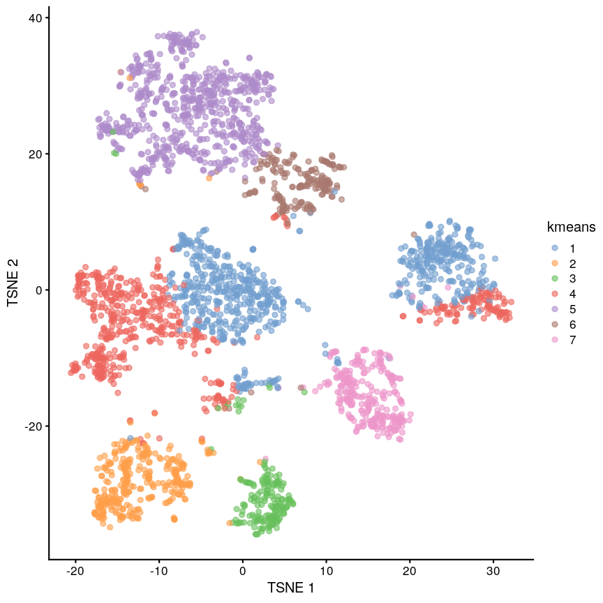
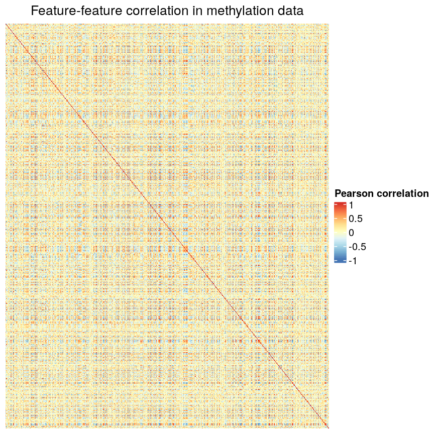
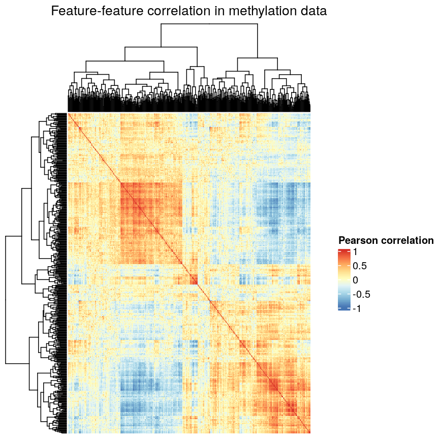
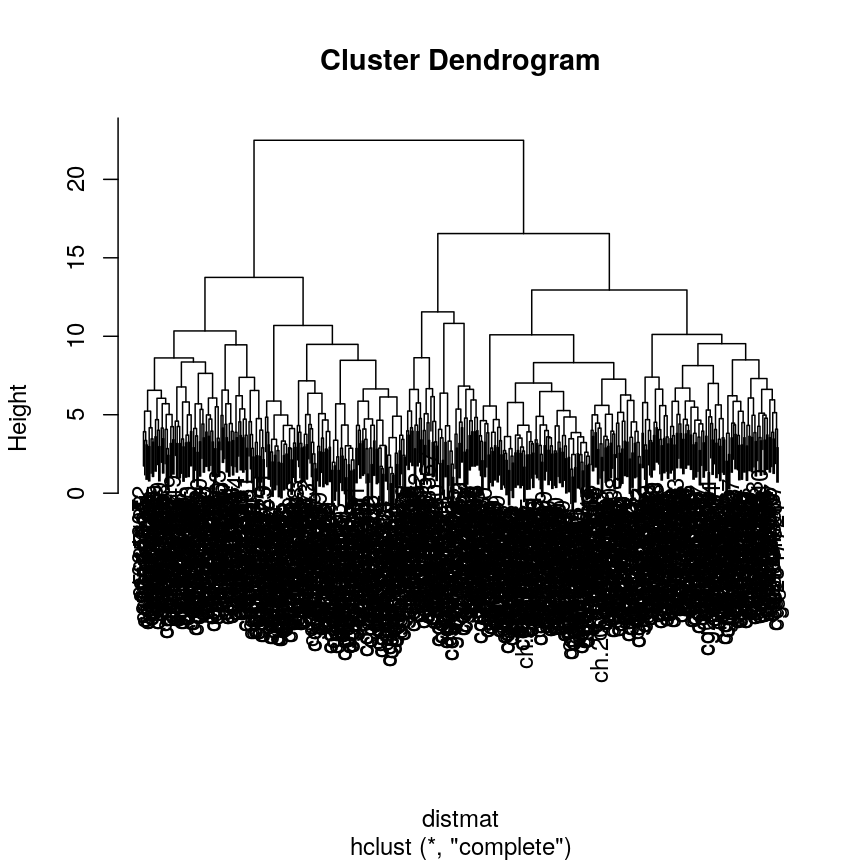
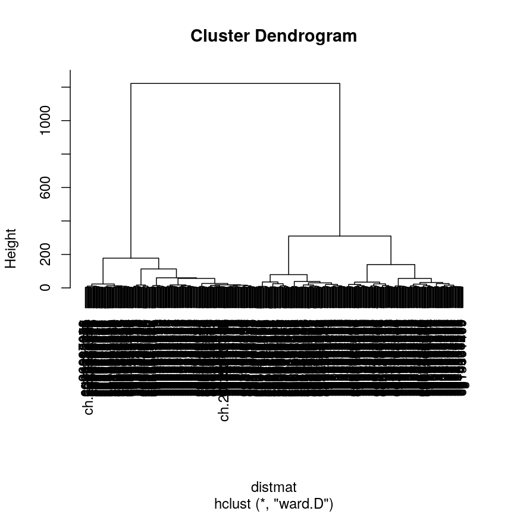

---
# Please do not edit this file directly; it is auto generated.
# Instead, please edit 06-clustering.md in _episodes_rmd/
title: "Clustering"
teaching: 0
exercises: 0
questions:
- "What does clustering mean?"
- "How can we cluster data with a model?"
- "How can we cluster data without a model?"
- "How can we check if clusters are robust?"
objectives:
- "Perform clustering with K-means, mixture models, and hierarchical clustering."
- "Assess clustering performance with silhouette score and bootstrapping/consensus clustering."
keypoints:
- "KP1"
math: yes
---

# Introduction

~~~
library("SingleCellExperiment")
zd <- readRDS(here("data/scrnaseq.rds"))
set.seed(42)
~~~
{: .language-r}

# Mixture model introduction

~~~
Warning: Removed 2 rows containing missing values (geom_bar).
~~~
{: .warning}

~~~
Warning: Removed 2 rows containing missing values (geom_bar).
~~~
{: .warning}

# Mixture models proper (multi-dimensional)

https://web.stanford.edu/class/bios221/book/Chap-Mixtures.html

~~~
library("scater")
zd <- runPCA(zd, ncomponents = 15)
zd <- runTSNE(zd, dimred = "PCA")
~~~
{: .language-r}

# K-means

Generalisation of mixture models to have arbitrary density, just using distance.

~~~
Warning: Removed 4 rows containing missing values (geom_bar).
~~~
{: .warning}

~~~
Warning: Removed 4 rows containing missing values (geom_bar).
~~~
{: .warning}

https://web.stanford.edu/class/bios221/book/Chap-Clustering.html

~~~
## ideas: vary centers, low iter.max, low nstart
cluster <- kmeans(reducedDim(zd), centers = 7, iter.max = 1000, nstart = 100)
zd$kmeans <- as.character(cluster$cluster)

plotReducedDim(zd, "TSNE", colour_by = "kmeans")
~~~
{: .language-r}

> ## k-medioids (PAM)
> 
> This is like k-means but 
>
> 
{: .callout}

# Choosing K

We can't use measures like sum of squares, because then we get $K=N$. As with
regression, if we keep adding parameters (in this case, clusters)
the fit will always get better. In fact, it has to! We will get a perfect
fit (zero error) when each point is its own "cluster".

Therefore we again need to use BIC or something.

# Hierarchical clustering

Recall the heatmap I showed in regression lesson.
If we do this without hierarchical clustering, it's very noisy.

~~~
library("minfi")
library("here")
library("ComplexHeatmap")

methylation <- readRDS(here("data/methylation.rds"))

age <- methylation$Age
methyl_mat <- t(assay(methylation))
small <- methyl_mat[, 1:500]
cor_mat <- cor(small)
col <- circlize::colorRamp2(
    breaks = seq(-1, 1, length.out = 9),
    colors = rev(RColorBrewer::brewer.pal(9, "RdYlBu"))
)
Heatmap(cor_mat,
    column_title = "Feature-feature correlation in methylation data",
    name = "Pearson correlation",
    col = col,
    cluster_rows = FALSE, cluster_columns = FALSE,
    show_row_dend = FALSE, show_column_dend = FALSE,
    show_row_names = FALSE, show_column_names = FALSE
)
~~~
{: .language-r}

With clustering you can see some nice groupings.

~~~
Heatmap(cor_mat,
    column_title = "Feature-feature correlation in methylation data",
    name = "Pearson correlation",
    col = col,
    row_dend_width = unit(0.2, "npc"),
    column_dend_height = unit(0.2, "npc"),
    show_row_names = FALSE, show_column_names = FALSE
)
~~~
{: .language-r}

# Distance functions

# Linkage methods

Complete linkage (the default) uses the maximum distance between clusters as
the distance when merging them.

~~~
distmat <- dist(cor_mat)
clust <- hclust(distmat, method = "complete")
plot(clust)
~~~
{: .language-r}

Ward’s method says that the distance between two clusters, A and B, is how much
the sum of squares will increase when we merge them.

Details: https://jbhender.github.io/Stats506/F18/GP/Group10.html

~~~
clust <- hclust(distmat, method = "ward.D")
plot(clust)
~~~
{: .language-r}



