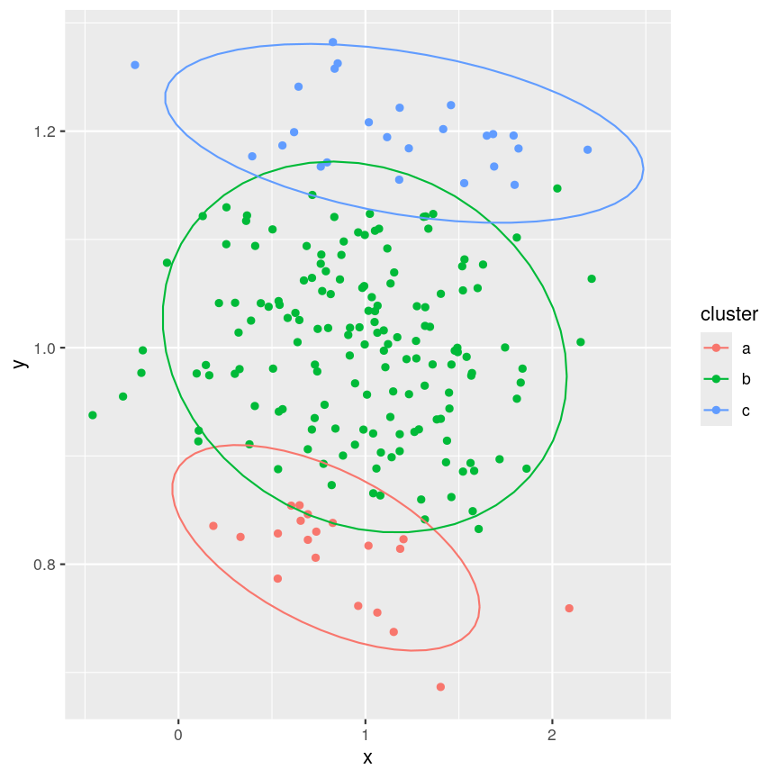
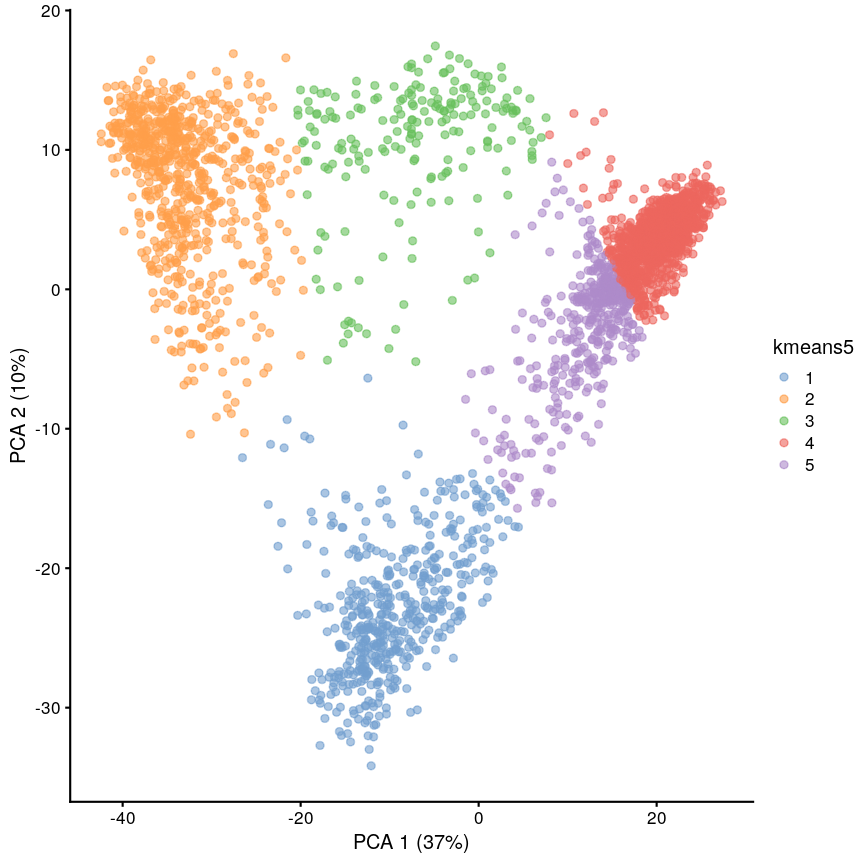
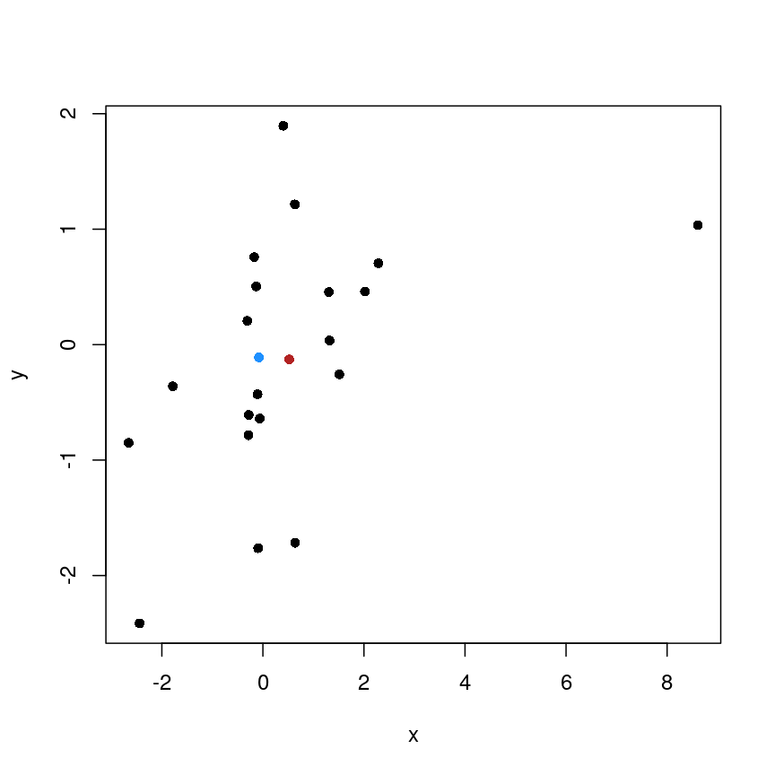
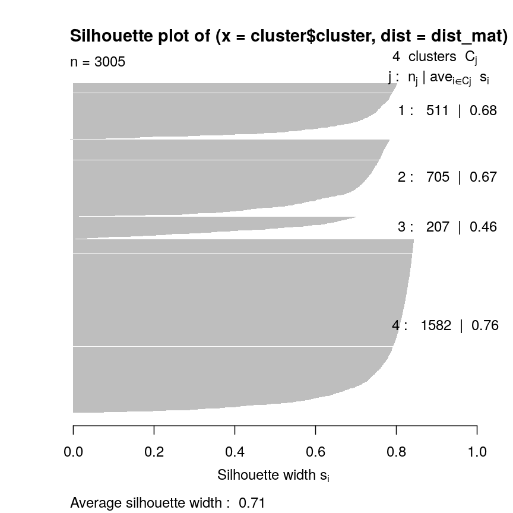
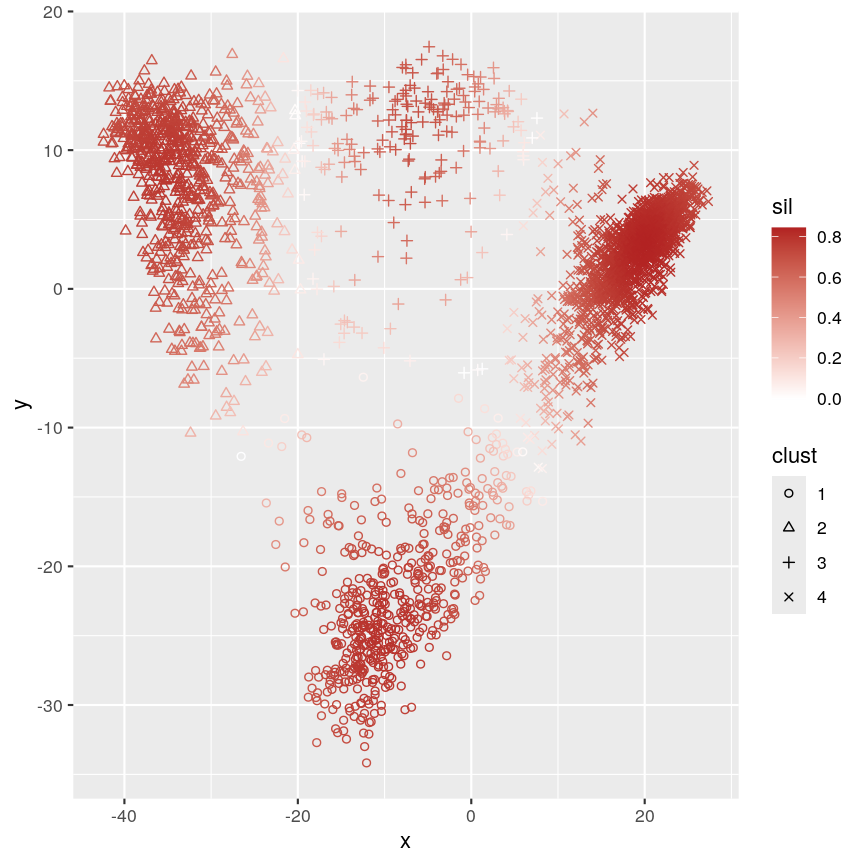
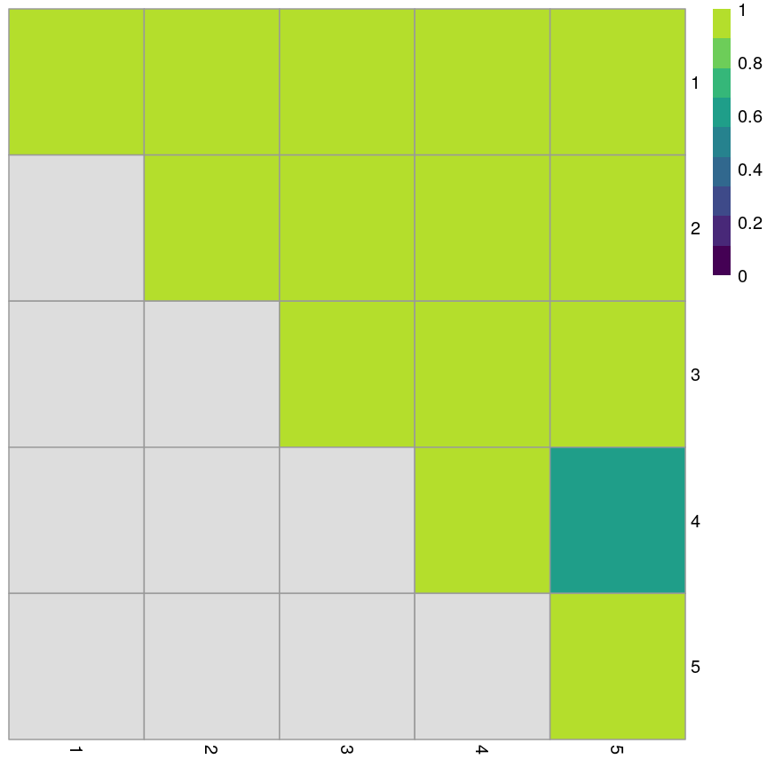

---
# Please do not edit this file directly; it is auto generated.
# Instead, please edit 06-k-means.md in _episodes_rmd/
title: "K-means"
source: Rmd
teaching: 45
exercises: 15
questions:
  - How do we detect real clusters in high-dimensional data?
  - How does K-means work and when should it be used?
  - How can we perform K-means in `R`?
  - How can we appraise a clustering and test cluster robustness?
objectives:
  - Understand the importance of clustering in high-dimensional data
  - Understand and perform K-means clustering in `R`.
  - Assess clustering performance using silhouette scores.
  - Assess cluster robustness using bootstrapping.
keypoints:
  - K-means is an intuitive algorithm for clustering data.
  - K-means has various advantages but can be computationally intensive.
  - Apparent clusters in high-dimensional data should always be treated
    with some scepticism.
  - Silhouette width and bootstrapping can be used to assess how well our
    clustering algorithm has worked.
math: yes
---

# Introduction

High-dimensional data, especially in biological settings,  has
many sources of heterogeneity. Some of these are stochastic variation
arising from measurement error or random differences between organisms. 
In some cases, a known grouping causes this heterogeneity (sex, treatment
groups, etc). In other cases, this heterogeneity arises from the presence of
unknown subgroups in the data. **Clustering** is a set of techniques that allows
us to discover unknown groupings like this, which we can often use to
discover the nature of the heterogeneity we're investigating.

**Cluster analysis** involves finding groups of observations that are more
similar to each other (according to some feature) than they are to observations
in other groups. Cluster analysis is a useful statistical tool for exploring
high-dimensional datasets as 
visualising data with large numbers of features is difficult. It is commonly
used in fields such as bioinformatics, genomics, and image processing in which
large datasets that include many features are often produced. Once groups
(or clusters) of observations have been identified using cluster analysis,
further analyses or interpretation can be carried out on the groups, for
example, using metadata to further explore groups.

There are various ways to look for clusters of observations in a dataset using
different *clustering algorithms*. One way of clustering data is to minimise
distance between observations within a cluster and maximise distance between
proposed clusters. Clusters can be updated in an iterative process so that over
time we can become more confident in size and shape of clusters.

# Believing in clusters

When using clustering, it's important to realise that data may seem to
group together even when these groups are created randomly. It's especially 
important to remember this when making plots that add extra visual aids to
distinguish clusters. 
For example, if we cluster data from a single 2D normal distribution and draw
ellipses around the points, these clusters suddenly become almost visually
convincing. This is a somewhat extreme example, since there is genuinely no
heterogeneity in the data, but it does reflect what can happen if you allow
yourself to read too much into faint signals.

Let's explore this further using an example. We create two columns of data
('x' and 'y') and partition these data into three groups ('a', 'b', 'c')
according to data values. We then plot these data and their allocated clusters
and put ellipses around the clusters using the `stat_ellipse` function
in `ggplot`.

plot of chunk fake-cluster

The randomly created data used here appear to form three clusters when we
plot the data. Putting ellipses around the clusters can further convince us
that the clusters are 'real'. But how do we tell if clusters identified
visually are 'real'?

# What is K-means clustering?

**K-means clustering** is a clustering method which groups data points into a 
user-defined number of distinct non-overlapping clusters. In K-means clustering 
we are interested in minimising the *within-cluster variation*. This is the amount that
data points within a cluster differ from each other. In K-means clustering, the distance 
between data points within a cluster is used as a measure of within-cluster variation.
Using a specified clustering algorithm like K-means clustering increases our confidence
that our data can be partitioned into groups.

To carry out K-means clustering, we first pick $k$ initial points as centres or 
"centroids" of our clusters. There are a few ways to choose these initial "centroids",
but for simplicity let's imagine we just pick three random co-ordinates.
We then follow these two steps until convergence:

1. Assign each data point to the cluster with the closest centroid
2. Update centroid positions as the average of the points in that cluster

We can see this process in action in this animation:

Cap

While K-means has some advantages over other clustering methods (easy to implement and
to understand), it does have some disadvantages, namely difficulties in identifying 
initial clusters which observations belong to and the need for the user to specifiy the
number of clusters that the data should be partitioned into.

> ## Initialisation
>
> The algorithm used in K-means clustering finds a *local* rather than a
> *global* optimum, so that results of clustering are dependent on the initial
> cluster that each observation is randomly assigned to. This initial
> configuration can have a significant effect on the final configuration of the
> clusters, so dealing with this limitation is an important part 
> of K-means clustering. Some strategies to deal with this problem are:
> - Choose $K$ points at random from the data as the cluster centroids.
> - Randomly split the data into $K$ groups, and then average these groups.
> - Use the K-means++ algorithm to choose initial values.
> 
> These each have advantages and disadvantages. In general, it's good to be
> aware of this limitation of K-means clustering and that this limitation can
> be addressed by choosing a good initialisation method, initialising clusters
> manually, or running the algorithm from multiple different starting points.
>
{: .callout}

# K-means clustering applied to single-cell RNAseq data

Let's carry out K-means clustering in `R` using some real high-dimensional data.
We're going to work with single-cell RNAseq data in these clustering challenges,
which is often *very* high-dimensional. Commonly, experiments profile the
expression level of 10,000+ genes in thousands of cells. Even after filtering
the data to remove low quality observations, the dataset we're using in this
episode contains measurements for over 9,000 genes in over 3,000 cells.

One way to get a handle on a dataset of this size is to use something we covered
earlier in the course - dimensionality reduction. Dimensionality reduction
allows us to visualise this incredibly complex data in a small number of
dimensions. In this case, we'll be using principal component analysis (PCA) to
compress the data by identifying the major axes of variation in the data,
before running our clustering algorithms on this lower-dimensional data.

The `scater` package has some easy-to-use tools to calculate a PCA for
`SummarizedExperiment` objects.
Let's load the `scRNAseq` data and calculate some principal components.

~~~
library("SingleCellExperiment")
library("scater")

scrnaseq <- readRDS(here::here("data/scrnaseq.rds"))
scrnaseq <- runPCA(scrnaseq, ncomponents = 15)
pcs <- reducedDim(scrnaseq)[, 1:2]
~~~
{: .language-r}
The first two principal components capture almost 50% of the variation within
the data. For now, we'll work with just these two principal components, since
we can visualise those easily, and they're a quantitative representation of
the underlying data, representing the two largest axes of variation. 

We can now run K-means clustering on the first and second principal components
of the `scRNAseq` data using the `kmeans` function.

~~~
set.seed(42)
cluster <- kmeans(pcs, centers = 4)
scrnaseq$kmeans <- as.character(cluster$cluster)
plotReducedDim(scrnaseq, "PCA", colour_by = "kmeans")
~~~
{: .language-r}

Title

We can see that this produces a sensible-looking partition of the data. 
However, is it totally clear whether there might be more or fewer clusters
here?

> ## Challenge 1
> 
> Cluster the data using a $K$ of 5, and plot it using `plotReducedDim`.
> Save this with a variable name that's different to what we just used,
> because we'll use this again later.
> 
> > ## Solution
> > 
> > 
> > ~~~
> > set.seed(42)
> > cluster5 <- kmeans(pcs, centers = 5)
> > scrnaseq$kmeans5 <- as.character(cluster5$cluster)
> > plotReducedDim(scrnaseq, "PCA", colour_by = "kmeans5")
> > ~~~
> > {: .language-r}
> > 
> > 

> > 
> > 
plot of chunk kmeans-ex

> > 

> > 
> {: .solution}
{: .challenge}

> ## K-medoids (PAM)
> 
> One problem with K-means is that using the mean to define cluster centroids
> means that clusters can be very sensitive to outlying observations.
> K-medoids, also known as "partitioning around medoids (PAM)" is similar to 
> K-means, but uses the median rather than the mean as the method for defining
> cluster centroids. Using the median rather than the mean reduces sensitivity of
> clusters to outliers in the data. K-medioids has had popular application in
> genomics, for example the well-known PAM50 gene set in breast cancer, which has seen some 
> prognostic applications.
> The following example shows how cluster centroids differ when created using 
> medians rather than means.
>
> 
> ~~~
> x <- rnorm(20)
> y <- rnorm(20)
> x[10] <- x[10] + 10
> plot(x, y, pch = 16)
> points(mean(x), mean(y), pch = 16, col = "firebrick")
> points(median(x), median(y), pch = 16, col = "dodgerblue")
> ~~~
> {: .language-r}
> 
> 

> 
> 
plot of chunk unnamed-chunk-1

> 

> PAM can be carried out using `pam()` form the **`cluster`** package.
> 
{: .callout}

# Cluster separation
When performing clustering, it is important for us to be able to measure
how well our clusters are separated. One measure to test this is silhouette width.
This is a number that is computed for every observation. It can range from -1 to 1.
A high silhouette width means an observation is closer to other observations
within the same cluster. For each cluster, the silhouette widths can then be
averaged or an overall average can be taken.

> ## More detail on silhouette widths
> In more detail, each observation’s silhouette width is computed as follows:  
> 1. Compute the average distance between the focal observation and all other
> observations in the same cluster.
> 2. For each of the other clusters, compute the average distance between
> focal observation and all observations in the other cluster. Keep the
> smallest of these average distances.
> 3. Subtract (1.)-(2.) then divivde by whichever is smaller (1.) or (2).
{: .callout}

Ideally, we would have only large positive silhouette widths, indicating
that each data point is much more similar to points within its cluster than it
is to the points in any other cluster. However, this is rarely the case. Often,
clusters are very fuzzy, and even if we are relatively sure about the existence
of discrete groupings in the data, observations on the boundaries can be difficult
to confidently place in either cluster.

Here we use the `silhouette` function from the `cluster` package to calculate the
silhouette width of our K-means clustering using a distance matrix of distances
between points in the clusters.

~~~
library("cluster")
dist_mat <- dist(pcs)
sil <- silhouette(cluster$cluster, dist = dist_mat)
plot(sil, border = NA)
~~~
{: .language-r}

plot of chunk silhouette

Let's plot the silhouette score on the original dimensions used to cluster
the data. Here, we're mapping cluster membership to point shape, and silhouette
width to colour.

~~~
pc <- as.data.frame(pcs)
colnames(pc) <- c("x", "y")
pc$sil <- sil[, "sil_width"]
pc$clust <- factor(cluster$cluster)
mean(sil[, "sil_width"])
~~~
{: .language-r}

~~~
[1] 0.7065662
~~~
{: .output}

~~~
ggplot(pc) +
    aes(x, y, shape = clust, colour = sil) +
    geom_point() +
    scale_colour_gradient2(
        low = "dodgerblue", high = "firebrick"
    ) +
    scale_shape_manual(
        values = setNames(1:4, 1:4)
    )
~~~
{: .language-r}

plot of chunk plot-silhouette

This plot shows that silhouette values for individual observations tends to be
very high in the centre of clusters, but becomes quite low towards the edges.
This makes sense, as points that are "between" two clusters may be more similar
to points in another cluster than they are to the points in the cluster one they
belong to.

> ## Challenge 2
> 
> Calculate the silhouette width for the K of 5 clustering we did earlier.
> Is it better or worse than before?
>
> Can you identify where the differences lie?
> 
> > ## Solution
> > 
> > 
> > ~~~
> > sil5 <- silhouette(cluster5$cluster, dist = dist_mat)
> > scrnaseq$kmeans5 <- as.character(cluster5$cluster)
> > plotReducedDim(scrnaseq, "PCA", colour_by = "kmeans5")
> > ~~~
> > {: .language-r}
> > 
> > 

> > 
> > 
plot of chunk silhouette-ex

> > 

> > 
> > ~~~
> > mean(sil5[, "sil_width"])
> > ~~~
> > {: .language-r}
> > 
> > 
> > 
> > ~~~
> > [1] 0.5849979
> > ~~~
> > {: .output}
> > The average silhouette width is lower when k=5.
> > 
> > 
> > ~~~
> > plot(sil5, border = NA)
> > ~~~
> > {: .language-r}
> > 
> > 

> > 
> > 
plot of chunk unnamed-chunk-4

> > 

> > This seems to be because some observations in clusters 3 and 5 seem to be
> > more similar to other clusters than the one they have been assigned to.
> > This may indicate that K is too high.
> {: .solution}
{: .challenge}

> ## Gap statistic
> 
> Another measure of how good our clustering is is the "gap statistic".
> This compares the observed squared distance between observations in a cluster
> and the centre of the cluster to an "expected" squared distances.
> The expected distances are calculated by randomly distributing cells within
> the range of the original data. Larger values represent lower
> squared distances within clusters, and thus better clustering.
> We can see how this is calculated in the following example.
> 
> 
> ~~~
> library("cluster")
> gaps <- clusGap(pcs, kmeans, K.max = 20, iter.max = 20)
> best_k <- maxSE(gaps$Tab[, "gap"], gaps$Tab[, "SE.sim"])
> best_k
> plot(gaps$Tab[,"gap"], xlab = "Number of clusters", ylab = "Gap statistic")
> abline(v = best_k, col = "red")
> ~~~
> {: .language-r}
{: .callout}

# Cluster robustness

When we cluster data, we want to be sure that the clusters we identify are
not a result of the exact properties of the input data. That is, if the
data we observed were slightly different, the clusters we would identify
in this different data would be very similar. This makes it more
likely that these can be reproduced.

To assess this, we can use the *bootstrap*. What we do here is to take a sample
from the data with replacement. Sampling with replacement means that in the 
sample that we take, we can include points from the input data more than once.
This is maybe easier to see with an example. First, we define some data:

~~~
data <- 1:5
~~~
{: .language-r}

Then, we can take a sample from this data without replacement:

~~~
sample(data, 5)
~~~
{: .language-r}

~~~
[1] 4 1 3 5 2
~~~
{: .output}

This sample is a subset of the original data, and points are only present once.
This is the case every time even if we do it many times:

~~~
## Each column is a sample
replicate(10, sample(data, 5))
~~~
{: .language-r}

~~~
     [,1] [,2] [,3] [,4] [,5] [,6] [,7] [,8] [,9] [,10]
[1,]    5    2    5    2    3    1    3    5    5     3
[2,]    4    5    4    5    4    4    1    3    1     2
[3,]    2    1    1    3    2    5    2    2    3     4
[4,]    1    4    2    1    5    3    5    1    2     5
[5,]    3    3    3    4    1    2    4    4    4     1
~~~
{: .output}

However, if we sample *with replacement*, then sometimes individual data points
are present more than once.

~~~
replicate(10, sample(data, 5, replace = TRUE))
~~~
{: .language-r}

~~~
     [,1] [,2] [,3] [,4] [,5] [,6] [,7] [,8] [,9] [,10]
[1,]    3    1    2    2    1    3    3    2    4     2
[2,]    1    3    2    4    2    5    2    1    2     5
[3,]    5    5    4    4    2    2    1    1    1     3
[4,]    1    1    4    2    1    4    4    5    5     4
[5,]    3    1    2    1    4    2    5    3    3     2
~~~
{: .output}

> ## Bootstrapping
> 
> The bootstrap is a powerful and common statistical technique.
> 
> We would like to know about the sampling distribution of a statistic,
> but we don't have any knowledge of its behaviour under the null hypothesis.
> 
> For example, we might want to understand the uncertainty around an estimate
> of the mean of our data. To do this, we could resample the data with
> replacement and calculate the mean of each average.
> 
> 
> ~~~
> boots <- replicate(1000, mean(sample(data, 5, replace = TRUE)))
> hist(boots,
>     breaks = "FD",
>     main = "1,000 bootstrap samples",
>     xlab = "Mean of sample"
> )
> ~~~
> {: .language-r}
> 
> 

> 
> 
plot of chunk boots

> 

> 
> In this case, the example is simple, but it's possible to
> devise more complex statistical tests using this kind of approach.
> 
> The bootstrap, along with permutation testing, can be a very flexible and 
> general solution to many statistical problems.
> 
{: .callout}

In applying the bootstrap to clustering, we want to see two things:
1. Will observations within a cluster consistently cluster together in
   different bootstrap replicates?
2. Will observations frequently swap between clusters?

In the plot below, the diagonal of the plot shows how often the clusters
are reproduced in boostrap replicates. High scores on
the diagonal mean that the clusters are consistently reproduced in each 
boostrap replicate. Similarly, the off-diagonal elements represent how often
observations swap between clusters in bootstrap replicates. High scores 
indicate that observations rarely swap between clusters.

~~~
library("pheatmap")
library("bluster")
library("viridis")

km_fun <- function(x) {
    kmeans(x, centers = 4)$cluster
}
ratios <- bootstrapStability(pcs, FUN = km_fun, clusters = cluster$cluster)
pheatmap(ratios,
    cluster_rows = FALSE, cluster_cols = FALSE,
    col = viridis(10),
    breaks = seq(0, 1, length.out = 10)
)
~~~
{: .language-r}

plot of chunk bs-heatmap

Yellow boxes indicate values slightly greater than 1, which may be observed.
These are “good” (despite missing in the colour bar).

> ## Challenge 3
>
> Repeat the bootstrapping process with K=5. Are the results better or worse?
> Can you identify where the differences occur on the `plotReducedDim`?
> 
> > ## Solution
> > 
> > 
> > ~~~
> > km_fun5 <- function(x) {
> >     kmeans(x, centers = 5)$cluster
> > }
> > set.seed(42)
> > ratios5 <- bootstrapStability(pcs, FUN = km_fun5, clusters = cluster5$cluster)
> > pheatmap(ratios5,
> >     cluster_rows = FALSE, cluster_cols = FALSE,
> >     col = viridis(10),
> >     breaks = seq(0, 1, length.out = 10)
> > )
> > ~~~
> > {: .language-r}
> > 
> > 

> > 
> > 
plot of chunk bs-ex

> > 

> > When K=5, we can see that the values on the diagonal of the matrix are 
> > smaller, indicating that the clusters aren't exactly reproducible in the
> > bootstrap samples. 
> > 
> > Similarly, the off-diagonal elements are considerably lower for some
> > elements.
> > This indicates that observations are "swapping" between these clusters
> > in bootstrap replicates.
> {: .solution}
{: .challenge}

> ## Consensus clustering
> 
> One useful and generic method of clustering is *consensus clustering*.
> This method can use k-means, or other clustering methods.
> 
> The idea behind this is to bootstrap the data repeatedly, and cluster
> it each time, perhaps using different numbers of clusters.
> If a pair of data points always end up in the same cluster,
> it's likely that they really belong to the same underlying cluster.
> 
> This is really computationally demanding but has been shown to perform very
> well in some situations. It also allows you to visualise how cluster
> membership changes over different values of K.
> 
{: .callout}

> ## Speed
> 
> It's worth noting that a lot of the methods we've discussed here are very
> computationally demanding. 
> When clustering data, we may have to compare points to each other many times.
> This becomes more and more difficult when we have many observations and
> many features. This is especially problematic when we want to do things like
> bootstrapping that requires us to cluster the data over and over.
> 
> As a result, there are a lot of approximate methods for finding clusters
> in the data. For example, the
> [mbkmeans](http://www.bioconductor.org/packages/3.13/bioc/html/mbkmeans.html)
> package includes an algorithm for clustering extremely large data. The idea
> behind this algorithm
> is that if the clusters we find are robust, we don't need to look at all of
> the data every time. This is very helpful because it reduces the amount of
> data that needs to be held in memory at once, but also because it minimises the 
> computational cost.
> 
> Similarly, approximate nearest neighbour methods like 
> [Annoy](https://pypi.org/project/annoy/) can be used to identify what the
> $K$ closest points are in the data, and this can be used in some clustering 
> methods (for example, graph-based clustering).
> 
> Generally, these methods sacrifice a bit of accuracy for a big gain in speed.
{: .callout}

## Further reading

- [Wu, J. (2012) Cluster analysis and K-means clustering: An Introduction. In: Advances in K-means Clustering. Springer Berlin, Heidelberg.](https://doi.org/10.1007/978-3-642-29807-3_1).
- [Modern statistics for modern biology, Susan Holmes and Wolfgang Huber (Chapter 5)](https://web.stanford.edu/class/bios221/book/Chap-Clustering.html).
- [Understanding K-means clustering in machine learning, Towards Data Science](https://towardsdatascience.com/understanding-k-means-clustering-in-machine-learning-6a6e67336aa1).


