---
# Please do not edit this file directly; it is auto generated.
# Instead, please edit 08-mixture-models.md in _episodes_rmd/
title: "Mixture models"
teaching: 0
exercises: 0
questions:
- "What is clustering?"
- "Why would we want to find clusters in data?"
- "How can we cluster low-dimensional data with a model?"
- "What difficulties does high-dimensional clustering present?"
objectives:
- "Understand the basis of mixture models in a low- and high-dimensional setting."
keypoints:
- "Mixture models can be used as a clustering method, to model data with heterogeneous characteristics."
- "Mixture models are a 'soft' clustering method."
- "Mixture models in high-dimensional data can be difficult to fit and may not be ideal."
math: yes
---

# Introduction

High-dimensional data, especially in biological settings, commonly has
many sources of heterogeneity. Some of these are stochastic variation
arising from measurement error or random differences between organisms. 
In some cases, a known grouping causes this heterogeneity (sex, treatment
groups, etc). In other cases, this heterogeneity arises from the presence of
unknown subgroups in the data. Clustering is a set of techniques that allows
us to discover unknown groupings like this, which we can often use to
discover the nature of the heterogeneity we're investigating.

For example, imagine we observed a variable like cancer invasiveness.
When this has one underlying aetiology (origin/cause), the distribution of
our observations of invasiveness will tend to have one peak or *mode*,
with some spread
around that mode. However, if cancer arises due to different causes in different
groups, then there may be distinct subgroups within the data.
For example, some cancers arise through natural processes, but also due to 
environmental pollutants. Furthermore, cancers that arise in younger people
often have different causes (genetic predispositions) that are different to
the causes for the same types of cancer in older people.

An example of a *multi-modal* distribution like this is shown below:

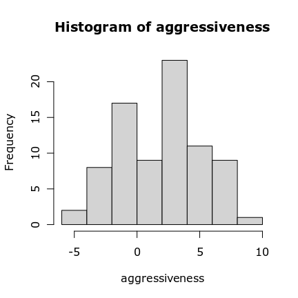

These data seem to arise from two different groupings, or two different 
distributions. We can imagine modelling this by fitting two distributions, and
labelling each point as belonging to one or the other distribution.
How can we do that? Well, it might help to think about how
we'd fit a distribution to unimodal data first. It's not uncommon to see data
that's roughly normally distributed: 

~~~
Warning: Removed 2 rows containing missing values (geom_bar).
~~~
{: .warning}

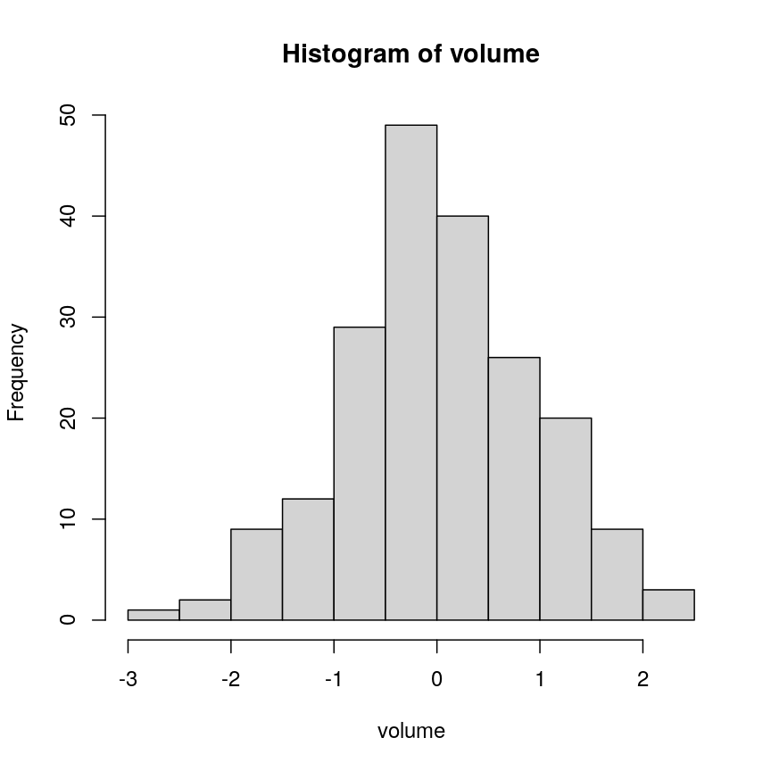

For data like these, we could
use the empirical standard deviation and mean. However, we might not always
see data that looks exactly normal; we might want to fit a different type of
distribution where the parameters can't be estimated quite so simply.
We can use the concept of likelihood to optimise the parameters of any
distribution.
Mathematically, we are trying to find that 
Specifically, we find the set of parameters (in this case, mean and standard
deviation) that best fit the data.

~~~
set.seed(66)
univar <- rnorm(200)
library("MASS")
opt <- fitdistr(x = univar, densfun = dnorm, start = list(mean = 10, sd = 10))
~~~
{: .language-r}

~~~
Warning in densfun(x, parm[1], parm[2], ...): NaNs produced
Warning in densfun(x, parm[1], parm[2], ...): NaNs produced
Warning in densfun(x, parm[1], parm[2], ...): NaNs produced
Warning in densfun(x, parm[1], parm[2], ...): NaNs produced
Warning in densfun(x, parm[1], parm[2], ...): NaNs produced
Warning in densfun(x, parm[1], parm[2], ...): NaNs produced
Warning in densfun(x, parm[1], parm[2], ...): NaNs produced
~~~
{: .warning}

~~~
library("ggplot2")
ggplot(data.frame(x = univar)) +
    aes(x) +
    geom_histogram(aes(y = ..density..)) +
    geom_function(
        fun = dnorm,
        args = list(mean = opt$estimate["mean"], sd = opt$estimate["sd"]),
        aes(colour = "Fitted distribution")
    ) +
    scale_colour_discrete(name = NULL)
~~~
{: .language-r}

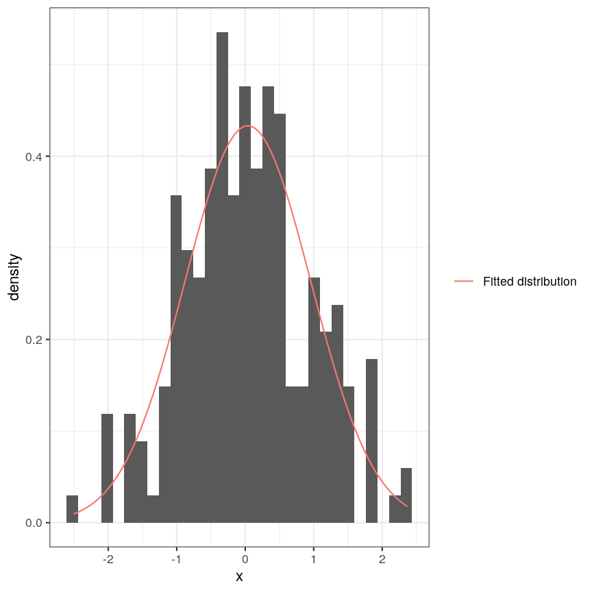

> ## Exercise
> 
> 1. What are the empirical estimates of mean and standard deviation for these
>    data? Are they different to the estimates from `fitdistr`?
> 2. Transform the data using `exp` and fit a log-normal distribution to the 
>    data. Compare these with the 
>    empirical mean and standard deviation of this transformed data.
>    *Hint: try `dlnorm` with parameter names `meanlog` and `sdlog`.*
> 
> > ## Solution
> > 1. 
> >    
> >    ~~~
> >    opt
> >    ~~~
> >    {: .language-r}
> >    
> >    
> >    
> >    ~~~
> >          mean          sd    
> >      0.03862538   0.92078309 
> >     (0.06510920) (0.04604348)
> >    ~~~
> >    {: .output}
> >    
> >    
> >    
> >    ~~~
> >    mean(univar)
> >    ~~~
> >    {: .language-r}
> >    
> >    
> >    
> >    ~~~
> >    [1] 0.03869649
> >    ~~~
> >    {: .output}
> >    
> >    
> >    
> >    ~~~
> >    sd(univar)
> >    ~~~
> >    {: .language-r}
> >    
> >    
> >    
> >    ~~~
> >    [1] 0.9230326
> >    ~~~
> >    {: .output}
> > 2. 
> >    
> >    ~~~
> >    univar_exp <- exp(univar)
> >    opt_log <- fitdistr(x = univar_exp, densfun = dlnorm, start = list(meanlog = 10, sdlog = 10))
> >    ~~~
> >    {: .language-r}
> >    
> >    
> >    
> >    ~~~
> >    Warning in densfun(x, parm[1], parm[2], ...): NaNs produced
> >    Warning in densfun(x, parm[1], parm[2], ...): NaNs produced
> >    Warning in densfun(x, parm[1], parm[2], ...): NaNs produced
> >    Warning in densfun(x, parm[1], parm[2], ...): NaNs produced
> >    Warning in densfun(x, parm[1], parm[2], ...): NaNs produced
> >    Warning in densfun(x, parm[1], parm[2], ...): NaNs produced
> >    Warning in densfun(x, parm[1], parm[2], ...): NaNs produced
> >    ~~~
> >    {: .warning}
> >    
> >    
> >    
> >    ~~~
> >    opt_log
> >    ~~~
> >    {: .language-r}
> >    
> >    
> >    
> >    ~~~
> >        meanlog       sdlog   
> >      0.03862538   0.92078309 
> >     (0.06510920) (0.04604348)
> >    ~~~
> >    {: .output}
> >    
> >    
> >    
> >    ~~~
> >    mean(univar_exp)
> >    ~~~
> >    {: .language-r}
> >    
> >    
> >    
> >    ~~~
> >    [1] 1.587429
> >    ~~~
> >    {: .output}
> >    
> >    
> >    
> >    ~~~
> >    sd(univar_exp)
> >    ~~~
> >    {: .language-r}
> >    
> >    
> >    
> >    ~~~
> >    [1] 1.698602
> >    ~~~
> >    {: .output}
> >    
> >    
> >    
> >    ~~~
> >    ggplot(data.frame(x = univar_exp)) +
> >        aes(x) +
> >        geom_histogram(aes(y = ..density..)) +
> >        geom_function(
> >            fun = dlnorm,
> >            args = list(meanlog = opt$estimate["mean"], sdlog = opt$estimate["sd"]),
> >            aes(colour = "Fitted distribution")
> >        ) +
> >        scale_colour_discrete(name = NULL)
> >    ~~~
> >    {: .language-r}
> >    
> >    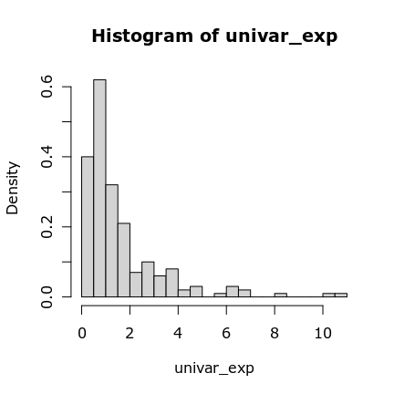
> {: .solution}
{: .challenge}

## Fitting a mixture model

Now, let's return to the example that looks like a mixture of two distributions.
To fit two different distributions to these data, we can use an algorithm 
call EM, or "expectation-maximisation". This refers to the two steps of the
algorithm.
First, we choose some initial values for the distributions we want to fit.
We can fit any number of distributions to the data, and this number is often 
denoted $k$. In this case, we want to fit two components, so $k=2$.
It's important to note that we don't necessarily have to pick good starting
values here, though it may help. You can see that below our initial starting
"guess" is really bad in this case:

~~~
Warning: Removed 2 rows containing missing values (geom_bar).
~~~
{: .warning}

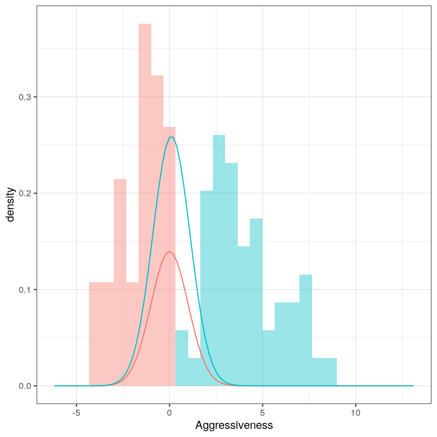

We then assign each data point to the component that fits them better (this is
the "expectation" step). Then, we maximise the likelihood of the data under
each distribution. That is, we optimise the parameters of the distributions
for each of the $k$ components. We continue this two-step process until the
algorithm converges - that is, the components don't change from iteration to
iteration. In this simple example, the algorithm converges after one iteration,
but this won't usually be the case!

~~~
Warning: Removed 2 rows containing missing values (geom_bar).
~~~
{: .warning}

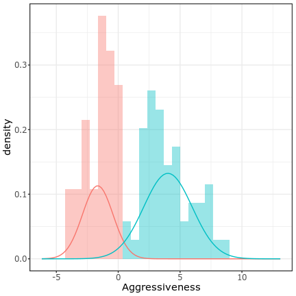

The figures shown here were made manually, to be able to step through the 
process. To fit a 2-D mixture model, it's usually not wise to code it yourself,
because people have made very fast and easy-to-use packages to fit mixture 
models. Here's one example:

~~~
set.seed(66)
true_means <- c(-1, 4)
true_sds <- c(2, 1)
df <- data.frame(
    x = c(
        rnorm(30, mean = true_means[[1]], sd = true_sds[[1]]),
        rnorm(50, mean = true_means[[2]], sd = true_sds[[1]])
    ),
    cluster = c(rep("a", 30), rep("b", 50))
)

library("mixtools")
mix <- normalmixEM2comp(
    df$x,
    lambda = c(0.5, 0.5),
    mu = c(0, 0.1),
    sigsqrd = c(1, 1)
)
~~~
{: .language-r}

~~~
number of iterations= 177 
~~~
{: .output}

> ## Exercise
>
> Try changing the `true_means` and `true_sds` parameters to different values.
> How do the results change? At what point is it hard to reliably separate the
> two distributions?
{: .challenge}

# Mixture models in more than one dimension

Of course, biological data is not usually so one-dimensional! In fact, for
these clustering exercises, we're doing to work with single-cell RNAseq data,
which is often *very* high-dimensional. Commonly, experiments profile the expression
level of 10,000+ genes in thousands of cells. Even after filtering lowly 
expressed genes and low quality cells, the dataset we're using in this episode
contains measurements for over 9,000 genes in over 3,000 cells.

~~~
library("SingleCellExperiment")
scrnaseq <- readRDS(here::here("data/scrnaseq.rds"))
dim(scrnaseq)
~~~
{: .language-r}

~~~
[1] 9715 3005
~~~
{: .output}

One way to get a handle on data of this size is to use something we covered
earlier in the course - dimensionality reduction!
Dimensionality reduction allows us to visualise this incredibly complex data
in a small number of dimensions.
In this case, we'll primarily be using PCA. This allows us to compress the data 
by identifying the major axes of variation in the data,
and to run our clustering algorithms on this lower-dimensional data.

The `scater` package has some easy-to-use tools to calculate and plot 
dimensionality reduction for `SummarizedExperiment` objects.
If we plot the first two principal components, we can see that the data points
are spread out roughly continuously, with some clustering.

~~~
library("scater")
scrnaseq <- runPCA(scrnaseq, ncomponents = 15)
plotReducedDim(scrnaseq, "PCA")
~~~
{: .language-r}

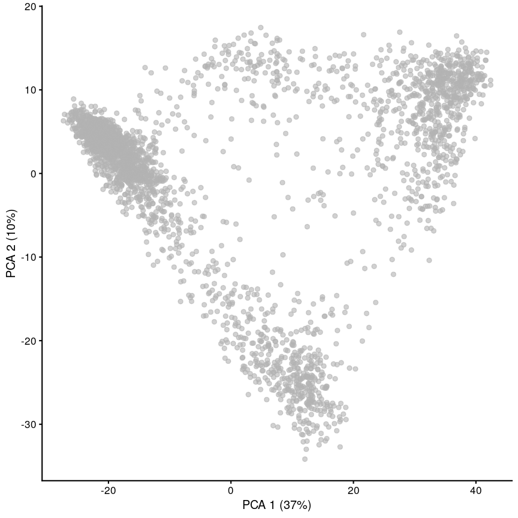

For now, we'll work with just the first two principal components, since we can
visualise those easily, and they're a quantitative
representation of the underlying data, representing the two largest axes of
variation. For speed, we'll take a random subset of 1/5 of the data.

~~~
set.seed(42)
random_ind <- sample(ncol(scrnaseq), ceiling(ncol(scrnaseq) / 5))
pcs <- reducedDim(scrnaseq, "PCA")[random_ind, 1:2]
~~~
{: .language-r}

~~~
library("mixtools")
mix_sc2 <- mvnormalmixEM(pcs)
~~~
{: .language-r}

~~~
number of iterations= 33 
~~~
{: .output}

~~~
plot(mix_sc2, 2, pch = 19, cex = 0.5)
~~~
{: .language-r}

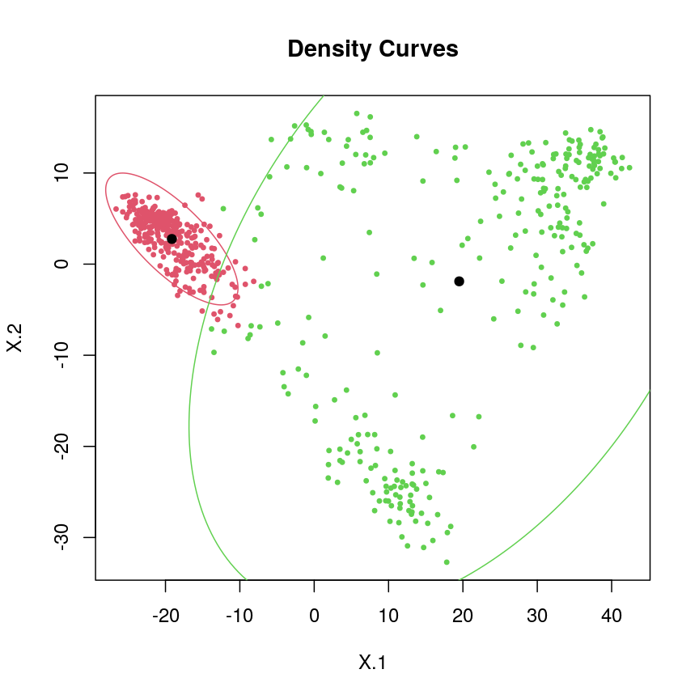

> ## Exercise
>
> Fit the same type of model with k=3. How different are the results?
> Which do you think is better? Remember to set the random seed first!
>
> Try again with k=3 without setting the seed. Is this better or worse?
> Do you think k should be increased more?
> 
> > ## Solution
> > 
> > 
> > ~~~
> > set.seed(42)
> > mix_sc3 <- mvnormalmixEM(pcs, k = 3)
> > ~~~
> > {: .language-r}
> > 
> > 
> > 
> > ~~~
> > number of iterations= 49 
> > ~~~
> > {: .output}
> > 
> > 
> > 
> > ~~~
> > plot(mix_sc3, 2, pch = 19, cex = 0.5)
> > ~~~
> > {: .language-r}
> > 
> > 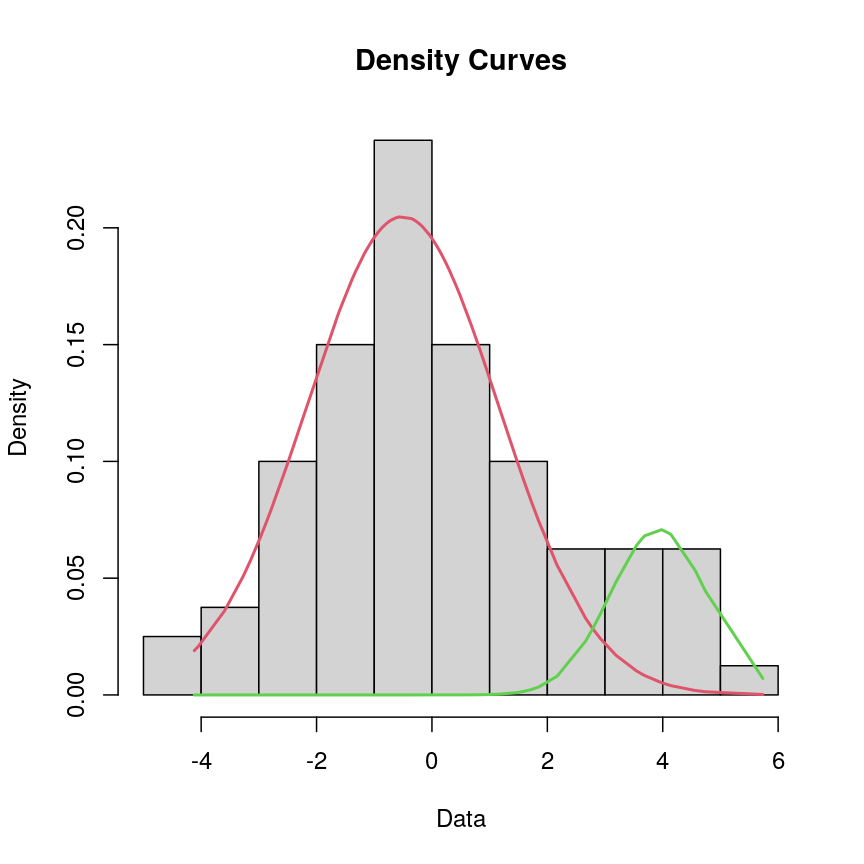
> > 
> > ~~~
> > mix_sc3_2 <- mvnormalmixEM(pcs, k = 3)
> > ~~~
> > {: .language-r}
> > 
> > 
> > 
> > ~~~
> > number of iterations= 183 
> > ~~~
> > {: .output}
> > 
> > 
> > 
> > ~~~
> > plot(mix_sc3_2, 2, pch = 19, cex = 0.5)
> > ~~~
> > {: .language-r}
> > 
> > 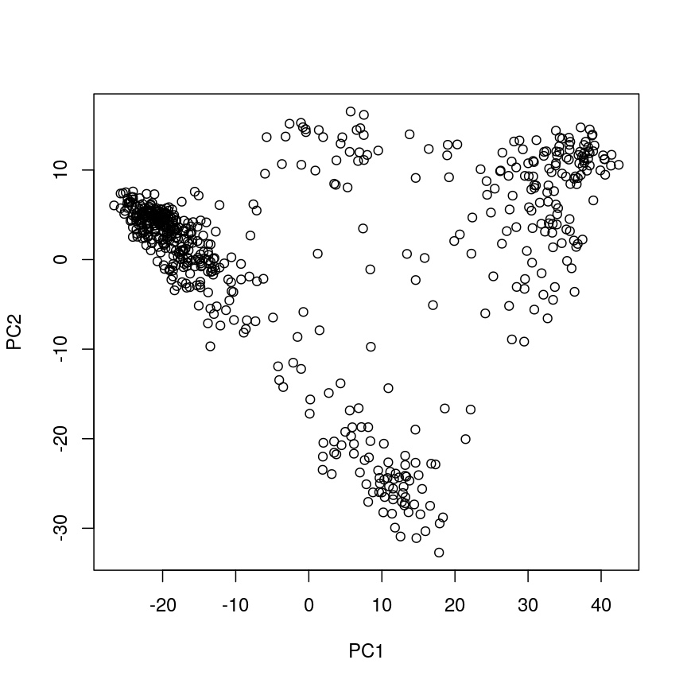
> {: .solution}
{: .challenge}

You can hopefully see that with real data, clustering can be a bit of a tricky 
business! In fact, even in two dimensions it's not entirely clear what the 
correct clustering is, nor the true number of clusters.

# Choosing K, and choosing the type of mixture

As we looked at while choosing regression models, we need to look at measures
of goodness of fit that account for model complexity. One great choice is BIC.
In the case of a mixture model just as in a 
regression model, BIC measures how well the model fits the data while
accounting for how many parameters it has. If we had a model with as many
components as we have data points, we would have a perfect fit, but that's
not very useful.

The R package [`mclust`](https://mclust-org.github.io/mclust/articles/mclust.html)
offers a lot of really useful and easy-to-use functionality for selecting a model
based on BIC.

One problem with mixture models with more than one variable is that multivariate
distributions can be computationally difficult to estimate. 
To combat this, there's a number of simplifying assumptions we can make.
For example, if our variables were totally uncorrelared, we might think that 
all our clusters were normally distributed without any correlation. 
In our case,
this clearly isn't true: there's a lot of differng shapes. 
Alternatively, we could allow the shape to vary, but assume that all clusters
have the same shape.
We could also assume that all clusters have the same amount of within-cluster
variability (meaning they are the same volume).

In this case, we're going to avoid any of these assumptions to be as flexible as
possible. This means that we're allowing the normal distributions to have 
varying shape, the shape to vary between clusters, and
the clusters to each have varying amounts of within-cluster variability.
This is encoded in the setting `modelNames = "VVV"`.

~~~
library("mclust")
pcs_12 <- reducedDim(scrnaseq, "PCA")[, 1:2]
clust <- mclustBIC(pcs_12, modelNames = "VVV")
plot(clust)
~~~
{: .language-r}

~~~
model <- Mclust(pcs_12, x = clust)
plot(model, what = "classification")
~~~
{: .language-r}

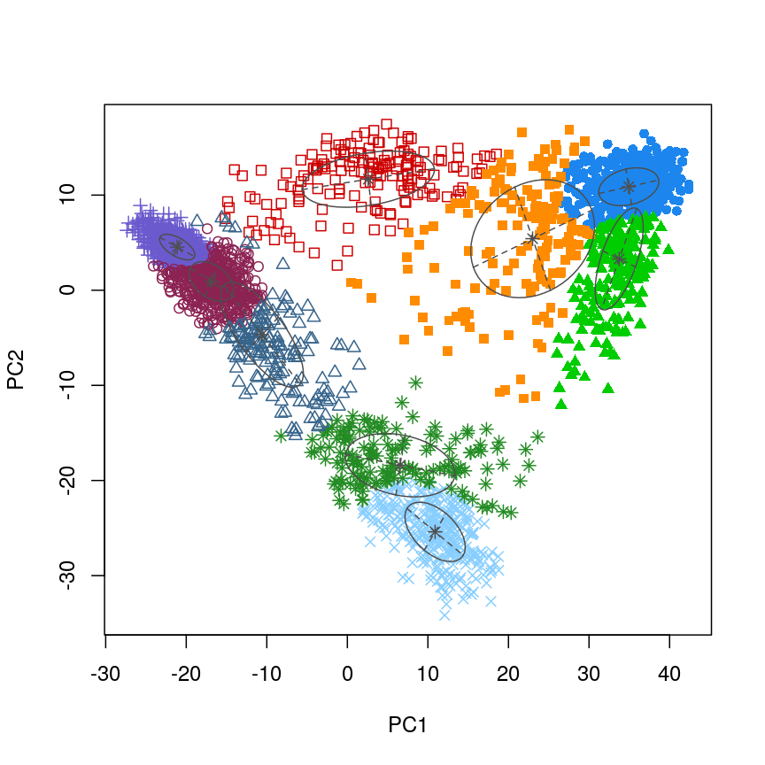

You can probably also see that for 
very high-dimensional data, the kind of assumption we made with our simulated 
data (normal distribution) can be difficult to justify. The tails of the 
clusters especially don't seem to fit a normal distribution very well, and it 
seems like a distribution with a different shape might fit a bit better here.
We'll address some of these issues in the next episode!

> ## Exercise
> 
> Run the mixture model again with all of the principal components rather
> than just the first two. Is the run time different? What about the clusters
> that come out?
> 
> *Hint: to plot the model,
> set `scrnaseq$cluster <- as.character(model$classification)`
> then plot with `plotReducedDim(scrnaseq, "PCA", colour_by = "cluster")`*
> 
> > ## Solution
> > 
> > ~~~
> > pcs_all <- reducedDim(scrnaseq, "PCA")
> > clust_all <- mclustBIC(pcs_all, modelNames = "VVV")
> > plot(clust_all)
> > ~~~
> > {: .language-r}
> > 
> > 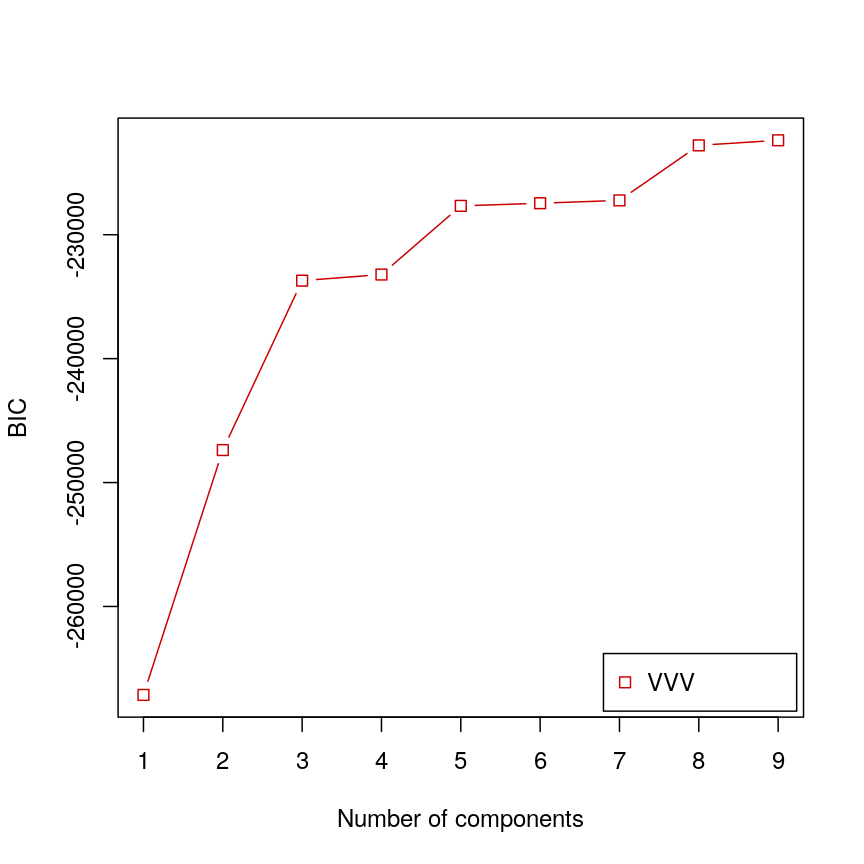
> > 
> > ~~~
> > model_all <- Mclust(pcs_all, x = clust_all)
> > scrnaseq$cluster <- as.character(model_all$classification)
> > plotReducedDim(scrnaseq, "PCA", colour_by = "cluster")
> > ~~~
> > {: .language-r}
> > 
> > 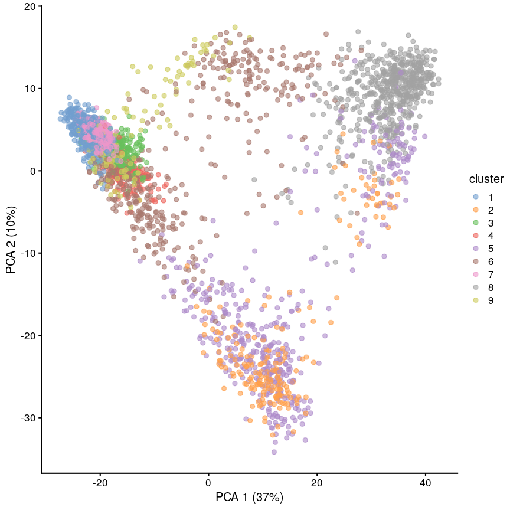
> {: .solution}
{: .challenge}

# t-SNE

t-SNE is something we've not covered in the course so far.
A high-level overview of t-SNE is that it's a method which seeks to create
a low-dimensional representation, ensuring
that points which are neighbours (close to each other) in the original 
high-dimensional data are also neighbours in the low-dimensional representation.
Like MDS, it's a stochastic algorithm and isn't quantitative in the way
that PCA is.

In contrast to PCA which we've been looking at so far,
t-SNE tends to separate the data into "blobs". This isn't 
necessarily good, and it can be easy to deceive yourself into thinking that
the blobs made in these plots have meaning that they don't really have.

~~~
scrnaseq <- runTSNE(scrnaseq, dimred = "PCA")
plotReducedDim(scrnaseq, "TSNE")
~~~
{: .language-r}

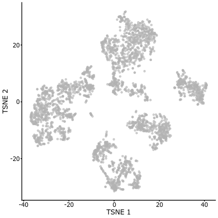

## Further reading

- https://web.stanford.edu/class/bios221/book/Chap-Mixtures.html



