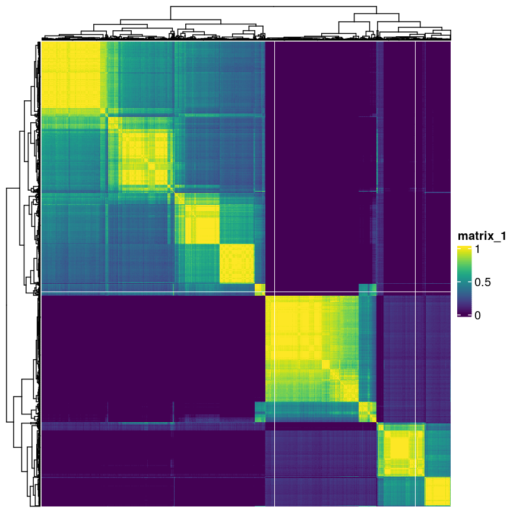

---
# Please do not edit this file directly; it is auto generated.
# Instead, please edit 09-k-means.md in _episodes_rmd/
title: "K-means"
teaching: 0
exercises: 0
questions:
- "What does clustering mean?"
- "Why would we want to find clusters in data?"
- "How can we cluster data with a model?"
- "How can we cluster data without a model?"
- "How can we check if clusters are robust?"
objectives:
- "Understand and perform clustering with K-means, mixture models, and hierarchical clustering."
- "Assess clustering performance with silhouette score and bootstrapping/consensus clustering."
keypoints:
- "KP1"
math: yes
---

# Introduction

High-dimensional data, especially in biological settings, commonly has
many sources of heterogeneity. Some of these are stochastic variation
arising from measurement error or random differences between organisms. In
some cases, this heterogeneity arises from the presence of subgroups in the
data.

~~~
library("SingleCellExperiment")
scrnaseq <- readRDS(here::here("data/scrnaseq.rds"))
set.seed(42)
~~~
{: .language-r}

~~~
library("scater")
scrnaseq <- runPCA(scrnaseq, ncomponents = 15)
scrnaseq <- runTSNE(scrnaseq, dimred = "PCA")
~~~
{: .language-r}

# Choosing the correct clustering

When doing clustering, it's important to realise that data may seem to
group together randomly. It's especially important to remember that when making
plots that add extra visual aids to distinguish clusters. For example, if we
cluster data from a single 2D normal distribution and draw ellipses around the
points, it suddenly is almost visually convincing. This is a somewhat extreme
example, since there is genuinely no heterogeneity in the data, but

# K-means

K-means is an iterative algorithm a bit like the EM algorithm we covered in
the previous lesson. However, in K-means we're not concerned with fitting
distributions to the data. We are only interested in distances.

In K-means, we pick $k$ initial points as centres or "centroids" of our
clusters. There are a few ways to choose these initial "centroids",
but for simplicity let's imagine we just pick three random co-ordinates.
We then check the distance between each centroid and

Distance????

> ## Initialisation
> 
> Random initialisations can be bad.
> 
{: .callout}

~~~
cluster <- kmeans(reducedDim(scrnaseq), centers = 7, iter.max = 1000, nstart = 100)
scrnaseq$kmeans <- as.character(cluster$cluster)

plotReducedDim(scrnaseq, "TSNE", colour_by = "kmeans")
~~~
{: .language-r}

> ## k-medioids (PAM)
> 
> This is like k-means but using the median instead of mean. Median is slower
> but more robust.
>
> 
{: .callout}

# Cluster robustness (silhouette)

We want to be sure that

# Consensus clustering

~~~
library("scater")
library("pheatmap")
library("bluster")
library("viridis")

pc <- reducedDim(scrnaseq)
km_fun <- function(x) {
    kmeans(x, 5)$cluster
}
originals <- km_fun(pc)
ratios <- bootstrapStability(pc, FUN = km_fun, clusters = originals)
pheatmap(ratios,
    cluster_row = FALSE, cluster_col = FALSE,
    color = viridis::magma(100),
    breaks = seq(-1, 1, length.out = 101)
)
~~~
{: .language-r}

## Further reading

- https://web.stanford.edu/class/bios221/book/Chap-Clustering.html



