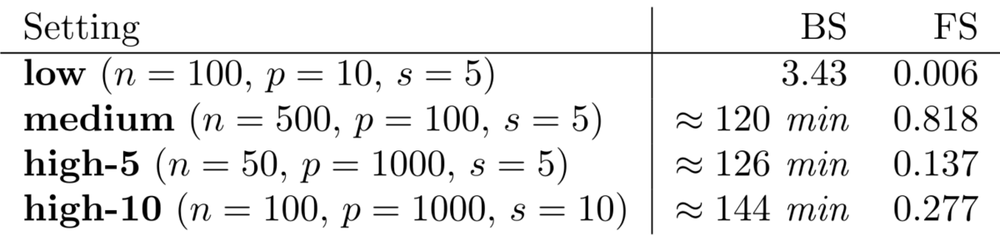

```{r settings, include=FALSE}
library("here")
source(here("bin/chunk-options.R"))
knitr_fig_path("03-")
```

# Intro

First, let's read in the data from the last lesson.


```{r loadmethy}
library("here")
library("minfi")
if (!file.exists(here("data/methylation.rds"))) {
    source(here("data/methylation.R"))
}
methylation <- readRDS(here("data/methylation.rds"))

methyl_mat <- t(assay(methylation))
age <- methylation$Age
```

# Why would we want to do feature selection?

In the previous lesson we did a kind of feature selection by doing
univariate analysis and thresholding by p-value/effect size.


However we might think there's some combination of methylation features
that combined explain age. For example, if we want to be able to predict age 
from methylation, that's a lot easier if we figure out what the contribution
of each feature is conditional on all others, rather than independent of
all others.

$$
    y_j = \beta_0 + \beta_1 X_1 + \dots \beta_p X_p + \epsilon_j
$$

However when the number of predictors is greater than the number of samples
(basically always true in genetics) it isn't possible to include everything!

What happens if we try to fit a model here?

```{r fitall, R.options=list(max.print=20)}
fit <- lm(age ~ methyl_mat)
summary(fit)
```

So we can't do that mathematically, we have to find another way.

# Screening

What people sometimes do is to select variables based on correlation with
the outcome, or using a univariate modelling approach like we used in the 
previous lesson.
There's some problems with this! First, the p-values we get out of the final
model are meaningless because we're basically doing a 2-stage model and only
reporting one set of p-values (ignoring all the non-significant ones).
Secondly, we're likely to select a bunch of features that all have the same 
information!

```{r screening}
nvar <- 1000
nobs <- 100
y_synth <- rnorm(nobs)
synth_mat <- matrix(rnorm(nobs * nvar), nrow = nobs, ncol = nvar)
cors <- apply(synth_mat, 2, function(col) cor(col, y_synth))
X_pred <- synth_mat[, abs(cors) > quantile(abs(cors), 0.99)]
summary(lm(y_synth ~ ., data = as.data.frame(X_pred)))
```

Amazing, the results are highly significant! However this isn't rigorous and
can lead to problems so don't do it!


# Best subset selection

However, we could imagine trying each combination of features to find which
is the best combination. This works, but is really computationally demanding,
because blah blah number of permutations probably $p!$ but need to check.


```{r bestsub}
library("leaps")
small_methyl <- methyl_mat[, 1:10]
fit_all <- regsubsets(x = small_methyl, y = age, really.big = TRUE)
summ <- summary(fit_all)
coef(fit_all, which.min(summ$rss))
```

Let's try running BS on the full dataset.

```{r bestsub_all, eval = FALSE}
fit_all <- regsubsets(x = methyl_mat, y = age, really.big = TRUE)
summ <- summary(fit_all)
coef(fit_all, which.min(summ$rss))
```

This doesn't really work in a reasonable time because of the number of possible
combinations!

```{r bstab, echo = FALSE, out.width="500px"}

```

Figure taken from [Hastie et al. (2020)](https://www.stat.cmu.edu/~ryantibs/papers/bestsubset.pdf),
published [here](https://doi.org/10.1214/19-STS733).


# Model metrics

In the example above we used RSS (residual sum of squares) to choose a model.
However when comparing models with different numbers of features, this is
problematic. We could, for example, keep adding features that marginally 
reduce the RSS (because adding a feature will never make it worse!) and
under this framework we'll always select the biggest model.

For example, if we have as many features as observations, the fit is always
perfect.

```{r perfectfit}
nvar <- 100
nobs <- 100
y_synth <- rnorm(nobs)
X_synth <- matrix(rnorm(nobs * nvar), nrow = nobs, ncol = nvar)
fit <- lm(y_synth ~ 0 + ., data = as.data.frame(X_synth))
sum(residuals(fit)^2)
```

There are other ways to measure model performance while accounting for the
complexity of the model. For example, adjusted $R^2$ is similar to the normal
R^2 measure that estimates the variation explained by the model, while also
accounting for the number of features. This is explained
in more detail in [the multiple regression lesson](https://carpentries-incubator.github.io/multiple-linear-regression-public-health/)

BIC and AIC also exist. There's also an issue of how well these things
will generalise beyond the present dataset.

> ## Exercise
>
> Select the best model based on BIC. How does this differ to the best RSS 
> model?
> 
> > ## Solution
> > 
> > 
> > ```{r selbic}
> > coef(fit_all, id = which.min(summ$bic))
> > coef(fit_all, id = which.min(summ$rss))
> > ```
> {: .solution}
{: .challenge}


# Forward stepwise selection

Since BS is computationally hard, we can instead do an approximation.
One of these is forward stepwise selection.

Basically:

1. pick the most significant feature
2. fit a model with that feature and every other
3. if any are a significant improvement, pick the model that has the best improvement
   and return to 2.
4. otherwise stop

Here we apply it to a synthetic methylation dataset where we know the true
predictors.

```{r forwardsyn}
## challenge 4: forward selection
## compare with true betas
if (!file.exists(here("data/synthetic.rds"))) {
  source(here("data/synthetic.R"))
}
synthetic <- readRDS(here("data/synthetic.rds"))

synth_mat <- t(assay(synthetic))
synth_age <- synthetic$age

fit_forward <- regsubsets(x = synth_mat, y = synth_age, method = "forward")
summ_forward <- summary(fit_forward)
est_coef_fwd <- coef(fit_forward, id = which.min(summ_forward$bic))
true_coefs <- rowData(synthetic)[names(est_coef_fwd)[-1], "true_beta"]
true_coefs
est_coef_fwd

all_coefs <- c(true_coefs, est_coef_fwd[-1])
plot(true_coefs, est_coef_fwd[-1], xlim = range(all_coefs), ylim = range(all_coefs))
abline(0, 1)
abline(v = 0, lty = "dashed", col = "firebrick")
abline(h = 0, lty = "dashed", col = "firebrick")
```


> ## Exercise
> Perform forward subset selection on the methylation data.
> 
> Check the BICs. Select the best model based on BIC.
>
> > ## Solution
> > 
> > ```{r forward}
> > ## challenge 4: forward selection
> > fit_forward <- regsubsets(x = methyl_mat, y = age, method = "forward")
> > summ_forward <- summary(fit_forward)
> > est_coef_fwd <- coef(fit_forward, id = which.min(summ_forward$bic))
> > est_coef_fwd
> > ```
> > 
> {: .solution}
{: .challenge}


# Reverse stepwise selection

If we have a model that we think is real and we want to slim it down, we
can do reverse subset selection.

`methylclock::coefHorvath` is the Horvath methylation age predictor
[Horvath (2013)](https://pubmed.ncbi.nlm.nih.gov/24138928/).


> ## Exercise
> 
> Do reverse subset selection and compare with the forward and reverse model.
> 
> > ## Solution
> >
> > ```{r reverse}
> > features <- methylclock::coefHorvath$CpGmarker
> > features <- intersect(features, colnames(methyl_mat))
> > methyl_horvath <- methyl_mat[, features[1:30]]
> > 
> > ## note about backward/both, not a challenge
> > fit_back <- regsubsets(x = methyl_horvath, y = age, method = "backward")
> > summ_back <- summary(fit_back)
> > 
> > summ_back$bic
> > est_coef_back <- coef(fit_back, id = which.min(summ_back$bic))
> > true_coef <- setNames(
> >   methylclock::coefHorvath$CoefficientTraining,
> >   methylclock::coefHorvath$CpGmarker
> > )
> > plot(est_coef_back[-1], true_coef[names(est_coef_back)[-1]])
> > abline(0, 1)
> > abline(v = 0, lty = "dashed", col = "firebrick")
> > abline(h = 0, lty = "dashed", col = "firebrick")
> > 
> > names(est_coef_back[-1])
> > names(est_coef_fwd[-1])
> > intersect(names(est_coef_back[-1]), names(est_coef_fwd[-1]))
> > ```
> {: .solution}
{: .challenge}

```{r, eval=FALSE, echo=FALSE}
xy <- cbind(age = age, methyl_horvath)
all <- lm(age ~ . + 0, data = as.data.frame(xy))
backward <- step(
    all,
    scope = formula(all),
    direction = "backward",
    trace = 0
)
backward$anova
# plot(coef(backward), beta[names(coef(backward))])
# abline(0, 1)
# abline(v = 0, lty = "dashed", col = "firebrick")
# abline(h = 0, lty = "dashed", col = "firebrick")
```



