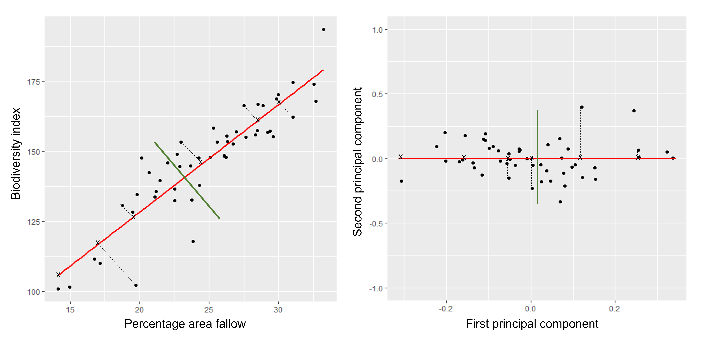

```{r settings, include=FALSE}
library("here")
source(here("bin/chunk-options.R"))
knitr_fig_path("05-")
```


# Introduction

Imagine a dataset which contains many variables ($p$), close to the total number
of rows in the dataset ($n$). Some of these variables are highly correlated and
several form groups which you might expect to represent the same overall effect.
Such datasets are challenging to analyse for several reasons, with the main
problem being how to reduce dimensionality in the dataset while retaining the
important features. 

In this episode we will explore *principal component analysis* (PCA) as a
popular method of analysing high-dimensional data. PCA is an unsupervised
statistical method which allows large datasets of correlated variables to be
summarised into smaller numbers of uncorrelated principal components that
explain most of the variability in the original dataset. This is useful,
for example, during initial data exploration as it allows correlations among
data points to be observed and principal components to be calculated for
inclusion in further analysis (e.g. linear regression). An example of PCA might
be reducing several variables representing aspects of patient health
(blood pressure, heart rate, respiratory rate) into a single feature.


# Advantages and disadvantages of PCA

Advantages:
* It is a relatively easy to use and popular method. 
* Various software/packages are available to run a PCA.
* The calculations used in a PCA are easy to understand for statisticians and
  non-statisticians alike.

Disadvantages:
* It assumes that variables in a dataset are correlated.
* It is sensitive to the scale at which input variables are measured.
  If input variables are measured at different scales, the variables
  with large variance relative to the scale of measurement will have
  greater impact on the principal components relative to variables with smaller
  variance. In many cases, this is not desirable.
* It is not robust against outliers, meaning that very large or small data
  points can have a large effect on the output of the PCA.
* PCA assumes a linear relationship between variables which is not always a
  realistic assumption.
* It can be difficult to interpret the meaning of the principal components,
  especially when including them in further analyses (e.g. inclusion in a linear
  regression).


> ## Supervised vs unsupervised learning
> Most statistical problems fall into one of two categories: supervised or
> unsupervised learning. 
> Examples of supervised learning problems include linear regression and include
> analyses in which each observation has both at least one independent variable
> ($x$) as well as a dependent variable ($y$). In supervised learning problems
> the aim is to predict the value of the response given future observations or
> to understand the relationship between the dependent variable and the
> predictors. In unsupervised learning for each observation there is no
> dependent variable ($y$), but only 
> a series of independent variables. In this situation there is no need for
> prediction, as there is no dependent variable to predict (hence the analysis
> can be thought as being unsupervised by the dependent variable). Instead
> statistical analysis can be used to understand relationships between the
> independent variables or between observations themselves. Unsupervised
> learning problems often occur when analysing high-dimensional datasets in
> which there is no obvious dependent variable to be
> predicted, but the analyst would like to understand more about patterns
> between groups of observations or reduce dimensionality so that a supervised
> learning process may be used.
{: .callout}


> ## Challenge 1 
> 
> Descriptions of three datasets and research questions are given below. For
> which of these might PCA be considered a useful tool for analysing data so
> that the research questions may be addressed?
> 
> 1. An epidemiologist has data collected from different patients admitted to
>    hospital with infectious respiratory disease. They would like to determine
>    whether length of stay in hospital differs in patients with different
>    respiratory diseases.
> 2. An online retailer has collected data on user interactions with its online
>    app and has information on the number of times each user interacted with
>    the app, what products they viewed per interaction, and the type and cost
>    of these products. The retailer would like to use this information to
>    predict whether or not a user will be interested in a new product.
> 3. A scientist has assayed gene expression levels in 1000 cancer patients and
>    has data from probes targeting different genes in tumour samples from
>    patients. She would like to create new variables representing relative
>    abundance of different groups of genes to i) find out if genes form
>    subgroups based on biological function and ii) use these new variables
>    in a linear regression examining how gene expression varies with disease
>    severity.
> 4. All of the above.
> 
> > ## Solution
> > 
> >
> > In the first case, a regression model would be more suitable; perhaps a
> > survival model.
> > In the second, again a regression model, likely linear or logistic, would
> > be more suitable.
> > In the third example, PCA can help to identify modules of correlated
> > features that explain a large amount of variation within the data.
> >
> > Therefore the answer here is 3.
> {: .solution}
{: .challenge}


# What is a principal component?


```{r, eval=FALSE, echo=FALSE}
# A PCA is carried out by calculating a matrix of Pearson's correlations from
# the original dataset which shows how each of the variables in the dataset
# relate to each other.
```

The first principal component is the direction of the data along which the
observations vary the most. The second principal component is the direction of
the data along which the observations show the next highest amount of variation.
For example, Figure 1 shows biodiversity index versus percentage area left
fallow for 50 farms in southern England. The red line represents the first
principal component direction of the data, which is the direction along which
there is greatest variability in the data. Projecting points onto this line
(i.e. by finding the location on the line closest to the point) would give a
vector of points with the greatest possible variance. The next highest amount
of variability in the data is represented by the line perpendicular to first
regression line which represents the second principal component (green line).

The second principal component is a linear combination of the variables that
is uncorrelated with the first principal component. There are as many principal
components as there are variables in your dataset, but as we'll see, some are
more useful at explaining your data than others. By definition, the first
principal component explains more variation than other principal components.

```{r fig1, echo=FALSE, fig.cap="Cap", fig.alt="Alt"}
# 

```

The animation below illustrates how principal components are calculated from
data. You can imagine that the black line is a rod and each red dashed line is
a spring. The energy of each spring is proportional to its squared length. The
direction of the first principal component is the one that minimises the total
energy of all of the springs. In the animation below, the springs pull the rod,
finding the direction of the first principal component when they reach
equilibrium. We then use the length of the springs from the rod as the first
principal component.
This is explained in more detail on [this Q&A website](https://stats.stackexchange.com/questions/2691/making-sense-of-principal-component-analysis-eigenvectors-eigenvalues).

```{r pendulum, echo=FALSE, fig.cap="Cap", fig.alt="Alt"}
knitr::include_graphics("../fig/pendulum.gif")
```


The first principal component's scores ($Z_1$) are calculated using the equation:

$$  
  Z_1 = a_{11}X_1 + a_{21}X_2 +....+a_{p1}X_p
$$

$X_1...X_p$ represents variables in the original dataset and $a_{11}...a_{p1}$
represent principal component loadings, which can be thought of as the degree to
which each variable contributes to the calculation of the principal component.
We will come back to principal component scores and loadings further below.

# How do we perform a PCA?

## A prostate cancer dataset

The `prostate` dataset represents data from 97
men who have prostate cancer. The data come from a study which examined the
correlation between the level of prostate specific antigen and a number of
clinical measures in men who were about to receive a radical prostatectomy.
The data have 97 rows and 9 columns.

Columns include:
- `lcavol` (log-transformed cancer volume),
- `lweight` (log-transformed prostate weight),
- `lbph` (log-transformed amount of benign prostate enlargement),
- `svi` (seminal vesicle invasion),
- `lcp` (log-transformed capsular penetration; amount of spread of cancer in
   outer walls of prostate),
- `gleason` (Gleason score; grade of cancer cells),
- `pgg45` (percentage Gleason scores 4 or 5),
- `lpsa` (log-tranformed prostate specific antigen; level of PSA in blood).
- `age` (patient age in years).

Here we will calculate principal component scores for each of the rows in this
dataset, using five principal components (one for each variable included in the
PCA). We will include five clinical variables in our PCA, each of the continuous
variables in the prostate dataset, so that we can create fewer variables
representing clinical markers of cancer progression. Standard PCAs are carried
out using continuous variables only.

First, we will examine the `prostate` dataset (originally part of the
**`lasso2`** package):

```{r prostate-load}
prostate <- readRDS(here("data/prostate.rds"))
```

```{r prostate-head}
head(prostate)
```

Note that each row of the dataset represents a single patient.

We will create a subset of the data including only the clinical variables we
want to use in the PCA.

```{r pros2}
pros2 <- prostate[, c("lcavol", "lweight", "lbph", "lcp", "lpsa")]
head(pros2)
```

## Do we need to standardise the data?

Now we compare the variances between variables in the dataset.

```{r var-hist, fig.cap="Caption", fig.cap="Alt"}
apply(pros2, 2, var)
par(mfrow = c(1, 2))
hist(pros2$lweight, breaks = "FD")
hist(pros2$lbph, breaks = "FD")
```

Note that variance is greatest for `lbph` and lowest for `lweight`. It is clear
from this output that we need to scale each of these variables before including
them in a PCA analysis to ensure that differences in variances between variables
do not drive the calculation of principal components. In this example we
standardise all five variables to have a mean of 0 and a standard
deviation of 1. 


> ## Challenge 2
> 
> 
> Why might it be necessary to standardise variables before performing a PCA?  
> Can you think of datasets where it might not be necessary to standardise
> variables?
> Discuss.
> 
> 1. To make the results of the PCA interesting.
> 2. If you want to ensure that variables with different ranges of values
>    contribute equally to analysis.
> 3. To allow the feature matrix to be calculated faster, especially in cases
>    where there are a lot of input variables.
> 4. To allow both continuous and categorical variables to be included in the PCA.
> 5. All of the above.
> 
> > ## Solution
> > 
> > 2.
> > Scaling the data isn't guaranteed to make the results more interesting.
> > It also won't affect how quickly the output will be calculated, whether
> > continuous and categorical variables are present or not.
> > 
> > It is done to ensure that all features have equal weighting in the resulting
> > PCs.
> > 
> > You may not want to standardise datasets which contain continuous variables
> > all measured on the same scale (e.g. gene expression data or RNA sequencing
> > data). In this case, variables with very little sample-to-sample variability
> > may represent only random noise, and standardising the data would give
> > these extra weight in the PCA.
> > 
> {: .solution}
{: .challenge}

Next we will carry out a PCA using the `prcomp()` function in base R. The input
data (`pros2`) is in the form of a matrix. Note that the `scale = TRUE` argument
is used to standardise the variables to have a mean 0 and standard deviation of
1.

```{r prcomp}
pca.pros <- prcomp(pros2, scale = TRUE, center = TRUE)
pca.pros
```

# How many principal components do we need?

We have calculated one principal component for each variable in the original
dataset. How do we choose how many of these are necessary to represent the true
variation in the data, without having extra components that are unnecessary?

Let's look at the relative importance of each component using `summary`.

```{r summ}
summary(pca.pros)
```

```{r, echo = FALSE}
# Get proportions of variance explained by each PC (rounded to 2 DP)
prop.var <- round(summary(pca.pros)$importance["Proportion of Variance", ], 2) *
  100
```

This returns the proportion of variance in the data explained by each of the
(p = 5) principal components. In this example, PC1 explains approximately
`r prop.var[[1]]`% of variance in the data, PC2 `r prop.var[[2]]`% of variance,
PC3 a further `r prop.var[[3]]`%, PC4 approximately `r prop.var[[4]]`% and PC5
around `r prop.var[[5]]`%.

Let us visualise this. A plot of the amount of variance accounted for by each PC
is also called a scree plot. Note that the amount of variance accounted for by a principal
component is also called eigenvalue and thus the y-axis in scree plots if often
labelled “eigenvalue”.

Often, scree plots show a characteristic pattern where initially, the variance drops
rapidly with each additional principal component. But then there is an “elbow” after which the
variance decreases more slowly. The total variance explained up to the elbow point is sometimes
interpreted as structural variance that is relevant and should be retained versus noise
which may be discarded after the elbow. 


```{r varexp}
# calculate variance explained
varExp <- (pca.pros$sdev^2) / sum(pca.pros$sdev^2) * 100
# calculate percentage variance explained using output from the PCA
varDF <- data.frame(Dimensions = 1:length(varExp), varExp = varExp)
# create new dataframe with five rows, one for each principal component
```

```{r vardf-plot, fig.cap="Caption", fig.cap="Alt"}
plot(varDF)
```

The screeplot shows that the first principal component explains most of the
variance in the data (>50%) and each subsequent principal component explains
less and less of the total variance. The first two principal components
explain >70% of variance in the data. But what do these two principal
components mean?


## What are loadings and principal component scores?

Most PCA functions will produce two main output matrices: the
*principal component scores* and the *loadings*. The matrix of principal component scores
has as many rows as there were observations in the input matrix. These
scores are what is usually visualised or used for down-stream analyses.
The matrix of loadings (also called rotation matrix) has as many rows as there
are features in the original data. It contains information about how the
(usually centered and scaled) original data relate to the PC scores.

When calling a PCA object generated with `prcomp()`, the loadings are printed by default:

```{r pca-pros}
pca.pros
```

The principal component scores are obtained by carrying out matrix multiplication of the
(usually centered and scaled) original data times the loadings. The following
callout demonstrates this.

> ## Computing a PCA "by hand"
> The rotation matrix obtained in a PCA is identical to the eigenvectors
> of the covariance matrix of the data. Multiplying these with the (centered and scaled)
> data yields the PC scores:
> ```{r pca-by-hand}
> pros2.scaled <- scale(pros2) # centre and scale the Prostate data
> pros2.cov <- cov(pros2.scaled)   #generate covariance matrix
> pros2.cov
> pros2.eigen <- eigen(pros2.cov) # preform eigen decomposition
> pros2.eigen # The slot $vectors = rotation of the PCA
> # generate PC scores by by hand, using matrix multiplication
> my.pros2.pcs <- pros2.scaled %*% pros2.eigen$vectors
> # compare results
> par(mfrow=c(1,2))
> plot(pca.pros$x[,1:2], main="prcomp()")
> abline(h=0, v=0, lty=2)
> plot(my.pros2.pcs[,1:2], main="\"By hand\"", xlab="PC1", ylab="PC2")
> abline(h=0, v=0, lty=2)
> par(mfrow=c(1,1))
> # Note that the axis orientations may be swapped but the relative positions of the dots should be the same in both plots.
> ```
{: .callout}


One way to visualise how principal components relate to the original variables
is by creating a biplot. Biplots usually show two principal components plotted
against each other. Observations are sometimes labelled with numbers. The
contribution of each original variable to the principal components displayed
is then shown by arrows (generated from those two columns of the rotation matrix that
correspond to the principal components shown). NB, there are several biplot
implementations in different R libraries. It is thus a good idea to specify
the desired package when calling `biplot()`. A biplot of the first two principal
components can be generated as follows:

```{r stats-biplot, fig.cap="Caption", fig.cap="Alt"}
stats::biplot(pca.pros, xlim = c(-0.3, 0.3))
```

This biplot shows the position of each patient on a 2-dimensional plot where
loadings can be observed via the red arrows associated with each of
the variables. The variables `lpsa`, `lcavol` and `lcp` are associated with
positive values on PC1 while positive values on PC2 are associated with the
variables `lbph` and `lweight`. The length of the arrows indicates how much
each variable contributes to the calculation of each principal component.

The left and bottom axes show normalised principal component scores. The axes
on the top and right of the plot are used to interpret the loadings, where
loadings are scaled by the standard deviation of the principal components
(`pca.pros$sdev`) times the square root the number of observations.

Finally, you need to know that PC scores and rotations may have different slot names, 
depending on the PCA implementation you use. Here are some examples:

| library::command()| PC scores | Loadings |
|-------------------|-----------|----------|
| stats::prcomp()   | $x         | $rotation |
| stats::princomp() | $scores    | $loadings | 
| PCAtools::pca()   | $rotated   | $loadings | 


# Using PCA to analyse gene expression data 

In this section you will carry out your own PCA using the Bioconductor package **`PCAtools`** 
applied to gene expression data to explore the topics covered above. 
**`PCAtools`** provides functions that can be used to explore data via PCA and
produce useful figures and analysis tools. The package is made for the somewhat unusual
Bioconductor style of data tables (observations in columns, features in rows). When
using Bioconductor data sets and **`PCAtools`**, it is thus not necessary to transpose the data.

##  A gene expression dataset of cancer patients

The dataset we will be analysing in this lesson includes two subsets of data: 
* a matrix of gene expression data showing microarray results for different
  probes used to examine gene expression profiles in 91 different breast
  cancer patient samples.
* metadata associated with the gene expression results detailing information
  from patients from whom samples were taken.

Let's load the **`PCAtools`** package and the data.

```{r pcatools}
library("PCAtools")
```

We will first load the microarray breast cancer gene expression data and
associated metadata, downloaded from the
[Gene Expression Omnibus](https://www.ncbi.nlm.nih.gov/geo/query/acc.cgi?acc=GSE2990).

```{r se}
library("SummarizedExperiment")
cancer <- readRDS(here::here("data/cancer_expression.rds"))
mat <- assay(cancer)
metadata <- colData(cancer)
```

```{r mat, eval=FALSE}
View(mat)
#nrow=22215 probes
#ncol=91 samples
```

```{r meta, eval=FALSE}
View(metadata)
#nrow=91
#ncol=8
```

```{r colnames}
all(colnames(mat) == rownames(metadata))
#Check that column names and row names match
#If they do should return TRUE
```


The 'mat' variable contains a matrix of gene expression profiles for each sample.
Rows represent gene expression measurements and columns represent samples. The
'metadata' variable contains the metadata associated with the gene expression
data including the name of the study from which data originate, the age of the
patient from which the sample was taken, whether or not an oestrogen receptor
was involved in their cancer and the grade and size of the cancer for each
sample (represented by rows).

Microarray data are difficult to analyse for several reasons. Firstly, 
they are typically high-dimensional and therefore are subject to the same
difficulties associated with analysing high dimensional data outlined above
(i.e. *p*>*n*, large numbers of rows, multiple possible response variables,
curse of dimensionality). Secondly, formulating a research question using
microarray data can be difficult, especially if not much is known a priori
about which genes code for particular phenotypes of interest. Finally,
exploratory analysis, which can be used to help formulate research questions
and display relationships, is difficult using microarray data due to the number
of potentially interesting response variables (i.e. expression data from probes
targeting different genes).

If researchers hypothesise that groups of genes (e.g. biological pathways) may
be associated with different phenotypic characteristics of cancers (e.g.
histologic grade, tumour size), using statistical methods that reduce the
number of columns in the microarray matrix to a smaller number of dimensions
representing groups of genes would help visualise the data and address
research questions regarding the effect different groups of genes have on
disease progression.

Using the **`PCAtools`** we will apply a PCA to the cancer
gene expression data, plot the amount of variation in the data explained by
each principal component and plot the most important principal components
against each other as well as understanding what each principal component
represents.


> ## Challenge 3
> 
> Apply a PCA to the cancer gene expression data using the `pca()` function from
> **`PCAtools`**. You can use the help files in PCAtools to find out about the `pca()`
> function (type `help("pca")` or `?pca` in R).
> 
> Let us assume we only care about the principal components accounting for the top
> 80% of the variance in the dataset. Use the `removeVar` argument in `pca()` to remove
> the PCs accounting for the bottom 20%.
> 
> As in the example using prostate data above, examine the first 5 rows and
> columns of rotated data and loadings from your PCA.
> 
> > ## Solution
> > 
> > ```{r pca-ex}
> > pc <- pca(mat, metadata = metadata)
> > #Many PCs explain a very small amount of the total variance in the data
> > #Remove the lower 20% of PCs with lower variance
> > pc <- pca(mat, metadata = metadata, removeVar = 0.2)
> > #Explore other arguments provided in pca
> > pc$rotated[1:5, 1:5]
> > pc$loadings[1:5, 1:5]
> > 
> > which.max(pc$loadings[, 1])
> > pc$loadings[49, ]
> > 
> > which.max(pc$loadings[, 2])
> > pc$loadings[27, ]
> > ```
> > The function `pca()` is used to perform PCA, and uses as inputs a matrix
> > (`mat`) containing continuous numerical data
> > in which rows are data variables and columns are samples, and `metadata`
> > associated with the matrix in which rows represent samples and columns
> > represent data variables. It has options to centre or scale the input data
> > before a PCA is performed, although in this case gene expression data do
> > not need to be transformed prior to PCA being carried out as variables are
> > measured on a similar scale (values are comparable between rows). The output
> > of the `pca()` function includes a lot of information such as loading values
> > for each variable (`loadings`), principal component scores (`rotated`)
> > and the amount of variance in the data
> > explained by each principal component.
> > 
> > Rotated data shows principal
> > component scores for each sample and each principal component. Loadings
> > the contribution each variable makes to each principal component. 
> {: .solution}
{: .challenge}

> ## Scaling variables for PCA
>
> When running `pca()` above, we kept the default setting, `scale=FALSE`. That means genes with higher variation in
> their expression levels should have higher loadings, which is what we are interested in.
> Whether or not to scale variables for PCA will depend on your data and research question.  
>
> Note that this is different from normalising gene expression data. Gene expression
> data have to be normalised before donwstream analyses can be
> carried out. This is to reduce to effect technical and other potentially confounding
> factors. We assume that the expression data we use had been noralised previously.
{: .callout}

## Choosing how many components are important to explain the variance in the data

As in the example using the `prostate` dataset we can use a screeplot to
compare the proportion of variance in the data explained by each principal
component. This allows us to understand how much information in the microarray
dataset is lost by projecting the observations onto the first few principal
components and whether these principal components represent a reasonable
amount of the variation. The proportion of variance explained should sum to one.

There are no clear guidelines on how many principal components should be
included in PCA: your choice depends on the total variability of the data and
the size of the dataset. We often look at the 'elbow’ on the screeplot as an
indicator that the addition of principal components does not drastically
contribute to explain the remaining variance or choose an arbitory cut off for
proportion of variance explained.

> ## Challenge 4
> 
> Using the `screeplot()` function in **`PCAtools`**, create a screeplot to show 
> proportion of variance explained by each principal component. Explain the
> output of the screeplot in terms of proportion of variance in data explained
> by each principal component.
> 
> > ## Solution
> > 
> > ```{r scree-ex, fig.cap="Caption", fig.cap="Alt"}
> > screeplot(pc, axisLabSize = 5, titleLabSize = 8)
> > ```
> > Note that first principal component (PC1) explains more variation than
> > other principal components (which is always the case in PCA). The screeplot
> > shows that the first principal component only explains ~33% of the total
> > variation in the micrarray data and many principal components explain very 
> > little variation. The red line shows the cumulative percentage of explained
> > variation with increasing principal components. Note that in this case 18
> > principal components are needed to explain over 75% of variation in the
> > data. This is not an unusual result for complex biological datasets
> > including genetic information as clear relationships between groups are
> > sometimes difficult to observe in the data. The screeplot shows that using
> > a PCA we have reduced 91 predictors to 18 in order to explain a significant
> > amount of variation in the data. See additional arguments in screeplot
> > function for improving the appearance of the plot.
> {: .solution}
{: .challenge}

## Investigating the principal components 

Once the most important principal components have been identified using
`screeplot()`, these can be explored in more detail by plotting principal components
against each other and highlighting points based on variables in the metadata.
This will allow any potential clustering of points according to demographic or
phenotypic variables to be seen.

We can use biplots to look for patterns in the output from the PCA. Note that there
are two functions called `biplot()`, one in the package **`PCAtools`** and one in
**`stats`**. Both functions produce biplots but their scales are different!


> ## Challenge 5
> 
> Create a biplot of the first two principal components from your PCA
> using `biplot()` function in **`PCAtools`**. See `help("PCAtools::biplot")` for
> arguments and their meaning. For instance, `lab` or `colBy` may be useful.
> 
> Examine whether the data appear to form clusters. Explain your results.
> 
> > ## Solution
> > 
> > ```{r biplot-ex, fig.cap="Caption", fig.cap="Alt"}
> > biplot(pc, lab = NULL, colby = 'Grade', legendPosition = 'top')
> > ```
> > The biplot shows the position of patient samples relative to PC1 and PC2
> > in a 2-dimensional plot. Note that two groups are apparent along the PC1
> > axis according to expressions of different genes while no separation can be
> > seem along the PC2 axis. Labels of patient samples are automatically added
> > in the biplot. Labels for each sample are added by default, but can be
> > removed if there is too much overlap in names. Note that **`PCAtools`** does
> > not scale biplot in the same way as biplot using the stats package.
> {: .solution}
{: .challenge}

Let's consider this biplot in more detail, and also display the loadings:


> ## Challenge 6
> 
> Use `colby` and `lab` arguments in `biplot()` to explore whether these two
> groups may cluster by patient age or by whether or not the sample expresses
> the oestrogen receptor gene (ER+ or ER-).
> 
> Note: You may see a warning about `ggrepel`. This happens when there are many
> labels but little space for plotting. This is not usually a serious problem - 
> not all labels will be shown.
> 
> > ## Solution
> > 
> > ```{r pca-biplot-ex2, fig.cap="Caption", fig.cap="Alt"}
> >   PCAtools::biplot(pc,
> >     lab = paste0(pc$metadata$Age,'years'),
> >     colby = 'ER',
> >     hline = 0, vline = 0,
> >     legendPosition = 'right')
> > ```
> > It appears that one cluster has more ER+ samples than the other group.
> {: .solution}
{: .challenge}

So far, we have only looked at a biplot of PC1 versus PC2 which only gives part
of the picture. The `pairplots()` function in **`PCAtools`** can be used to create
multiple biplots including different principal components.

```{r pairsplot, fig.cap="Caption", fig.cap="Alt"}
pairsplot(pc)
```

The plots show two apparent clusters involving the first principal component
only. No other clusters are found involving other principal components. Each dot
is coloured differently along a gradient of blues. This can potentially help identifying
the same observation/individual in several panels. Here too, the argument `colby` allows
you to set custom colours.


Finally, it can sometimes be of interest to compare how certain variables contribute
to different principal components. This can be visualised with `plotloadings()` from
the **`PCAtools`** package. The function checks the range of loadings for each
principal component specified (default: first five PCs). It then selects the features
in the top and bottom 5% of these ranges and displays their loadings. This behaviour
can be adjusted with the `rangeRetain` argument, which has 0.1 as the default value (i.e.
5% on each end of the range). NB, if there are too many labels to be plotted, you will see
a warning. This is not a serious problem.

```{r loadingsplots}
plotloadings(pc, c("PC1"), rangeRetain = 0.1)
plotloadings(pc, c("PC2"), rangeRetain = 0.1)
plotloadings(pc, c("PC1", "PC2"), rangeRetain = 0.1)
```

You can see how the third code line prooces more dots, some of which do not have
extreme loadings. This is because all loadings selected for any PC are shown for all
other PCs. For instance, it is plausible that features which have high loadings on
PC1 may have lower ones on PC2.


# Using PCA output in further analysis

The output of PCA can be used to interpret data or can be used in further
analyses. For example, the PCA outputs new variables (principal components)
which represent several variables in the original dataset. These new variables
are useful for further exploring data, for example, comparing principal
component scores between groups or including the new variables in linear
regressions. Because the principal components are uncorrelated (and independent)
they can be included together in a single linear regression. 


> ## Principal component regression 
> 
> PCA is often used to reduce large numbers of correlated variables into fewer
> uncorrelated variables that can then be included in linear regression or
> other models. This technique is called principal component regression (PCR)
> and it allows researchers to examine the effect of several correlated
> explanatory variables on a single response variable in cases where a high
> degree of correlation initially prevents them from being included in the same
> model. This is called principal componenet regression (PCR) and is just one
> example of how principal components can be used in further analysis of data.
> When carrying out PCR, the variable of interest (response/dependent variable)
> is regressed against the principal components calculated using PCA, rather
> than against each individual explanatory variable from the original dataset.
> As there as many principal components created from PCA as there are variables
> in the dataset, we must select which principal components to include in PCR.
> This can be done by examining the amount of variation in the data explained
> by each principal component (see above).
{: .callout}


# Further reading

- James, G., Witten, D., Hastie, T. & Tibshirani, R. (2013) An Introduction to Statistical Learning with Applications in R. 
Chapter 6.3 (Dimension Reduction Methods), Chapter 10 (Unsupervised Learning).
- [Jolliffe, I.T. & Cadima, J. (2016) Principal component analysis: a review and recent developments. Phil. Trans. R. Soc A 374.](http://dx.doi.org/10.1098/rsta.2015.0202).
- [Johnstone, I.M. & Titterington, D.M. (2009) Statistical challenges of high-dimensional data. Phil. Trans. R. Soc A 367.](https://doi.org/10.1098/rsta.2009.0159)
- [PCA: A Practical Guide to Principal Component Analysis, Analytics Vidhya](https://www.analyticsvidhya.com/blog/2016/03/pca-practical-guide-principal-component-analysis-python/).
- [A One-Stop Shop for Principal Component Analysis, Towards Data Science](https://towardsdatascience.com/a-one-stop-shop-for-principal-component-analysis-5582fb7e0a9c).



