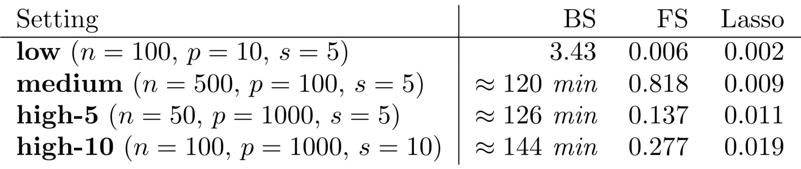

```{r, include=FALSE}
library("here")
source(here("bin/chunk-options.R"))
knitr_fig_path("04-")
```

```{r}
library("minfi")
library("here")
if (!file.exists(here("data/methylation.rds"))) {
    source(here("data/methylation.R"))
}
methylation <- readRDS(here("data/methylation.rds"))

y <- methylation$Age
methyl_mat <- getM(methylation)
```

In the previous episode we covered variable selection using stepwise/best subset
selection.
These have issues with respect to computation time and efficiency.

In low noise settings and with few or strong relationships, stepwise/subset
works well. However that's often not what we're faced with in biomedicine.


# Ridge regression

When we fit a linear model, we're minimising the RSS.

$$
    \sum_{i=1}^N y_i - X\beta
$$

The idea of regularisation is to add another condition to this to control
the size of the coefficients that come out.

One idea is to control the squared sum of the coefficients, $\beta$.
This is also sometimes called the $L^2$ norm. This is defined as

$$
    |\beta|_2 = \sqrt{\sum_{j=1}^p \beta_j^2}
$$

To control this, we specify that the solution for the equation above
also has to have an $L^2$ norm smaller than a certain amount. Or, equivalently,
we try to minimise a function that includes our $L^2$ norm scaled by a 
factor that is usually written $\lambda$.

$$
    \sum_{i=1}^N y_i - X\beta + \lambda|\beta|_2
$$

> # Exercise
> 
> Run `shinystats::ridgeApp()` and play with the parameters
> 
> Questions:
> 
> > ## Solution
> > 
> {: .solution}
{: .challenge}

Now we can fit a model using ridge regression.

```{r}
library("glmnet")
ridge <- glmnet(methyl_mat, age, alpha = 0)
```

# LASSO regression

```{r}
lasso <- cv.glmnet(methyl_mat[, -1], age, alpha = 1)
```

```{r}
## Challenge 5:
## one of these...? probably lasso
elastic <- cv.glmnet(methyl_mat[, -1], age, alpha = 0.5, intercept = FALSE)
```


> ## Other types of outcomes
> 
> You may have noticed that `glmnet` is written as `glm`, not `lm`.
> This means we can actually model a variety of different outcomes
> using this regularisation approach. For example, we can model binary
> variables using logistic regression, as shown below.
> 
> In fact, `glmnet` is somewhat cheeky as it also allows you to model
> survival using Cox proportional hazards models, which aren't GLMs, strictly
> speaking.
> 
> ```{r}
> smoking <- as.numeric(factor(norm$smoker)) - 1
> # binary outcome
> smoking
> fit <- cv.glmnet(x = methyl_mat, y = smoking, family = "binomial")
> 
> coef <- coef(fit, s = fit$lambda.1se)
> coef[coef[, 1] != 0, 1]
> plot(smoking, methyl_mat[, names(which.max(coef[-1]))])
> 
> ```
{: .callout}


Figure taken from [Hastie et al. (2020)](https://doi.org/10.1214/19-STS733).

```{r}

```


> ## Selecting hyperparameters
> 
> There are various methods to select the "best"
> value for $\lambda$. One idea is to split
> the data into $K$ chunks. We then use $K-1$ of
> these as the training set, and the remaining $1$ chunk
> as the test set. Repeating this process for each of the
> $K$ chunks produces more variability.
> 
> ```{r, echo = FALSE}
> knitr::include_graphics("../fig/cross_validation.svg")
> ```
>
> To be really rigorous, we could even repeat this *cross-validation*
> process a number of times! This is termed "repeated cross-validation".
{: .callout}



