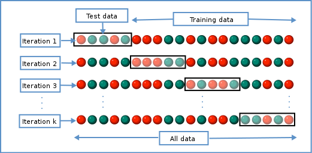

```{r, include=FALSE}
library("here")
source(here("bin/chunk-options.R"))
knitr_fig_path("04-")
```

# Introduction


In the previous episode we covered variable selection using stepwise/best subset
selection.
These have issues with respect to computation time and efficiency.
In low noise settings and with few or strong relationships, stepwise/subset
works well. However that's often not what we're faced with in biomedicine.
Often, we have many variables that are all very correlated, with plenty
of noise. For example, if we calculate the Pearson correlation between
each feature in the prostate dataset seen earlier, 
we can see that in the prostate data, the few variables we have are generally
pretty independent. 

```{r corr-mat-prostate, echo = FALSE, fig.cap="Cap", fig.alt="Alt"}
library("ComplexHeatmap")
library("lasso2")
data("Prostate")

cor_mat <- cor(Prostate[, -1])
col <- circlize::colorRamp2(
    breaks = seq(-1, 1, length.out = 9),
    colors = rev(RColorBrewer::brewer.pal(9, "RdYlBu"))
)
Heatmap(cor_mat,
    column_title = "Feature-feature correlation in prostate data",
    name = "Pearson correlation",
    col = col,
    # cluster_rows = FALSE, cluster_columns = FALSE,
    show_row_dend = FALSE, show_column_dend = FALSE,
    show_row_names = FALSE, show_column_names = FALSE
)
```

The stepwise selection methods we used in the previous episode work really 
well for data like these, because the features are generally pretty distinct.
If we do the same for the methylation dataset, in contrast, we can see that many
of the features essentially represent the same information.
Stepwise selection can struggle in cases like this, because which of the
correlated features we select at each stage can have a big impact on the 
downstream models.

```{r corr-mat-meth, echo = FALSE, fig.cap="Cap", fig.alt="Alt"}
library("minfi")
library("here")
library("ComplexHeatmap")

methylation <- readRDS(here("data/methylation.rds"))

age <- methylation$Age
methyl_mat <- t(assay(methylation))
small <- methyl_mat[, 1:500]
cor_mat <- cor(small)
Heatmap(cor_mat,
    column_title = "Feature-feature correlation in methylation data",
    name = "Pearson correlation",
    col = col,
    # cluster_rows = FALSE, cluster_columns = FALSE,
    show_row_dend = FALSE, show_column_dend = FALSE,
    show_row_names = FALSE, show_column_names = FALSE
)
```

For technical reasons, this correlation can be problematic, and if it's 
very severe it may even make it impossible to fit a model! Furthermore,
if we have many correlated features, it's likely that one of these will
be retained and all others dropped; this can make it more difficult to
infer the mechanisms behind an association.

> ## Collinearity
> 
> TODO: a technical note about why multicollinearity is a 
> problem.
{: .callout}

When we fit a linear model, we're finding the line through our data that 
minimises the residual sum of squares.
We can think of that as finding
the slope and intercept that minimises the square of the length of the dashed
lines. In this case, the red line is in the left panel is the line that
accomplishes this objective, and the red dot in the right panel is the point 
that represents this line in terms of its slope and intercept among many 
different possible models, where the background colour represents how well
different combinations of slope and intercept accomplish this objective.

```{r, regplot, echo = FALSE, fig.cap="Cap", fig.alt="Alt", fig.width=10}
library("viridis")
set.seed(42)
noise_sd <- 1
nobs <- 50
slope <- 2
intercept <- 2

maxlim <- max(abs(slope), abs(intercept)) * 2
maxlim <- max(maxlim, 5)
lims <- c(-maxlim, maxlim)

l2 <- 2
x <- rnorm(nobs, mean = 0, sd = 1)
noise <- rnorm(nobs, mean = 0, sd = noise_sd)
y <- (slope * x) + (intercept) + noise

n <- 200
s <- seq(-maxlim, maxlim, length.out = n)
loglik <- function(slope, intercept, x, y, noise_sd) {
    sum(dnorm(y, mean = (slope * x) + intercept, sd = noise_sd, log = TRUE))
}

ll <- matrix(ncol = n, nrow = n)
coef <- mask <- norm_mat <- matrix(ncol = n, nrow = n)
for (i in seq_along(s)) {
    coef[, ] <- s
}
for (i in seq_along(s)) {
    for (j in seq_along(s)) {
        norm_mat[i, j] <- sqrt(s[[i]]^2 + s[[j]]^2)
        ll[i, j] <- loglik(s[i], s[j], x, y, noise_sd)
    }
}
mask <- norm_mat <= l2
ind_mle <- arrayInd(which.max(ll), dim(ll))
pll <- ll * as.numeric(mask)
pll[pll == 0] <- NA
ind_ple <- arrayInd(which.max(pll), dim(pll))

par(mfrow = 1:2)
plot(x, y, pch = 19)
abline(
    a = coef[ind_mle[[2]]],
    b = coef[ind_mle[[1]]],
    col = "firebrick"
)
yhat <- x
for (i in seq_along(x)) {
    yhat[[i]] <- (x[[i]] * coef[ind_mle[[1]]]) + coef[ind_mle[[2]]]
    lines(
        x = rep(x[[i]], each = 2), y = c(yhat[[i]], y[[i]]),
        lty = "dashed"
    )
}

image(s, s, ll,
    xlab = "slope", ylab = "intercept",
    col = viridis(40, option = "A", direction = 1),
    xlim = lims, ylim = lims
)
abline(v = 0, lty = "dashed")
abline(h = 0, lty = "dashed")
points(
    coef[ind_mle[[1]]], coef[ind_mle[[2]]],
    pch = 19, cex = 2, col = "firebrick"
)
```

Mathematically, we can write that as

$$
    \sum_{i=1}^N \hat{y}_i - X_i\beta
$$

where $\hat{y}_i$ is the predicted y value for each input data
point $X_i$.
This line is the line of best fit through our data when considering this
goal of minimising the sum of squared error. However, it is not the only 
possible line we could use! For example, we might want to err on the side of
caution when estimating effect sizes. That is, we might want to avoid estimating
very large effect sizes. This can help us to create *generalisable*
models.


> ## Exercise
> 
> 1. Why might correlated features be a problem?
> 2. What are we minimising when we fit a linear model?
> 
> > ## Solution
> >
> > 1. Text.
> > 
> > 2. Some text.
> >    
> >
> {: .solution}
{: .challenge}


# Model selection revisited

In the previous lesson we discussed using measures like adjusted $R^2$, AIC and
BIC to show how well the model is learning the data used in fitting the model. These are really good ways of telling us how
well the model is learning to fit the data we're using as an 
input. However, this doesn't really tell us how well the model will generalise to new data. This is an important thing to 
consider -- if our model doesn't generalise to new data,
then there's a chance that it's just picking up on a technical or batch effect in our data, or simply some noise that happens
to fit the outcome we're modelling.
This is especially important when our goal is prediction -- 
it's not much good if we can only predict well for samples where
the outcome is already known, after all!

```{r, echo = FALSE, out.width = "500px", fig.cap = "Title", fig.alt = "Alt"}
knitr::include_graphics("../fig/validation.png")
```

One thing that happens a lot of the time in this context is that large 
coefficient values minimise the training error, but they don't minimise the 
test error on unseen data. First, we'll go through an example of what exactly 
this means.

For the next few exercises, we'll work with a set of features
known to be associated with age from Horvath.

```{r}
coef_horvath <- readRDS(here::here("data/coefHorvath.rds"))
methylation <- readRDS(here::here("data/methylation.rds"))
library("SummarizedExperiment")
age <- methylation$Age
methyl_mat <- t(assay(methylation))

coef_horvath <- coef_horvath[1:20, ]
features <- coef_horvath$CpGmarker

horvath_mat <- methyl_mat[, features]

## Generate an index to split the data
set.seed(42)
train_ind <- sample(nrow(methyl_mat), 25)
```

> ## Exercise
> 
> 1. Split the methylation data matrix and the age vector
>    into training and test sets.
> 2. Fit a model on the training data matrix and training age 
>    vector.
> 3. Check the mean squared error on this model.
> 
> > ## Solution
> >
> > 1. Text.
> >    
> >    ```{r}    
> >    train_mat <- horvath_mat[train_ind, ]
> >    train_age <- age[train_ind]
> >    test_mat <- horvath_mat[-train_ind, ]
> >    test_age <- age[-train_ind]
> >    ```
> > 
> > 2. Some text.
> >    
> >    ```{r}
> >    fit_horvath <- lm(train_age ~ ., data = as.data.frame(train_mat))
> >    ```
> > 
> > 3. 
> >    ```{r}
> >    mean(residuals(fit_horvath)^2)
> >    ```
> >
> {: .solution}
{: .challenge}


With this model, now we can check how well it does. Here we use residual sum of
squares on the test data.

```{r test-plot-lm, fig.cap="Cap", fig.alt="Alt"}
mse <- function(true, prediction) {
    mean((true - prediction)^2)
}
pred_lm <- predict(fit_horvath, newdata = as.data.frame(test_mat))
err_lm <- rss(test_age, pred_lm)
err_lm
par(mfrow = c(1, 1))
plot(test_age, pred_lm, pch = 19)
abline(coef = 0:1, lty = "dashed")
```

# Ridge regression

One way to tackle these many correlated variables with lots of noise is
*regularisation*.
The idea of regularisation is to add another condition to the problem we're
solving with linear regression. This condition controls the total size of the 
coefficients that come out. 
For example, we might say that the point representing the slope and intercept
must fall within a certain distance of the origin, $(0, 0)$. Note that
we are still trying to solve for the line that minimises the square of the
residuals; we are just adding this extra constraint to our solution. 

For the 2-parameter model (slope and intercept), we could
visualise this constraint as a circle with a given radius. We 
want to find the "best" solution (in terms of minimising the 
residuals) that also falls within a circle of a given radius 
(in this case, `r l2`).


```{r, ridgeplot, echo = FALSE, fig.cap = "Cap", fig.alt = "Alt", fig.width = 10}
set.seed(42)
par(mfrow = 1:2)
plot(x, y, pch = 19)
abline(
    a = coef[ind_ple[[2]]],
    b = coef[ind_ple[[1]]], col = "dodgerblue"
)
abline(
    a = coef[ind_mle[[2]]],
    b = coef[ind_mle[[1]]], col = "firebrick"
)

image(s, s, ll,
    xlab = "slope", ylab = "intercept",
    col = viridis(40, option = "A", direction = 1),
    xlim = lims, ylim = lims
)
abline(v = 0, lty = "dashed")
abline(h = 0, lty = "dashed")
points(
    coef[ind_mle[[1]]], coef[ind_mle[[2]]],
    pch = 19, cex = 2, col = "firebrick"
)
contour(
    s, s, norm_mat,
    add = TRUE, levels = l2, drawlabels = FALSE
)
points(
    coef[ind_ple[[1]]], coef[ind_ple[[2]]],
    pch = 19, cex = 2, col = "dodgerblue"
)
```

There are multiple ways to define the distance that our solution must fall in,
though. The one we've plotted above controls the squared sum of the 
coefficients, $\beta$.
This is also sometimes called the $L^2$ norm. This is defined as

$$
    \left\lVert \beta\right\lVert^2 = \sqrt{\sum_{j=1}^p \beta_j^2}
$$

To control this, we specify that the solution for the equation above
also has to have an $L^2$ norm smaller than a certain amount. Or, equivalently,
we try to minimise a function that includes our $L^2$ norm scaled by a 
factor that is usually written $\lambda$.

$$
    \left(\sum_{i=1}^N y_i - X_i\beta\right) + \lambda \left\lVert \beta \right\lVert^2
$$

# Why would we want to restrict our model?

It's an odd thing to do, restrict the possible values of our model parameters, 
though! Why would we want to do this? Well firstly, when we have many 
correlated features our model estimates can be very unstable or even difficult
to calculate. Secondly, this type of approach can make our model more 
generalisable. To show this,
we'll fit a model using the Horvath methylation predictors, using both
penalised and ordinary least squares.

```{r plot-ridge, fig.cap="Cap", fig.alt="Alt"}
library("glmnet")
ridge_fit <- glmnet(x = train_mat, y = train_age, alpha = 0)
plot(ridge_fit, xvar = "lambda")
abline(h = 0, lty = "dashed")
```

This plot shows how the coefficients change as we increase the penalty. That is,
as we decrease the size of the region that solutions can fall into, the values
of the coefficients that we get back tend to decrease. In this case,
coefficients trend towards zero but generally don't reach it until the penalty
gets very large. We can see that initially, some parameter estimates are really,
really large, and these tend to shink fairly rapidly.

We can also notice that some parameters "flip signs"; that is, they start off
positive and become negative as lambda grows. This is a sign of collinearity,
or correlated predictors. As we reduce the importance of one feature, we can 
"make up for" the loss in accuracy from that one feature by adding a bit of
weight to another feature that represents similar information.

Since we split the data into test and training data, we can prove that ridge
regression gives us a better prediction in this case:

```{r pred-ridge-lm, fig.width = 10, fig.cap="Cap", fig.alt="Alt"}
pred_ridge <- predict(ridge_fit, newx = test_mat)
err_ridge <- apply(pred_ridge, 2, function(col) rss(test_age, col))
min(err_ridge)
err_lm

minimum_error <- which.min(err_ridge)
min_ridge <- pred_ridge[, minimum_error]
```

We can see where on the continuum of lambdas we've picked a model by plotting
the coefficient paths again. In this case, we've picked a model with fairly
modest shrinkage.

```{r fig.cap="Cap", fig.alt="Alt"}
chosen_lambda <- ridge_fit$lambda[which.min(err_ridge)]
plot(ridge_fit, xvar = "lambda")
abline(v = log(chosen_lambda), lty = "dashed")
```


> ## Exercise
> 
> 1. Which performs better, ridge or OLS?
> 2. Plot the predictions for each method against the ground truth.
>    How do the predictions look for both methods? Why might ridge be 
>    performing better?
> 3. Compare the coefficients of the ridge model to the OLS model. Why might
>    the differences drive the differences in prediction that you see?
> 
> > ## Solution
> > 
> > 1. Ridge.
> >    ```{r}
> >    min_ridge
> >    err_lm
> >    ```
> > 2. The ridge ones are less extreme.
> >    ```{r plot-ridge-prediction, fig.cap="Cap", fig.alt="Alt"}
> >    all <- c(pred_lm, test_age, min_ridge)
> >    lims <- range(all)
> >    par(mfrow = 1:2)
> >    plot(test_age, pred_lm,
> >        xlim = lims, ylim = lims,
> >        pch = 19
> >    )
> >    abline(coef = 0:1, lty = "dashed")
> >    plot(test_age, pred_ridge[, which.min(err_ridge)],
> >        xlim = lims, ylim = lims,
> >        pch = 19
> >    )
> >    abline(coef = 0:1, lty = "dashed")
> >    ```
> > 3. They're generally smaller.
> >    ```{r coef-ridge-lm, fig.cap="Cap", fig.alt="Alt"}
> >    par(mfrow = c(1, 1))
> >    plot(coef(lm_fit), coef(ridge_fit, s = which.min(err_ridge)),
> >        pch = 19
> >    )
> >    abline(coef = 0:1, lty = "dashed")
> >    ```
> {: .solution}
{: .challenge}


> ## Ridge regression through a Bayesian lens
>
> Bayesian statistics is another way of modelling data, in contrast to the
> frequentist methods we're using at the moment.
> 
> Under a Bayesian lens, we consider the likelihood just as we modelled earlier.
> For linear regression, this is the density of the data under the normal
> distribution specified by our model parameters (slope and intercept, 
> for example).
> 
> In Bayesian linear regression, we also place a *prior* distribution on our 
> coefficients, $\beta$. A common distribution that we use here is a normal 
> distribution. This means that we imagine our coefficients are likely to
> be close to zero.
> This tends to *shrink* the coefficients towards zero, with the strength
> of the shrinkage controlled by the variance of the normal distribution.
> 
> The density of a normally distributed variable $x \sim N(\mu, \sigma^2)$ is
> defined
> 
> $$
>   \frac{1}{\sqrt{2\pi\sigma^2}}\exp\left(-\frac{(x-\mu)^2}{2\sigma^2}\right)
> $$
> 
> If we centre our distribution at zero, we can see that the numerator of the
> exponent is $x^2$. In fact, these are mathematically equivalent.
> 
{: .callout}

# LASSO regression

LASSO is another type of regularisation. In this case we use the $L^1$ norm,
or the sum of the absolute values of the coefficients.

$$
    \left\lVert \beta \right\lVert^1 = \sqrt{\sum_{j=1}^p \beta_j}
$$

This tends to produce sparse models; that is to say, it tends to remove features
from the model that aren't necessary to produce accurate predictions. This
is because the region we're restricting the coefficients to has sharp edges.
So, when we increase the penalty (reduce the norm), it's more likely that
the best solution that falls in this region will be at the corner of this
diagonal (ie, one or more coefficient is exactly zero).

```{r, echo = FALSE, fig.cap = "Title", fig.alt = "Alt", fig.width=10}
loglik <- function(slope, intercept, x, y, noise_sd) {
    sum(dnorm(y, mean = (slope * x) + intercept, sd = noise_sd, log = TRUE))
}
drawplot <- function() {
    set.seed(42)
    noise_sd <- 1
    nobs <- 15
    slope <- 2
    intercept <- 2
    maxlim <- max(abs(slope), abs(intercept)) * 2
    maxlim <- max(maxlim, 5)
    lims <- c(-maxlim, maxlim)
    l1 <- 2
    x <- rnorm(nobs, mean = 0, sd = 1)
    noise <- rnorm(nobs, mean = 0, sd = noise_sd)
    y <- (slope * x) + (intercept) + noise
    n <- 200

    s <- seq(-maxlim, maxlim, length.out = n)

    ll <- matrix(ncol = n, nrow = n)
    coef <- mask <- norm_mat <- matrix(ncol = n, nrow = n)
    for (i in seq_along(s)) {
        coef[, ] <- s
    }
    for (i in seq_along(s)) {
        for (j in seq_along(s)) {
            norm_mat[i, j] <- abs(s[[i]]) + abs(s[[j]])
            ll[i, j] <- loglik(s[[i]], s[[j]], x, y, noise_sd)
        }
    }
    mask <- norm_mat <= l1

    ind_mle <- arrayInd(which.max(ll), dim(ll))
    pll <- ll * as.numeric(mask)
    pll[pll == 0] <- NA
    ind_ple <- arrayInd(which.max(pll), dim(pll))

    par(mfrow = 1:2)

    plot(x, y, pch = 19)
    abline(
        a = coef[ind_ple[[2]]],
        b = coef[ind_ple[[1]]], col = "dodgerblue"
    )
    abline(
        a = coef[ind_mle[[2]]],
        b = coef[ind_mle[[1]]], col = "firebrick"
    )
    image(s, s, ll,
        xlab = "slope", ylab = "intercept",
        col = viridis(40, option = "A", direction = 1),
        xlim = lims, ylim = lims
    )
    abline(v = 0, lty = "dashed")
    abline(h = 0, lty = "dashed")
    points(
        coef[ind_mle[[1]]], coef[ind_mle[[2]]],
        pch = 19, cex = 2, col = "firebrick"
    )
    contour(
        s, s, norm_mat,
        add = TRUE, levels = l1, drawlabels = FALSE
    )
    points(
        coef[ind_ple[[1]]], coef[ind_ple[[2]]],
        pch = 19, cex = 2, col = "dodgerblue"
    )
}
drawplot()
```


> ## Exercise
> 
> 1. Use `glmnet` to fit a LASSO model (hint: set `alpha = 1`).
> 2. Plot the model object. Remember that for ridge regression,
>    we set `xvar = "lambda"`. What if you don't set this? What's the
>    relationship between the two plots?
> 3. How do the coefficient paths differ to the ridge case?
> 
> > ## Solution
> > 
> > 1. .
> >    ```{r}
> >    fit_lasso <- glmnet(x = methyl_mat, y = age, alpha = 1)
> >    ```
> > 2. .
> >    ```{r, echo=FALSE}
> >    par(mfrow = c(1, 1))
> >    ```
> >    ```{r, fig.cap="LASSO lambda", fig.alt="Alt"}
> >    plot(fit_lasso, xvar = "lambda")
> >    ```
> >    ```{r, fig.cap="LASSO L1", fig.alt="Alt"}
> >    plot(fit_lasso)
> >    ```
> > 3. The paths tend to go to exactly zero much more.
> > 
> {: .solution}
{: .challenge}


# Cross-validation

There are various methods to select the "best"
value for $\lambda$. One idea is to split
the data into $K$ chunks. We then use $K-1$ of
these as the training set, and the remaining $1$ chunk
as the test set. Repeating this process for each of the
$K$ chunks gives us a better estimate of how well the model would
perform in unseen data.

```{r, echo = FALSE, fig.cap = "Title", fig.alt = "Alt"}

```

We can use this new idea to pick a lambda value.

```{r, fig.cap="Lasso", fig.alt="Alt"}
lasso <- cv.glmnet(methyl_mat[, -1], age, alpha = 1)
plot(lasso)
coefl <- coef(lasso, lasso$lambda.min)
selected_coefs <- as.matrix(coefl)[coefl[, 1] != 0, 1]
## We select some of the same features! Hooray
intersect(names(selected_coefs), coef_horvath$CpGmarker)
```

```{r, echo = FALSE, fig.cap="Heatmap", fig.alt="Alt"}
hmat <- t(scale(methyl_mat[, names(selected_coefs)[-1]]))
ord <- order(age)
hmat_ord <- hmat[, ord]
age_ord <- age[ord]
col <- circlize::colorRamp2(seq(min(age), max(age), length.out = 100), viridis(100))
Heatmap(
    hmat_ord,
    name = "Scaled\nmethylation level",
    top_annotation = columnAnnotation(
        age = age_ord,
        col = list(age = col)
    ),
    show_column_names = FALSE,
    column_title = "Sample",
    row_title = "Feature",
    row_names_side = "left",
    row_title_side = "left",
    column_title_side = "bottom",
    show_row_dend = FALSE,
    cluster_columns = FALSE
)
```


> ## Bias-variance tradeoff and the elastic net
> 
> When making predictive models, we have to consider bias and variance.
> 
> Elastic net is good.
> 
> ```{r}
> elastic <- cv.glmnet(methyl_mat[, -1], age, alpha = 0.5, intercept = FALSE)
> ```
{: .callout}


> ## Other types of outcomes
> 
> You may have noticed that `glmnet` is written as `glm`, not `lm`.
> This means we can actually model a variety of different outcomes
> using this regularisation approach. For example, we can model binary
> variables using logistic regression, as shown below. The type of outcome
> can be specified using the `family` argument, which specifies the family
> of the outcome variable.
> 
> In fact, `glmnet` is somewhat cheeky as it also allows you to model
> survival using Cox proportional hazards models, which aren't GLMs, strictly
> speaking.
> 
> For example, in the current dataset we can model smoking status as a binary
> variable in logistic regression by setting `family = "binomial"`.
>
> The [package documentation](https://glmnet.stanford.edu/articles/glmnet.html)
> explains this in more detail.
> 
> ```{r, fig.cap = "Title", fig.alt = "Alt"}
> smoking <- as.numeric(factor(methylation$smoker)) - 1
> # binary outcome
> table(smoking)
> fit <- cv.glmnet(x = methyl_mat, nfolds = 5, y = smoking, family = "binomial")
> 
> coef <- coef(fit, s = fit$lambda.min)
> coef <- as.matrix(coef)
> coef[coef[, 1] != 0, 1]
> plot(fit)
> ```
> In this case, the results aren't very interesting! We select an intercept-only
> model.
{: .callout}


