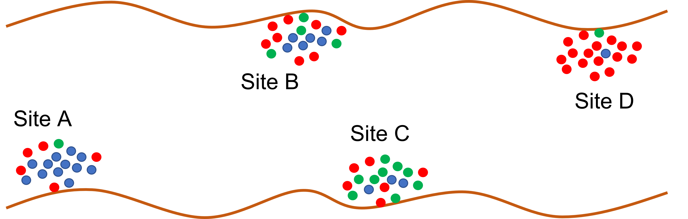

```{r setup, include=FALSE}
library("here")
source(here("bin/chunk-options.R"))
knitr_fig_path("07-")
```


# Introduction

Researchers often aim to reduce dimensionality in high-dimensional datasets
that describe communities of species, microbes or genes in different sites,
patients or samples. Such datasets may include different types of data
describing the site or patient including both continuous and categorical data.
For example, a researcher might be interested in understanding how communities
of bacteria in the gut vary among site (see Figure 1) or how genetic composition
varies among people.

```{r schematic, echo=FALSE}

# 
```

**Non-metric multidimensional scaling (NMDS)** is a popular approach for
graphically representing relationships between objects (e.g. plots or samples)
in multidimensional space. The goal of NMDS is to reduce information contained
within multiple dimensions (e.g. communities, patients, study sites) into a
smaller number of dimensions, allowing for easier visualisation and
interpretation. NMDS attempts to represent the pairwise dissimilarity between
objects in as low-dimensional a space as possible. Because NMDS ranks data
points based on their relative similarities (or dissimilarities), this makes it
an extremely flexible technique that can incorporate various different types of
data.

In other ordination methods, many axes (or in the case of PCA principal
components) are calculated whereas in NMDS a number of axes are selected
before analysis and the data are explored using these axes only. Rather
than being calculated analytically, NMDS is calculated numerically that finds a
solution iteratively, only stopping when an acceptable solution has been found
or when a user-defined time or iteration level has been reached. Because of the
way it is calculated, NMDS does not have a unique solution like other ordination
methods and rerunning he analysis produces a slightly different solution.

# Carrying out NMDS 

The abundance of communities of species can be plotted on a single axis
(Figure 2). We can add a second axis showing the abundance of communities of a
second species (Figure 3). We can then add a third axis representing abundance
of communities of a third species. Imagine we have data for abundance of
communities of lots of different species. Each requires a separate axis.
This becomes impossible to visualise!
NMDS is used to represent abundances of different communities in
multidimensional space using a reduced number of dimensions (or axes).

```{r species-site1d, echo = FALSE}
knitr::include_graphics("../fig/one_dimension_species_vs_site.png")
# 
```
```{r species-site2d, echo = FALSE}
knitr::include_graphics("../fig/two_dimension_species_vs_site.png")
# 
```

To carry out NMDS, first map the relative positions of sites in
multidimensional space (in rank orders). The user then chooses the number of
dimensions/axes they would like to use to display the data (more than 3 is
difficult to visualise). Next, calculate differences in species abundance
between sites and rank on the number of dimensions/axes specified by the user.
This configuration of species abundance among sites in reduced dimensions/axes
is compared with the true observed distances between sites. The disagreement
between ranks of sites according to these two configurations is measured as
stress, an index between 0 and 1 in which large disagreements correspond to
large stress values.


# Example using data (Code along)

In this example we will use the microbiome package from Bioconductor to carry
out a NMDS analysis. The microbiome R package allows us to explore and analyse
some microbiome profiling data collected from volunteers from different
communities. The packages makes use of data from the phyloseq package which
stores various datasets on phylogenetic sequencing data which has been
organised into Operational Taxonomic Units (OTUs).

We are going to use data collected from participants following western and
rural African diets (from O'Keefe et al. 2015).


# Examining the data

Next, load the microbiome data collected as part of 'dietswap' which is
available from the phyloseq package. We will also load ggplot2 for data
visualiation.
The dataset 'dietswap' contains information from 222 samples and 130 taxa. The
data contains phylogenetic sequencing data, as well as information about the
people from whom samples were taken and information about the taxonomic groups
from which species in the microbiome belong.
A phyloseq object contains OTU table (taxa abundances), sample metadata,
taxonomy table (mapping between OTUs and higher-level taxonomic
classifications), and phylogenetic tree (relations between the taxa).
These data can be examined using the funtions otu_table, sample_data and
tax_table.

```{r libraries}
#Load example data for microbiome (phylogenetic sequencing data)
library(microbiome)
library(phyloseq)
library(ggplot2)
data(dietswap)
# Pick core taxa with given prevalence and detection limits
# Filter the phyloseq object to include taxa with defined prevalence
# Pick core taxa with with the given prevalence and detection limits
ds.core <- core(dietswap, detection = 0.1 / 100, prevalence = 90 / 100)
# Use relative abundances for the core
ds.core <- microbiome::transform(ds.core, "compositional")

#phylogenetic data (phyloseq-class experimental level object)
#use otu_table to see spp composition table (number of positive tests for spp)
#use sample_data to see metadata for person associated with each sample
summarize_phyloseq(ds.core)
head(otu_table(ds.core)[, 1:10])
head(sample_data(ds.core))
head(tax_table(ds.core))
```

Here we use the `transform` function from the microbiome package to calculate
relative abundances of each Genus in the 'dietswap' data. The `transform`
argument includes options on how to transform the data. 'Compositional' is used
to calculate relative abundance (i.e. proportional abundance). This function
returns an object suitable for input into the `ordinate` function which carries
out the NMDS.

`otu_table` allows us to see the species composition table which displays the
number of positive tests for each species in the participants' samples.
`sample_data` shows metadata associated with each sample. `tax_table`
returns taxonomic information (phylum, family) for each species identified in
patient samples.

Let's examine the phylogenetic structure of the data using function from
phyloseq.

```{r structure}
rank_names(ds.core)
#Create table showing number of features for each phyla
table(tax_table(ds.core)[, "Phylum"])
#Create table showing number of features for each family
table(tax_table(ds.core)[, "Family"])
#Create table showing number of read counts (features) for each genus
table(tax_table(ds.core)[, "Genus"])
```

The function `rank_names` returns the taxonomic levels contained within the
'ds.core' data. In this case, we have data from Phylum, Family and Genus. We
can examine the number of different Phyla, Families and Genuses in samples using
the `tax_table` function as shown above. There are many Genuses, Families and
Phyla with only single features. Some are highly over-represented (e.g. the
Firmicutes phylum).


# Running NMDS in R

Let's carry out NMDS using the `ordinate` function. 
This function takes phylogenetic sequencing data on which you want to apply
your chosen ordination method and specifies the method (in this case, NMDS),
number of axes/dimensions (k, in this case 2), the distance measure (in this
case, 'bray') and maximum number of iterations before stopping the function.


```{r nmds}
set.seed(4000)
ord <- ordinate(ds.core, method = "NMDS", k = 2, "bray",trymax = 150)
## trymax increases the number of iterations until a solution is found
## k refers to number of axes (dimensions - user defined).
## A lower number of axes is simpler and easier to visualise
## but gives higher stress (poorer fit)
## stress 0.1-0.2 is an ok fit, but not great
```

Notice how changing the value of `set.seed` gives a slightly different value of
stress of the solution. This is because the solution to NMDS is calculated
using different random starting data configurations, so it gives a slightly
different answer each time. The `ordinate` function stops when the minimum
value of stress is found. `set.seed` allows the same result to be returned each
time the code is run, even though there is a random element to reaching
the solution. 

We have defined the number of axes (or dimensions) that we would like our data
to be reduced to, as it is easy to visual our data in two dimensions. However,
the data might not fit this number of dimensions very well and the amount of
information lost by reducing abundances of all the genuses to a couple of
dimensions may be too great.

We can use the stress value to find out how well our data can be summarised
using only two dimensions. Stress is a measure of the disagreement between
the data configuration created used two dimensions and predicted values from
a regression between distances calculated using this configuration and
observed distances of rank orders. As in life, low values of stress are
preferred. Lower stress values indicate greater conformity and therefore are
desirable. If stress is high, repositioning the points in two dimensions may
help to reduce stress. In general, stress <0.1 is great, <0.2 is good and >0.3
provides a poor representation of the data in the number of dimensions selected.


> ## Challenge 1 
> 
> What do you think we could do to reduce stress if the overall solution of
> the ordinate function had a stress solution greater than 0.3? Discuss in
> groups.
> 
> > ## Solution
> > 
> > Increase number of dimensions (k). If the stress value is higher, it is
> > advisable to include an additional dimension, but remember that human brains
> > are not very well equipped to visualise objects in more than 2-dimensions.
> {: .solution}
{: .challenge}

We can use a Shepard plot from the vegan package to assess if our NMDS has
produced an accurate visualisation. It plots distances calculated using NMDS
against dissimilarity in our original data. It also gives two goodness-of-fit
measures: non-metric fit (calculated using stress value) and linear fit
(squared correlation between fitted values on line and ordination distances).
Closer to one means a better fit.

```{r stressplot}
library(vegan)
stressplot(ord)
```

This stressplot suggests that the NMDS fitted on two dimensions fits the
original data well.


> ## Challenge 2 
> 
> Identify the lowest value of k that gives the best stress value for NMDS
> using the microbiome data (ds.core). Think about getting a low stress value
> as well as creating results that can be easily visualised and interpreted.
> Use the function stressplot to examine how distribution around the
> regression line changes with increases in k. Use what you have learned to
> decide on best number of dimensions to include in NMDS analysis of the
> microbiome data. Use `set.seed(1000)` for k values greater than 2 to allow
> for convergence.
> 
> > ## Solution
> > 
> > ```{r k-ex}
> > set.seed(1000)
> > ord <- ordinate(ds.core, method = "NMDS",k=4, "bray",trymax=150)
> > ## trymax increases the number of iterations until a solution is found
> > ## k refers to number of axes (user defined). A lower number of axes is simpler and 
> > ## easier to visualise but gives higher stress (poorer fit)
> > ## stress <0.1 is a great fit
> > 
> > set.seed(1000)
> > ord <- ordinate(ds.core, method = "NMDS",k=3, "bray",trymax=150)
> > stressplot(ord)
> > 
> > ## 3 dimensions is easier to visualise than 4 dimensions and gives good enough fit
> > ## Stress is <0.1 when k=3 giving best solution for number of dimensions which is easy to visualise
> > ```
> {: .solution}
{: .challenge}


# Examining the output (code along) 

NMDS analysis does two things:
* It creates a dissimilarity matrix (method specified by the user) that measures
  the similarity between every pair of samples (in this case, 222 samples of
  species abundance from the microbiome data).
* It creates an ordination plot from the dissimilarity matrix.

We can get the values NMDS has calculated for the dissimilarity matrix for
each of the user-specified axes using:

```{r points}
head(ord$points)
```

We can also see the score associated with each genus in ds.core.

```{r species}
head(ord$species)
```

Non-metric multidimensional scaling can be used to create an ordination plot
from any measure of similarity or dissimilarity among samples. Such plots are
useful for visualising relationships between data points, taking into account
the various different variables recorded for each of the 222 samples in the
microbiome dataset. There are many different methods available for calculating
dissimilarity between data points including straight line distance between two
points (Euclidean distance) and the Bray-Curtis measure which is better at
handling datasets which contain a large proportion of zeros (as in the
microbiome dataset).

```{r ordplot1}
plot_ordination(ds.core, ord, color = "group") +
  geom_point(size = 4)
```

Given that this NMDS solution has 3 dimensions, plot other dimensions. Plot
group on each point according to the metadata. Group refers to study group
each participant belonged to (3 different home environments thought to affect
diet).

```{r ordplot2}
plot_ordination(ds.core, ord, color = "group", axes = c(1, 3)) +
  geom_point(size = 4)
```

```{r ordplot3}
plot_ordination(ds.core, ord, color = "group", axes = c(2, 3)) +
  geom_point(size = 4)
```


> ## Challenge 3 
> 
> Use the `plot_ordination` function to look for clusters in points
> on the NMDS axes according to sex, bmi_group and other factors in the
> metadata.Do any of these factors appear to form clusters?
> 
> 
> > ## Solution
> > 
> > ```{r ordplot-ex}
> > plot_ordination(ds.core, ord, color = "bmi_group") +
> >   geom_point(size = 4)
> > 
> > plot_ordination(ds.core, ord, color = "sex") +
> >   geom_point(size = 4)
> > 
> > plot_ordination(ds.core, ord, color = "nationality") +
> >   geom_point(size = 4)
> > 
> > plot_ordination(ds.core, ord, color = "nationality", axes=c(1,3)) +
> >   geom_point(size = 4)
> > ```
> {: .solution}
{: .challenge}


# Plotting NMDS output (Code along)

It appears that there are two clusters of points on NMDS axes that cluster
according to participant nationality (AAM and AFR), which corresponds to African
Americans (AAM) and AFR (rural Africans). This suggests that participants of the
same nationality tended to have more similar taxa in their microbiome samples
compared with partcipants from the different nationality.

Keep in mind that NMDS is a visualisation of the data and not a statistical
test. The process of analyses does produce a dissimilarity matrix which provides
indices of how similar (or dissimilar) data points are from each other and these
can be used to construct visualisations.

We can improve on the plots produced above by varying the shape of data points
by sex, increasing the size of points to make them easier to see, making points
slightly more transparent (using the argument `alpha`) and adding a title.

Here we will create two plots, one displaying NMDS axes 1 and 2 and others
displaying NMDS axes 1 and 3 and 2 and 3. By plotting all of these we can
examine how points relate to each other across all three dimensions that were
used in the analysis.

```{r ordplots-123}
p <- plot_ordination(ds.core, ord, color="nationality", shape="sex")
p <- p + geom_point(size=4, alpha=0.75)
p <- p + scale_colour_brewer(type="qual", palette="Set1")
p + ggtitle("NMDS on dissimilarity matrix")

p <- plot_ordination(ds.core, ord, color="nationality", shape="sex", axes=c(1,3))
p <- p + geom_point(size=4, alpha=0.75)
p <- p + scale_colour_brewer(type="qual", palette="Set1")
p + ggtitle("NMDS on dissimilarity matrix")

p <- plot_ordination(ds.core, ord, color="nationality", shape="sex", axes=c(2,3))
p <- p + geom_point(size=4, alpha=0.75)
p <- p + scale_colour_brewer(type="qual", palette="Set1")
p + ggtitle("NMDS on dissimilarity matrix")
```

Reading NMDS plots is quite straightforward: objects that are ordinated
closer to one another are likely to be more similar than those further apart.
However, the scale of the axes and the ordination of the plot do not tell us
much in terms of the original data. 

While these three plots are useful for helping us understand how similar data
points are to each in terms of microbiome composition, it can be difficult to
interpret results from each axis separately. 

We can use a 3D scatterplot to examine all three axes at once using the
'vegan3d' package. We can also colour points by categorical variables in the
metadata, such as nationality. In the plot below, black points are African
American participants and red points are rural African participants.

```{r vegan-3d, eval=FALSE}
library(vegan3d)
ordiplot3d(ord, col = meta(ds.core)$nationality, angle = 30)
```

We can see from this plot that it is much easier to visualise the three
NMDS dimensions using a 3D scatterplot than it is using a series of three
2D scatterplots. The disadvantage is that the current 3D scatterplot can only
be observed from one angle making it difficult to observe some data points.
The user can change the angle that the scatterplot is viewed from using the
`angle` argument in `ordiplot3d`. 

Visualising output of NMDS analysis can provide important information
regarding relationships between samples and clusters according to metadata
variables.


> ## Challenge 4 
> 
> What conclusions can you draw from this NMDS analysis? Does there appear
> to be a difference in the microbiome communities of rural Africans and
> African Americans? What other factors may be important determinants in
> diversity of microbiome communities?
> 
> > ## Solution
> > 
> > NMDS analysis using phylogenetic data from the microbiome package shows
> > that there are two clusters of samples with microbe abundances that are
> > more similar within the cluster than they are to other samples in the
> > dataset. No other group in the metadata form clusters as apparent as
> > those of different nationalities.
> {: .solution}
{: .challenge}

# Advantages and disadvantages of NMDS 

NMDS has several advantages over other oridination methods, such as PCA and
factor analysis.

* Unlike metric-based methods such as PCA, NMDS makes very few assumptions
  about the data. 
* NMDS allows different types of data (continuous and categorical) to be
  included in the same analysis (although non-ordinal categorical variables
  should be converted to binary 'dummy' variables first).
* It allows the dissimilarity matrix to be calculated using different methods
  (e.g. Euclidean, Bray-Curtis).
* It is robust to problems with data, such as missing distances between points.

However, there are various disadvantges to using NMDS:

* It can be difficult to visualise NMDS results that use more than three
  dimensions (as identified by comparing stress of NMDS analyses using
  different numbers of dimensions).
* Like all ordination methods, NMDS lacks an underlying statistical model
  describing relationships between variables/data points.
* It can be slow to run, especially using large complex datasets.
* NMDS is a numerical optimisation technique and as such it is vulnerable
  to becoming 'stuck' in solutions that are not the best solution but are
  comparably better than other local solutions. Running multiple NMDS analyses
  can reduce the chance of this happening.

# Further reading 

- [Holland, S.M. (2008) Non-metric Multidimensional Scaling (MDS).](https://strata.uga.edu/software/pdf/mdsTutorial.pdf).
- [Lahti, L, Sudarshan, S. et al. Introduction to the microbiome R package.](https://microbiome.github.io/tutorials/).
- Marco-Ramell, A. et al. (2018) Evaluation and comparison of bioinformatic tools for the enrichment analysis of metabolomics data. BMC Bioinformatics 19:1. DOI:10.1186/s12859-017-2006-0.
- O'Keefe, S.J.D. et al. (2015) Fat, fibre and cancer risk in African Americans and rural Africans. Nature Communications 6:6342. DOI:10.1038/ncomms7342.
- [Oksanen, J. (2005) Multivariate analysis of Ecological Communities in R.](http://www.pelagicos.net/MARS6910_spring2015/manuals/R_vegan_multivariate.pdf).


