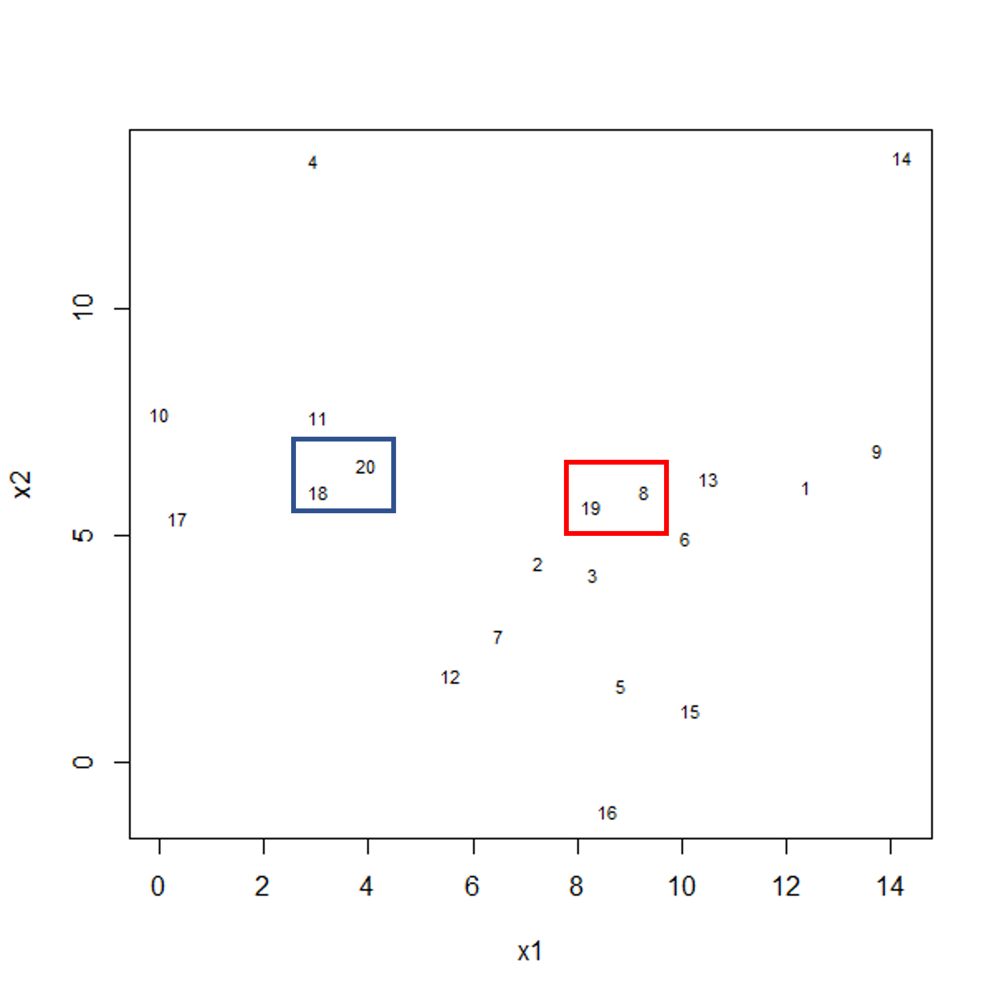

```{r settings, include=FALSE}
library("here")
source(here("bin/chunk-options.R"))
knitr_fig_path("09-")
```


# Why use hierarchical clustering on high-dimensional data?

When analysing high-dimensional data in the life sciences, it is often useful
to identify groups of similar data points to understand more about the relationships
within the dataset. In **hierarchical clustering** an algorithm groups similar
data points (or observations) into groups (or clusters). This results in a set
of clusters, where each cluster is distinct, and the data points within each
cluster have similar features. The clustering algorithm works by iteratively
grouping data points so that different clusters may exist at different stages
of the algorithm's progression.

Unlike K-means clustering, **hierarchical clustering** does not require the
number of clusters $k$ to be specified by the user before analysis is carried
out. Hierarchical clustering also provides an attractive *dendrogram*, a
tree-like diagram showing the degree of similarity between clusters. 

The dendrogram is a key feature of hierarchical clustering. This tree allows
relationships between data points in a dataset to be easily observed and the
arrangement of clusters produced by the analysis to be illustrated. Dendrograms are
created using a distance (or dissimilarity) matrix fitted to the data and a
clustering algorithm to fuse different groups of data points together.

In this episode we will explore hierarchical clustering for identifying
clusters in high-dimensional data. We will use *agglomerative* hierarchical
clustering (see box) in this episode.

> ## Agglomerative and Divisive hierarchical clustering)
> 
> There are two main methods of carrying out hierarchical clustering:
> agglomerative clustering and divisive clustering. 
> The former is a 'bottom-up' approach to clustering whereby the clustering
> approach begins with each data point (or observation) 
> being regarded as being in its own separate cluster. Pairs of data points are
> merged as we move up the tree. 
> Divisive clustering is a 'top-down' approach in which all data points start
> in a single cluster and an algorithm is used to split groups of data points
> from this main group.
{: .callout}


# The hierarchical clustering algorithm 

The algorithm for hierarchical clustering is simple. First, we measure distance
(or dissimilarity) between pairs of observations. Initially, and at the bottom
of the dendrogram, each observation is considered to be in its own individual
cluster. We start the clustering procedure by fusing the two observations that
are most similar according to a distance matrix (e.g. that are closest
together in *n*D space). Next, the next most similar observations are fused
so that the total number of clusters is *number of observations* - 2 (see
Figure 1a). Groups of observations may then be merged into a larger cluster
(see Figure 1b) This process continues until all the observations are included
in a single cluster.

```{r hclustfig1, echo=FALSE, out.width="500px", fig.cap="Figure 1a: Example data showing two clusters of observation pairs"}

# 
```


```{r hclustfig2, echo=FALSE, out.width="500px", fig.cap="Figure 1b: Example data showing fusing of one observation into larger cluster"}
knitr::include_graphics("../fig/hierarchical_clustering_2.png")
# 
```


There are two things to consider before carrying out clustering:
* how to define dissimilarity between observations using a distance matrix, and
* how to define dissimilarity between clusters and when to fuse separate clusters.


# Creating the distance matrix

Hierarchical clustering is performed in two steps: calculating the distance
matrix and applying clustering using this matrix. 

There are different ways to
specify a distance matrix for clustering:

* Specify distance as a pre-defined option using the `method` argument in the
  `dist()` function. Methods include `euclidean` (default), `maximum` and `manhattan`.
* Create a self-defined function which calculates distance from a matrix or
  from two vectors. The function should only contain one argument.

Of pre-defined methods of calculating the distance matrix, Euclidean is one of
the most commonly used. This method calculates the shortest straight-line
distances between pairs of observations.

Another option is to use a correlation matrix as the input matrix to the
clustering algorithm. The type of distance matrix used in hierarchical
clustering can have a big effect on the resulting tree. The decision of which
distance matrix to use before carrying out hierarchical clustering depends on the
type of data and question to be addressed. 

Let's perform hierarchical clustering on a subset of the 'methylation' dataset using correlations between variables.

The dataset we will be working with are correlations between the first 100 features in
the methylation dataset introduced in the regression lesson. 

Let's load the data and look at it.

```{r}
library("minfi")
library("here")

#Load small version of the methylation dataset
small_methyl_mat <- readRDS(here("data/small_methylation.rds"))
```

```{r, eval=FALSE}
#view the data
View(small_methyl_mat)
```

```{r}
#count the number of rows and columns
#should be equal to 100
ncol(small_methyl_mat)
nrow(small_methyl_mat)
```

Recall the heatmap displayed in the regression lesson. If we display the heatmap
without hierarchical clustering, we can see that it’s very noisy and clusters
of correlations between variables are difficult to see.

```{r heatmap-noclust, echo=FALSE}
library("minfi")
library("here")
library("ComplexHeatmap")

cor_mat <- readRDS(here::here("data/small_methylation.rds"))
col <- circlize::colorRamp2(
    breaks = seq(-1, 1, length.out = 9),
    colors = rev(RColorBrewer::brewer.pal(9, "RdYlBu"))
)
Heatmap(cor_mat,
    column_title = "Feature-feature correlation in methylation data",
    name = "Pearson correlation",
    col = col,
    cluster_rows = FALSE, cluster_columns = FALSE,
    show_row_dend = FALSE, show_column_dend = FALSE,
    show_row_names = FALSE, show_column_names = FALSE
)
# 
```

We carry out hierarchical clustering on these data using the function
`Heatmap` from the ComplexHeatmap package. We use the correlation matrix
from the small_methylation dataset as the input distance matrix. The `Heatmap`
function groups features based on similarity of correlation values and orders rows and columns to show clustering of features.


```{r heatmap-clust, echo=FALSE}
library("minfi")
library("here")
library("ComplexHeatmap")

cor_mat <- readRDS(here::here("data/small_methylation.rds"))
Heatmap(cor_mat,
    column_title = "Feature-feature correlation in methylation data",
    name = "Pearson correlation",
    col = col,
    cluster_rows = TRUE, cluster_columns = TRUE,
    show_row_names = FALSE, show_column_names = FALSE,
    show_row_dend = FALSE, show_column_dend = FALSE
)
# 
```

Note that clusters are represented by blocks of similar colours in the heatmap. We can also add other annotations (e.g. dendrograms) to help us identify the clusters. We'll cover dendrograms later in this episode. 

Where correlation between features is the data of interest, it may be more
appropriate to carry out hierarchical clustering using the correlation matrix
between features as the distance matrix.

# Linkage methods

The second step in performing hierarchical clustering after defining the
distance matrix (or another function defining similarity between data points)
is determining how to fuse different clusters.

*Linkage* is used to define dissimilarity between groups of observations
(or clusters) and is used to create the hierarchical structure in the
dendrogram. Different linkage methods of creating a dendrogram are discussed
below.

The function `hclust` supports various linkage methods (e.g `complete`,
`single`, `ward D`, `ward D2`, `average`, `median`) and these are also supported
within the `Heatmap` function. The method used to perform hierarchical
clustering in `Heatmap` can be specified by the arguments
`clustering_method_rows` and `clustering_method_columns`. Each linkage method
uses a slightly different algorithm to calculate how clusters are fused together
and therefore different clustering decisions are made depending on the linkage
method used.

Complete linkage (the default in `hclust`) works by computing all pairwise
dissimilarities between data points in different clusters, using the largest
pairwise dissimilarity ($d$) to decide which cluster will be fused. Clusters
with smallest value of $d$ are fused.

# Creating a dendrogram using R 

Dendograms are useful tools to visualise the grouping of points and clusters into bigger clusters.
We can create and plot dendrograms in R using the `hclust` function which takes
a distance matrix as input and creates the associated tree using hierarchical
clustering. Here we create some example data to carry out hierarchical
clustering. 

Let's generate 20 data points in 2D space. Each
point belongs to one of three classes. Suppose we did not know which class
data points belonged to and we want to identify these via cluster analysis.
Hierarchical clustering carried out on the data can be used to produce a
dendrogram showing how the data is partitioned into clusters. But how do we
interpret this dendrogram? Let's explore this using our example data.


```{r plotexample}
#First, create some example data with two variables x1 and x2
set.seed(450)
example_data <- data.frame(
    x1 = rnorm(20, 8, 4.5),
    x2 = rnorm(20, 6, 3.4)
)

#plot the data and name data points by row numbers
plot(example_data$x1, example_data$x2, type = "n")
text(
    example_data$x1,
    example_data$x2,
    labels = rownames(example_data),
    cex = 0.7
)

## calculate distance matrix using euclidean distance
dist_m <- dist(example_data, method = "euclidean")
```

> ## Challenge 1
>
> Use the `hclust` function to implement hierarchical clustering using the
> distance matrix `dist_m` and 
> the `complete` linkage method and plot the results as a dendrogram using `plot`.
>
> > ## Solution:
> >
> > ```{r plotclustex}
> > clust <- hclust(dist_m, method = "complete")
> > plot(clust)
> > ```
> {: .solution}
{: .challenge}

This dendrogram shows similarities/differences in distances between data points.
Each leaf of the dendrogram represents one of the 20 data points. These leaves
fuse into branches as the height increases. Observations that are similar fuse into
the same branches. The height at which any two
data points fuse indicates how different these two points are. Points that fuse
at the top of the tree are very different from each other compared with two
points that fuse at the bottom of the tree, which are quite similar. You can
see this by comparing the position of similar/dissimilar points according to
the scatterplot with their position on the tree.

# Identifying clusters based on the dendrogram 

To do this, we can make a horizontal cut through the dendrogram at a user-defined height. 
The sets of observations beneath this cut can be thought of as distinct clusters. For
example, a cut at height 10 produces two downstream clusters while a cut at
height 4 produces six downstream clusters.

We can cut the dendrogram to determine number of clusters at different heights
using the function `cutree`. This function cuts a dendrogram into several
groups (or clusters) where the number of desired groups is controlled by the
user, by defining either `k` (number of groups) or `h` (height at which tree is
cut).

```{r cutree}
## k is a user defined parameter determining
## the desired number of clusters at which to cut the treee
cutree(clust, k = 3)
## h is a user defined parameter determining
## the numeric height at which to cut the tree
cutree(clust, h = 10)
## both give same results 

four_cut <- cutree(clust, h = 4)

## we can produce the cluster each observation belongs to
## using the mutate and count functions
library(dplyr)
example_cl <- mutate(example_data, cluster = four_cut)
count(example_cl, cluster)

#plot cluster each point belongs to on original scatterplot
library(ggplot2)
ggplot(example_cl, aes(x = x2, y = x1, color = factor(cluster))) + geom_point()
```

Note that this cut produces 8 clusters (two before the cut and another six
downstream of the cut).

> ## Challenge 2:
>
> Identify the value of `k` in the `cutree` function that gives the same
> output as `h = 5`
>
> > ## Solution:
> >
> > ```{r h-k-ex-plot}
> > plot(clust)
> > ## create horizontal line at height = 5
> > abline(h = 5, lty = 2)
> >
> > cutree(clust, h = 5)
> > cutree(clust, k = 7)
> >
> > five_cut <- cutree(clust, h = 5)
> >
> > library(dplyr)
> > example_cl <- mutate(example_data, cluster = five_cut)
> > count(example_cl, cluster)
> >
> > library(ggplot2)
> > ggplot(example_cl, aes(x=x2, y = x1, color = factor(cluster))) + geom_point()
> > ```
> > 
> > Seven clusters (`k = 7`) gives similar results to `h = 5`. You can plot a
> > horizontal line on the dendrogram at `h = 5` to help identify corresponding value of `k`.
> {: .solution}
{: .challenge}

# What happens if we use different linkage methods?

Here we carry out hierarchical clustering using `hclust` and the `complete`
linkage method. In this example, we calculate a distance matrix between
correlations in the `small_methyl_mat` dataset. 

```{r plot-clust-method}
## create a distance matrix using euclidean method
distmat <- dist(small_methyl_mat)
## hierarchical clustering using complete method
clust <- hclust(distmat, method = "complete")
## plot resulting dendrogram
plot(clust)

## draw border around three clusters
rect.hclust(clust, k = 3, border = 2:6)
## draw border around two clusters
rect.hclust(clust, k = 2, border = 2:6)

## cut tree at height = 4
cut<-cutree(clust, h = 4)

library("dendextend")
avg_dend_obj <- as.dendrogram(clust)      
## colour branches of dendrogram depending on clusters
plot(color_branches(avg_dend_obj, h = 4))
```

We can colour clusters downstream of a specified cut using the `color_branches`
function from the `dendextend` package.

Other methods use different metrics to decide which clusters should be fused
and when.
For example, Ward’s method uses increases in the error sum of squares to
determine which clusters should be fused. 
Next we use Ward's linkage method in hierarchical clustering of the
`small_methyl_mat` dataset.

```{r plot-clust-ward}
clust <- hclust(distmat, method = "ward.D")
plot(clust)
```

We can see that the resulting dendrogram is different from that produced
using the complete linkage method.

> ## Challenge 3
>
> Carry out hierarchical clustering on the small version of the
> `small_methyl_mat` dataset using other different linkage methods and compare
> resulting dendrograms.
> Do any of the methods produce similar dendrograms?
> Do some methods appear to
> produce more realistic dendrograms than others? Discuss in groups
>
> > ## Solution:
> >
> > ```{r plot-clust-comp}
> > clust1 <- hclust(distmat, method = "complete") 
> > plot(clust1)
> > ```
> > ```{r plot-clust-single}
> > clust2 <- hclust(distmat, method = "single")
> > plot(clust2)
> > ```
> > ```{r plot-clust-average}
> > clust3 <- hclust(distmat, method = "average")
> > plot(clust3)
> > ```
> > ```{r plot-clust-mcq}
> > clust4 <- hclust(distmat, method = "mcquitty")
> > plot(clust4)
> > ```
> > ```{r plot-clust-median}
> > clust5 <- hclust(distmat, method = "median")
> > plot(clust5)
> > ```
> > ```{r plot-clust-centroid}
> > clust6 <- hclust(distmat, method = "centroid")
> > plot(clust6)
> > ```
> > 
> > The linkage methods `average` and `mcquitty` produce apparently similar
> > dendrograms. The methods `single`, `median` and `centroid` produce unusual
> > looking dendrograms. The 'complete' method is most commonly used in practice.
> > 
> {: .solution}
{: .challenge}


# Validating clusters

Now that we know how to carry out hierarchical clustering, how do we know how
many clusters are optimal for the dataset?

Hierarchical clustering carried out on any dataset will produce clusters,
even when there are no 'real' clusters in the data! We need to be able to
determine whether identified clusters represent true groups in the data, or
whether clusters have been identified just due to chance. There are some
statistical tests that can help determine the optimal number of clusters in
the data by assessing whether there is more evidence for a cluster than we
would expect due to chance. Such tests can be used to compare different
clustering algorithms, for example, those fitted using different linkage
methods. 

The Dunn index is a ratio of the smallest distance between observations
not located within the same cluster to the largest intra-cluster distance
found within any cluster. The index is used as a metric for evaluating the
output of hierarchical clustering, where the result is based on the clustered
data itself and does not rely on any external data. The Dunn index is a metric
that penalises clusters that have larger intra-cluster variance and smaller
inter-cluster variance. The higher the Dunn index, the better defined the
clusters.

Let's calculate the Dunn index for clustering carried out on the
`small_methyl_mat` dataset using the `clValid` package.

```{r plot-clust-dunn}
## calculate dunn index
## (ratio of the smallest distance between obs not in the same cluster
## to the largest intra-cluster distance)
library(clValid)
## calculate euclidean distance between points 
distmat <- dist(small_methyl_mat)  
clust <- hclust(distmat, method = "complete")
plot(clust)

cut <- cutree(clust, h = 5)

## retrieve Dunn's index for given matrix and clusters
dunn(distance = distmat, cut)
```

The value of the Dunn index has no meaning in itself, but is used to compare
between sets of clusters with larger values being preferred.

> ## Challenge 4
> 
> Examine how changing the `h` or `k` arguments in the `hclust` function
> affects the value of the Dunn index
>
> > ## Solution:
> >
> > ```{r dunn-ex}
> > library(clValid)
> >
> > distmat <- dist(small_methyl_mat)
> > clust <- hclust(distmat, method = "complete")
> > plot(clust)
> >
> > cut_h <- cutree(clust, h = 0.5)   
> > cut_k <- cutree(clust, k = 15)   
> >
> > dunn(distance = distmat, cut_h)
> > dunn(distance = distmat, cut_k)
> > ```
> {: .solution}
{: .challenge}

Note how making the values of `h` smaller and making the values of `k`
bigger increases the value of the Dunn index in this example. In this example,
decreasing `h` below 0.5 gives an infinite Dunn index.

Figure 3 shows how increasing the value of `k` and reducing the value of `h`
using the `cutree` function results in higher values of the Dunn index.

```{r hclust-fig3, echo=FALSE, fig.cap="Figure 3: Dunn index increases with increasing number of clusters"}

# 
```

There have been criticisms of the use of the Dunn index in validating
clustering results, due to its high sensitivity to noise in the dataset.
Another method of validating identified clusters is the silhouette score 
which uses the average distance between clusters and the points within them
(see the K-means clustering episode for more information).

Another more robust method of validating clusters identified using hierarchical
clustering is splitting the data into test and training datasets and comparing
clusters in the test dataset with those identified in the training dataset.
However, there is no common consensus on the best method to use to validate
clusters identified using hierarchical clustering.

# Further reading 

- Dunn, J. C. (1974) Well-separated clusters and optimal fuzzy partitions. Journal of Cybernetics 4(1):95–104.
- Halkidi, M., Batistakis, Y. & Vazirgiannis, M. (2001) On clustering validation techniques. Journal of Intelligent Information Systems 17(2/3):107-145.
- James, G., Witten, D., Hastie, T. & Tibshirani, R. (2013) An Introduction to Statistical Learning with Applications in R. 
  Section 10.3.2 (Hierarchical Clustering).
- [Understanding the concept of Hierarchical clustering Technique. towards data science blog](https://towardsdatascience.com/understanding-the-concept-of-hierarchical-clustering-technique-c6e8243758ec).
  

