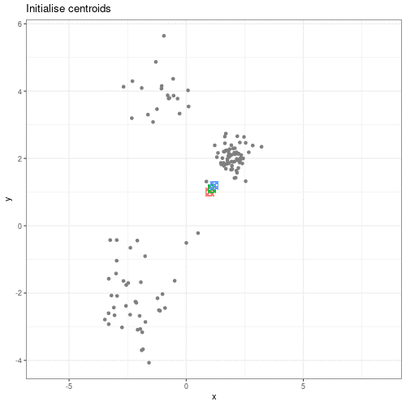
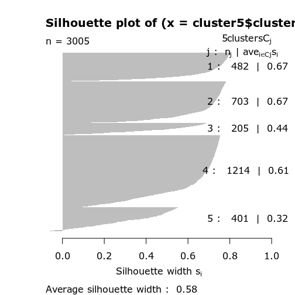

```{r settings, include=FALSE}
source("../bin/chunk-options.R")
knitr_fig_path("09-")
```

```{r pkgs, echo=FALSE}
## preamble
suppressPackageStartupMessages({
    library("scRNAseq")
    library("mixtools")
    library("irlba")
    library("scater")
    library("scuttle")
    library("scran")
    library("Rtsne")
    library("igraph")
    library("bluster")
    library("here")
})
theme_set(theme_bw())
```

# Introduction


# Believing in clusters

When doing clustering, it's important to realise that data may seem to
group together randomly. It's especially important to remember that when making
plots that add extra visual aids to distinguish clusters. For example, if we
cluster data from a single 2D normal distribution and draw ellipses around the
points, it suddenly is almost visually convincing. This is a somewhat extreme
example, since there is genuinely no heterogeneity in the data, but it does
reflect what can happen if you allow yourself to read too much into faint
signals.

```{r fake-cluster, echo = FALSE}
set.seed(11)
library("MASS")
data <- mvrnorm(n = 200, mu = rep(1, 2), Sigma = matrix(runif(4), ncol = 2))
data <- as.data.frame(data)
colnames(data) <- c("x", "y")

data$cluster <- ifelse(
    data$y < (data$x * -0.06 + 0.9),
    # data$x < 1.5 & data$y < 1,
    "a",
    ifelse(
        data$y < 1.15,
        "b",
        "c"
    )
)
ggplot(data, aes(x, y, colour = cluster)) +
    geom_point() +
    stat_ellipse()
```

> ## Exercise
> 
> 
> 
> > ## Solution
> > 
> > 
> {: .solution}
{: .challenge}

# K-means

K-means is an iterative algorithm a bit like the EM algorithm we covered in
the previous lesson. However, in K-means we're not concerned with fitting
distributions to the data. We are only interested in distances.
In K-means, we pick $k$ initial points as centres or "centroids" of our
clusters. There are a few ways to choose these initial "centroids",
but for simplicity let's imagine we just pick three random co-ordinates.
We then follow these two steps until convergence:

1. Assign each point to the cluster with the closest centroid.
2. Update centroid positions as the average of the points in that cluster.

We can see this process in action in this animation:

```{r kmeans-animation, echo = FALSE, fig.cap="Cap", fig.alt="Alt"}

```

> ## Initialisation
> 
> We saw in the previous episode that choosing random initialisations
> can be very problematic for EM algorithms like K-means.
> Some initialisation strategies are:
> 
> - Choose $K$ points at random from the data as the cluster centroids.
> - Randomly split the data into $K$ groups, and then average these groups.
> - kmeans++.
> 
> These each have advantages and disadvantages. In general, it's good to
> be aware that the and you should either choose a good initialisation method,
> initialise clusters manually, or run the algorithm from multiple different
> starting points.
>
{: .callout}

We'll again load the scRNAseq data and calculate the first principal components.

```{r data}
library("SingleCellExperiment")
library("scater")

scrnaseq <- readRDS(here::here("data/scrnaseq.rds"))
scrnaseq <- runPCA(scrnaseq, ncomponents = 15)
pcs <- reducedDim(scrnaseq)[, 1:2]
```

We can then run K-means on the PCs of the scRNAseq data.
```{r kmeans, fig.cap = "Title", fig.alt = "Alt"}
set.seed(42)
cluster <- kmeans(pcs, centers = 4)
scrnaseq$kmeans <- as.character(cluster$cluster)
plotReducedDim(scrnaseq, "PCA", colour_by = "kmeans")
```

We can see that this produces a sensible-looking partition of the data. 
However, is it totally clear whether there might be more or fewer clusters
here?

> ## Exercise
> 
> Cluster the data using a K of 5, and plot it with `plotReducedDim`.
> Save this with a variable name that's different to what we just used,
> because we'll use this again later.
> 
> > ## Solution
> > 
> > ```{r kmeans-ex}
> > set.seed(42)
> > cluster5 <- kmeans(pcs, centers = 5)
> > scrnaseq$kmeans5 <- as.character(cluster5$cluster)
> > plotReducedDim(scrnaseq, "PCA", colour_by = "kmeans5")
> > ```
> > 
> {: .solution}
{: .challenge}

> ## K-medioids (PAM)
> 
> One problem with K-means is that using the mean to define cluster centroids
> means that clusters can be very sensitive to outlying observations.
> K-medioids, also known as "partitioning around medioids" is similar to 
> K-means, but uses the median rather than the mean as the method for defining
> cluster centroids. 
> It has had popular application in genomics, for example the well-known
> PAM50 gene set in breast cancer, which has seen some prognostic application.
> 
> ```{r}
> x <- rnorm(20)
> y <- rnorm(20)
> x[10] <- x[10] + 10
> plot(x, y, pch = 16)
> points(mean(x), mean(y), pch = 16, col = "firebrick")
> points(median(x), median(y), pch = 16, col = "dodgerblue")
> ```
> 
{: .callout}


# Cluster separation

When performing clustering, it's important for us to be able to measure how
well our clusters are separated. One measure to test this is *silhouette width*.
For each data point, the silhouette width is the average distance
between this point and all other points in its cluster, relative to
the average distance of that point to the next closest cluster.
Ideally, we would have only large positive silhouette widths, indicating
that each data point is much more similar to than it is to the points in 
any other cluster. However, this is rarely the case. Often, points
clusters are very fuzzy, and even if we are relatively sure about
the existence of discrete groupings in the data, observations on the boundaries
can be difficult to confidently place in either cluster.

  
```{r silhouette, dev = "Cairo_png"}
library("cluster")
dist_mat <- dist(pcs)
sil <- silhouette(cluster$cluster, dist = dist_mat)
plot(sil)
```


```{r plot-silhouette}
pc <- as.data.frame(pcs)
colnames(pc) <- c("x", "y")
pc$sil <- sil[, "sil_width"]
pc$clust <- factor(cluster$cluster)
mean(sil[, "sil_width"])

ggplot(pc) +
    aes(x, y, shape = clust, colour = sil) +
    geom_point() +
    scale_colour_gradient2(
        low = "dodgerblue", high = "firebrick"
    ) +
    scale_shape_manual(
        values = setNames(1:4, 1:4)
    )
```


> ## Exercise
> 
> Calculate the silhouette width for the K of 5 clustering we did earlier.
> Is it better or worse than before?
>
> Can you identify where the differences lie?
> 
> > ## Solution
> > 
> > ```{r silhouette-ex}
> > sil5 <- silhouette(cluster5$cluster, dist = dist_mat)
> > scrnaseq$kmeans5 <- as.character(cluster5$cluster)
> > plotReducedDim(scrnaseq, "PCA", colour_by = "kmeans5")
> > mean(sil5[, "sil_width"])
> > ```
> > The average silhouette width is lower when k=5.
> > 
> > ```{r, eval=FALSE}
> > plot(sil5)
> > ```
> > ```{r, eval=FALSE, echo=FALSE}
> > ## this needs to be plotted manually or it gets an unmapped memory crash
> > cairoDevice::Cairo_png("fig/silhouette5.png")
> > plot(sil5)
> > dev.off()
> > ```
> > ```{r, echo=FALSE}
> > 
> > ```
> > This seems to be because some observations in clusters 3 and 5 seem to be
> > more similar to other clusters than the one they have been assigned to.
> > This may indicate that K is too high.
> {: .solution}
{: .challenge}


> ## Gap statistic
> 
> Another measure of how good our clustering is is the "gap statistic".
> This compares the observed squared distance between observations in a cluster
> and the centre of the cluster to an "expected" squared distances.
> The expected distances are calculated by randomly distributing cells within
> the range of the original data. Larger values represent lower
> squared distances within clusters, and thus better clustering.
> 
> 
> ```{r clusgap-call, eval = FALSE}
> library("cluster")
> gaps <- clusGap(pcs, kmeans, K.max = 20, iter.max = 20)
> best_k <- maxSE(gaps$Tab[, "gap"], gaps$Tab[, "SE.sim"])
> best_k
> plot(gaps$Tab[,"gap"], xlab = "Number of clusters", ylab = "Gap statistic")
> abline(v = best_k, col = "red")
> ```
{: .callout}


# Cluster robustness

When we cluster data, we want to be sure that the clusters we identify are
not a result of the exact properties fo the input data. That is, if the
data we observed were slightly different, the clusters we would identify
in this different data would be very similar. This makes it more
likely that these can be reproduced.

To assess this, we can use the *bootstrap*. What we do here is to take a sample
from the data with replacement. Sampling with replacement means that in the 
sample that we take, we can include points from the input data more than once.
This is maybe easier to see with an example. First, we define some data:

```{r bs-data}
data <- 1:5
```

Then, we can take a sample from this data without replacement:
```{r bs-sample}
sample(data, 5)
```

This sample is a subset of the original data, and points are only present once.
This is the case every time even if we do it many times:
```{r bs-sample-rep}
## Each column is a sample
replicate(10, sample(data, 5))
```

However, if we sample *with replacement*, then sometimes individual data points
are present more than once.

```{r bs-sample-replace}
replicate(10, sample(data, 5, replace = TRUE))
```


> ## Bootstrapping
> 
> The bootstrap is a powerful and common statistical technique.
> 
> We would like to know about the sampling distribution of a statistic,
> but we don't have any knowledge of its behaviour under the null hypothesis.
> 
> For example, we might want to understand the uncertainty around an estimate
> of the mean of our data. To do this, we could resample the data with
> replacement and calculate the mean of each average.
> 
> ```{r boots}
> boots <- replicate(1000, mean(sample(data, 5, replace = TRUE)))
> hist(boots,
>     breaks = "FD",
>     main = "1,000 bootstrap samples",
>     xlab = "Mean of sample"
> )
> ```
> 
> In this case, the example is simple, but it's possible to
> devise more complex statistical tests using this kind of approach.
> 
> The bootstrap, along with permutation testing, can be a very flexible and 
> general solution to many statistical problems.
> 
{: .callout}

In applying the bootstrap to clustering, we want to see two things:
1. Will observations within a cluster will consistently cluster together in
   different bootstrap replicates?
2. Will observations frequently swap between clusters?

In the plot below, the diagonal of the plot shows how often the clusters
are reproduced in boostrap replicates. High scores on
the diagonal mean that the clusters are consistently reproduced in each 
boostrap replicate. Similarly, the off-diagonal elements represent how often
observations swap between clusters in bootstrap replicates. High scores 
indicate that observations rarely swap between clusters.

```{r bs-heatmap}
library("pheatmap")
library("bluster")
library("viridis")

km_fun <- function(x) {
    kmeans(x, centers = 4)$cluster
}
ratios <- bootstrapStability(pcs, FUN = km_fun, clusters = cluster$cluster)
pheatmap(ratios,
    cluster_rows = FALSE, cluster_cols = FALSE,
    col = viridis(10),
    breaks = seq(0, 1, length.out = 10)
)
```

> ## Exercise
>
> Repeat the bootstrapping process with K=5. Are the results better or worse?
> Can you identify where the differences occur on the `plotReducedDim`?
> 
> > ## Solution
> > 
> > ```{r bs-ex}
> > km_fun5 <- function(x) {
> >     kmeans(x, centers = 5)$cluster
> > }
> > set.seed(42)
> > ratios5 <- bootstrapStability(pcs, FUN = km_fun5, clusters = cluster5$cluster)
> > pheatmap(ratios5,
> >     cluster_rows = FALSE, cluster_cols = FALSE,
> >     col = viridis(10),
> >     breaks = seq(0, 1, length.out = 10)
> > )
> > ```
> > When K=5, we can see that the values on the diagonal of the matrix are 
> > smaller, indicating that the clusters aren't exactly reproducible in the
> > bootstrap samples. 
> > 
> > Similarly, the off-diagonal elements are considerably lower for some
> > elements.
> > This indicates that observations are "swapping" between these clusters
> > in bootstrap replicates.
> {: .solution}
{: .challenge}


> ## Consensus clustering
> 
> One useful and generic method of clustering is *consensus clustering*.
> This method can use k-means, mixture models, or other methods.
> 
> The idea behind this is to bootstrap the data repeatedly, and cluster
> it each time, perhaps using different numbers of clusters.
> If a pair of data points always end up in the same cluster,
> it's likely that they really belong to the same underlying cluster.
> 
> This is really computationally demanding but has been shown to perform very
> well in some situations. It also allows you to visualise how cluster
> membership changes over different values of K.
> 
{: .callout}


> ## Speed
> 
> It's worth noting that a lot of the methods we've discussed here are very
> computationally demanding. 
> When clustering data, we may have to compare points to each other many times.
> This becomes more and more difficult when we have many observations and
> many features. This is especially problematic when we want to do things like
> bootstrapping that requires us to cluster the data over and over.
> 
> As a result, there are a lot of approximate methods for finding clusters
> in the data. For example, the
> [mbkmeans](http://www.bioconductor.org/packages/3.13/bioc/html/mbkmeans.html)
> package includes a for extremely large data. The idea behind this algorithm
> is that if the clusters we find are robust, we don't need to look at all of
> the data every time. This is very helpful because it reduces the amount of
> data that needs to be held in memory at once, but also because the 
> computational cost of .
> 
> Similarly, approximate nearest neighbour methods like 
> [Annoy](https://pypi.org/project/annoy/) can be used to identify what the
> $K$ closest points are in the data, and this can be used in some clustering 
> methods (for example, graph-based clustering).
> 
> Generally, these methods sacrifice a bit of accuracy for a big gain in speed.
{: .callout}


## Further reading

- https://web.stanford.edu/class/bios221/book/Chap-Clustering.html




