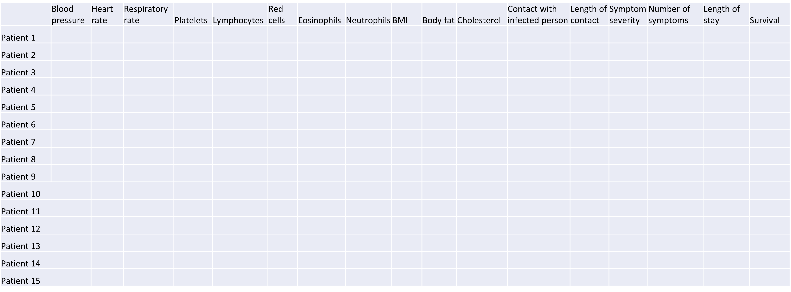

```{r, echo=FALSE, message=FALSE}
library("here")
```
# plot of chunk table-intro
```{r, out.width="100%", echo=FALSE}
# , fig.cap='
knitr::include_graphics(here("fig/intro-table.png"))
```

---
# plot of chunk pairs-prostate
```{r, out.width="100%", echo=FALSE}
# , fig.cap='plot of chunk pairs-prostate
knitr::include_graphics(here("fig/rmd-01-pairs-prostate-1.png"))
```

---
# plot of chunk intro-figure
```{r, out.width="100%", echo=FALSE}
# , fig.cap='
knitr::include_graphics(here("fig/intro-scatterplot.png"))
```

---
# plot of chunk plot-lm
```{r, out.width="100%", echo=FALSE}
# , fig.cap='plot of chunk plot-lm
knitr::include_graphics(here("fig/rmd-01-plot-lm-4.png"))
```

---
# plot of chunk plot-random
```{r, out.width="100%", echo=FALSE}
# , fig.cap='plot of chunk plot-random
knitr::include_graphics(here("fig/rmd-01-plot-random-1.png"))
```

---
# plot of chunk plot-random
```{r, out.width="100%", echo=FALSE}
# , fig.cap='plot of chunk plot-random
knitr::include_graphics(here("fig/rmd-01-plot-random-2.png"))
```

---
# plot of chunk plot-random
```{r, out.width="100%", echo=FALSE}
# , fig.cap='plot of chunk plot-random
knitr::include_graphics(here("fig/rmd-01-plot-random-3.png"))
```

---
