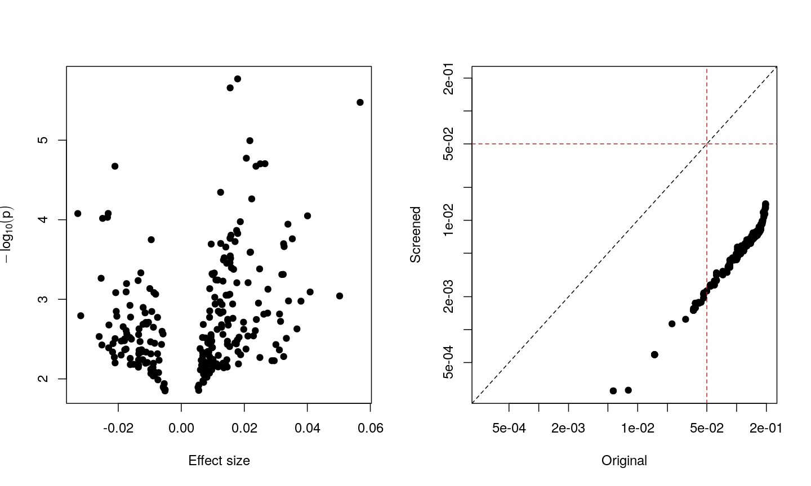
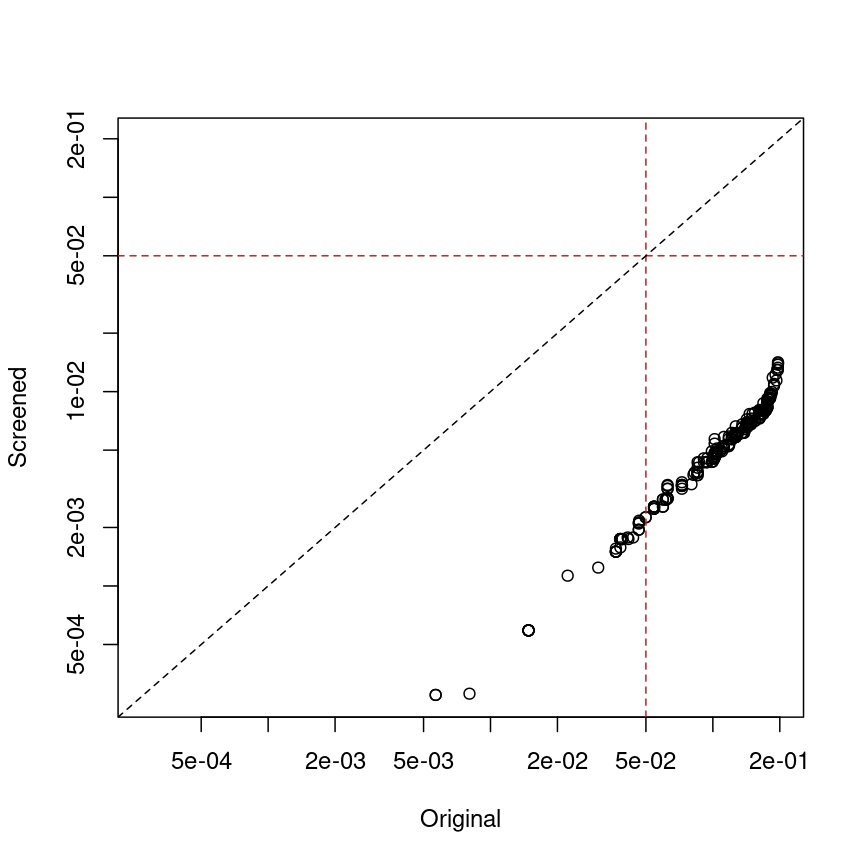
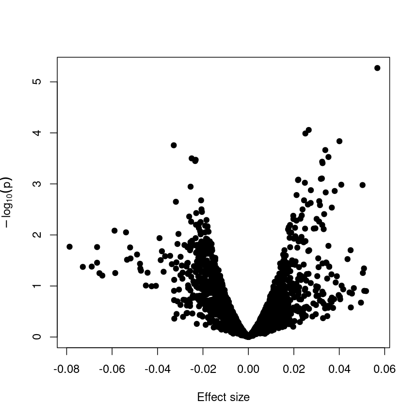
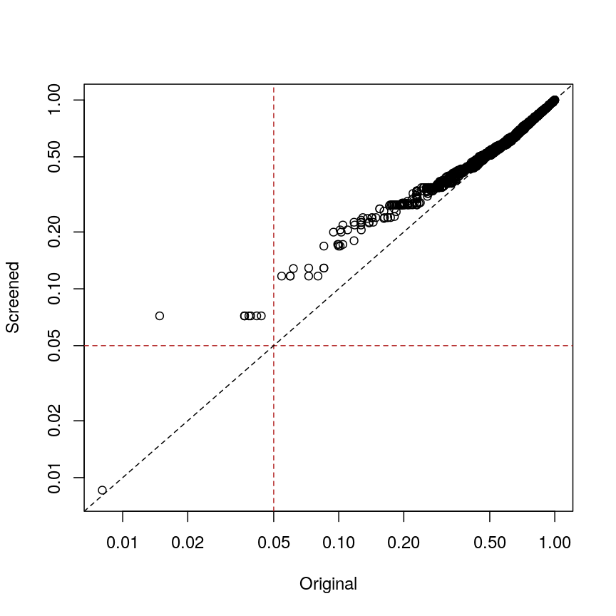

```{r, echo=FALSE, message=FALSE}
library("here")
```
# A scatter plot of age and a feature of interest.
```{r, out.width="0.5\\textwidth", echo=FALSE'}
# , fig.cap='An example of a strong linear association between a continuous phenotype (age) on the x-axis and a feature of interest (gene expression for a given gene) on the y-axis. A strong linear relationship with a positive slope exists between the two.
knitr::include_graphics(here("fig/rmd-02-example1-1.png"))
```

\newpage
# A scatter plot of a grouping and a feature of interest.
```{r, out.width="0.5\\textwidth", echo=FALSE'}
# , fig.cap='An example of a strong linear association between a discrete phenotype (group) on the x-axis and a feature of interest (gene expression for a given gene) on the y-axis. The two groups clearly differ with respect to gene expression.
knitr::include_graphics(here("fig/rmd-02-example2-1.png"))
```

\newpage
# A scatter plot of a grouping and a feature of interest.
```{r, out.width="0.5\\textwidth", echo=FALSE'}
# , fig.cap='An example of a strong linear association between a discrete phenotype (group) on the x-axis and a feature of interest (gene expression for a given gene) on the y-axis. The two groups seem to differ with respect to gene expression, but the relationship is weak.
knitr::include_graphics(here("fig/rmd-02-example3-1.png"))
```

\newpage
# Regression is like a normal distribution with varying mean.
```{r, out.width="0.5\\textwidth", echo=FALSE'}
# , fig.cap='The generative model of a simple linear regression with a fixed slope and intercept. Lightly shaded regions represent regions where observations are probable, and darker regions represent lower probability.
knitr::include_graphics(here("fig/rmd-02-conditionalprob-1.png"))
```

\newpage
# The p-value for a regression coefficient represents how often it'd be observed under the null.
```{r, out.width="0.5\\textwidth", echo=FALSE'}
# , fig.cap='Density plot of a t-distribution showing the observed test statistics (here, t-statistics). The p-values, visualised here with shaded regions, represent the portion of the null distribution that is as extreme or more extreme as the observed test statistics, which are shown as dashed lines.
knitr::include_graphics(here("fig/rmd-02-tdist-1.png"))
```

\newpage
# Relationships can be significant with small noise and small effects.
```{r, out.width="0.5\\textwidth", echo=FALSE'}
# , fig.cap='An example of a linear relationship for 100 points with a small amount of noise and small effect sizes that is statistically significant.
knitr::include_graphics(here("fig/rmd-02-regex1-1.png"))
```

\newpage
# Relationships can be non-significant with large noise and large effects.
```{r, out.width="0.5\\textwidth", echo=FALSE'}
# , fig.cap='An example of a linear relationship for 100 points with a large amount of noise and large effect sizes that is not statistically significant.
knitr::include_graphics(here("fig/rmd-02-regex2-1.png"))
```

\newpage
# With few points, relationships can be non-significant with large noise and large effects.
```{r, out.width="0.5\\textwidth", echo=FALSE'}
# , fig.cap='An example of a linear relationship for 10 points with a large amount of noise and large effect sizes that is not statistically significant.
knitr::include_graphics(here("fig/rmd-02-regex3-1.png"))
```

\newpage
# With few points, relationships can be significant with small noise and small effects.
```{r, out.width="0.5\\textwidth", echo=FALSE'}
# , fig.cap='An example of a linear relationship for 10 points with a small amount of noise and small effect sizes that is statistically significant.
knitr::include_graphics(here("fig/rmd-02-regex4-1.png"))
```

\newpage
# With many points, relationships can be significant with large noise and small effects.
```{r, out.width="0.5\\textwidth", echo=FALSE'}
# , fig.cap='An example of a linear relationship for 1,000 points with a large amount of noise and small effect sizes that is statistically significant.
knitr::include_graphics(here("fig/rmd-02-regex5-1.png"))
```

\newpage
# With many points, relationships can be significant with small noise and tiny effects.
```{r, out.width="0.5\\textwidth", echo=FALSE'}
# , fig.cap='An example of a linear relationship for 1,000 points with a small amount of noise and small effect sizes that is statistically significant.
knitr::include_graphics(here("fig/rmd-02-regex6-1.png"))
```

\newpage
# Methylation levels are generally bimodally distributed.
```{r, out.width="0.5\\textwidth", echo=FALSE'}
# , fig.cap='Histogram of M-values for all features. The distribution appears to be bimodal, with a large number of unmethylated features as well as many methylated features, and many intermediate features.
knitr::include_graphics(here("fig/rmd-02-histx-1.png"))
```

\newpage
# Visualising the data as a heatmap, it's clear that there's too many models to fit 'by hand'.
```{r, out.width="0.5\\textwidth", echo=FALSE'}
# , fig.cap='Heatmap of methylation values across all features. Samples are ordered according to age.
knitr::include_graphics(here("fig/rmd-02-heatmap-1.png"))
```

\newpage
# Plotting significance against effect size, it's clear that the two are related (but not 1-1).
```{r, out.width="0.5\\textwidth", echo=FALSE'}
# , fig.cap='Plot of -log10(p) against effect size estimates for a regression of age against methylation level for each feature in the data.
knitr::include_graphics(here("fig/rmd-02-volcplot1-1.png"))
```

\newpage
# Plotting p-values against effect sizes for a randomised outcome shows we still observe 'significant' results.
```{r, out.width="0.5\\textwidth", echo=FALSE'}
# , fig.cap='Plot of -log10(p) against effect size estimates for a regression of a made-up feature against methylation level for each feature in the data. A dashed line represents a 0.05 significance level.
knitr::include_graphics(here("fig/rmd-02-volcplotfake-1.png"))
```

\newpage
# Bonferroni correction often produces very large p-values, especially with low sample sizes.
```{r, out.width="0.5\\textwidth", echo=FALSE'}
# , fig.cap='Plot of Bonferroni-adjusted p-values (y) against unadjusted p-values (x). A dashed black line represents the identity (where x=y), while dashed red lines represent 0.05 significance thresholds.
knitr::include_graphics(here("fig/rmd-02-p-fwer-1.png"))
```

\newpage
# Benjamini-Hochberg correction is less conservative than Bonferroni
```{r, out.width="0.5\\textwidth", echo=FALSE'}
# , fig.cap='Plot of Benjamini-Hochberg-adjusted p-values (y) against unadjusted p-values (x). A dashed black line represents the identity (where x=y), while dashed red lines represent 0.05 significance thresholds.
knitr::include_graphics(here("fig/rmd-02-p-fdr-1.png"))
```

\newpage
# Plotting p-values against effect sizes using limma; the results are similar to a standard linear model.
```{r, out.width="0.5\\textwidth", echo=FALSE'}
# , fig.cap='A plot of -log10(p) against effect size estimates for a regression of age against methylation using limma.
knitr::include_graphics(here("fig/rmd-02-limmavolc1-1.png"))
```

\newpage
# A plot of significance against effect size for a regression of smoking against methylation.
```{r, out.width="0.5\\textwidth", echo=FALSE'}
# , fig.cap='A plot of -log10(p) against effect size estimates for a regression of smoking status against methylation using limma.
knitr::include_graphics(here("fig/rmd-02-limmavolc2-1.png"))
```

\newpage
# 
```{r, out.width="0.5\\textwidth", echo=FALSE'}
# , fig.cap='
knitr::include_graphics("))
```

\newpage
# 
```{r, out.width="0.5\\textwidth", echo=FALSE'}
# , fig.cap='
knitr::include_graphics("))
```

\newpage
# > 
```{r, out.width="0.5\\textwidth", echo=FALSE'}
# , fig.cap='> 
knitr::include_graphics(> "))
```

\newpage
# > 
```{r, out.width="0.5\\textwidth", echo=FALSE'}
# , fig.cap='> 
knitr::include_graphics(> "))
```

\newpage
