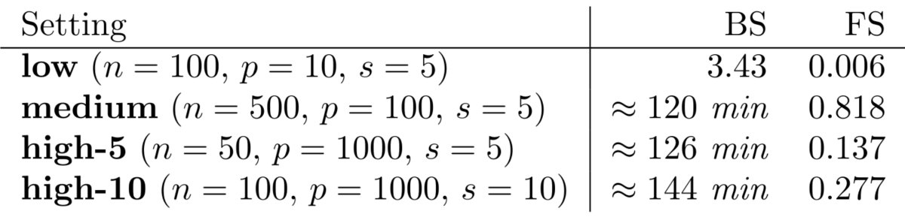

```{r, echo=FALSE, message=FALSE}
library("here")
```
# 
```{r, out.width="0.5\\textwidth", echo=FALSE'}
# , fig.cap='
knitr::include_graphics("))
```

\newpage
# 
```{r, out.width="0.5\\textwidth", echo=FALSE'}
# , fig.cap='
knitr::include_graphics("))
```

\newpage
# > 
```{r, out.width="0.5\\textwidth", echo=FALSE'}
# , fig.cap='> 
knitr::include_graphics(> "))
```

\newpage
