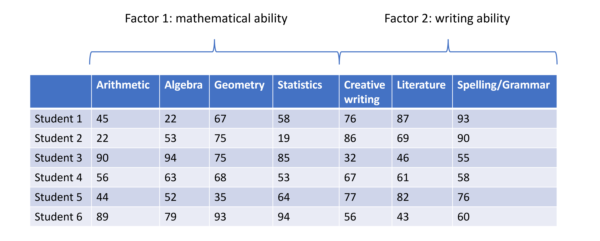

```{r, echo=FALSE, message=FALSE}
library("here")
```
# plot of chunk table
```{r, out.width="100%", echo=FALSE}
# , fig.cap='
knitr::include_graphics(here("fig/table_for_fa.png"))
```

---
# plot of chunk biplot
```{r, out.width="100%", echo=FALSE}
# , fig.cap='plot of chunk biplot
knitr::include_graphics(here("fig/rmd-06-biplot-1.png"))
```

---
