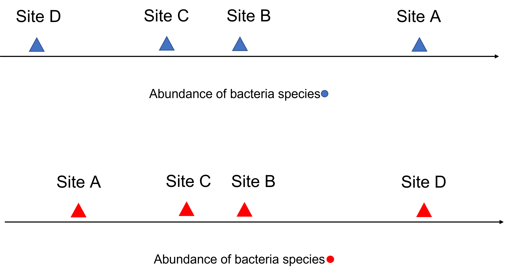
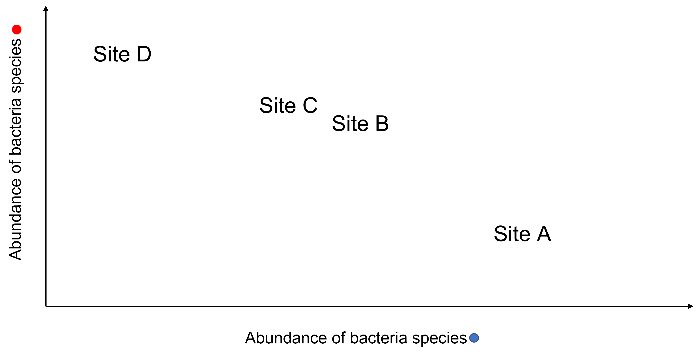

```{r, echo=FALSE, message=FALSE}
library("here")
```
# plot of chunk schematic
```{r, out.width="100%", echo=FALSE}
# , fig.cap='
knitr::include_graphics(here("fig/microbiome_schematic.png"))
```

---
# plot of chunk species-site1d
```{r, out.width="100%", echo=FALSE}
# , fig.cap='
knitr::include_graphics(here("fig/one_dimension_species_vs_site.png"))
```

---
# plot of chunk species-site2d
```{r, out.width="100%", echo=FALSE}
# , fig.cap='
knitr::include_graphics(here("fig/two_dimension_species_vs_site.png"))
```

---
# plot of chunk stressplot
```{r, out.width="100%", echo=FALSE}
# , fig.cap='plot of chunk stressplot
knitr::include_graphics(here("fig/rmd-07-stressplot-1.png"))
```

---
# plot of chunk k-ex
```{r, out.width="100%", echo=FALSE}
# , fig.cap='plot of chunk k-ex
knitr::include_graphics(here("fig/rmd-07-k-ex-1.png"))
```

---
# plot of chunk ordplot1
```{r, out.width="100%", echo=FALSE}
# , fig.cap='plot of chunk ordplot1
knitr::include_graphics(here("fig/rmd-07-ordplot1-1.png"))
```

---
# plot of chunk ordplot2
```{r, out.width="100%", echo=FALSE}
# , fig.cap='plot of chunk ordplot2
knitr::include_graphics(here("fig/rmd-07-ordplot2-1.png"))
```

---
# plot of chunk ordplot3
```{r, out.width="100%", echo=FALSE}
# , fig.cap='plot of chunk ordplot3
knitr::include_graphics(here("fig/rmd-07-ordplot3-1.png"))
```

---
# plot of chunk ordplot-ex
```{r, out.width="100%", echo=FALSE}
# , fig.cap='plot of chunk ordplot-ex
knitr::include_graphics(here("fig/rmd-07-ordplot-ex-1.png"))
```

---
# plot of chunk ordplot-ex
```{r, out.width="100%", echo=FALSE}
# , fig.cap='plot of chunk ordplot-ex
knitr::include_graphics(here("fig/rmd-07-ordplot-ex-2.png"))
```

---
# plot of chunk ordplot-ex
```{r, out.width="100%", echo=FALSE}
# , fig.cap='plot of chunk ordplot-ex
knitr::include_graphics(here("fig/rmd-07-ordplot-ex-3.png"))
```

---
# plot of chunk ordplot-ex
```{r, out.width="100%", echo=FALSE}
# , fig.cap='plot of chunk ordplot-ex
knitr::include_graphics(here("fig/rmd-07-ordplot-ex-4.png"))
```

---
# plot of chunk ordplots-123
```{r, out.width="100%", echo=FALSE}
# , fig.cap='plot of chunk ordplots-123
knitr::include_graphics(here("fig/rmd-07-ordplots-123-1.png"))
```

---
# plot of chunk ordplots-123
```{r, out.width="100%", echo=FALSE}
# , fig.cap='plot of chunk ordplots-123
knitr::include_graphics(here("fig/rmd-07-ordplots-123-2.png"))
```

---
# plot of chunk ordplots-123
```{r, out.width="100%", echo=FALSE}
# , fig.cap='plot of chunk ordplots-123
knitr::include_graphics(here("fig/rmd-07-ordplots-123-3.png"))
```

---
