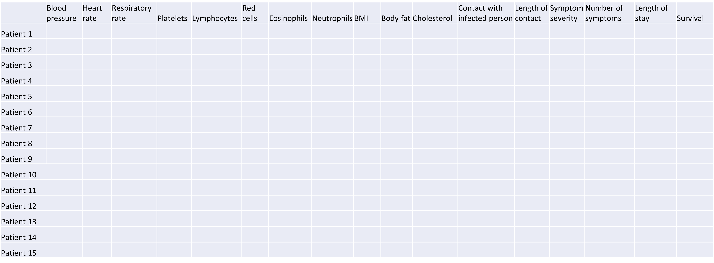
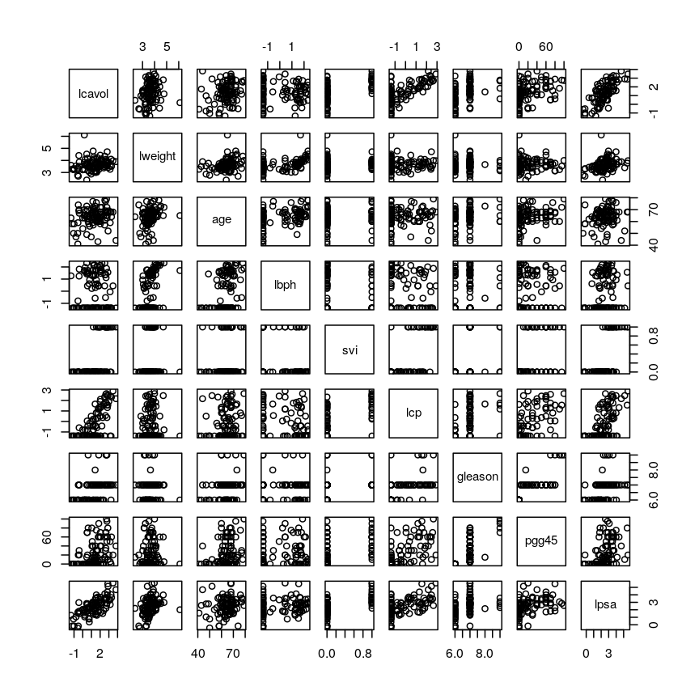
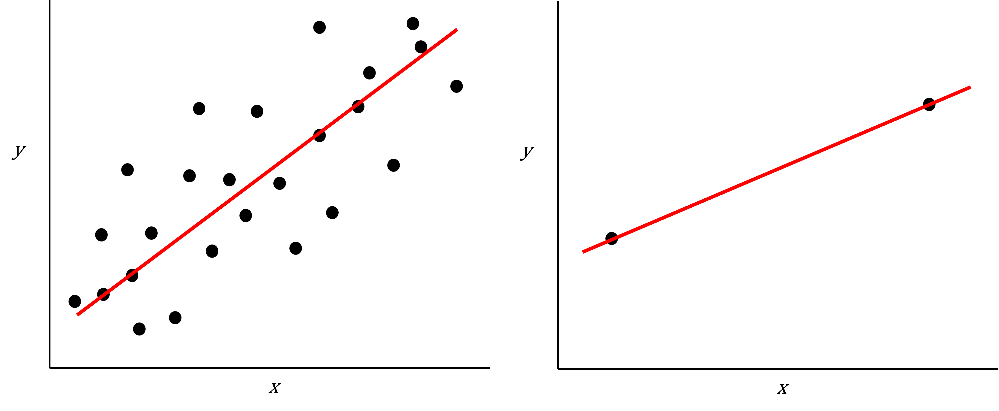

---
# Please do not edit this file directly; it is auto generated.
# Instead, please edit 01-introduction-to-high-dimensional-data.md in _episodes_rmd/
title: "Introduction to high-dimensional data"
author: "GS Robertson"
source: Rmd
teaching: 20
exercises: 20
questions:
- What are high-dimensional data and what do these data look like in the
  biosciences?
- What are the challenges when analysing high-dimensional data?
- What statistical methods are suitable for analysing these data?
- How can Bioconductor be used to access high-dimensional data in the
  biosciences?
objectives:
- Explore examples of high-dimensional data in the biosciences.
- Appreciate challenges involved in analysing high-dimensional data.
- Explore different statistical methods used for analysing high-dimensional data.
- Work with example data created from biological studies.
keypoints:
- High-dimensional data are data in which the number of features, $p$, are close
  to or larger than the number of observations, $n$.
- These data are becoming more common in the biological sciences due to
  increases in data storage capabilities and computing power.
- Standard statistical methods, such as linear regression, run into difficulties
  when analysing high-dimensional data.
- In this workshop, we will explore statistical methods used for analysing
  high-dimensional data using datasets available on Bioconductor.
math: yes
---

# What are high-dimensional data? 

*High-dimensional data* are defined as data in which the number of features (variables observed),
$p$, are close to or larger than the number of observations (or data points), $n$.
The opposite is *low-dimensional data* in which the number of observations,
$n$, far outnumbers the number of features, $p$. A related concept is *wide data*, which
refers to data with numerous features irrespective of the number of observations (similarly,
*tall data* is often used to denote data with a large number of observations).
Analyses of high-dimensional data require consideration of potential problems that
come from having more features than observations.

High-dimensional data have become more common in many scientific fields as new
automated data collection techniques have been developed. More and more datasets
have a large number of features and some have as many features as there are rows
in the dataset. Datasets in which $p$>=$n$ are becoming more common. Such datasets
pose a challenge for data analysis as standard methods of analysis, such as linear
regression, are no longer appropriate.

High-dimensional datasets are common in the biological sciences. Subjects like
genomics and medical sciences often use both tall (in terms of $n$) and wide
(in terms of $p$) datasets that can be difficult to analyse or visualise using
standard statistical tools. An example of high-dimensional data in biological
sciences may include data collected from hospital patients recording symptoms,
blood test results, behaviours, and general health, resulting in datasets with
large numbers of features. Researchers often want to relate these features to
specific patient outcomes (e.g. survival, length of time spent in hospital).
An example of what high-dimensional data might look like in a biomedical study
is shown in the figure below. 

plot of chunk table-intro

> ## Challenge 1 
> 
> Descriptions of three research questions and their datasets are given below.
> Which of these are considered to have high-dimensional data?
> 
> 1. Predicting patient blood pressure using: cholesterol level in blood, age,
>    and BMI measurements, collected from 100 patients.
> 2. Predicting patient blood pressure using: cholesterol level in blood, age,
>    and BMI, as well as information on 200,000 single nucleotide polymorphisms
>    from 100 patients.
> 3. Predicting the length of time patients spend in hospital with pneumonia infection
>    using: measurements on age, BMI, length of time with symptoms,
>    number of symptoms, and percentage of neutrophils in blood, using data
>    from 200 patients.
> 4. Predicting probability of a patient's cancer progressing using gene
>    expression data from 20,000 genes, as well as data associated with general patient health
>    (age, weight, BMI, blood pressure) and cancer growth (tumour size,
>    localised spread, blood test results).
> 
> > ## Solution
> > 
> > 1. No. The number of observations (100 patients) is far greater than the number of features (3).
> > 2. Yes, this is an example of high-dimensional data. There are only 100 observations but 200,000+3 features.
> > 3. No. There are many more observations (200 patients) than features (5). 
> > 4. Yes. There is only one observation of more than 20,000 features.
> {: .solution}
{: .challenge}

Now that we have an idea of what high-dimensional data look like we can think
about the challenges we face in analysing them.

# Challenges in dealing with high-dimensional data 

Most classical statistical methods are set up for use on low-dimensional data
(i.e. data where the number of observations $n$ is much larger than the number
of features $p$). This is because low-dimensional data were much more common in
the past when data collection was more difficult and time consuming. In recent
years advances in information technology have allowed large amounts of data to
be collected and stored with relative ease. This has allowed large numbers of
features to be collected, meaning that datasets in which $p$ matches or exceeds
$n$ are common (collecting observations is often more difficult or expensive
than collecting many features from a single observation).

Datasets with large numbers of features are difficult to visualise. When
exploring low-dimensional datasets, it is possible to plot the response variable
against each of the limited number of explanatory variables to get an idea which
of these are important predictors of the response. With high-dimensional data
the large number of explanatory variables makes doing this difficult. In some
high-dimensional datasets it can also be difficult to identify a single response
variable, making standard data exploration and analysis techniques less useful.

Let's have a look at a simple dataset with lots of features to understand some
of the challenges we are facing when working with high-dimensional data.

> ## Challenge 2 
> 
> Load the `Prostate` dataset as follows:
>
> 
> ~~~
> library("here")
> Prostate <- readRDS(here("data/prostate.rds"))
> ~~~
> {: .language-r}
> 
> Although technically not a high-dimensional dataset, the `Prostate` data
> will allow us explore the problems encountered when working with many features.
>
> Examine the dataset (in which each row represents a single patient) to:
> a) Determine how many observations ($n$) and features ($p$) are available (hint: see the `dim()` function) 
> b) Examine what variables were measured (hint: see the `names()` and `head()` functions)
> c) Plot the relationship between the variables (hint: see the `pairs()` function). 
> 
> > ## Solution
> > 
> > 
> > 
> > ~~~
> > dim(Prostate)   #print the number of rows and columns
> > ~~~
> > {: .language-r}
> >
> > 
> > ~~~
> > names(Prostate) # examine the variable names
> > head(Prostate)   #print the first 6 rows
> > ~~~
> > {: .language-r}
> > 
> > 
> > ~~~
> > names(Prostate)  #examine column names
> > ~~~
> > {: .language-r}
> > 
> > 
> > 
> > ~~~
> >  [1] "X"       "lcavol"  "lweight" "age"     "lbph"    "svi"     "lcp"    
> >  [8] "gleason" "pgg45"   "lpsa"   
> > ~~~
> > {: .output}
> > 
> > 
> > 
> > ~~~
> > pairs(Prostate)  #plot each pair of variables against each other
> > ~~~
> > {: .language-r}
> > 
> > 

> > 
> > 
plot of chunk pairs-prostate

> > 

> > The `pairs()` function plots relationships between each of the variables in
> > the `Prostate` dataset. This is possible for datasets with smaller numbers
> > of variables, but for datasets in which $p$ is larger it becomes difficult
> > (and time consuming) to visualise relationships between all variables in the
> > dataset. Even where visualisation is possible, fitting models to datasets
> > with many variables is difficult due to the potential for
> > overfitting and difficulties in identifying a response variable.
> > 
> {: .solution}
{: .challenge}

> ## Locating data with R - the **`here`** package
> 
> It is often desirable to access external datasets from inside R and to write 
> code that does this reliably on different computers. While R has an inbulit 
> function `setwd()` that can be used to denote where external datasets are 
> stored, this usually requires the user to adjust the code to their specific 
> system and folder structure. The **`here`** package is meant to be used in R 
> projects. It allows users to specify the data location relative to the R 
> project directory. This makes R code more portable and can contribute to 
> improve the reproducibility of an analysis.
{: .callout}

Imagine we are carrying out least squares regression on a dataset with 25
observations. Fitting a best fit line through these data produces a plot shown
in the left-hand panel of the figure below.

However, imagine a situation in which the number of observations and features in a
dataset are almost equal. In that situation the effective number of observations
per features is low. The result of fitting a best fit line through
few observations can be seen in the right-hand panel below.

plot of chunk intro-figure

In the first situation, the least squares regression line does not fit the data
perfectly and there is some error around the regression line. But, when there are
only two observations the regression line will fit through the points exactly,
resulting in overfitting of the data. This suggests that carrying out least
squares regression on a dataset with few data points per feature would result
in difficulties in applying the resulting model to further datsets. This is a
common problem when using regression on high-dimensional datasets.

Another problem in carrying out regression on high-dimensional data is dealing
with correlations between explanatory variables. The large numbers of features
in these datasets makes high correlations between variables more likely.

> ## Challenge 3
> 
> Use the `cor()` function to examine correlations between all variables in the 
> `Prostate` dataset. Are some pairs of variables highly correlated (i.e. 
> correlation coefficients > 0.6)?
>
> Use the `lm()` function to fit univariate regression models to predict patient 
> age using two variables that are highly correlated as predictors. Which of 
> these variables are statistically significant predictors of age? Hint: the
> `summary()` function can help here. 
> 
> Fit a multiple linear regression model predicting patient age using both
> variables. What happened?
> 
> > ## Solution
> >
> > Create a correlation matrix of all variables in the Prostate dataset
> >
> > 
> > ~~~
> > cor(Prostate)
> > ~~~
> > {: .language-r}
> > 
> > 
> > 
> > ~~~
> >                 X    lcavol      lweight       age         lbph         svi
> > X       1.0000000 0.7111363  0.350443662 0.1965557  0.167928486  0.56678035
> > lcavol  0.7111363 1.0000000  0.194128286 0.2249999  0.027349703  0.53884500
> > lweight 0.3504437 0.1941283  1.000000000 0.3075286  0.434934636  0.10877851
> > age     0.1965557 0.2249999  0.307528614 1.0000000  0.350185896  0.11765804
> > lbph    0.1679285 0.0273497  0.434934636 0.3501859  1.000000000 -0.08584324
> > svi     0.5667803 0.5388450  0.108778505 0.1176580 -0.085843238  1.00000000
> > lcp     0.5336960 0.6753105  0.100237795 0.1276678 -0.006999431  0.67311118
> > gleason 0.3936079 0.4324171 -0.001275658 0.2688916  0.077820447  0.32041222
> > pgg45   0.4497267 0.4336522  0.050846821 0.2761124  0.078460018  0.45764762
> > lpsa    0.9581149 0.7344603  0.354120390 0.1695928  0.179809410  0.56621822
> >                  lcp      gleason      pgg45      lpsa
> > X        0.533696039  0.393607939 0.44972672 0.9581149
> > lcavol   0.675310484  0.432417056 0.43365225 0.7344603
> > lweight  0.100237795 -0.001275658 0.05084682 0.3541204
> > age      0.127667752  0.268891599 0.27611245 0.1695928
> > lbph    -0.006999431  0.077820447 0.07846002 0.1798094
> > svi      0.673111185  0.320412221 0.45764762 0.5662182
> > lcp      1.000000000  0.514830063 0.63152825 0.5488132
> > gleason  0.514830063  1.000000000 0.75190451 0.3689868
> > pgg45    0.631528245  0.751904512 1.00000000 0.4223159
> > lpsa     0.548813169  0.368986803 0.42231586 1.0000000
> > ~~~
> > {: .output}
> > 
> > 
> > 
> > ~~~
> > round(cor(Prostate), 2) # rounding helps to visualise the correlations
> > ~~~
> > {: .language-r}
> > 
> > 
> > 
> > ~~~
> >            X lcavol lweight  age  lbph   svi   lcp gleason pgg45 lpsa
> > X       1.00   0.71    0.35 0.20  0.17  0.57  0.53    0.39  0.45 0.96
> > lcavol  0.71   1.00    0.19 0.22  0.03  0.54  0.68    0.43  0.43 0.73
> > lweight 0.35   0.19    1.00 0.31  0.43  0.11  0.10    0.00  0.05 0.35
> > age     0.20   0.22    0.31 1.00  0.35  0.12  0.13    0.27  0.28 0.17
> > lbph    0.17   0.03    0.43 0.35  1.00 -0.09 -0.01    0.08  0.08 0.18
> > svi     0.57   0.54    0.11 0.12 -0.09  1.00  0.67    0.32  0.46 0.57
> > lcp     0.53   0.68    0.10 0.13 -0.01  0.67  1.00    0.51  0.63 0.55
> > gleason 0.39   0.43    0.00 0.27  0.08  0.32  0.51    1.00  0.75 0.37
> > pgg45   0.45   0.43    0.05 0.28  0.08  0.46  0.63    0.75  1.00 0.42
> > lpsa    0.96   0.73    0.35 0.17  0.18  0.57  0.55    0.37  0.42 1.00
> > ~~~
> > {: .output}
> > 
> > As seen above, some variables are highly correlated. In particular, the 
> > correlation between `gleason` and `pgg45` is equal to 0.75.
> > 
> > Fitting univariate regression models to predict age using gleason and pgg45
> > as predictors.
> > 
> > 
> > ~~~
> > model1 <- lm(age ~ gleason, data = Prostate)
> > model2 <- lm(age ~ pgg45, data = Prostate)
> > ~~~
> > {: .language-r}
> >
> > Check which covariates have a significant efffect
> >
> > 
> > ~~~
> > summary(model1)
> > ~~~
> > {: .language-r}
> > 
> > 
> > 
> > ~~~
> > 
> > Call:
> > lm(formula = age ~ gleason, data = Prostate)
> > 
> > Residuals:
> >     Min      1Q  Median      3Q     Max 
> > -20.780  -3.552   1.448   4.220  13.448 
> > 
> > Coefficients:
> >             Estimate Std. Error t value Pr(>|t|)    
> > (Intercept)   45.146      6.918   6.525 3.29e-09 ***
> > gleason        2.772      1.019   2.721  0.00774 ** 
> > ---
> > Signif. codes:  0 '***' 0.001 '**' 0.01 '*' 0.05 '.' 0.1 ' ' 1
> > 
> > Residual standard error: 7.209 on 95 degrees of freedom
> > Multiple R-squared:  0.0723,	Adjusted R-squared:  0.06254 
> > F-statistic: 7.404 on 1 and 95 DF,  p-value: 0.007741
> > ~~~
> > {: .output}
> > 
> > 
> > 
> > ~~~
> > summary(model2)
> > ~~~
> > {: .language-r}
> > 
> > 
> > 
> > ~~~
> > 
> > Call:
> > lm(formula = age ~ pgg45, data = Prostate)
> > 
> > Residuals:
> >      Min       1Q   Median       3Q      Max 
> > -21.0889  -3.4533   0.9111   4.4534  15.1822 
> > 
> > Coefficients:
> >             Estimate Std. Error t value Pr(>|t|)    
> > (Intercept) 62.08890    0.96758   64.17  < 2e-16 ***
> > pgg45        0.07289    0.02603    2.80  0.00619 ** 
> > ---
> > Signif. codes:  0 '***' 0.001 '**' 0.01 '*' 0.05 '.' 0.1 ' ' 1
> > 
> > Residual standard error: 7.193 on 95 degrees of freedom
> > Multiple R-squared:  0.07624,	Adjusted R-squared:  0.06651 
> > F-statistic:  7.84 on 1 and 95 DF,  p-value: 0.006189
> > ~~~
> > {: .output}
> >
> > Based on these results we conclude that both `gleason` and `pgg45` have a 
> > statistically significan univariate effect (also referred to as a marginal
> > effect) as predictors of age (5% significance level). 
> >
> > Fitting a multivariate regression model using both both `gleason` and `pgg45` 
> > as predictors
> >
> > 
> > ~~~
> > model3 <- lm(age ~ gleason + pgg45, data = Prostate)
> > summary(model3)
> > ~~~
> > {: .language-r}
> > 
> > 
> > 
> > ~~~
> > 
> > Call:
> > lm(formula = age ~ gleason + pgg45, data = Prostate)
> > 
> > Residuals:
> >     Min      1Q  Median      3Q     Max 
> > -20.927  -3.677   1.323   4.323  14.420 
> > 
> > Coefficients:
> >             Estimate Std. Error t value Pr(>|t|)    
> > (Intercept) 52.95548    9.74316   5.435  4.3e-07 ***
> > gleason      1.45363    1.54299   0.942    0.349    
> > pgg45        0.04490    0.03951   1.137    0.259    
> > ---
> > Signif. codes:  0 '***' 0.001 '**' 0.01 '*' 0.05 '.' 0.1 ' ' 1
> > 
> > Residual standard error: 7.198 on 94 degrees of freedom
> > Multiple R-squared:  0.08488,	Adjusted R-squared:  0.06541 
> > F-statistic: 4.359 on 2 and 94 DF,  p-value: 0.01547
> > ~~~
> > {: .output}
> >
> > Although `gleason` and `pgg45` have statistically significant univariate effects,
> > this is no longer the case when both variables are simultaneously included
> > as covariates in a multivariate regression model. 
> {: .solution}
{: .challenge}

Including highly correlated variables such as `gleason` and `pgg45` 
simultaneously the same regression model can lead to problems 
in fitting a regression model and interpreting its output. To allow variables to 
be included in the same model despite high levels of correlation, we can use
dimensionality reduction methods to collapse multiple variables into a single
new variable (we will explore this dataset further in the dimensionality
reduction lesson). We can also use modifications to linear regression like
regularisation, which we will discuss in the lesson on high-dimensional
regression.

# What statistical methods are used to analyse high-dimensional data? 

As we found out in the above challenges, carrying out linear regression on
datasets with large numbers of features is difficult due to: high levels of correlation
between variables; difficulty in identifying a clear response variable; and risk
of overfitting. These problems are common to the analysis of many high-dimensional datasets,
for example, those using genomics data with multiple genes, or species
composition data in an environment where the relative abundance of different species
within a community is of interest. For such datasets, other statistical methods
may be used to examine whether groups of observations show similar characteristics
and whether these groups may relate to other features in the data (e.g.
phenotype in genetics data). 

In this course we will cover four topics: (1) regression with numerous outcome 
variables, (2) regularised regression, (3) dimensionality reduction, and (4) 
clustering. Here are some examples for when each of these approaches may be used:

(1) Regression with numerous outcomes refers to situations in which there are 
many variables of a similar kind (expression values for many genes, methylation 
levels for many sites in the genome) and when one is interested in assessing 
whether these variables are associated with a specific covariate of interest, 
such as experimental condition or age. In this case, multiple univariate 
regression models (one per each outcome, using the covariate of interest as 
predictor) could be fitted independently. In the context of high-dimensional 
molecular data, a typical example are *differential gene expression* analyses. 
We will explore this type of analysis in the *Regression with many outcomes* episode.

(2) Regularisation (also known as *regularised regression* or *penalised regression*) 
is typically used to fit regression models when there is a single outcome 
variable or interest but the number of potential predictors is large, e.g. 
there are more predictors than observations. Regularisation can help to prevent 
over-fitting and may be used to identify a small subset of predictors that are
associated with the outcome of interest. For example, regularised regression has
been often used when building *epigenetic clocks*, where methylation values 
across several thousands of genomic sites are used to predict chronological age. 
We will explore this in more detail in the *Regularised regression* episode. 

(3) Dimensionality reduction is commonly used on high dimensional datasets for 
data exploration or as a preprocessing step prior to other downstream analyses. 
For instance, a low-dimensional visualisation of a gene expression dataset may
be used to inform *quality control* steps (e.g. are there any anomalous samples?). 
This course contains two episodes that explore dimensionality reduction
techniques: *Principal component analysis* and *Factor analysis*. 

(4) Clustering methods can be used to identify potential grouping patterns 
within a dataset. A popular example is the *identification of distinct cell types*
through clustering cells with similar gene expression patterns. The *K-means*
episode will explore a specific method to perform clustering analysis. 

> ## Using Bioconductor to access high-dimensional data in the biosciences
> 
> In this workshop, we will look at statistical methods that can be used to
> visualise and analyse high-dimensional biological data using packages available
> from Bioconductor, open source software for analysing high throughput genomic
> data. Bioconductor contains useful packages and example datasets as shown on the
> website [https://www.bioconductor.org/](https://www.bioconductor.org/).
> 
> Bioconductor packages can be installed and used in `R` using the **`BiocManager`**
> package. Let's load the **`minfi`** package from Bioconductor (a package for
> analysing Illumina Infinium DNA methylation arrays).
> 
> 
> ~~~
> library("minfi")
> ~~~
> {: .language-r}
> 
> 
> ~~~
> browseVignettes("minfi")
> ~~~
> {: .language-r}
> 
> We can explore these packages by browsing the vignettes provided in
> Bioconductor. Bioconductor has various packages that can be used to load and
> examine datasets in `R` that have been made available in Bioconductor, usually
> along with an associated paper or package.
> 
> Next, we load the `methylation` dataset which represents data collected using
> Illumina Infinium methylation arrays which are used to examine methylation
> across the human genome. These data include information collected from the
> assay as well as associated metadata from individuals from whom samples were
> taken.
> 
> 
> ~~~
> library("minfi")
> library("here")
> library("ComplexHeatmap")
> 
> methylation <- readRDS(here("data/methylation.rds"))
> head(colData(methylation))
> ~~~
> {: .language-r}
> 
> 
> 
> ~~~
> DataFrame with 6 rows and 14 columns
>                     Sample_Well Sample_Name    purity         Sex       Age
>                     <character> <character> <integer> <character> <integer>
> 201868500150_R01C01         A07     PCA0612        94           M        39
> 201868500150_R03C01         C07   NKpan2510        95           M        49
> 201868500150_R05C01         E07      WB1148        95           M        20
> 201868500150_R07C01         G07       B0044        97           M        49
> 201868500150_R08C01         H07   NKpan1869        95           F        33
> 201868590193_R02C01         B03   NKpan1850        93           F        21
>                     weight_kg  height_m       bmi    bmi_clas Ethnicity_wide
>                     <numeric> <numeric> <numeric> <character>    <character>
> 201868500150_R01C01   88.4505    1.8542   25.7269  Overweight          Mixed
> 201868500150_R03C01   81.1930    1.6764   28.8911  Overweight  Indo-European
> 201868500150_R05C01   80.2858    1.7526   26.1381  Overweight  Indo-European
> 201868500150_R07C01   82.5538    1.7272   27.6727  Overweight  Indo-European
> 201868500150_R08C01   87.5433    1.7272   29.3452  Overweight  Indo-European
> 201868590193_R02C01   87.5433    1.6764   31.1507       Obese          Mixed
>                        Ethnic_self      smoker       Array       Slide
>                        <character> <character> <character>   <numeric>
> 201868500150_R01C01       Hispanic          No      R01C01 2.01869e+11
> 201868500150_R03C01      Caucasian          No      R03C01 2.01869e+11
> 201868500150_R05C01        Persian          No      R05C01 2.01869e+11
> 201868500150_R07C01      Caucasian          No      R07C01 2.01869e+11
> 201868500150_R08C01      Caucasian          No      R08C01 2.01869e+11
> 201868590193_R02C01 Finnish/Creole          No      R02C01 2.01869e+11
> ~~~
> {: .output}
> 
> 
> 
> ~~~
> methyl_mat <- t(assay(methylation))
> ## calculate correlations between cells in matrix
> cor_mat <- cor(methyl_mat)
> ~~~
> {: .language-r}
> 
> 
> ~~~
> cor_mat[1:10, 1:10] # print the top-left corner of the correlation matrix
> ~~~
> {: .language-r}
> 
> The `assay()` function creates a matrix-like object where rows represent probes
> for genes and columns represent samples. We calculate correlations between
> features in the `methylation` dataset and examine the first 100 cells of this
> matrix. The size of the dataset makes it difficult to examine in full, a
> common challenge in analysing high-dimensional genomics data.   
{: .callout}

# Further reading

- Buhlman, P. & van de Geer, S. (2011) Statistics for High-Dimensional Data. Springer, London.
- [Buhlman, P., Kalisch, M. & Meier, L. (2014) High-dimensional statistics with a view toward applications in biology. Annual Review of Statistics and Its Application](https://doi.org/10.1146/annurev-statistics-022513-115545).
- Johnstone, I.M. & Titterington, D.M. (2009) Statistical challenges of high-dimensional data. Philosophical Transactions of the Royal Society A 367:4237-4253.
- [Bioconductor ethylation array analysis vignette](https://www.bioconductor.org/packages/release/workflows/vignettes/methylationArrayAnalysis/inst/doc/methylationArrayAnalysis.html).
- The *Introduction to Machine Learning with Python* course covers additional 
methods that could be used to analyse high-dimensional data. See 
[Introduction to machine learning](https://carpentries-incubator.github.io/machine-learning-novice-python/),
[Tree models](https://carpentries-incubator.github.io/machine-learning-trees-python/) and
[Neural networks](https://carpentries-incubator.github.io/machine-learning-neural-python/). 
Some related (an important!) content is also available in 
[Responsible machine learning](https://carpentries-incubator.github.io/machine-learning-responsible-python/). 

# Other resources suggested by former students

- [Josh Starmer's](https://www.youtube.com/c/joshstarmer) youtube channel. 


