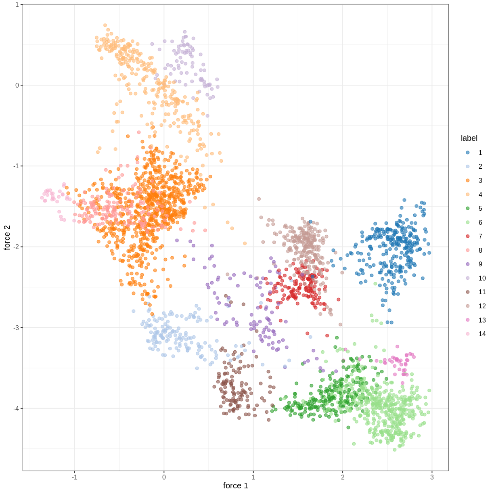
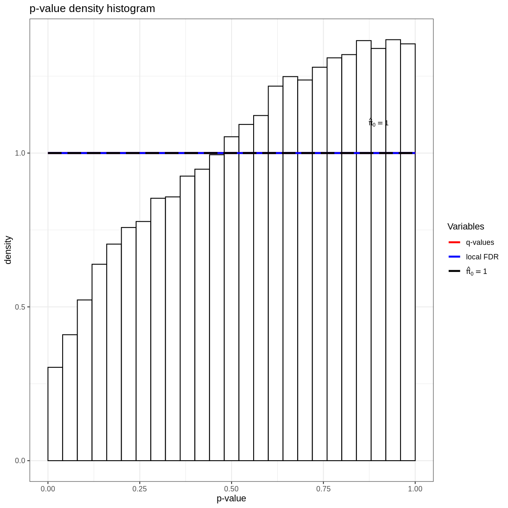
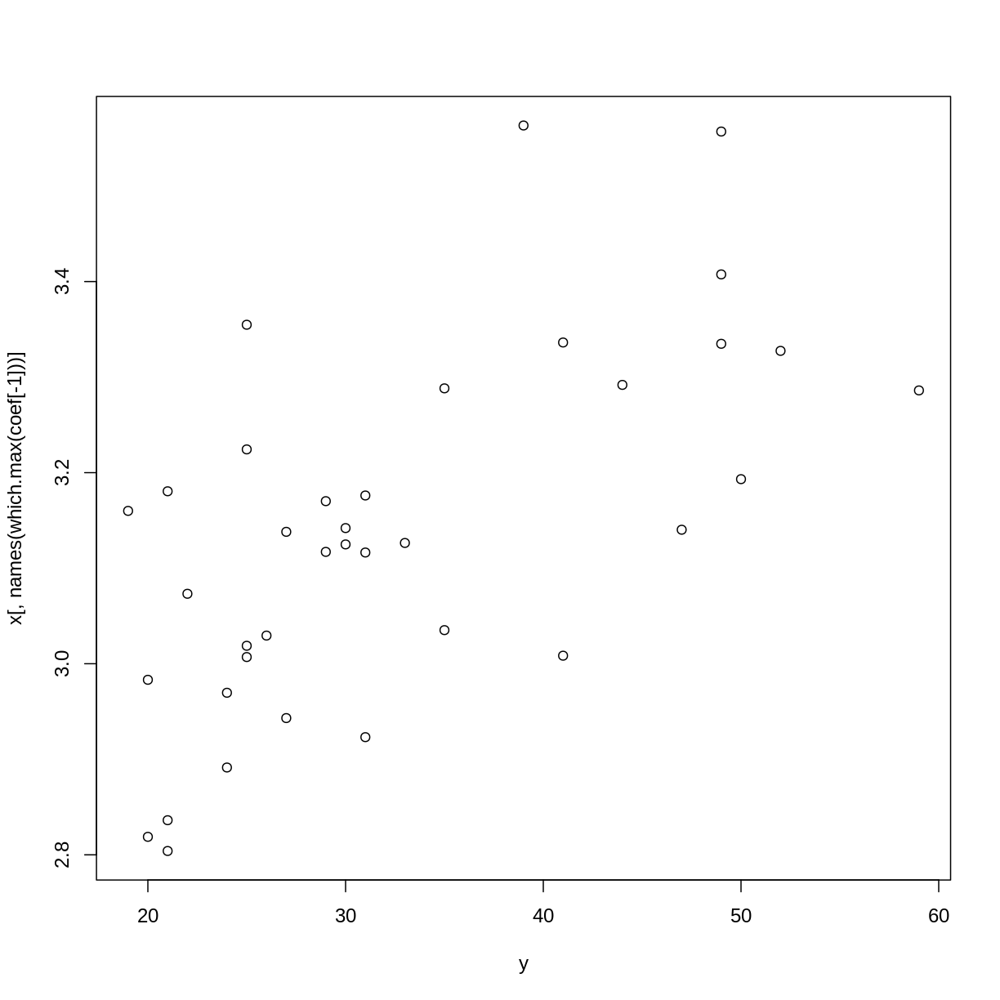

---
# Please do not edit this file directly; it is auto generated.
# Instead, please edit 02-high-dimensional-regression.md in _episodes_rmd/
title: "High dimensional regression"
teaching: 0
exercises: 0
questions:
- "How can we apply regression methods in a high-dimensional setting?"
- "How can we control for the fact that we do many tests?"
- "How can we benefit from the fact that we have many variables?"
- "How can we find a good subset of variables to use for regression?"
objectives:
- "Perform and critically analyse high dimensional regression."
- "Perform multiple testing adjustment."
- "Perform and critically analyse penalised regression."
keypoints:
- "Multiple testing correction can enable us to account for many null hypothesis
    significance tests while retaining power."
- "Sharing information between features can increase power and reduce false 
    positives."
- "Modelling features together can help to identify a subset of features
    that contribute to the outcome."
math: yes
---

R code in RMarkdown (with output):

~~~
rnorm(5)
~~~
{: .language-r}

~~~
[1] -0.5505652 -0.6339083 -0.9916050  0.0655402  0.9413610
~~~
{: .output}

$\LaTeX$ inline, and in blocks:

$$
    \exp(i\pi) = -1
$$

~~~
suppressPackageStartupMessages({
    library("glmnet")
    library("limma")
    library("qvalue")
    library("minfi")
    library("here")
    library("FlowSorted.Blood.EPIC")
    library("IlluminaHumanMethylationEPICmanifest")
    library("IlluminaHumanMethylationEPICanno.ilm10b4.hg19")
    library("ExperimentHub")
    library("here")
})

if (!file.exists(here("data/FlowSorted_Blood_EPIC.rds"))) {
    source(here("data/methylation.R"))
}
~~~
{: .language-r}

~~~
using temporary cache /tmp/RtmpcBFjkC/BiocFileCache
~~~
{: .output}

~~~
snapshotDate(): 2020-10-27
~~~
{: .output}

~~~
see ?FlowSorted.Blood.EPIC and browseVignettes('FlowSorted.Blood.EPIC') for documentation
~~~
{: .output}

~~~
downloading 1 resources
~~~
{: .output}

~~~
retrieving 1 resource
~~~
{: .output}

~~~
loading from cache
~~~
{: .output}

~~~
[preprocessQuantile] Mapping to genome.
~~~
{: .output}

~~~
[preprocessQuantile] Fixing outliers.
~~~
{: .output}

~~~
[preprocessQuantile] Quantile normalizing.
~~~
{: .output}

~~~
norm <- readRDS(here("data/FlowSorted_Blood_EPIC.rds"))

lim <- norm
# lim <- lim[sample(nrow(lim), nrow(norm) / 10), ]

y <- lim$Age

# dfs <- mclapply(1:10000,
#     function(i) {
#         cat(i, "/", ncol(x), "\n")
#         df <- tidy(lm(x[, i] ~ y))[2, ]
#         df$term <- colnames(x)[[i]]
#         df
#     }, mc.cores = 8
# )
# df_all <- do.call(rbind, dfs)

## age - strong comparison
design <- model.matrix(~lim$Age)
colnames(design) <- c("intercept", "age")
fit <- lmFit(getM(lim)[1:10000, ], design = design)
fit <- eBayes(fit)
tt1 <- topTable(fit, coef = 2, number = nrow(fit))

plot(tt1$logFC, -log10(tt1$P.Value))
~~~
{: .language-r}

~~~
q <- qvalue(tt1$P.Value)
hist(q)
~~~
{: .language-r}

~~~
# plot(df_all$p.value, tt1[df_all$term, "P.Value"], log = "xy")
# plot(df_all$estimate, tt1[df_all$term, "logFC"])

design <- model.matrix(~0 + lim$bmi_clas)
colnames(design) <- gsub("lim$bmi_clas", "", colnames(design), fixed=TRUE)

fit <- lmFit(getM(lim), design = design)
contrasts <- makeContrasts(
    Overweight - Normal,
    Obese - Normal,
    levels = design
)
fit <- contrasts.fit(fit, contrasts)
fit <- eBayes(fit)
tt1 <- topTable(fit, coef = 1, number = nrow(fit))
tt2 <- topTable(fit, coef = 2, number = nrow(fit))

q <- qvalue(tt2$P.Value)
tt2$qvalue <- q$qvalue

design <- model.matrix(~0 + lim$smoker)
colnames(design) <- gsub("lim$smoker", "", colnames(design), fixed=TRUE)

fit <- lmFit(getM(lim), design = design)
contrasts <- makeContrasts(
    Yes - No,
    levels = design
)
fit <- contrasts.fit(fit, contrasts)
fit <- eBayes(fit)
tt1 <- topTable(fit, coef = 1, number = nrow(fit))

q <- qvalue(tt1$P.Value)
hist(q)
~~~
{: .language-r}

~~~
plot(tt1$logFC, -log10(tt1$P.Value))
~~~
{: .language-r}

~~~
x <- t(getM(norm))
y <- as.numeric(factor(norm$smoker)) - 1

fit <- cv.glmnet(x = x, y = y, family="binomial")
~~~
{: .language-r}

~~~
Warning in lognet(xd, is.sparse, ix, jx, y, weights, offset, alpha, nobs, : one
multinomial or binomial class has fewer than 8 observations; dangerous ground
Warning in lognet(xd, is.sparse, ix, jx, y, weights, offset, alpha, nobs, : one
multinomial or binomial class has fewer than 8 observations; dangerous ground
Warning in lognet(xd, is.sparse, ix, jx, y, weights, offset, alpha, nobs, : one
multinomial or binomial class has fewer than 8 observations; dangerous ground
Warning in lognet(xd, is.sparse, ix, jx, y, weights, offset, alpha, nobs, : one
multinomial or binomial class has fewer than 8 observations; dangerous ground
Warning in lognet(xd, is.sparse, ix, jx, y, weights, offset, alpha, nobs, : one
multinomial or binomial class has fewer than 8 observations; dangerous ground
Warning in lognet(xd, is.sparse, ix, jx, y, weights, offset, alpha, nobs, : one
multinomial or binomial class has fewer than 8 observations; dangerous ground
Warning in lognet(xd, is.sparse, ix, jx, y, weights, offset, alpha, nobs, : one
multinomial or binomial class has fewer than 8 observations; dangerous ground
Warning in lognet(xd, is.sparse, ix, jx, y, weights, offset, alpha, nobs, : one
multinomial or binomial class has fewer than 8 observations; dangerous ground
Warning in lognet(xd, is.sparse, ix, jx, y, weights, offset, alpha, nobs, : one
multinomial or binomial class has fewer than 8 observations; dangerous ground
Warning in lognet(xd, is.sparse, ix, jx, y, weights, offset, alpha, nobs, : one
multinomial or binomial class has fewer than 8 observations; dangerous ground
Warning in lognet(xd, is.sparse, ix, jx, y, weights, offset, alpha, nobs, : one
multinomial or binomial class has fewer than 8 observations; dangerous ground
~~~
{: .warning}

~~~
c <- coef(fit, s = fit$lambda.1se)
c[c[, 1] != 0, 1]
~~~
{: .language-r}

~~~
[1] -1.455287
~~~
{: .output}

~~~
y <- norm$Age
fit <- cv.glmnet(x = x, y = y)

c <- coef(fit, s = fit$lambda.1se)
coef <- c[c[, 1] != 0, 1]

plot(y, x[, names(which.max(coef[-1]))])
~~~
{: .language-r}



