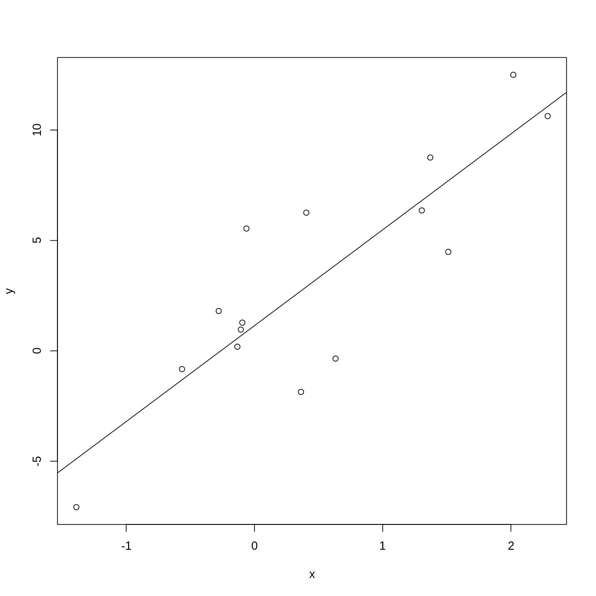
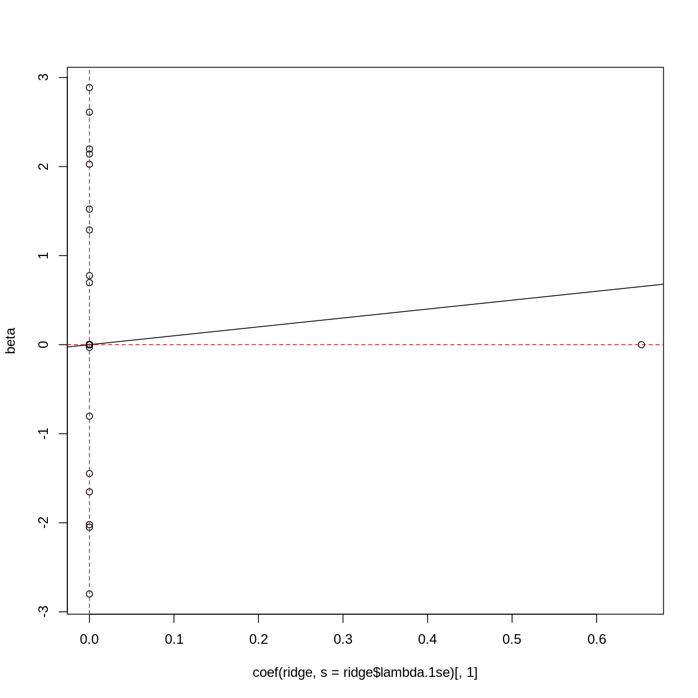

---
# Please do not edit this file directly; it is auto generated.
# Instead, please edit 02-high-dimensional-regression.md in _episodes_rmd/
title: "High dimensional regression"
teaching: 0
exercises: 0
questions:
- "How can we apply regression methods in a high-dimensional setting?"
- "How can we control for the fact that we do many tests?"
- "How can we benefit from the fact that we have many variables?"
- "How can we find a good subset of variables to use for regression?"
objectives:
- "Perform and critically analyse high dimensional regression."
- "Perform multiple testing adjustment."
- "Perform and critically analyse penalised regression."
keypoints:
- "Multiple testing correction can enable us to account for many null hypothesis
    significance tests while retaining power."
- "Sharing information between features can increase power and reduce false 
    positives."
- "Modelling features together can help to identify a subset of features
    that contribute to the outcome."
math: yes
---

Linear regression with one predictor variable $x$ comprises the following 
equation

$$
    y_i = \beta_0 + \beta_1 x_i + \epsilon_i
$$

where $\epsilon_i$ is the *noise*, or the variation in $y$ that isn't explained
by the relationship we're modelling. We assume this noise follows a normal
distribution, that is:

$$
    \epsilon_i \sim N(0, \sigma^2)
$$

We can also write this using linear algebra (matrices and vectors) as follows: 

$$
    y = X\beta + \epsilon
$$

Another way of saying this is that y follows a normal distribution with

$$
    y \sim N(X\beta, \sigma^2)
$$

~~~
## challenge 1:
## Create a normally distributed predictor, x
## then create a normally distributed outcome, y
## that does not depend on x
## then, create the same with dependence
set.seed(42)
noise_sd <- 2
nobs <- 15
x <- rnorm(nobs, mean = 0, sd = 1)
noise <- rnorm(nobs, mean = 0, sd = noise_sd)
slope <- 4
intercept <- 2
y <- (slope * x) + (intercept) + noise

lik <- function(slope, intercept) {
    sum(dnorm(y, mean = (slope * x) + intercept, sd = noise_sd, log=TRUE))
}
n <- 1000
s <- seq(-5, 5, length.out = n)
ll <- matrix(ncol = n, nrow = n)
for (i in seq_along(s)) {
    for (j in seq_along(s)) {
        ll[i, j] <- lik(s[i], s[j])
    }
}
image(s, s, ll, xlab = "slope", ylab = "intercept")
abline(v = 0, lty = "dashed")
abline(h = 0, lty = "dashed")
# points(slope, intercept, pch=19)
fit <- lm(y ~ x)
points(coef(fit)[[2]], coef(fit)[[1]], pch=19)
l1 <- 1
lines(c(0, l1), c(l1, 0))
lines(c(0, -l1), c(-l1, 0))
lines(c(-l1, 0), c(0, l1))
lines(c(0, l1), c(-l1, 0))
~~~
{: .language-r}

~~~
plot(x, y)
abline(fit)
~~~
{: .language-r}

~~~
## challenge 2:
## Create a set of normal predictors, X
## then create a normally distributed outcome, y
## that depends on a subset of X
noise_sd <- 2
npred <- 99
frac <- 0.2
X <- replicate(npred - 1, rnorm(nobs, mean = 0, sd = 1))
colnames(X) <- paste0("predictor_", 1:(npred-1))
noise <- rnorm(nobs, mean = 0, sd = noise_sd)
X <- cbind(intercept = rep(1, nobs), X)
beta <- rep(0, npred)
names(beta) <- colnames(X)
ind <- as.logical(rbinom(npred, 1, frac))
beta[ind] <- rnorm(sum(ind)) + sample(c(-2, 2), sum(ind), replace=TRUE)
y <- ((X %*% beta) + noise)[, 1]
~~~
{: .language-r}

~~~
## challenge 3: fit y on x univariate
## compare with true betas
cc <- sapply(1:ncol(X), function(i) {
    coef(lm(y ~ X[, i]))[[2]]
})
plot(cc, beta, pch = 19, cex = 0.5)
abline(0, 1)
abline(v = 0, lty="dashed", col = "firebrick")
abline(h = 0, lty="dashed", col = "firebrick")
~~~
{: .language-r}

~~~
## challenge 4: forward selection
## compare with true betas
xy <- as.data.frame(cbind(X, y = y))
int <- lm(y ~ 1, data=xy)
all <- lm(y ~ . + 0, data=xy)
forward <- step(
    int,
    scope = list(upper = formula(all), lower = formula(int)),
    direction = "forward",
    trace = 0
)
~~~
{: .language-r}

~~~
Warning: attempting model selection on an essentially perfect fit is nonsense
Warning: attempting model selection on an essentially perfect fit is nonsense
~~~
{: .warning}

~~~
forward$anova
~~~
{: .language-r}

~~~
             Step Df     Deviance Resid. Df   Resid. Dev         AIC
1                 NA           NA        14 1.669967e+03   72.687630
2  + predictor_97 -1 7.048685e+02        13 9.650980e+02   66.462692
3  + predictor_94 -1 4.796907e+02        12 4.854073e+02   58.154072
4   + predictor_6 -1 2.524887e+02        11 2.329186e+02   49.139581
5  + predictor_76 -1 1.434165e+02        10 8.950210e+01   36.793179
6  + predictor_50 -1 3.821840e+01         9 5.128370e+01   30.439842
7  + predictor_45 -1 2.823966e+01         8 2.304404e+01   20.440356
8  + predictor_81 -1 1.642676e+01         7 6.617286e+00    3.724526
9  + predictor_52 -1 3.445934e+00         6 3.171351e+00   -5.308386
10 + predictor_54 -1 2.159602e+00         5 1.011749e+00  -20.445538
11 + predictor_61 -1 8.061650e-01         4 2.055845e-01  -42.349228
12 + predictor_13 -1 1.904090e-01         3 1.517548e-02  -79.441865
13 + predictor_84 -1 1.482752e-02         2 3.479585e-04 -134.072164
14 + predictor_22 -1 3.479084e-04         1 5.005876e-08 -264.771778
15  + predictor_1 -1 5.005876e-08         0 0.000000e+00        -Inf
~~~
{: .output}

~~~
plot(coef(forward), beta[names(coef(forward))])
abline(0, 1)
abline(v = 0, lty="dashed", col = "firebrick")
abline(h = 0, lty="dashed", col = "firebrick")
~~~
{: .language-r}

~~~
## note about backward/both, not a challenge
all <- lm(y ~ . + 0, data=xy)
backward <- step(
    all,
    scope = formula(all),
    direction = "backward",
    trace = 0
)
~~~
{: .language-r}

~~~
Error in step(all, scope = formula(all), direction = "backward", trace = 0): AIC is -infinity for this model, so 'step' cannot proceed
~~~
{: .error}

~~~
backward$anova
~~~
{: .language-r}

~~~
Error in eval(expr, envir, enclos): object 'backward' not found
~~~
{: .error}

~~~
plot(coef(backward), beta[names(coef(backward))])
~~~
{: .language-r}

~~~
Error in coef(backward): object 'backward' not found
~~~
{: .error}

~~~
abline(0, 1)
~~~
{: .language-r}

~~~
Error in int_abline(a = a, b = b, h = h, v = v, untf = untf, ...): plot.new has not been called yet
~~~
{: .error}

~~~
abline(v = 0, lty="dashed", col = "firebrick")
~~~
{: .language-r}

~~~
Error in int_abline(a = a, b = b, h = h, v = v, untf = untf, ...): plot.new has not been called yet
~~~
{: .error}

~~~
abline(h = 0, lty="dashed", col = "firebrick")
~~~
{: .language-r}

~~~
Error in int_abline(a = a, b = b, h = h, v = v, untf = untf, ...): plot.new has not been called yet
~~~
{: .error}

~~~
## Challenge 5:
## one of these...? probably lasso
library("glmnet")
ridge <- cv.glmnet(X[, -1], y, alpha = 0)
~~~
{: .language-r}

~~~
Warning: Option grouped=FALSE enforced in cv.glmnet, since < 3 observations per
fold
~~~
{: .warning}

~~~
lasso <- cv.glmnet(X[, -1], y, alpha = 1)
~~~
{: .language-r}

~~~
Warning: Option grouped=FALSE enforced in cv.glmnet, since < 3 observations per
fold
~~~
{: .warning}

~~~
elastic <- cv.glmnet(X[, -1], y, alpha = 0.5, intercept = FALSE)
~~~
{: .language-r}

~~~
Warning: Option grouped=FALSE enforced in cv.glmnet, since < 3 observations per
fold
~~~
{: .warning}

~~~
plot(coef(lasso, s = lasso$lambda.1se)[, 1], beta)
abline(0, 1)
abline(v = 0, lty="dashed", col = "firebrick")
abline(h = 0, lty="dashed", col = "firebrick")
~~~
{: .language-r}

~~~
plot(coef(elastic, s = elastic$lambda.1se)[, 1], beta)
abline(0, 1)
abline(v = 0, lty="dashed", col = "firebrick")
abline(h = 0, lty="dashed", col = "firebrick")
~~~
{: .language-r}

~~~
plot(coef(ridge, s = ridge$lambda.1se)[, 1], beta)
abline(0, 1)
abline(v = 0, lty="dashed", col = "firebrick")
abline(h = 0, lty="dashed", col = "firebrick")
~~~
{: .language-r}

~~~
suppressPackageStartupMessages({
    library("glmnet")
    library("limma")
    library("qvalue")
    library("minfi")
    library("here")
    library("FlowSorted.Blood.EPIC")
    library("IlluminaHumanMethylationEPICmanifest")
    library("IlluminaHumanMethylationEPICanno.ilm10b4.hg19")
    library("ExperimentHub")
    library("here")
})

if (!file.exists(here("data/FlowSorted_Blood_EPIC.rds"))) {
    source(here("data/methylation.R"))
}
norm <- readRDS(here("data/FlowSorted_Blood_EPIC.rds"))

lim <- norm
# lim <- lim[sample(nrow(lim), nrow(norm) / 10), ]

y <- lim$Age

# dfs <- mclapply(1:10000,
#     function(i) {
#         cat(i, "/", ncol(x), "\n")
#         df <- tidy(lm(x[, i] ~ y))[2, ]
#         df$term <- colnames(x)[[i]]
#         df
#     }, mc.cores = 8
# )
# df_all <- do.call(rbind, dfs)

## age - strong comparison
design <- model.matrix(~lim$Age)
colnames(design) <- c("intercept", "age")
fit <- lmFit(getM(lim)[1:10000, ], design = design)
~~~
{: .language-r}

~~~
Error in getM(lim)[1:10000, ]: subscript out of bounds
~~~
{: .error}

~~~
fit <- eBayes(fit)
~~~
{: .language-r}

~~~
Error in .ebayes(fit = fit, proportion = proportion, stdev.coef.lim = stdev.coef.lim, : No data, or argument is not a valid lmFit object
~~~
{: .error}

~~~
tt1 <- topTable(fit, coef = 2, number = nrow(fit))
~~~
{: .language-r}

~~~
Error in topTable(fit, coef = 2, number = nrow(fit)): fit must be an MArrayLM object
~~~
{: .error}

~~~
plot(tt1$logFC, -log10(tt1$P.Value))
~~~
{: .language-r}

~~~
Error in h(simpleError(msg, call)): error in evaluating the argument 'x' in selecting a method for function 'plot': object 'tt1' not found
~~~
{: .error}

~~~
q <- qvalue(tt1$P.Value)
~~~
{: .language-r}

~~~
Error in qvalue(tt1$P.Value): object 'tt1' not found
~~~
{: .error}

~~~
hist(q)
~~~
{: .language-r}

~~~
Error in hist.default(q): 'x' must be numeric
~~~
{: .error}

~~~
# plot(df_all$p.value, tt1[df_all$term, "P.Value"], log = "xy")
# plot(df_all$estimate, tt1[df_all$term, "logFC"])
~~~
{: .language-r}

~~~
x <- t(getM(norm))
y <- as.numeric(factor(norm$smoker)) - 1

fit <- cv.glmnet(x = x, y = y, family="binomial")
~~~
{: .language-r}

~~~
Warning in lognet(xd, is.sparse, ix, jx, y, weights, offset, alpha, nobs, : one
multinomial or binomial class has fewer than 8 observations; dangerous ground
Warning in lognet(xd, is.sparse, ix, jx, y, weights, offset, alpha, nobs, : one
multinomial or binomial class has fewer than 8 observations; dangerous ground
Warning in lognet(xd, is.sparse, ix, jx, y, weights, offset, alpha, nobs, : one
multinomial or binomial class has fewer than 8 observations; dangerous ground
Warning in lognet(xd, is.sparse, ix, jx, y, weights, offset, alpha, nobs, : one
multinomial or binomial class has fewer than 8 observations; dangerous ground
Warning in lognet(xd, is.sparse, ix, jx, y, weights, offset, alpha, nobs, : one
multinomial or binomial class has fewer than 8 observations; dangerous ground
Warning in lognet(xd, is.sparse, ix, jx, y, weights, offset, alpha, nobs, : one
multinomial or binomial class has fewer than 8 observations; dangerous ground
Warning in lognet(xd, is.sparse, ix, jx, y, weights, offset, alpha, nobs, : one
multinomial or binomial class has fewer than 8 observations; dangerous ground
Warning in lognet(xd, is.sparse, ix, jx, y, weights, offset, alpha, nobs, : one
multinomial or binomial class has fewer than 8 observations; dangerous ground
Warning in lognet(xd, is.sparse, ix, jx, y, weights, offset, alpha, nobs, : one
multinomial or binomial class has fewer than 8 observations; dangerous ground
Warning in lognet(xd, is.sparse, ix, jx, y, weights, offset, alpha, nobs, : one
multinomial or binomial class has fewer than 8 observations; dangerous ground
Warning in lognet(xd, is.sparse, ix, jx, y, weights, offset, alpha, nobs, : one
multinomial or binomial class has fewer than 8 observations; dangerous ground
~~~
{: .warning}

~~~
c <- coef(fit, s = fit$lambda.1se)
c[c[, 1] != 0, 1]
~~~
{: .language-r}

~~~
[1] -1.455287
~~~
{: .output}

~~~
y <- norm$Age
fit <- cv.glmnet(x = x, y = y)

c <- coef(fit, s = fit$lambda.1se)
coef <- c[c[, 1] != 0, 1]

plot(y, x[, names(which.max(coef[-1]))])
~~~
{: .language-r}



