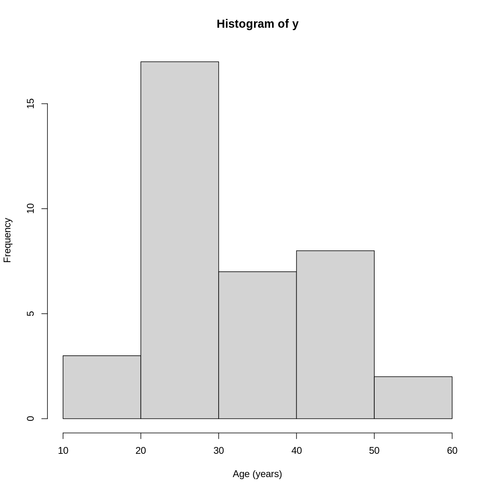

---
# Please do not edit this file directly; it is auto generated.
# Instead, please edit 02-high-dimensional-regression.md in _episodes_rmd/
title: "Regression with many features"
teaching: 0
exercises: 0
questions:
- "How can we apply regression methods in a high-dimensional setting?"
- "How can we control for the fact that we do many tests?"
- "How can we benefit from the fact that we have many variables?"
objectives:
- "Perform and critically analyse high dimensional regression."
- "Perform multiple testing adjustment."
- "Understand methods for shrinkage of noise parameters in
  high-dimensional regression."
keypoints:
- "Running many tests with high-dimensional data requires us to pay attention to 
   ..."
- "Multiple testing correction can enable us to account for many null hypothesis
    significance tests while retaining power."
- "Sharing information between features can increase power and reduce false 
    positives."
math: yes
---

# Linear regression (recap)

Linear regression is a tool we can use to quantify the relationship
between two variables.

Linear regression with one predictor variable $x$ comprises the following 
equation

$$
    y_i = \beta_0 + \beta_1 x_i + \epsilon_i
$$

where $\epsilon_i$ is the *noise*, or the variation in $y$ that isn't explained
by the relationship we're modelling. We assume this noise follows a normal
distribution, that is:

$$
    \epsilon_i \sim N(0, \sigma^2)
$$

We can also write this using linear algebra (matrices and vectors) as follows: 

$$
    y = X\beta + \epsilon
$$

Another way of saying this is that y follows a normal distribution with

$$
    y \sim N(X\beta, \sigma^2)
$$

> ## Exercise
> Launch `shinystats::regressionApp` and adjust the parameters.
> 
> How does the "significance" of the model vary when you vary the parameters?
> 
> How does the degree of noise affect the level of certainty in the fitted
> trend?
> 
> With a large number of observations, how weak of an effect can you detect?
> Is a really small effect (0.1 slope) really "significant" in the way you'd
> use that word conversationally?
> 
> With a small number of observations, how strong does the relationship need
> to be (or how small the noise) before you can detect it?
> > ## Solution
> > todo: plot examples for each question
> {: .solution}
{: .challenge}

# Data

For the following few episodes, we'll be working with human
DNA methylation data from . These come in the form of a matrix
of normalised methylation levels (M-values, for the technical among
you).

The following code will read in the data for this episode.

~~~
suppressPackageStartupMessages({
    library("minfi")
    library("limma")
    library("here")
    library("broom")
})

if (!file.exists(here("data/methylation.rds"))) {
    source(here("data/methylation.R"))
}
norm <- readRDS(here("data/methylation.rds"))

norm <- norm
y <- norm$Age
X <- getM(norm)
~~~
{: .language-r}

The distribution of each of these looks like this:

~~~
hist(X, breaks = "FD", xlab = "M-value")
~~~
{: .language-r}

~~~
hist(y, breaks = "FD", xlab = "Age (years)")
~~~
{: .language-r}

We have a matrix of methylation values $X$ and a vector of ages in years $y$.
One way to model this is to see if we can "predict" methylation using age.
Formally we'd describe that as:

$$
    X_{i,j} = \beta_0 + \beta_1 y_j + \epsilon_i
$$

You may remember how to fit this model from a previous lesson, and how to
get more information from the model object:

~~~
fit <- lm(X[1, ] ~ y)
summary(fit)
~~~
{: .language-r}

~~~

Call:
lm(formula = X[1, ] ~ y)

Residuals:
     Min       1Q   Median       3Q      Max 
-1.25406 -0.05719  0.18118  0.28574  0.40238 

Coefficients:
            Estimate Std. Error t value Pr(>|t|)    
(Intercept)  2.03577    0.24947   8.160  1.3e-09 ***
y            0.00572    0.00727   0.787    0.437    
---
Signif. codes:  0 '***' 0.001 '**' 0.01 '*' 0.05 '.' 0.1 ' ' 1

Residual standard error: 0.4748 on 35 degrees of freedom
Multiple R-squared:  0.01738,	Adjusted R-squared:  -0.01069 
F-statistic: 0.6192 on 1 and 35 DF,  p-value: 0.4367
~~~
{: .output}

We can also use `broom` to extract information about
the coefficients in this model:

~~~
library("broom")
tidy(fit)
~~~
{: .language-r}

~~~
# A tibble: 2 x 5
  term        estimate std.error statistic       p.value
  <chr>          <dbl>     <dbl>     <dbl>         <dbl>
1 (Intercept)  2.04      0.249       8.16  0.00000000130
2 y            0.00572   0.00727     0.787 0.437        
~~~
{: .output}

We have a lot of features, though! This is what it looks like if we do that
for every feature.

~~~
dfs <- lapply(seq_len(nrow(X)),
    function(i) {
        df <- tidy(lm(X[i, ] ~ y))[2, ]
        df$term <- rownames(X)[[i]]
        df
    }
)
df_all <- do.call(rbind, dfs)
plot(df_all$estimate, -log10(df_all$p.value),
    xlab = "Effect size", ylab = bquote(-log[10](p)),
    pch = 19
)
~~~
{: .language-r}

# Multiple testing

## The problem of multiple tests

With such a large number of features, we often want some way
to decide which features are "interesting" or "significant"
for further study.

To demonstrate this, it's useful to consider what happens if
we scramble age and run the same test again:

~~~
y_perm <- y[sample(ncol(X), ncol(X))]
dfs <- lapply(seq_len(nrow(X)),
    function(i) {
        df <- tidy(lm(X[i, ] ~ y_perm))[2, ]
        df$term <- rownames(X)[[i]]
        df
    }
)
df_all <- do.call(rbind, dfs)
plot(df_all$estimate, -log10(df_all$p.value),
    xlab = "Effect size", ylab = bquote(-log[10](p)),
    pch = 19
)
~~~
{: .language-r}

> ## Exercise
>
> 
> 1. If we run 10,000 tests under the null hypothesis,
>    how many of them (on average) will be statistically
>    significant at a threshold of $p < 0.05$?
> 2. Why would we want to be conservative in labelling features
>    as significantly different?
>    By conservative, we mean to err towards labelling true
>    differences as "not significant" rather than vice versa.
> 3. How could we account for a varying number of tests to
>    ensure "significant" changes are truly different? 
> 
> > ## Solution
> > 1. By default we expect $5000 \times 0.05 = 250$
> >    features to be statistically significant under the null hypothesis,
> >    because p-values should always be uniformly distributed under
> >    the null hypothesis.
> > 2. Features that we label as "significantly different" will often
> >    be reported in manuscripts. We may also spend time and money
> >    investigating them further, computationally or in the lab.
> >    Therefore, spurious results have a real cost for ourselves and
> >    for others.
> > 3. One approach to controlling for the number of tests is to
> >    divide our significance threshold by the number of tests
> >    performed. This is termed "Bonferroni correction" and
> >    we'll discuss this further now.
> {: .solution}
{: .challenge}

## Adjusting for multiple comparisons

When performing mul

|              |Predicted true|Predicted false|
|-------------:|-------------:|--------------:|
|Actually true |True positive |False negative |
|Actually false|False positive|True negative  |

The t-statistic for a linear model like this is given by:

$$
    t_{ij} = \frac{\hat{\beta}_{ij}}{SE(\hat{\beta}_{ij})}
$$

$SE(\hat{\beta}_{ij})$ measures the uncertainty we have in our effect
size estimate. 

Knowing what distribution these t-values follow under the null
hypothesis allows us to determine how unlikely it would be for
us to observe what we have under those circumstances.

# Sharing information

One idea is to take advantage of the fact that we're doing all these tests 
at once. We can leverage this fact to perform *shrinkage* of some model
parameters. Shrinkage methods can be complex to implement and understand,
but it's good to understand why these approaches may be more precise 
and sensitive than the naive approach of fitting a model to each feature
separately.

The insight of shrinkage methods is to realise that variance parameters
like these are probably similar between genes within the same experiment. This
enables us to share information between genes to get more robust
estimators.

In this case, 

not $j$ but rather $k$? for predictor.
$$
    t_{ij} = \frac{\hat{\beta}_{ij}}{s_i \sqrt{v_{ij}}}
$$

$s_i^2$ is the variance of residuals.

Similarly, DESeq2 shares information between genes
to *shrink* estimates of a noise parameter, in that case to model counts.

~~~
## age - strong comparison
design <- model.matrix(~y)
colnames(design) <- c("intercept", "age")
fit <- lmFit(X, design = design)
fit <- eBayes(fit)
tt1 <- topTable(fit, coef = 2, number = nrow(fit))
plot(tt1$logFC, -log10(tt1$P.Value),
    xlab = "Effect size", ylab = bquote(-log[10](p)),
    pch = 19
)
~~~
{: .language-r}

> ## Exercise
> Launch `shinystats::limmaApp` and adjust the parameters. 
> 
> Discuss the output in groups. Consider the following questions:
> 
> 1. How does the number of features affect the relationship between these two 
>    similar methods?
> 2. What about the number of samples?
> 3. When ranking genes, why would we want to downrank the most significant and
>    uprank some with more moderate changes?
> 
> > ## Solution
> > 
> > 1. With more features, the amount of shrinkage increases.
> > 2. With more samples, the shrinkage is weaker and the difference between the
> >    methods is smaller.
> > 3. Because the p-value relies on the effect size estimate *and* its standard
> >    error, a very small standard error by chance (with few replicates) can
> >    lead to a very small p-value. "Moderating" or shrinking the standard errors
> >    brings these more in line with features that have a similar effect size 
> >    but larger standard error.
> {: .solution}
{: .challenge}

> ## Shrinkage
> 
> Shrinkage is an intuitive term for an effect
> of a broad range of statistical models.
> Often, shrinkage is induced by a *multilevel*
> modelling approach or by *Bayesian* methods.
> 
> The general idea is that these models incorporate 
> information about the hierarchical structure of the
> data into account when fitting the parameters.
> The sharing of information is accomplished because we use
> this information to formulate the model.
> 
> For example in `DESeq2`, the authors used the observation
> that genes with similar expression counts in RNAseq data
> have similar *dispersion*.
> Similarly, in `limma` the authors made the assumption that
> in the absence of biological effects, we can often expect the
> technical variation between genes to be similar. 
> 
> There are many good resources to learn about this type of approach,
> including:
> 
> - [a blog post by TJ Mahr](https://www.tjmahr.com/plotting-partial-pooling-in-mixed-effects-models/)
> - [a book by David Robinson](https://gumroad.com/l/empirical-bayes)
> - [a (relatively technical) book by Gelman and Hill](http://www.stat.columbia.edu/~gelman/arm/)
{: .callout}


