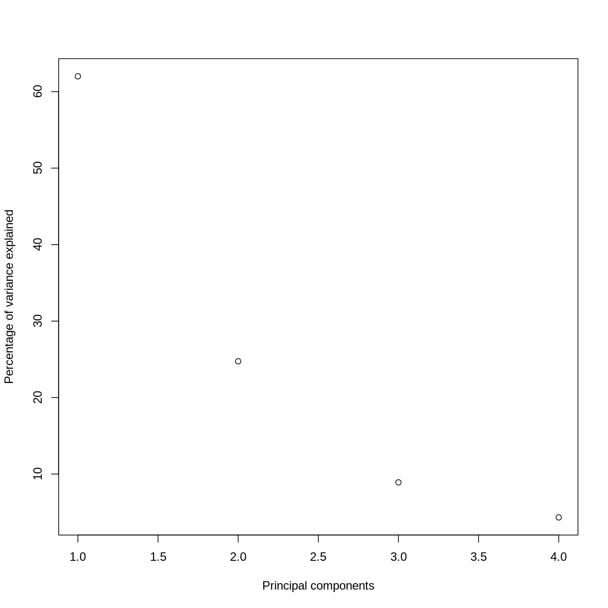
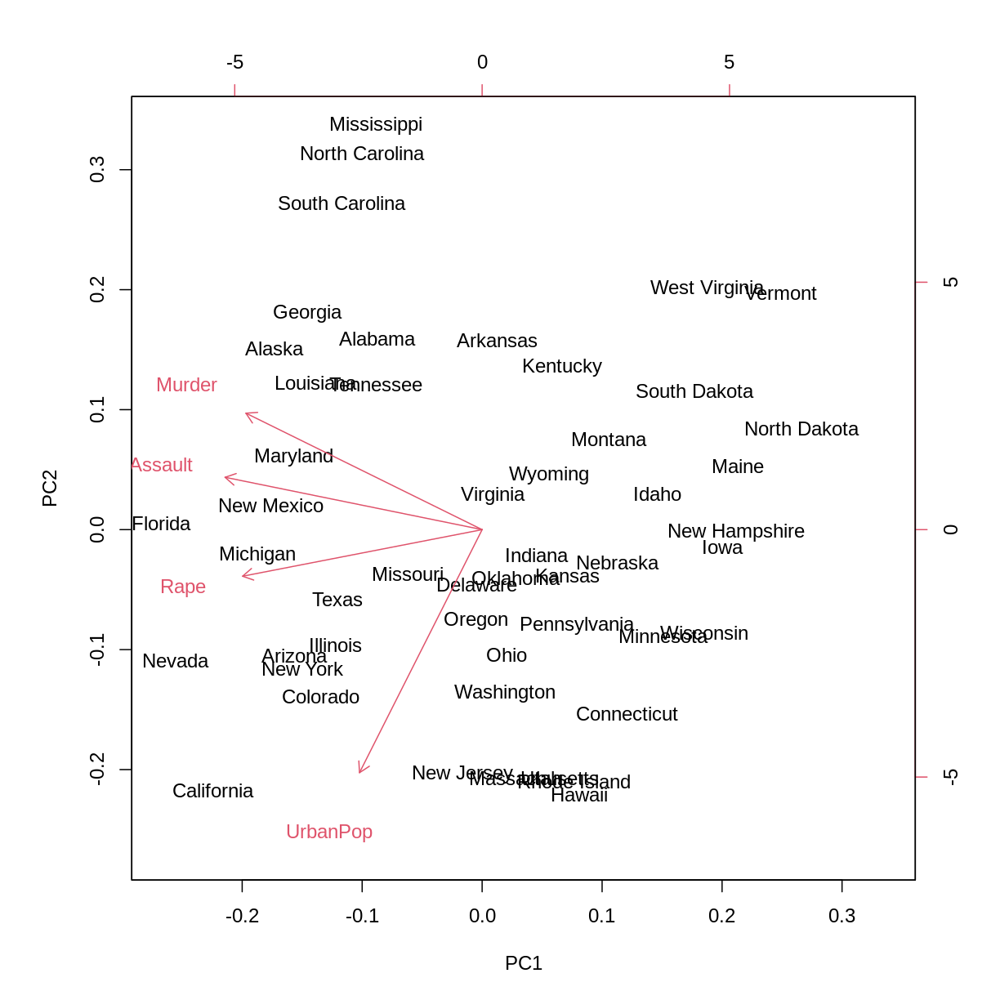
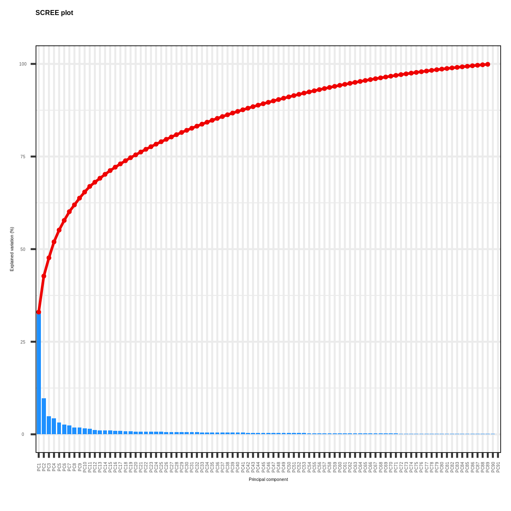
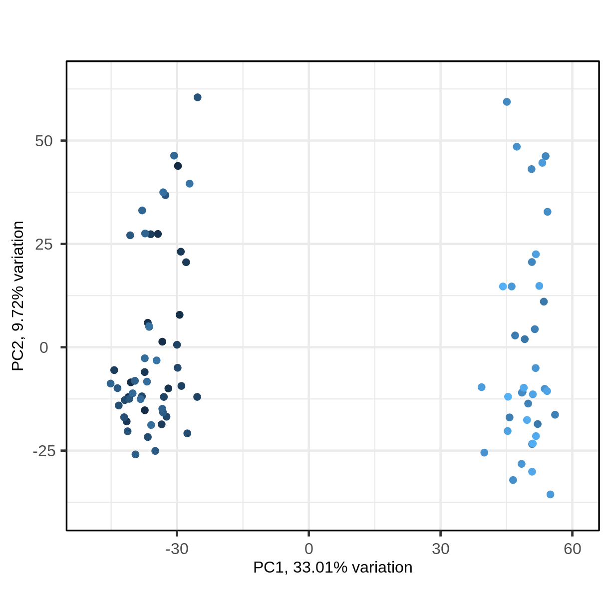
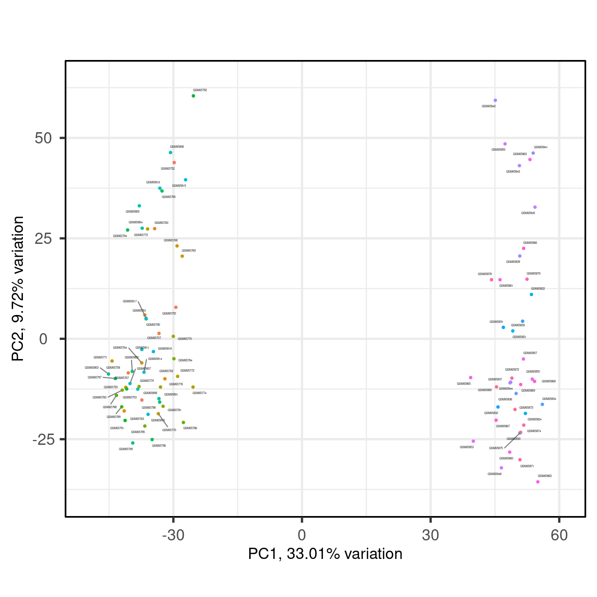
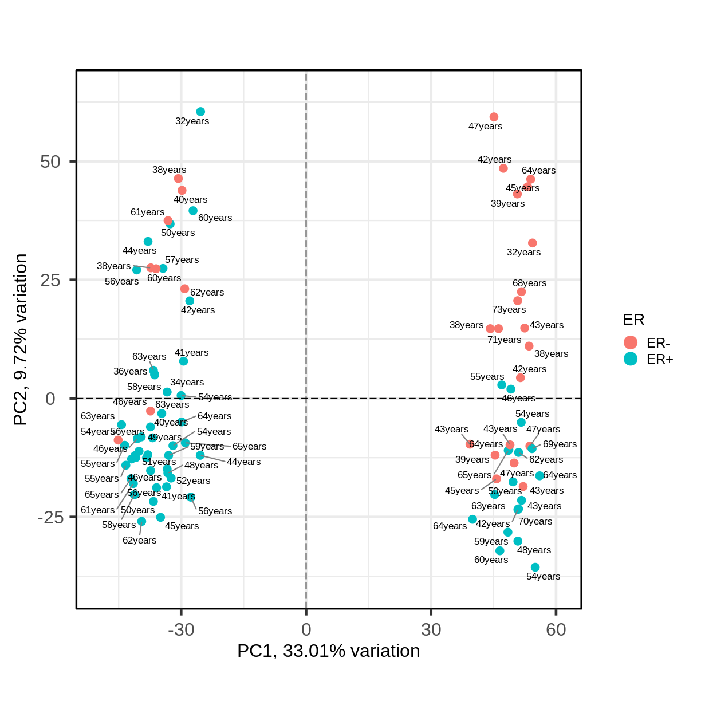
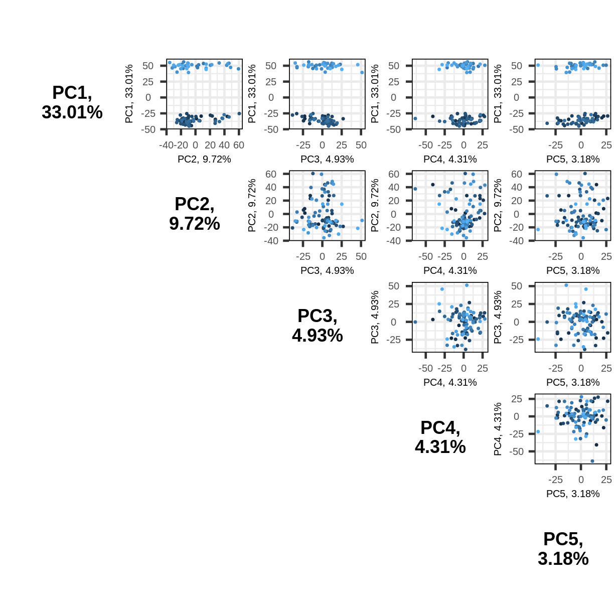

---
# Please do not edit this file directly; it is auto generated.
# Instead, please edit 03-dimensionality-reduction.md in _episodes_rmd/
title: "Principle component analysis"
author: "GS Robertson"
teaching: 50
exercises: 30
questions:
- Why is PCA useful?
- When is PCA suitable?
- What are some limitations of PCA?
objectives:
-
keypoints:
- 
math: yes
---

~~~
if (!file.exists(here("data/cancer_expression.rds"))) {
    source(here("data/expression.R"))
}
~~~
{: .language-r}

# Introduction

Intro to PCA (15 mins: lecture)

* When to use
* What kinds of data/questions exist for which a PCA would be useful
* Limitations of PCA

> ## Challenge 1 
> 
> (5 mins)
>
> Descriptions of three datasets and research questions are given below.
> For which of these is a PCA a useful method of analysis?
>
> 1. Bob has a large dataset (>1m rows) where each row represents a patient 
> admitted to hospital with an infectious respiratory disease. Other data 
> available for each patient includes age, sex, length of time spent in hospital,
> other health conditions, severity of illness (on predefined scale of 1 to 5), 
> and other health-related measures (blood pressure, heart rate etc). 
> Can we predict the type of respiratory illness a patient has been admitted to 
> hospital with using demographic information? Does severity of illness and length
> of stay in hospital vary in patients with different respiratory diseases?
> 2. An online retailer has collected data on user interactions with its online 
> app and has information on the number of times each user interacted with the 
> app, what products they viewed per interaction, and the cost of these products.
> The retailer plans to add a new product to the app and would like to know
> which users to advertise their new product to. 
> 3. Gillian has assayed gene expression levels 
> in 1000 cancer patients and has data from probes targeting different genes in 
> tumour samples from patients. She would like to create a new variable 
> representing different groups of genes to i) find out if genes form subgroups
> based on biological function and ii) use these new variables in a linear
> regression examining how gene expression varies with disease severity.
> 4. All of the above
> 
> > ## Solution
> > Answer: 3
> {: .solution}
{: .challenge}

> ## Challenge 2
> 
> (5 mins)
> Why might it be necessary to standardise continuous variables before
> performing a PCA?  
> 
> 1. To make the results of the PCA interesting
> 2. To ensure that variables with different ranges of values contributes
> equally to analysis
> 3. To allow the feature matrix to be calculated faster, especially in cases
> where there a lot of input variables
> 4. To allow both continuous and categorical variables to be included in the PCA
> 5. All of the above
> 
> > ## Solution
> > Answer: 2
> {: .solution}
{: .challenge}

> ## Challenge 2
> 
> (5 mins)
> 
> Can you think of datasets where it might not be necessary to standardise
> variables? Discuss in groups.
> > ## Solution
> > 1. Datasets which contain continuous variables all measured on the same
> >   scale (e.g. gene expression data or RNA sequencing data). 
> > 2. If you want high-magnitude variables to contribute more to the
> >   resulting PCs.
> {: .solution}
{: .challenge}

# Example of PCA
(code along episode 15 mins)

The USArrests dataset is freely available in R and represents data from 50 US
states containing number of arrests per 100,000 people for three crimes Assault,
Murder, and Rape as well as the percentage of people living in urban areas in
each state (UrbanPop).

Here we will calculate 50 principal component scores for each of the 50 rows
in this dataset, using 4 principal components (one for each of the variables
in the dataset). We want to find out whether these three crime-related variables
can be reduced to a single variable which represents crime levels in different
state. Before PCA can be carried out using these variables need to be 
standardised before PCA can be carried out (number of assaults are likely to be
higher than number of rapes and murders). These variables were standardised to
have a mean of 0 and a standard deviation of 1.

First, we will examine the USArrests data which is part of base R.

~~~
head(USArrests)
~~~
{: .language-r}

~~~
           Murder Assault UrbanPop Rape
Alabama      13.2     236       58 21.2
Alaska       10.0     263       48 44.5
Arizona       8.1     294       80 31.0
Arkansas      8.8     190       50 19.5
California    9.0     276       91 40.6
Colorado      7.9     204       78 38.7
~~~
{: .output}

Notice that names of states are given as row names

~~~
rownames(USArrests)
~~~
{: .language-r}

~~~
 [1] "Alabama"        "Alaska"         "Arizona"        "Arkansas"      
 [5] "California"     "Colorado"       "Connecticut"    "Delaware"      
 [9] "Florida"        "Georgia"        "Hawaii"         "Idaho"         
[13] "Illinois"       "Indiana"        "Iowa"           "Kansas"        
[17] "Kentucky"       "Louisiana"      "Maine"          "Maryland"      
[21] "Massachusetts"  "Michigan"       "Minnesota"      "Mississippi"   
[25] "Missouri"       "Montana"        "Nebraska"       "Nevada"        
[29] "New Hampshire"  "New Jersey"     "New Mexico"     "New York"      
[33] "North Carolina" "North Dakota"   "Ohio"           "Oklahoma"      
[37] "Oregon"         "Pennsylvania"   "Rhode Island"   "South Carolina"
[41] "South Dakota"   "Tennessee"      "Texas"          "Utah"          
[45] "Vermont"        "Virginia"       "Washington"     "West Virginia" 
[49] "Wisconsin"      "Wyoming"       
~~~
{: .output}

Compare the variances between these variables

~~~
apply(USArrests, 2, var)
~~~
{: .language-r}

~~~
    Murder    Assault   UrbanPop       Rape 
  18.97047 6945.16571  209.51878   87.72916 
~~~
{: .output}

Note that variance is greatest for Assaults and lowest for Murder. This makes
sense as you would expect there to be fewer cases of murder than other more
common crimes. UrbanPop is a different variable from Murder, Assault and Rape
measuring the percentage of people per state living in an urban area. We need
to scale each of these variables before including them in a PCA analysis to
ensure that differences in variances between variables do not drive the
calculation of principal components. In this example we standardise all four
variables to have a mean of 0 and a standard deviation of 1. We can do this
inside the prcomp function in R, which carries out a PCA with centred (around
mean = 0) and standardised variables (with a standard deviation of 1). The
`prcomp` function carries out a PCA on the input dataset (where the input data
are in the form of a matrix).

~~~
pcaUS <- prcomp(USArrests, scale = TRUE)
~~~
{: .language-r}

The output from pcaUS returns:
* Standard deviations of each principal component
  (i.e. the square roots of the eigenvalues of the covariance/correlation matrix
  as stated in the prcomp helpfile). In this example there are 4 principal
  components (one for each variable in the dataset).
* The matrix of principal component loadings in which the columns show the
  principal component loading vectors. The is refered to as a rotated (n x k) 
  matrix because when this matrix is multiplied with the matrix containing data 
  on the original coordinate system we get the coordinates in the rotated 
  coordinate system. 

~~~
summary(pcaUS)
~~~
{: .language-r}

~~~
Importance of components:
                          PC1    PC2     PC3     PC4
Standard deviation     1.5749 0.9949 0.59713 0.41645
Proportion of Variance 0.6201 0.2474 0.08914 0.04336
Cumulative Proportion  0.6201 0.8675 0.95664 1.00000
~~~
{: .output}

This returns the proportion of variance in the data explained by each of the
(p = 4) principal components. In this example PC1 explains approximately 62%
of variance in the data, PC2 25% of variance, PC3 a further 9% and PC4
approximately 4%.

We can use a screeplot to see how much variation in the data is explained by
each principal component.

~~~
#variance explained
varExp = (100 * pcaUS$sdev ^ 2) / sum(pcaUS$sdev ^ 2)
#calculate percentage variance explained using output from the PCA
varDF = data.frame(Dimensions=1:length(varExp), varExp=varExp)
#create new dataframe with four rows, one for each principal component
~~~
{: .language-r}

~~~
plot(varDF, ylab = "Percentage of variance explained", xlab = "Principal components")
~~~
{: .language-r}

The screeplot shows that the first principal component explains most of the
variance in the data (>60%) and each subsequent principal component explains
less and less of the total variance. The first two principal components 
explain >70% of variance in the data. But what do these two principal components
mean?

We can better understand what the principal components represent in terms of
the original variables by plotting the first two principal components against
each other and labelling points by US state name. Clusters of points which have
similar principal component scores can be observed using a biplot and the
strength and direction of influence different variables have on the calculation
of the principal component scores can be observed by plotting arrows
representing the loadings onto the graph. A biplot of the first two principal 
components can be created as follows:

~~~
stats::biplot(pcaUS)
~~~
{: .language-r}

This biplot shows the position of each state on a 2-dimensional plot where
weight of loadings can be observed via the red arrows associated with each
of the variables. The scale = 0 included as an argument in biplot function
ensures that the arrows are scaled to represent the loadings. In this example,
the biplot shows that the variables Assault and Rape are associated with
negative values on PC1 while negative values on PC2 are associated with the
variable UrbanPop. The length of the arrows indicates how much each variable
contributes to the calculation of each principal component. You can see on this
biplot that UrbanPop is the variable that has the most significant contribution
to PC2.   

# Making use of different PCA packages for analysing biological data

(code along episode 10 mins)

PCAtools provides functions for data exploration using PCA and allows the user
to produce high quality figures. Functions to apply different methods for
choosing appropriate numbers of principal components are available. This PCA
package is designed specifically for the analysis of high dimensional biological
data.

We are going to use PCAtools to explore some gene expression microarray data
downloaded from the Gene Expression Omnibus
(https://www.ncbi.nlm.nih.gov/geo/query/acc.cgi?acc=GSE2990). A microarray is a
laboratory tool used to detect the expression of multiple different genes at the
same time. Microarrays used to detect DNA sequences are microscope slides
containing thousands of tiny spots in defined positions, in which each spot
contains a DNA sequence encoding a particular gene. These DNA molecules can be
thought of as probes which detect whether or not a particular gene is expressed
in an input sample. To compare samples (e.g. those taken from patients with
different cancer grades) a microarray analysis can be performed which compares
genes expressed in two hybridised samples. The data collected using microarray
analysis can be used to create gene expression profiles, which show simultaneous
changes in the expression of many genes in response to a particular condition or
treatment. The expression of thousands of genes in a sample can be assessed in
this way.

The dataset we will be analysing in this lesson includes two subsets of data: 
* a matrix of gene expression data showing microarray results for different
  probes used to examine gene expression profiles in 91 different breast cancer
  patient samples.
* metadata associated with the gene expression results detailing information
  from patients from whom samples were taken.

To start our analysis we will download the BiocManager and PCAtools packages
from BioConductor. The BiocManager package is used to install packages from
Bioconductor and PCAtools provides functions that can be used to explore data
via PCA and produce useful figures and analysis tools.

~~~
library("PCAtools")
~~~
{: .language-r}

We will now load the microarray breast cancer gene expression data
(and associated metadata) downloaded from the Gene Expression Omnibus
(https://www.ncbi.nlm.nih.gov/geo/query/acc.cgi?acc=GSE2990).

~~~
mat <- readRDS(here("data/cancer_expression.rds"))
metadata <- readRDS(here("data/cancer_metadata.rds"))

head(mat)
~~~
{: .language-r}

~~~
           GSM65752  GSM65753  GSM65755  GSM65757  GSM65758  GSM65760  GSM65761
1007_s_at 11.417945 11.466307 10.843553 11.705501 10.869301 11.065947 11.960048
1053_at    7.379692  6.915186  7.369199  7.071089  6.910977  6.776827  7.044657
117_at     7.993892  7.316317  7.234621  7.489355  7.634307  7.256335  7.242439
121_at     9.358754  9.179772  9.242987  9.281594  9.304971  9.518042  9.353926
1255_g_at  4.532913  4.447458  4.419171  4.363968  4.366959  4.619477  4.512231
1294_at    7.647977  8.534378  7.606492  8.227871  8.582203  8.709101  9.043281
           GSM65762  GSM65763  GSM65764  GSM65767  GSM65768  GSM65769  GSM65770
1007_s_at 11.507803 11.001594 10.288300 11.177471 10.841236 10.528419 10.951303
1053_at    6.695045  6.684117  6.915896  6.704126  7.494321  7.232199  6.732506
117_at     7.313722  7.802289  7.178194  7.740960  7.365534  7.277250  7.391053
121_at     9.208027  9.276619  9.395631  9.761621  9.536601  9.222690  9.387356
1255_g_at  4.443399  4.494221  4.438276  4.614362  4.638591  4.568315  4.505952
1294_at    8.279555  8.559933  8.672444  8.479680  8.106520  8.648773  8.336395
           GSM65771  GSM65772  GSM65773  GSM65774  GSM65775  GSM65776  GSM65779
1007_s_at 11.189886 10.819195 11.901141 10.958659 10.513006 11.103013 10.652952
1053_at    6.837910  6.894213  6.864242  7.117329  6.932782  6.869927  6.939593
117_at     7.495155  7.581295  7.489275  7.230299  7.226027  7.475026  7.204516
121_at     9.543681  9.526482  9.576340  9.454166  9.178666  9.322475  9.315595
1255_g_at  4.641163  4.459381  4.433469  4.475426  4.560546  4.528012  4.597334
1294_at    8.824560  8.908181  8.770825  8.008969  8.575072  8.902479  8.683950
           GSM65781  GSM65783  GSM65784  GSM65785  GSM65786  GSM65788  GSM65789
1007_s_at 11.845401 11.223161 11.190096 11.101185 11.453422 11.128399 11.143079
1053_at    6.751248  6.633282  6.920153  6.810907  6.652786  6.690254  6.760351
117_at     7.998943  7.462796  7.662811  7.309090  7.559706  7.618213  7.271341
121_at     9.781900  9.559418  9.171799  9.339423  9.249059  9.187404  9.467987
1255_g_at  4.755198  4.551747  4.336363  4.458059  4.483007  4.345010  4.536006
1294_at    8.967296  8.602904  8.924962  8.327550  8.308266  8.393089  8.399028
           GSM65790  GSM65791  GSM65792  GSM65793  GSM65794  GSM65795  GSM65796
1007_s_at 10.953821 11.407854 11.046794 11.131506 10.500902 11.117649 11.165398
1053_at    6.756598  6.863589  7.909466  6.865574  7.039225  7.452065  6.776950
117_at     7.523136  7.533581  7.251339  7.285676  7.263374  7.258713  7.179760
121_at     9.240055  9.543895  9.458552  9.259078  9.652999  9.817231  9.191589
1255_g_at  4.508528  4.631507  4.415312  4.564779  4.678048  4.523652  4.459573
1294_at    9.192323  8.459020  8.758440  8.301321  9.030385  8.018946  8.527103
           GSM65797  GSM65798  GSM65799  GSM65800  GSM65801  GSM65803  GSM65804
1007_s_at 11.107576 11.283674 11.207800 10.803604 11.391589 10.720941 11.692285
1053_at    6.718827  6.672138  6.696399  6.941191  6.743945  6.965875  7.178574
117_at     7.277970  7.702248  7.369069  7.719901  7.355501  7.372479  7.368492
121_at     9.425824  9.152887  9.244385  9.186040  9.463432  9.387518  9.282544
1255_g_at  4.464422  4.469817  4.630036  4.598158  4.492098  4.485182  4.547358
1294_at    8.656614  9.152145  8.683053  8.702541  8.168198  8.793495  8.169907
           GSM65805  GSM65806  GSM65807  GSM65808  GSM65811  GSM65814  GSM65815
1007_s_at 11.517676 10.599243 10.600619 11.820114 11.174953 10.874695 11.360889
1053_at    6.892964  7.028602  6.656884  6.789041  7.006791  6.666078  7.168728
117_at     7.538678  8.888679  7.383308  7.350540  7.209379  7.485074  7.324020
121_at     9.519919  9.613064  9.649809  9.297029  9.323287  9.573499  9.378181
1255_g_at  4.807067  4.716775  4.532317  4.555087  4.403418  4.493325  4.359739
1294_at    7.840995  8.103983  8.580492  8.309373  8.894828  8.135726  8.861487
           GSM65816  GSM65817  GSM65818  GSM65819  GSM65821  GSM65822  GSM65824
1007_s_at 10.975463 10.960999 11.464786 10.766362 11.308948 11.115094 11.845009
1053_at    7.348912  6.602134  7.071312  7.247921  7.549999  7.678923  7.128665
117_at     7.282551  7.571217  7.342656  7.234828  7.513556  8.240622  7.128494
121_at     9.204349  9.555303  9.507977  9.332730  9.916323 10.107505  9.875126
1255_g_at  4.527369  4.541982  4.690138  4.502372  4.998797  5.065742  5.007447
1294_at    7.454372  8.714440  8.462559  8.512765  9.067785  8.527387  8.494372
           GSM65830  GSM65831  GSM65832  GSM65833  GSM65834  GSM65836  GSM65837
1007_s_at 11.272610 11.744161 11.380764 11.683767 11.880143 11.359352 11.328000
1053_at    7.498134  8.029508  7.564722  7.377620  7.977183  7.306699  7.933027
117_at     7.002687  7.115789  7.248928  7.293458  7.520416  7.655984  7.538135
121_at     9.958861  9.858304  9.780589 10.173781  9.771480  9.973976  9.684764
1255_g_at  5.032282  5.026238  4.988464  5.185717  5.006200  5.072558  4.976564
1294_at    7.902702  8.562001  9.005347  8.704240  8.531657  8.561751  9.426274
           GSM65839  GSM65841  GSM65842  GSM65843  GSM65844  GSM65845  GSM65848
1007_s_at 11.277706 11.327778 11.017083 10.924348 11.464604 11.490454 11.422432
1053_at    7.333220  7.114539  7.329834  7.945252  6.987323  7.792080  7.060157
117_at     7.728779  7.528075  7.591020  7.543939  8.013493  7.588292  7.282119
121_at     9.859301 10.247228 10.224508  9.913463 10.127211  9.838017 10.198502
1255_g_at  4.928874  5.050074  5.289788  4.998182  5.089218  5.097054  5.060700
1294_at    8.236038  8.513711  8.808492  8.736256  9.181760  7.938018  8.712988
           GSM65850  GSM65853  GSM65855  GSM65857  GSM65860  GSM65861  GSM65862
1007_s_at 10.661089 11.776185 11.465217 11.618637 11.491802 11.194443 11.551423
1053_at    7.233313  7.217259  7.550681  7.429861  7.315446  7.406571  7.375166
117_at     7.559321  7.416252  7.211635  7.625252  7.597193  7.696667  7.054690
121_at     9.999039 10.101352  9.707010  9.906414 10.101748  9.836791  9.889625
1255_g_at  4.958272  5.103858  4.905773  4.999228  5.023334  5.101173  4.979863
1294_at    9.145487  8.800473  9.960343  8.419524  8.564836  8.225046  8.786447
           GSM65863  GSM65865  GSM65866  GSM65867  GSM65868  GSM65869  GSM65870
1007_s_at 10.924808 10.756264 11.339924 11.317828 11.339789 11.700093 11.173078
1053_at    7.711670  6.994214  8.480715  7.297572  7.554001  7.670501  7.362108
117_at     7.516126  7.346729  7.468641  7.731178  8.095860  7.390571  7.090128
121_at     9.769490  9.998203  9.803131  9.874590  9.700273  9.876940  9.803706
1255_g_at  5.029749  5.017765  5.023347  5.039711  5.120697  5.055644  4.991288
1294_at    8.584698  8.799237  8.143224  9.012497  7.899592  8.373722  8.649969
           GSM65871  GSM65872  GSM65873  GSM65874  GSM65875  GSM65878  GSM65880
1007_s_at 11.321648 11.238857 10.972367 11.226179 11.765416 11.537388 11.525479
1053_at    6.951810  7.264888  7.291469  6.934923  6.938407  7.147455  7.130340
117_at     7.097622  7.096999  7.454182  6.927617  7.112679  7.548334  7.506661
121_at     9.832048  9.829909  9.918604  9.668749 10.358743  9.775151  9.963190
1255_g_at  5.122737  5.081239  5.171156  5.084063  5.174404  4.958959  5.018631
1294_at    8.258050  8.860578  8.466948  8.373746  9.148830  8.152121  8.290546
~~~
{: .output}

~~~
dim(mat)
~~~
{: .language-r}

~~~
[1] 22215    91
~~~
{: .output}

~~~
head(metadata)
~~~
{: .language-r}

~~~
            Study Age Distant.RFS  ER       GGI   Grade Size Time.RFS
GSM65752 GSE47561  40           0 ER-  2.480050 Grade 3  1.2     2280
GSM65753 GSE47561  46           0 ER+ -0.633592 Grade 1  1.3     2675
GSM65755 GSE47561  41           1 ER+  1.043950 Grade 3  3.3      182
GSM65757 GSE47561  34           0 ER+  1.059190 Grade 2  1.6     3952
GSM65758 GSE47561  46           1 ER+ -1.233060 Grade 2  2.1     1824
GSM65760 GSE47561  57           1 ER+  0.679034 Grade 3  2.2      699
~~~
{: .output}

~~~
stopifnot(all(colnames(mat) == rownames(metadata)))
~~~
{: .language-r}

This dataset was produced by a study which examined whether histologic grade of
breast cancer tumours was associated with gene expression profiles of breast
cancers and whether these profiles could be used to improve histologic grading.

The dataset includes microarray data from two studies (GSE31519 and GSE47561)
with samples from breast carcinomas from a total of 91 patients. The dataset
includes information on probes targeting various genes.

The 'mat' dataset contains a matrix of gene expression profiles for each sample.
Rows represent gene expression variables and columns represent samples. The
'metadata' dataset contains the metadata associated with the gene expression
data including the name of the study from which data originate, the age of the
patient from which the sample was taken, whether or not an oestrogen receptor
was involved in their cancer and the grade and size of the cancer for each
sample (represented by rows).

Microarray data are difficult to analyse for several reasons. Firstly, that
they are typically high dimensional and therefore are subject to the same
difficulties associated with analysing high dimensional data outlined above
(i.e. p>n, large numbers of rows, multiple possible response variables, curse
of dimensionality). Secondly, formulating a research question using microarray
data can be difficult, especially if not much is known a priori about which
genes code for particular phenotypes of interest. Finally, exploratory
analysis, which can be used to help formulate research questions and display
relationships, is difficult using microarray data due to the number of
potentially interesting response variables (i.e. expression data from probes
targeting different genes).

If researchers hypothesise that groups of genes may be associated with different
phenotypic characteristics of cancers (e.g. histologic grade, tumour size),
using statistical methods that reduce the number of columns in the microarray
matrix to a smaller number of dimensions representing groups of genes would
help visualise the data and address research questions regarding the effect
different groups of genes have on disease progression.

Using the Bioconductor package PCAtools we will apply a PCA to the cancer gene
expression data, plot the amount of variation in the data explained by each
principal component and plot the most important principal components against
each other as well as understanding what each principal component represents.

> ## Challenge 3
> 
> (5 mins)
> 
> Apply a PCA to the cancer gene expression data using the 'pca' function from 
> PCAtools.  Use the help files in PCAtools to find out about the 'pca' function.
> Remove the lower 20% of principal components from your PCA. As in the example
> using USArrests data above, examine the first 5 rows and columns of rotated
> data and loadings from your PCA.
> 
> > ## Solution
> > FIXME
> {: .solution}
{: .challenge}

~~~
pc <- pca(mat, metadata = metadata)
# Many PCs explain a very small amount of the total variance in the data
# Remove the lower 20% of PCs with lower variance

pc <- pca(mat, metadata = metadata, removeVar = 0.2)

#Explore other arguments provided in pca
pc$rotated[1:5, 1:5]
~~~
{: .language-r}

~~~
               PC1        PC2        PC3        PC4        PC5
GSM65752 -29.79105  43.866788   3.255903 -40.663138 15.3427597
GSM65753 -37.33911 -15.244788  -4.948201  -6.182795  9.4725870
GSM65755 -29.41462   7.846858 -22.880525 -16.149669 22.3821009
GSM65757 -33.35286   1.343573 -22.579568   2.200329 15.0082786
GSM65758 -40.51897  -8.491125   5.288498  14.007364  0.8739772
~~~
{: .output}

~~~
pc$loadings[1:5, 1:5]
~~~
{: .language-r}

~~~
                    PC1          PC2          PC3        PC4          PC5
206378_at -0.0024680993 -0.053253543 -0.004068209 0.04068635  0.015078376
205916_at -0.0051557973  0.001315022 -0.009836545 0.03992371  0.038552048
206799_at  0.0005684075 -0.050657061 -0.009515725 0.02610233  0.006208078
205242_at  0.0130742288  0.028876408  0.007655420 0.04449641 -0.001061205
206509_at  0.0019031245 -0.054698479 -0.004667356 0.01566468  0.001306807
~~~
{: .output}

This function is used to carry out a PCA in PCAtools and uses as inputs a matrix
containing continuous numerical data in which rows are data variables and 
columns are samples, and metadata associated with the matrix in which rows
represent samples and columns represent data variables. The pca function has
options to centre or scale the input data before a PCA is performed, although
in this case gene expression data do not need to be transformed prior to PCA
being carried out as variables are measured on a similar scale (values are
comparable between rows). The output of the pca function includes a lot of
information such as loading values for each variable (probe), principal
components and amount of variance explained by each principal component.

The first principal component is defined as the linear combination of the
original variables (i.e. probes detecting specific genes in the microarray)
that explains the greatest amount of variation. The second principal component
is defined as the linear combination of the original variables that accounts
for the greatest amount of the remaining variation provided that it is
uncorrelated to the first component. Subsequent principal components explain
progressively smaller amounts of variation in the data compared with the first
few components. The first few principal components are the most important as
these represent most of the variation in the data and they are the components
which are most often used to graphically examine the results of the PCA.
How much information is explained by the principal components outputted by the
PCA is important to determine how much information is explained by those
components that are used to interpret the data.

- explain rotated data
- explain loadings

As in the example using the USArrests dataset we can use a screeplot to compare
the proportion of variance in the data explained by each principal component.
This allows us to understand how much information in the microarray dataset is
lost by projecting the observations onto the first few principal conponents and
whether these principal components represent a reasonable amount of the
variation. The proportion of variance explained should sum to one.

> ## Challenge 4
> (5 mins)
> 
> Using the screeplot function in PCAtools, create a screeplot to show
> proportion of variance explained by each principal component. Explain the
> output of the screeplot in terms of proportion of variance in data explained
> by each principal component.
> 
> > ## Solution
> > FIXME
> {: .solution}
{: .challenge}

~~~
screeplot(pc, axisLabSize = 5, titleLabSize = 8)
~~~
{: .language-r}

~~~
Warning: Removed 2 row(s) containing missing values (geom_path).
~~~
{: .warning}

~~~
Warning: Removed 2 rows containing missing values (geom_point).
~~~
{: .warning}

Note that first principal component (PC1) explains more variation than other
principal components (which is always the case in PCA). The screeplot shows
that the first principal component only explains ~33% of the total variation
in the micrarray data and many principal components explain very little
variation. The red line shows the cumulative percentage of explained variation
with increasing principal components. Note that in this case 18 principal
components are needed to explain over 75% of variation in the data. This is
not an unusual results for complex biological datasets including genetic
information as clear relationships between groups is sometimes difficult to
observe in the data. The screeplot shows that using a PCA we have reduced
91 predictors to 18 in order to explain a significant amount of variation in
the data. See additional arguments in screeplot function for improving the
appearance of the plot.

There are no clear guidelines on how many principal components should be
included in PCA: your choice depends on the total variability of the data and
the size of the dataset. We often look at the `elbow’ on the screeplot above
as an indicator that the addition of principal components does not drastically
contribute to explain the remaining variance or choose an arbitory cut off for
proportion of variance explained.

Once the most important principal components have been identified using the
screeplot, these can be explored in more detail by plotting principal
components against each other and highlighting points based on variables in
the metadata. This will allow any potential clustering of points according to
demographic or phenotypic variables to be seen.

We can use these plots, called biplots, to look for patterns in the output from
the PCA. 

> ## Challenge 5
> 
> (5 mins)
> 
> Create a biplot of the first two principal components from your PCA (using
> biplot function in PCAtools - see helpfile for arguments) and determine
> whether samples cluster based on variables in metadata. Explain you results.
> 
> > ## Solution
> > 
> > 
> > ~~~
> > biplot(pc, lab = NULL)
> > ~~~
> > {: .language-r}
> > 
> > 
> > 
> > ~~~
> > #Find genes associated with probe labels on loadings
> > #This may be included as part of the challenge?
> > ~~~
> > {: .language-r}
> {: .solution}
{: .challenge}

The biplot shows the position of patient samples relative to PC1 and PC2 in
2-dimensional plot. Note that two groups are apparent along the PC1 axis
according to expressions of different genes while no separation can be seem
along the PC2 axis. Labels of patient samples are automatically added in the
biplot. The weight of loadings (i.e. how much each loading contributes to each
PC) can be added to the plot. Labels for each sample are added by default, by
can be removed if there is too much overlap in names. Sizes of labels, points
and axes can be changed (see help file).

~~~
biplot(pc, lab = rownames(pc$metadata), pointSize=1, labSize=1)
~~~
{: .language-r}

We can see from this plot that there appear to be two separate groups of points
that separate on the PC1 axis, but that no other grouping is apparent on other
PC axes.

> ## Challenge 6
> 
> (5 mins)
> 
> Use 'colby' and 'lab' arguments in biplot to explore whether these two groups
> may cluster by Age or by whether or not the sample expresses the Estrogen
> Receptor gene (ER+ or ER-).
> 
> > ## Solution
> > 
> > 
> > ~~~
> >   biplot(pc,
> >     lab = paste0(pc$metadata$Age,'years'),
> >     colby = 'ER',
> >     hline = 0, vline = 0,
> >     legendPosition = 'right')
> > ~~~
> > {: .language-r}
> > 
> > 
> > 
> > ~~~
> > Warning: ggrepel: 8 unlabeled data points (too many overlaps). Consider
> > increasing max.overlaps
> > ~~~
> > {: .warning}
> > 
> > 
> {: .solution}
{: .challenge}

It appears that one cluster has more ER+ samples than the other group.

So far we have only looked at a biplot of PC1 versus PC2 which only gives part
of the picture. The pairplots function in PCAtools can be used to create
multiple biplots including different principal components.

~~~
pairsplot(pc)
~~~
{: .language-r}

Use components to define which principal components will be included in the
plot. Default is 5 PCs.

# Summary
(10 mins)

* Definition of PCA and when to use
* Output from PCA and how to interpret
* Next steps: using PCs in further analysis (e.g. linear regression)
