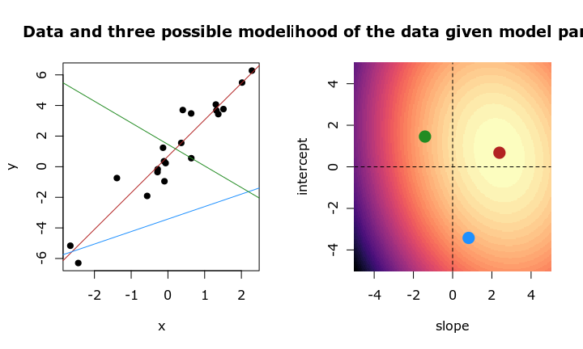

---
# Please do not edit this file directly; it is auto generated.
# Instead, please edit 03-regression-feature-selection.md in _episodes_rmd/
title: "Feature selection for regression"
teaching: 45
exercises: 15
questions:
- "Why would we want to find a subset of features
  that are associated with an outcome?"
- "How should we *not* select features?"
- "How can we iteratively find a good subset of our features
  variables to use for regression?"
- "What are some risks and downsides of iterative feature
  selection?"
objectives:
- "Understand multiple regression in a biomedical context."
- "Understand how to fit a stepwise regression model."
keypoints:
- "Sets of features can be more predictive and provide
  a better explanation than a single feature alone."
- "Stepwise regression allows us to find a set of features that
  are associated with an outcome (eg, age)."
- "Stepwise regression is not very efficient."
# - "Stepwise regression will tend to retain only one
#   feature out of many that are correlated."
math: yes
---

# Introduction

First, let's read in the data from the last lesson.

~~~
library("here")
library("minfi")
methylation <- readRDS(here("data/methylation.rds"))

## here, we transpose the matrix to have features as rows and samples as columns
methyl_mat <- t(assay(methylation))
age <- methylation$Age
~~~
{: .language-r}

# Why would we want to do feature selection?

In the previous lesson we did a kind of feature selection by doing
univariate analysis and thresholding by p-value/effect size.

However we might think there's some combination of methylation features
that combined explain age. For example, if we want to be able to predict age 
from methylation, that's a lot easier if we figure out what the contribution
of each feature is conditional on all others, rather than independent of
all others.

$$
    y_j = \beta_0 + \beta_1 X_1 + \dots \beta_p X_p + \epsilon_j
$$

However when the number of predictors is greater than the number of samples
(basically always true in genetics) it isn't possible to include everything!

What happens if we try to fit a model here?

~~~
fit <- lm(age ~ methyl_mat)
summary(fit)
~~~
{: .language-r}

~~~

Call:
lm(formula = age ~ methyl_mat)

Residuals:
ALL 37 residuals are 0: no residual degrees of freedom!

Coefficients: (4964 not defined because of singularities)
                          Estimate Std. Error t value Pr(>|t|)
(Intercept)               2640.474        NaN     NaN      NaN
methyl_matcg00075967      -108.216        NaN     NaN      NaN
methyl_matcg00374717      -139.637        NaN     NaN      NaN
methyl_matcg00864867        33.102        NaN     NaN      NaN
methyl_matcg00945507        72.250        NaN     NaN      NaN
 [ reached getOption("max.print") -- omitted 4996 rows ]

Residual standard error: NaN on 0 degrees of freedom
Multiple R-squared:      1,	Adjusted R-squared:    NaN 
F-statistic:   NaN on 36 and 0 DF,  p-value: NA
~~~
{: .output}

Since we can't do that mathematically, we have to find another way.

# Best subset selection

Best subset selection is one way of finding a subset of features
that can predict an outcome. This works by trying every possible subset
of features to find which is the best combination.
This works, but is really computationally demanding,
because the number of possible combinations of features is actually 
$2^{n - 1}$. This means that for $10$ features, we need to estimate
$2^9=512$ models, and for $100$ features this already rises to 
$2^99 \approx 6.3e29$. You can imagine that this becomes *very* slow quite quickly!

First, we'll try it with a small subset of the methylation data
with only 10 features and 37 samples. Programming this by hand would be
quite difficult, but thankfully the `leaps` package implements a quick way
to do it. They term it "exhaustive search" because we are exhausting every
possible combination of features to find the best one.

~~~
library("leaps")
small_methyl <- methyl_mat[, 1:10]
fit_bs <- regsubsets(
  x = small_methyl,
  y = age,
  method = "exhaustive"
)
summ <- summary(fit_bs)
coef(fit_bs, which.min(summ$rss))
~~~
{: .language-r}

~~~
(Intercept)  cg00374717  cg00864867  cg01027739  cg01353448  cg01584473 
 145.118554    1.073187   13.767298   22.683667    9.489186  -14.784050 
 cg01644850  cg01656216  cg01873645 
   4.853302    7.915842   -9.715682 
~~~
{: .output}

If we try to run best subset selection on the full dataset, we run into 
problems:

~~~
fit_bs <- regsubsets(
  x = methyl_mat,
  y = age,
  method = "exhaustive"
)
~~~
{: .language-r}

~~~
Warning in leaps.setup(x, y, wt = weights, nbest = nbest, nvmax = nvmax, : 4964
linear dependencies found
~~~
{: .warning}

~~~
Error in leaps.exhaustive(a, really.big = really.big): Exhaustive search will be S L O W, must specify really.big=T
~~~
{: .error}

The function in this case refuses to proceed unless we are sure we want
to wait around for a long time. It's worth noting this may not even finish
at all, as the process is likely to run out of memory given for 5000
features it needs to try $2^{4999}$ models (this number is to big to be 
represented as a floating point number in R!).

~~~
2^4999
~~~
{: .language-r}

~~~
[1] Inf
~~~
{: .output}

This is a general problem with best subset selection (here termed
BS). Forward stepwise selection (FS) is an alternative that is a bit more
manageable.

Figure taken from [Hastie et al. (2020)](https://www.stat.cmu.edu/~ryantibs/papers/bestsubset.pdf),
published [here](https://doi.org/10.1214/19-STS733).

## Prostate data

Since we have many more features than observations in this 
methylation data, we'll work with the `Prostate` dataset
that's available in the `lasso2` package for this model selection lesson.

~~~
library("lasso2")
data(Prostate)
~~~
{: .language-r}

These data come from a study examining the correlation between levels of 
prostate-specific antigen and other relevant clinical measures for
men receiving prostate surgery. The columns in this data are as follows:

- `lcavol`: log(cancer volume)
- `lweight`: log(prostate weight)
- `age`: age
- `lbph`: log(benign prostatic hyperplasia amount)
- `svi`: seminal vesicle invasion
- `lcp`: log(capsular penetration)
- `gleason`: [Gleason score](https://en.wikipedia.org/wiki/Gleason_grading_system)
- `pgg45`: percentage Gleason scores 4 or 5
- `lpsa`: log(prostate specific antigen)

The first few rows look like this:

|     lcavol|  lweight| age|      lbph| svi|       lcp| gleason| pgg45|       lpsa|
|----------:|--------:|---:|---------:|---:|---------:|-------:|-----:|----------:|
| -0.5798185| 2.769459|  50| -1.386294|   0| -1.386294|       6|     0| -0.4307829|
| -0.9942523| 3.319626|  58| -1.386294|   0| -1.386294|       6|     0| -0.1625189|
| -0.5108256| 2.691243|  74| -1.386294|   0| -1.386294|       7|    20| -0.1625189|
| -1.2039728| 3.282789|  58| -1.386294|   0| -1.386294|       6|     0| -0.1625189|
|  0.7514161| 3.432373|  62| -1.386294|   0| -1.386294|       6|     0|  0.3715636|
| -1.0498221| 3.228826|  50| -1.386294|   0| -1.386294|       6|     0|  0.7654678|

We'll use `lcavol`, log-transformed cancer volume, as our outcome.

~~~
cancer_volume <- Prostate$lcavol
prostate_mat <- as.matrix(Prostate[, -1])
fit_prostate <- lm(cancer_volume ~ prostate_mat)
summ_prostate <- summary(fit_prostate)
summ_prostate
~~~
{: .language-r}

~~~

Call:
lm(formula = cancer_volume ~ prostate_mat)

Residuals:
     Min       1Q   Median       3Q      Max 
-1.88603 -0.47346 -0.03987  0.55719  1.86870 

Coefficients:
                     Estimate Std. Error t value Pr(>|t|)    
(Intercept)         -2.260101   1.259683  -1.794   0.0762 .  
prostate_matlweight -0.073166   0.174450  -0.419   0.6759    
prostate_matage      0.022736   0.010964   2.074   0.0410 *  
prostate_matlbph    -0.087449   0.058084  -1.506   0.1358    
prostate_matsvi     -0.153591   0.253932  -0.605   0.5468    
prostate_matlcp      0.367300   0.081689   4.496 2.10e-05 ***
prostate_matgleason  0.190759   0.154283   1.236   0.2196    
prostate_matpgg45   -0.007158   0.004326  -1.654   0.1016    
prostate_matlpsa     0.572797   0.085790   6.677 2.11e-09 ***
---
Signif. codes:  0 '***' 0.001 '**' 0.01 '*' 0.05 '.' 0.1 ' ' 1

Residual standard error: 0.6998 on 88 degrees of freedom
Multiple R-squared:  0.6769,	Adjusted R-squared:  0.6475 
F-statistic: 23.04 on 8 and 88 DF,  p-value: < 2.2e-16
~~~
{: .output}

## Scaling features

You may notice that the magnitude of the coefficients in this model vary
dramatically! This is because the scale of each feature is very different,
with some being integers with a large range (`age`) and others being numeric
with a smaller range (lcavol). While this doesn't make any difference when it
comes to statistical significance testing for our features,
it does make it difficult to compare 
the relative impact of different features.

Scaling features to have mean zero and standard deviation of one
means that a coefficient value of 1 means that the outcome changes by one
unit for every standard deviation of the input feature. You may not always
want to do this

To scale our data, we can use the `scale` function.

~~~
prostate_scaled <- scale(prostate_mat)
~~~
{: .language-r}

> ## Exercise 
> 
> 1. Fit a model with the scaled data and compare with the unscaled data.
> 2. Which coefficients are different between the scaled and unscaled model? Why
>    do you think that is?
> 
> > ## Solution
> > 1. 
> >    
> >    ~~~
> >    fit_prostate_scaled <- lm(cancer_volume ~ prostate_scaled)
> >    summ_scaled <- summary(fit_prostate_scaled)
> >    summ_scaled
> >    plot(summ_prostate$coef[, "Pr(>|t|)"], summ_scaled$coef[, "Pr(>|t|)"],
> >      xlab = "Coefficients without scaling",
> >      ylab = "Coefficients with scaling"
> >    )
> >     2. The intercept is different, because the mean and scale of the input
> >    features have changed! If we were to scale the output, that would also
> >    change the intercept. The intercept quantifies the difference in means
> >    independent of changes in the features.
> >     
> >    ~~~
> >    {: .language-r}
> >    
> >    
> >    
> >    ~~~
> >    Error: <text>:8:5: unexpected symbol
> >    7: )
> >    8:  2. The
> >           ^
> >    ~~~
> >    {: .error}
> {: .solution}
{: .challenge}

# Inference and prediction

Now that we've made a "baseline" model with all of the features we have 
available, we might want to see if we really need to measure all of these things
to be able to predict cancer volume. For example, we might find that the main
dependence in our data is between PSA and cancer volume, and most of the other
features. This type of procedure can provide a benefit for both *inference* and 
*prediction*.

Inference refers to our ability to use statistical models to 
inform our understanding of a biological system, in this case disease. For
example, if we find that PSA is , that might hint towards some mechanistic
relationship between this antigen and cancer progression that we can investigate
further experimentally.

Prediction refers to our ability to use features measured on unseen data to 
predict our outcome. In this case, this might be to predict cancer volume
from PSA. This can be useful if the features we use to predict are more easy to 
measure than our outcome. In this case, PSA can be measured from blood samples,
while cancer volume requires surgery. Further, predicting cancer volume from
PSA would allow us to prioritise patients likely to have higher cancer volume
for surgery, hopefully resulting in better outcomes for patients with severe
disease.

These two aims aren't always independent. For example, to be sure that the
inference we're making about the system under investigation, we want a strong
relationship (corresponding to high predictive accuracy). Furthermore, it's
always good to examine the features in a predictive model to be sure
they actually make sense. For example, if we found that the features
in a predictive 

To measure predictive accuracy, we can use the residual sum of squares (RSS).
This is the sum of the square of the length of the dashed lines in the plot
below. A low RSS value means that our predictions are very close to the 
values we really observe.

> ## Exercise 
> 
> Do best subset with the prostate data.
> 
> > ## Solution
> > 
> > ~~~
> > fit_bs <- regsubsets(
> >   x = prostate_mat,
> >   y = cancer_volume,
> >   method = "exhaustive"
> > )
> > summ_bs <- summary(fit_bs)
> > coef(fit_bs, which.min(summ_bs$rss))
> > ~~~
> > {: .language-r}
> > 
> > 
> > 
> > ~~~
> >  (Intercept)      lweight          age         lbph          svi          lcp 
> > -2.260100746 -0.073166458  0.022736050 -0.087449206 -0.153591285  0.367299994 
> >      gleason        pgg45         lpsa 
> >  0.190758511 -0.007157575  0.572797361 
> > ~~~
> > {: .output}
> {: .solution}
{: .challenge}

# Model metrics

In the example above we used RSS (residual sum of squares) to choose a model.
However when comparing models with different numbers of features, this is
problematic. We could, for example, keep adding features that marginally 
reduce the RSS (because adding a feature will never make it worse!) and
under this framework we'll always select the biggest model.

For example, if we have as many features as observations, the fit is always
perfect ($R^2$ is exactly 1 and $RSS$ exactly 0).

~~~
square_mat <- prostate_mat[90:nrow(prostate_mat), ]
dim(square_mat)
~~~
{: .language-r}

~~~
[1] 8 8
~~~
{: .output}

~~~
short_volume <- cancer_volume[1:ncol(prostate_mat)]
fit_square <- lm(
  short_volume ~ 0 + .,
  data = as.data.frame(square_mat)
)
summary(fit_square)
~~~
{: .language-r}

~~~

Call:
lm(formula = short_volume ~ 0 + ., data = as.data.frame(square_mat))

Residuals:
ALL 8 residuals are 0: no residual degrees of freedom!

Coefficients:
         Estimate Std. Error t value Pr(>|t|)
lweight  2.337877        NaN     NaN      NaN
age     -0.069687        NaN     NaN      NaN
lbph     0.732855        NaN     NaN      NaN
svi     -0.464934        NaN     NaN      NaN
lcp      0.434385        NaN     NaN      NaN
gleason -0.601734        NaN     NaN      NaN
pgg45    0.004366        NaN     NaN      NaN
lpsa    -0.152990        NaN     NaN      NaN

Residual standard error: NaN on 0 degrees of freedom
Multiple R-squared:      1,	Adjusted R-squared:    NaN 
F-statistic:   NaN on 8 and 0 DF,  p-value: NA
~~~
{: .output}

~~~
sum(residuals(fit_square)^2)
~~~
{: .language-r}

~~~
[1] 0
~~~
{: .output}

There are other ways to measure model performance while accounting for the
complexity of the model. For example, adjusted $R^2$ is similar to the normal
R^2 measure that estimates the variation explained by the model, while also
accounting for the number of features. This is explained
in more detail in [the multiple regression lesson](https://carpentries-incubator.github.io/multiple-linear-regression-public-health/).

There are also measures known as "information criteria" that are useful for
model comparison and selection. These measure the likelihood of observing
the data we have observed under the model under investigation, while penalising
complex models. Two popular examples are BIC (Bayesian information criterion)
and AIC (Akaike information criterion).

> ## BIC and AIC
> 
> BIC and AIC have some notable differences. For one, BIC tends to penalise
> parameters more than AIC, and AIC does not accounts for the number of
> observations.
> Because of this, AIC may select overly complex models with low samples sizes.
>
> Formally, BIC is defined
> 
> $$
>   BIC = p \log(n) - 2 \log(L)
> $$
> 
> where $p$ is the number of features in the model, $n$ is the number of 
> observations, and $L$ is the likelihood of observing the data given our model.
> Similarly,
> 
> $$
>   AIC = 2p - 2\log(L)
> $$
>
> The likelihood of the data given a model is the probability of observing
> the given data under that model. By checking the likelihood of the same data
> under different models, we can narrow down our choice of model.
> 
> In the example below, the maximum likelihood estimate is shown in red,
> and two alternative models are shown in blue and green. The data are less 
> likely to be observed under these models, as we can see in the left panel
> of the plot. We can see this concretely in the right panel, as the likelihood
> of the data is highest in the light region where the maximum likelihood 
> estimate resides, and the points representing the other models reside in
> lower likelihood regions.
>
> This is a difficult concept to grasp at first, but can be a very powerful
> tool for thinking about data and models, and is a foundation of many more
> advanced topics in statistics.
> 
> 
{: .callout}

> ## Exercise
>
> Select the best model based on BIC. How does this differ to the best RSS 
> model?
> 
> > ## Solution
> > 
> > 
> > 
> > ~~~
> > coef(fit_bs, id = which.min(summ_bs$bic))
> > ~~~
> > {: .language-r}
> > 
> > 
> > 
> > ~~~
> > (Intercept)         lcp        lpsa 
> >  0.09134598  0.32837479  0.53162109 
> > ~~~
> > {: .output}
> > 
> > 
> > 
> > ~~~
> > coef(fit_bs, id = which.min(summ_bs$rss))
> > ~~~
> > {: .language-r}
> > 
> > 
> > 
> > ~~~
> >  (Intercept)      lweight          age         lbph          svi          lcp 
> > -2.260100746 -0.073166458  0.022736050 -0.087449206 -0.153591285  0.367299994 
> >      gleason        pgg45         lpsa 
> >  0.190758511 -0.007157575  0.572797361 
> > ~~~
> > {: .output}
> {: .solution}
{: .challenge}

> ## Selecting a model
> 
> What we've done so far is to select models using their performance on the
> data we've used to fit the model. This isn't always ideal, because it assumes
> that the data we're using to fit the model is exactly representative
> of the entire population we're interested in.
> However, usually our experiments are limited to only a small sample of
> a very large population (in this case, 97 patients out of a total population
> of many millions!)
> 
> One way to address this is to split the data in two. We then use part of
> the data to fit the model, and part of the data to evaluate the accuracy of
> the model. This may reduce the amount of data we have available to fit the 
> model, but it means we can be more confident about the performance of the
> model afterwards.
> 
> This is especially important when our goal is prediction. Predictive 
> performance in the data used to train the model is typically very good,
> even when predictive performance on new, unseen data is very poor.
> 
> Predictive performance on unseen data can be thought of a measure of how
> well our findings *generalise*.
> 
{: .callout}

# Forward stepwise selection

Since best subset selection is computationally hard, we can instead do an 
approximation to. One of these is forward stepwise selection.

This is an iterative process. First, we fit a model with just an intercept
and one feature. Then

1. Pick the most significant feature
2. fit a model with that feature and every other
3. if any are a significant improvement, pick the model that has the best
   improvement and return to 2.
4. Otherwise, stop.

> ## Exercise
> 
> 1. Apply forward subset selection to the prostate dataset (hint: try setting
>    `method = "forward"`).
> 2. Select the best model based on BIC.
> 3. Fit a model with `lm` using these features.
> 
> > ## Solution
> >
> > 
> > ~~~
> > fit_fwd <- regsubsets(
> >   x = prostate_mat,
> >   y = cancer_volume,
> >   method = "forward"
> > )
> > summ_fwd <- summary(fit_fwd)
> > est_coef_fwd <- coef(
> >   fit_fwd,
> >   id = which.min(summ_fwd$bic)
> > )
> > est_coef_fwd
> > ~~~
> > {: .language-r}
> > 
> > 
> > 
> > ~~~
> > (Intercept)         lcp        lpsa 
> >  0.09134598  0.32837479  0.53162109 
> > ~~~
> > {: .output}
> > 
> > 
> > 
> > ~~~
> > chosen_coef_fwd <- names(est_coef_fwd)
> > fit_fwd_lm <- lm(
> >   cancer_volume ~ .,
> >   data = as.data.frame(prostate_mat[, chosen_coef_fwd[-1]])
> > )
> > summary(fit_fwd_lm)
> > ~~~
> > {: .language-r}
> > 
> > 
> > 
> > ~~~
> > 
> > Call:
> > lm(formula = cancer_volume ~ ., data = as.data.frame(prostate_mat[, 
> >     chosen_coef_fwd[-1]]))
> > 
> > Residuals:
> >      Min       1Q   Median       3Q      Max 
> > -1.65744 -0.54398 -0.05502  0.57163  2.07959 
> > 
> > Coefficients:
> >             Estimate Std. Error t value Pr(>|t|)    
> > (Intercept)  0.09135    0.20527   0.445    0.657    
> > lcp          0.32837    0.06193   5.303 7.54e-07 ***
> > lpsa         0.53162    0.07501   7.087 2.49e-10 ***
> > ---
> > Signif. codes:  0 '***' 0.001 '**' 0.01 '*' 0.05 '.' 0.1 ' ' 1
> > 
> > Residual standard error: 0.7092 on 94 degrees of freedom
> > Multiple R-squared:  0.6455,	Adjusted R-squared:  0.6379 
> > F-statistic: 85.57 on 2 and 94 DF,  p-value: < 2.2e-16
> > ~~~
> > {: .output}
> {: .solution}
{: .challenge}

# Reverse stepwise selection

If we have a model as a starting point and we want to slim it down, we
can do reverse stepwise selection. In this case we might use all of the 
features available because we only have a few, but if we had more features
we might pick all those we think might be related to the outcome.

The process is similar to forward stepwise  selection, but here we start with
a model containing all of the features we might include. We then

1. Fit models by dropping each feature in turn.
2. Choose the model with the smallest drop in performance (or BIC, AIC).
3. If no features have a small drop in performance, stop.
4. Otherwise, return to step 1.

The `leaps` package also allows us to do this process.

> ## Exercise
> 
> Do reverse subset selection and compare the forward and reverse stepwise
> selection models.
> 
> > ## Solution
> >
> > 
> > ~~~
> > fit_bwd <- regsubsets(
> >   x = prostate_mat,
> >   y = cancer_volume,
> >   method = "backward"
> > )
> > summ_bwd <- summary(fit_bwd)
> > est_coef_bwd <- coef(
> >   fit_bwd,
> >   id = which.min(summ_bwd$bic)
> > )
> > est_coef_bwd
> > ~~~
> > {: .language-r}
> > 
> > 
> > 
> > ~~~
> > (Intercept)         lcp        lpsa 
> >  0.09134598  0.32837479  0.53162109 
> > ~~~
> > {: .output}
> > 
> > 
> > 
> > ~~~
> > chosen_coef_bwd <- names(est_coef_bwd)
> > fit_bwd_lm <- lm(
> >   cancer_volume ~ .,
> >   data = as.data.frame(prostate_mat[, chosen_coef_bwd[-1]])
> > )
> > summary(fit_bwd_lm)
> > ~~~
> > {: .language-r}
> > 
> > 
> > 
> > ~~~
> > 
> > Call:
> > lm(formula = cancer_volume ~ ., data = as.data.frame(prostate_mat[, 
> >     chosen_coef_bwd[-1]]))
> > 
> > Residuals:
> >      Min       1Q   Median       3Q      Max 
> > -1.65744 -0.54398 -0.05502  0.57163  2.07959 
> > 
> > Coefficients:
> >             Estimate Std. Error t value Pr(>|t|)    
> > (Intercept)  0.09135    0.20527   0.445    0.657    
> > lcp          0.32837    0.06193   5.303 7.54e-07 ***
> > lpsa         0.53162    0.07501   7.087 2.49e-10 ***
> > ---
> > Signif. codes:  0 '***' 0.001 '**' 0.01 '*' 0.05 '.' 0.1 ' ' 1
> > 
> > Residual standard error: 0.7092 on 94 degrees of freedom
> > Multiple R-squared:  0.6455,	Adjusted R-squared:  0.6379 
> > F-statistic: 85.57 on 2 and 94 DF,  p-value: < 2.2e-16
> > ~~~
> > {: .output}
> {: .solution}
{: .challenge}

> ## Forward-reverse stepwise selection (both at once)
> 
> As well as doing forward stepwise selection and reverse stepwise selection,
> it's also possible to do a combined procedure. Here, we might start with
> only an intercept, and try to add one feature at a time. However, after
> adding each feature, we then also try to drop each of the features we've added
> so far. After dropping
> or adding features, we proceed only if the model improves (when adding)
> or doesn't drastically worsen (if removing).
> 
> This is more computationally demanding than forward and reverse stepwise 
> selection, and it is important to consider how many models we're fitting
> when interpreting the results. With a lot of different combinations,
> some will probably look very good!
> 
{: .callout}


