---
# Please do not edit this file directly; it is auto generated.
# Instead, please edit 03-regression-regularisation.md in _episodes_rmd/
title: "Regularised regression"
teaching: 60
exercises: 20
questions:
- "What is regularisation?"
- "How does regularisation work?"
- "How can we select the level of regularisation for a model?"
objectives:
- "Understand the benefits of regularised models."
- "Understand how different types of regularisation work."
- "Apply and critically analyse regularised regression models."
keypoints:
- Regularisation is a way to fit a model, get better estimates of effect sizes,
  and perform variable selection simultaneously.
- Test and training splits, or cross-validation, are a useful way to select
  models or hyperparameters.
- Regularisation can give us a more predictive set of variables, and by
  restricting the magnitude of coefficients, can give us a better
  (and more stable) estimate of our outcome.
- Regularisation is often *very* fast! Compared to other methods for variable
  selection, it is very efficient. This makes it easier to practice rigorous
  variable selection.
math: yes
---

# Introduction

In the previous lesson we fit a lot of linear models to find a subset of
features that are associated with our outcome of interest. This type of
analysis is very useful when we have a lot of features and we want to identify
ones that are related to our outcome. This is one 
way of finding features that are associated with our outcome,
but it treats each feature independently.

However we might think there's some combination of methylation features
that together explain age. For example, if we want to be able to predict age 
from methylation, that's a lot easier if we figure out what the contribution
of each feature is conditional on all others, rather than independent of
all others.

$$
    \mathbf{E}(y) = \beta_0 + \beta_1 X_1 + \dots \beta_p X_p
$$

However when the number of predictors is greater than the number of samples
(basically always true in genetics) it isn't possible to include everything!
What happens if we try to fit a model in this situation?
First, let's read in the data from the last lesson.

~~~
library("here")
library("minfi")
~~~
{: .language-r}

~~~
Warning: replacing previous import 'utils::download.file' by
'restfulr::download.file' when loading 'rtracklayer'
~~~
{: .warning}

~~~
methylation <- readRDS(here("data/methylation.rds"))

## here, we transpose the matrix to have features as rows and samples as columns
methyl_mat <- t(assay(methylation))
age <- methylation$Age
~~~
{: .language-r}

Then, we can try to fit a model of age using all of the 5,000 features in this
dataset.

~~~
fit <- lm(age ~ methyl_mat)
summary(fit)
~~~
{: .language-r}

~~~

Call:
lm(formula = age ~ methyl_mat)

Residuals:
ALL 37 residuals are 0: no residual degrees of freedom!

Coefficients: (4964 not defined because of singularities)
                          Estimate Std. Error t value Pr(>|t|)
(Intercept)               2640.474        NaN     NaN      NaN
methyl_matcg00075967      -108.216        NaN     NaN      NaN
methyl_matcg00374717      -139.637        NaN     NaN      NaN
methyl_matcg00864867        33.102        NaN     NaN      NaN
methyl_matcg00945507        72.250        NaN     NaN      NaN
 [ reached getOption("max.print") -- omitted 4996 rows ]

Residual standard error: NaN on 0 degrees of freedom
Multiple R-squared:      1,	Adjusted R-squared:    NaN 
F-statistic:   NaN on 36 and 0 DF,  p-value: NA
~~~
{: .output}

You can see that we're able to get some effect size estimates, but they seem very 
high! The summary also says that we were unable to estimate
effect sizes for 4,964 features
because of "singularities". What this means is that R couldn't find a way to
perform the calculations necessary due to the fact that we have more features
than observations.
Since we can't mathematically fit a model like this, we have to find another
way.

> ## Singularities
> 
> The message that `lm` produced is not necessarily the most intuitive. What
> are "singularities", and why are they an issue? A singular matrix 
> is one that cannot be
> [inverted](https://en.wikipedia.org/wiki/Invertible_matrix).
> The inverse of an $n \times n$ square matrix $A$ is the matrix $B$ for which
> $AB = BA = I_n$, where $I_n$ is the $n \times n$ identity matrix.
> 
> Why is the inverse important? Well, to find the
> coefficients of a linear model of a matrix of predictor features $X$ and an
> outcome vector $y$, we may perform the calculation 
> 
> $$
>     (X^TX)^{-1}X^Ty
> $$
> 
> You can see that, if we're unable to find the inverse of the matrix $X^TX$,
> then we'll be unable to find the regression coefficients. 
> 
> Why might this be the case?
> Well, when the [determinant](https://en.wikipedia.org/wiki/Determinant)
> of the matrix is zero, we are unable to find its inverse.
> 
> 
> ~~~
> xtx <- t(methyl_mat) %*% methyl_mat
> det(xtx)
> ~~~
> {: .language-r}
> 
> 
> 
> ~~~
> [1] 0
> ~~~
> {: .output}
{: .callout}

Often, we have many variables that are all very correlated, with plenty
of noise. For example, if we look at the `Prostate` data in the `lasso2` 
package, we can calculate the Pearson correlation between each feature in the
data. This measures how similar the patterns of variation in these features
are across all of the observations in this dataset.
We can see that in the prostate data, the few variables we have are generally
pretty independent. 

If we do the same for the methylation dataset, in contrast, we can see that many
of the features essentially represent the same information. This can present
problems for a lot of the mathematical techniques we use to calculate a linear
regression model.

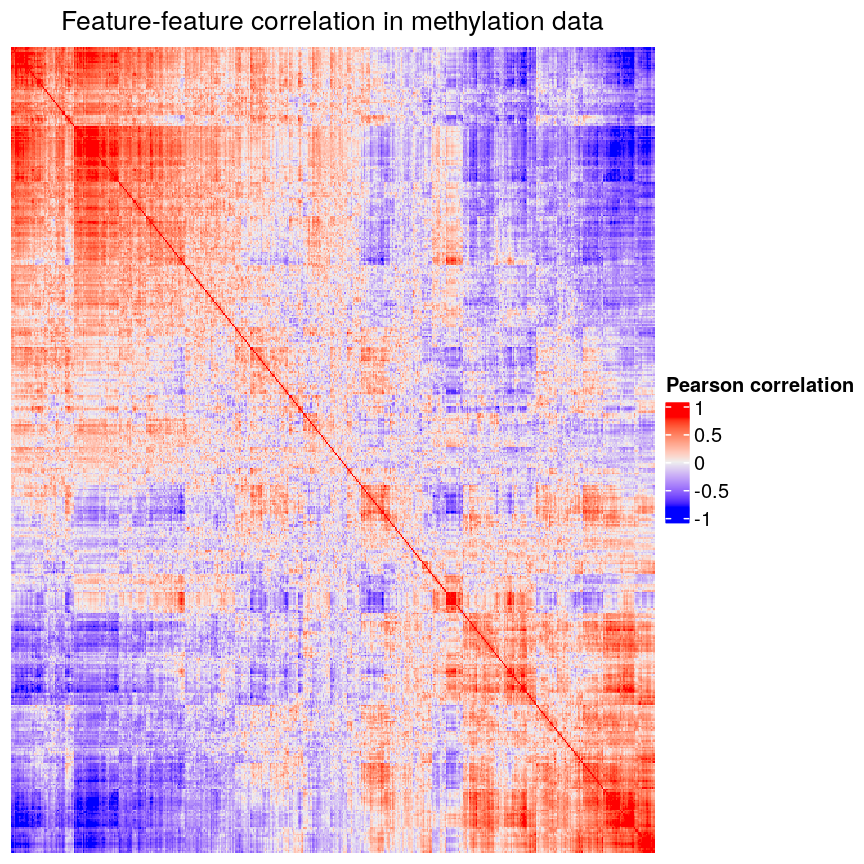

For technical reasons, this correlation can be problematic, and if it's 
very severe it may even make it impossible to fit a model! This is aside 
from the fact that with more features than observations, we can't even estimate
the model properly.

> ## Exercise
> 
> Discuss in  groups:
> 
> 1. Why would we observe correlated features in high-dimensional biological
>    data?
> 1. Why might correlated features be a problem when fitting linear models?
> 1. What issue might correlated features present when selecting features to include in a model one at a time?
> 
> > ## Solution
> >
> > 1. Many of the features in biological data represent very similar 
> >    information biologically. For example, sets of genes that form complexes
> >    are often expressed in very similar quantities. Similarly, methylation
> >    levels at nearby sites are often very highly correlated.
> > 1. Correlated features can make inference unstable or even impossible
> >    mathematically.
> > 1. When we are selecting features one at a time we want to pick the most predictive feature each time. 
> >    When a lot of features are very similar but encode
> >    slightly different information, which of the correlated features we 
> >    select to include can have a huge impact on the later stages of model selection!
> > 
> {: .solution}
{: .challenge}

# The objective of a linear model

When we fit a linear model, we're finding the line through our data that 
minimises the sum of the squared residuals.
We can think of that as finding
the slope and intercept that minimises the square of the length of the dashed
lines. In this case, the red line in the left panel is the line that
accomplishes this objective, and the red dot in the right panel is the point 
that represents this line in terms of its slope and intercept among many 
different possible models, where the background colour represents how well
different combinations of slope and intercept accomplish this objective.

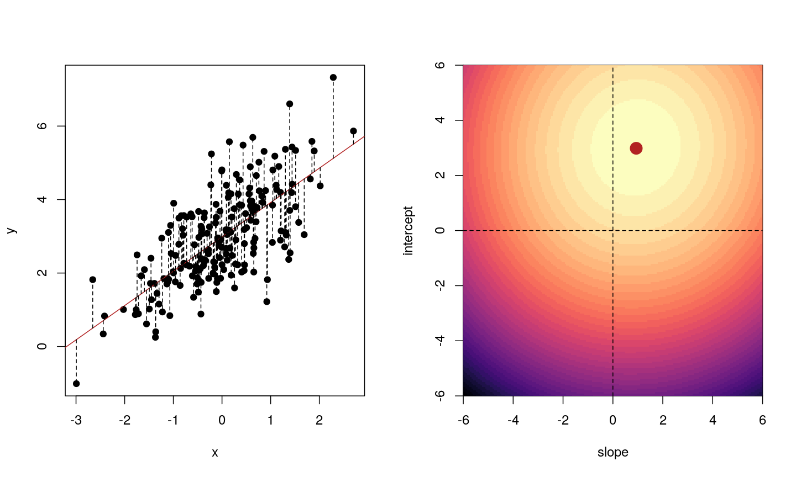

Mathematically, we can write the sum of squared residuals as

$$
    \sum_{i=1}^N ( y_i-X_i\beta)^2
$$

where $\hat{y}_i$ is the predicted y value for each input data
point $X_i$, and $y_i$ is the true observed value.
This line is the line of best fit through our data when considering this
goal of minimising the sum of squared error. However, it is not the only 
possible line we could use! For example, we might want to err on the side of
caution when estimating effect sizes. That is, we might want to avoid estimating
very large effect sizes. This can help us to create *generalisable*
models.

> ## Exercise
> 
> Discuss in groups:
> 
> 1. What are we minimising when we fit a linear model?
> 2. Why are we minimising this objective? What assumptions are we making
>    about our data when we do so?
> 
> > ## Solution
> >
> > 1. When we fit a linear model we are minimising the squared error.
> >    In fact, the standard linear model estimator is often known as
> >    "ordinary least squares". The "ordinary" really means "original" here,
> >    to distinguish between this method, which dates back to ~1800, and some
> >    more "recent" (think 1940s...) methods.
> > 2. Least squares assumes that, when we account for the change in the mean of
> >    the outcome based on changes in the income, the data are normally
> >    distributed. That is, the *residuals* of the model, or the error 
> >    left over after we account for any linear relationships in the data,
> >    are normally distributed, and have a fixed variance.
> >    
> >
> {: .solution}
{: .challenge}

# Model selection

Measures like adjusted $R^2$, AIC and
BIC show us how well the model is learning the data used in fitting the model [^1]. These are really good ways of telling us how
well the model is learning to fit the data we're using as an 
input. However, this doesn't really tell us how well the model will generalise to new data. This is an important thing to 
consider -- if our model doesn't generalise to new data,
then there's a chance that it's just picking up on a technical or batch effect in our data, or simply some noise that happens
to fit the outcome we're modelling.
This is especially important when our goal is prediction -- 
it's not much good if we can only predict well for samples where
the outcome is already known, after all!

To get an idea of how well our model generalises, we can split the data into
two - "training" and "test" sets. We use the "training" data to fit the model,
and then see its performance on the "test" data.

One thing that happens a lot of the time in this context is that large 
coefficient values minimise the training error, but they don't minimise the 
test error on unseen data. First, we'll go through an example of what exactly 
this means.

For the next few exercises, we'll work with a set of features
known to be associated with age from a paper by Horvath et al.[^2]. Horvath et al, use methylation markers alone to predict the biological age of an individual. This is useful in studying age-related disease amongst many other things.

~~~
coef_horvath <- readRDS(here::here("data/coefHorvath.rds"))
methylation <- readRDS(here::here("data/methylation.rds"))

library("SummarizedExperiment")
age <- methylation$Age
methyl_mat <- t(assay(methylation))

coef_horvath <- coef_horvath[1:20, ]
features <- coef_horvath$CpGmarker
horvath_mat <- methyl_mat[, features]

## Generate an index to split the data
set.seed(42)
train_ind <- sample(nrow(methyl_mat), 25)
~~~
{: .language-r}

> ## Exercise
> 
> 1. Split the methylation data matrix and the age vector
>    into training and test sets.
> 2. Fit a model on the training data matrix and training age 
>    vector.
> 3. Check the mean squared error on this model.
> 
> > ## Solution
> >
> > 1. Splitting the data involves using our index to split up the matrix and
> >    the age vector into two each. We can use a negative subscript to create
> >    the test data.
> >    
> >    
> >    ~~~
> >    train_mat <- horvath_mat[train_ind, ]
> >    train_age <- age[train_ind]
> >    test_mat <- horvath_mat[-train_ind, ]
> >    test_age <- age[-train_ind]
> >    ~~~
> >    {: .language-r}
> > 
> > 2. To 
> >    
> >    
> >    ~~~
> >    fit_horvath <- lm(train_age ~ ., data = as.data.frame(train_mat))
> >    ~~~
> >    {: .language-r}
> > 
> > 3. The mean squared error of the model is the mean of the square of the
> >    residuals. This seems very low here -- on average we're only off by 
> >    about a year!
> >    
> >    ~~~
> >    mean(residuals(fit_horvath)^2)
> >    ~~~
> >    {: .language-r}
> >    
> >    
> >    
> >    ~~~
> >    [1] 1.319628
> >    ~~~
> >    {: .output}
> >
> {: .solution}
{: .challenge}

With this model, now we can check how well it does. Here we use the mean of
the squared difference between our predictions and the true ages for the test
data, or "mean squared error" (MSE). Unfortunately, it seems like this is a lot
higher than the error on the training data!

~~~
mse <- function(true, prediction) {
    mean((true - prediction)^2)
}
pred_lm <- predict(fit_horvath, newdata = as.data.frame(test_mat))
err_lm <- mse(test_age, pred_lm)
err_lm
~~~
{: .language-r}

~~~
[1] 223.3571
~~~
{: .output}

Further, if we plot true age against predicted age for the samples in the test
set, we can see how well we're really doing - ideally these would line up
exactly!

~~~
par(mfrow = c(1, 1))
plot(test_age, pred_lm, pch = 19)
abline(coef = 0:1, lty = "dashed")
~~~
{: .language-r}

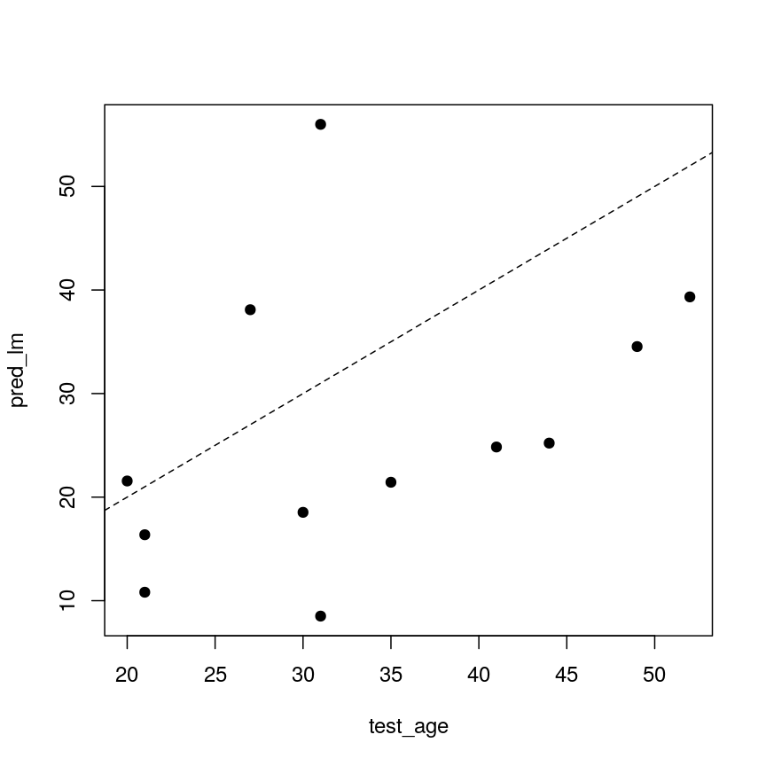

# What is regularisation? (using ridge regression as an example)

One way to tackle these many correlated variables with lots of noise is
*regularisation*.
The idea of regularisation is to add another condition to the problem we're
solving with linear regression. This condition controls the total size of the 
coefficients that come out. 
For example, we might say that the point representing the slope and intercept
must fall within a certain distance of the origin, $(0, 0)$. Note that
we are still trying to solve for the line that minimises the square of the
residuals; we are just adding this extra constraint to our solution. 

For the 2-parameter model (slope and intercept), we could
visualise this constraint as a circle with a given radius. We 
want to find the "best" solution (in terms of minimising the 
residuals) that also falls within a circle of a given radius 
(in this case, 2).

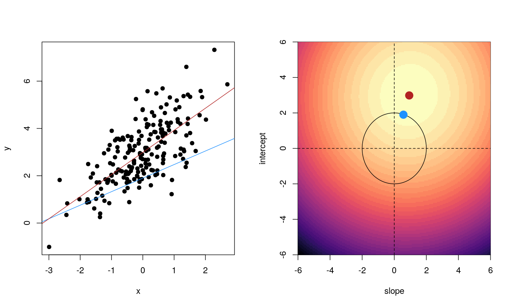

There are multiple ways to define the distance that our solution must fall in,
though. The one we've plotted above controls the squared sum of the 
coefficients, $\beta$.
This is also sometimes called the $L^2$ norm. This is defined as

$$
    \left\lVert \beta\right\lVert_2 = \sqrt{\sum_{j=1}^p \beta_j^2} 
$$

To control this, we specify that the solution for the equation above
also has to have an $L^2$ norm smaller than a certain amount. Or, equivalently,
we try to minimise a function that includes our $L^2$ norm scaled by a 
factor that is usually written $\lambda$.

$$
     \sum_{i=1}^N \biggl( y_i - X_i\beta\biggr)^2  + \lambda \left\lVert \beta \right\lVert_2 ^2
$$

Another way of thinking about this is that when finding the best model, we're
weighing up a balance of the ordinary least squares objective and a "penalty"
term that punished models with large coefficients. The balance between the
penalty and the ordinary least squares objective is controlled by $\lambda$ - 
when $\lambda$ is large, we care a lot about the size of the coefficients.
When it's small, we don't really care a lot. When it's zero, we're back to
just using ordinary least squares.

# Why would we want to restrict our model?

It's an odd thing to do, restrict the possible values of our model parameters, 
though! Why would we want to do this? Well firstly, when we have many 
correlated features our model estimates can be very unstable or even difficult
to calculate. Secondly, this type of approach can make our model more 
generalisable. To show this,
we'll fit a model using the Horvath methylation predictors, using both
regularised and ordinary least squares.

~~~
library("glmnet")

## glmnet() performs scaling by default, supply un-scaled data:
horvath_mat <- methyl_mat[, features] # select the first 20 sites as before
train_mat <- horvath_mat[train_ind, ] # use the same individuals as selected before
test_mat <- horvath_mat[-train_ind, ]

ridge_fit <- glmnet(x = train_mat, y = train_age, alpha = 0)
plot(ridge_fit, xvar = "lambda")
abline(h = 0, lty = "dashed")
~~~
{: .language-r}

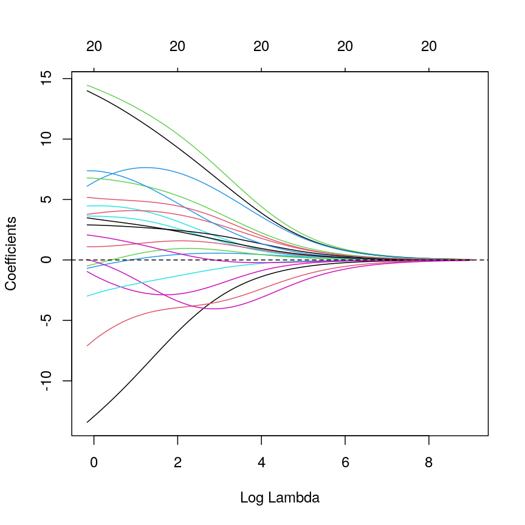

This plot shows how the coefficients change as we increase the penalty. That is,
as we decrease the size of the region that solutions can fall into, the values
of the coefficients that we get back tend to decrease. In this case,
coefficients trend towards zero but generally don't reach it until the penalty
gets very large. We can see that initially, some parameter estimates are really,
really large, and these tend to shink fairly rapidly.

We can also notice that some parameters "flip signs"; that is, they start off
positive and become negative as lambda grows. This is a sign of collinearity,
or correlated predictors. As we reduce the importance of one feature, we can 
"make up for" the loss in accuracy from that one feature by adding a bit of
weight to another feature that represents similar information.

Since we split the data into test and training data, we can prove that ridge
regression gives us a better prediction in this case:

~~~
pred_ridge <- predict(ridge_fit, newx = test_mat)
err_ridge <- apply(pred_ridge, 2, function(col) mse(test_age, col))
min(err_ridge)
~~~
{: .language-r}

~~~
[1] 46.76802
~~~
{: .output}

~~~
err_lm
~~~
{: .language-r}

~~~
[1] 223.3571
~~~
{: .output}

~~~
which_min_err <- which.min(err_ridge)
min_err_ridge <- min(err_ridge)
pred_min_ridge <- pred_ridge[, which_min_err]
~~~
{: .language-r}

We can see where on the continuum of lambdas we've picked a model by plotting
the coefficient paths again. In this case, we've picked a model with fairly
modest shrinkage.

~~~
chosen_lambda <- ridge_fit$lambda[which.min(err_ridge)]
plot(ridge_fit, xvar = "lambda")
abline(v = log(chosen_lambda), lty = "dashed")
~~~
{: .language-r}

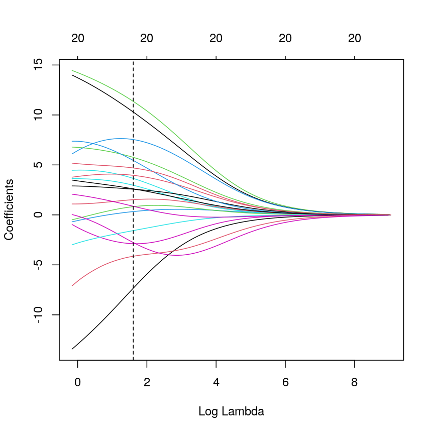

> ## Exercise
> 
> 1. Which performs better, ridge or OLS?
> 2. Plot predicted ages for each method against the true ages.
>    How do the predictions look for both methods? Why might ridge be 
>    performing better?
> 
> > ## Solution
> > 
> > 1. Ridge regression performs significantly better on unseen data, despite
> >    being "worse" on the training data.
> >    
> >    ~~~
> >    min_err_ridge
> >    ~~~
> >    {: .language-r}
> >    
> >    
> >    
> >    ~~~
> >    [1] 46.76802
> >    ~~~
> >    {: .output}
> >    
> >    
> >    
> >    ~~~
> >    err_lm
> >    ~~~
> >    {: .language-r}
> >    
> >    
> >    
> >    ~~~
> >    [1] 223.3571
> >    ~~~
> >    {: .output}
> > 2. The ridge ones are much less spread out with far fewer extreme predictions.
> >    
> >    ~~~
> >    all <- c(pred_lm, test_age, pred_min_ridge)
> >    lims <- range(all)
> >    par(mfrow = 1:2)
> >    plot(test_age, pred_lm,
> >        xlim = lims, ylim = lims,
> >        pch = 19
> >    )
> >    abline(coef = 0:1, lty = "dashed")
> >    plot(test_age, pred_min_ridge,
> >        xlim = lims, ylim = lims,
> >        pch = 19
> >    )
> >    abline(coef = 0:1, lty = "dashed")
> >    ~~~
> >    {: .language-r}
> >    
> >    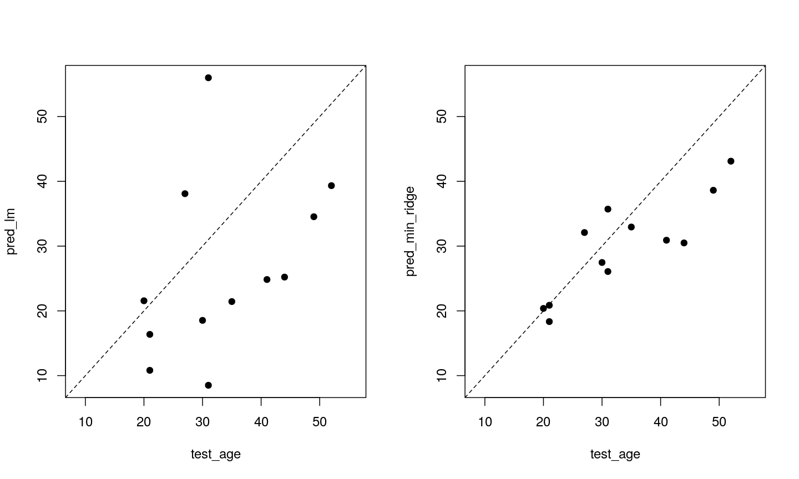
> {: .solution}
{: .challenge}

# LASSO regression

LASSO is another type of regularisation. In this case we use the $L^1$ norm,
or the sum of the absolute values of the coefficients.

$$
    \left\lVert \beta \right\lVert_1 = \sum_{j=1}^p |\beta_j|
$$

This tends to produce sparse models; that is to say, it tends to remove features
from the model that aren't necessary to produce accurate predictions. This
is because the region we're restricting the coefficients to has sharp edges.
So, when we increase the penalty (reduce the norm), it's more likely that
the best solution that falls in this region will be at the corner of this
diagonal (ie, one or more coefficient is exactly zero).

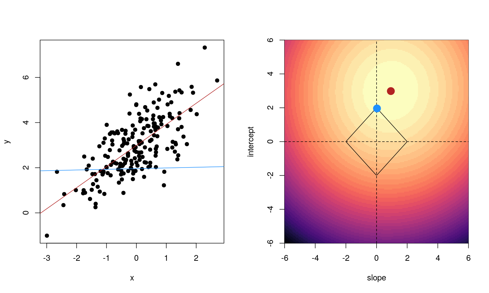

> ## Exercise
> 
> 1. Use `glmnet` to fit a LASSO model (hint: set `alpha = 1`).
> 2. Plot the model object. Remember that for ridge regression,
>    we set `xvar = "lambda"`. What if you don't set this? What's the
>    relationship between the two plots?
> 3. How do the coefficient paths differ to the ridge case?
> 
> > ## Solution
> > 
> > 1. Fitting a LASSO model is very similar to a ridge model, we just need
> >    to change the `alpha` setting.
> >    
> >    ~~~
> >    fit_lasso <- glmnet(x = methyl_mat, y = age, alpha = 1)
> >    ~~~
> >    {: .language-r}
> > 2. When `xvar = "lambda"`, the x-axis represents increasing model sparsity
> >    from left to right, because increasing lambda increases the penalty added
> >    to the coefficients. When we instead plot the L1 norm on the x-axis,
> >    increasing L1 norm means that we are allowing our
> >    coefficients to take on increasingly large values.
> >    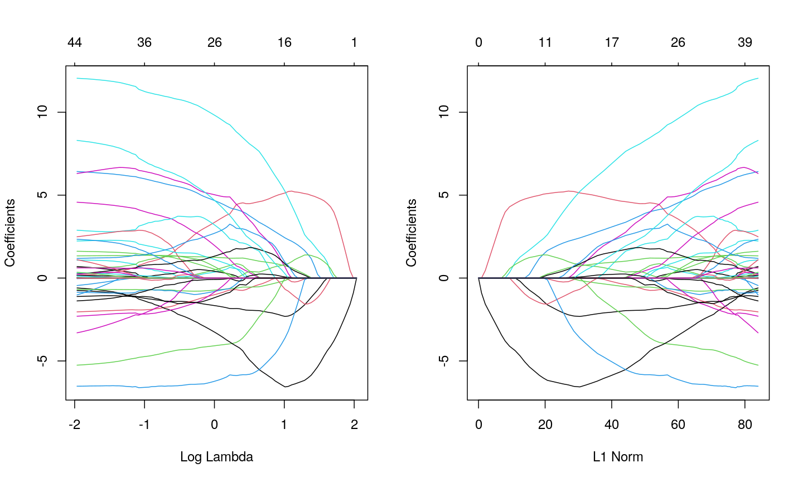
> > 3. The paths tend to go to exactly zero much more when sparsity increases when we use a LASSO model. 
> >    In the ridge case, the paths tend towards zero but less commonly reach exactly zero.
> > 
> {: .solution}
{: .challenge}

# Cross-validation

There are various methods to select the "best"
value for $\lambda$. One idea is to split
the data into $K$ chunks. We then use $K-1$ of
these as the training set, and the remaining $1$ chunk
as the test set. We can repeat this until we've rotated through all $K$ chunks,
giving us a good estimate of how well each of the lambda values work in our
data. Doing this repeated test/train split gives us a better estimate
of how generalisable our model is. Cross-validation is a really deep topic that
we're not going to cover in more detail today, though!

We can use this new idea to pick a lambda value, by finding the lambda
that minimises the error across each of the test and training splits.

~~~
lasso <- cv.glmnet(methyl_mat[, -1], age, alpha = 1)
plot(lasso)
~~~
{: .language-r}

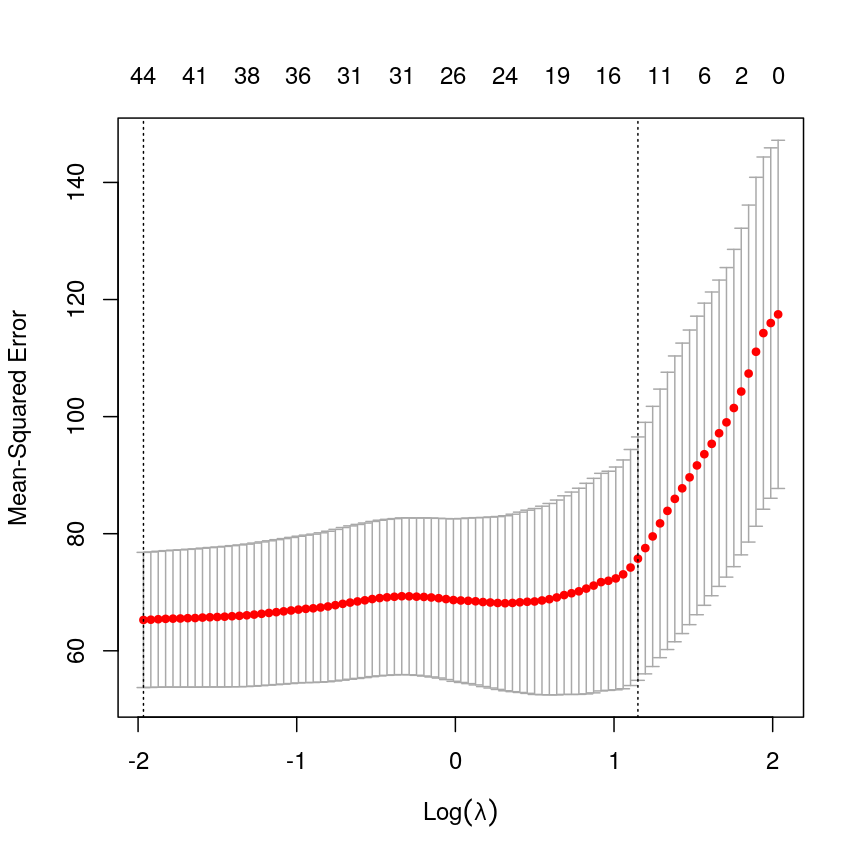

~~~
coefl <- coef(lasso, lasso$lambda.min)
selected_coefs <- as.matrix(coefl)[which(coefl != 0), 1]

## load the horvath signature to compare features
coef_horvath <- readRDS(here::here("data/coefHorvath.rds"))
## We select some of the same features! Hooray
intersect(names(selected_coefs), coef_horvath$CpGmarker)
~~~
{: .language-r}

~~~
[1] "cg02388150" "cg06493994" "cg22449114" "cg22736354" "cg03330058"
[6] "cg09809672" "cg11299964" "cg19761273" "cg26162695"
~~~
{: .output}

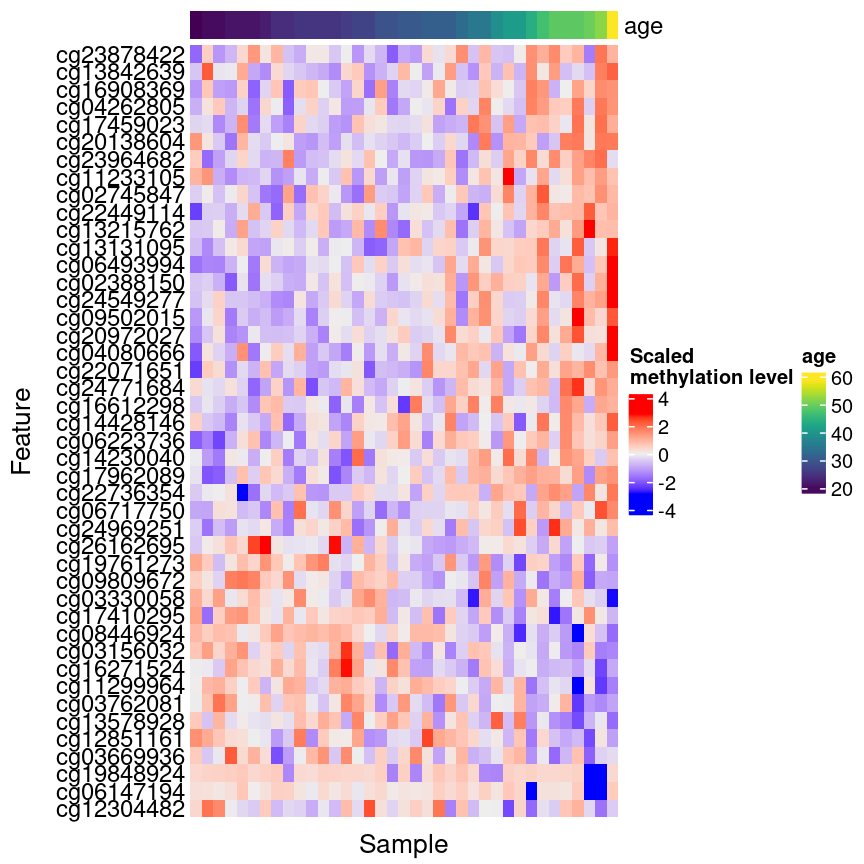

# Blending ridge regression and the LASSO - elastic nets

So far, we've used ridge regression, where `alpha = 0`, and LASSO regression,
where `alpha = 1`. What if `alpha` is set to a value between zero and one?
Well, this actually lets us blend the properties of ridge and LASSO
regression. This allows us to have the nice properties of the LASSO, where
uninformative variables are dropped automatically, and the nice properties
of ridge regression, where our coefficient estimates are a bit more
conservative, and as a result our predictions are a bit better.

Formally, the objective function of elastic net regression is to optimise the
following function:

$$
    \left(\sum_{i=1}^N y_i - X_i\beta\right)
        + \lambda \left(
            \alpha \left\lVert \beta \right\lVert_1 +
            (1-\alpha)  \left\lVert \beta \right\lVert_2
        \right)
$$

You can see that if `alpha = 1`, then the L1 norm term is multiplied by one,
and the L2 norm is multiplied by zero. This means we have pure LASSO regression.
Conversely, if `alpha = 0`, the L2 norm term is multiplied by one, and the L1
norm is multiplied by zero, meaning we have pure ridge regression. Anything
in between gives us something in between.

The contour plots we looked at previously to visualise what this penalty looks
like for different values of `alpha`.

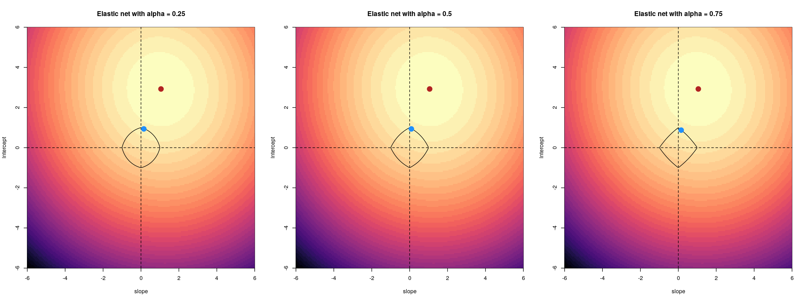

> ## Exercise
> 
> 1. Fit an elastic net model (hint: alpha = 0.5) without cross-validation and plot the model
>    object.
> 2. Fit an elastic net model with cross-validation and plot the error. Compare
>    with LASSO.
> 3. Select the lambda within one standard error of 
>    the minimum cross-validation error (hint: `lambda.1se`). Compare the
>    coefficients with the LASSO model.
> 4. Discuss: how could we pick an `alpha` in the range (0, 1)? Could we justify
>    choosing one *a priori*?
> 
> > ## Solution
> > 1. Fitting an elastic net model is just like fitting a LASSO model.
> >    You can see that coefficients tend to go exactly to zero,
> >    but the paths are a bit less
> >    extreme than with pure LASSO; similar to ridge.
> >    
> >    ~~~
> >    elastic <- glmnet(methyl_mat[, -1], age, alpha = 0.5)
> >    plot(elastic)
> >    ~~~
> >    {: .language-r}
> >    
> >    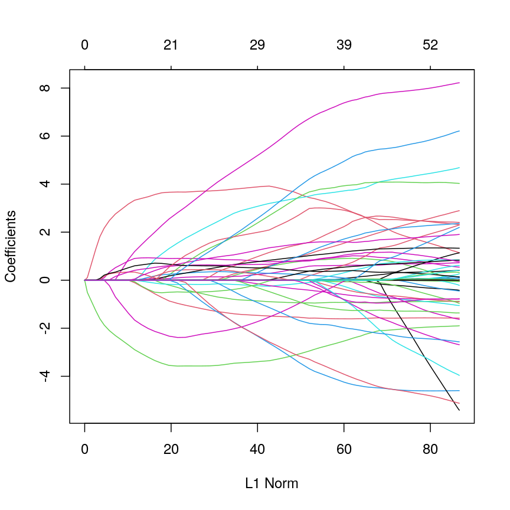
> > 2. The process of model selection is similar for elastic net models as for
> >    LASSO models.
> >    
> >    ~~~
> >    elastic_cv <- cv.glmnet(methyl_mat[, -1], age, alpha = 0.5)
> >    plot(elastic_cv)
> >    ~~~
> >    {: .language-r}
> >    
> >    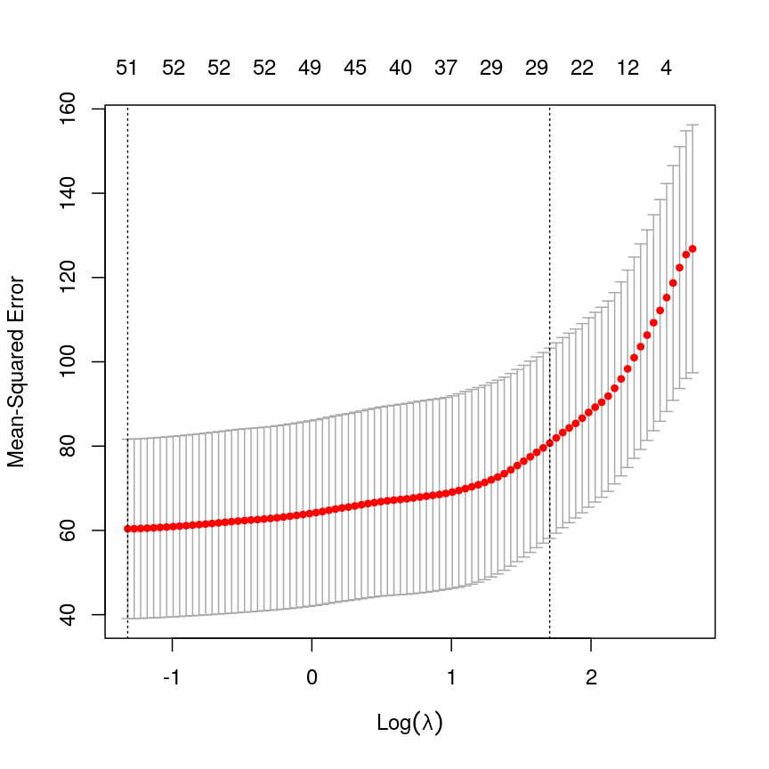
> > 3. You can see that the coefficients from these two methods are broadly
> >    similar, but the elastic net coefficients are a bit more conservative.
> >    Further, more coefficients are exactly zero in the LASSO model.
> >    
> >    ~~~
> >    coefe <- coef(elastic_cv, elastic_cv$lambda.1se)
> >    sum(coefe[, 1] == 0)
> >    ~~~
> >    {: .language-r}
> >    
> >    
> >    
> >    ~~~
> >    [1] 4973
> >    ~~~
> >    {: .output}
> >    
> >    
> >    
> >    ~~~
> >    sum(coefl[, 1] == 0)
> >    ~~~
> >    {: .language-r}
> >    
> >    
> >    
> >    ~~~
> >    [1] 4955
> >    ~~~
> >    {: .output}
> >    
> >    
> >    
> >    ~~~
> >    plot(
> >        coefl[, 1], coefe[, 1],
> >        pch = 16,
> >        xlab = "LASSO coefficients",
> >        ylab = "Elastic net coefficients"
> >    )
> >    abline(0:1, lty = "dashed")
> >    ~~~
> >    {: .language-r}
> >    
> >    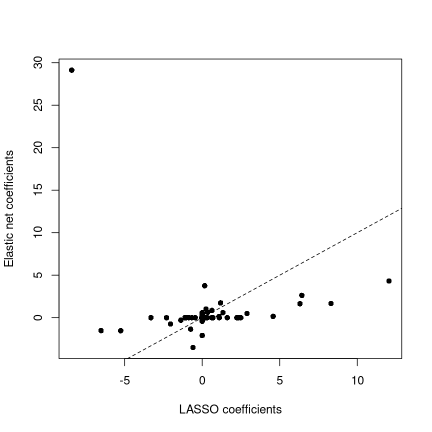
> > 4. You could pick an arbitrary value of `alpha`, because arguably pure ridge
> >    regression or pure LASSO regression are also arbitrary model choices.
> >    To be rigorous and to get the best-performing model and the best 
> >    inference about predictors, it's usually best to find the best
> >    combination of `alpha` and `lambda` using a grid search approach
> >    in cross-validation. However, this can be very computationally demanding.
> {: .solution}
{: .challenge}

> ## The bias-variance tradeoff
> 
> When we make predictions in statistics, there are two sources of error
> that primarily influence the (in)accuracy of our predictions. these are *bias*
> and *variance*. 
> 
> The total expected error in our predictions is given by the following
> equation:
> 
> $$
>   E(y - \hat{y}) = \text{Bias}^2 + \text{Variance} + \sigma^2
> $$
> 
> Here, $\sigma^2$ represents the irreducible error, that we can never overcome.
> Bias results from erroneous assumptions in the model used for predictions.
> Fundamentally, bias means that our model is mis-specified in some way,
> and fails to capture some components of the data-generating process 
> (which is true of all models). If we have failed to account for a confounding
> factor that leads to very inaccurate predictions in a subgroup of our
> population, then our model has high bias.
> 
> Variance results from sensitivity to particular properties of the input data.
> For example, if a tiny change to the input data would result in a huge change
> to our predictions, then our model has high variance.
> 
> Linear regression is an unbiased model under certain conditions.
> In fact, the [Gauss-Markov theorem](https://en.wikipedia.org/wiki/Gauss%E2%80%93Markov_theorem)
> shows that under the right conditions, OLS is the best possible type of
> unbiased linear model.
> 
> Introducing penalties to means that our model is no longer unbiased, meaning
> that the coefficients estimated from our data will systematically deviate
> from the ground truth. Why would we do this? As we saw, the total error is
> a function of bias and variance. By accepting a small amount of bias, it's
> possible to achieve huge reductions in the total expected error.
> 
> This bias-variance tradeoff is also why people often favour elastic net
> regression over pure LASSO regression.
> 
> 
{: .callout}

> ## Other types of outcomes
> 
> You may have noticed that `glmnet` is written as `glm`, not `lm`.
> This means we can actually model a variety of different outcomes
> using this regularisation approach. For example, we can model binary
> variables using logistic regression, as shown below. The type of outcome
> can be specified using the `family` argument, which specifies the family
> of the outcome variable.
> 
> In fact, `glmnet` is somewhat cheeky as it also allows you to model
> survival using Cox proportional hazards models, which aren't GLMs, strictly
> speaking.
> 
> For example, in the current dataset we can model smoking status as a binary
> variable in logistic regression by setting `family = "binomial"`.
>
> The [package documentation](https://glmnet.stanford.edu/articles/glmnet.html)
> explains this in more detail.
> 
> 
> ~~~
> smoking <- as.numeric(factor(methylation$smoker)) - 1
> # binary outcome
> table(smoking)
> ~~~
> {: .language-r}
> 
> 
> 
> ~~~
> smoking
>  0  1 
> 30  7 
> ~~~
> {: .output}
> 
> 
> 
> ~~~
> fit <- cv.glmnet(x = methyl_mat, nfolds = 5, y = smoking, family = "binomial")
> ~~~
> {: .language-r}
> 
> 
> 
> ~~~
> Warning in lognet(xd, is.sparse, ix, jx, y, weights, offset, alpha, nobs, : one
> multinomial or binomial class has fewer than 8 observations; dangerous ground
> Warning in lognet(xd, is.sparse, ix, jx, y, weights, offset, alpha, nobs, : one
> multinomial or binomial class has fewer than 8 observations; dangerous ground
> Warning in lognet(xd, is.sparse, ix, jx, y, weights, offset, alpha, nobs, : one
> multinomial or binomial class has fewer than 8 observations; dangerous ground
> Warning in lognet(xd, is.sparse, ix, jx, y, weights, offset, alpha, nobs, : one
> multinomial or binomial class has fewer than 8 observations; dangerous ground
> Warning in lognet(xd, is.sparse, ix, jx, y, weights, offset, alpha, nobs, : one
> multinomial or binomial class has fewer than 8 observations; dangerous ground
> Warning in lognet(xd, is.sparse, ix, jx, y, weights, offset, alpha, nobs, : one
> multinomial or binomial class has fewer than 8 observations; dangerous ground
> ~~~
> {: .warning}
> 
> 
> 
> ~~~
> coef <- coef(fit, s = fit$lambda.min)
> coef <- as.matrix(coef)
> coef[which(coef != 0), 1]
> ~~~
> {: .language-r}
> 
> 
> 
> ~~~
> [1] -1.455287
> ~~~
> {: .output}
> 
> 
> 
> ~~~
> plot(fit)
> ~~~
> {: .language-r}
> 
> 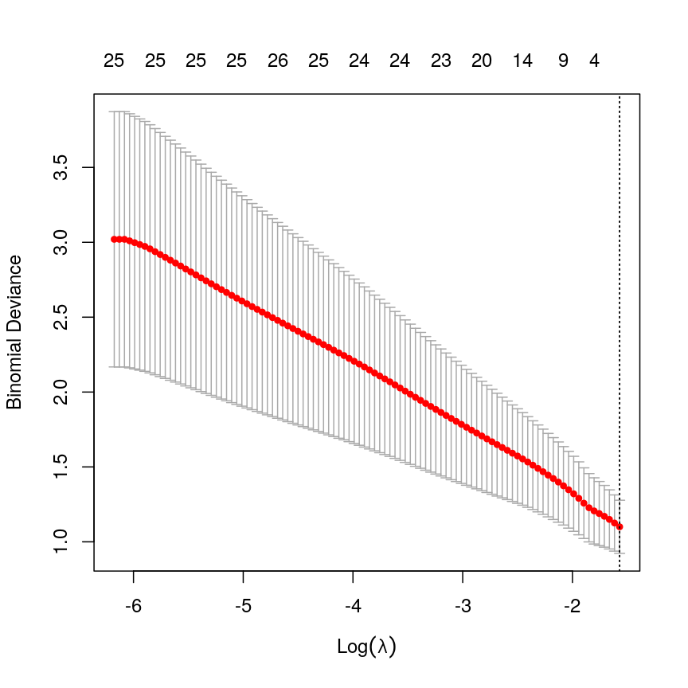
> In this case, the results aren't very interesting! We select an intercept-only
> model.
{: .callout}

> ## tidymodels
> 
> A lot of the packages for fitting predictive models like regularised
> regression have different user interfaces. To do predictive modelling, it's
> important to consider things like choosing a good performance metric,
> how to run normalisation, and . It's also useful to compare different
> model "engines". 
> 
> To this end, the tidymodels framework exists. The code below would be
> useful to perform repeated cross-validation. We're not doing a course on 
> advanced topics in predictive modelling so we are not covering this framework.
> 
> 
> ~~~
> library("tidymodels")
> all_data <- as.data.frame(cbind(age = age, methyl_mat))
> split_data <- initial_split(all_data)
> 
> norm_recipe <- recipe(training(split_data)) %>%
>     ## everything other than age is a predictor
>     update_role(everything(), new_role = "predictor") %>%
>     update_role(age, new_role = "outcome") %>%
>     ## center and scale all the predictors
>     step_center(all_predictors()) %>%
>     step_scale(all_predictors()) %>%
>     prep(training = training(split_data), retain = TRUE)
> 
> ## set the "engine" to be a linear model with tunable alpha and lambda
> glmnet_model <- linear_reg(penalty = tune(), mixture = tune()) %>% 
>     set_engine("glmnet")
> 
> ## define a workflow, with normalisation recipe into glmnet engine
> workflow <- workflow() %>%
>     add_recipe(norm_recipe) %>%
>     add_model(glmnet_model)
> 
> ## 5-fold cross-validation repeated 5 times
> folds <- vfold_cv(training(split_data), v = 5, repetitions = 5)
> 
> ## define a grid of lambda and alpha parameters to search
> glmn_set <- parameters(
>     penalty(range = c(-5, 1), trans = log10_trans()),
>     mixture()
> )
> glmn_grid <- grid_regular(glmn_set)
> ctrl <- control_grid(save_pred = TRUE, verbose = TRUE)
> 
> ## use the metric "rmse" (root mean squared error) to grid search for the
> ## best model
> results <- workflow %>%
>     tune_grid(
>         resamples = folds,
>         metrics = metric_set(rmse),
>         control = ctrl
>     )
> ## select the best model based on RMSE
> best_mod <- results %>% select_best("rmse")
> best_mod
> ## finalise the workflow and fit it with all of the training data
> final_workflow <- finalize_workflow(workflow, best_mod)
> final_workflow
> final_model <- final_workflow %>%
>     fit(data = training(split_data))
> 
> ## plot predicted age against true age for test data
> plot(
>     testing(split_data)$age,
>     predict(final_model, new_data = testing(split_data))$.pred,
>     xlab = "True age",
>     ylab = "Predicted age",
>     pch = 16,
>     log = "xy"
> )
> abline(0:1, lty = "dashed")
> ~~~
> {: .language-r}
{: .callout}

# Further reading

- [An introduction to statistical learning](https://www.statlearning.com/).
- [Elements of statistical learning](https://web.stanford.edu/~hastie/ElemStatLearn/).
- [glmnet vignette](https://glmnet.stanford.edu/articles/glmnet.html).
- [tidymodels](https://www.tidymodels.org/).

# Footnotes

[^1]: Model selection including $R^2$, AIC and BIC are covered in the additional feature selection for regression episode of this course.
[^2]: [Epigenetic Predictor of Age, Bocklandt et al. (2011)](https://journals.plos.org/plosone/article?id=10.1371/journal.pone.0014821)


