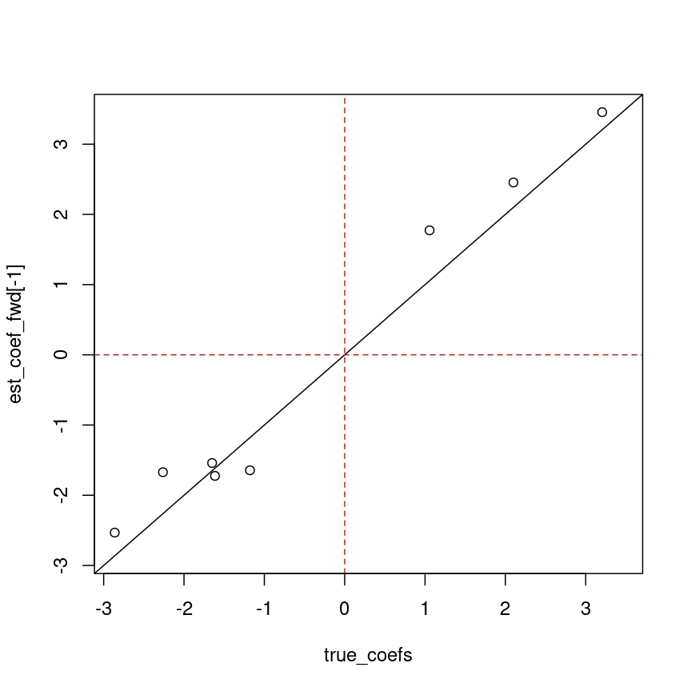

---
# Please do not edit this file directly; it is auto generated.
# Instead, please edit 03-regression-variable-selection.md in _episodes_rmd/
title: "Feature selection for regression"
teaching: 45
exercises: 15
questions:
- "Why would we want to find a subset of features
  that are associated with an outcome?"
- "How should we *not* select features?"
- "How can we iteratively find a good subset of our features
  variables to use for regression?"
- "What are some risks and downsides of iterative feature
  selection?"
objectives:
- "Understand multiple regression in a biomedical context."
- "Understand how to fit a stepwise regression model."
keypoints:
- "Sets of features can be more predictive and provide
  a better explanation than a single feature alone."
- "Stepwise regression allows us to find a set of features that
  are associated with an outcome (eg, age)."
- "Stepwise regression is not very efficient."
# - "Stepwise regression will tend to retain only one
#   feature out of many that are correlated."
math: yes
---

# Intro

First, let's read in the data from the last lesson.

~~~
library("here")
library("minfi")
if (!file.exists(here("data/methylation.rds"))) {
    source(here("data/methylation.R"))
}
methylation <- readRDS(here("data/methylation.rds"))

methyl_mat <- t(assay(methylation))
age <- methylation$Age
~~~
{: .language-r}

# Why would we want to do feature selection?

In the previous lesson we did a kind of feature selection by doing
univariate analysis and thresholding by p-value/effect size.

However we might think there's some combination of methylation features
that combined explain age. For example, if we want to be able to predict age 
from methylation, that's a lot easier if we figure out what the contribution
of each feature is conditional on all others, rather than independent of
all others.

$$
    y_j = \beta_0 + \beta_1 X_1 + \dots \beta_p X_p + \epsilon_j
$$

However when the number of predictors is greater than the number of samples
(basically always true in genetics) it isn't possible to include everything!

What happens if we try to fit a model here?

~~~
fit <- lm(age ~ methyl_mat)
summary(fit)
~~~
{: .language-r}

~~~

Call:
lm(formula = age ~ methyl_mat)

Residuals:
ALL 37 residuals are 0: no residual degrees of freedom!

Coefficients: (4964 not defined because of singularities)
                            Estimate Std. Error t value Pr(>|t|)
(Intercept)                 131.4644        NaN     NaN      NaN
methyl_matcg01884767         87.8823        NaN     NaN      NaN
methyl_matcg03955296         -4.9777        NaN     NaN      NaN
methyl_matcg06945697       -155.8711        NaN     NaN      NaN
methyl_matcg01375417         61.9513        NaN     NaN      NaN
 [ reached getOption("max.print") -- omitted 4996 rows ]

Residual standard error: NaN on 0 degrees of freedom
Multiple R-squared:      1,	Adjusted R-squared:    NaN 
F-statistic:   NaN on 36 and 0 DF,  p-value: NA
~~~
{: .output}

So we can't do that mathematically, we have to find another way.

# Screening

What people sometimes do is to select variables based on correlation with
the outcome, or using a univariate modelling approach like we used in the 
previous lesson.
There's some problems with this! First, the p-values we get out of the final
model are meaningless because we're basically doing a 2-stage model and only
reporting one set of p-values (ignoring all the non-significant ones).
Secondly, we're likely to select a bunch of features that all have the same 
information!

~~~
nvar <- 1000
nobs <- 100
y_synth <- rnorm(nobs)
synth_mat <- matrix(rnorm(nobs * nvar), nrow = nobs, ncol = nvar)
cors <- apply(synth_mat, 2, function(col) cor(col, y_synth))
X_pred <- synth_mat[, abs(cors) > quantile(abs(cors), 0.99)]
summary(lm(y_synth ~ ., data = as.data.frame(X_pred)))
~~~
{: .language-r}

~~~

Call:
lm(formula = y_synth ~ ., data = as.data.frame(X_pred))

Residuals:
    Min      1Q  Median      3Q     Max 
-1.8168 -0.4991  0.0431  0.5345  1.9119 

Coefficients:
            Estimate Std. Error t value Pr(>|t|)   
(Intercept)  0.06825    0.08608   0.793  0.42996   
V1          -0.31693    0.10260  -3.089  0.00268 **
V2           0.19308    0.09468   2.039  0.04439 * 
V3          -0.21355    0.08752  -2.440  0.01667 * 
V4          -0.16622    0.09134  -1.820  0.07216 . 
V5           0.12758    0.08650   1.475  0.14378   
V6           0.09465    0.09209   1.028  0.30684   
V7          -0.25008    0.08387  -2.982  0.00370 **
V8          -0.19176    0.09868  -1.943  0.05515 . 
V9          -0.24142    0.08543  -2.826  0.00582 **
V10         -0.16546    0.08681  -1.906  0.05988 . 
---
Signif. codes:  0 '***' 0.001 '**' 0.01 '*' 0.05 '.' 0.1 ' ' 1

Residual standard error: 0.7994 on 89 degrees of freedom
Multiple R-squared:  0.4677,	Adjusted R-squared:  0.4079 
F-statistic:  7.82 on 10 and 89 DF,  p-value: 7.016e-09
~~~
{: .output}

Amazing, the results are highly significant! However this isn't rigorous and
can lead to problems so don't do it!

# Best subset selection

However, we could imagine trying each combination of features to find which
is the best combination. This works, but is really computationally demanding,
because blah blah number of permutations probably $p!$ but need to check.

~~~
library("leaps")
small_methyl <- methyl_mat[, 1:10]
fit_all <- regsubsets(x = small_methyl, y = age, really.big = TRUE)
summ <- summary(fit_all)
coef(fit_all, which.min(summ$rss))
~~~
{: .language-r}

~~~
(Intercept)  cg01884767  cg01375417  cg17051304  cg14037832  cg21318318 
   2.348818   -7.170163    2.678007  -22.424639   14.785674   11.882970 
 cg06750118  cg23520688  cg15177551 
   1.858702    5.624383   -7.009826 
~~~
{: .output}

Let's try running BS on the full dataset.

~~~
fit_all <- regsubsets(x = methyl_mat, y = age, really.big = TRUE)
summ <- summary(fit_all)
coef(fit_all, which.min(summ$rss))
~~~
{: .language-r}

This doesn't really work in a reasonable time because of the number of possible
combinations!

Figure taken from [Hastie et al. (2020)](https://www.stat.cmu.edu/~ryantibs/papers/bestsubset.pdf),
published [here](https://doi.org/10.1214/19-STS733).

# Model metrics

In the example above we used RSS (residual sum of squares) to choose a model.
However when comparing models with different numbers of features, this is
problematic. We could, for example, keep adding features that marginally 
reduce the RSS (because adding a feature will never make it worse!) and
under this framework we'll always select the biggest model.

For example, if we have as many features as observations, the fit is always
perfect.

~~~
nvar <- 100
nobs <- 100
y_synth <- rnorm(nobs)
X_synth <- matrix(rnorm(nobs * nvar), nrow = nobs, ncol = nvar)
fit <- lm(y_synth ~ 0 + ., data = as.data.frame(X_synth))
sum(residuals(fit)^2)
~~~
{: .language-r}

~~~
[1] 0
~~~
{: .output}

There are other ways to measure model performance while accounting for the
complexity of the model. For example, adjusted $R^2$ is similar to the normal
R^2 measure that estimates the variation explained by the model, while also
accounting for the number of features. This is explained
in more detail in [the multiple regression lesson](https://carpentries-incubator.github.io/multiple-linear-regression-public-health/)

BIC and AIC also exist. There's also an issue of how well these things
will generalise beyond the present dataset.

> ## Exercise
>
> Select the best model based on BIC. How does this differ to the best RSS 
> model?
> 
> > ## Solution
> > 
> > 
> > 
> > ~~~
> > coef(fit_all, id = which.min(summ$bic))
> > ~~~
> > {: .language-r}
> > 
> > 
> > 
> > ~~~
> > (Intercept)  cg17051304  cg14037832 
> >    5.608864  -20.473848   19.927762 
> > ~~~
> > {: .output}
> > 
> > 
> > 
> > ~~~
> > coef(fit_all, id = which.min(summ$rss))
> > ~~~
> > {: .language-r}
> > 
> > 
> > 
> > ~~~
> > (Intercept)  cg01884767  cg01375417  cg17051304  cg14037832  cg21318318 
> >    2.348818   -7.170163    2.678007  -22.424639   14.785674   11.882970 
> >  cg06750118  cg23520688  cg15177551 
> >    1.858702    5.624383   -7.009826 
> > ~~~
> > {: .output}
> {: .solution}
{: .challenge}

# Forward stepwise selection

Since BS is computationally hard, we can instead do an approximation.
One of these is forward stepwise selection.

Basically:

1. pick the most significant feature
2. fit a model with that feature and every other
3. if any are a significant improvement, pick the model that has the best improvement
   and return to 2.
4. otherwise stop

Here we apply it to a synthetic methylation dataset where we know the true
predictors.

~~~
## challenge 4: forward selection
## compare with true betas
if (!file.exists(here("data/synthetic.rds"))) {
  source(here("data/synthetic.R"))
}
synthetic <- readRDS(here("data/synthetic.rds"))

synth_mat <- t(assay(synthetic))
synth_age <- synthetic$age

fit_forward <- regsubsets(x = synth_mat, y = synth_age, method = "forward")
~~~
{: .language-r}

~~~
Warning in leaps.setup(x, y, wt = weights, nbest = nbest, nvmax = nvmax, : 1
linear dependencies found
~~~
{: .warning}

~~~
Reordering variables and trying again:
~~~
{: .output}

~~~
summ_forward <- summary(fit_forward)
est_coef_fwd <- coef(fit_forward, id = which.min(summ_forward$bic))
true_coefs <- rowData(synthetic)[names(est_coef_fwd)[-1], "true_beta"]
true_coefs
~~~
{: .language-r}

~~~
[1] 0.0000000 0.0000000 0.0000000 0.0000000 0.0000000 0.6142645 0.0000000
[8] 0.0000000 0.0000000
~~~
{: .output}

~~~
est_coef_fwd
~~~
{: .language-r}

~~~
(Intercept)   feature_7  feature_22  feature_28  feature_30  feature_36 
38.08667755  0.03426189 -0.47685131 -0.08787090  0.66387439 -0.65928005 
 feature_65  feature_77  feature_79  feature_87 
 0.45080649  0.87361796  0.32491977  0.06165128 
~~~
{: .output}

~~~
all_coefs <- c(true_coefs, est_coef_fwd[-1])
plot(true_coefs, est_coef_fwd[-1], xlim = range(all_coefs), ylim = range(all_coefs))
abline(0, 1)
abline(v = 0, lty = "dashed", col = "firebrick")
abline(h = 0, lty = "dashed", col = "firebrick")
~~~
{: .language-r}

> ## Exercise
> Perform forward subset selection on the methylation data.
> 
> Check the BICs. Select the best model based on BIC.
>
> > ## Solution
> > 
> > 
> > ~~~
> > ## challenge 4: forward selection
> > fit_forward <- regsubsets(x = methyl_mat, y = age, method = "forward")
> > ~~~
> > {: .language-r}
> > 
> > 
> > 
> > ~~~
> > Warning in leaps.setup(x, y, wt = weights, nbest = nbest, nvmax = nvmax, : 4964
> > linear dependencies found
> > ~~~
> > {: .warning}
> > 
> > 
> > 
> > ~~~
> > summ_forward <- summary(fit_forward)
> > est_coef_fwd <- coef(fit_forward, id = which.min(summ_forward$bic))
> > est_coef_fwd
> > ~~~
> > {: .language-r}
> > 
> > 
> > 
> > ~~~
> > (Intercept)  cg14195318  cg01021271  cg12209024  cg27358375  cg17355919 
> >  -16.313222  -16.175834   -4.691812   21.976663  -16.468929   12.229371 
> >  cg01774454  cg06363207  cg01351425 
> >   -9.655544  -13.680655  -15.611642 
> > ~~~
> > {: .output}
> > 
> {: .solution}
{: .challenge}

# Reverse stepwise selection

If we have a model that we think is real and we want to slim it down, we
can do reverse subset selection.

`methylclock::coefHorvath` is the Horvath methylation age predictor
[Horvath (2013)](https://pubmed.ncbi.nlm.nih.gov/24138928/).

> ## Exercise
> 
> Do reverse subset selection and compare with the forward and reverse model.
> 
> > ## Solution
> >
> > 
> > ~~~
> > features <- methylclock::coefHorvath$CpGmarker
> > features <- intersect(features, colnames(methyl_mat))
> > methyl_horvath <- methyl_mat[, features[1:30]]
> > ~~~
> > {: .language-r}
> > 
> > 
> > 
> > ~~~
> > Error in methyl_mat[, features[1:30]]: subscript out of bounds
> > ~~~
> > {: .error}
> > 
> > 
> > 
> > ~~~
> > ## note about backward/both, not a challenge
> > fit_back <- regsubsets(x = methyl_horvath, y = age, method = "backward")
> > ~~~
> > {: .language-r}
> > 
> > 
> > 
> > ~~~
> > Error in regsubsets(x = methyl_horvath, y = age, method = "backward"): object 'methyl_horvath' not found
> > ~~~
> > {: .error}
> > 
> > 
> > 
> > ~~~
> > summ_back <- summary(fit_back)
> > ~~~
> > {: .language-r}
> > 
> > 
> > 
> > ~~~
> > Error in h(simpleError(msg, call)): error in evaluating the argument 'object' in selecting a method for function 'summary': object 'fit_back' not found
> > ~~~
> > {: .error}
> > 
> > 
> > 
> > ~~~
> > summ_back$bic
> > ~~~
> > {: .language-r}
> > 
> > 
> > 
> > ~~~
> > Error in eval(expr, envir, enclos): object 'summ_back' not found
> > ~~~
> > {: .error}
> > 
> > 
> > 
> > ~~~
> > est_coef_back <- coef(fit_back, id = which.min(summ_back$bic))
> > ~~~
> > {: .language-r}
> > 
> > 
> > 
> > ~~~
> > Error in h(simpleError(msg, call)): error in evaluating the argument 'object' in selecting a method for function 'coef': object 'fit_back' not found
> > ~~~
> > {: .error}
> > 
> > 
> > 
> > ~~~
> > true_coef <- setNames(
> >   methylclock::coefHorvath$CoefficientTraining,
> >   methylclock::coefHorvath$CpGmarker
> > )
> > plot(est_coef_back[-1], true_coef[names(est_coef_back)[-1]])
> > ~~~
> > {: .language-r}
> > 
> > 
> > 
> > ~~~
> > Error in h(simpleError(msg, call)): error in evaluating the argument 'x' in selecting a method for function 'plot': object 'est_coef_back' not found
> > ~~~
> > {: .error}
> > 
> > 
> > 
> > ~~~
> > abline(0, 1)
> > ~~~
> > {: .language-r}
> > 
> > 
> > 
> > ~~~
> > Error in int_abline(a = a, b = b, h = h, v = v, untf = untf, ...): plot.new has not been called yet
> > ~~~
> > {: .error}
> > 
> > 
> > 
> > ~~~
> > abline(v = 0, lty = "dashed", col = "firebrick")
> > ~~~
> > {: .language-r}
> > 
> > 
> > 
> > ~~~
> > Error in int_abline(a = a, b = b, h = h, v = v, untf = untf, ...): plot.new has not been called yet
> > ~~~
> > {: .error}
> > 
> > 
> > 
> > ~~~
> > abline(h = 0, lty = "dashed", col = "firebrick")
> > ~~~
> > {: .language-r}
> > 
> > 
> > 
> > ~~~
> > Error in int_abline(a = a, b = b, h = h, v = v, untf = untf, ...): plot.new has not been called yet
> > ~~~
> > {: .error}
> > 
> > 
> > 
> > ~~~
> > names(est_coef_back[-1])
> > ~~~
> > {: .language-r}
> > 
> > 
> > 
> > ~~~
> > Error in eval(expr, envir, enclos): object 'est_coef_back' not found
> > ~~~
> > {: .error}
> > 
> > 
> > 
> > ~~~
> > names(est_coef_fwd[-1])
> > ~~~
> > {: .language-r}
> > 
> > 
> > 
> > ~~~
> > [1] "cg14195318" "cg01021271" "cg12209024" "cg27358375" "cg17355919"
> > [6] "cg01774454" "cg06363207" "cg01351425"
> > ~~~
> > {: .output}
> > 
> > 
> > 
> > ~~~
> > intersect(names(est_coef_back[-1]), names(est_coef_fwd[-1]))
> > ~~~
> > {: .language-r}
> > 
> > 
> > 
> > ~~~
> > Error in h(simpleError(msg, call)): error in evaluating the argument 'x' in selecting a method for function 'intersect': object 'est_coef_back' not found
> > ~~~
> > {: .error}
> {: .solution}
{: .challenge}


