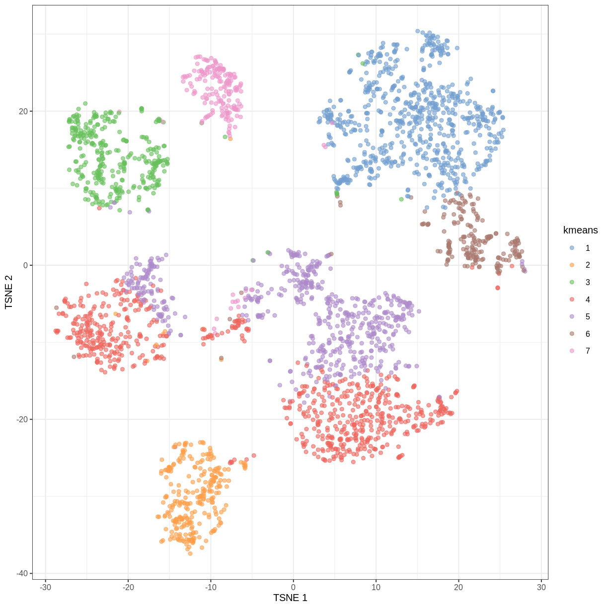
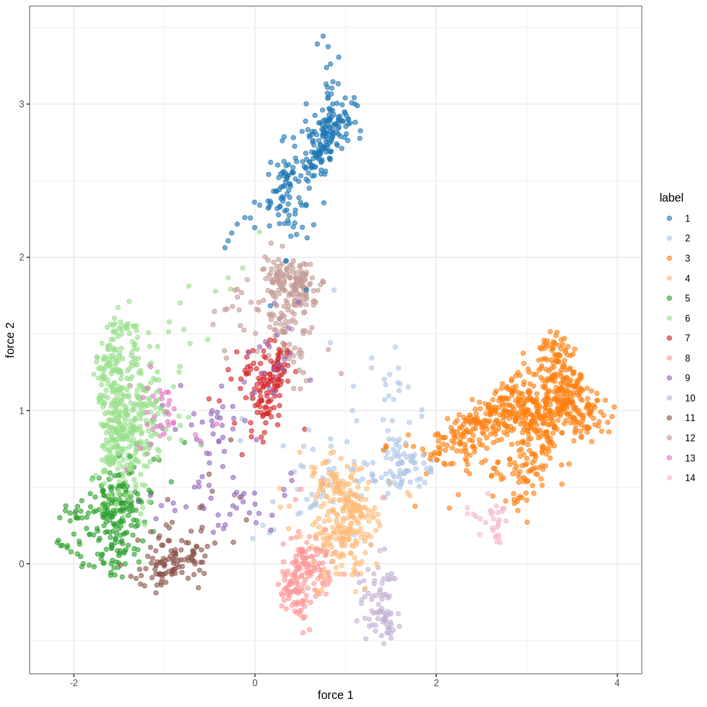

---
# Please do not edit this file directly; it is auto generated.
# Instead, please edit 04-clustering.md in _episodes_rmd/
title: "Clustering"
teaching: 0
exercises: 0
questions:
- "Q1"
objectives:
- "O1"
keypoints:
- "KP1"
math: yes
---

R code in RMarkdown (with output):

~~~
rnorm(5)
~~~
{: .language-r}

~~~
[1]  1.7179361  0.9321669 -1.1776757 -1.0470257 -1.2338888
~~~
{: .output}

$\LaTeX$ inline, and in blocks:

$$
    \exp(i\pi) = -1
$$

~~~
## preamble
suppressPackageStartupMessages({
    library("scRNAseq")
    library("mixtools")
    library("irlba")
    library("scater")
    library("scuttle")
    library("scran")
    library("Rtsne")
    library("mclust")
    library("igraph")
    library("bluster")
})

zd <- ZeiselBrainData()
~~~
{: .language-r}

~~~
using temporary cache /tmp/RtmpFOqwe4/BiocFileCache
~~~
{: .output}

~~~
snapshotDate(): 2020-10-27
~~~
{: .output}

~~~
see ?scRNAseq and browseVignettes('scRNAseq') for documentation
~~~
{: .output}

~~~
downloading 1 resources
~~~
{: .output}

~~~
retrieving 1 resource
~~~
{: .output}

~~~
loading from cache
~~~
{: .output}

~~~
see ?scRNAseq and browseVignettes('scRNAseq') for documentation
~~~
{: .output}

~~~
downloading 1 resources
~~~
{: .output}

~~~
retrieving 1 resource
~~~
{: .output}

~~~
loading from cache
~~~
{: .output}

~~~
see ?scRNAseq and browseVignettes('scRNAseq') for documentation
~~~
{: .output}

~~~
downloading 1 resources
~~~
{: .output}

~~~
retrieving 1 resource
~~~
{: .output}

~~~
loading from cache
~~~
{: .output}

~~~
snapshotDate(): 2020-10-27
~~~
{: .output}

~~~
see ?scRNAseq and browseVignettes('scRNAseq') for documentation
~~~
{: .output}

~~~
downloading 1 resources
~~~
{: .output}

~~~
retrieving 1 resource
~~~
{: .output}

~~~
loading from cache
~~~
{: .output}

~~~
zd <- computeSumFactors(zd, cluster=quickCluster(zd))
zd <- logNormCounts(zd)

zd <- runPCA(zd, ncomponents = 15)
zd <- runTSNE(zd)

## k-means

## ideas: vary centers, low iter.max, low nstart
cluster <- kmeans(reducedDim(zd), centers = 7, iter.max = 1000, nstart = 100)
zd$kmeans <- as.character(cluster$cluster)

plotReducedDim(zd, "TSNE", colour_by = "kmeans")
~~~
{: .language-r}

~~~
## model-based
clust <- mclustBIC(reducedDim(zd), modelNames = "VVV")
opt_clust <- which.max(clust)
zd$mixture <- as.character(opt_clust)

plotReducedDim(zd, "TSNE", colour_by = "mixture")
~~~
{: .language-r}

~~~
## graph-based
g <- buildSNNGraph(zd, k=10, use.dimred = 'PCA')
clust <- igraph::cluster_walktrap(g)$membership
reducedDim(zd, "force") <- igraph::layout_with_fr(g)
colLabels(zd) <- factor(clust)
plotReducedDim(zd, colour_by="label", dimred="force")
~~~
{: .language-r}

~~~
# bluster::clusterRows - maybe?

## measures: silhouette, bootstrap
## approx silhouette? purity?
~~~
{: .language-r}



