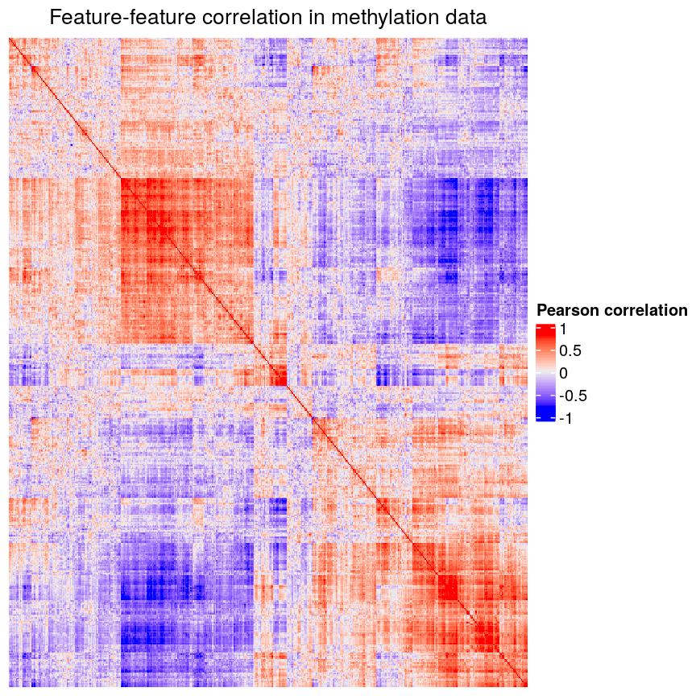
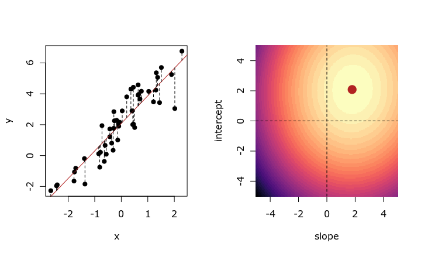
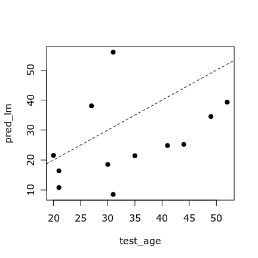
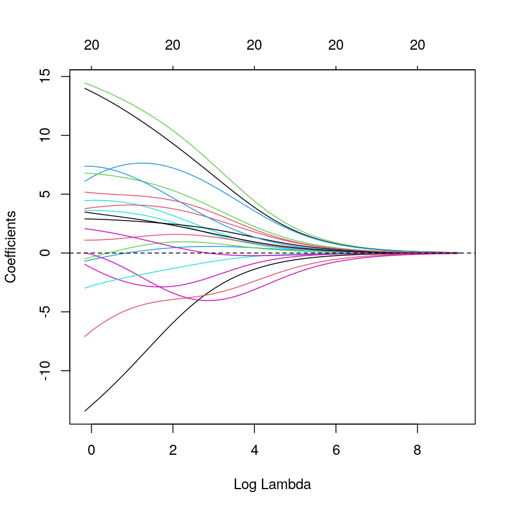
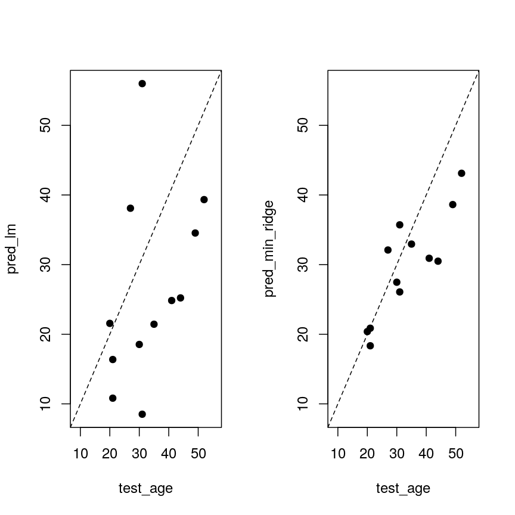
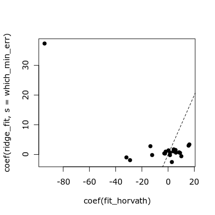
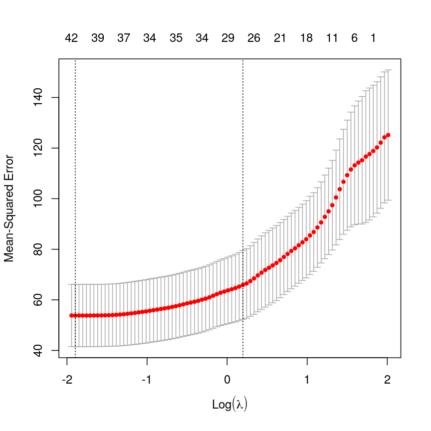

---
# Please do not edit this file directly; it is auto generated.
# Instead, please edit 04-regression-regularisation.md in _episodes_rmd/
title: "Regularised regression with many features"
teaching: 0
exercises: 0
questions:
- "What is regularisation?"
- "How does regularisation work?"
- "What are some considerations for a regularised model?"
objectives:
- "Understand the benefits of regularised models."
- "Understand how different types of regularisation work."
- "Apply and critically analyse penalised regression models."
keypoints:
- "Regularisation is a way to avoid the problems of stepwise
  or iterative model building processes."
- "Test and training splits, or cross-validation, are a useful way to select
  models or hyperparameters."
- "Regularisation can give us a better set of variables, and by restricting
  the magnitude of coefficients, can give us a better (and more stable)
  estimate."
math: yes
---

# Introduction

In the previous episode we covered variable selection using stepwise/best subset
selection.
These have issues with respect to computation time and efficiency.
In low noise settings and with few or strong relationships, stepwise/subset
works well. However that's often not what we're faced with in biomedicine.
Often, we have many variables that are all very correlated, with plenty
of noise. For example, if we calculate the Pearson correlation between
each feature in the methylation data seen earlier, we can see that
many of these features essentially represent the same information.

For technical reasons, this correlation can be problematic, and if it's 
very severe it may even make it impossible to fit a model! Furthermore,
if we have many correlated features, it's likely that one of these will
be retained and all others dropped; this can make it more difficult to
infer the mechanisms behind an association.

> ## Collinearity
>
>
{: .callout}

When we fit a linear model, we're finding the line through our data that 
minimises the residual sum of squares.

$$
    \sum_{i=1}^N \hat{y}_i - X\beta
$$

We can think of that as finding
the slope and intercept that minimises the square of the length of the dashed
lines. In this case, the red line is in the left panel is the line that
accomplishes this objective, and the red dot in the right panel is the point 
that represents this line in terms of its slope and intercept among many 
different possible models, where the background colour represents how well
different combinations of slope and intercept accomplish this objective.

This line is the line of best fit through our data when considering this
goal of minimising the sum of squared error. However, it is not the only 
possible line we could use! For example, we might want to err on the side of
caution when estimating effect sizes. That is, we might want to avoid estimating
very large effect sizes.

# Model selection revisited

In the previous lesson we discussed using measures like adjusted $R^2$, AIC and
BIC to show how well the model is learning the data used in fitting the model.
However, this doesn't really tell us how well the model will perform on unseen
data. This is especially important when our goal is prediction.

One thing that happens a lot of the time in this context is that large 
coefficient values minimise the training error, but they don't minimise the 
test error on unseen data. First, we'll go through an example of what exactly 
this means.

For the next few exercises, we'll work with a signature for methyl age from
Horvath.

~~~
coef_horvath <- readRDS(here::here("data/coefHorvath.rds"))
methylation <- readRDS(here::here("data/methylation.rds"))
library("SummarizedExperiment")
age <- methylation$Age
methyl_mat <- t(assay(methylation))

coef_horvath <- coef_horvath[1:20, ]
features <- coef_horvath$CpGmarker

horvath_mat <- methyl_mat[, features]

## Generate an index to split the data
train_ind <- sample(nrow(methyl_mat), 25)
~~~
{: .language-r}

> ## Exercise
> 
> 1. Split the methylation data into training and test sets.
> 2. Fit a model on the training data.
> 
> > ## Solution
> >
> > 1. Text.
> >    
> >    
> >    ~~~
> >    train_mat <- horvath_mat[train_ind, ]
> >    train_age <- age[train_ind]
> >    test_mat <- horvath_mat[-train_ind, ]
> >    test_age <- age[-train_ind]
> >    ~~~
> >    {: .language-r}
> > 
> > 2. Some text.
> >    
> >    
> >    ~~~
> >    fit_horvath <- lm(train_age ~ ., data = as.data.frame(train_mat))
> >    ~~~
> >    {: .language-r}
> >    
> >
> {: .solution}
{: .challenge}

With this model, now we can check how well it does. Here we use residual sum of
squares on the test data.

~~~
rss <- function(true, prediction) {
    sum((true - prediction)^2)
}
pred_lm <- predict(fit_horvath, newdata = as.data.frame(test_mat))
err_lm <- rss(test_age, pred_lm)
err_lm
~~~
{: .language-r}

~~~
[1] 825.9211
~~~
{: .output}

~~~
par(mfrow = c(1, 1))
plot(test_age, pred_lm, pch = 19)
abline(coef = 0:1, lty = "dashed")
~~~
{: .language-r}

# Ridge regression

One way to tackle these many correlated variables with lots of noise is
*regularisation*.
The idea of regularisation is to add another condition to the problem we're
solving with linear regression. This condition controls the total size of the 
coefficients that come out. 
For example, we might say that the point representing the slope and intercept
must fall within a certain distance of the origin, $(0, 0)$. Note that
we are still trying to solve for the line that minimises the square of the
residuals; we are just adding this extra constraint to our solution.

There are multiple ways to define the distance that our solution must fall in,
though. The one we've plotted above controls the squared sum of the 
coefficients, $\beta$.
This is also sometimes called the $L^2$ norm. This is defined as

$$
    \left\lVert \beta\right\lVert^2 = \sqrt{\sum_{j=1}^p \beta_j^2}
$$

To control this, we specify that the solution for the equation above
also has to have an $L^2$ norm smaller than a certain amount. Or, equivalently,
we try to minimise a function that includes our $L^2$ norm scaled by a 
factor that is usually written $\lambda$.

$$
    \sum_{i=1}^N y_i - X\beta + \lambda \left\lVert \beta \right\lVert^2
$$

# Why ridge?

Can give better accuracy aside from the whole singularity issue. To show this,
we'll fit a model using the Horvath methylation predictors, using both
penalised and ordinary least squares.

~~~
lm_fit <- lm(train_age ~ ., data = as.data.frame(train_mat))

library("glmnet")
ridge_fit <- glmnet(x = train_mat, y = train_age, alpha = 0)
plot(ridge_fit, xvar = "lambda")
~~~
{: .language-r}

This plot shows how the coefficients change as we increase the penalty. That is,
as we decrease the size of the region that solutions can fall into, the values
of the coefficients that we get back tend to decrease. In this case,
coefficients trend towards zero but generally don't reach it until the penalty
gets very large.

Since we split the data into test and training data, we can prove that ridge
regression gives us a better prediction in this case:

~~~
pred_ridge <- predict(ridge_fit, newx = test_mat)
err_ridge <- apply(pred_ridge, 2, function(col) rss(test_age, col))
min(err_ridge)
~~~
{: .language-r}

~~~
[1] 284.0557
~~~
{: .output}

~~~
err_lm
~~~
{: .language-r}

~~~
[1] 825.9211
~~~
{: .output}

~~~
min_ridge <- pred_ridge[, which.min(err_ridge)]
~~~
{: .language-r}

> ## Exercise
> 
> 1. Which performs better, ridge or OLS?
> 2. How do the predictions look for both methods? Why might ridge be 
>    performing better?
> 3. Compare the coefficients of the ridge model to the OLS model. Why might
>    the differences drive the differences in prediction that you see?
> 
> > ## Solution
> > 
> > 1. Ridge.
> >    
> >    ~~~
> >    min_ridge
> >    ~~~
> >    {: .language-r}
> >    
> >    
> >    
> >    ~~~
> >    201868500150_R07C01 201868590193_R03C01 201868590193_R06C01 201868590206_R02C01 
> >               43.31002            17.97813            28.48804            37.86167 
> >    201868590206_R05C01 201868590206_R06C01 201868590206_R08C01 201868590243_R04C01 
> >               34.62555            27.91707            18.17361            39.76428 
> >    201868590243_R06C01 201868590243_R08C01 201869680030_R02C01 201870610056_R07C01 
> >               32.27380            32.05321            60.00983            32.34975 
> >    ~~~
> >    {: .output}
> >    
> >    
> >    
> >    ~~~
> >    err_lm
> >    ~~~
> >    {: .language-r}
> >    
> >    
> >    
> >    ~~~
> >    [1] 825.9211
> >    ~~~
> >    {: .output}
> > 2. The ridge ones are less extreme.
> >    
> >    ~~~
> >    all <- c(pred_lm, test_age, min_ridge)
> >    lims <- range(all)
> >    par(mfrow = 1:2)
> >    plot(test_age, pred_lm,
> >        xlim = lims, ylim = lims,
> >        pch = 19
> >    )
> >    abline(coef = 0:1, lty = "dashed")
> >    plot(test_age, pred_ridge[, which.min(err_ridge)],
> >        xlim = lims, ylim = lims,
> >        pch = 19
> >    )
> >    abline(coef = 0:1, lty = "dashed")
> >    ~~~
> >    {: .language-r}
> >    
> >    
> > 3. They're generally smaller.
> >    
> >    ~~~
> >    par(mfrow = c(1, 1))
> >    plot(coef(lm_fit), coef(ridge_fit, s = which.min(err_ridge)),
> >        pch = 19
> >    )
> >    abline(coef = 0:1, lty = "dashed")
> >    ~~~
> >    {: .language-r}
> >    
> >    
> {: .solution}
{: .challenge}

We can see that ridge regression tends to produce smaller coefficients.

> ## Ridge regression through a Bayesian lens
>
> Bayesian statistics is another way of modelling data, in contrast to the
> frequentist methods we're using at the moment.
> 
> Under a Bayesian lens, we consider the likelihood just as we modelled earlier.
> For linear regression, this is the density of the data under the normal
> distribution specified by our model parameters (slope and intercept, 
> for example).
> 
> In Bayesian linear regression, we also place a *prior* distribution on our 
> coefficients, $\beta$. A common distribution that we use here is a normal 
> distribution. This means that we imagine our coefficients are likely to
> be close to zero.
> This tends to *shrink* the coefficients towards zero, with the strength
> of the shrinkage controlled by the variance of the normal distribution.
> 
> The density of a normally distributed variable $x \sim N(\mu, \sigma^2)$ is
> defined
> 
> $$
>   \frac{1}{\sqrt{2\pi\sigma^2}}\exp\left(-\frac{(x-\mu)^2}{2\sigma^2}\right)
> $$
> 
> If we centre our distribution at zero, we can see that the numerator of the
> exponent is $x^2$. In fact, these are mathematically equivalent.
> 
{: .callout}

# LASSO regression

LASSO is another type of regularisation. In this case we use the $L^1$ norm,
or the sum of the absolute values of the coefficients.

$$
    \left\lVert \beta \right\lVert^1 = \sqrt{\sum_{j=1}^p \beta_j}
$$

This tends to produce sparse models; that is to say, it tends to remove features
from the model that aren't necessary to produce accurate predictions. This
is because the region we're restricting the coefficients to has sharp edges.
So, when we increase the penalty (reduce the norm), it's more likely that
the best solution that falls in this region will be at the corner of this
diagonal (ie, one or more coefficient is exactly zero).

> ## Exercise
> 
> 1. Use `glmnet` to fit a LASSO model (`alpha = 1`).
> 2. Plot the model object.
> 3. How do the coefficient paths differ to the ridge case?
> 
> > ## Solution
> > 
> > 1. .
> >    
> >    ~~~
> >    fit_lasso <- glmnet(x = methyl_mat, y = age, alpha = 1)
> >    ~~~
> >    {: .language-r}
> > 2. .
> >    
> >    ~~~
> >    par(mfrow = c(1, 1))
> >    plot(fit_lasso)
> >    ~~~
> >    {: .language-r}
> >    
> >    
> > 3. The paths tend to go to exactly zero much more!.
> > 
> {: .solution}
{: .challenge}

# Cross-validation

There are various methods to select the "best"
value for $\lambda$. One idea is to split
the data into $K$ chunks. We then use $K-1$ of
these as the training set, and the remaining $1$ chunk
as the test set. Repeating this process for each of the
$K$ chunks gives us a better estimate of how well the model would
perform in unseen data.

We can use this new idea to pick a lambda value.

~~~
lasso <- cv.glmnet(methyl_mat[, -1], age, alpha = 1)
plot(lasso)
~~~
{: .language-r}

~~~
coefl <- coef(lasso, lasso$lambda.1se)
selected_coefs <- as.matrix(coefl)[coefl[, 1] != 0, 1]
## We select some of the same features! Hooray
intersect(names(selected_coefs), coef_horvath$CpGmarker)
~~~
{: .language-r}

~~~
[1] "cg22736354"
~~~
{: .output}

> ## Bias-variance tradeoff and the elastic net
> 
> When making predictive models, we have to consider bias and variance.
> 
> Elastic net is good.
> 
> 
> ~~~
> elastic <- cv.glmnet(methyl_mat[, -1], age, alpha = 0.5, intercept = FALSE)
> ~~~
> {: .language-r}
{: .callout}

# Why is regularisation useful?

- Speed
- Flexibility (model selection, elastic net)
- May be better independent of variable selection

Figure taken from [Hastie et al. (2020)](https://doi.org/10.1214/19-STS733).

~~~
knitr::include_graphics("../fig/bs_fs_lasso.png")
~~~
{: .language-r}

> ## Other types of outcomes
> 
> You may have noticed that `glmnet` is written as `glm`, not `lm`.
> This means we can actually model a variety of different outcomes
> using this regularisation approach. For example, we can model binary
> variables using logistic regression, as shown below. The type of outcome
> can be specified using the `family` argument, which specifies the family
> of the outcome variable.
> 
> In fact, `glmnet` is somewhat cheeky as it also allows you to model
> survival using Cox proportional hazards models, which aren't GLMs, strictly
> speaking.
> 
> For example, in the current dataset we can model smoking status as a binary
> variable in logistic regression by setting `family = "binomial"`.
>
> The [package documentation](https://glmnet.stanford.edu/articles/glmnet.html)
> explains this in more detail.
> 
> 
> ~~~
> smoking <- as.numeric(factor(methylation$smoker)) - 1
> # binary outcome
> table(smoking)
> ~~~
> {: .language-r}
> 
> 
> 
> ~~~
> smoking
>  0  1 
> 30  7 
> ~~~
> {: .output}
> 
> 
> 
> ~~~
> fit <- cv.glmnet(x = methyl_mat, nfolds = 5, y = smoking, family = "binomial")
> ~~~
> {: .language-r}
> 
> 
> 
> ~~~
> Warning in lognet(xd, is.sparse, ix, jx, y, weights, offset, alpha, nobs, : one
> multinomial or binomial class has fewer than 8 observations; dangerous ground
> Warning in lognet(xd, is.sparse, ix, jx, y, weights, offset, alpha, nobs, : one
> multinomial or binomial class has fewer than 8 observations; dangerous ground
> Warning in lognet(xd, is.sparse, ix, jx, y, weights, offset, alpha, nobs, : one
> multinomial or binomial class has fewer than 8 observations; dangerous ground
> Warning in lognet(xd, is.sparse, ix, jx, y, weights, offset, alpha, nobs, : one
> multinomial or binomial class has fewer than 8 observations; dangerous ground
> Warning in lognet(xd, is.sparse, ix, jx, y, weights, offset, alpha, nobs, : one
> multinomial or binomial class has fewer than 8 observations; dangerous ground
> Warning in lognet(xd, is.sparse, ix, jx, y, weights, offset, alpha, nobs, : one
> multinomial or binomial class has fewer than 8 observations; dangerous ground
> ~~~
> {: .warning}
> 
> 
> 
> ~~~
> coef <- coef(fit, s = fit$lambda.min)
> coef <- as.matrix(coef)
> coef[coef[, 1] != 0, 1]
> ~~~
> {: .language-r}
> 
> 
> 
> ~~~
> [1] -1.455287
> ~~~
> {: .output}
> 
> 
> 
> ~~~
> plot(fit)
> ~~~
> {: .language-r}
> 
> 
> In this case, the results aren't very interesting! We select an intercept-only
> model.
{: .callout}


