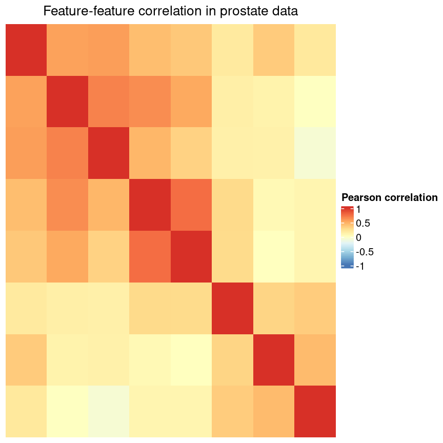
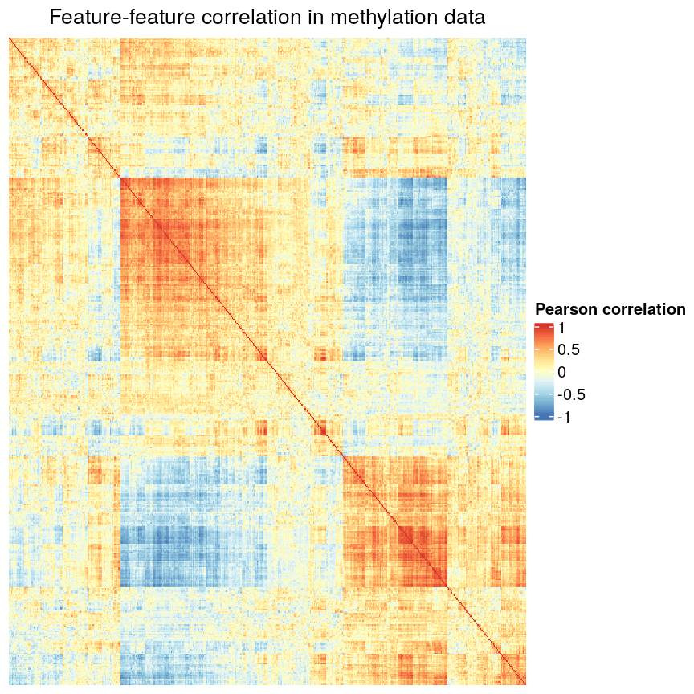

---
# Please do not edit this file directly; it is auto generated.
# Instead, please edit 04-regression-regularisation.md in _episodes_rmd/
title: "Regularised regression"
teaching: 60
exercises: 20
questions:
- "What is regularisation?"
- "How does regularisation work?"
- "How can we select the level of regularisation for a model?"
objectives:
- "Understand the benefits of regularised models."
- "Understand how different types of regularisation work."
- "Apply and critically analyse penalised regression models."
keypoints:
- Regularisation is a way to avoid the problems of stepwise
  or iterative model building.
- Test and training splits, or cross-validation, are a useful way to select
  models or hyperparameters.
- Regularisation can give us a more predictive set of variables, and by
  restricting the magnitude of coefficients, can give us a better
  (and more stable) estimate of our outcome.
- Regularisation is flexible, allowing us to fit many different kinds of models
  with the same basic 'engine'.
- Regularisation can be *very* fast! 
  Figure taken from [Hastie et al. (2020)](https://doi.org/10.1214/19-STS733).
  
math: yes
---

# Introduction

In the previous episode we covered variable selection using stepwise/best subset
selection.
These have issues with respect to computation time and efficiency.
In low noise settings and with few or strong relationships, stepwise/subset
works well. However that's often not what we're faced with in biomedicine.
Often, we have many variables that are all very correlated, with plenty
of noise. For example, if we calculate the Pearson correlation between
each feature in the prostate dataset seen earlier, 
we can see that in the prostate data, the few variables we have are generally
pretty independent. 

The stepwise selection methods we used in the previous episode work really 
well for data like these, because the features are generally pretty distinct.
If we do the same for the methylation dataset, in contrast, we can see that many
of the features essentially represent the same information.
Stepwise selection can struggle in cases like this, because which of the
correlated features we select at each stage can have a big impact on the 
downstream models.

For technical reasons, this correlation can be problematic, and if it's 
very severe it may even make it impossible to fit a model! Furthermore,
if we have many correlated features, it's likely that one of these will
be retained and all others dropped; this can make it more difficult to
infer the mechanisms behind an association.

> ## Exercise
> 
> Discuss in  groups:
> 
> 1. Why would we observed correlated features in high-dimensional biological
>    data?
> 1. Why might correlated features be a problem when fitting linear models?
> 1. What issue might correlated feature present for stepwise selection?
> 
> > ## Solution
> >
> > 1. Many of the features in biological data represent very similar 
> >    information biologically. For example, sets of genes that form complexes
> >    are often expressed in very similar quantities. Similarly, methylation
> >    levels at nearby sites are often very highly correlated.
> > 1. Correlated features can make inference unstable or even impossible
> >    mathematically.
> > 1. When performing stepwise selection, we want to pick the most predictive
> >    feature at each step. When a lot of features are very similar but encode
> >    slightly different information, which of the correlated features we 
> >    select can have a huge impact in the later stages of model selection!
> > 
> {: .solution}
{: .challenge}

# The objective of a linear model

When we fit a linear model, we're finding the line through our data that 
minimises the residual sum of squares.
We can think of that as finding
the slope and intercept that minimises the square of the length of the dashed
lines. In this case, the red line is in the left panel is the line that
accomplishes this objective, and the red dot in the right panel is the point 
that represents this line in terms of its slope and intercept among many 
different possible models, where the background colour represents how well
different combinations of slope and intercept accomplish this objective.

Mathematically, we can write that as

$$
    \sum_{i=1}^N \hat{y}_i - y_i
$$

where $\hat{y}_i$ is the predicted y value for each input data
point $X_i$, and $y_i$ is the true observed value.
This line is the line of best fit through our data when considering this
goal of minimising the sum of squared error. However, it is not the only 
possible line we could use! For example, we might want to err on the side of
caution when estimating effect sizes. That is, we might want to avoid estimating
very large effect sizes. This can help us to create *generalisable*
models.

> ## Exercise
> 
> Discuss in groups:
> 
> 1. What are we minimising when we fit a linear model?
> 2. Why are we minimising this objective? What assumptions are we making
>    about our data when we do so?
> 
> > ## Solution
> >
> > 1. When we fit a linear model we are minimising the squared error.
> >    In fact, the standard linear model estimator is often known as
> >    "ordinary least squares". The "ordinary" really means "original" here,
> >    to distinguish between this method, which dates back to ~1800, and some
> >    more "recent" (think 1940s...) methods.
> > 2. Least squares assumes that, when we account for the change in the mean of
> >    the outcome based on changes in the income, the data are normally
> >    distributed. That is, the *residuals* of the model, or the error 
> >    left over after we account for any linear relationships in the data,
> >    are normally distributed, and have a fixed variance.
> >    
> >
> {: .solution}
{: .challenge}

# Model selection revisited

In the previous lesson we discussed using measures like adjusted $R^2$, AIC and
BIC to show how well the model is learning the data used in fitting the model. These are really good ways of telling us how
well the model is learning to fit the data we're using as an 
input. However, this doesn't really tell us how well the model will generalise to new data. This is an important thing to 
consider -- if our model doesn't generalise to new data,
then there's a chance that it's just picking up on a technical or batch effect in our data, or simply some noise that happens
to fit the outcome we're modelling.
This is especially important when our goal is prediction -- 
it's not much good if we can only predict well for samples where
the outcome is already known, after all!

One thing that happens a lot of the time in this context is that large 
coefficient values minimise the training error, but they don't minimise the 
test error on unseen data. First, we'll go through an example of what exactly 
this means.

For the next few exercises, we'll work with a set of features
known to be associated with age from Horvath.

~~~
coef_horvath <- readRDS(here::here("data/coefHorvath.rds"))
methylation <- readRDS(here::here("data/methylation.rds"))
library("SummarizedExperiment")
age <- methylation$Age
methyl_mat <- t(assay(methylation))

coef_horvath <- coef_horvath[1:20, ]
features <- coef_horvath$CpGmarker
horvath_mat <- methyl_mat[, features]

## Generate an index to split the data
set.seed(42)
train_ind <- sample(nrow(methyl_mat), 25)
~~~
{: .language-r}

> ## Exercise
> 
> 1. Split the methylation data matrix and the age vector
>    into training and test sets.
> 2. Fit a model on the training data matrix and training age 
>    vector.
> 3. Check the mean squared error on this model.
> 
> > ## Solution
> >
> > 1. Splitting the data involves using our index to split up the matrix and
> >    the age vector into two each. We can use a negative subscript to create
> >    the test data.
> >    
> >    
> >    ~~~
> >    train_mat <- horvath_mat[train_ind, ]
> >    train_age <- age[train_ind]
> >    test_mat <- horvath_mat[-train_ind, ]
> >    test_age <- age[-train_ind]
> >    ~~~
> >    {: .language-r}
> > 
> > 2. Fitting a model to the training data is similar to what we did in the
> >    previous episode.
> >    
> >    
> >    ~~~
> >    fit_horvath <- lm(train_age ~ ., data = as.data.frame(train_mat))
> >    ~~~
> >    {: .language-r}
> > 
> > 3. The mean squared error of the model is the mean of the square of the
> >    residuals. This seems very low here -- on average we're only off by 
> >    about a year!
> >    
> >    ~~~
> >    mean(residuals(fit_horvath)^2)
> >    ~~~
> >    {: .language-r}
> >    
> >    
> >    
> >    ~~~
> >    [1] 1.319628
> >    ~~~
> >    {: .output}
> >
> {: .solution}
{: .challenge}

With this model, now we can check how well it does. Here we use the mean of
the squared difference between our predictions and the true ages for the test
data, or "mean squared error" (MSE). Unfortunately, it seems like this is a lot
higher than the error on the training data!

~~~
mse <- function(true, prediction) {
    mean((true - prediction)^2)
}
pred_lm <- predict(fit_horvath, newdata = as.data.frame(test_mat))
err_lm <- mse(test_age, pred_lm)
err_lm
~~~
{: .language-r}

~~~
[1] 223.3571
~~~
{: .output}

~~~
par(mfrow = c(1, 1))
plot(test_age, pred_lm, pch = 19)
abline(coef = 0:1, lty = "dashed")
~~~
{: .language-r}

# Ridge regression

One way to tackle these many correlated variables with lots of noise is
*regularisation*.
The idea of regularisation is to add another condition to the problem we're
solving with linear regression. This condition controls the total size of the 
coefficients that come out. 
For example, we might say that the point representing the slope and intercept
must fall within a certain distance of the origin, $(0, 0)$. Note that
we are still trying to solve for the line that minimises the square of the
residuals; we are just adding this extra constraint to our solution. 

For the 2-parameter model (slope and intercept), we could
visualise this constraint as a circle with a given radius. We 
want to find the "best" solution (in terms of minimising the 
residuals) that also falls within a circle of a given radius 
(in this case, 2).

There are multiple ways to define the distance that our solution must fall in,
though. The one we've plotted above controls the squared sum of the 
coefficients, $\beta$.
This is also sometimes called the $L^2$ norm. This is defined as

$$
    \left\lVert \beta\right\lVert^2 = \sqrt{\sum_{j=1}^p \beta_j^2}
$$

To control this, we specify that the solution for the equation above
also has to have an $L^2$ norm smaller than a certain amount. Or, equivalently,
we try to minimise a function that includes our $L^2$ norm scaled by a 
factor that is usually written $\lambda$.

$$
    \left(\sum_{i=1}^N y_i - X_i\beta\right) + \lambda \left\lVert \beta \right\lVert^2
$$

# Why would we want to restrict our model?

It's an odd thing to do, restrict the possible values of our model parameters, 
though! Why would we want to do this? Well firstly, when we have many 
correlated features our model estimates can be very unstable or even difficult
to calculate. Secondly, this type of approach can make our model more 
generalisable. To show this,
we'll fit a model using the Horvath methylation predictors, using both
penalised and ordinary least squares.

~~~
library("glmnet")
ridge_fit <- glmnet(x = train_mat, y = train_age, alpha = 0)
plot(ridge_fit, xvar = "lambda")
abline(h = 0, lty = "dashed")
~~~
{: .language-r}

This plot shows how the coefficients change as we increase the penalty. That is,
as we decrease the size of the region that solutions can fall into, the values
of the coefficients that we get back tend to decrease. In this case,
coefficients trend towards zero but generally don't reach it until the penalty
gets very large. We can see that initially, some parameter estimates are really,
really large, and these tend to shink fairly rapidly.

We can also notice that some parameters "flip signs"; that is, they start off
positive and become negative as lambda grows. This is a sign of collinearity,
or correlated predictors. As we reduce the importance of one feature, we can 
"make up for" the loss in accuracy from that one feature by adding a bit of
weight to another feature that represents similar information.

Since we split the data into test and training data, we can prove that ridge
regression gives us a better prediction in this case:

~~~
pred_ridge <- predict(ridge_fit, newx = test_mat)
err_ridge <- apply(pred_ridge, 2, function(col) mse(test_age, col))
min(err_ridge)
~~~
{: .language-r}

~~~
[1] 46.76802
~~~
{: .output}

~~~
err_lm
~~~
{: .language-r}

~~~
[1] 223.3571
~~~
{: .output}

~~~
which_min_err <- which.min(err_ridge)
min_err_ridge <- min(err_ridge)
pred_min_ridge <- pred_ridge[, which_min_err]
~~~
{: .language-r}

We can see where on the continuum of lambdas we've picked a model by plotting
the coefficient paths again. In this case, we've picked a model with fairly
modest shrinkage.

~~~
chosen_lambda <- ridge_fit$lambda[which.min(err_ridge)]
plot(ridge_fit, xvar = "lambda")
abline(v = log(chosen_lambda), lty = "dashed")
~~~
{: .language-r}

> ## Exercise
> 
> 1. Which performs better, ridge or OLS?
> 2. Plot the predictions for each method against the ground truth.
>    How do the predictions look for both methods? Why might ridge be 
>    performing better?
> 3. Compare the coefficients of the ridge model to the OLS model. Why might
>    the differences drive the differences in prediction that you see?
> 
> > ## Solution
> > 
> > 1. Ridge regression performs significantly better on unseen data, despite
> >    being "worse" on the training data.
> >    
> >    ~~~
> >    min_err_ridge
> >    ~~~
> >    {: .language-r}
> >    
> >    
> >    
> >    ~~~
> >    [1] 46.76802
> >    ~~~
> >    {: .output}
> >    
> >    
> >    
> >    ~~~
> >    err_lm
> >    ~~~
> >    {: .language-r}
> >    
> >    
> >    
> >    ~~~
> >    [1] 223.3571
> >    ~~~
> >    {: .output}
> > 2. The ridge ones are less extreme.
> >    
> >    ~~~
> >    all <- c(pred_lm, test_age, pred_min_ridge)
> >    lims <- range(all)
> >    par(mfrow = 1:2)
> >    plot(test_age, pred_lm,
> >        xlim = lims, ylim = lims,
> >        pch = 19
> >    )
> >    abline(coef = 0:1, lty = "dashed")
> >    plot(test_age, pred_min_ridge,
> >        xlim = lims, ylim = lims,
> >        pch = 19
> >    )
> >    abline(coef = 0:1, lty = "dashed")
> >    ~~~
> >    {: .language-r}
> >    
> >    
> > 3. They're generally smaller.
> >    
> >    ~~~
> >    par(mfrow = c(1, 1))
> >    plot(coef(fit_horvath), coef(ridge_fit, s = which_min_err),
> >        pch = 19
> >    )
> >    abline(coef = 0:1, lty = "dashed")
> >    ~~~
> >    {: .language-r}
> >    
> >    
> {: .solution}
{: .challenge}

> ## Ridge regression through a Bayesian lens
>
> Bayesian statistics is another way of modelling data, in contrast to the
> frequentist methods we're using at the moment.
> 
> Under a Bayesian lens, we consider the likelihood just as we modelled earlier.
> For linear regression, this is the density of the data under the normal
> distribution specified by our model parameters (slope and intercept, 
> for example).
> 
> In Bayesian linear regression, we also place a *prior* distribution on our 
> coefficients, $\beta$. A common distribution that we use here is a normal 
> distribution. This means that we imagine our coefficients are likely to
> be close to zero.
> This tends to *shrink* the coefficients towards zero, with the strength
> of the shrinkage controlled by the variance of the normal distribution.
> 
> The density of a normally distributed variable $x \sim N(\mu, \sigma^2)$ is
> defined
> 
> $$
>   \frac{1}{\sqrt{2\pi\sigma^2}}\exp\left(-\frac{(x-\mu)^2}{2\sigma^2}\right)
> $$
> 
> If we centre our distribution at zero, we can see that the numerator of the
> exponent is $x^2$. In fact, these are mathematically equivalent.
> 
{: .callout}

# LASSO regression

LASSO is another type of regularisation. In this case we use the $L^1$ norm,
or the sum of the absolute values of the coefficients.

$$
    \left\lVert \beta \right\lVert^1 = \sqrt{\sum_{j=1}^p \beta_j}
$$

This tends to produce sparse models; that is to say, it tends to remove features
from the model that aren't necessary to produce accurate predictions. This
is because the region we're restricting the coefficients to has sharp edges.
So, when we increase the penalty (reduce the norm), it's more likely that
the best solution that falls in this region will be at the corner of this
diagonal (ie, one or more coefficient is exactly zero).

> ## Exercise
> 
> 1. Use `glmnet` to fit a LASSO model (hint: set `alpha = 1`).
> 2. Plot the model object. Remember that for ridge regression,
>    we set `xvar = "lambda"`. What if you don't set this? What's the
>    relationship between the two plots?
> 3. How do the coefficient paths differ to the ridge case?
> 
> > ## Solution
> > 
> > 1. .
> >    
> >    ~~~
> >    fit_lasso <- glmnet(x = methyl_mat, y = age, alpha = 1)
> >    ~~~
> >    {: .language-r}
> > 2. .
> >    
> >    
> >    ~~~
> >    plot(fit_lasso, xvar = "lambda")
> >    ~~~
> >    {: .language-r}
> >    
> >    
> >    
> >    ~~~
> >    plot(fit_lasso)
> >    ~~~
> >    {: .language-r}
> >    
> >    
> > 3. The paths tend to go to exactly zero much more.
> > 
> {: .solution}
{: .challenge}

# Cross-validation

There are various methods to select the "best"
value for $\lambda$. One idea is to split
the data into $K$ chunks. We then use $K-1$ of
these as the training set, and the remaining $1$ chunk
as the test set. We can repeat this until we've rotated through all $K$ chunks,
giving us a good estimate of how well each of the lambda values work in our
data. Doing this repeated test/train split gives us a better estimate
of how generalisable our model is. Cross-validation is a really deep topic that
we're not going to cover in more detail today, though!

We can use this new idea to pick a lambda value.

~~~
lasso <- cv.glmnet(methyl_mat[, -1], age, alpha = 1)
plot(lasso)
~~~
{: .language-r}

~~~
coefl <- coef(lasso, lasso$lambda.min)
selected_coefs <- as.matrix(coefl)[coefl[, 1] != 0, 1]

## load the horvath signature to compare features
coef_horvath <- readRDS(here::here("data/coefHorvath.rds"))
## We select some of the same features! Hooray
intersect(names(selected_coefs), coef_horvath$CpGmarker)
~~~
{: .language-r}

~~~
 [1] "cg16547529" "cg21801378" "cg22449114" "cg22736354" "cg01820374"
 [6] "cg09809672" "cg11299964" "cg15804973" "cg19761273" "cg22613010"
[11] "cg26162695"
~~~
{: .output}

# Blending ridge regression and the LASSO

> ## Exercise
> 
> 1. Fit an elastic net model (hint: alpha = 0.5) and plot the error. Compare
>    with LASSO.
> 2. select the lambda within one standard error of 
>    the minimum cross-validation error (hint: `lambda.1se`). Compare the
>    coefficients with the LASSO model.
> 3. Discuss: how could we pick an alpha in the range (0, 1)? Could we justify
>    choosing one *a priori*?
> 
> > ## Solution
> > 1. Fitting an elastic net model is just like 
> >    
> >    ~~~
> >    elastic <- cv.glmnet(methyl_mat[, -1], age, alpha = 0.5)
> >    par(mfrow = c(1, 2))
> >    plot(elastic)
> >    plot(lasso)
> >    ~~~
> >    {: .language-r}
> >    
> >    
> > 2. 
> >    
> >    ~~~
> >    coefe <- coef(elastic, elastic$lambda.1se)
> >    plot(coefl[, 1], coefe[, 1])
> >    ~~~
> >    {: .language-r}
> >    
> >    
> {: .solution}
{: .challenge}

> ## The bias-variance tradeoff
> 
> When making predictive models, we have to consider bias and variance.
> 
> TODO: brief technical explanation of bias and variance
> 
{: .callout}

> ## Other types of outcomes
> 
> You may have noticed that `glmnet` is written as `glm`, not `lm`.
> This means we can actually model a variety of different outcomes
> using this regularisation approach. For example, we can model binary
> variables using logistic regression, as shown below. The type of outcome
> can be specified using the `family` argument, which specifies the family
> of the outcome variable.
> 
> In fact, `glmnet` is somewhat cheeky as it also allows you to model
> survival using Cox proportional hazards models, which aren't GLMs, strictly
> speaking.
> 
> For example, in the current dataset we can model smoking status as a binary
> variable in logistic regression by setting `family = "binomial"`.
>
> The [package documentation](https://glmnet.stanford.edu/articles/glmnet.html)
> explains this in more detail.
> 
> 
> ~~~
> smoking <- as.numeric(factor(methylation$smoker)) - 1
> # binary outcome
> table(smoking)
> ~~~
> {: .language-r}
> 
> 
> 
> ~~~
> smoking
>  0  1 
> 30  7 
> ~~~
> {: .output}
> 
> 
> 
> ~~~
> fit <- cv.glmnet(x = methyl_mat, nfolds = 5, y = smoking, family = "binomial")
> ~~~
> {: .language-r}
> 
> 
> 
> ~~~
> Warning in lognet(xd, is.sparse, ix, jx, y, weights, offset, alpha, nobs, : one
> multinomial or binomial class has fewer than 8 observations; dangerous ground
> Warning in lognet(xd, is.sparse, ix, jx, y, weights, offset, alpha, nobs, : one
> multinomial or binomial class has fewer than 8 observations; dangerous ground
> Warning in lognet(xd, is.sparse, ix, jx, y, weights, offset, alpha, nobs, : one
> multinomial or binomial class has fewer than 8 observations; dangerous ground
> Warning in lognet(xd, is.sparse, ix, jx, y, weights, offset, alpha, nobs, : one
> multinomial or binomial class has fewer than 8 observations; dangerous ground
> Warning in lognet(xd, is.sparse, ix, jx, y, weights, offset, alpha, nobs, : one
> multinomial or binomial class has fewer than 8 observations; dangerous ground
> Warning in lognet(xd, is.sparse, ix, jx, y, weights, offset, alpha, nobs, : one
> multinomial or binomial class has fewer than 8 observations; dangerous ground
> ~~~
> {: .warning}
> 
> 
> 
> ~~~
> coef <- coef(fit, s = fit$lambda.min)
> coef <- as.matrix(coef)
> coef[coef[, 1] != 0, 1]
> ~~~
> {: .language-r}
> 
> 
> 
> ~~~
> [1] -1.455287
> ~~~
> {: .output}
> 
> 
> 
> ~~~
> plot(fit)
> ~~~
> {: .language-r}
> 
> 
> In this case, the results aren't very interesting! We select an intercept-only
> model.
{: .callout}


