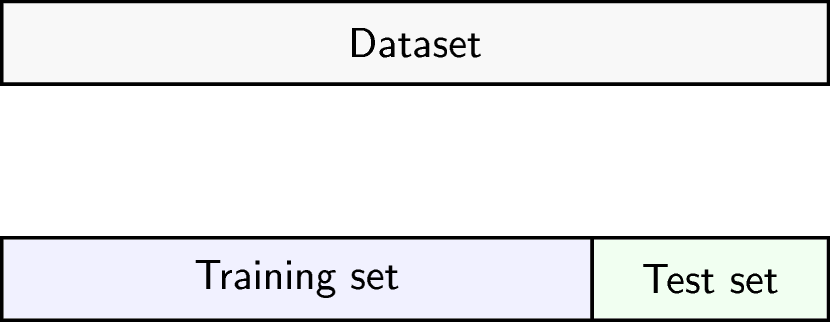

---
# Please do not edit this file directly; it is auto generated.
# Instead, please edit 04-regression-regularisation.md in _episodes_rmd/
title: "Regularised regression with many features"
teaching: 0
exercises: 0
questions:
- "Can we fit a model that accounts for and selects many features?"
- "How does regularisation work?"
- "What are some considerations for a regularised model?"
objectives:
- "Understand the benefits of regularised models."
- "Understand how different types of regularisation work."
- "Apply and critically analyse penalised regression models."
keypoints:
- "Regularisation is a way to avoid the problems of stepwise
  or iterative model building processes."
- "Modelling features together can help to identify a subset of features
  that contribute to the outcome."
math: yes
---

# Introduction

In the previous episode we covered variable selection using stepwise/best subset
selection.
These have issues with respect to computation time and efficiency.
In low noise settings and with few or strong relationships, stepwise/subset
works well. However that's often not what we're faced with in biomedicine.
Often, we have many variables that are all very correlated, with plenty
of noise. For example, if we calculate the Pearson correlation between
each feature in the methylation data seen earlier, we can see that
many of these features essentially represent the same information.

For technical reasons, this correlation can be problematic, and if it's 
very severe it may even make it impossible to fit a model! Furthermore,
if we have many correlated features, it's likely that one of these will
be retained and all others dropped; this can make it more difficult to
infer the mechanisms behind an association.

> ## Collinearity
>
>
{: .callout}

When we fit a linear model, we're finding the line through our data that 
minimises the residual sum of squares.

$$
    \sum_{i=1}^N \hat{y}_i - X\beta
$$

We can think of that as finding
the slope and intercept that minimises the square of the length of the dashed
lines. In this case, the red line is in the left panel is the line that
accomplishes this objective, and the red dot in the right panel is the point 
that represents this line in terms of its slope and intercept among many 
different possible models, where the background colour represents how well
different combinations of slope and intercept accomplish this objective.

This line is the line of best fit through our data when considering this
goal of minimising the sum of squared error. However, it is not the only 
possible line we could use! For example, we might want to err on the side of
caution when estimating effect sizes. That is, we might want to avoid estimating
very large effect sizes.

# Model selection revisited

In the previous lesson we discussed using measures like adjusted $R^2$, AIC and
BIC to show how well the model is learning the data used in fitting the model.
However, this doesn't really tell us how well the model will perform on unseen
data. This is especially important when our goal is prediction.

One thing that happens a lot of the time in this context is that large 
coefficient values minimise the training error, but they don't minimise the 
test error on unseen data.

> ## Exercise
> Do test/training split on methylation data.
>
> > ## Solution
> >
> >
> {: .solution}
{: .challenge}

# Ridge regression

One way to tackle these many correlated variables with lots of noise is
*regularisation*
The idea of regularisation is to add another condition to this to control
the size of the coefficients that come out. 
For example, we might say that the point representing the slope and intercept
must fall within a certain distance of the origin, $(0, 0)$.

One idea is to control the squared sum of the coefficients, $\beta$.
This is also sometimes called the $L^2$ norm. This is defined as

$$
    \left\lVert \beta\right\lVert^2 = \sqrt{\sum_{j=1}^p \beta_j^2}
$$

To control this, we specify that the solution for the equation above
also has to have an $L^2$ norm smaller than a certain amount. Or, equivalently,
we try to minimise a function that includes our $L^2$ norm scaled by a 
factor that is usually written $\lambda$.

$$
    \sum_{i=1}^N y_i - X\beta + \lambda|\beta|_2
$$

# Why ridge?

Can give better accuracy aside from the whole singularity issue.

~~~
coef <- readRDS(here::here("data/coefHorvath.rds"))
methylation <- readRDS(here::here("data/methylation.rds"))
library("SummarizedExperiment")
age <- methylation$Age
methyl_mat <- t(assay(methylation))

coef <- coef[-1, ]
rcoef <- coef[order(coef$CoefficientTrainingShrunk, decreasing = TRUE), ]
rcoef <- rcoef[1:20, ]
features <- rcoef$CpGmarker

train_ind <- sample(nrow(methyl_mat), 25)
train_mat <- methyl_mat[train_ind, features]
train_age <- age[train_ind]
test_mat <- methyl_mat[-train_ind, features]
test_age <- age[-train_ind]

lm_fit <- lm(train_age ~ ., data = as.data.frame(train_mat))

library("glmnet")
ridge_fit <- glmnet(x = train_mat, y = train_age, alpha = 0)
plot(ridge_fit)
~~~
{: .language-r}

Some text.

~~~
pred_lm <- predict(lm_fit, newdata = as.data.frame(test_mat))
err_lm <- sum((test_age - pred_lm)^2)

pred_ridge <- predict(ridge_fit, newx = test_mat)
err_ridge <- apply(pred_ridge, 2, function(col) sum((test_age - col)^2))
min(err_ridge)
~~~
{: .language-r}

~~~
[1] 284.0557
~~~
{: .output}

~~~
err_lm
~~~
{: .language-r}

~~~
[1] 825.9211
~~~
{: .output}

~~~
par(mfrow = 1:2)
plot(test_age, pred_lm,
    pch = 19
)
abline(coef = 0:1, lty = "dashed")
plot(test_age, pred_ridge[, which.min(err_ridge)],
    pch = 19
)
abline(coef = 0:1, lty = "dashed")
~~~
{: .language-r}

~~~
par(mfrow = c(1, 1))
plot(coef(lm_fit), coef(ridge_fit, s = which.min(err_ridge)),
    pch = 19
)
abline(coef = 0:1, lty = "dashed")
~~~
{: .language-r}

More text.

> ## Exercise
> 
> Run `shinystats::ridgeApp()` and play with the parameters
> 
> Questions:
> 
> > ## Solution
> > 
> {: .solution}
{: .challenge}

# LASSO regression

LASSO is another type of regularisation. In this case we use the $L^1$ norm,
or the sum of the absolute values of the coefficients.

$$
    |\beta|_1 = \sqrt{\sum_{j=1}^p \beta_j}
$$

This tends to produce

~~~
lasso <- cv.glmnet(methyl_mat[, -1], age, alpha = 1)
~~~
{: .language-r}

~~~
## Challenge 5:
## one of these...? probably lasso
elastic <- cv.glmnet(methyl_mat[, -1], age, alpha = 0.5, intercept = FALSE)
~~~
{: .language-r}

# Cross-validation

There are various methods to select the "best"
value for $\lambda$. One idea is to split
the data into $K$ chunks. We then use $K-1$ of
these as the training set, and the remaining $1$ chunk
as the test set. Repeating this process for each of the
$K$ chunks produces more variability.

> ## Other types of outcomes
> 
> You may have noticed that `glmnet` is written as `glm`, not `lm`.
> This means we can actually model a variety of different outcomes
> using this regularisation approach. For example, we can model binary
> variables using logistic regression, as shown below.
> 
> In fact, `glmnet` is somewhat cheeky as it also allows you to model
> survival using Cox proportional hazards models, which aren't GLMs, strictly
> speaking.
> 
> 
> ~~~
> smoking <- as.numeric(factor(methylation$smoker)) - 1
> # binary outcome
> smoking
> ~~~
> {: .language-r}
> 
> 
> 
> ~~~
>  [1] 0 0 0 0 0 0 1 0 1 0 0 0 1 0 0 0 0 0 1 1 0 0 1 0 0 1 0 0 0 0 0 0 0 0 0 0 0
> ~~~
> {: .output}
> 
> 
> 
> ~~~
> fit <- cv.glmnet(x = methyl_mat, y = smoking, family = "binomial")
> ~~~
> {: .language-r}
> 
> 
> 
> ~~~
> Warning in lognet(xd, is.sparse, ix, jx, y, weights, offset, alpha, nobs, : one
> multinomial or binomial class has fewer than 8 observations; dangerous ground
> Warning in lognet(xd, is.sparse, ix, jx, y, weights, offset, alpha, nobs, : one
> multinomial or binomial class has fewer than 8 observations; dangerous ground
> Warning in lognet(xd, is.sparse, ix, jx, y, weights, offset, alpha, nobs, : one
> multinomial or binomial class has fewer than 8 observations; dangerous ground
> Warning in lognet(xd, is.sparse, ix, jx, y, weights, offset, alpha, nobs, : one
> multinomial or binomial class has fewer than 8 observations; dangerous ground
> Warning in lognet(xd, is.sparse, ix, jx, y, weights, offset, alpha, nobs, : one
> multinomial or binomial class has fewer than 8 observations; dangerous ground
> Warning in lognet(xd, is.sparse, ix, jx, y, weights, offset, alpha, nobs, : one
> multinomial or binomial class has fewer than 8 observations; dangerous ground
> Warning in lognet(xd, is.sparse, ix, jx, y, weights, offset, alpha, nobs, : one
> multinomial or binomial class has fewer than 8 observations; dangerous ground
> Warning in lognet(xd, is.sparse, ix, jx, y, weights, offset, alpha, nobs, : one
> multinomial or binomial class has fewer than 8 observations; dangerous ground
> Warning in lognet(xd, is.sparse, ix, jx, y, weights, offset, alpha, nobs, : one
> multinomial or binomial class has fewer than 8 observations; dangerous ground
> Warning in lognet(xd, is.sparse, ix, jx, y, weights, offset, alpha, nobs, : one
> multinomial or binomial class has fewer than 8 observations; dangerous ground
> Warning in lognet(xd, is.sparse, ix, jx, y, weights, offset, alpha, nobs, : one
> multinomial or binomial class has fewer than 8 observations; dangerous ground
> ~~~
> {: .warning}
> 
> 
> 
> ~~~
> coef <- coef(fit, s = fit$lambda.1se)
> coef[coef[, 1] != 0, 1]
> ~~~
> {: .language-r}
> 
> 
> 
> ~~~
> [1] -1.455287
> ~~~
> {: .output}
> 
> 
> 
> ~~~
> plot(smoking, methyl_mat[, names(which.max(coef[-1]))])
> ~~~
> {: .language-r}
> 
> 
> 
> ~~~
> Error in xy.coords(x, y, xlabel, ylabel, log): 'x' and 'y' lengths differ
> ~~~
> {: .error}
{: .callout}

Figure taken from [Hastie et al. (2020)](https://doi.org/10.1214/19-STS733).

~~~
knitr::include_graphics("../fig/bs_fs_lasso.png")
~~~
{: .language-r}


