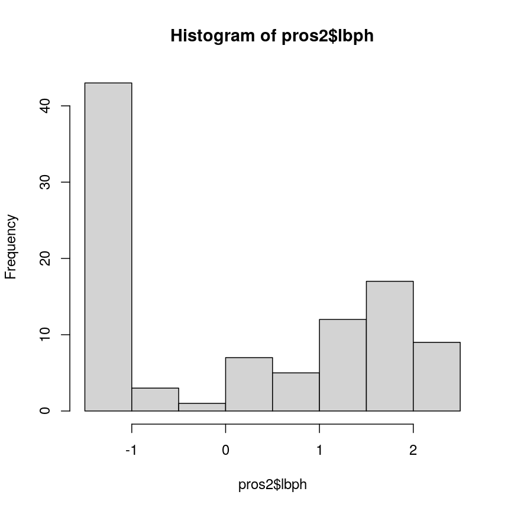
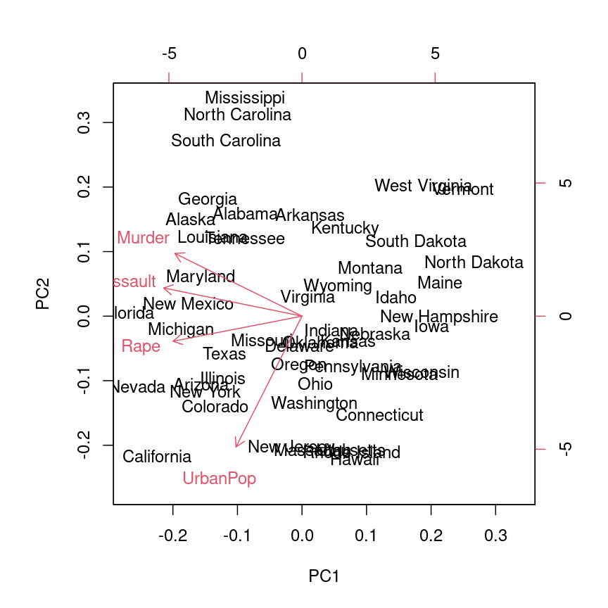
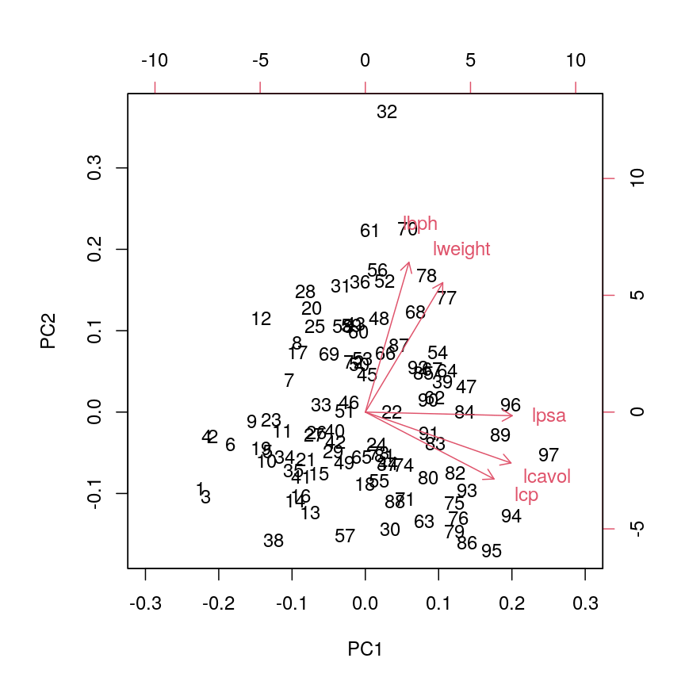
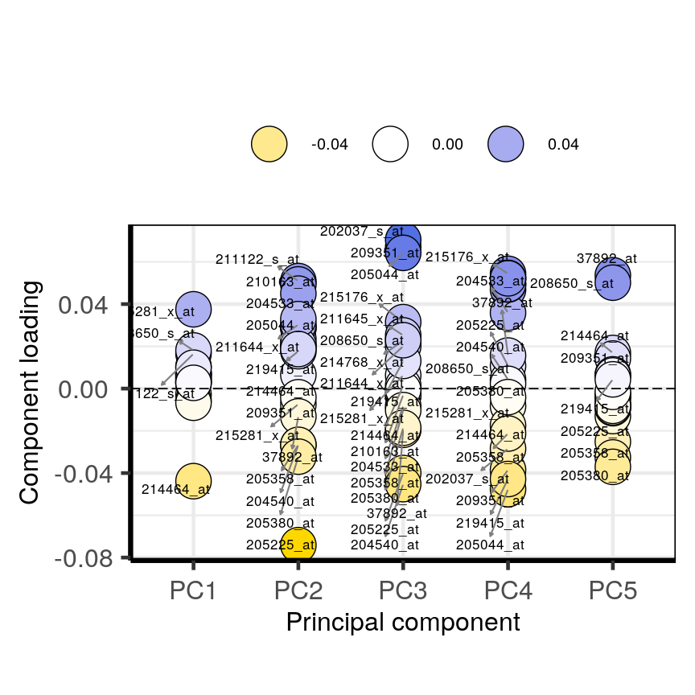
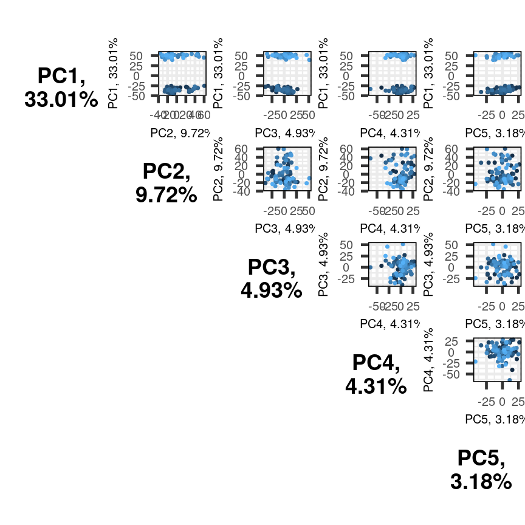

---
# Please do not edit this file directly; it is auto generated.
# Instead, please edit 05-principal-component-analysis.md in _episodes_rmd/
title: "Principle component analysis"
author: "GS Robertson"
teaching: 60
exercises: 30
questions:
- What is principal component analysis and when can it be used?
- What are principal components and loadings?
- How many principal components are needed to explain a significant amount of variation in the data?
- How to interpret output of PCA?
objectives:
- Perform a PCA on high-dimensional data
- Select appropriate number of principal components
- Interpret output of PCA
keypoints:
- A principal component analysis is a statisitcal approach used to reduce dimensionality in high-dimensional datasets (i.e. where *p* is equal or greater than *n*) 
- PCA may be used to create a low-dimensional set of features from a larger set of variables. Examples of when a PCA may be useful include reducing high-dimensional datasets to fewer variables for use in a linear regression and for identifying  groups with similar features
- PCA is a useful dimensionality reduction technique used in the analysis of complex biological datasets (e.g. high throughput data or genetics data)
- The first principal component represents the dimension along which there is maximum variation in the data. Subsequent principal components represent dimensions with progressively less variation.  
- Screeplots and biplots may be used to show i) how much variation in the data is explained by each principal component and ii) how data points cluster according to principal component scores and which variables are associated with these scores

math: yes
---

# Principal component analysis

# Problem statement

Often researchers want to reduce dimensionality in high-dimensional datasets to look for relationships among variables, identify clusters among subgroups of data points and summarise the dataset using a smaller number of representative variables.

Imagine a dataset which contains many variables (*p*), close to the total number of rows in the dataset (*n*). Some of these variables are highly correlated and several form groups which you might expect to represent the same overall effect. Such datasets are challenging to analyse for several reasons, with the main problem being how to reduce dimensionality in the dataset while retaining the important features. 

In this episode we will explore **principal component analysis (PCA)** as a popular method of analysing high-dimensional data. PCA is an unsupervised statistical method which allows large datasets of correlated variables to be summarised into smaller numbers of uncorrelated principal components that explain most of the variability in the original dataset. This is useful, for example, during initial data exploration as it allows correlations among data points to be observed and principal components to be calculated for inclusion in further analysis (e.g. linear regression). An example of PCA might be reducing several variables representing aspects of patient health (blood pressure, heart rate, respiratory rate) into a single feature.

The principal components are single variables which are calculated using a linear combination of several variables from the original dataset (e.g. the clinical variables mentioned in the above example). Many principal components are calculated, each representing different combinations of variables from the original dataset. Principal component scores for each principal component are calculated for each data point in the original dataset. The contribution original variables make to the calculation of principal components is represented in *principal component loadings*.  

PCA is a useful exploratory analysis tool. While plotting each variable against the other may help when exploring correlations between variables, when *p* is large the number of plots needed to examine the data this way quickly become unfeasible, and the amount of total variation in the data represented in each plot is small. PCA allows us to reduce a large number of variables into a few features which represent most of the variation in the original variables. This makes exploration of the original variables easier, although results of PCA require some interpretation first. Graphical tools are available which help us to understand the output of the PCA. 

# Advantages and disadvantages of PCA

Advantages:
* It is a relatively easy to use and population method. 
* Various software/packages are available to run a PCA.
* The calculations used in a PCA are easy to understand for statisticians and non-statisticians alike.

The first principal component is calculated using the equation:
$$Z_1 = a_{11}X_1 + a_{21}X_2 +....+a_{p1}X_p$$

$X_1...X_p$ represents variables in the original dataset and $a_{11}...a_p$ represent principal component loadings, which can be thought of as the degree to which each variable contributes to the calculation of the principal component.

PCA does have some limitations: 
* It assumes that variables in a dataset are correlated 
* It is sensitive to the scale at which input variables are measured (hence the need for standardisation). If input variables a measured at different scales, loadings will be largest for variables with greatest variance which is related to scales of measurement 
* It is not robust against outliers, meaning that very large or small data points can have a large effect on the output of the PCA 
* PCA assumes a linear relationship between variables which is not always a realistic assumption
* It can be difficult to interpret the meaning of the principal components, especially when including them in further analysis (e.g. inclusion in a linear regression).

(Pinned: Supervised vs unsupervised learning)
Most statistical problems fall into one of two categories: supervised or unsupervised learning. Examples of supervised learning problems include linear regression and include analyses in which each observation has both at least one independent variables ($x$) as well as a dependent variable ($y$). In supervised learning problems the aim is to predict the value of the response given future observations or to understand the relationship between the dependent variable and the predictors. In unsupervised learning for each observation there is no dependent variable ($y$), but only a series of independent variables. In this situation there is no need for prediction, as there is no dependent variable to predict (hence the analysis can be thought as being unsupervised by the dependent variable). Instead statistical analysis can be used to understand relationships between the independent variables or between observations themselves. Unsupervised learning problems often occur when analysing high-dimensional datasets in which there is no obvious dependent variable to be predicted, but the analyst would like to understand more about patterns between groups of observations or reduce dimensionality so that a supervised learning process may be used.

> ## Challenge 1 
> (5 mins)
> 
> Descriptions of three datasets and research questions are given below. For which of these might PCA be considered a useful tool for analysing data so that the research questions may be addressed?
> 
> A. An epidemiologist has data collected from different patients admitted to hospital with infectious respiratory disease. They would like to determine whether length of stay in hospital differs in patients with different respiratory diseases.
> B. An online retailer has collected data on user interactions with its online app and has information on the number of times each user interacted with the app, what products they viewed per interaction, and the type and cost of these products. The retailer would like to use this information to predict whether or not a user will be interested in a new product.
> C. A scientist has assayed gene expression levels in 1000 cancer patients and has data from probes targeting different genes in tumour samples from patients. She would like to create new variables representing relative abundance of different groups of genes to i) find out if genes form subgroups based on biological function and ii) use these new variables in a linear regression examining how gene expression varies with disease severity.
> D. All of the above
> 
> > ## Solution
> > C
> {: .solution}
{: .challenge}

A PCA is carried out by calculating a matrix of Pearson's correlations from the original dataset which shows how each of the variables in the dataset relate to each other. This matrix can then be broken down so that the direction and magnitude of the data can be observed (i.e. how strongly variables are related and the direction of this relationship).

The first principal component is the direction of the data along which the observations vary the most. The second principal component is the direction of the data along which the observations show the next highest amount of variation. For example, Figure 1 shows biodiversity index versus percentage area left fallow for 50 farms in southern England. The red line represents the first principal component direction of the data, which is the direction along which there is greatest variability in the data. Projecting points onto this line (i.e. by finding the location on the line closest to the point) would give a vector of points with the greatest possible variance. The next highest amount of variability in the data is represented by the line perpendicular to first regression line which represents the second principal component (green line).

The principal component score for the first principal component is calculated using the equation:
$$Z_{i1} = a_1 \times (fallow_i - \overline{fallow}) + a_2 \times (bio index_i - \overline{bio index})$$

$a_1$ and $a_2$ represent principal component loadings in this equation. A loading can be thought of as the 'weight' each variable has on the calculation of the principal component. 

The second principal component is a linear combination of the variables that is uncorrelated with the first principal component. There are as many principal components as there are variables in your dataset, but as we'll see, some are more useful at explaining your data than others. By definition, the first principal component explains more variation than other principal components.

In the animation below, you can imagine that the black line is a rod and each red dashed line is a spring. The energy of the spring is proportional to its squared length. The direction of the first principal component is the one that minimises the total energy of all of the springs, as the animation below shows. We then use the length of the "springs" as the first principal component.

> ## Challenge 2
> 
> (5 mins)
> 
> Why might it be necessary to standardise variables before performing a PCA?  
> 
> A. To make the results of the PCA interesting
> B. To ensure that variables with different ranges of values contributes equally to analysis
> C. To allow the feature matrix to be calculated faster, especially in cases where there are a lot of input variables
> D. To allow both continuous and categorical variables to be included in the PCA
> E. All of the above
> 
> > ## Solution
> > B
> {: .solution}
{: .challenge}

Can you think of datasets where it might not be necessary to standardise variables? Discuss.

Answer: Datasets which contain continuous variables all measured on the same scale (e.g. gene expression data or RNA sequencing data). 

# Example of PCA using data

(code along episode 15 mins)

The prostate dataset is freely available online and represents data from 97 men who have prostate cancer. The data come from a study which examined the correlation between the level of prostate specific antigen and a number of clinical measures in men who were about to receive a radical prostatectomy. The data have 97 rows and 9 columns.

Columns include lcavol (log-transformed cancer volume), lweight (log-transformed prostate weight), lbph (log-transformed amount of benign prostate enlargement), svi (seminal vesicle invasion), lcp (log capsular penetration; amount of spread of cancer in outer walls of prostate), gleason (Gleason score; grade of cancer cells), pgg45 (percentage Gleason scores 4 or 5), lpsa (log prostate specific antigen; level of PSA in blood). Patient age (in years) is also available in this dataset.   
Here we will calculate principal component scores for each of the rows in this dataset, using five principal components (one for each variable included in the PCA). We will include five clinical variables in our PCA, each of the continuous variables in the prostate dataset, so that we can create fewer variables representing clinical markers of cancer progression. 

First, we will examine the prostate dataset which can be downloaded as part of the lasso2 package

~~~
library(lasso2)
data(Prostate)
View(Prostate)

nrow(Prostate)
~~~
{: .language-r}

~~~
[1] 97
~~~
{: .output}

~~~
head(Prostate)
~~~
{: .language-r}

~~~
      lcavol  lweight age      lbph svi       lcp gleason pgg45       lpsa
1 -0.5798185 2.769459  50 -1.386294   0 -1.386294       6     0 -0.4307829
2 -0.9942523 3.319626  58 -1.386294   0 -1.386294       6     0 -0.1625189
3 -0.5108256 2.691243  74 -1.386294   0 -1.386294       7    20 -0.1625189
4 -1.2039728 3.282789  58 -1.386294   0 -1.386294       6     0 -0.1625189
5  0.7514161 3.432373  62 -1.386294   0 -1.386294       6     0  0.3715636
6 -1.0498221 3.228826  50 -1.386294   0 -1.386294       6     0  0.7654678
~~~
{: .output}

Note that each row of the dataset represents a single patient.

We will create a subset of the data including only clinical variables we want to use in the PCA.

~~~
pros2 <- Prostate[, c(1, 2, 4, 6, 9)]
head(pros2)
~~~
{: .language-r}

~~~
      lcavol  lweight      lbph       lcp       lpsa
1 -0.5798185 2.769459 -1.386294 -1.386294 -0.4307829
2 -0.9942523 3.319626 -1.386294 -1.386294 -0.1625189
3 -0.5108256 2.691243 -1.386294 -1.386294 -0.1625189
4 -1.2039728 3.282789 -1.386294 -1.386294 -0.1625189
5  0.7514161 3.432373 -1.386294 -1.386294  0.3715636
6 -1.0498221 3.228826 -1.386294 -1.386294  0.7654678
~~~
{: .output}

Compare the variances between variables in the dataset.

~~~
apply(pros2, 2, var)
~~~
{: .language-r}

~~~
  lcavol  lweight     lbph      lcp     lpsa 
1.389157 0.246642 2.104840 1.955102 1.332476 
~~~
{: .output}

~~~
hist(pros2$lweight)
~~~
{: .language-r}

~~~
hist(pros2$lbph)
~~~
{: .language-r}

Note that variance is greatest for lbph and lowest for lweight. It is clear from this output that we need to scale each of these variables before including them in a PCA analysis to ensure that differences in variances between variables do not drive the calculation of principal components. In this example we standardise all five variables to have a mean of 0 and a standard deviation of 1. We can do this inside the `prcomp` function in R, which carries out a PCA with centred (around mean = 0) and standardised variables (with a standard deviation of 1). The `prcomp` function carries out a PCA on the input dataset (where the input data are in the form of a matrix).

Next we will carry out a PCA using the `prcomp` function in base R. Note that the scale = TRUE argument is used to standardise the variables to have a mean 0 and standard deviation of 1.

~~~
pca.pros <- prcomp(pros2, scale = TRUE, center = TRUE)

sum(pca.pros$rotation[, 1]^2)
~~~
{: .language-r}

~~~
[1] 1
~~~
{: .output}

The output from the PCA returns:
* Standard deviations of each principal component (i.e. the square roots of the eigenvalues of the covariance/correlation matrix as stated in the `prcomp` helpfile). In this example there are 5 principal components (one for each variable in the dataset).
* The matrix of principal component loadings in which the columns show the principal component loading vectors. Note that the square of values in each column sums to 1 as each loading is scaled so as to prevent a blow up in variance. Larger values in the columns suggest a greater contribution of that variable to the principal component.

~~~
summary(pca.pros)
~~~
{: .language-r}

~~~
Importance of components:
                          PC1    PC2    PC3     PC4    PC5
Standard deviation     1.5649 1.1685 0.7453 0.63629 0.4749
Proportion of Variance 0.4898 0.2731 0.1111 0.08097 0.0451
Cumulative Proportion  0.4898 0.7628 0.8739 0.95490 1.0000
~~~
{: .output}

This returns the proportion of variance in the data explained by each of the (p = 5) principal components. In this example PC1 explains approximately 51% of variance in the data, PC2 26% of variance, PC3 a further 11%, PC4 approximately 8% and PC5 around 5%.

We can use a screeplot to see how much variation in the data is explained by each principal component.

~~~
#variance explained
varExp <- (pca.pros$sdev^2) / sum(pca.pros$sdev^2) * 100
#calculate percentage variance explained using output from the PCA
varDF <- data.frame(Dimensions = 1:length(varExp), varExp = varExp)
#create new dataframe with five rows, one for each principal component
~~~
{: .language-r}

~~~
plot(varDF)
~~~
{: .language-r}

The screeplot shows that the first principal component explains most of the variance in the data (>50%) and each subsequent principal component explains less and less of the total variance. The first two principal components explain >70% of variance in the data. But what do these two principal components mean?

We can better understand what the principal components represent in terms of the original variables by plotting the first two principal components against each other and labelling points by patient number. Clusters of points which have similar principal component scores can be observed using a biplot and the strength and direction of influence different variables have on the calculation of the principal component scores can be observed by plotting arrows representing the loadings onto the graph.
A biplot of the first two principal components can be created as follows:

~~~
stats::biplot(pca.pros, xlim = c(-0.3, 0.3))
~~~
{: .language-r}

This biplot shows the position of each patient on a 2-dimensional plot where weight of loadings can be observed via the red arrows associated with each of the variables. The variables lpsa, lcavol and lcp are associated with positive values on PC1 while positive values on PC2 are associated with the variables lbph and lweight. The length of the arrows indicates how much each variable contributes to the calculation of each principal component.   

The left and bottom axes show normalised principal component scores. The axes on the top and right of the plot are used to interpret the loadings, where loadings are scaled by the standard deviation of the principal components (`pca.pros$sdev`) times square root the number of observations. 

# Making use of different PCA packages for analysing biological data

(code along episode 10 mins)

We will now examine a more complex high-dimensional dataset using the Bioconductor package PCAtools.

PCAtools provides functions for data exploration using PCA and allows the user to produce high quality figures. Functions to apply different methods for choosing appropriate numbers of principal components are available. This PCA package is designed specifically for the analysis of high-dimensional biological data.

We are going to use PCAtools to explore some gene expression microarray data downloaded from the Gene Expression Omnibus (https://www.ncbi.nlm.nih.gov/geo/query/acc.cgi?acc=GSE2990). To compare samples (e.g. those taken from patients with different cancer grades) a microarray analysis can be performed which compares genes expressed in two hybridised samples. The data collected using microarray analysis can be used to create gene expression profiles, which show simultaneous changes in the expression of many genes in response to a particular condition or treatment. The expression of thousands of genes in a sample can be assessed in this way.

The dataset we will be analysing in this lesson includes two subsets of data: 
* a matrix of gene expression data showing microarray results for different probes used to examine gene expression profiles in 91 different breast cancer patient samples.
* metadata associated with the gene expression results detailing information from patients from whom samples were taken.

To start our analysis we will load the PCAtools package from BioConductor. PCAtools provides functions that can be used to explore data via PCA and produce useful figures and analysis tools.

~~~
library("PCAtools")
~~~
{: .language-r}

We will now load the microarray breast cancer gene expression data (and associated metadata) downloaded from the Gene Expression Omnibus (https://www.ncbi.nlm.nih.gov/geo/query/acc.cgi?acc=GSE2990).

~~~
library("SummarizedExperiment")
cancer <- readRDS(here::here("data/cancer_expression.rds"))
mat <- assay(cancer)
metadata <- colData(cancer)

View(mat)
#nrow=22215 probes
#ncol=91 samples
View(metadata)
#nrow=91
#ncol=8
all(colnames(mat) == rownames(metadata))
~~~
{: .language-r}

~~~
[1] TRUE
~~~
{: .output}

~~~
#Check that column names and row names match
#If they do should return TRUE
~~~
{: .language-r}

The 'mat' dataset contains a matrix of gene expression profiles for each sample. Rows represent gene expression variables (as tested for using probes) and columns represent samples. The 'metadata' dataset contains the metadata associated with the gene expression data including the name of the study from which data originate, the age of the patient from which the sample was taken, whether or not an oestrogen receptor was involved in their cancer and the grade and size of the cancer for each sample (represented by rows).

Microarray data are difficult to analyse for several reasons. Firstly, that they are typically high-dimensional and therefore are subject to the same difficulties associated with analysing high dimensional data outlined above (i.e. *p*>*n*, large numbers of rows, multiple possible response variables, curse of dimensionality). Secondly, formulating a research question using microarray data can be difficult, especially if not much is known a priori about which genes code for particular phenotypes of interest. Finally, exploratory analysis, which can be used to help formulate research questions and display relationships, is difficult using microarray data due to the number of potentially interesting response variables (i.e. expression data from probes targeting different genes).

If researchers hypothesise that groups of genes may be associated with different phenotypic characteristics of cancers (e.g. histologic grade, tumour size), using statistical methods that reduce the number of columns in the microarray matrix to a smaller number of dimensions representing groups of genes would help visualise the data and address research questions regarding the effect different groups of genes have on disease progression.

Using the Bioconductor package PCAtools we will apply a PCA to the cancer gene expression data, plot the amount of variation in the data explained by each principal component and plot the most important principal components against each other as well as understanding what each principal component represents.

> # Challenge 3
> 
> (5 mins)
> 
> Apply a PCA to the cancer gene expression data using the `pca` function from PCAtools.  You can use the help files in PCAtools to find out about the `pca` function (type `?pca` in R). Remove the lower 20% of principal components from your PCA using the `removeVar` argument in the `pca` function. As in the example using prostate data above, examine the first 5 rows and columns of rotated data and loadings from your PCA.
> 
> > ## Solution
> > 
> > ~~~
> >                PC1        PC2        PC3        PC4        PC5
> > GSM65752 -29.79105  43.866788   3.255903 -40.663138 15.3427597
> > GSM65753 -37.33911 -15.244788  -4.948201  -6.182795  9.4725870
> > GSM65755 -29.41462   7.846858 -22.880525 -16.149669 22.3821009
> > GSM65757 -33.35286   1.343573 -22.579568   2.200329 15.0082786
> > GSM65758 -40.51897  -8.491125   5.288498  14.007364  0.8739772
> > ~~~
> > {: .output}
> > 
> > 
> > 
> > ~~~
> >                     PC1          PC2          PC3        PC4          PC5
> > 206378_at -0.0024680993 -0.053253543 -0.004068209 0.04068635  0.015078376
> > 205916_at -0.0051557973  0.001315022 -0.009836545 0.03992371  0.038552048
> > 206799_at  0.0005684075 -0.050657061 -0.009515725 0.02610233  0.006208078
> > 205242_at  0.0130742288  0.028876408  0.007655420 0.04449641 -0.001061205
> > 206509_at  0.0019031245 -0.054698479 -0.004667356 0.01566468  0.001306807
> > ~~~
> > {: .output}
> > 
> > 
> > 
> > ~~~
> > [1] 49
> > ~~~
> > {: .output}
> > 
> > 
> > 
> > ~~~
> >                    PC1          PC2         PC3          PC4          PC5
> > 215281_x_at 0.03752947 -0.007369379 0.006243377 -0.008242589 -0.004783206
> >                    PC6          PC7         PC8         PC9          PC10
> > 215281_x_at 0.01194012 -0.002822407 -0.01216792 0.001137451 -0.0009056616
> >                    PC11          PC12       PC13         PC14          PC15
> > 215281_x_at -0.00196034 -0.0001676705 0.00699201 -0.002897995 -0.0005044658
> >                      PC16        PC17         PC18        PC19         PC20
> > 215281_x_at -0.0004547916 0.002277035 -0.006199078 0.002708574 -0.006217326
> >                   PC21        PC22        PC23        PC24        PC25
> > 215281_x_at 0.00516745 0.007625912 0.003434534 0.005460017 0.001477415
> >                    PC26         PC27          PC28         PC29       PC30
> > 215281_x_at 0.002350428 0.0007183107 -0.0006195515 0.0006349803 0.00413627
> >                     PC31        PC32         PC33         PC34         PC35
> > 215281_x_at 0.0001322301 0.003182956 -0.002123462 -0.001042769 -0.001729869
> >                     PC36        PC37        PC38          PC39        PC40
> > 215281_x_at -0.006556369 0.005766949 0.002537993 -0.0002846248 -0.00018195
> >                      PC41        PC42         PC43          PC44         PC45
> > 215281_x_at -0.0007970789 0.003888626 -0.008210075 -0.0009570174 0.0007998935
> >                      PC46         PC47        PC48        PC49         PC50
> > 215281_x_at -0.0006931441 -0.005717836 0.005189649 0.002591188 0.0007810259
> >                    PC51        PC52         PC53         PC54        PC55
> > 215281_x_at 0.006610815 0.005371134 -0.001704796 -0.002286475 0.001365417
> >                    PC56         PC57        PC58         PC59         PC60
> > 215281_x_at 0.003529892 0.0003375981 0.009895923 -0.001564423 -0.006989092
> >                    PC61        PC62         PC63          PC64        PC65
> > 215281_x_at 0.000971273 0.001345406 -0.003575415 -0.0005588113 0.006516669
> >                     PC66        PC67       PC68         PC69        PC70
> > 215281_x_at -0.008770186 0.006699641 0.01284606 -0.005041574 0.007845653
> >                    PC71        PC72         PC73         PC74        PC75
> > 215281_x_at 0.003964697 -0.01104367 -0.001506485 -0.001583824 0.003798343
> >                    PC76         PC77         PC78         PC79          PC80
> > 215281_x_at 0.004817252 -0.001290033 -0.004402926 -0.003440367 -0.0001646198
> >                    PC81        PC82          PC83         PC84        PC85
> > 215281_x_at 0.003923775 0.003179556 -0.0004388192 9.664648e-05 0.003501335
> >                    PC86        PC87          PC88         PC89         PC90
> > 215281_x_at -0.00112973 0.006489667 -0.0005039785 -0.004296355 -0.002751513
> >                    PC91
> > 215281_x_at -0.01747638
> > ~~~
> > {: .output}
> > 
> > 
> > 
> > ~~~
> > [1] 27
> > ~~~
> > {: .output}
> > 
> > 
> > 
> > ~~~
> >                    PC1        PC2          PC3        PC4          PC5
> > 211122_s_at 0.01649085 0.05090275 -0.003378728 0.05178144 -0.003742393
> >                     PC6         PC7          PC8        PC9        PC10
> > 211122_s_at -0.00543753 -0.03522848 -0.006333521 0.01575401 0.004732546
> >                    PC11        PC12        PC13        PC14       PC15
> > 211122_s_at 0.004687599 -0.01349892 0.005207937 -0.01731898 0.02323893
> >                    PC16       PC17        PC18       PC19        PC20
> > 211122_s_at -0.02069509 0.01477432 0.005658529 0.02667751 -0.01333503
> >                     PC21        PC22       PC23         PC24        PC25
> > 211122_s_at -0.003254036 0.003572342 0.01416779 -0.005511838 -0.02582847
> >                   PC26        PC27       PC28        PC29       PC30      PC31
> > 211122_s_at 0.03405417 -0.01797345 0.01826328 0.005123959 0.01300763 0.0127127
> >                    PC32       PC33       PC34        PC35        PC36
> > 211122_s_at 0.002477672 0.01933214 0.03017661 -0.01935071 -0.01960912
> >                    PC37        PC38        PC39        PC40       PC41
> > 211122_s_at 0.004411188 -0.01263612 -0.02019279 -0.01441513 -0.0310399
> >                    PC42         PC43        PC44        PC45        PC46
> > 211122_s_at -0.02540426 0.0007949801 -0.00200195 -0.01748543 0.006881834
> >                    PC47         PC48        PC49         PC50        PC51
> > 211122_s_at 0.006690698 -0.004000732 -0.02747926 -0.006963189 -0.02232332
> >                      PC52        PC53        PC54        PC55       PC56
> > 211122_s_at -0.0003089115 -0.01604491 0.005649511 -0.02629501 0.02332997
> >                    PC57        PC58        PC59        PC60         PC61
> > 211122_s_at -0.01248022 -0.01563245 0.005369433 0.009445262 -0.005209349
> >                   PC62       PC63       PC64        PC65        PC66
> > 211122_s_at 0.01787645 0.01629425 0.02457665 -0.02384242 0.002814479
> >                     PC67        PC68         PC69         PC70       PC71
> > 211122_s_at 0.0004584731 0.007939733 -0.009554166 -0.003967123 0.01825668
> >                    PC72        PC73        PC74        PC75        PC76
> > 211122_s_at -0.00580374 -0.02236727 0.001295688 -0.02264723 0.006855855
> >                    PC77         PC78       PC79         PC80        PC81
> > 211122_s_at 0.004995447 -0.008404118 0.00442875 -0.001027912 0.006104406
> >                    PC82        PC83         PC84       PC85       PC86
> > 211122_s_at -0.01988441 0.009667348 -0.008248781 0.01198369 0.01221713
> >                     PC87        PC88        PC89        PC90        PC91
> > 211122_s_at -0.003864842 -0.02876816 -0.01771452 -0.02164973 -0.02164521
> > ~~~
> > {: .output}
> {: .solution}
{: .challenge}

This function is used to carry out a PCA in PCAtools and uses as inputs a matrix containing continuous numerical data in which rows are data variables and columns are samples, and metadata associated with the matrix in which rows represent samples and columns represent data variables. The `pca` function has options to centre or scale the input data before a PCA is performed, although in this case gene expression data do not need to be transformed prior to PCA being carried out as variables are measured on a similar scale (values are comparable between rows). The output of the `pca` function includes a lot of information such as loading values for each variable (probe), principal components and amount of variance explained by each principal component.

Rotated data shows principal component scores for each sample and each principal component. Loadings show principal component loading (or weight) each probe makes to each principal component. 

As in the example using the prostate dataset we can use a screeplot to compare the proportion of variance in the data explained by each principal component. This allows us to understand how much information in the microarray dataset is lost by projecting the observations onto the first few principal components and whether these principal components represent a reasonable amount of the variation. The proportion of variance explained should sum to one.

> ## Challenge 4
> 
> (5 mins)
> 
> Using the screeplot function in PCAtools, create a screeplot to show proportion of variance explained by each principal component. Explain the output of the screeplot in terms of proportion of variance in data explained by each principal component.
> 
> > ## Solution
> > 
> > 
> > ~~~
> > screeplot(pc, axisLabSize = 5, titleLabSize = 8)
> > ~~~
> > {: .language-r}
> > 
> > 
> {: .solution}
{: .challenge}

Note that first principal component (PC1) explains more variation than other principal components (which is always the case in PCA). The screeplot shows that the first principal component only explains ~33% of the total variation in the micrarray data and many principal components explain very little variation. The red line shows the cumulative percentage of explained variation with increasing principal components. Note that in this case 18 principal components are needed to explain over 75% of variation in the data. This is not an unusual result for complex biological datasets including genetic information as clear relationships between groups is sometimes difficult to observe in the data. The screeplot shows that using a PCA we have reduced 91 predictors to 18 in order to explain a significant amount of variation in the data. See additional arguments in screeplot function for improving the appearance of the plot.

There are no clear guidelines on how many principal components should be included in PCA: your choice depends on the total variability of the data and the size of the dataset. We often look at the 'elbow’ on the screeplot above as an indicator that the addition of principal components does not drastically contribute to explain the remaining variance or choose an arbitory cut off for proportion of variance explained.

Once the most important principal components have been identified using the screeplot, these can be explored in more detail by plotting principal components against each other and highlighting points based on variables in the metadata. This will allow any potential clustering of points according to demographic or phenotypic variables to be seen.

We can use these plots, called biplots, to look for patterns in the output from the PCA. 

> ## Challenge 5
> (5 mins)
> 
> Create a biplot of the first two principal components from your PCA (using `biplot` function in PCAtools - see helpfile for arguments) and determine whether samples cluster based on variables in metadata. Explain you results.
> 
> > ## Solution
> > 
> > 
> > ~~~
> > PCAtools::biplot(pc, lab = NULL, colby = 'Grade', legendPosition = 'top')
> > ~~~
> > {: .language-r}
> > 
> > 
> > 
> > ~~~
> > #Find genes associated with probe labels on loadings
> > #This may be included as part of the challenge?
> > ~~~
> > {: .language-r}
> {: .solution}
{: .challenge}

The biplot shows the position of patient samples relative to PC1 and PC2 in 2-dimensional plot. Note that two groups are apparent along the PC1 axis according to expressions of different genes while no separation can be seem along the PC2 axis. Labels of patient samples are automatically added in the biplot. The weight of loadings (i.e. how much each loading contributes to each PC) can be added to the plot. Labels for each sample are added by default, by can be removed if there is too much overlap in names. Sizes of labels, points and axes can be changed (see help file).

Note that PCAtools does not scale biplot in the same way as biplot using the stats package.

~~~
PCAtools::biplot(pc, lab = rownames(pc$metadata), pointSize = 1, labSize = 1)
~~~
{: .language-r}

~~~
Warning: ggrepel: 7 unlabeled data points (too many overlaps). Consider
increasing max.overlaps
~~~
{: .warning}

~~~
plotloadings(pc, labSize = 3)
~~~
{: .language-r}

~~~
Warning: ggrepel: 42 unlabeled data points (too many overlaps). Consider
increasing max.overlaps
~~~
{: .warning}

We can see from this plot that there appear to be two separate groups of points that separate on the PC1 axis, but that no other grouping is apparent on other PC axes.

Plotting the loadings shows the magnitude and direction of loadings for each probe on each principal component.

> # Challenge 6:
> 
> (5 mins)
> 
> Use `colby` and `lab` arguments in biplot to explore whether these two groups may cluster by Age or by whether or not the sample expresses the Estrogen Receptor gene (ER+ or ER-).
> 
> > ## Solution
> > 
> > 
> > ~~~
> >   PCAtools::biplot(pc,
> >     lab = paste0(pc$metadata$Age,'years'),
> >     colby = 'ER',
> >     hline = 0, vline = 0,
> >     legendPosition = 'right')
> > ~~~
> > {: .language-r}
> > 
> > 
> > 
> > ~~~
> > Warning: ggrepel: 35 unlabeled data points (too many overlaps). Consider
> > increasing max.overlaps
> > ~~~
> > {: .warning}
> > 
> > 
> {: .solution}
{: .challenge}

It appears that one cluster has more ER+ samples than the other group.

So far we have only looked at a biplot of PC1 versus PC2 which only gives part of the picture. The pairplots function in PCAtools can be used to create multiple biplots including different principal components.

~~~
pairsplot(pc)
~~~
{: .language-r}

Use the components argument in pairsplot to define which principal components will be included in the plot. Default is 5 principal components.

The plots show two apparent clusters involving the first principal component only. No other clusters are found involving other principal components.

# Using PCA output in further analysis

The output of PCA can be used to interpret data or can be used in further analyses. For example, the PCA outputs new variables (principal components) which represent several variables in the original dataset. These new variables are useful for further exploring data, for example comparing prinicpal component scores between groups or including the new variables in linear regressions. Because the principal components are uncorrelated (and independent) they can be included together in a single linear regression. 

(Pinned: Principal component regression)

PCA is often used to reduce large numbers of correlated variables into fewer uncorrelated variables that can then be included in linear regression or other models. This technique allows researchers to examine the effect of several correlated explanatory variables on a single response variable in cases where a high degree of correlation initially prevents them from being included in the same model. This is called principal componenet regression (PCR) and is just one example of how principal components can be used in further analysis of data. When carrying out PCR, the variable of interest (response/dependent variable) is regressed against the principal components calculated using PCA, rather than against each individual explanatory variable from the original dataset. As there as many principal components created from PCA as there are variables in the dataset, we must select which principal components to include in PCR. This can be done by examining the amount of variation in the data explained by each principal component (see above).

# Further reading

James, G., Witten, D., Hastie, T. & Tibshirani, R. (2013) An Introduction to Statistical Learning with Applications in R. 
Chapter 6.3 (Dimension Reduction Methods), Chapter 10 (Unsupervised Learning)

Jolliffe, I.T. & Cadima, J. (2016) Principal component analysis: a review and recent developments. Phil. Trans. R. Soc A 374. http://dx.doi.org/10.1098/rsta.2015.0202 

Johnstone, I.M. & Titterington, D.M. (2009) Statistical challenges of high-dimensional data. Phil. Trans. R. Soc A 367. doi:10.1098/rsta.2009.0159 

PCA: A Practical Guide to Principal Component Analysis
https://www.analyticsvidhya.com/blog/2016/03/pca-practical-guide-principal-component-analysis-python/   

A One-Stop Shop for Principal Component Analysis
https://towardsdatascience.com/a-one-stop-shop-for-principal-component-analysis-5582fb7e0a9c
