---
# Please do not edit this file directly; it is auto generated.
# Instead, please edit 06-non-metric-multidimensional-scaling.md in _episodes_rmd/
title: "Non-metric multi-dimensional scaling"
author: "GS Robertson"
date: "27/07/2021"
teaching: 45
exercises: 15
math: yes
questions:
-  What statistical methods are available to compare communities of species/genes/groups between sites?
- What is non-metric multidimensional scaling and how does it differ from other ordination methods, such as PCA?
-  How is NMDS carried out and how is the fit to the original data assessed?
-  How is the output from NMDS interpreted?
objectives:
- Perform NMDS on high-dimensional community data.
- Select appropriate number of dimensions to carry out NMDS.
- Visualise output of NMDS and interpret results.
keypoints:
- Non-metric multidimensional scaling is a rank-based ordination approach used to describe differences between communities/sites/groups/individuals
- NMDS is different from most other ordination techniques (such as PCA) that calculate many axes/dimensions, but which select a smaller number to plot or carry out further analysis. In NMDS, the user selects the number of dimensions to which to fit the data.
- The fit of the NMDS is assessed using stress, a measure of disagreement between the NMDS output and predicted values from a regression.
- The lower the stress value the better the fit of the NMDS.
- NMDS values can be plotted to identify similarities between groups of data points.
- NMDS is a robust and flexible ordination method capable of using different types of input data. 
---

# Introduction

Researchers often aim to reduce dimensionality in high-dimensional datasets that describe communities of species, microbes or genes in different sites, patients or samples. Such datasets may include different types of data describing the site or patient including both continuous and categorical data. For example, a researcher might be interested in understanding how communities of bacteria in the gut vary among site (see Figure 1) or how genetic composition varies among people.

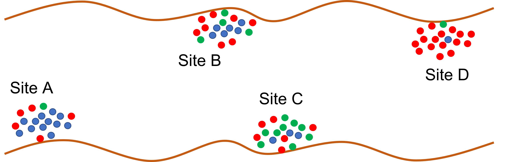

**Non-metric multidimensional scaling (NMDS)** is a popular approach for graphically representing relationships between objects (e.g. plots or samples) in multidimensional space. The goal of NMDS is to reduce information contained within multiple dimensions (e.g. communities, patients, study sites) into a smaller number of dimensions, allowing for easier visualisation and interpretation. NMDS attempts to represent the pairwise dissimilarity between objects in as low-dimensional a space as possible. Because NMDS ranks data points based on their relative similarities (or dissimilarities), this makes it an extremely flexible technique that can incorporate various different types of data.

In other ordination methods, many axes (or in the case of PCA principal components) are calculated whereas in NMDS a number of axes are selected before analysis and the data are explored using these axes only. Rather than being calculated analytically, NMDS is calculated numerically that finds a solution iteratively, only stopping when an acceptable solution has been found or when a user-defined time or iteration level has been reached. Because of the way it is calculated, NMDS does not have a unique solution like other ordination methods and rerunning the analysis produces a slightly different solution. 

# Carrying out NMDS (5 mins)

The abundance of communities of species can be plotted on a single axis (Figure 2). We can add a second axis showing the abundance of communities of a second species (Figure 3). We can then add a third axis representing abundance of communities of a third species. Imagine we have data for abundance of communities of lots of different species. Each requires a separate axis. This becomes impossible to visualise!
NMDS is used to represent abundances of different communities in multidimensional space using a reduced number of dimensions (or axes).

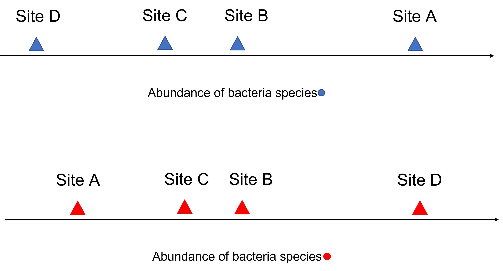

To carry out NMDS, first map the relative positions of sites in multidimensional space (in rank orders). The user then chooses the number of dimensions/axes they would like to use to display the data (more than 3 is difficult to visualise). Next, calculate differences in species abundance between sites and rank on the number of dimensions/axes specified by the user. This configuration of species abundance among sites in reduced dimensions/axes is compared with the true observed distances between sites. The disagreement between ranks of sites according to these two configurations is measured as stress, an index between 0 and 1 in which large disagreements correspond to large stress values.

# Example using data (Code along 15 mins)

In this example we will use the microbiome package from Bioconductor to carry out a NMDS analysis. The microbiome R package allows us to explore and analyse some microbiome profiling data collected from volunteers from different communities. The packages makes use of data from the phyloseq package which stores various datasets on phylogenetic sequencing data which has been organised into Operational Taxonomic Units (OTUs).

We are going to use data collected from participants following western and rural African diets (from O'Keefe et al. 2015).

# Examining the data

Next, load the microbiome data collected as part of 'dietswap' which is available from the phyloseq package. We will also load ggplot2 for data visualiation.
The dataset 'dietswap' contains information from 222 samples and 130 taxa. The data contains phylogenetic sequencing data, as well as information about the people from whom samples were taken and information about the taxonomic groups from which species in the microbiome belong.
A phyloseq object contains OTU table (taxa abundances), sample metadata, taxonomy table (mapping between OTUs and higher-level taxonomic classifications), and phylogenetic tree (relations between the taxa).
These data can be examined using the funtions otu_table, sample_data and tax_table.

~~~
#Load example data for microbiome (phylogenetic sequencing data)
library(microbiome)
library(phyloseq)
library(ggplot2)
data(dietswap)
# Pick core taxa with given prevalence and detection limits
# Filter the phyloseq object to include taxa with defined prevalence
# Pick core taxa with with the given prevalence and detection limits
ds.core <- core(dietswap, detection = 0.1/100, prevalence = 90/100)
# Use relative abundances for the core
ds.core <- microbiome::transform(ds.core, "compositional")

#phylogenetic data (phyloseq-class experimental level object)
#use otu_table to see spp composition table (number of positive tests for spp)
#use sample_data to see metadata for person associated with each sample
summarize_phyloseq(ds.core)
~~~
{: .language-r}

~~~
[[1]]
[1] "1] Min. number of reads = 1"

[[2]]
[1] "2] Max. number of reads = 1"

[[3]]
[1] "3] Total number of reads = 222"

[[4]]
[1] "4] Average number of reads = 1"

[[5]]
[1] "5] Median number of reads = 1"

[[6]]
[1] "7] Sparsity = 0.000321750321750322"

[[7]]
[1] "6] Any OTU sum to 1 or less? YES"

[[8]]
[1] "8] Number of singletons = 64"

[[9]]
[1] "9] Percent of OTUs that are singletons \n        (i.e. exactly one read detected across all samples)0"

[[10]]
[1] "10] Number of sample variables are: 8"

[[11]]
[1] "subject"                "sex"                    "nationality"           
[4] "group"                  "sample"                 "timepoint"             
[7] "timepoint.within.group" "bmi_group"             
~~~
{: .output}

~~~
head(otu_table(ds.core)[, 1:10])
~~~
{: .language-r}

~~~
OTU Table:          [6 taxa and 10 samples]
                     taxa are rows
                                      Sample-1     Sample-2     Sample-3
Akkermansia                       0.0021304296 4.604795e-03 0.0023204267
Alcaligenes faecalis et rel.      0.0001183572 9.494422e-05 0.0001038997
Allistipes et rel.                0.0397680199 2.990743e-03 0.0012467964
Anaerostipes caccae et rel.       0.0288791573 6.503679e-03 0.0009350973
Anaerotruncus colihominis et rel. 0.0014202864 5.126988e-03 0.0070305465
Anaerovorax odorimutans et rel.   0.0007101432 3.465464e-03 0.0010389970
                                      Sample-4     Sample-5     Sample-6
Akkermansia                       0.0193484997 0.0012109330 0.0008111945
Alcaligenes faecalis et rel.      0.0001511602 0.0001153270 0.0001013993
Allistipes et rel.                0.0072556874 0.0028255103 0.0008618941
Anaerostipes caccae et rel.       0.0027208828 0.0013262599 0.0014702900
Anaerotruncus colihominis et rel. 0.0051394452 0.0008649521 0.0018251876
Anaerovorax odorimutans et rel.   0.0045348046 0.0006919617 0.0004562969
                                      Sample-7     Sample-8    Sample-9
Akkermansia                       0.0017778993 0.0013623360 0.002264601
Alcaligenes faecalis et rel.      0.0001367615 0.0000908224 0.000238379
Allistipes et rel.                0.0032138950 0.0022251487 0.001668653
Anaerostipes caccae et rel.       0.0039660832 0.0022251487 0.002741359
Anaerotruncus colihominis et rel. 0.0021198031 0.0018164479 0.002264601
Anaerovorax odorimutans et rel.   0.0030771335 0.0006357568 0.001668653
                                     Sample-10
Akkermansia                       0.0072472171
Alcaligenes faecalis et rel.      0.0004058442
Allistipes et rel.                0.0017973098
Anaerostipes caccae et rel.       0.0016813544
Anaerotruncus colihominis et rel. 0.0417439703
Anaerovorax odorimutans et rel.   0.0018552876
~~~
{: .output}

~~~
head(sample_data(ds.core))
~~~
{: .language-r}

~~~
Sample Data:        [6 samples by 8 sample variables]:
         subject    sex nationality group   sample timepoint
Sample-1     byn   male         AAM    DI Sample-1         4
Sample-2     nms   male         AFR    HE Sample-2         2
Sample-3     olt   male         AFR    HE Sample-3         2
Sample-4     pku female         AFR    HE Sample-4         2
Sample-5     qjy female         AFR    HE Sample-5         2
Sample-6     riv female         AFR    HE Sample-6         2
         timepoint.within.group  bmi_group
Sample-1                      1      obese
Sample-2                      1       lean
Sample-3                      1 overweight
Sample-4                      1      obese
Sample-5                      1 overweight
Sample-6                      1      obese
~~~
{: .output}

~~~
head(tax_table(ds.core))
~~~
{: .language-r}

~~~
Taxonomy Table:     [6 taxa by 3 taxonomic ranks]:
                                  Phylum            Family                    
Akkermansia                       "Verrucomicrobia" "Verrucomicrobia"         
Alcaligenes faecalis et rel.      "Proteobacteria"  "Proteobacteria"          
Allistipes et rel.                "Bacteroidetes"   "Bacteroidetes"           
Anaerostipes caccae et rel.       "Firmicutes"      "Clostridium cluster XIVa"
Anaerotruncus colihominis et rel. "Firmicutes"      "Clostridium cluster IV"  
Anaerovorax odorimutans et rel.   "Firmicutes"      "Clostridium cluster XI"  
                                  Genus                              
Akkermansia                       "Akkermansia"                      
Alcaligenes faecalis et rel.      "Alcaligenes faecalis et rel."     
Allistipes et rel.                "Allistipes et rel."               
Anaerostipes caccae et rel.       "Anaerostipes caccae et rel."      
Anaerotruncus colihominis et rel. "Anaerotruncus colihominis et rel."
Anaerovorax odorimutans et rel.   "Anaerovorax odorimutans et rel."  
~~~
{: .output}

Here we use the `transform` function from the microbiome package to calculate relative abundances of each Genus in the 'dietswap' data. The `transform` argument includes options on how to transform the data. 'Compositional' is used to calculate relative abundance (i.e. proportional abundance). This function returns an object suitable for input into the `ordinate` function which carries out the NMDS.

`otu_table` allows us to see the species composition table which displays the number of positive tests for each species in the participants' samples. `sample_data` shows metadata associated with each sample. `tax_table` returns taxonomic information (phylum, family) for each species identified in patient samples.

Let's examine the phylogenetic structure of the data using function from phyloseq.

~~~
rank_names(ds.core)
~~~
{: .language-r}

~~~
[1] "Phylum" "Family" "Genus" 
~~~
{: .output}

~~~
#Create table showing number of features for each phyla
table(tax_table(ds.core)[, "Phylum"])
~~~
{: .language-r}

~~~

 Actinobacteria   Bacteroidetes      Firmicutes    Fusobacteria  Proteobacteria 
              5              15              62               1              14 
Verrucomicrobia 
              1 
~~~
{: .output}

~~~
#Create table showing number of features for each family
table(tax_table(ds.core)[, "Family"])
~~~
{: .language-r}

~~~

           Actinobacteria                   Bacilli             Bacteroidetes 
                        5                        10                        15 
    Clostridium cluster I   Clostridium cluster III    Clostridium cluster IV 
                        1                         1                        12 
   Clostridium cluster IX    Clostridium cluster XI  Clostridium cluster XIII 
                        7                         2                         1 
 Clostridium cluster XIVa    Clostridium cluster XV   Clostridium cluster XVI 
                       19                         1                         3 
Clostridium cluster XVIII              Fusobacteria            Proteobacteria 
                        2                         1                        14 
 Uncultured Clostridiales     Uncultured Mollicutes           Verrucomicrobia 
                        2                         1                         1 
~~~
{: .output}

~~~
#Create table showing number of read counts (features) for each genus
table(tax_table(ds.core)[, "Genus"])
~~~
{: .language-r}

~~~

                          Akkermansia          Alcaligenes faecalis et rel. 
                                    1                                     1 
                   Allistipes et rel.           Anaerostipes caccae et rel. 
                                    1                                     1 
    Anaerotruncus colihominis et rel.       Anaerovorax odorimutans et rel. 
                                    1                                     1 
                             Bacillus          Bacteroides fragilis et rel. 
                                    1                                     1 
     Bacteroides intestinalis et rel.            Bacteroides ovatus et rel. 
                                    1                                     1 
         Bacteroides plebeius et rel.       Bacteroides splachnicus et rel. 
                                    1                                     1 
        Bacteroides stercoris et rel.         Bacteroides uniformis et rel. 
                                    1                                     1 
         Bacteroides vulgatus et rel.                       Bifidobacterium 
                                    1                                     1 
                    Bilophila et rel.      Bryantella formatexigens et rel. 
                                    1                                     1 
             Bulleidia moorei et rel.        Butyrivibrio crossotus et rel. 
                                    1                                     1 
                        Campylobacter           Clostridium (sensu stricto) 
                                    1                                     1 
        Clostridium cellulosi et rel.           Clostridium colinum et rel. 
                                    1                                     1 
        Clostridium difficile et rel.            Clostridium leptum et rel. 
                                    1                                     1 
           Clostridium nexile et rel.      Clostridium orbiscindens et rel. 
                                    1                                     1 
          Clostridium ramosum et rel.        Clostridium sphenoides et rel. 
                                    1                                     1 
     Clostridium stercorarium et rel.         Clostridium symbiosum et rel. 
                                    1                                     1 
                          Collinsella    Coprobacillus catenaformis et rel. 
                                    1                                     1 
         Coprococcus eutactus et rel.                       Corynebacterium 
                                    1                                     1 
                Desulfovibrio et rel.                             Dialister 
                                    1                                     1 
        Dorea formicigenerans et rel.             Eggerthella lenta et rel. 
                                    1                                     1 
       Enterobacter aerogenes et rel.                          Enterococcus 
                                    1                                     1 
             Escherichia coli et rel.           Eubacterium biforme et rel. 
                                    1                                     1 
     Eubacterium cylindroides et rel.            Eubacterium hallii et rel. 
                                    1                                     1 
          Eubacterium limosum et rel.           Eubacterium rectale et rel. 
                                    1                                     1 
          Eubacterium siraeum et rel.        Eubacterium ventriosum et rel. 
                                    1                                     1 
 Faecalibacterium prausnitzii et rel.                          Fusobacteria 
                                    1                                     1 
                         Helicobacter        Klebisiella pneumoniae et rel. 
                                    1                                     1 
         Lachnobacillus bovis et rel.     Lachnospira pectinoschiza et rel. 
                                    1                                     1 
        Lactobacillus gasseri et rel.       Lactobacillus plantarum et rel. 
                                    1                                     1 
     Lactobacillus salivarius et rel.                           Lactococcus 
                                    1                                     1 
        Megamonas hypermegale et rel.          Megasphaera elsdenii et rel. 
                                    1                                     1 
       Mitsuokella multiacida et rel.                       Oceanospirillum 
                                    1                                     1 
   Oscillospira guillermondii et rel.  Outgrouping clostridium cluster XIVa 
                                    1                                     1 
       Oxalobacter formigenes et rel.   Papillibacter cinnamivorans et rel. 
                                    1                                     1 
   Parabacteroides distasonis et rel.             Peptococcus niger et rel. 
                                    1                                     1 
    Peptostreptococcus micros et rel. Phascolarctobacterium faecium et rel. 
                                    1                                     1 
    Prevotella melaninogenica et rel.             Prevotella oralis et rel. 
                                    1                                     1 
        Prevotella ruminicola et rel.           Prevotella tannerae et rel. 
                                    1                                     1 
                    Propionibacterium                       Proteus et rel. 
                                    1                                     1 
       Roseburia intestinalis et rel.           Ruminococcus bromii et rel. 
                                    1                                     1 
        Ruminococcus callidus et rel.           Ruminococcus gnavus et rel. 
                                    1                                     1 
        Ruminococcus lactaris et rel.            Ruminococcus obeum et rel. 
                                    1                                     1 
       Sporobacter termitidis et rel.           Streptococcus bovis et rel. 
                                    1                                     1 
    Streptococcus intermedius et rel.           Streptococcus mitis et rel. 
                                    1                                     1 
     Subdoligranulum variable at rel.        Sutterella wadsworthia et rel. 
                                    1                                     1 
                   Tannerella et rel.            Uncultured Clostridiales I 
                                    1                                     1 
          Uncultured Clostridiales II                 Uncultured Mollicutes 
                                    1                                     1 
                          Veillonella                                Vibrio 
                                    1                                     1 
                    Weissella et rel.                      Yersinia et rel. 
                                    1                                     1 
~~~
{: .output}

The function `rank_names` returns the taxonomic levels contained within the 'ds.core' data. In this case, we have data from Phylum, Family and Genus. We can examine the number of different Phyla, Families and Genuses in samples using the `tax_table` function as shown above. There are many Genuses, Families and Phyla with only single features. Some are highly over-represented (e.g. the Firmicutes phylum).

# Running NMDS in R

Let's carry out NMDS using the `ordinate` function. 
This function takes phylogenetic sequencing data on which you want to apply your chosen ordination method and specifies the method (in this case, NMDS), number of axes/dimensions (k, in this case 2), the distance measure (in this case, 'bray') and maximum number of iterations before stopping the function.

~~~
# Ordinate the data
set.seed(4000)
ord <- ordinate(ds.core, method = "NMDS",k=2, "bray",trymax=150)
~~~
{: .language-r}

~~~
Run 0 stress 0.1426473 
Run 1 stress 0.1580825 
Run 2 stress 0.1584647 
Run 3 stress 0.1611791 
Run 4 stress 0.1789562 
Run 5 stress 0.15668 
Run 6 stress 0.1640325 
Run 7 stress 0.148614 
Run 8 stress 0.1519784 
Run 9 stress 0.1443964 
Run 10 stress 0.1690908 
Run 11 stress 0.153004 
Run 12 stress 0.1426428 
... New best solution
... Procrustes: rmse 0.000483717  max resid 0.004997887 
... Similar to previous best
Run 13 stress 0.1616122 
Run 14 stress 0.1602666 
Run 15 stress 0.143847 
Run 16 stress 0.1562442 
Run 17 stress 0.15341 
Run 18 stress 0.1999476 
Run 19 stress 0.1541285 
Run 20 stress 0.1484817 
Run 21 stress 0.1608378 
Run 22 stress 0.1638227 
Run 23 stress 0.1817737 
Run 24 stress 0.1622664 
*** Solution reached
~~~
{: .output}

~~~
#trymax increases the number of iterations until a solution is found
#k refers to number of axes (dimensions - user defined). A lower number of axes is simpler and easier to visualise but gives higher stress (poorer fit)
#stress 0.1-0.2 is an ok fit, but not great
~~~
{: .language-r}

Notice how changing the value of `set.seed` gives a slightly different value of stress of the solution. This is because the solution to NMDS is calculated using different random starting data configurations, so it gives a slightly different answer each time. The `ordinate` function stops when the minimum value of stress is found. `set.seed` allows the same result to be returned each time the code is run, even though there is a random element to reaching the solution. 

We have defined the number of axes (or dimensions) that we would like our data to be reduced to, as it is easy to visual our data in two dimensions. However, the data might not fit this number of dimensions very well and the amount of information lost by reducing abundances of all the genuses to a couple of dimensions may be too great.

We can use the stress value to find out how well our data can be summarised using only two dimensions. Stress is a measure of the disagreement between the data configuration created used two dimensions and predicted values from a regression between distances calculated using this configuration and observed distances of rank orders. As in life, low values of stress are preferred. Lower stress values indicate greater conformity and therefore are desirable. If stress is high, repositioning the points in two dimensions may help to reduce stress. In general, stress <0.1 is great, <0.2 is good and >0.3 provides a poor representation of the data in the number of dimensions selected.

> ## Challenge 1 (2 mins)
> 
> What do you think we could do to reduce stress if the overall solution of the ordinate function had a stress solution greater than 0.3? Discuss in groups
> 
> > ## Solution
> > 
> > Increase number of dimensions (k). If the stress value is higher, it is advisable to include an additional dimension, but remember that human brains are not very well equipped to visualise objects in more than 2-dimensions.
> {: .solution}
{: .challenge}

We can use a Shepard plot from the vegan package to assess if our NMDS has produced an accurate visualisation. It plots distances calculated using NMDS against dissimilarity in our original data. It also gives two goodness-of-fit measures: non-metric fit (calculated using stress value) and linear fit (squared correlation between fitted values on line and ordination distances). Closer to one means a better fit.

~~~
library(vegan)
stressplot(ord)
~~~
{: .language-r}

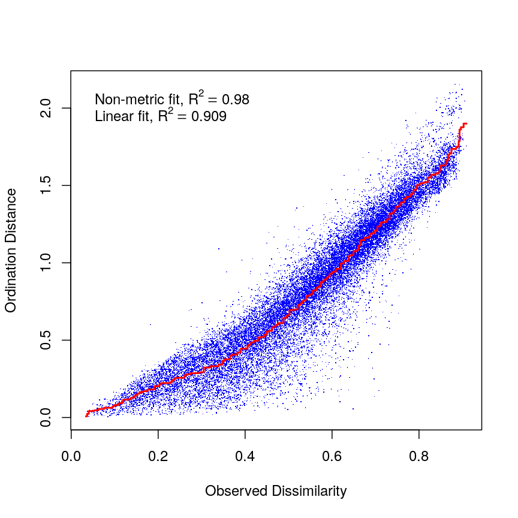

This stressplot suggests that the NMDS fitted on two dimensions fits the original data well.

> ## Challenge 2 (5 mins)
> 
> Identify the lowest value of k that gives the best stress value for NMDS using the microbiome data (ds.core). Think about getting a low stress value as well as creating results that can be easily visualised and interpreted. Use the function stressplot to examine how distribution around the regression line changes with increases in k. Use what you have learned to decide on best number of dimensions to include in NMDS analysis of the microbiome data. Use `set.seed(1000)` for k values greater than 2 to allow for convergence.
> 
> > ## Solution
> > 
> > 
> > ~~~
> > ## Ordinate the data
> > set.seed(1000)
> > ord <- ordinate(ds.core, method = "NMDS",k=4, "bray",trymax=150)
> > ~~~
> > {: .language-r}
> > 
> > 
> > 
> > ~~~
> > Run 0 stress 0.0688331 
> > Run 1 stress 0.06958135 
> > Run 2 stress 0.0689553 
> > ... Procrustes: rmse 0.005872248  max resid 0.05843999 
> > Run 3 stress 0.06958234 
> > Run 4 stress 0.06998722 
> > Run 5 stress 0.07180568 
> > Run 6 stress 0.07039164 
> > Run 7 stress 0.07085392 
> > Run 8 stress 0.06895907 
> > ... Procrustes: rmse 0.006904971  max resid 0.08102637 
> > Run 9 stress 0.07078944 
> > Run 10 stress 0.06956202 
> > Run 11 stress 0.07382995 
> > Run 12 stress 0.07324842 
> > Run 13 stress 0.06962017 
> > Run 14 stress 0.06889305 
> > ... Procrustes: rmse 0.003930006  max resid 0.05685175 
> > Run 15 stress 0.06888851 
> > ... Procrustes: rmse 0.006876936  max resid 0.0808861 
> > Run 16 stress 0.0688348 
> > ... Procrustes: rmse 0.0004083019  max resid 0.002545549 
> > ... Similar to previous best
> > Run 17 stress 0.07046705 
> > Run 18 stress 0.06956713 
> > Run 19 stress 0.07053079 
> > Run 20 stress 0.07194726 
> > Run 21 stress 0.0702962 
> > Run 22 stress 0.07231626 
> > Run 23 stress 0.0696101 
> > Run 24 stress 0.06970453 
> > *** Solution reached
> > ~~~
> > {: .output}
> > 
> > 
> > 
> > ~~~
> > ## trymax increases the number of iterations until a solution is found
> > ## k refers to number of axes (user defined). A lower number of axes is simpler and 
> > ## easier to visualise but gives higher stress (poorer fit)
> > ## stress <0.1 is a great fit
> > 
> > set.seed(1000)
> > ord <- ordinate(ds.core, method = "NMDS",k=3, "bray",trymax=150)
> > ~~~
> > {: .language-r}
> > 
> > 
> > 
> > ~~~
> > Run 0 stress 0.09379872 
> > Run 1 stress 0.1026698 
> > Run 2 stress 0.1002676 
> > Run 3 stress 0.1023272 
> > Run 4 stress 0.09287257 
> > ... New best solution
> > ... Procrustes: rmse 0.01237011  max resid 0.1707368 
> > Run 5 stress 0.09588158 
> > Run 6 stress 0.1093368 
> > Run 7 stress 0.1029276 
> > Run 8 stress 0.1034482 
> > Run 9 stress 0.09738996 
> > Run 10 stress 0.1082283 
> > Run 11 stress 0.1028023 
> > Run 12 stress 0.1036501 
> > Run 13 stress 0.09532804 
> > Run 14 stress 0.102258 
> > Run 15 stress 0.1024873 
> > Run 16 stress 0.1013874 
> > Run 17 stress 0.09505229 
> > Run 18 stress 0.09796259 
> > Run 19 stress 0.1068903 
> > Run 20 stress 0.1066879 
> > Run 21 stress 0.1086129 
> > Run 22 stress 0.100432 
> > Run 23 stress 0.102715 
> > Run 24 stress 0.1071413 
> > Run 25 stress 0.1047762 
> > Run 26 stress 0.09526129 
> > Run 27 stress 0.09958195 
> > Run 28 stress 0.09607154 
> > Run 29 stress 0.1060663 
> > Run 30 stress 0.1075293 
> > Run 31 stress 0.09590724 
> > Run 32 stress 0.09845323 
> > Run 33 stress 0.1082491 
> > Run 34 stress 0.09620151 
> > Run 35 stress 0.1047376 
> > Run 36 stress 0.09496087 
> > Run 37 stress 0.09609119 
> > Run 38 stress 0.1064076 
> > Run 39 stress 0.105015 
> > Run 40 stress 0.09626336 
> > Run 41 stress 0.1028917 
> > Run 42 stress 0.1019894 
> > Run 43 stress 0.09481307 
> > Run 44 stress 0.09446836 
> > Run 45 stress 0.1070549 
> > Run 46 stress 0.09458377 
> > Run 47 stress 0.1038932 
> > Run 48 stress 0.09983303 
> > Run 49 stress 0.1001508 
> > Run 50 stress 0.09829187 
> > Run 51 stress 0.09990176 
> > Run 52 stress 0.1085232 
> > Run 53 stress 0.09551422 
> > Run 54 stress 0.0977556 
> > Run 55 stress 0.09406389 
> > Run 56 stress 0.1041708 
> > Run 57 stress 0.0963039 
> > Run 58 stress 0.09624402 
> > Run 59 stress 0.09865697 
> > Run 60 stress 0.1061679 
> > Run 61 stress 0.1027311 
> > Run 62 stress 0.1059518 
> > Run 63 stress 0.1066049 
> > Run 64 stress 0.09887407 
> > Run 65 stress 0.09469729 
> > Run 66 stress 0.1066662 
> > Run 67 stress 0.101879 
> > Run 68 stress 0.09416585 
> > Run 69 stress 0.09884343 
> > Run 70 stress 0.1046467 
> > Run 71 stress 0.09468667 
> > Run 72 stress 0.09958167 
> > Run 73 stress 0.09539729 
> > Run 74 stress 0.1070031 
> > Run 75 stress 0.09957389 
> > Run 76 stress 0.09495955 
> > Run 77 stress 0.09773001 
> > Run 78 stress 0.106397 
> > Run 79 stress 0.1037537 
> > Run 80 stress 0.09875277 
> > Run 81 stress 0.09479951 
> > Run 82 stress 0.1040475 
> > Run 83 stress 0.09430034 
> > Run 84 stress 0.1064933 
> > Run 85 stress 0.1005868 
> > Run 86 stress 0.1061674 
> > Run 87 stress 0.09729939 
> > Run 88 stress 0.09810385 
> > Run 89 stress 0.1051389 
> > Run 90 stress 0.1032564 
> > Run 91 stress 0.09523564 
> > Run 92 stress 0.09795836 
> > Run 93 stress 0.1012748 
> > Run 94 stress 0.09966816 
> > Run 95 stress 0.09287379 
> > ... Procrustes: rmse 0.000348827  max resid 0.003927931 
> > ... Similar to previous best
> > Run 96 stress 0.1056731 
> > *** Solution reached
> > ~~~
> > {: .output}
> > 
> > 
> > 
> > ~~~
> > stressplot(ord)
> > ~~~
> > {: .language-r}
> > 
> > 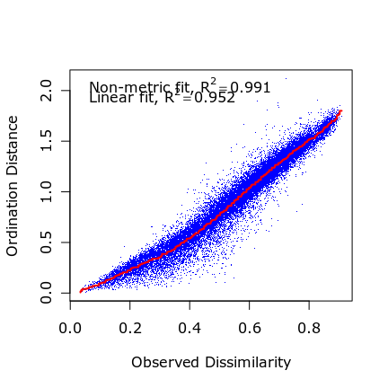
> > 
> > ~~~
> > ## 3 dimensions is easier to visualise than 4 dimensions and gives good enough fit
> > ## Stress is <0.1 when k=3 giving best solution for number of dimensions which is easy to visualise
> > ~~~
> > {: .language-r}
> {: .solution}
{: .challenge}

# Code along (5 mins)

NMDS analysis does two things:
* creates a dissimilarity matrix (method specified by the user) that measures the similarity between every pair of samples (in this case, 222 samples of species abundance from the microbiome data)
* creates an ordination plot from the dissimilarity matrix

We can get the values NMDS has calculated for the dissimilarity matrix for each of the user-specified axes using:

~~~
head(ord$points)
~~~
{: .language-r}

~~~
               MDS1       MDS2         MDS3
Sample-1 -0.6944678 -0.3358325 -0.146610850
Sample-2  0.1917433  0.4230776 -0.005082133
Sample-3  0.4922274  0.0336472 -0.008231960
Sample-4 -0.3730962  0.7517736 -0.218845078
Sample-5  0.6479681 -0.1407363  0.109727771
Sample-6  0.7172035 -0.1867499  0.129067262
~~~
{: .output}

We can also see the score associated with each genus in ds.core.

~~~
head(ord$species)
~~~
{: .language-r}

~~~
                                        MDS1       MDS2        MDS3
Akkermansia                       -0.5384262  0.1430608 -0.41560373
Alcaligenes faecalis et rel.      -0.4204429 -0.3244718 -0.16160293
Allistipes et rel.                -0.7164758 -0.3335269 -0.20523172
Anaerostipes caccae et rel.       -0.5278467 -0.1341668  0.06741638
Anaerotruncus colihominis et rel. -0.1171632  0.4444919  0.01746933
Anaerovorax odorimutans et rel.   -0.1625668  0.3333850  0.02398548
~~~
{: .output}

Non-metric multidimensional scaling can be used to create an ordination plot from any measure of similarity or dissimilarity among samples. Such plots are useful for visualising relationships between data points, taking into account the various different variables recorded for each of the 222 samples in the microbiome dataset. There are many different methods available for calculating dissimilarity between data points including straight line distance between two points (Euclidean distance) and the Bray-Curtis measure which is better at handling datasets which contain a large proportion of zeros (as in the microbiome dataset).

~~~
plot_ordination(ds.core, ord, color = "group") +
  geom_point(size = 4)
~~~
{: .language-r}

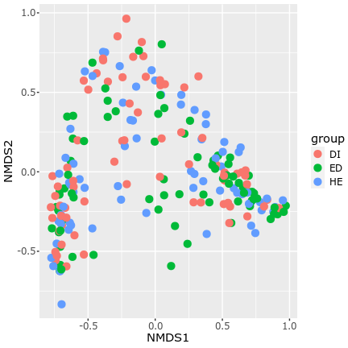

Given that this NMDS solution has 3 dimensions, plot other dimensions. Plot group on each point according to the metadata. Group refers to study group each participant belonged to (3 different home environments thought to affect diet).

~~~
plot_ordination(ds.core, ord, color = "group",axes=c(1,3)) +
  geom_point(size = 4)
~~~
{: .language-r}

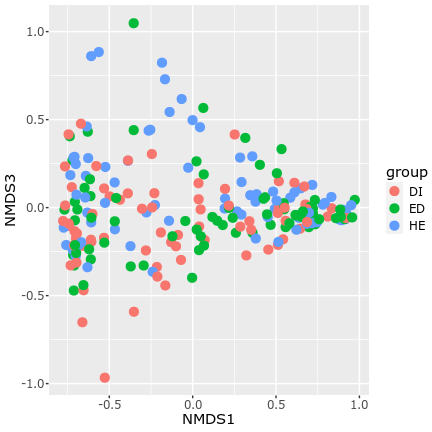

~~~
plot_ordination(ds.core, ord, color = "group",axes=c(2,3)) +
  geom_point(size = 4)
~~~
{: .language-r}

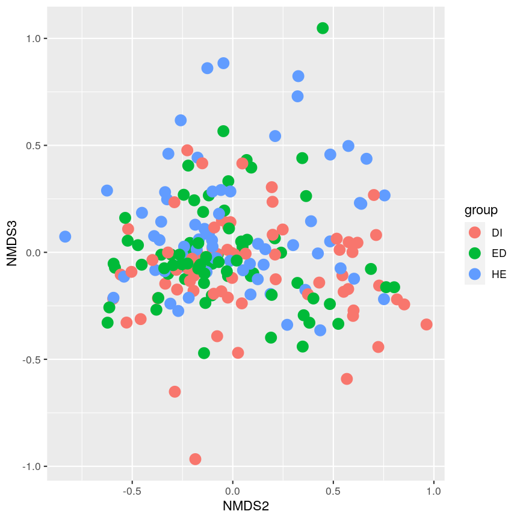

> ## Challenge 3 (3 mins)
> 
> Use the `plot_ordination` function to look for clusters in points on the NMDS axes according to sex, bmi_group and other factors in the metadata. Do any of these factors appear to form clusters?
> 
> 
> > ## Solution
> > 
> > 
> > ~~~
> > plot_ordination(ds.core, ord, color = "bmi_group") +
> >   geom_point(size = 4)
> > ~~~
> > {: .language-r}
> > 
> > 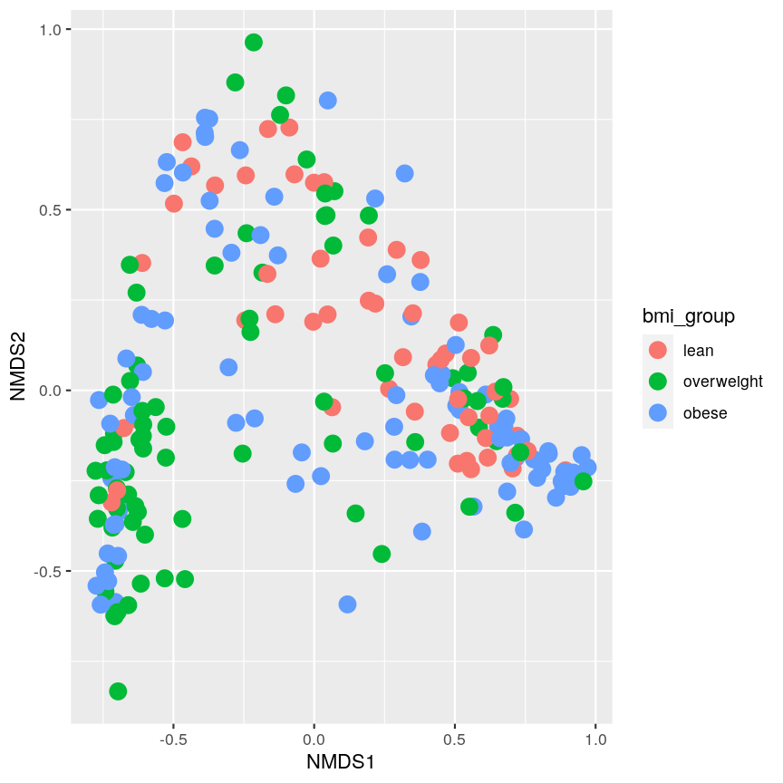
> > 
> > ~~~
> > plot_ordination(ds.core, ord, color = "sex") +
> >   geom_point(size = 4)
> > ~~~
> > {: .language-r}
> > 
> > 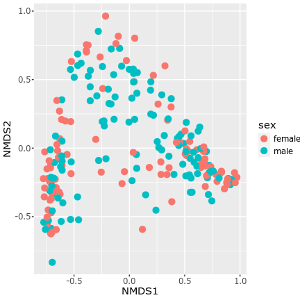
> > 
> > ~~~
> > plot_ordination(ds.core, ord, color = "nationality") +
> >   geom_point(size = 4)
> > ~~~
> > {: .language-r}
> > 
> > 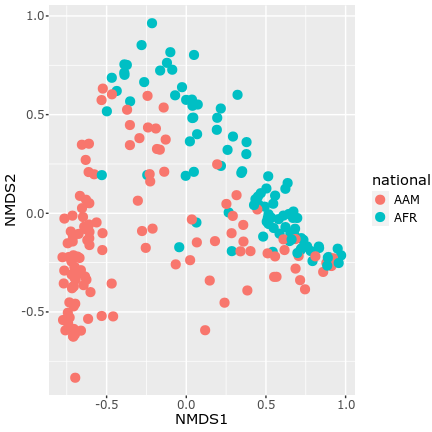
> > 
> > ~~~
> > plot_ordination(ds.core, ord, color = "nationality", axes=c(1,3)) +
> >   geom_point(size = 4)
> > ~~~
> > {: .language-r}
> > 
> > 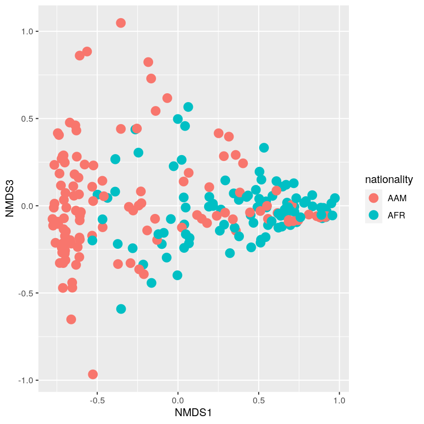
> {: .solution}
{: .challenge}

# Code along (5 mins)

It appears that there are two clusters of points on NMDS axes that cluster according to participant nationality (AAM and AFR), which corresponds to African Americans (AAM) and AFR (rural Africans). This suggests that participants of the same nationality tended to have more similar taxa in their microbiome samples compared with partcipants from the different nationality.

Keep in mind that NMDS is a visualisation of the data and not a statistical test. The process of analyses does produce a dissimilarity matrix which provides indices of how similar (or dissimilar) data points are from each other and these can be used to construct visualisations.

We can improve on the plots produced above by varying the shape of data points by sex, increasing the size of points to make them easier to see, making points slightly more transparent (using the argument `alpha`) and adding a title.

Here we will create two plots, one displaying NMDS axes 1 and 2 and others displaying NMDS axes 1 and 3 and 2 and 3. By plotting all of these we can examine how points relate to each other across all three dimensions that were used in the analysis.

~~~
p <- plot_ordination(ds.core, ord, color="nationality", shape="sex")
p <- p + geom_point(size=4, alpha=0.75)
p <- p + scale_colour_brewer(type="qual", palette="Set1")
p + ggtitle("NMDS on dissimilarity matrix")
~~~
{: .language-r}

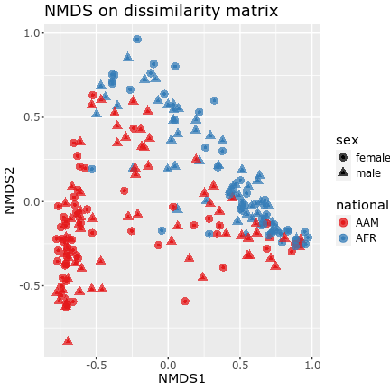

~~~
p <- plot_ordination(ds.core, ord, color="nationality", shape="sex", axes=c(1,3))
p <- p + geom_point(size=4, alpha=0.75)
p <- p + scale_colour_brewer(type="qual", palette="Set1")
p + ggtitle("NMDS on dissimilarity matrix")
~~~
{: .language-r}

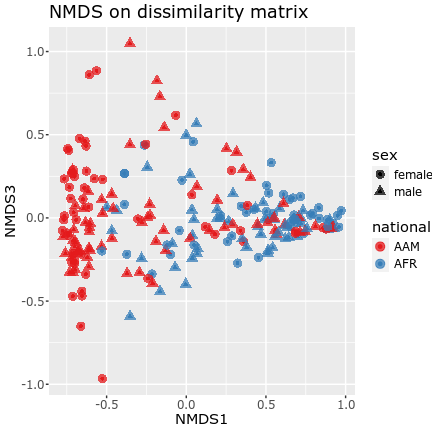

~~~
p <- plot_ordination(ds.core, ord, color="nationality", shape="sex", axes=c(2,3))
p <- p + geom_point(size=4, alpha=0.75)
p <- p + scale_colour_brewer(type="qual", palette="Set1")
p + ggtitle("NMDS on dissimilarity matrix")
~~~
{: .language-r}

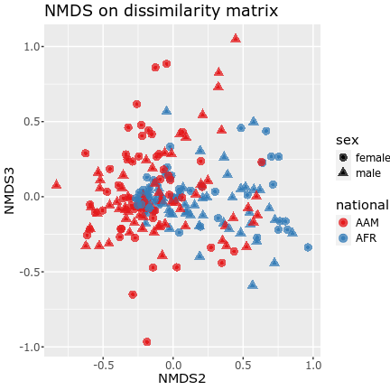

Reading NMDS plots is quite straightforward: objects that are ordinated closer to one another are likely to be more similar than those further apart. However, the scale of the axes and the ordination of the plot do not tell us much in terms of the original data. 

While these three plots are useful for helping us understand how similar data points are to each in terms of microbiome composition, it can be difficult to interpret results from each axis separately. 

We can use a 3D scatterplot to examine all three axes at once using the 'vegan3d' package. We can also colour points by categorical variables in the metadata, such as nationality. In the plot below, black points are African American participants and red points are rural African participants.

~~~
library(vegan3d)
ordiplot3d(ord, col = meta(ds.core)$nationality, angle = 30)
~~~
{: .language-r}

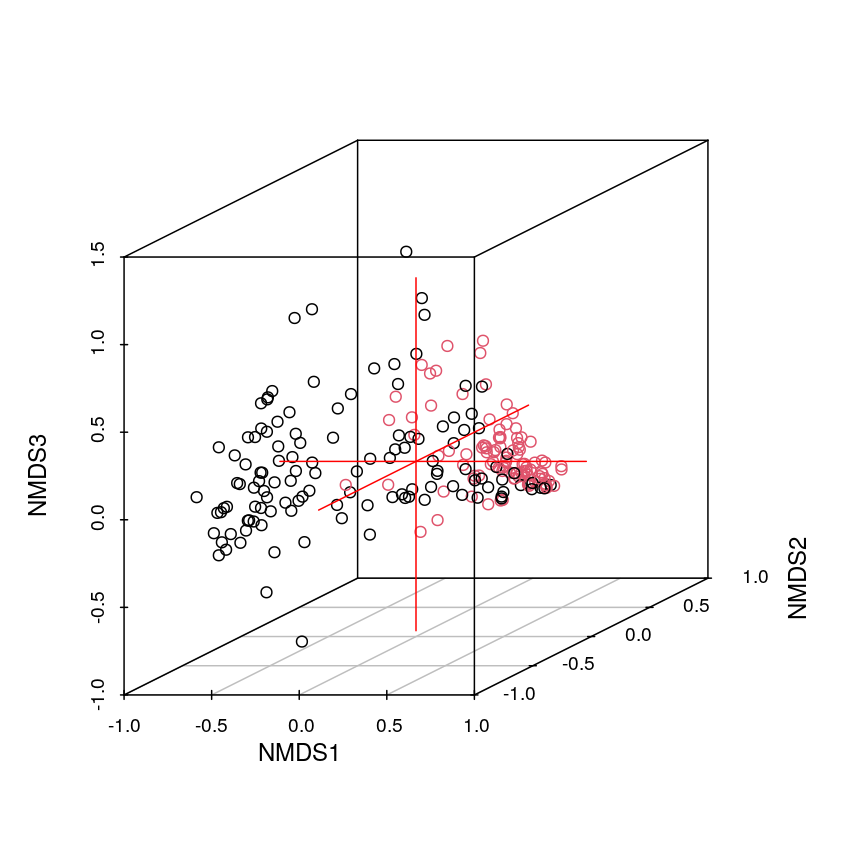

We can see from this plot that it is much easier to visualise the three NMDS dimensions using a 3D scatterplot than it is using a series of three 2D scatterplots. The disadvantage is that the current 3D scatterplot can only be observed from one angle making it difficult to observe some data points. The user can change the angle that the scatterplot is viewed from using the `angle` argument in `ordiplot3d`. 

Visualising output of NMDS analysis can provide important information regarding relationships between samples and clusters according to metadata variables.

> ## Challenge 4 (3 mins)
> 
> What conclusions can you draw from this NMDS analysis? Does there appear to be a difference in the microbiome communities of rural Africans and African Americans? What other factors may be important determinants in diversity of microbiome communities?
> 
> > ## Solution
> > 
> > NMDS analysis using phylogenetic data from the microbiome package shows that there are two clusters of samples with microbe abundances that are more similar within the cluster than they are to other samples in the dataset. No other group in the metadata form clusters as apparent as those of different nationalities.
> {; .solution}
{: .challenge}

# Advantages and disadvantages of NMDS (5 mins)

NMDS has several advantages over other oridination methods, such as PCA and factor analysis.

* Unlike metric-based methods such as PCA, NMDS makes very few assumptions about the data. 
* NMDS allows different types of data (continuous and categorical) to be included in the same analysis (although non-ordinal categorical variables should be converted to binary 'dummy' variables first).
* It allows the dissimilarity matrix to be calculated using different methods (e.g. Euclidean, Bray-Curtis).
* It is robust to problems with data, such as missing distances between points.

However, there are various disadvantges to using NMDS:

* It can be difficult to visualise NMDS results that use more than three dimensions (as identified by comparing stress of NMDS analyses using different numbers of dimensions).
* Like all ordination methods, NMDS lacks an underlying statistical model describing relationships between variables/data points.
* It can be slow to run, especially using large complex datasets.
* NMDS is a numerical optimisation technique and as such it is vulnerable to becoming 'stuck' in solutions that are not the best solution but are comparably better than other local solutions. Running multiple NMDS analyses can reduce the chance of this happening.

# Further reading 

- Holland, S.M. (2008) Non-metric Multidimensional Scaling (MDS).
https://strata.uga.edu/software/pdf/mdsTutorial.pdf
- Lahti, L, Sudarshan, S. et al. Introduction to the microbiome R package. https://microbiome.github.io/tutorials/ 
- Marco-Ramell, A. et al. (2018) Evaluation and comparison of bioinformatic tools for the enrichment analysis of metabolomics data. BMC Bioinformatics 19:1. DOI:10.1186/s12859-017-2006-0 
- O'Keefe, S.J.D. et al. (2015) Fat, fibre and cancer risk in African Americans and rural Africans. Nature Communications 6:6342. DOI:10.1038/ncomms7342 
- Oksanen, J. (2005) Multivariate analysis of Ecological Communities in R.
http://www.pelagicos.net/MARS6910_spring2015/manuals/R_vegan_multivariate.pdf
