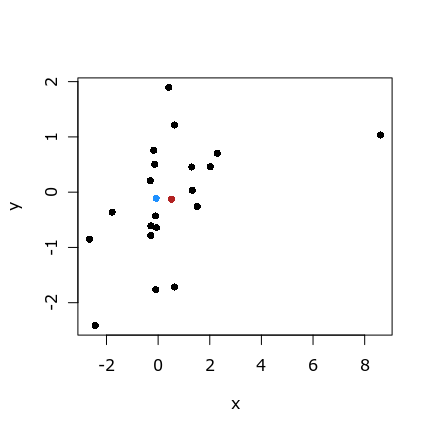
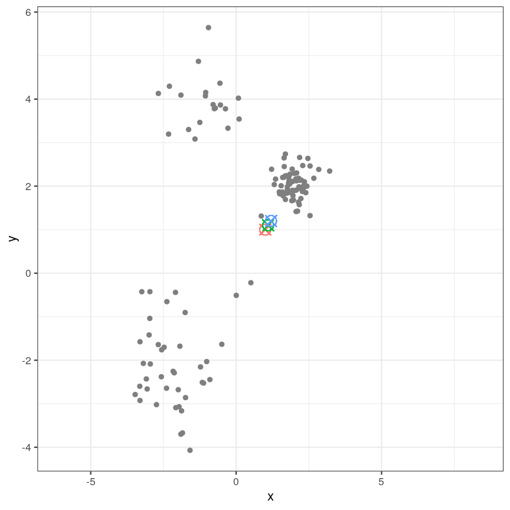
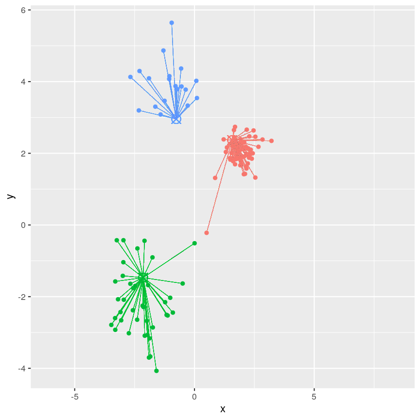
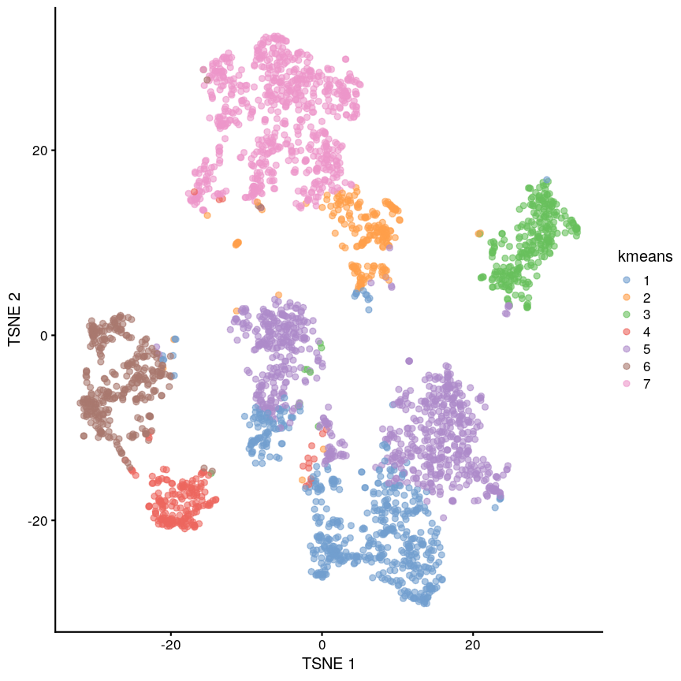

---
# Please do not edit this file directly; it is auto generated.
# Instead, please edit 09-k-means.md in _episodes_rmd/
title: "K-means"
teaching: 0
exercises: 0
questions:
- "What does clustering mean?"
- "Why would we want to find clusters in data?"
- "How can we cluster data with a model?"
- "How can we cluster data without a model?"
- "How can we check if clusters are robust?"
objectives:
- "Understand and perform clustering with K-means, mixture models, and hierarchical clustering."
- "Assess clustering performance with silhouette score and bootstrapping/consensus clustering."
keypoints:
- "KP1"
math: yes
---

# Introduction

High-dimensional data, especially in biological settings, commonly has
many sources of heterogeneity. Some of these are stochastic variation
arising from measurement error or random differences between organisms. In
some cases, this heterogeneity arises from the presence of subgroups in the
data.

~~~
library("SingleCellExperiment")
scrnaseq <- readRDS(here::here("data/scrnaseq.rds"))
set.seed(42)
~~~
{: .language-r}

~~~
library("scater")
scrnaseq <- runPCA(scrnaseq, ncomponents = 15)
scrnaseq <- runTSNE(scrnaseq, dimred = "PCA")
~~~
{: .language-r}

# Choosing the correct clustering

When doing clustering, it's important to realise that data may seem to
group together randomly. It's especially important to remember that when making
plots that add extra visual aids to distinguish clusters. For example, if we
cluster data from a single 2D normal distribution and draw ellipses around the
points, it suddenly is almost visually convincing. This is a somewhat extreme
example, since there is genuinely no heterogeneity in the data, but

# K-means

Generalisation of mixture models to have arbitrary density, just using distance.

~~~
cluster <- kmeans(reducedDim(scrnaseq), centers = 7, iter.max = 1000, nstart = 100)
scrnaseq$kmeans <- as.character(cluster$cluster)

plotReducedDim(scrnaseq, "TSNE", colour_by = "kmeans")
~~~
{: .language-r}

> ## k-medioids (PAM)
> 
> This is like k-means but using the median instead of mean. Median is slower
> but more robust.
>
> 
{: .callout}

# Cluster robustness

We want to be sure that

# Consensus clustering

~~~
library("scater")
library("ConsensusClusterPlus")

library("diceR")
library("viridis")

pc <- reducedDim(scrnaseq)[sample(ncol(scrnaseq), 1000), ]
ccp <- consensus_cluster(pc, reps = 10, nk = 2:10, algorithms = "km")
cm <- consensus_matrix(ccp)
# Heatmap(cm, cluster_rows = FALSE, cluster_columns = FALSE, col = viridis(100))
Heatmap(cm, cluster_rows = TRUE, cluster_columns = TRUE, col = viridis(100))
~~~
{: .language-r}

~~~
Error in Heatmap(cm, cluster_rows = TRUE, cluster_columns = TRUE, col = viridis(100)): could not find function "Heatmap"
~~~
{: .error}

## Further reading

- https://web.stanford.edu/class/bios221/book/Chap-Clustering.html



